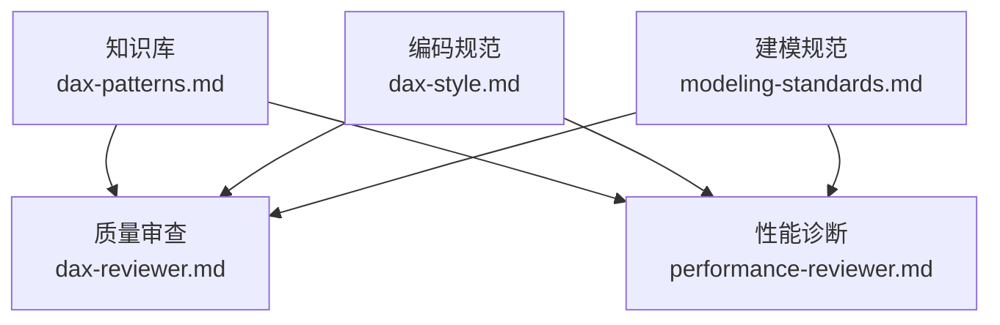
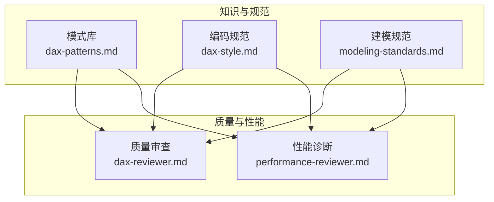
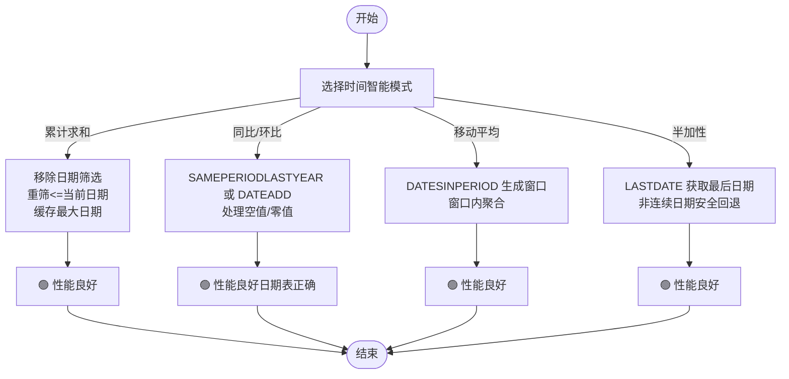
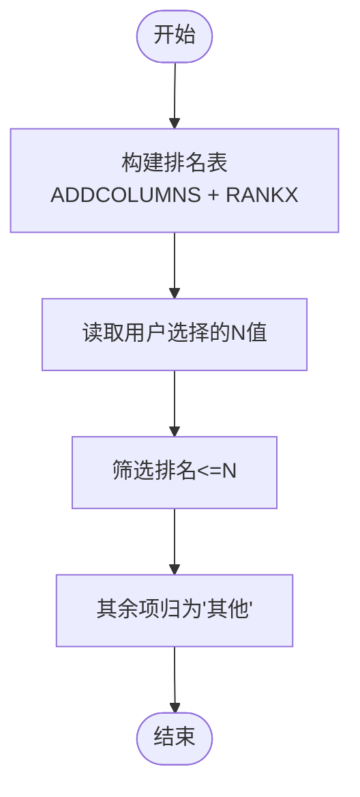
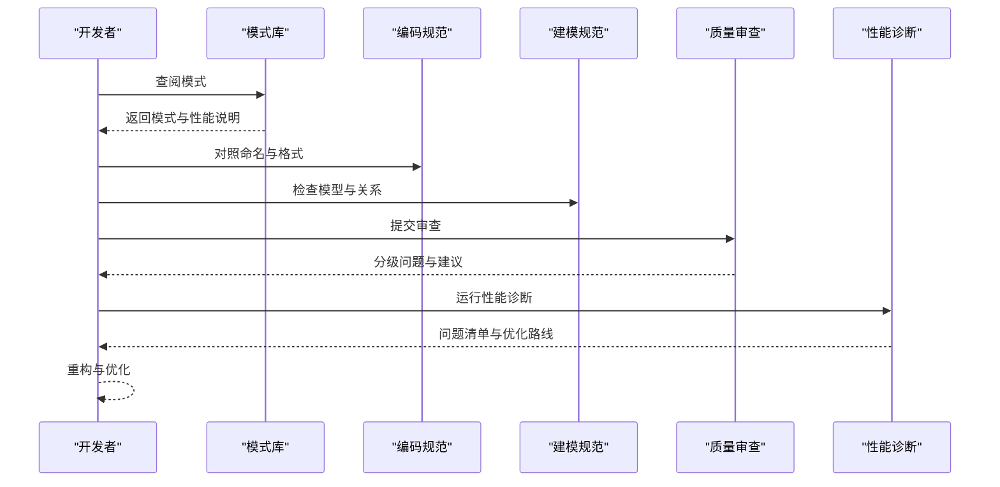
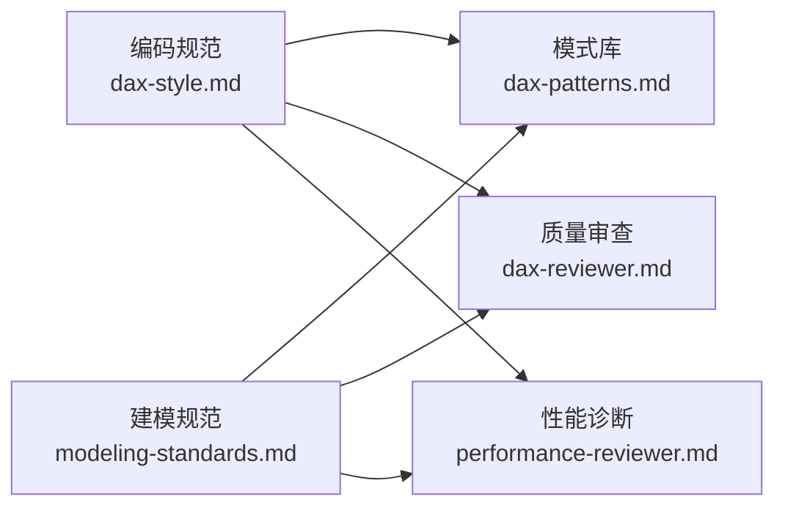

# DAX模式识别与最佳实践

<cite>
**本文档引用的文件**
- [dax-patterns.md](file://powerbi_code_copilot/knowledge/dax-patterns.md)
- [dax-reviewer.md](file://powerbi_code_copilot/agents/dax-reviewer.md)
- [performance-reviewer.md](file://powerbi_code_copilot/agents/performance-reviewer.md)
- [dax-style.md](file://powerbi_code_copilot/rules/dax-style.md)
- [modeling-standards.md](file://powerbi_code_copilot/rules/modeling-standards.md)
</cite>

## 目录
1. [引言](#引言)
2. [项目结构](#项目结构)
3. [核心组件](#核心组件)
4. [架构总览](#架构总览)
5. [详细组件分析](#详细组件分析)
6. [依赖分析](#依赖分析)
7. [性能考量](#性能考量)
8. [故障排除指南](#故障排除指南)
9. [结论](#结论)
10. [附录](#附录)

## 引言
本知识库围绕DAX模式识别与最佳实践，系统整理了常见表达式模式（时间智能、聚合、条件计算）、复杂度量值重构方法、性能优化策略、常见问题与调试技巧，以及模式库的维护与更新机制。目标是帮助建模者与开发者快速定位合适的模式、理解适用场景与性能特征，并形成可复用、可维护的高质量DAX实践。

## 项目结构
该仓库中与DAX相关的核心知识与规则集中在以下文件：
- 模式库：dax-patterns.md，收录了经验证的常用DAX模式，覆盖累计求和、同比/环比、动态TopN、ABC分析、移动平均、半加性度量值等。
- 审查工具：dax-reviewer.md（质量审查）、performance-reviewer.md（性能诊断）。
- 编码规范：dax-style.md（命名、格式、编写原则、禁止事项）。
- 建模规范：modeling-standards.md（星型模型、关系设计、日期表要求、度量值组织）。

**图表来源**
- [dax-patterns.md:1-205](file://powerbi_code_copilot/knowledge/dax-patterns.md#L1-L205)
- [dax-reviewer.md:1-56](file://powerbi_code_copilot/agents/dax-reviewer.md#L1-L56)
- [performance-reviewer.md:1-71](file://powerbi_code_copilot/agents/performance-reviewer.md#L1-L71)
- [dax-style.md:1-218](file://powerbi_code_copilot/rules/dax-style.md#L1-L218)
- [modeling-standards.md:1-88](file://powerbi_code_copilot/rules/modeling-standards.md#L1-L88)

**章节来源**
- [dax-patterns.md:1-205](file://powerbi_code_copilot/knowledge/dax-patterns.md#L1-L205)
- [dax-reviewer.md:1-56](file://powerbi_code_copilot/agents/dax-reviewer.md#L1-L56)
- [performance-reviewer.md:1-71](file://powerbi_code_copilot/agents/performance-reviewer.md#L1-L71)
- [dax-style.md:1-218](file://powerbi_code_copilot/rules/dax-style.md#L1-L218)
- [modeling-standards.md:1-88](file://powerbi_code_copilot/rules/modeling-standards.md#L1-L88)

## 核心组件
- 模式库：提供可直接复用的DAX模式，包含场景、代码、解释与性能说明，便于快速检索与应用。
- 质量审查：定义审查分级（Critical/Important/Minor），聚焦逻辑错误、上下文转换、循环依赖、命名规范、注释与硬编码等问题。
- 性能诊断：提供分层诊断框架（数据源/Power Query/模型/DAX/可视化），输出问题清单与优化路线图。
- 编码规范：统一命名、格式、编写原则与禁止事项，提升可读性与可维护性。
- 建模规范：强调星型模型、关系设计、日期表要求与度量值组织，奠定高性能模型基础。

**章节来源**
- [dax-patterns.md:1-205](file://powerbi_code_copilot/knowledge/dax-patterns.md#L1-L205)
- [dax-reviewer.md:1-56](file://powerbi_code_copilot/agents/dax-reviewer.md#L1-L56)
- [performance-reviewer.md:1-71](file://powerbi_code_copilot/agents/performance-reviewer.md#L1-L71)
- [dax-style.md:1-218](file://powerbi_code_copilot/rules/dax-style.md#L1-L218)
- [modeling-standards.md:1-88](file://powerbi_code_copilot/rules/modeling-standards.md#L1-L88)

## 架构总览
下图展示了模式库、审查与规范之间的协作关系：模式库提供“做什么”，规范与审查工具决定“怎么做”和“是否正确”。

**图表来源**
- [dax-patterns.md:1-205](file://powerbi_code_copilot/knowledge/dax-patterns.md#L1-L205)
- [dax-reviewer.md:1-56](file://powerbi_code_copilot/agents/dax-reviewer.md#L1-L56)
- [performance-reviewer.md:1-71](file://powerbi_code_copilot/agents/performance-reviewer.md#L1-L71)
- [dax-style.md:1-218](file://powerbi_code_copilot/rules/dax-style.md#L1-L218)
- [modeling-standards.md:1-88](file://powerbi_code_copilot/rules/modeling-standards.md#L1-L88)

## 详细组件分析

### 时间智能模式
- 累计求和（Running Total）
  - 场景：按日期维度展示从期初到当前日期的累计值。
  - 实现要点：使用移除筛选器后重筛的方式，避免重复计算；缓存当前最大日期。
  - 性能：性能良好，适合大多数场景。
  - 代码片段路径：[running_total:10-20](file://powerbi_code_copilot/knowledge/dax-patterns.md#L10-L20)

- 同比/环比（YoY/MoM）
  - 场景：计算同比增长率与环比增长率。
  - 实现要点：使用时间智能函数进行对齐；注意处理空值与零值，避免除零。
  - 性能：时间智能函数经引擎优化，前提是日期表正确标记。
  - 代码片段路径：[yoy_mom:37-68](file://powerbi_code_copilot/knowledge/dax-patterns.md#L37-L68)

- 移动平均（Moving Average）
  - 场景：计算N天/月的移动平均值，平滑趋势线。
  - 实现要点：使用日期范围生成函数限定窗口；在窗口内聚合。
  - 性能：性能良好，日期范围函数经过优化。
  - 代码片段路径：[moving_average:148-168](file://powerbi_code_copilot/knowledge/dax-patterns.md#L148-L168)

- 半加性度量值（Semi-Additive Measures）
  - 场景：库存、余额等快照数据，不能跨时间直接求和，需取最后一天的值。
  - 实现要点：使用标量函数定位最后日期；在非连续日期场景下安全回退。
  - 性能：性能良好。
  - 代码片段路径：[semi_additive:180-201](file://powerbi_code_copilot/knowledge/dax-patterns.md#L180-L201)

**图表来源**
- [dax-patterns.md:5-205](file://powerbi_code_copilot/knowledge/dax-patterns.md#L5-L205)

**章节来源**
- [dax-patterns.md:5-205](file://powerbi_code_copilot/knowledge/dax-patterns.md#L5-L205)

### 聚合模式
- 动态TopN
  - 场景：根据用户选择的N值，动态展示排名前N的项目，并将其余项目归为“其他”。
  - 实现要点：使用参数表与排名函数；注意维度基数对性能的影响。
  - 性能：中等开销，建议维度基数小于阈值。
  - 代码片段路径：[dynamic_topn:85-100](file://powerbi_code_copilot/knowledge/dax-patterns.md#L85-L100)

- ABC分析（帕累托分析）
  - 场景：将产品/客户按贡献度分为A/B/C三类。
  - 实现要点：计算累计占比并映射类别；在大数据集上可考虑预计算为计算列。
  - 性能：中等开销，嵌套聚合在大表上较慢。
  - 代码片段路径：[abc_analysis:112-136](file://powerbi_code_copilot/knowledge/dax-patterns.md#L112-L136)

**图表来源**
- [dax-patterns.md:80-140](file://powerbi_code_copilot/knowledge/dax-patterns.md#L80-L140)

**章节来源**
- [dax-patterns.md:80-140](file://powerbi_code_copilot/knowledge/dax-patterns.md#L80-L140)

### 条件计算模式
- 条件聚合与分支
  - 建议：使用显式变量缓存中间结果，避免重复计算；在度量值中谨慎使用大型表迭代。
  - 参考：编码规范中的性能优先与上下文清晰原则。
  - 规范参考路径：[条件计算建议:143-162](file://powerbi_code_copilot/rules/dax-style.md#L143-L162)

**章节来源**
- [dax-style.md:143-162](file://powerbi_code_copilot/rules/dax-style.md#L143-L162)

### 复杂度量值重构与优化策略
- 重构思路
  - 分解复杂度量值为多个度量值（基础→中间→最终），提升可读性与可测试性。
  - 使用变量避免重复计算，减少上下文转换开销。
  - 优先使用REMOVEFILTERS替代FILTER(ALL(...))，减少不必要的筛选器传递。
  - 迭代函数在最小粒度表上运行，控制迭代规模。
  - 将可预计算的逻辑迁移到计算列或预处理，降低运行时成本。
- 规范参考路径：[重构与优化原则:143-162](file://powerbi_code_copilot/rules/dax-style.md#L143-L162)

**章节来源**
- [dax-style.md:143-162](file://powerbi_code_copilot/rules/dax-style.md#L143-L162)

### 审查与诊断流程
- 质量审查流程
  - 分级：Critical（阻塞）、Important（应修复）、Minor（建议）。
  - 关注点：逻辑错误、上下文转换、循环依赖、命名规范、注释与硬编码。
  - 输出格式：问题分类、性能评估与优化建议摘要。
  - 参考路径：[质量审查流程:1-56](file://powerbi_code_copilot/agents/dax-reviewer.md#L1-L56)

- 性能诊断流程
  - 分层诊断：数据源/Power Query/模型/DAX/可视化。
  - 输出：整体评级、问题清单（按影响排序）、优化路线图。
  - 参考路径：[性能诊断框架:1-71](file://powerbi_code_copilot/agents/performance-reviewer.md#L1-L71)

**图表来源**
- [dax-patterns.md:1-205](file://powerbi_code_copilot/knowledge/dax-patterns.md#L1-L205)
- [dax-reviewer.md:1-56](file://powerbi_code_copilot/agents/dax-reviewer.md#L1-L56)
- [performance-reviewer.md:1-71](file://powerbi_code_copilot/agents/performance-reviewer.md#L1-L71)
- [dax-style.md:1-218](file://powerbi_code_copilot/rules/dax-style.md#L1-L218)
- [modeling-standards.md:1-88](file://powerbi_code_copilot/rules/modeling-standards.md#L1-L88)

**章节来源**
- [dax-reviewer.md:1-56](file://powerbi_code_copilot/agents/dax-reviewer.md#L1-L56)
- [performance-reviewer.md:1-71](file://powerbi_code_copilot/agents/performance-reviewer.md#L1-L71)
- [dax-style.md:1-218](file://powerbi_code_copilot/rules/dax-style.md#L1-L218)
- [modeling-standards.md:1-88](file://powerbi_code_copilot/rules/modeling-standards.md#L1-L88)

## 依赖分析
- 模式库依赖于建模规范（日期表、关系设计）与编码规范（命名与格式），以确保模式在正确的模型结构与一致的书写风格下运行。
- 质量审查与性能诊断依赖编码规范与建模规范，以提供统一的评估标准。
- 三者共同构成“模式可用性—可维护性—可扩展性”的闭环。

**图表来源**
- [modeling-standards.md:1-88](file://powerbi_code_copilot/rules/modeling-standards.md#L1-L88)
- [dax-style.md:1-218](file://powerbi_code_copilot/rules/dax-style.md#L1-L218)
- [dax-patterns.md:1-205](file://powerbi_code_copilot/knowledge/dax-patterns.md#L1-L205)
- [dax-reviewer.md:1-56](file://powerbi_code_copilot/agents/dax-reviewer.md#L1-L56)
- [performance-reviewer.md:1-71](file://powerbi_code_copilot/agents/performance-reviewer.md#L1-L71)

**章节来源**
- [modeling-standards.md:1-88](file://powerbi_code_copilot/rules/modeling-standards.md#L1-L88)
- [dax-style.md:1-218](file://powerbi_code_copilot/rules/dax-style.md#L1-L218)
- [dax-patterns.md:1-205](file://powerbi_code_copilot/knowledge/dax-patterns.md#L1-L205)
- [dax-reviewer.md:1-56](file://powerbi_code_copilot/agents/dax-reviewer.md#L1-L56)
- [performance-reviewer.md:1-71](file://powerbi_code_copilot/agents/performance-reviewer.md#L1-L71)

## 性能考量
- 通用建议
  - 优先使用变量避免重复计算，减少上下文转换。
  - 优先使用REMOVEFILTERS替代FILTER(ALL(...))。
  - 控制迭代函数的迭代规模，尽量在最小粒度表上运行。
  - 将可预计算的逻辑迁移到计算列或预处理。
  - 时间智能函数需配合正确标记的日期表使用。
- 模式特定建议
  - 累计求和、移动平均、半加性度量值：性能良好，注意日期表完整性。
  - 动态TopN与ABC分析：注意维度基数与嵌套聚合的成本。
- 参考路径：[性能审查清单:27-35](file://powerbi_code_copilot/agents/dax-reviewer.md#L27-L35)、[性能诊断框架:5-38](file://powerbi_code_copilot/agents/performance-reviewer.md#L5-L38)

**章节来源**
- [dax-reviewer.md:27-35](file://powerbi_code_copilot/agents/dax-reviewer.md#L27-L35)
- [performance-reviewer.md:5-38](file://powerbi_code_copilot/agents/performance-reviewer.md#L5-L38)

## 故障排除指南
- 常见问题与定位
  - 逻辑错误：检查上下文转换与筛选器传递，避免CALCULATE滥用与EARLIER误用。
  - 循环依赖：检查度量值间的相互引用链。
  - 命名冲突：确保度量值名称与列名不冲突，遵循命名规范。
  - 硬编码：将筛选条件参数化，避免在度量值中硬编码日期或业务参数。
  - 性能瓶颈：对照性能诊断清单逐项排查，优先解决影响最大的问题。
- 审查与诊断输出格式
  - 质量审查：问题分类、性能评估与优化建议摘要。
  - 性能诊断：整体评级、问题清单（按影响排序）、优化路线图。
- 参考路径：[质量审查分级与清单:5-52](file://powerbi_code_copilot/agents/dax-reviewer.md#L5-L52)、[性能诊断输出格式:40-67](file://powerbi_code_copilot/agents/performance-reviewer.md#L40-L67)

**章节来源**
- [dax-reviewer.md:5-52](file://powerbi_code_copilot/agents/dax-reviewer.md#L5-L52)
- [performance-reviewer.md:40-67](file://powerbi_code_copilot/agents/performance-reviewer.md#L40-L67)

## 结论
通过模式库、编码规范与建模规范的协同，结合质量审查与性能诊断工具，可以系统地识别与应用DAX模式，持续优化复杂度量值的实现与维护。建议在日常开发中：
- 优先从模式库选取合适模式；
- 严格遵循编码与建模规范；
- 定期进行质量审查与性能诊断；
- 建立模式库的版本化维护与更新机制，确保知识的时效性与准确性。

## 附录
- 模式库维护与更新机制
  - 版本跟踪：为每次变更记录变更日志与影响范围。
  - 回归验证：新增或修改模式后进行性能与功能回归测试。
  - 知识沉淀：将典型问题与解决方案纳入知识库，形成案例库。
  - 团队评审：定期组织模式评审会，收集反馈并迭代优化。
- 参考路径：[版本跟踪模板（示例）](file://powerbi_code_copilot/agents/version-tracker.md#L95)

**章节来源**
- [dax-patterns.md:1-205](file://powerbi_code_copilot/knowledge/dax-patterns.md#L1-L205)