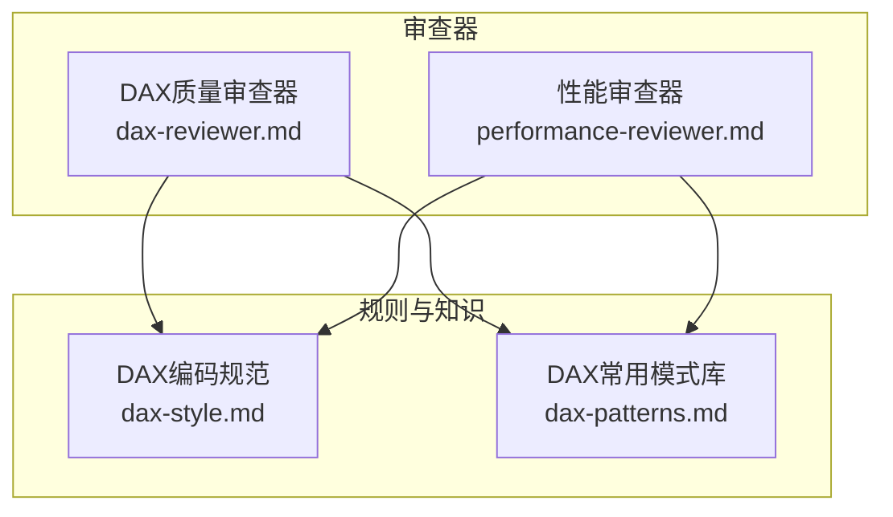
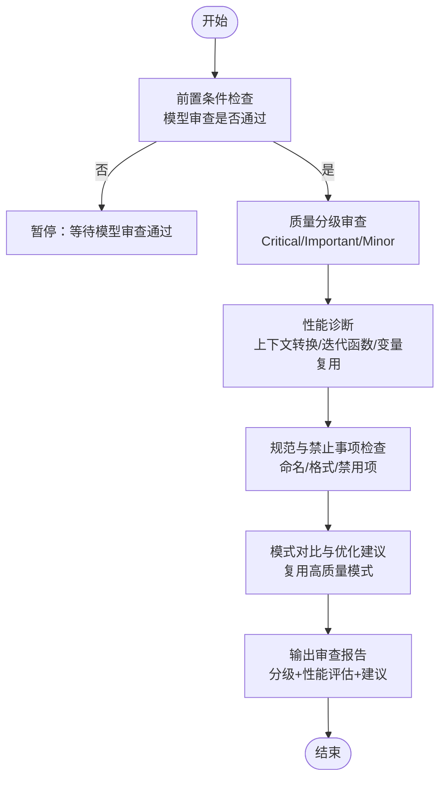
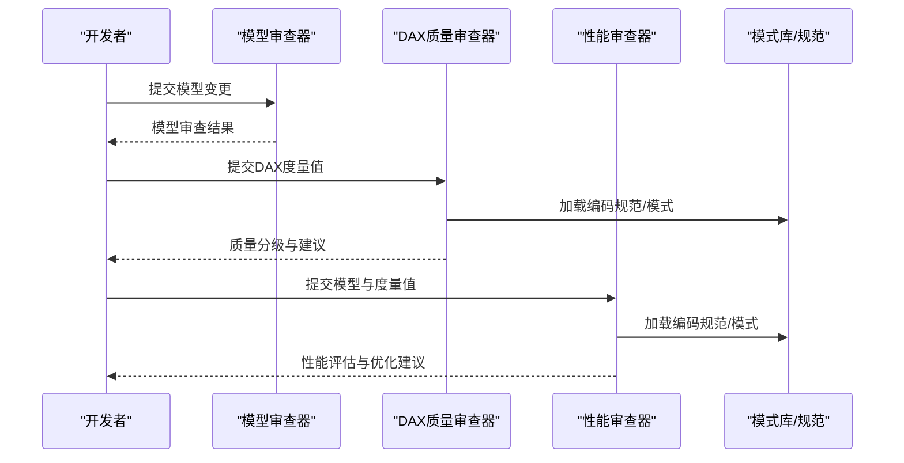
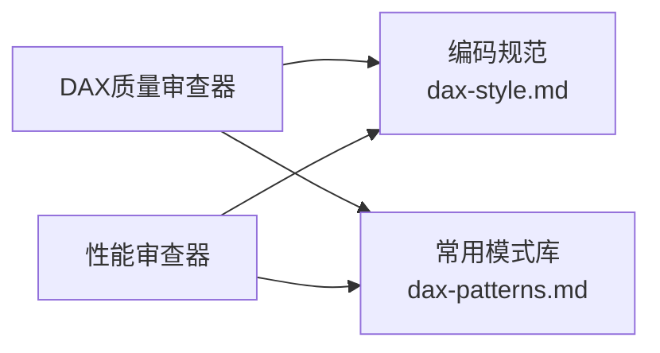

# DAX表达式审查

<cite>
**本文引用的文件**
- [dax-reviewer.md](file://powerbi_code_copilot/agents/dax-reviewer.md)
- [dax-patterns.md](file://powerbi_code_copilot/knowledge/dax-patterns.md)
- [dax-style.md](file://powerbi_code_copilot/rules/dax-style.md)
- [performance-reviewer.md](file://powerbi_code_copilot/agents/performance-reviewer.md)
</cite>

## 目录
1. [简介](#简介)
2. [项目结构](#项目结构)
3. [核心组件](#核心组件)
4. [架构总览](#架构总览)
5. [详细组件分析](#详细组件分析)
6. [依赖分析](#依赖分析)
7. [性能考量](#性能考量)
8. [故障排查指南](#故障排查指南)
9. [结论](#结论)
10. [附录](#附录)

## 简介
本文件围绕Power BI DAX表达式审查能力进行系统化技术说明，目标是帮助开发者建立一致的DAX质量标准与优化实践。内容涵盖：
- 代码质量分级体系：Critical（阻塞）、Important（应修复）、Minor（建议）
- 性能审查清单与关键检查点
- 审查输出格式与工具权限要求
- 常见错误模式与优化建议（通过“代码片段路径”指引定位示例）

## 项目结构
本仓库中与DAX审查直接相关的知识与规则主要分布在以下位置：
- agents：审查器定义与输出模板
- knowledge：高质量DAX模式库（可复用的经验证模式）
- rules：编码规范与禁止事项清单

图表来源
- [dax-reviewer.md:1-56](file://powerbi_code_copilot/agents/dax-reviewer.md#L1-L56)
- [performance-reviewer.md:1-71](file://powerbi_code_copilot/agents/performance-reviewer.md#L1-L71)
- [dax-style.md:1-218](file://powerbi_code_copilot/rules/dax-style.md#L1-L218)
- [dax-patterns.md:1-205](file://powerbi_code_copilot/knowledge/dax-patterns.md#L1-L205)

章节来源
- [dax-reviewer.md:1-56](file://powerbi_code_copilot/agents/dax-reviewer.md#L1-L56)
- [dax-style.md:1-218](file://powerbi_code_copilot/rules/dax-style.md#L1-L218)
- [dax-patterns.md:1-205](file://powerbi_code_copilot/knowledge/dax-patterns.md#L1-L205)
- [performance-reviewer.md:1-71](file://powerbi_code_copilot/agents/performance-reviewer.md#L1-L71)

## 核心组件
- DAX质量审查器：定义质量分级、性能清单、输出格式与工具权限；强调前置条件为模型审查通过后才启动。
- DAX编码规范：提供命名约定、格式规范、编写原则与禁止事项，支撑质量分级判定。
- DAX常用模式库：提供可复用的高质量模式（如累计求和、同比/环比、动态TopN、ABC分析、移动平均、半加性度量值等），用于对比与优化建议。
- 性能审查器：提供整体性能诊断框架与输出格式，补充DAX层的上下文转换、迭代函数、变量复用等检查要点。

章节来源
- [dax-reviewer.md:5-56](file://powerbi_code_copilot/agents/dax-reviewer.md#L5-L56)
- [dax-style.md:7-170](file://powerbi_code_copilot/rules/dax-style.md#L7-L170)
- [dax-patterns.md:1-205](file://powerbi_code_copilot/knowledge/dax-patterns.md#L1-L205)
- [performance-reviewer.md:5-71](file://powerbi_code_copilot/agents/performance-reviewer.md#L5-L71)

## 架构总览
DAX审查流程由“质量分级 + 性能诊断 + 规范约束 + 模式参考”四部分协同构成，形成闭环的质量保障与优化建议体系。

图表来源
- [dax-reviewer.md:3-56](file://powerbi_code_copilot/agents/dax-reviewer.md#L3-L56)
- [dax-style.md:143-170](file://powerbi_code_copilot/rules/dax-style.md#L143-L170)
- [dax-patterns.md:1-205](file://powerbi_code_copilot/knowledge/dax-patterns.md#L1-L205)
- [performance-reviewer.md:5-38](file://powerbi_code_copilot/agents/performance-reviewer.md#L5-L38)

## 详细组件分析

### 质量分级体系与判断依据
- Critical（阻塞）
  - 计算结果错误（逻辑bug）
  - 上下文转换错误（CALCULATE滥用、EARLIER误用）
  - 循环依赖
  - 隐式度量值被直接引用导致的歧义
  - RLS规则绕过风险
- Important（应修复）
  - 未使用VAR导致重复计算
  - 不必要的迭代函数（SUMX可用SUM替代的场景）
  - FILTER(ALL(...))可用REMOVEFILTERS替代
  - 度量值命名不符合规范
  - 缺少注释的复杂度量值（超过10行）
  - 硬编码的筛选条件（应参数化）
- Minor（建议）
  - 格式不统一（缩进、换行）
  - 变量命名不够清晰
  - 可以合并的简单度量值

章节来源
- [dax-reviewer.md:7-26](file://powerbi_code_copilot/agents/dax-reviewer.md#L7-L26)

### 性能审查清单与关键检查点
- 是否避免了不必要的上下文转换
- CALCULATE的筛选参数是否最优
- 迭代函数是否在最小粒度表上运行
- 是否利用了变量（VAR）避免重复计算
- 时间智能函数是否正确使用日期表
- 是否存在可以预计算为计算列的度量值

章节来源
- [dax-reviewer.md:27-35](file://powerbi_code_copilot/agents/dax-reviewer.md#L27-L35)
- [dax-style.md:145-150](file://powerbi_code_copilot/rules/dax-style.md#L145-L150)

### 审查输出格式
审查输出采用分级标题与条目形式，包含：
- Critical/Important/Minor各层级的问题条目
- 性能评估：预估影响（低/中/高）与优化建议摘要
- 输出示例格式见审查器文件中的代码块

章节来源
- [dax-reviewer.md:36-52](file://powerbi_code_copilot/agents/dax-reviewer.md#L36-L52)

### 工具权限要求
- 仅需只读权限（Read/Grep/Glob），不需要写入权限
- 性能审查器补充说明：仅需只读，不需要写入权限

章节来源
- [dax-reviewer.md:54-56](file://powerbi_code_copilot/agents/dax-reviewer.md#L54-L56)
- [performance-reviewer.md:69-71](file://powerbi_code_copilot/agents/performance-reviewer.md#L69-L71)

### 编码规范与禁止事项
- 命名约定：度量值、计算列、表命名的前缀与风格
- 格式规范：缩进、换行、注释与复杂度量值的头部注释要求
- 编写原则：性能优先、上下文清晰、可维护性
- 禁止事项：隐式度量值、硬编码参数、EARLIER、未经验证的CALCULATE嵌套、计算列中引用度量值

章节来源
- [dax-style.md:7-170](file://powerbi_code_copilot/rules/dax-style.md#L7-L170)

### 常用DAX模式与优化建议
- 累计求和：使用ALL移除筛选器并重应用条件，VAR缓存当前日期避免重复计算
- 同比/环比：SAMEPERIODLASTYEAR与DATEADD配合，注意分母为零处理
- 动态TopN：通过参数化N值与RANKX实现，注意维度基数控制
- ABC分析：累计占比计算，注意在大型数据集上的性能
- 移动平均：DATESINPERIOD优化的时间智能函数
- 半加性度量值：LASTDATE高效取最后一天值，安全版本处理非连续日期

章节来源
- [dax-patterns.md:5-205](file://powerbi_code_copilot/knowledge/dax-patterns.md#L5-L205)

### DAX审查流程与序列图

图表来源
- [dax-reviewer.md:3-56](file://powerbi_code_copilot/agents/dax-reviewer.md#L3-L56)
- [performance-reviewer.md:1-71](file://powerbi_code_copilot/agents/performance-reviewer.md#L1-L71)
- [dax-style.md:143-170](file://powerbi_code_copilot/rules/dax-style.md#L143-L170)
- [dax-patterns.md:1-205](file://powerbi_code_copilot/knowledge/dax-patterns.md#L1-L205)

## 依赖分析
- DAX质量审查器依赖编码规范与常用模式库，用于判定命名、格式、性能与最佳实践
- 性能审查器提供跨层诊断框架，补充DAX层的上下文转换与迭代函数检查
- 两者共同确保审查既关注“正确性”，也关注“性能与可维护性”

图表来源
- [dax-reviewer.md:1-56](file://powerbi_code_copilot/agents/dax-reviewer.md#L1-L56)
- [performance-reviewer.md:1-71](file://powerbi_code_copilot/agents/performance-reviewer.md#L1-L71)
- [dax-style.md:1-218](file://powerbi_code_copilot/rules/dax-style.md#L1-L218)
- [dax-patterns.md:1-205](file://powerbi_code_copilot/knowledge/dax-patterns.md#L1-L205)

章节来源
- [dax-reviewer.md:1-56](file://powerbi_code_copilot/agents/dax-reviewer.md#L1-L56)
- [performance-reviewer.md:1-71](file://powerbi_code_copilot/agents/performance-reviewer.md#L1-L71)
- [dax-style.md:1-218](file://powerbi_code_copilot/rules/dax-style.md#L1-L218)
- [dax-patterns.md:1-205](file://powerbi_code_copilot/knowledge/dax-patterns.md#L1-L205)

## 性能考量
- 上下文转换：避免CALCULATE嵌套与不必要的筛选器传递
- 迭代函数：优先使用聚合函数（如SUM），在必须使用迭代函数时，尽量缩小迭代表规模
- 变量复用：使用VAR缓存重复计算结果，减少重复扫描
- 时间智能：正确使用日期表，避免跨日期粒度过滤导致的全表扫描
- 预计算：可预计算为计算列的度量值优先改为计算列，降低运行时计算成本

章节来源
- [dax-style.md:145-150](file://powerbi_code_copilot/rules/dax-style.md#L145-L150)
- [dax-reviewer.md:27-35](file://powerbi_code_copilot/agents/dax-reviewer.md#L27-L35)

## 故障排查指南
- 常见错误模式与定位
  - 上下文转换错误：检查CALCULATE筛选参数与REMOVEFILTERS使用
  - 迭代函数滥用：识别SUMX/AVERAGEX在大表上的使用场景
  - 命名不规范：对照命名约定与检查清单
  - 硬编码参数：将筛选条件参数化，避免硬编码
- 优化建议来源
  - 参考常用模式库中的高质量模式，进行对比与重构
  - 结合性能审查器的诊断框架，逐项核对并制定优化路线图

章节来源
- [dax-style.md:163-170](file://powerbi_code_copilot/rules/dax-style.md#L163-L170)
- [dax-patterns.md:1-205](file://powerbi_code_copilot/knowledge/dax-patterns.md#L1-L205)
- [performance-reviewer.md:5-38](file://powerbi_code_copilot/agents/performance-reviewer.md#L5-L38)

## 结论
通过将质量分级、编码规范、常用模式与性能诊断有机结合，DAX审查能够系统性地提升表达式的正确性、性能与可维护性。建议在实际开发中：
- 严格遵循命名与格式规范
- 优先采用高质量模式与变量复用
- 避免上下文转换与迭代函数的过度使用
- 将复杂度量值拆解为可维护的中间步骤
- 持续使用性能审查器进行回归评估

## 附录
- 代码片段路径示例（用于定位参考与对比）
  - 累计求和模式：[dax-patterns.md:10-28](file://powerbi_code_copilot/knowledge/dax-patterns.md#L10-L28)
  - 同比/环比模式：[dax-patterns.md:37-76](file://powerbi_code_copilot/knowledge/dax-patterns.md#L37-L76)
  - 动态TopN模式：[dax-patterns.md:85-103](file://powerbi_code_copilot/knowledge/dax-patterns.md#L85-L103)
  - ABC分析模式：[dax-patterns.md:112-139](file://powerbi_code_copilot/knowledge/dax-patterns.md#L112-L139)
  - 移动平均模式：[dax-patterns.md:148-171](file://powerbi_code_copilot/knowledge/dax-patterns.md#L148-L171)
  - 半加性度量值模式：[dax-patterns.md:180-204](file://powerbi_code_copilot/knowledge/dax-patterns.md#L180-L204)
  - 编码规范与禁止事项：[dax-style.md:7-170](file://powerbi_code_copilot/rules/dax-style.md#L7-L170)
  - 性能诊断框架：[performance-reviewer.md:5-38](file://powerbi_code_copilot/agents/performance-reviewer.md#L5-L38)
  - 质量分级与输出格式：[dax-reviewer.md:5-52](file://powerbi_code_copilot/agents/dax-reviewer.md#L5-L52)