# Power BI优化模块

<cite>
**本文档引用的文件**
- [dax-style.md](file://powerbi_code_copilot/rules/dax-style.md)
- [modeling-standards.md](file://powerbi_code_copilot/rules/modeling-standards.md)
- [visualization-standards.md](file://powerbi_code_copilot/rules/visualization-standards.md)
- [dax-patterns.md](file://powerbi_code_copilot/knowledge/dax-patterns.md)
- [dax-reviewer.md](file://powerbi_code_copilot/agents/dax-reviewer.md)
- [model-reviewer.md](file://powerbi_code_copilot/agents/model-reviewer.md)
- [performance-reviewer.md](file://powerbi_code_copilot/agents/performance-reviewer.md)
- [spec.md](file://powerbi_code_copilot/changes/templates/spec.md)
- [validation-spec.md](file://powerbi_code_copilot/changes/templates/validation-spec.md)
</cite>

## 目录
1. [简介](#简介)
2. [项目结构](#项目结构)
3. [核心组件](#核心组件)
4. [架构概览](#架构概览)
5. [详细组件分析](#详细组件分析)
6. [依赖分析](#依赖分析)
7. [性能考量](#性能考量)
8. [故障排除指南](#故障排除指南)
9. [结论](#结论)
10. [附录](#附录)

## 简介
本文件为Power BI优化模块的技术文档，聚焦于以下目标：
- DAX表达式审查：质量评估、性能审查清单与优化建议输出
- 数据模型验证：模型结构检查、关系验证、度量值验证
- 性能评估与优化：诊断方法、问题分级、优化路线图
- 规则与标准：DAX样式规范、建模标准、可视化标准
- DAX模式识别与最佳实践：常用模式库与复用策略

该模块以“只读审查、数据驱动、可验证”为核心理念，通过标准化流程与工具权限约束，确保审查与优化过程可控、可追溯、可复用。

## 项目结构
Power BI优化模块由“规则与标准”“审查代理”“变更与验证模板”三大类组成：
- 规则与标准：定义命名、建模、可视化与DAX模式的规范
- 审查代理：独立的只读审查器，分别负责DAX质量、模型合规与性能诊断
- 变更与验证模板：指导需求到实现再到验证的闭环流程

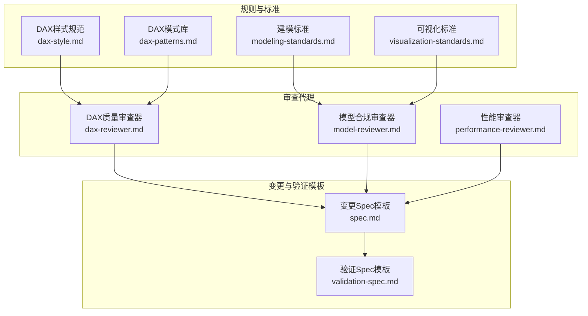

**图表来源**
- [dax-style.md:1-218](file://powerbi_code_copilot/rules/dax-style.md#L1-L218)
- [modeling-standards.md:1-88](file://powerbi_code_copilot/rules/modeling-standards.md#L1-L88)
- [visualization-standards.md:1-81](file://powerbi_code_copilot/rules/visualization-standards.md#L1-L81)
- [dax-patterns.md:1-205](file://powerbi_code_copilot/knowledge/dax-patterns.md#L1-L205)
- [dax-reviewer.md:1-56](file://powerbi_code_copilot/agents/dax-reviewer.md#L1-L56)
- [model-reviewer.md:1-36](file://powerbi_code_copilot/agents/model-reviewer.md#L1-L36)
- [performance-reviewer.md:1-71](file://powerbi_code_copilot/agents/performance-reviewer.md#L1-L71)
- [spec.md:1-95](file://powerbi_code_copilot/changes/templates/spec.md#L1-L95)
- [validation-spec.md:1-69](file://powerbi_code_copilot/changes/templates/validation-spec.md#L1-L69)

**章节来源**
- [dax-style.md:1-218](file://powerbi_code_copilot/rules/dax-style.md#L1-L218)
- [modeling-standards.md:1-88](file://powerbi_code_copilot/rules/modeling-standards.md#L1-L88)
- [visualization-standards.md:1-81](file://powerbi_code_copilot/rules/visualization-standards.md#L1-L81)
- [dax-patterns.md:1-205](file://powerbi_code_copilot/knowledge/dax-patterns.md#L1-L205)
- [dax-reviewer.md:1-56](file://powerbi_code_copilot/agents/dax-reviewer.md#L1-L56)
- [model-reviewer.md:1-36](file://powerbi_code_copilot/agents/model-reviewer.md#L1-L36)
- [performance-reviewer.md:1-71](file://powerbi_code_copilot/agents/performance-reviewer.md#L1-L71)
- [spec.md:1-95](file://powerbi_code_copilot/changes/templates/spec.md#L1-L95)
- [validation-spec.md:1-69](file://powerbi_code_copilot/changes/templates/validation-spec.md#L1-L69)

## 核心组件
- DAX样式规范：覆盖命名约定、格式规范、编写原则与禁止事项，提供命名检查清单与常见错误示例
- 建模标准：定义星型模型优先、关系设计、表设计规范、度量值组织与禁止事项
- 可视化标准：涵盖布局与设计原则、图表选型指南、交互设计、移动端适配与可访问性
- DAX模式库：收录经验证的高质量模式（累计求和、同比/环比、动态TopN、ABC分析、移动平均、半加性度量值等），含场景、代码、解释与性能说明
- DAX质量审查器：对DAX代码进行质量、性能与可维护性审查，提供分级与性能审查清单
- 模型合规审查器：独立读取模型结构进行合规验证，覆盖缺失/多余/理解偏差/业务规则落地/模型结构合规/数据变更准确性
- 性能审查器：多层诊断框架（数据源/Power Query/模型/DAX/可视化），输出问题分级与优化路线图
- 变更与验证模板：从背景目标、现状分析、功能点、业务规则到模型/可视化/DAX变更、影响范围、风险与验证策略的完整闭环

**章节来源**
- [dax-style.md:1-218](file://powerbi_code_copilot/rules/dax-style.md#L1-L218)
- [modeling-standards.md:1-88](file://powerbi_code_copilot/rules/modeling-standards.md#L1-L88)
- [visualization-standards.md:1-81](file://powerbi_code_copilot/rules/visualization-standards.md#L1-L81)
- [dax-patterns.md:1-205](file://powerbi_code_copilot/knowledge/dax-patterns.md#L1-L205)
- [dax-reviewer.md:1-56](file://powerbi_code_copilot/agents/dax-reviewer.md#L1-L56)
- [model-reviewer.md:1-36](file://powerbi_code_copilot/agents/model-reviewer.md#L1-L36)
- [performance-reviewer.md:1-71](file://powerbi_code_copilot/agents/performance-reviewer.md#L1-L71)
- [spec.md:1-95](file://powerbi_code_copilot/changes/templates/spec.md#L1-L95)
- [validation-spec.md:1-69](file://powerbi_code_copilot/changes/templates/validation-spec.md#L1-L69)

## 架构概览
审查与优化流程以“只读审查、数据驱动、可验证”为核心，通过规则与标准指导，审查代理独立验证，最终沉淀到变更与验证模板中，形成闭环。

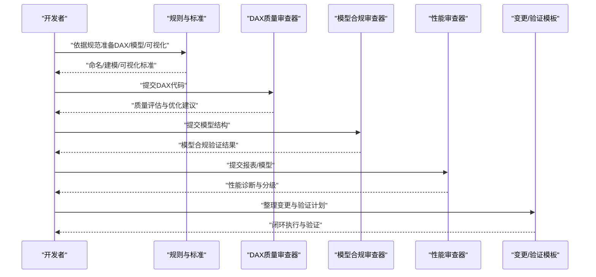

**图表来源**
- [dax-reviewer.md:1-56](file://powerbi_code_copilot/agents/dax-reviewer.md#L1-L56)
- [model-reviewer.md:1-36](file://powerbi_code_copilot/agents/model-reviewer.md#L1-L36)
- [performance-reviewer.md:1-71](file://powerbi_code_copilot/agents/performance-reviewer.md#L1-L71)
- [spec.md:1-95](file://powerbi_code_copilot/changes/templates/spec.md#L1-L95)
- [validation-spec.md:1-69](file://powerbi_code_copilot/changes/templates/validation-spec.md#L1-L69)

## 详细组件分析

### DAX样式规范
- 命名约定：度量值、计算列、表与列命名的前缀/后缀规范与检查清单
- 格式规范：缩进、换行、注释与复杂度量值头部注释要求
- 编写原则：性能优先、上下文清晰、可维护性
- 禁止事项：隐式度量值、硬编码、EARLIER误用、CALCULATE嵌套滥用、计算列引用度量值
- 命名检查清单与常见错误示例，便于快速自查与团队对齐

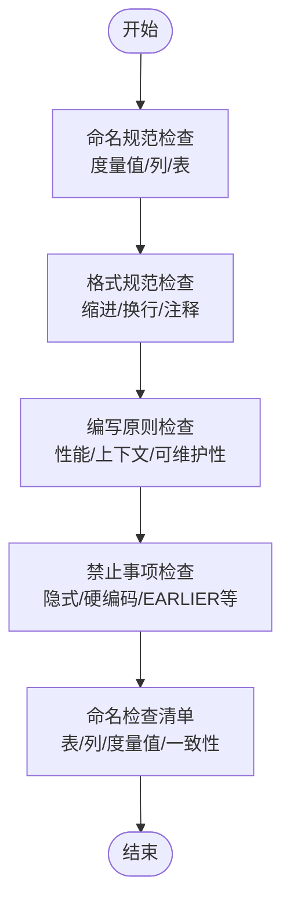

**图表来源**
- [dax-style.md:1-218](file://powerbi_code_copilot/rules/dax-style.md#L1-L218)

**章节来源**
- [dax-style.md:1-218](file://powerbi_code_copilot/rules/dax-style.md#L1-L218)

### 建模标准
- 模型架构：星型模型优先、表类型标识（Fact_/Dim_/Bridge_/CT_/Param_/下划线表）
- 关系设计：1:N方向、筛选方向、双向筛选说明、日期表要求、关系文档化
- 表设计规范：事实表/维度表/列优化、存储模式选择
- 度量值组织：Display Folder分组、度量值表管理
- 禁止事项：自动日期表、事实表间直接关系、多对多关系、未使用表/列、内置日期层级

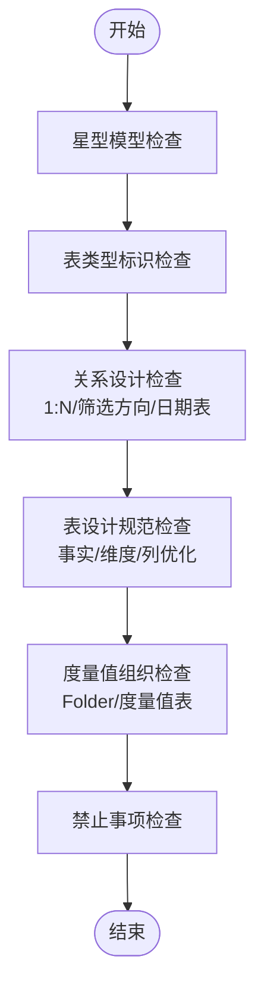

**图表来源**
- [modeling-standards.md:1-88](file://powerbi_code_copilot/rules/modeling-standards.md#L1-L88)

**章节来源**
- [modeling-standards.md:1-88](file://powerbi_code_copilot/rules/modeling-standards.md#L1-L88)

### 可视化标准
- 布局与设计原则：页面布局、色彩方案、字体规范
- 图表选型指南：不同分析目的的图表推荐与禁忌
- 交互设计：切片器、钻取与书签、交叉筛选
- 移动端适配与可访问性：移动端布局、可访问性要求

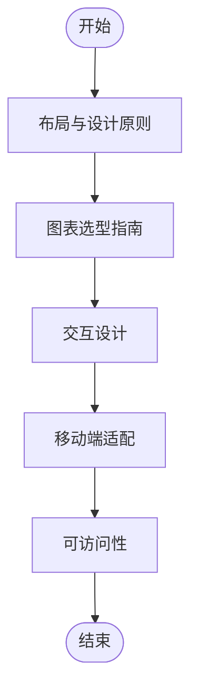

**图表来源**
- [visualization-standards.md:1-81](file://powerbi_code_copilot/rules/visualization-standards.md#L1-L81)

**章节来源**
- [visualization-standards.md:1-81](file://powerbi_code_copilot/rules/visualization-standards.md#L1-L81)

### DAX模式库
- 模式覆盖：累计求和、同比/环比、动态TopN、ABC分析、移动平均、半加性度量值
- 每个模式包含：场景、代码、解释、性能说明，便于直接复用与性能评估

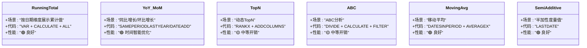

**图表来源**
- [dax-patterns.md:1-205](file://powerbi_code_copilot/knowledge/dax-patterns.md#L1-L205)

**章节来源**
- [dax-patterns.md:1-205](file://powerbi_code_copilot/knowledge/dax-patterns.md#L1-L205)

### DAX质量审查器
- 审查分级：Critical（阻塞）、Important（应修复）、Minor（建议）
- 性能审查清单：上下文转换、CALCULATE筛选参数、迭代函数、变量复用、时间智能、预计算
- 输出格式：问题分级、性能评估、优化建议摘要

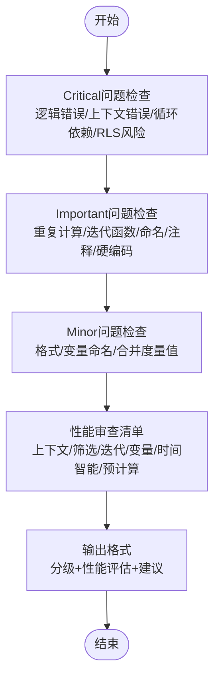

**图表来源**
- [dax-reviewer.md:1-56](file://powerbi_code_copilot/agents/dax-reviewer.md#L1-L56)

**章节来源**
- [dax-reviewer.md:1-56](file://powerbi_code_copilot/agents/dax-reviewer.md#L1-L56)

### 模型合规审查器
- 审查维度：缺失实现、多余实现、理解偏差、业务规则落地、模型结构合规、数据变更准确性
- 输出格式：模型结构验证、度量值逐条验证、结论（合规/不合规）

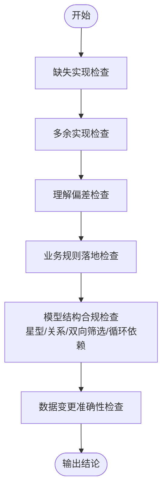

**图表来源**
- [model-reviewer.md:1-36](file://powerbi_code_copilot/agents/model-reviewer.md#L1-L36)

**章节来源**
- [model-reviewer.md:1-36](file://powerbi_code_copilot/agents/model-reviewer.md#L1-L36)

### 性能审查器
- 诊断框架：数据源层、Power Query层、模型层、DAX层、可视化层
- 输出格式：整体评级、模型规模、度量值数量、表数量、问题清单（P0/P1/P2）、优化路线图

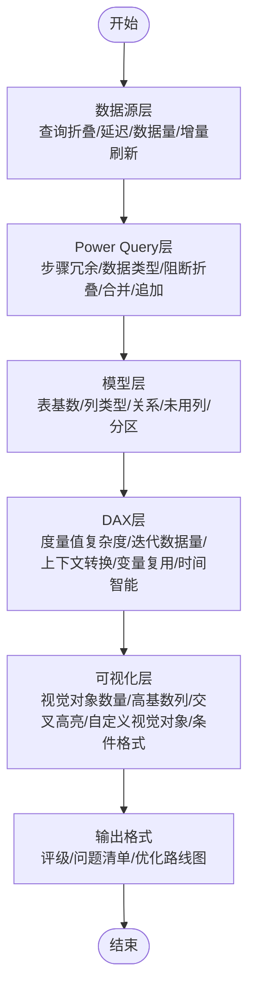

**图表来源**
- [performance-reviewer.md:1-71](file://powerbi_code_copilot/agents/performance-reviewer.md#L1-L71)

**章节来源**
- [performance-reviewer.md:1-71](file://powerbi_code_copilot/agents/performance-reviewer.md#L1-L71)

### 变更与验证模板
- 变更Spec模板：背景与目标、现状分析、功能点、业务规则、模型变更、DAX设计、Power Query变更、可视化变更、影响范围、风险与关注点、验证策略、技术决策、执行日志、审查结论、确认记录
- 验证Spec模板：验证原则、验证环境、数据准确性验证（P0/P1/P2）、模型结构验证、性能验证、安全验证（如涉及RLS）、执行计划

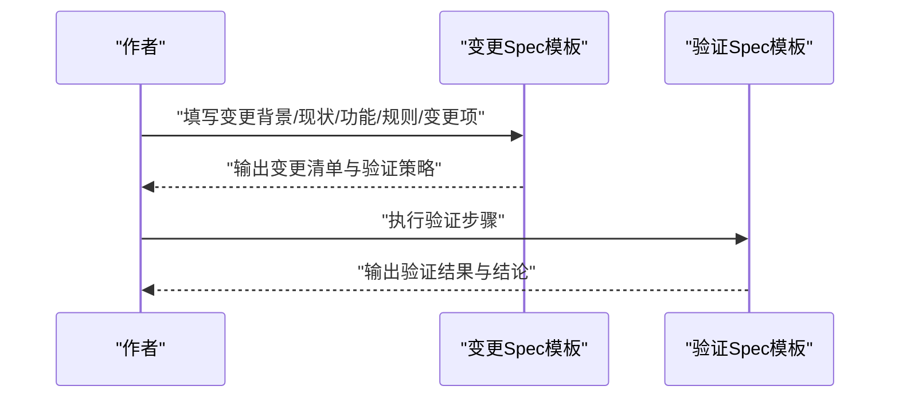

**图表来源**
- [spec.md:1-95](file://powerbi_code_copilot/changes/templates/spec.md#L1-L95)
- [validation-spec.md:1-69](file://powerbi_code_copilot/changes/templates/validation-spec.md#L1-L69)

**章节来源**
- [spec.md:1-95](file://powerbi_code_copilot/changes/templates/spec.md#L1-L95)
- [validation-spec.md:1-69](file://powerbi_code_copilot/changes/templates/validation-spec.md#L1-L69)

## 依赖分析
- 规则与标准为审查提供依据，审查代理独立运行，不依赖外部系统
- 审查代理与模板协同，形成从发现问题到闭环验证的路径
- 工具权限约束：只读（Read/Grep/Glob/Bash），避免误改生产环境

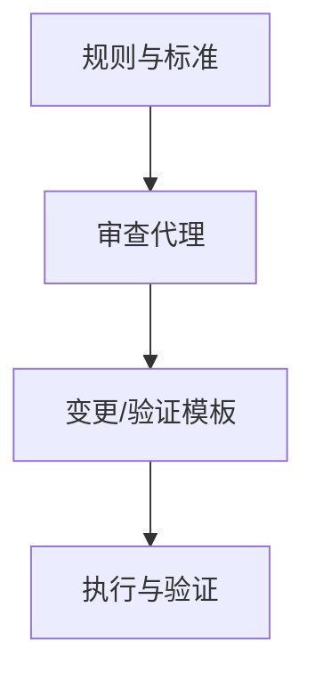

**图表来源**
- [dax-style.md:1-218](file://powerbi_code_copilot/rules/dax-style.md#L1-L218)
- [modeling-standards.md:1-88](file://powerbi_code_copilot/rules/modeling-standards.md#L1-L88)
- [visualization-standards.md:1-81](file://powerbi_code_copilot/rules/visualization-standards.md#L1-L81)
- [dax-reviewer.md:1-56](file://powerbi_code_copilot/agents/dax-reviewer.md#L1-L56)
- [model-reviewer.md:1-36](file://powerbi_code_copilot/agents/model-reviewer.md#L1-L36)
- [performance-reviewer.md:1-71](file://powerbi_code_copilot/agents/performance-reviewer.md#L1-L71)
- [spec.md:1-95](file://powerbi_code_copilot/changes/templates/spec.md#L1-L95)
- [validation-spec.md:1-69](file://powerbi_code_copilot/changes/templates/validation-spec.md#L1-L69)

**章节来源**
- [dax-reviewer.md:1-56](file://powerbi_code_copilot/agents/dax-reviewer.md#L1-L56)
- [model-reviewer.md:1-36](file://powerbi_code_copilot/agents/model-reviewer.md#L1-L36)
- [performance-reviewer.md:1-71](file://powerbi_code_copilot/agents/performance-reviewer.md#L1-L71)

## 性能考量
- 性能优先原则：优先使用VAR避免重复计算、减少CALCULATE嵌套、使用REMOVEFILTERS替代FILTER(ALL(...))、控制迭代函数规模
- 上下文清晰：明确区分行/筛选器上下文、CALCULATE筛选参数意图明确、避免不必要上下文转换
- 可维护性：复杂计算拆分为基础→中间→最终度量值、使用Display Folder组织、每个度量值单一职责
- 诊断维度：数据源查询折叠、Power Query步骤冗余、模型表基数与列类型、关系复杂度、未用列/表、计算列vs计算表vs预处理、分区策略
- 可视化层：单页视觉对象数量、高基数列在切片器中的使用、交叉高亮/交叉筛选复杂度、自定义视觉对象性能、条件格式与动态标题

[本节为通用性能讨论，无需特定文件来源]

## 故障排除指南
- DAX质量审查问题分级与建议：
  - Critical：逻辑错误、上下文转换错误、循环依赖、隐式度量值歧义、RLS规则绕过风险
  - Important：重复计算、不必要的迭代函数、FILTER(ALL(...))可替换、命名不规范、复杂度量值缺少注释、硬编码筛选
  - Minor：格式不统一、变量命名不清、可合并的简单度量值
- 模型合规问题：
  - 缺失实现、多余实现、理解偏差、业务规则未落地、关系方向/基数/筛选方向错误、双向筛选无说明、循环依赖、未使用表/列
- 性能问题分级与优化路线图：
  - P0：严重性能瓶颈（优先解决）
  - P1：需要优化（次之）
  - P2：可选优化（最后）
  - 优化路线图：按影响排序，先解决最严重问题，再逐步优化

**章节来源**
- [dax-reviewer.md:1-56](file://powerbi_code_copilot/agents/dax-reviewer.md#L1-L56)
- [model-reviewer.md:1-36](file://powerbi_code_copilot/agents/model-reviewer.md#L1-L36)
- [performance-reviewer.md:1-71](file://powerbi_code_copilot/agents/performance-reviewer.md#L1-L71)

## 结论
Power BI优化模块通过“规则与标准+独立审查+模板闭环”的体系，实现了对DAX质量、模型合规与性能问题的系统化治理。建议在团队内推广统一的命名与建模规范，结合DAX模式库进行复用，借助审查代理与验证模板确保变更可追踪、可验证、可回归。

[本节为总结，无需特定文件来源]

## 附录
- 工具权限：仅需Read/Grep/Glob（DAX/模型审查器），或Read/Grep/Glob/Bash（性能审查器），不涉及写入权限
- 变更与验证模板：提供从背景目标到执行日志与确认记录的完整闭环，确保每次变更都有据可依、可验可测

**章节来源**
- [dax-reviewer.md:54-56](file://powerbi_code_copilot/agents/dax-reviewer.md#L54-L56)
- [model-reviewer.md:34-36](file://powerbi_code_copilot/agents/model-reviewer.md#L34-L36)
- [performance-reviewer.md:69-71](file://powerbi_code_copilot/agents/performance-reviewer.md#L69-L71)
- [spec.md:1-95](file://powerbi_code_copilot/changes/templates/spec.md#L1-L95)
- [validation-spec.md:1-69](file://powerbi_code_copilot/changes/templates/validation-spec.md#L1-L69)