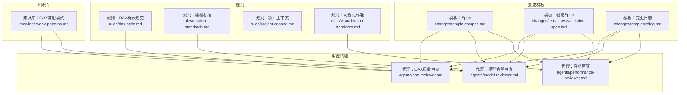
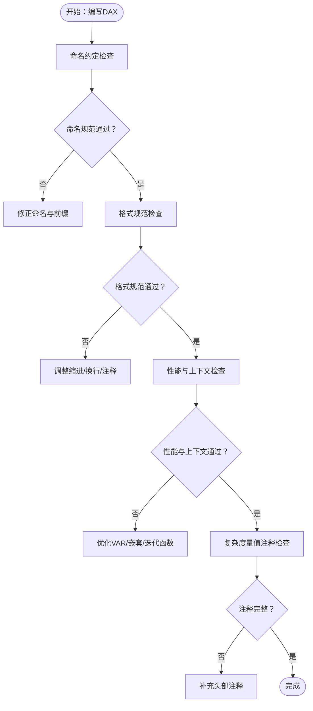
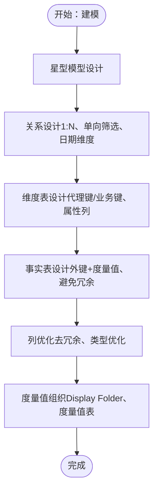
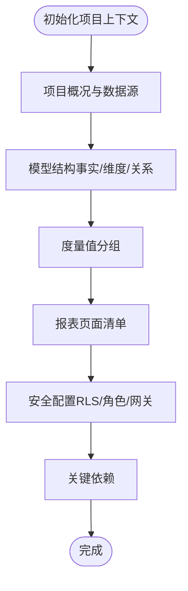
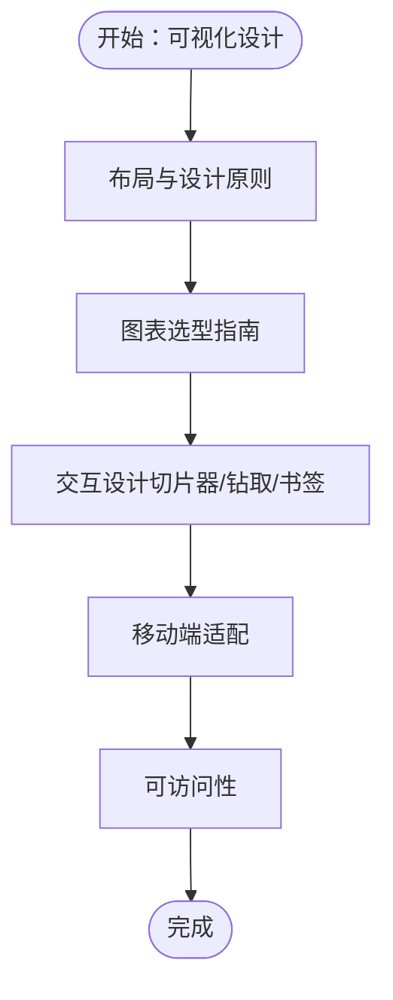
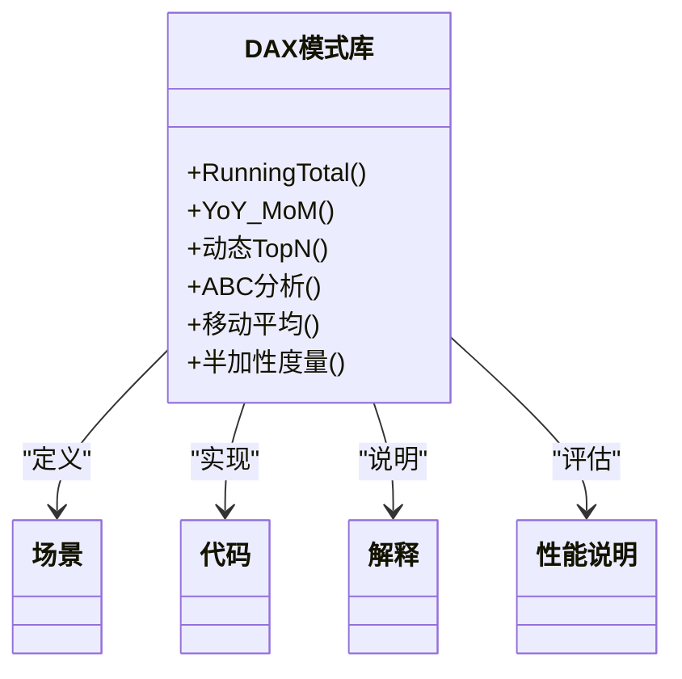
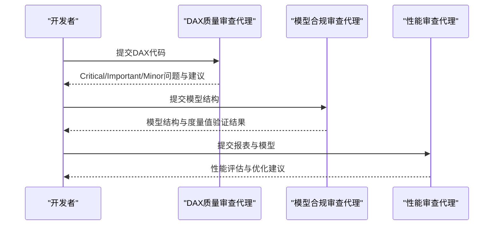
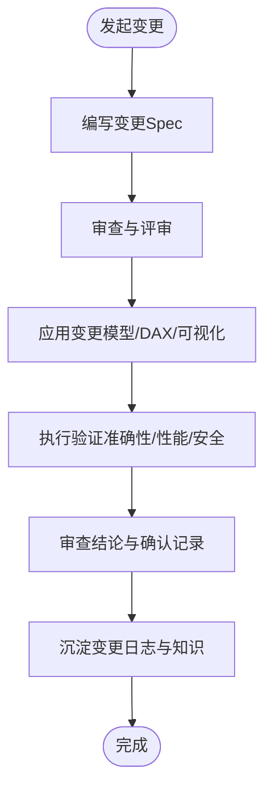
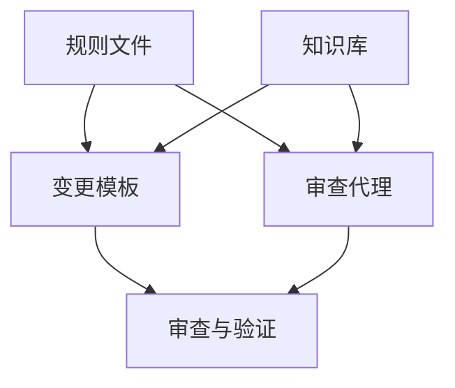

# Power BI规则与标准

<cite>
**本文档引用的文件**
- [dax-style.md](file://powerbi_code_copilot/rules/dax-style.md)
- [modeling-standards.md](file://powerbi_code_copilot/rules/modeling-standards.md)
- [project-context.md](file://powerbi_code_copilot/rules/project-context.md)
- [visualization-standards.md](file://powerbi_code_copilot/rules/visualization-standards.md)
- [dax-patterns.md](file://powerbi_code_copilot/knowledge/dax-patterns.md)
- [dax-reviewer.md](file://powerbi_code_copilot/agents/dax-reviewer.md)
- [model-reviewer.md](file://powerbi_code_copilot/agents/model-reviewer.md)
- [performance-reviewer.md](file://powerbi_code_copilot/agents/performance-reviewer.md)
- [spec.md](file://powerbi_code_copilot/changes/templates/spec.md)
- [validation-spec.md](file://powerbi_code_copilot/changes/templates/validation-spec.md)
- [log.md](file://powerbi_code_copilot/changes/templates/log.md)
- [generate_sample_data.ps1](file://RL E2E/数据demo/powerbi_data/powerbi_traffic/generate_sample_data.ps1)
</cite>

## 目录
1. [引言](#引言)
2. [项目结构](#项目结构)
3. [核心组件](#核心组件)
4. [架构总览](#架构总览)
5. [详细组件分析](#详细组件分析)
6. [依赖分析](#依赖分析)
7. [性能考量](#性能考量)
8. [故障排查指南](#故障排查指南)
9. [结论](#结论)
10. [附录](#附录)

## 引言
本规范文档系统化定义了Power BI项目在DAX样式、数据建模、项目上下文、可视化以及规则配置与合规性检查方面的统一标准与最佳实践。旨在提升团队协作效率、保证报表质量与性能、降低维护成本，并确保业务规则在技术实现中得到准确落地。

## 项目结构
该仓库围绕Power BI规则与标准构建了四类文件集合：
- 规则文件：定义DAX样式、建模标准、项目上下文、可视化标准
- 知识库：提供经验证的DAX模式与模板
- 审查代理：定义自动化审查的分级、维度与输出格式
- 变更模板：规范变更提案、验证策略与执行日志

**图表来源**
- [dax-style.md:1-218](file://powerbi_code_copilot/rules/dax-style.md#L1-L218)
- [modeling-standards.md:1-88](file://powerbi_code_copilot/rules/modeling-standards.md#L1-L88)
- [project-context.md:1-69](file://powerbi_code_copilot/rules/project-context.md#L1-L69)
- [visualization-standards.md:1-81](file://powerbi_code_copilot/rules/visualization-standards.md#L1-L81)
- [dax-patterns.md:1-205](file://powerbi_code_copilot/knowledge/dax-patterns.md#L1-L205)
- [dax-reviewer.md:1-56](file://powerbi_code_copilot/agents/dax-reviewer.md#L1-L56)
- [model-reviewer.md:1-36](file://powerbi_code_copilot/agents/model-reviewer.md#L1-L36)
- [performance-reviewer.md:1-71](file://powerbi_code_copilot/agents/performance-reviewer.md#L1-L71)
- [spec.md:1-95](file://powerbi_code_copilot/changes/templates/spec.md#L1-L95)
- [validation-spec.md:1-69](file://powerbi_code_copilot/changes/templates/validation-spec.md#L1-L69)
- [log.md:1-46](file://powerbi_code_copilot/changes/templates/log.md#L1-L46)

**章节来源**
- [dax-style.md:1-218](file://powerbi_code_copilot/rules/dax-style.md#L1-L218)
- [modeling-standards.md:1-88](file://powerbi_code_copilot/rules/modeling-standards.md#L1-L88)
- [project-context.md:1-69](file://powerbi_code_copilot/rules/project-context.md#L1-L69)
- [visualization-standards.md:1-81](file://powerbi_code_copilot/rules/visualization-standards.md#L1-L81)

## 核心组件
- DAX样式规范：覆盖命名约定、格式规范、编写原则与禁止事项，提供命名检查清单与常见错误示例。
- 数据建模规范：强调星型模型优先、关系设计原则、表设计规范、度量值组织与禁止事项。
- 项目上下文规则：定义项目概况、数据源清单、模型结构、度量值分组、报表页面、安全配置与关键依赖。
- 可视化标准：涵盖布局与设计原则、图表选型指南、交互设计、移动端适配与可访问性。
- DAX常用模式库：提供经验证的高质量DAX模式，包含场景、代码、解释与性能说明。
- 审查代理：定义DAX质量审查、模型合规审查与性能审查的分级、维度与输出格式。
- 变更模板：规范变更提案、验证策略与执行日志，确保可追溯与可审计。

**章节来源**
- [dax-style.md:1-218](file://powerbi_code_copilot/rules/dax-style.md#L1-L218)
- [modeling-standards.md:1-88](file://powerbi_code_copilot/rules/modeling-standards.md#L1-L88)
- [project-context.md:1-69](file://powerbi_code_copilot/rules/project-context.md#L1-L69)
- [visualization-standards.md:1-81](file://powerbi_code_copilot/rules/visualization-standards.md#L1-L81)
- [dax-patterns.md:1-205](file://powerbi_code_copilot/knowledge/dax-patterns.md#L1-L205)
- [dax-reviewer.md:1-56](file://powerbi_code_copilot/agents/dax-reviewer.md#L1-L56)
- [model-reviewer.md:1-36](file://powerbi_code_copilot/agents/model-reviewer.md#L1-L36)
- [performance-reviewer.md:1-71](file://powerbi_code_copilot/agents/performance-reviewer.md#L1-L71)
- [spec.md:1-95](file://powerbi_code_copilot/changes/templates/spec.md#L1-L95)
- [validation-spec.md:1-69](file://powerbi_code_copilot/changes/templates/validation-spec.md#L1-L69)
- [log.md:1-46](file://powerbi_code_copilot/changes/templates/log.md#L1-L46)

## 架构总览
以下架构图展示了规则、知识库、审查代理与变更模板之间的协同关系，以及它们如何共同支撑Power BI项目的合规性与质量保障。

**图表来源**
- [dax-style.md:1-218](file://powerbi_code_copilot/rules/dax-style.md#L1-L218)
- [modeling-standards.md:1-88](file://powerbi_code_copilot/rules/modeling-standards.md#L1-L88)
- [visualization-standards.md:1-81](file://powerbi_code_copilot/rules/visualization-standards.md#L1-L81)
- [dax-patterns.md:1-205](file://powerbi_code_copilot/knowledge/dax-patterns.md#L1-L205)
- [dax-reviewer.md:1-56](file://powerbi_code_copilot/agents/dax-reviewer.md#L1-L56)
- [model-reviewer.md:1-36](file://powerbi_code_copilot/agents/model-reviewer.md#L1-L36)
- [performance-reviewer.md:1-71](file://powerbi_code_copilot/agents/performance-reviewer.md#L1-L71)
- [spec.md:1-95](file://powerbi_code_copilot/changes/templates/spec.md#L1-L95)
- [validation-spec.md:1-69](file://powerbi_code_copilot/changes/templates/validation-spec.md#L1-L69)
- [log.md:1-46](file://powerbi_code_copilot/changes/templates/log.md#L1-L46)

## 详细组件分析

### DAX样式规范
- 命名约定
  - 度量值：前缀体系（KPI_、CAL_、RATIO_、YTD_、MTD_、PY_、百分比%结尾、Rank结尾、内部隐藏_前缀）、避免拼音与中英混拼、避免与列名冲突。
  - 计算列：建议CC_前缀，体现业务含义。
  - 表命名：Dim_、Fact_、Bridge_、Param_、CT_、隐藏表_等前缀；单数名词、禁止空格与特殊字符、避免DAX保留字。
  - 列命名：主键Key/ID后缀、外键与维度主键同名、布尔列Is/Has前缀、PascalCase。
  - 变量：__前缀或清晰命名；区分列上下文、行上下文与特殊标识变量。
- 格式规范
  - 缩进与换行：VAR独占行、RETURN与VAR同级缩进、嵌套函数每层缩进4空格、长参数列表每参数独占行、逻辑运算符放行首。
  - 注释：复杂度量值（超5行）必须添加头部注释，格式清晰。
- 编写原则
  - 性能优先：优先使用VAR、避免深层CALCULATE嵌套、优先REMOVEFILTERS、控制迭代函数规模、避免IF+大型表迭代。
  - 上下文清晰：明确区分行/筛选器上下文、CALCULATE筛选参数明确意图、避免不必要上下文转换、SELECTEDVALUE优于VALUES。
  - 可维护性：复杂计算拆分为基础→中间→最终、使用Display Folder组织、每个度量值单一职责。
- 禁止事项
  - 禁止隐式度量值、硬编码日期/业务参数、EARLIER、未经验证的CALCULATE嵌套、计算列引用度量值。
- 命名检查清单与常见错误
  - 提供表/列/度量值命名检查清单与典型错误示例，便于自查与培训。

**图表来源**
- [dax-style.md:87-170](file://powerbi_code_copilot/rules/dax-style.md#L87-L170)

**章节来源**
- [dax-style.md:1-218](file://powerbi_code_copilot/rules/dax-style.md#L1-L218)

### 数据建模规范
- 模型架构
  - 星型模型优先：事实表存放可度量业务事件，维度表存放描述性属性；确有必要使用雪花型需说明原因。
  - 表类型标识：Fact_、Dim_、Bridge_、CT_、_xxx。
- 关系设计
  - 基本原则：1:N关系（维度→事实）、默认单向筛选、双向筛选需明确业务理由、禁止循环依赖、每个事实表必须关联日期维度。
  - 日期表要求：独立日期维度表、完整连续日期范围、标记为日期表、包含Year→Quarter→Month→Week→Day层级。
  - 关系文档化：记录源表.源列 → 目标表.目标列、基数、筛选方向、是否活跃、业务含义。
- 表设计规范
  - 事实表：仅保留外键与度量值列，描述性属性放入维度表；大型事实表考虑增量刷新。
  - 维度表：包含代理键与业务键、所有描述性属性；小型维度表使用Dual存储模式（DirectQuery场景）。
  - 列优化：移除未使用列、文本列可用整数编码替代、避免高基数文本列、日期列统一Date类型、数值列选择最小精度。
- 度量值组织
  - Display Folder分组：Base Metrics、Time Intelligence、Ratios & KPIs、Rankings、Formatting、_Internal。
  - 度量值表：创建专用空表_Measures存放所有度量值，或按业务域分多个度量值表。
- 禁止事项
  - 禁止使用自动日期/时间表、事实表之间直接关系、多对多关系不通过桥接表、保留未使用表/列、使用Power BI自动生成的隐藏日期层级。

**图表来源**
- [modeling-standards.md:7-88](file://powerbi_code_copilot/rules/modeling-standards.md#L7-L88)

**章节来源**
- [modeling-standards.md:1-88](file://powerbi_code_copilot/rules/modeling-standards.md#L1-L88)

### 项目上下文规则
- 项目概况：项目名、简介、Power BI版本、许可证类型、数据刷新方式。
- 数据源清单：数据源名称、类型、连接方式、刷新频率、备注。
- 数据模型结构：事实表、维度表、关系图（示例为星型关系）。
- 度量值分组：Display Folder分组与核心度量值用途。
- 报表页面清单：页面名称、用途、目标受众、关键KPI。
- 安全配置：RLS规则、工作区角色、数据网关。
- 关键依赖：自定义视觉对象、外部工具等。

**图表来源**
- [project-context.md:9-69](file://powerbi_code_copilot/rules/project-context.md#L9-L69)

**章节来源**
- [project-context.md:1-69](file://powerbi_code_copilot/rules/project-context.md#L1-L69)

### 可视化标准
- 布局与设计原则
  - 页面布局：每页视觉对象≤8、Z型/F型阅读模式、KPI卡片置顶、筛选器预留区域。
  - 色彩方案：统一企业配色、避免超过5种数据色彩、色盲友好、背景与数据色对比度充足。
  - 字体规范：标题10-14pt加粗、数据标签8-10pt、轴标签8-10pt、全报表统一字体族。
- 图表选型指南
  - 展示趋势：折线图、面积图；避免饼图。
  - 比较大小：条形图、柱状图；避免3D图表。
  - 占比分析：环形图、树状图、堆叠柱状图；避免饼图（超过5类）。
  - 分布分析：直方图、箱线图、散点图；避免饼图。
  - 关联分析：散点图、气泡图；避免柱状图。
  - 地理分析：地图、填充地图；避免3D地图。
  - KPI展示：KPI卡片、仪表盘；避免复杂图表。
  - 表格明细：矩阵、表格；避免过多列的宽表。
  - 图表禁忌：禁止3D效果、超过5个分类的饼图、双Y轴、截断Y轴起点。
- 交互设计
  - 切片器：常用筛选器固定位置、日期切片器使用Between、多选切片器提供全选/清除、单页不超过5个切片器。
  - 钻取与书签：钻取路径遵循业务层级、书签配合按钮切换页面、工具提示页面简洁。
  - 交叉筛选：默认交叉高亮、明确需要时启用交叉筛选、大型报表考虑禁用部分交互。
- 移动端适配：为关键报表页面创建移动布局、优先展示KPI与核心指标、触摸友好按钮与切片器、避免宽矩阵/表格。
- 可访问性：为所有视觉对象添加Alt Text、Tab键导航顺序合理、色彩对比度满足WCAG 2.1 AA、避免仅依赖颜色传达信息。

**图表来源**
- [visualization-standards.md:7-81](file://powerbi_code_copilot/rules/visualization-standards.md#L7-L81)

**章节来源**
- [visualization-standards.md:1-81](file://powerbi_code_copilot/rules/visualization-standards.md#L1-L81)

### DAX常用模式库
- Running Total（累计求和）：场景、代码、解释与性能说明。
- YoY/MoM（同比/环比）：场景、代码、解释与性能说明。
- 动态Top N：场景、代码、性能说明。
- ABC分析（帕累托分析）：场景、代码、性能说明。
- 移动平均（Moving Average）：场景、代码、性能说明。
- 半加性度量值（Semi-Additive Measures）：场景、代码、性能说明。

**图表来源**
- [dax-patterns.md:1-205](file://powerbi_code_copilot/knowledge/dax-patterns.md#L1-L205)

**章节来源**
- [dax-patterns.md:1-205](file://powerbi_code_copilot/knowledge/dax-patterns.md#L1-L205)

### 审查代理与合规性检查
- DAX质量审查（DAX Quality Reviewer）
  - 审查分级：Critical（阻塞）、Important（应修复）、Minor（建议）。
  - 性能审查清单：上下文转换、CALCULATE筛选参数、迭代函数、变量复用、时间智能函数、可预计算为计算列。
  - 输出格式：问题分类与摘要、性能评估与建议。
- 模型合规审查（Model Compliance Reviewer）
  - 审查维度：缺失实现、多余实现、理解偏差、业务规则落地、模型结构合规、数据变更准确性。
  - 输出格式：模型结构验证、度量值逐条验证、结论。
- 性能审查（Performance Reviewer）
  - 诊断框架：数据源层、Power Query层、模型层、DAX层、可视化层。
  - 输出格式：性能评估摘要、问题清单（P0/P1/P2）、优化路线图。

**图表来源**
- [dax-reviewer.md:1-56](file://powerbi_code_copilot/agents/dax-reviewer.md#L1-L56)
- [model-reviewer.md:1-36](file://powerbi_code_copilot/agents/model-reviewer.md#L1-L36)
- [performance-reviewer.md:1-71](file://powerbi_code_copilot/agents/performance-reviewer.md#L1-L71)

**章节来源**
- [dax-reviewer.md:1-56](file://powerbi_code_copilot/agents/dax-reviewer.md#L1-L56)
- [model-reviewer.md:1-36](file://powerbi_code_copilot/agents/model-reviewer.md#L1-L36)
- [performance-reviewer.md:1-71](file://powerbi_code_copilot/agents/performance-reviewer.md#L1-L71)

### 变更管理与验证
- 变更Spec模板
  - 背景与目标、现状分析、功能点、业务规则、模型变更、DAX度量值设计、Power Query变更、可视化变更、影响范围、风险与关注点、验证策略、待澄清、技术决策、执行日志、审查结论、确认记录。
- 验证Spec模板
  - 验证原则（数据驱动、对比验证、边界测试、展示证据）、验证环境、数据准确性验证（P0/P1/P2）、模型结构验证、性能验证、安全验证（如涉及RLS）、执行计划。
- 变更日志模板
  - 时间线、技术决策、踩坑记录、知识发现、Spec-实现偏差记录、性能对比记录、质量备忘。

**图表来源**
- [spec.md:1-95](file://powerbi_code_copilot/changes/templates/spec.md#L1-L95)
- [validation-spec.md:1-69](file://powerbi_code_copilot/changes/templates/validation-spec.md#L1-L69)
- [log.md:1-46](file://powerbi_code_copilot/changes/templates/log.md#L1-L46)

**章节来源**
- [spec.md:1-95](file://powerbi_code_copilot/changes/templates/spec.md#L1-L95)
- [validation-spec.md:1-69](file://powerbi_code_copilot/changes/templates/validation-spec.md#L1-L69)
- [log.md:1-46](file://powerbi_code_copilot/changes/templates/log.md#L1-L46)

## 依赖分析
- 组件耦合与内聚
  - 规则文件为审查代理与变更模板提供权威依据，具有高内聚与强约束力。
  - 知识库模式与规则互补，审查代理在规则基础上进行自动化校验。
  - 变更模板贯穿整个生命周期，确保变更可追溯、可验证、可审计。
- 外部依赖与集成点
  - Power BI Desktop/Service/Premium/Fabric版本与许可证类型影响功能可用性与性能。
  - 数据源类型（SQL Server/Excel/API等）与连接方式（Import/DirectQuery/Dual）决定建模与性能策略。
  - 自定义视觉对象与外部工具需纳入关键依赖清单并评估性能影响。

**图表来源**
- [dax-style.md:1-218](file://powerbi_code_copilot/rules/dax-style.md#L1-L218)
- [modeling-standards.md:1-88](file://powerbi_code_copilot/rules/modeling-standards.md#L1-L88)
- [visualization-standards.md:1-81](file://powerbi_code_copilot/rules/visualization-standards.md#L1-L81)
- [dax-patterns.md:1-205](file://powerbi_code_copilot/knowledge/dax-patterns.md#L1-L205)
- [dax-reviewer.md:1-56](file://powerbi_code_copilot/agents/dax-reviewer.md#L1-L56)
- [model-reviewer.md:1-36](file://powerbi_code_copilot/agents/model-reviewer.md#L1-L36)
- [performance-reviewer.md:1-71](file://powerbi_code_copilot/agents/performance-reviewer.md#L1-L71)
- [spec.md:1-95](file://powerbi_code_copilot/changes/templates/spec.md#L1-L95)
- [validation-spec.md:1-69](file://powerbi_code_copilot/changes/templates/validation-spec.md#L1-L69)
- [log.md:1-46](file://powerbi_code_copilot/changes/templates/log.md#L1-L46)

**章节来源**
- [project-context.md:1-69](file://powerbi_code_copilot/rules/project-context.md#L1-L69)

## 性能考量
- 数据源层：关注查询折叠是否生效、数据源响应延迟、数据量合理性与增量刷新配置。
- Power Query层：减少冗余步骤、在源端指定数据类型、避免阻断查询折叠的步骤、评估合并/追加查询的性能影响。
- 模型层：控制表的基数与大小、列的数据类型最优、关系数量与复杂度、移除未使用列/表、计算列vs计算表vsPower Query预处理的选择、分区策略（大型模型）。
- DAX层：评估度量值复杂度、迭代函数数据量、上下文转换开销、变量复用程度、时间智能函数优化。
- 可视化层：单页视觉对象数量（建议≤8）、高基数列在切片器中的使用、交叉高亮/交叉筛选复杂度、自定义视觉对象性能影响、条件格式与动态标题的计算开销。

**章节来源**
- [performance-reviewer.md:1-71](file://powerbi_code_copilot/agents/performance-reviewer.md#L1-L71)

## 故障排查指南
- DAX质量审查问题定位
  - Critical：计算结果错误、上下文转换错误、循环依赖、隐式度量值歧义、RLS规则绕过风险。
  - Important：未使用VAR导致重复计算、不必要的迭代函数、FILTER(ALL(...))可替换为REMOVEFILTERS、度量值命名不符规范、复杂度量值缺少注释、硬编码筛选条件。
  - Minor：格式不统一、变量命名不清、可合并的简单度量值。
- 模型合规审查问题定位
  - 缺失实现：spec要求但模型未实现（缺表/缺列/缺度量值/缺关系）。
  - 多余实现：YAGNI违规。
  - 理解偏差：做了但做错方向（关系方向、基数、筛选器传播方向）。
  - 业务规则落地：spec中的业务规则是否全部体现在度量值/计算列中。
  - 模型结构合规：是否遵循星型/雪花型模型、事实表与维度表分离、关系正确、双向筛选明确理由、循环依赖。
- 性能审查问题定位
  - 按数据源层、Power Query层、模型层、DAX层、可视化层逐项诊断，输出问题清单与优化路线图。

**章节来源**
- [dax-reviewer.md:1-56](file://powerbi_code_copilot/agents/dax-reviewer.md#L1-L56)
- [model-reviewer.md:1-36](file://powerbi_code_copilot/agents/model-reviewer.md#L1-L36)
- [performance-reviewer.md:1-71](file://powerbi_code_copilot/agents/performance-reviewer.md#L1-L71)

## 结论
通过统一的DAX样式规范、数据建模标准、项目上下文规则与可视化标准，并结合DAX常用模式库、审查代理与变更模板，能够有效提升Power BI项目的质量、性能与可维护性。建议团队在日常开发中严格遵循本规范，并将审查与验证流程纳入CI/CD，持续沉淀知识与经验。

## 附录
- 示例数据生成脚本：用于生成Power BI示例数据，便于验证与演示。
  - [generate_sample_data.ps1:1-106](file://RL E2E/数据demo/powerbi_data/powerbi_traffic/generate_sample_data.ps1#L1-L106)

**章节来源**
- [generate_sample_data.ps1:1-106](file://RL E2E/数据demo/powerbi_data/powerbi_traffic/generate_sample_data.ps1#L1-L106)