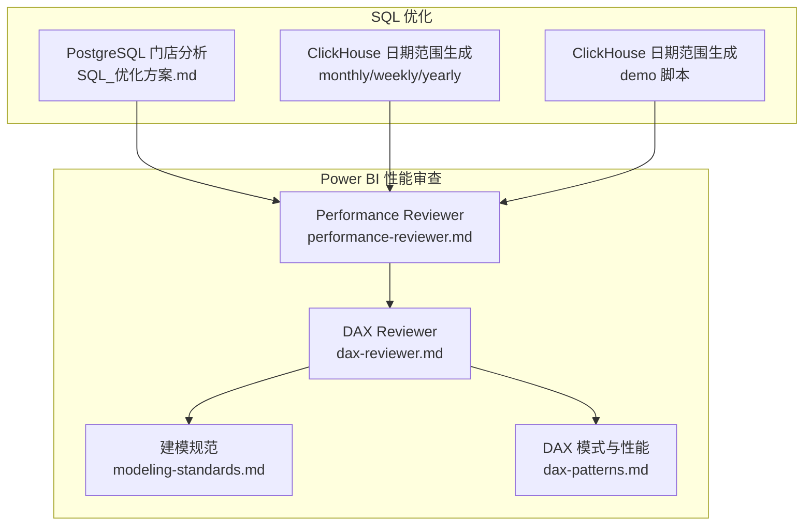
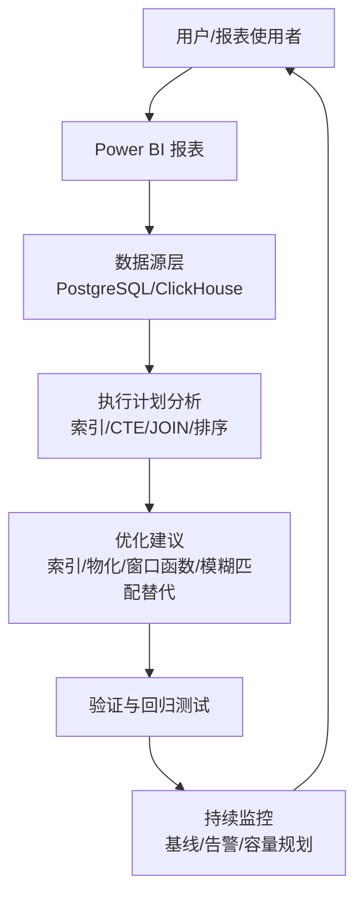
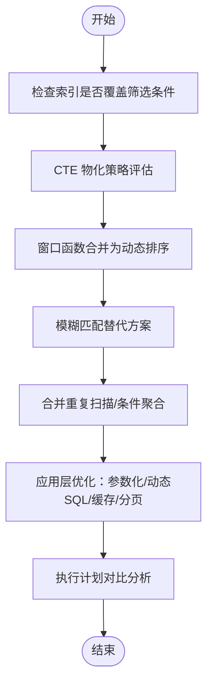
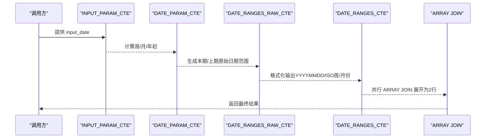
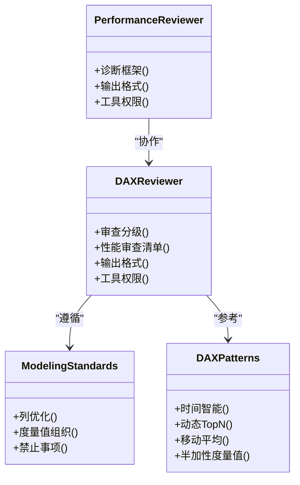
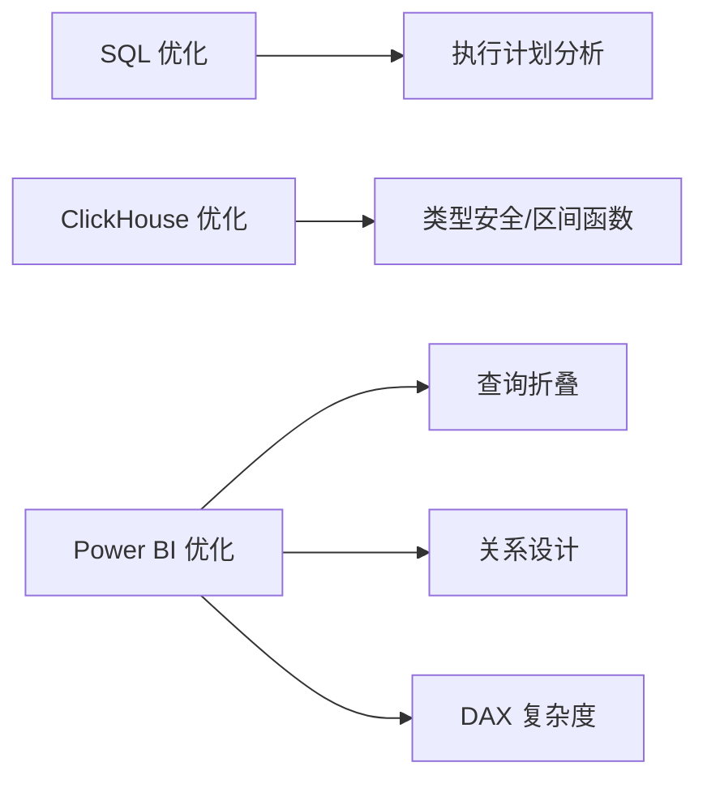

# 性能评估与优化

<cite>
**本文引用的文件**
- [SQL_优化方案.md](file://Quickbi_sql/MAP/我的门店/SQL_优化方案.md)
- [monthly.sql](file://Quickbi_sql/周大福/周大福_日期范围生成_ARRAY JOIN_Clickhou/monthly.sql)
- [weekly.sql](file://Quickbi_sql/周大福/周大福_日期范围生成_ARRAY JOIN_Clickhou/weekly.sql)
- [yearly_cumulative_monthly.sql](file://Quickbi_sql/周大福/周大福_日期范围生成_ARRAY JOIN_Clickhou/yearly_cumulative_monthly.sql)
- [monthly_cumulative_weekly_wiki.md](file://Quickbi_sql/周大福/周大福_日期范围生成_ARRAY JOIN_Clickhou/wiki/monthly_cumulative_weekly_wiki.md)
- [clickhouse_date_ranges.sql](file://Quickbi_sql/周大福/周大福_日期范围生成_demo/clickhouse_date_ranges.sql)
- [performance-reviewer.md](file://powerbi_code_copilot/agents/performance-reviewer.md)
- [dax-reviewer.md](file://powerbi_code_copilot/agents/dax-reviewer.md)
- [modeling-standards.md](file://powerbi_code_copilot/rules/modeling-standards.md)
- [dax-patterns.md](file://powerbi_code_copilot/knowledge/dax-patterns.md)
</cite>

## 目录
1. [简介](#简介)
2. [项目结构](#项目结构)
3. [核心组件](#核心组件)
4. [架构总览](#架构总览)
5. [详细组件分析](#详细组件分析)
6. [依赖分析](#依赖分析)
7. [性能考量](#性能考量)
8. [故障排查指南](#故障排查指南)
9. [结论](#结论)
10. [附录](#附录)

## 简介
本文件面向性能评估与优化场景，结合仓库中的 SQL 优化实践与 Power BI 性能审查工具，系统化梳理性能诊断方法、工具使用、问题分级评估、优化路线图与实施建议。内容覆盖：
- 查询执行计划分析与索引/CTE/窗口函数优化
- ClickHouse 日期范围生成的列转行优化与 ARRAY JOIN 使用
- Power BI 模型层、DAX 层性能诊断与优化策略
- 数据建模优化、查询性能调优与缓存策略
- 工具权限与安全注意事项
- 基准测试与持续监控方法

## 项目结构
仓库围绕两类关键能力组织：
- Quickbi_sql：PostgreSQL/ClickHouse 的 SQL 优化与日期范围生成脚本
- powerbi_code_copilot：Power BI 模型与 DAX 的性能审查与最佳实践

图表来源
- [SQL_优化方案.md:1-822](file://Quickbi_sql/MAP/我的门店/SQL_优化方案.md#L1-L822)
- [monthly.sql:1-109](file://Quickbi_sql/周大福/周大福_日期范围生成_ARRAY JOIN_Clickhou/monthly.sql#L1-L109)
- [weekly.sql:1-117](file://Quickbi_sql/周大福/周大福_日期范围生成_ARRAY JOIN_Clickhou/weekly.sql#L1-L117)
- [yearly_cumulative_monthly.sql:1-109](file://Quickbi_sql/周大福/周大福_日期范围生成_ARRAY JOIN_Clickhou/yearly_cumulative_monthly.sql#L1-L109)
- [clickhouse_date_ranges.sql:1-214](file://Quickbi_sql/周大福/周大福_日期范围生成_demo/clickhouse_date_ranges.sql#L1-L214)
- [performance-reviewer.md:1-71](file://powerbi_code_copilot/agents/performance-reviewer.md#L1-L71)
- [dax-reviewer.md:1-56](file://powerbi_code_copilot/agents/dax-reviewer.md#L1-L56)
- [modeling-standards.md:57-88](file://powerbi_code_copilot/rules/modeling-standards.md#L57-L88)
- [dax-patterns.md:70-178](file://powerbi_code_copilot/knowledge/dax-patterns.md#L70-L178)

章节来源
- [SQL_优化方案.md:1-822](file://Quickbi_sql/MAP/我的门店/SQL_优化方案.md#L1-L822)
- [monthly.sql:1-109](file://Quickbi_sql/周大福/周大福_日期范围生成_ARRAY JOIN_Clickhou/monthly.sql#L1-L109)
- [weekly.sql:1-117](file://Quickbi_sql/周大福/周大福_日期范围生成_ARRAY JOIN_Clickhou/weekly.sql#L1-L117)
- [yearly_cumulative_monthly.sql:1-109](file://Quickbi_sql/周大福/周大福_日期范围生成_ARRAY JOIN_Clickhou/yearly_cumulative_monthly.sql#L1-L109)
- [monthly_cumulative_weekly_wiki.md:1-595](file://Quickbi_sql/周大福/周大福_日期范围生成_ARRAY JOIN_Clickhou/wiki/monthly_cumulative_weekly_wiki.md#L1-L595)
- [clickhouse_date_ranges.sql:1-214](file://Quickbi_sql/周大福/周大福_日期范围生成_demo/clickhouse_date_ranges.sql#L1-L214)
- [performance-reviewer.md:1-71](file://powerbi_code_copilot/agents/performance-reviewer.md#L1-L71)
- [dax-reviewer.md:1-56](file://powerbi_code_copilot/agents/dax-reviewer.md#L1-L56)
- [modeling-standards.md:57-88](file://powerbi_code_copilot/rules/modeling-standards.md#L57-L88)
- [dax-patterns.md:70-178](file://powerbi_code_copilot/knowledge/dax-patterns.md#L70-L178)

## 核心组件
- PostgreSQL 门店分析 SQL 优化：索引设计、CTE 物化、窗口函数优化、模糊匹配替代、标签表合并等
- ClickHouse 日期范围生成：多报表类型、ARRAY JOIN 列转行、类型安全与区间计算
- Power BI 性能审查：数据源层、Power Query 层、模型层、DAX 层、可视化层的诊断框架与优化建议
- DAX 模式与性能：时间智能、动态 Top N、移动平均、半加性度量值等模式的性能说明与建议

章节来源
- [SQL_优化方案.md:20-800](file://Quickbi_sql/MAP/我的门店/SQL_优化方案.md#L20-L800)
- [monthly.sql:1-109](file://Quickbi_sql/周大福/周大福_日期范围生成_ARRAY JOIN_Clickhou/monthly.sql#L1-L109)
- [weekly.sql:1-117](file://Quickbi_sql/周大福/周大福_日期范围生成_ARRAY JOIN_Clickhou/weekly.sql#L1-L117)
- [yearly_cumulative_monthly.sql:1-109](file://Quickbi_sql/周大福/周大福_日期范围生成_ARRAY JOIN_Clickhou/yearly_cumulative_monthly.sql#L1-L109)
- [monthly_cumulative_weekly_wiki.md:1-595](file://Quickbi_sql/周大福/周大福_日期范围生成_ARRAY JOIN_Clickhou/wiki/monthly_cumulative_weekly_wiki.md#L1-L595)
- [clickhouse_date_ranges.sql:1-214](file://Quickbi_sql/周大福/周大福_日期范围生成_demo/clickhouse_date_ranges.sql#L1-L214)
- [performance-reviewer.md:5-71](file://powerbi_code_copilot/agents/performance-reviewer.md#L5-L71)
- [dax-reviewer.md:27-56](file://powerbi_code_copilot/agents/dax-reviewer.md#L27-L56)
- [dax-patterns.md:70-178](file://powerbi_code_copilot/knowledge/dax-patterns.md#L70-L178)

## 架构总览
整体流程从“诊断—评估—优化—验证—监控”闭环推进，覆盖 SQL 层与 Power BI 模型层。

图表来源
- [SQL_优化方案.md:701-730](file://Quickbi_sql/MAP/我的门店/SQL_优化方案.md#L701-L730)
- [performance-reviewer.md:5-71](file://powerbi_code_copilot/agents/performance-reviewer.md#L5-L71)

## 详细组件分析

### PostgreSQL 门店分析 SQL 优化
- 索引优化：为主表与标签表设计复合索引，覆盖高频筛选列；为 dt 单独建立降序索引以支持 MAX(dt) 快速定位
- CTE 物化控制：对多次引用的 CTE 使用 MATERIALIZED，避免重复扫描；对一次性 CTE 使用 NOT MATERIALIZED
- 窗口函数优化：将多个 CASE 包裹的窗口函数合并为单个动态排序，减少计算开销
- 模糊匹配替代：使用数组/IN 或 GIN 索引+pg_trgm 替代前导通配符 LIKE
- 聚合与排序优化：合并重复扫描、减少列选择、使用条件聚合分离当前/上期指标
- 应用层优化：参数化查询、动态 SQL 拼接、结果缓存、分页优化

图表来源
- [SQL_优化方案.md:20-800](file://Quickbi_sql/MAP/我的门店/SQL_优化方案.md#L20-L800)

章节来源
- [SQL_优化方案.md:5-800](file://Quickbi_sql/MAP/我的门店/SQL_优化方案.md#L5-L800)

### ClickHouse 日期范围生成与列转行
- 多报表类型：周报、月累计周报、月报、年累计月报，统一通过 CTE 链式结构与 ARRAY JOIN 实现列转行
- 类型安全与区间计算：使用 INTERVAL 语法替代裸整数减法，避免 Date/Date32 类型混合问题
- ARRAY JOIN 并行展开：将多组 start/end 字段对并行展开为固定 2 行，减少重复逻辑与计算

图表来源
- [monthly.sql:1-109](file://Quickbi_sql/周大福/周大福_日期范围生成_ARRAY JOIN_Clickhou/monthly.sql#L1-L109)
- [weekly.sql:1-117](file://Quickbi_sql/周大福/周大福_日期范围生成_ARRAY JOIN_Clickhou/weekly.sql#L1-L117)
- [yearly_cumulative_monthly.sql:1-109](file://Quickbi_sql/周大福/周大福_日期范围生成_ARRAY JOIN_Clickhou/yearly_cumulative_monthly.sql#L1-L109)
- [monthly_cumulative_weekly_wiki.md:1-595](file://Quickbi_sql/周大福/周大福_日期范围生成_ARRAY JOIN_Clickhou/wiki/monthly_cumulative_weekly_wiki.md#L1-L595)
- [clickhouse_date_ranges.sql:1-214](file://Quickbi_sql/周大福/周大福_日期范围生成_demo/clickhouse_date_ranges.sql#L1-L214)

章节来源
- [monthly.sql:1-109](file://Quickbi_sql/周大福/周大福_日期范围生成_ARRAY JOIN_Clickhou/monthly.sql#L1-L109)
- [weekly.sql:1-117](file://Quickbi_sql/周大福/周大福_日期范围生成_ARRAY JOIN_Clickhou/weekly.sql#L1-L117)
- [yearly_cumulative_monthly.sql:1-109](file://Quickbi_sql/周大福/周大福_日期范围生成_ARRAY JOIN_Clickhou/yearly_cumulative_monthly.sql#L1-L109)
- [monthly_cumulative_weekly_wiki.md:1-595](file://Quickbi_sql/周大福/周大福_日期范围生成_ARRAY JOIN_Clickhou/wiki/monthly_cumulative_weekly_wiki.md#L1-L595)
- [clickhouse_date_ranges.sql:1-214](file://Quickbi_sql/周大福/周大福_日期范围生成_demo/clickhouse_date_ranges.sql#L1-L214)

### Power BI 性能诊断与优化
- 诊断框架：数据源层、Power Query 层、模型层、DAX 层、可视化层
- 优化建议：查询折叠、步骤冗余、数据类型、关系复杂度、计算列 vs 度量值 vs 预处理的选择、分区策略
- DAX 审查：上下文转换、迭代函数、时间智能、变量复用、命名规范
- 建模规范：列优化、度量值组织、禁止事项（自动日期表、多对多关系等）

图表来源
- [performance-reviewer.md:1-71](file://powerbi_code_copilot/agents/performance-reviewer.md#L1-L71)
- [dax-reviewer.md:1-56](file://powerbi_code_copilot/agents/dax-reviewer.md#L1-L56)
- [modeling-standards.md:57-88](file://powerbi_code_copilot/rules/modeling-standards.md#L57-L88)
- [dax-patterns.md:70-178](file://powerbi_code_copilot/knowledge/dax-patterns.md#L70-L178)

章节来源
- [performance-reviewer.md:5-71](file://powerbi_code_copilot/agents/performance-reviewer.md#L5-L71)
- [dax-reviewer.md:27-56](file://powerbi_code_copilot/agents/dax-reviewer.md#L27-L56)
- [modeling-standards.md:57-88](file://powerbi_code_copilot/rules/modeling-standards.md#L57-L88)
- [dax-patterns.md:70-178](file://powerbi_code_copilot/knowledge/dax-patterns.md#L70-L178)

## 依赖分析
- SQL 层依赖数据库执行计划与索引策略，优化重点在过滤/排序/JOIN/CTE 物化
- ClickHouse 依赖类型安全与区间函数，优化重点在 ARRAY JOIN 的并行展开与格式化
- Power BI 依赖数据源层查询折叠与模型层关系设计，优化重点在 DAX 复杂度与可视化对象数量

图表来源
- [SQL_优化方案.md:701-730](file://Quickbi_sql/MAP/我的门店/SQL_优化方案.md#L701-L730)
- [monthly_cumulative_weekly_wiki.md:558-595](file://Quickbi_sql/周大福/周大福_日期范围生成_ARRAY JOIN_Clickhou/wiki/monthly_cumulative_weekly_wiki.md#L558-L595)
- [performance-reviewer.md:9-37](file://powerbi_code_copilot/agents/performance-reviewer.md#L9-L37)

章节来源
- [SQL_优化方案.md:701-730](file://Quickbi_sql/MAP/我的门店/SQL_优化方案.md#L701-L730)
- [monthly_cumulative_weekly_wiki.md:558-595](file://Quickbi_sql/周大福/周大福_日期范围生成_ARRAY JOIN_Clickhou/wiki/monthly_cumulative_weekly_wiki.md#L558-L595)
- [performance-reviewer.md:9-37](file://powerbi_code_copilot/agents/performance-reviewer.md#L9-L37)

## 性能考量
- 查询执行计划分析：关注顺序扫描、排序是否使用索引、Hash Join vs Nested Loop、CTE 是否物化、过滤移除行数
- 内存使用监控：通过缓冲区统计与执行时间评估内存压力；对大表排序与窗口函数进行分批或物化
- 计算列 vs 度量值：静态/低基数维度适合计算列；动态/高基数维度适合度量值；时间智能优先使用优化过的函数并配合日期表
- 数据建模优化：预聚合表、分区表、关系简化、列类型优化
- 缓存策略：应用层缓存高频参数（如最大日期）、结果缓存（如 Redis）、报表缓存（短期）
- 基准测试与持续监控：建立基线、定期回归测试、关键指标阈值告警、容量规划

章节来源
- [SQL_优化方案.md:701-730](file://Quickbi_sql/MAP/我的门店/SQL_优化方案.md#L701-L730)
- [dax-patterns.md:70-178](file://powerbi_code_copilot/knowledge/dax-patterns.md#L70-L178)
- [modeling-standards.md:57-88](file://powerbi_code_copilot/rules/modeling-standards.md#L57-L88)

## 故障排查指南
- PostgreSQL 门店分析
  - 现象：全表扫描频繁、排序成本高、窗口函数开销大
  - 排查：执行计划中查看 Seq Scan、Sort、Hash Join、CTE Scan、Rows Removed by Filter
  - 处理：补充索引、CTE 物化、合并重复扫描、窗口函数动态排序、模糊匹配替代
- ClickHouse 日期范围生成
  - 现象：类型混合导致日期运算异常、ARRAY JOIN 数组长度不一致报错
  - 排查：确认区间函数与格式化函数组合、并行数组长度一致性
  - 处理：使用 INTERVAL 语法替代裸整数减法、确保每组数组长度一致
- Power BI
  - 现象：报表加载慢、交互卡顿、DAX 复杂度过高
  - 排查：查询折叠是否生效、关系复杂度、可视化对象数量、度量值复杂度
  - 处理：启用查询折叠、简化关系、拆分度量值、使用 VAR 避免重复计算

章节来源
- [SQL_优化方案.md:701-730](file://Quickbi_sql/MAP/我的门店/SQL_优化方案.md#L701-L730)
- [monthly_cumulative_weekly_wiki.md:558-595](file://Quickbi_sql/周大福/周大福_日期范围生成_ARRAY JOIN_Clickhou/wiki/monthly_cumulative_weekly_wiki.md#L558-L595)
- [performance-reviewer.md:5-71](file://powerbi_code_copilot/agents/performance-reviewer.md#L5-L71)
- [dax-reviewer.md:27-56](file://powerbi_code_copilot/agents/dax-reviewer.md#L27-L56)

## 结论
通过“诊断—评估—优化—验证—监控”的闭环流程，结合 SQL 层索引/CTE/窗口函数优化、ClickHouse 类型安全与 ARRAY JOIN、Power BI 模型与 DAX 的性能审查，可系统性降低查询与报表的性能瓶颈。建议优先实施高收益、低风险的优化措施（如索引补充、CTE 物化、模糊匹配替代），并建立持续监控与回归测试机制，保障长期稳定性与可扩展性。

## 附录
- 工具权限与安全
  - 只读权限：性能审查工具无需写入权限
  - 安全考虑：参数化查询、避免 SQL 注入、RLS 规则与权限最小化
- 优化优先级排序
  - P0：索引失效、全表扫描、重复扫描、阻断查询折叠
  - P1：窗口函数冗余、模糊匹配、关系复杂度、可视化对象过多
  - P2：列选择冗余、格式化开销、未使用列/表清理

章节来源
- [performance-reviewer.md:69-71](file://powerbi_code_copilot/agents/performance-reviewer.md#L69-L71)
- [SQL_优化方案.md:721-730](file://Quickbi_sql/MAP/我的门店/SQL_优化方案.md#L721-L730)