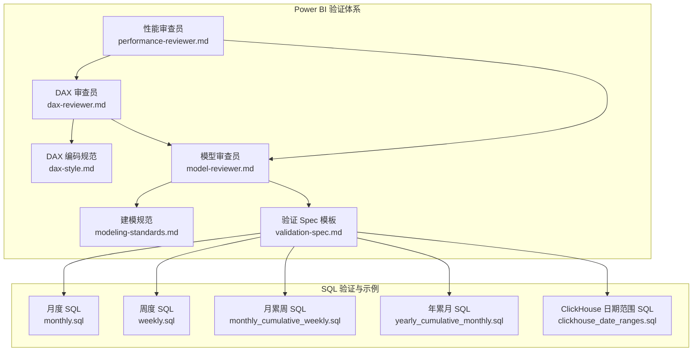
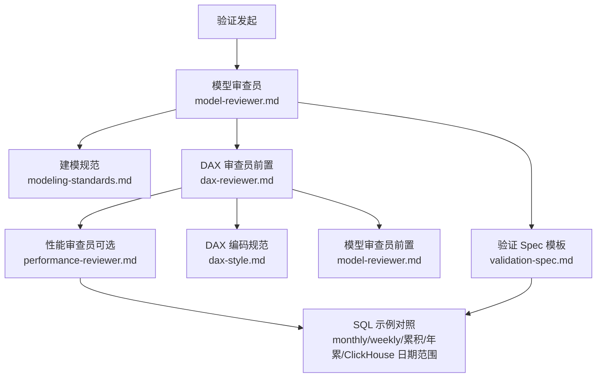
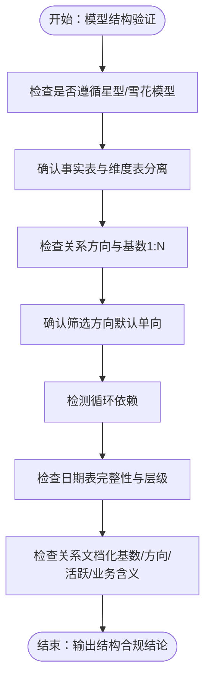
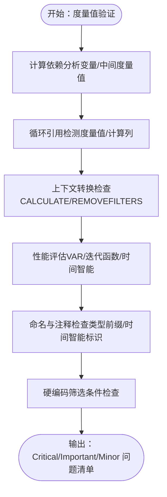
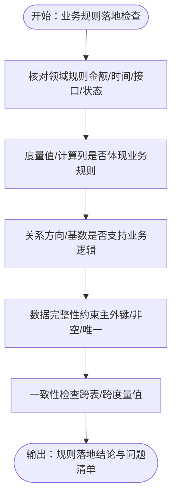
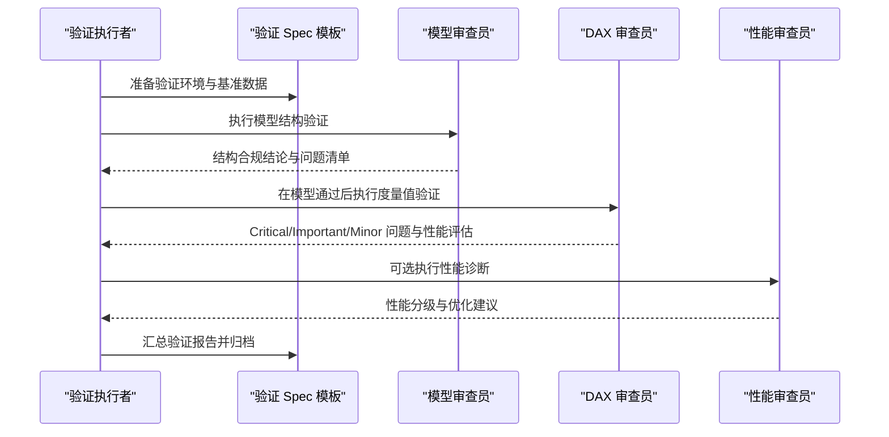
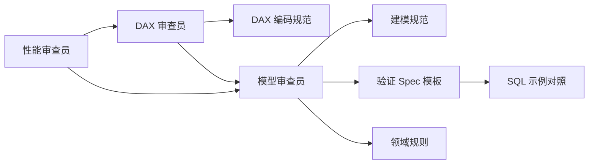

# 数据模型验证

<cite>
**本文引用的文件**
- [model-reviewer.md](file://powerbi_code_copilot/agents/model-reviewer.md)
- [dax-reviewer.md](file://powerbi_code_copilot/agents/dax-reviewer.md)
- [performance-reviewer.md](file://powerbi_code_copilot/agents/performance-reviewer.md)
- [modeling-standards.md](file://powerbi_code_copilot/rules/modeling-standards.md)
- [dax-style.md](file://powerbi_code_copilot/rules/dax-style.md)
- [validation-spec.md](file://powerbi_code_copilot/changes/templates/validation-spec.md)
- [domain-rules.md](file://code_copilot/rules/domain-rules.md)
- [monthly.sql](file://Quickbi_sql/周大福/周大福_日期范围生成_ARRAY JOIN_Clickhou/monthly.sql)
- [weekly.sql](file://Quickbi_sql/周大福/周大福_日期范围生成_ARRAY JOIN_Clickhou/weekly.sql)
- [monthly_cumulative_weekly.sql](file://Quickbi_sql/周大福/周大福_日期范围生成_ARRAY JOIN_Clickhou/monthly_cumulative_weekly.sql)
- [yearly_cumulative_monthly.sql](file://Quickbi_sql/周大福/周大福_日期范围生成_ARRAY JOIN_Clickhou/yearly_cumulative_monthly.sql)
- [clickhouse_date_ranges.sql](file://Quickbi_sql/周大福/周大福_日期范围生成_demo/clickhouse_date_ranges.sql)
</cite>

## 目录
1. [引言](#引言)
2. [项目结构](#项目结构)
3. [核心组件](#核心组件)
4. [架构总览](#架构总览)
5. [详细组件分析](#详细组件分析)
6. [依赖分析](#依赖分析)
7. [性能考量](#性能考量)
8. [故障排除指南](#故障排除指南)
9. [结论](#结论)
10. [附录](#附录)

## 引言
本技术文档围绕“数据模型验证”主题，系统梳理并阐述以下方面：
- 数据模型结构检查：表关系验证、字段类型检查、基数分析
- 度量值验证：计算依赖分析、循环引用检测、性能影响评估
- 业务规则落地检查：数据完整性约束、业务逻辑验证、一致性检查
- 模型优化建议与最佳实践：面向 Power BI 的建模规范、DAX 编写规范与性能审查
- 验证流程与示例：基于模板的验证步骤、证据收集与报告输出
- 故障排除：常见问题定位方法与修复建议

本文件严格依据仓库内现有文档与规范，确保内容可追溯、可执行。

## 项目结构
该仓库包含两套相互补充的验证体系：
- Power BI 模型与 DAX 验证：通过“模型审查员”“DAX 审查员”“性能审查员”三类 Agent，分别从结构、度量值质量与性能三个维度进行独立验证。
- SQL 侧数据生成与校验：提供 ClickHouse 日期范围生成与累计聚合示例，作为数据层验证与回归的参考。

图表来源
- [model-reviewer.md:1-36](file://powerbi_code_copilot/agents/model-reviewer.md#L1-L36)
- [dax-reviewer.md:1-56](file://powerbi_code_copilot/agents/dax-reviewer.md#L1-L56)
- [performance-reviewer.md:1-71](file://powerbi_code_copilot/agents/performance-reviewer.md#L1-L71)
- [modeling-standards.md:1-55](file://powerbi_code_copilot/rules/modeling-standards.md#L1-L55)
- [dax-style.md:1-218](file://powerbi_code_copilot/rules/dax-style.md#L1-L218)
- [validation-spec.md:1-69](file://powerbi_code_copilot/changes/templates/validation-spec.md#L1-L69)
- [monthly.sql](file://Quickbi_sql/周大福/周大福_日期范围生成_ARRAY JOIN_Clickhou/monthly.sql)
- [weekly.sql](file://Quickbi_sql/周大福/周大福_日期范围生成_ARRAY JOIN_Clickhou/weekly.sql)
- [monthly_cumulative_weekly.sql](file://Quickbi_sql/周大福/周大福_日期范围生成_ARRAY JOIN_Clickhou/monthly_cumulative_weekly.sql)
- [yearly_cumulative_monthly.sql](file://Quickbi_sql/周大福/周大福_日期范围生成_ARRAY JOIN_Clickhou/yearly_cumulative_monthly.sql)
- [clickhouse_date_ranges.sql](file://Quickbi_sql/周大福/周大福_日期范围生成_demo/clickhouse_date_ranges.sql)

章节来源
- [model-reviewer.md:1-36](file://powerbi_code_copilot/agents/model-reviewer.md#L1-L36)
- [dax-reviewer.md:1-56](file://powerbi_code_copilot/agents/dax-reviewer.md#L1-L56)
- [performance-reviewer.md:1-71](file://powerbi_code_copilot/agents/performance-reviewer.md#L1-L71)
- [modeling-standards.md:1-55](file://powerbi_code_copilot/rules/modeling-standards.md#L1-L55)
- [dax-style.md:1-218](file://powerbi_code_copilot/rules/dax-style.md#L1-L218)
- [validation-spec.md:1-69](file://powerbi_code_copilot/changes/templates/validation-spec.md#L1-L69)

## 核心组件
- 模型审查员：独立读取 Power BI 模型，验证表/列/关系/度量值是否存在且方向正确；检查业务规则是否在度量值/计算列中落地；识别循环依赖与双向筛选的合理性。
- DAX 审查员：在模型审查通过后介入，评估度量值的计算质量、性能与可维护性，识别上下文转换错误、循环依赖、命名与注释问题以及潜在的性能隐患。
- 性能审查员：从数据源层、Power Query 层、模型层、DAX 层与可视化层五个维度诊断性能瓶颈，给出分级问题清单与优化路线图。
- 建模规范与 DAX 编码规范：提供星型/雪花模型、关系设计、表/列/度量值命名、格式与性能优先原则等强制性与建议性标准。
- 验证 Spec 模板：定义验证原则、验证环境、数据准确性验证、模型结构验证、性能验证与安全验证的标准化流程与输出格式。

章节来源
- [model-reviewer.md:6-18](file://powerbi_code_copilot/agents/model-reviewer.md#L6-L18)
- [dax-reviewer.md:5-26](file://powerbi_code_copilot/agents/dax-reviewer.md#L5-L26)
- [performance-reviewer.md:5-38](file://powerbi_code_copilot/agents/performance-reviewer.md#L5-L38)
- [modeling-standards.md:7-55](file://powerbi_code_copilot/rules/modeling-standards.md#L7-L55)
- [dax-style.md:7-170](file://powerbi_code_copilot/rules/dax-style.md#L7-L170)
- [validation-spec.md:6-58](file://powerbi_code_copilot/changes/templates/validation-spec.md#L6-L58)

## 架构总览
下图展示了验证流程的总体架构与各组件之间的依赖关系：

图表来源
- [model-reviewer.md:1-36](file://powerbi_code_copilot/agents/model-reviewer.md#L1-L36)
- [dax-reviewer.md:1-56](file://powerbi_code_copilot/agents/dax-reviewer.md#L1-L56)
- [performance-reviewer.md:1-71](file://powerbi_code_copilot/agents/performance-reviewer.md#L1-L71)
- [modeling-standards.md:1-55](file://powerbi_code_copilot/rules/modeling-standards.md#L1-L55)
- [dax-style.md:1-218](file://powerbi_code_copilot/rules/dax-style.md#L1-L218)
- [validation-spec.md:1-69](file://powerbi_code_copilot/changes/templates/validation-spec.md#L1-L69)
- [monthly.sql](file://Quickbi_sql/周大福/周大福_日期范围生成_ARRAY JOIN_Clickhou/monthly.sql)
- [weekly.sql](file://Quickbi_sql/周大福/周大福_日期范围生成_ARRAY JOIN_Clickhou/weekly.sql)
- [monthly_cumulative_weekly.sql](file://Quickbi_sql/周大福/周大福_日期范围生成_ARRAY JOIN_Clickhou/monthly_cumulative_weekly.sql)
- [yearly_cumulative_monthly.sql](file://Quickbi_sql/周大福/周大福_日期范围生成_ARRAY JOIN_Clickhou/yearly_cumulative_monthly.sql)
- [clickhouse_date_ranges.sql](file://Quickbi_sql/周大福/周大福_日期范围生成_demo/clickhouse_date_ranges.sql)

## 详细组件分析

### 模型结构验证（表关系、字段类型、基数）
- 星型/雪花模型优先：事实表存放可度量业务事件，维度表存放描述性属性；仅在确有必要时使用雪花型并说明原因。
- 关系设计原则：1:N（从维度表指向事实表）、默认单向筛选、禁止循环依赖、每张事实表必须关联日期维度表。
- 日期表要求：独立日期维度表、完整连续日期范围、标记为日期表、包含 Year→Quarter→Month→Week→Day 标准层级。
- 关系文档化：记录“源表.源列 → 目标表.目标列 | 基数 | 筛选方向 | 是否活跃 | 业务含义”。

图表来源
- [modeling-standards.md:7-44](file://powerbi_code_copilot/rules/modeling-standards.md#L7-L44)

章节来源
- [modeling-standards.md:7-44](file://powerbi_code_copilot/rules/modeling-standards.md#L7-L44)

### 度量值验证（计算依赖、循环引用、性能）
- 审查分级：Critical（阻塞）、Important（应修复）、Minor（建议）。
- 关键关注点：计算结果错误、上下文转换错误、循环依赖、隐式度量值歧义、RLS 规则绕过风险、未使用 VAR 导致重复计算、不必要的迭代函数、FILTER(ALL(...)) 可用 REMOVEFILTERS 替代、命名与注释问题、硬编码筛选条件。
- 性能审查清单：避免不必要的上下文转换、优化 CALCULATE 筛选参数、迭代函数在最小粒度表上运行、利用变量避免重复计算、正确使用时间智能函数、评估是否可预计算为计算列。

图表来源
- [dax-reviewer.md:5-35](file://powerbi_code_copilot/agents/dax-reviewer.md#L5-L35)
- [dax-style.md:143-170](file://powerbi_code_copilot/rules/dax-style.md#L143-L170)

章节来源
- [dax-reviewer.md:5-35](file://powerbi_code_copilot/agents/dax-reviewer.md#L5-L35)
- [dax-style.md:143-170](file://powerbi_code_copilot/rules/dax-style.md#L143-L170)

### 业务规则落地检查（完整性约束、逻辑验证、一致性）
- 审查维度：缺失实现、多余实现、理解偏差、业务规则落地、数据变更准确性。
- 业务规则来源：领域规则（如金额单位、时间字段类型、外部接口超时与降级、状态机变更）。
- 落地方式：度量值与计算列是否体现业务规则；关系方向与基数是否支持业务筛选传播；日期维度是否满足时间智能需求。

图表来源
- [model-reviewer.md:6-18](file://powerbi_code_copilot/agents/model-reviewer.md#L6-L18)
- [domain-rules.md:6-13](file://code_copilot/rules/domain-rules.md#L6-L13)

章节来源
- [model-reviewer.md:6-18](file://powerbi_code_copilot/agents/model-reviewer.md#L6-L18)
- [domain-rules.md:6-13](file://code_copilot/rules/domain-rules.md#L6-L13)

### 验证流程与示例（基于模板）
- 验证原则：数据驱动、对比验证、边界测试、展示证据。
- 验证环境：数据源环境、数据量级、时间范围、已知基准值来源。
- 数据准确性验证：核心业务指标（P0）与辅助指标（P1）的多场景对比，覆盖全量、单月、维度交叉与空值场景。
- 模型结构验证：关系方向与基数、筛选器传播、循环依赖、RLS 隔离。
- 性能验证：页面加载、切片器筛选、钻取操作的响应时间阈值。
- 安全验证（如涉及 RLS）：角色与预期可见数据的对比。

图表来源
- [validation-spec.md:1-69](file://powerbi_code_copilot/changes/templates/validation-spec.md#L1-L69)
- [model-reviewer.md:1-36](file://powerbi_code_copilot/agents/model-reviewer.md#L1-L36)
- [dax-reviewer.md:1-56](file://powerbi_code_copilot/agents/dax-reviewer.md#L1-L56)
- [performance-reviewer.md:1-71](file://powerbi_code_copilot/agents/performance-reviewer.md#L1-L71)

章节来源
- [validation-spec.md:6-69](file://powerbi_code_copilot/changes/templates/validation-spec.md#L6-L69)

### SQL 示例与对照验证（日期范围与累计）
- 月度/周度 SQL：用于生成时间维度与基础聚合，作为 Power BI 日期表与度量值的底层数据来源。
- 月累周/年累月 SQL：演示累计聚合的实现思路，便于验证度量值的时间智能与层级一致性。
- ClickHouse 日期范围 SQL：提供不同粒度的日期范围生成示例，可用于对比与回归测试。

章节来源
- [monthly.sql](file://Quickbi_sql/周大福/周大福_日期范围生成_ARRAY JOIN_Clickhou/monthly.sql)
- [weekly.sql](file://Quickbi_sql/周大福/周大福_日期范围生成_ARRAY JOIN_Clickhou/weekly.sql)
- [monthly_cumulative_weekly.sql](file://Quickbi_sql/周大福/周大福_日期范围生成_ARRAY JOIN_Clickhou/monthly_cumulative_weekly.sql)
- [yearly_cumulative_monthly.sql](file://Quickbi_sql/周大福/周大福_日期范围生成_ARRAY JOIN_Clickhou/yearly_cumulative_monthly.sql)
- [clickhouse_date_ranges.sql](file://Quickbi_sql/周大福/周大福_日期范围生成_demo/clickhouse_date_ranges.sql)

## 依赖分析
- 组件耦合与协作：
  - DAX 审查员依赖模型审查员先行通过，确保度量值验证建立在正确的模型结构之上。
  - 性能审查员可独立启动，也可在 DAX 审查后进行更深入的诊断。
  - 建模规范与 DAX 编码规范为审查员提供判定依据。
  - 验证 Spec 模板贯穿全流程，作为输出格式与证据收集的统一标准。
- 外部依赖与集成点：
  - SQL 示例作为数据层对照，支撑模型层与 DAX 层的交叉验证。
  - 领域规则为业务规则落地提供约束与基线。

图表来源
- [model-reviewer.md:1-36](file://powerbi_code_copilot/agents/model-reviewer.md#L1-L36)
- [dax-reviewer.md:1-56](file://powerbi_code_copilot/agents/dax-reviewer.md#L1-L56)
- [performance-reviewer.md:1-71](file://powerbi_code_copilot/agents/performance-reviewer.md#L1-L71)
- [modeling-standards.md:1-55](file://powerbi_code_copilot/rules/modeling-standards.md#L1-L55)
- [dax-style.md:1-218](file://powerbi_code_copilot/rules/dax-style.md#L1-L218)
- [validation-spec.md:1-69](file://powerbi_code_copilot/changes/templates/validation-spec.md#L1-L69)
- [domain-rules.md:6-13](file://code_copilot/rules/domain-rules.md#L6-L13)
- [monthly.sql](file://Quickbi_sql/周大福/周大福_日期范围生成_ARRAY JOIN_Clickhou/monthly.sql)

章节来源
- [model-reviewer.md:1-36](file://powerbi_code_copilot/agents/model-reviewer.md#L1-L36)
- [dax-reviewer.md:1-56](file://powerbi_code_copilot/agents/dax-reviewer.md#L1-L56)
- [performance-reviewer.md:1-71](file://powerbi_code_copilot/agents/performance-reviewer.md#L1-L71)
- [modeling-standards.md:1-55](file://powerbi_code_copilot/rules/modeling-standards.md#L1-L55)
- [dax-style.md:1-218](file://powerbi_code_copilot/rules/dax-style.md#L1-L218)
- [validation-spec.md:1-69](file://powerbi_code_copilot/changes/templates/validation-spec.md#L1-L69)
- [domain-rules.md:6-13](file://code_copilot/rules/domain-rules.md#L6-L13)

## 性能考量
- 数据源层：关注查询折叠是否生效、数据源响应延迟、数据量是否合理、增量刷新配置。
- Power Query 层：步骤是否冗余、数据类型是否在源端指定、是否存在阻断查询折叠的步骤。
- 模型层：表的基数与大小、列的数据类型最优性、关系数量与复杂度、未使用列/表清理、计算列/计算表/预处理选择、分区策略。
- DAX 层：度量值复杂度、迭代函数数据量、上下文转换开销、变量复用程度、时间智能函数优化。
- 可视化层：单页视觉对象数量、高基数列在切片器中的使用、交叉高亮/交叉筛选复杂度、自定义视觉对象性能、条件格式与动态标题的计算开销。

章节来源
- [performance-reviewer.md:5-38](file://powerbi_code_copilot/agents/performance-reviewer.md#L5-L38)

## 故障排除指南
- 循环依赖与歧义路径：优先检查关系方向与基数，确认不存在双向筛选或循环引用；必要时在文档中说明双向筛选的业务理由。
- 上下文转换错误：避免滥用 CALCULATE 与 EARLIER，优先使用 REMOVEFILTERS 替代 FILTER(ALL(...))，明确每个筛选参数的意图。
- 性能热点定位：优先检查度量值复杂度与迭代函数规模，利用变量减少重复计算，确保时间智能函数正确绑定日期表。
- 命名与注释问题：遵循 DAX 编码规范的命名前缀与注释要求，复杂度量值必须添加头部注释并说明依赖。
- 硬编码筛选条件：将日期或业务参数参数化，避免在度量值中硬编码。
- RLS 规则绕过风险：确保角色与数据隔离策略正确配置，并在安全验证环节进行对比测试。

章节来源
- [dax-reviewer.md:7-26](file://powerbi_code_copilot/agents/dax-reviewer.md#L7-L26)
- [dax-style.md:143-170](file://powerbi_code_copilot/rules/dax-style.md#L143-L170)
- [modeling-standards.md:24-37](file://powerbi_code_copilot/rules/modeling-standards.md#L24-L37)

## 结论
通过“模型审查员—DAX 审查员—性能审查员”的三层验证体系，结合建模与 DAX 编码规范、验证 Spec 模板以及 SQL 示例对照，能够系统性地完成数据模型结构检查、度量值验证与业务规则落地检查，并形成可追溯、可量化的验证报告。建议在项目实践中严格执行验证流程，持续优化模型与度量值，确保数据准确性、性能与可维护性的平衡。

## 附录
- 验证执行计划（摘自验证 Spec 模板）：
  - 准备基准数据（SQL 直查/Excel 计算）
  - 验证 P0 核心指标
  - 验证 P1 辅助指标
  - 验证模型结构和关系
  - 性能测试
  - 安全测试（如适用）
  - 汇总验证报告

章节来源
- [validation-spec.md:60-69](file://powerbi_code_copilot/changes/templates/validation-spec.md#L60-L69)