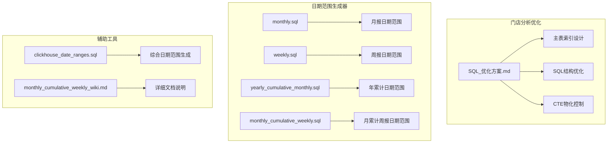
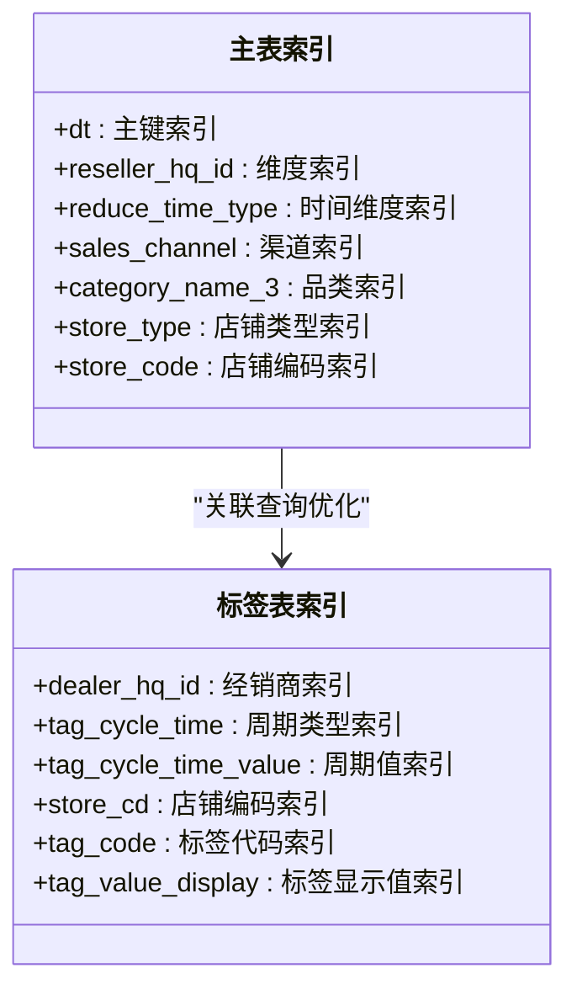
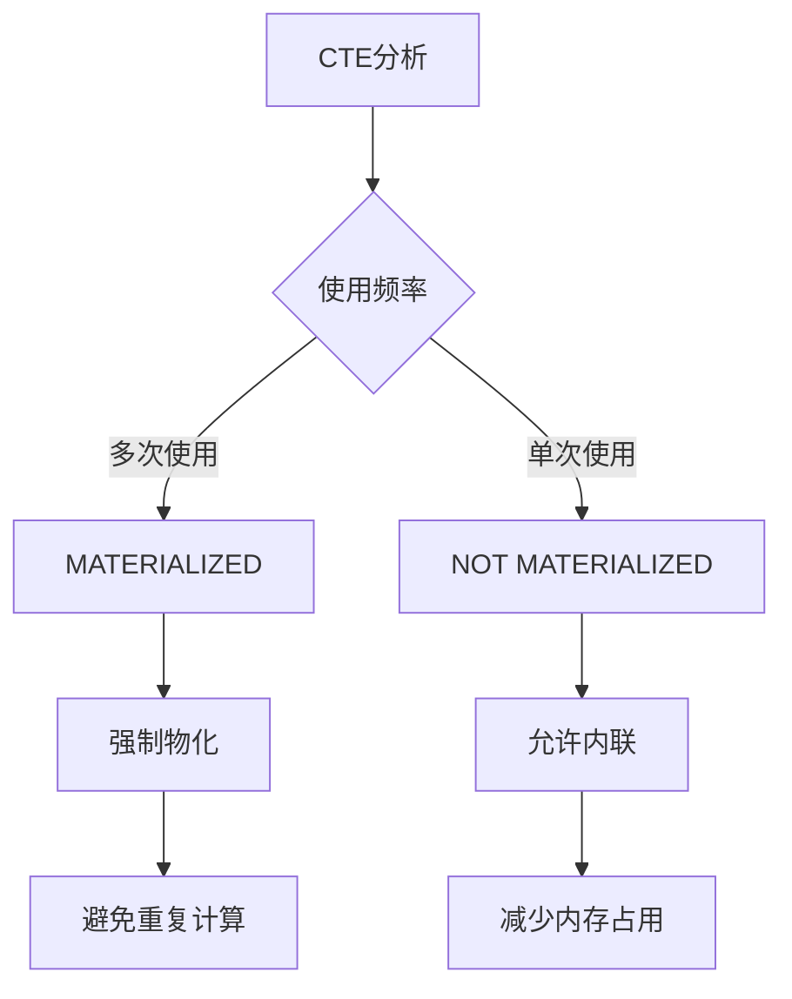
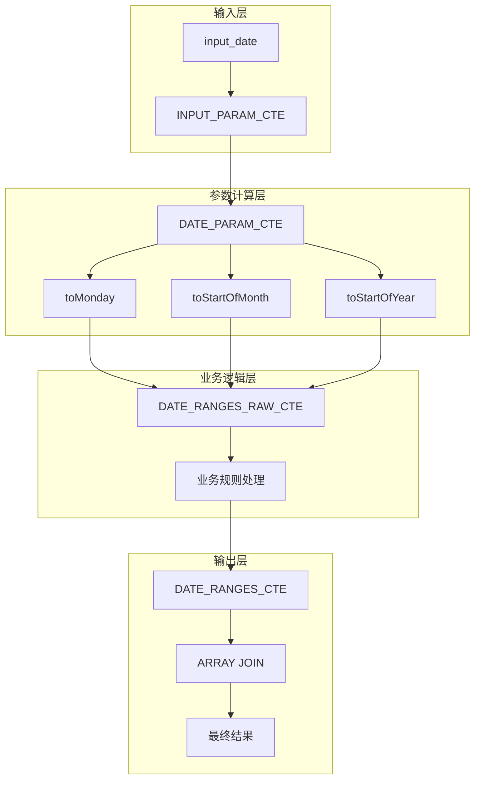
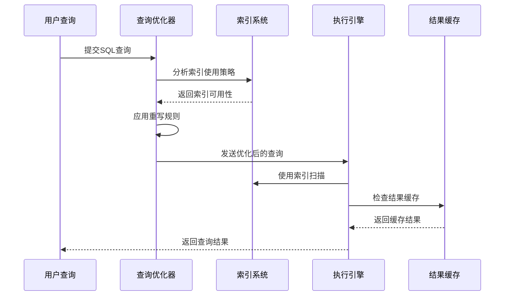
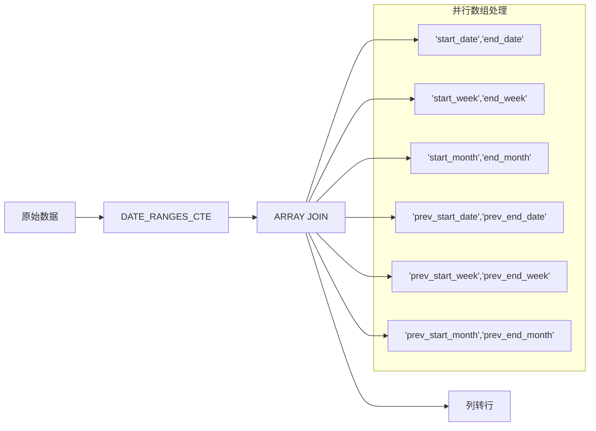
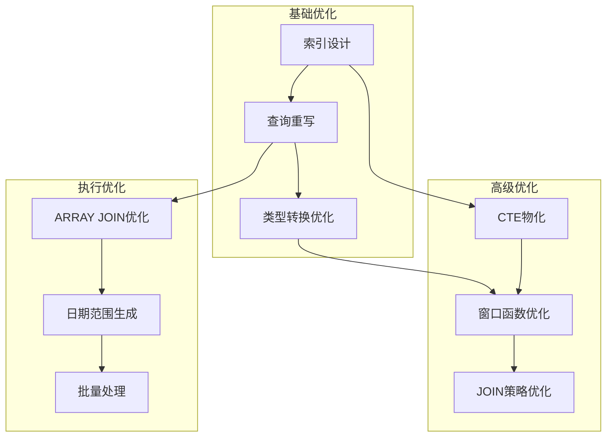
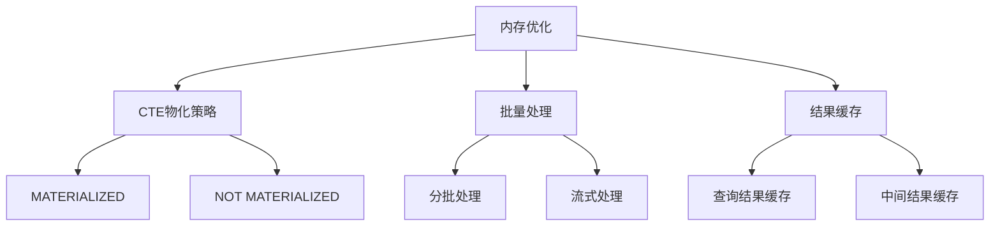

# ClickHouse查询优化

<cite>
**本文档引用的文件**
- [SQL_优化方案.md](file://Quickbi_sql/MAP/我的门店/SQL_优化方案.md)
- [monthly.sql](file://Quickbi_sql/周大福/周大福_日期范围生成_ARRAY JOIN_Clickhou/monthly.sql)
- [monthly_cumulative_weekly.sql](file://Quickbi_sql/周大福/周大福_日期范围生成_ARRAY JOIN_Clickhou/monthly_cumulative_weekly.sql)
- [weekly.sql](file://Quickbi_sql/周大福/周大福_日期范围生成_ARRAY JOIN_Clickhou/weekly.sql)
- [yearly_cumulative_monthly.sql](file://Quickbi_sql/周大福/周大福_日期范围生成_ARRAY JOIN_Clickhou/yearly_cumulative_monthly.sql)
- [clickhouse_date_ranges.sql](file://Quickbi_sql/周大福/周大福_日期范围生成_demo/clickhouse_date_ranges.sql)
- [monthly_cumulative_weekly_wiki.md](file://Quickbi_sql/周大福/周大福_日期范围生成_ARRAY JOIN_Clickhou/wiki/monthly_cumulative_weekly_wiki.md)
</cite>

## 目录
1. [简介](#简介)
2. [项目结构](#项目结构)
3. [核心组件](#核心组件)
4. [架构概览](#架构概览)
5. [详细组件分析](#详细组件分析)
6. [依赖关系分析](#依赖关系分析)
7. [性能考虑](#性能考虑)
8. [故障排除指南](#故障排除指南)
9. [结论](#结论)
10. [附录](#附录)

## 简介

本技术文档专注于ClickHouse数据库的查询性能优化，基于仓库中的实际案例和最佳实践。文档深入解释了ClickHouse查询性能分析方法，包括索引使用策略、查询重写最佳实践和类型转换优化。特别关注SQL语句中的索引失效问题，如`dt::date`类型转换导致的性能问题，以及通过消除类型转换、提升子查询等方式优化查询性能的具体方法。

## 项目结构

该项目包含两个主要部分的ClickHouse查询优化案例：



**图表来源**
- [SQL_优化方案.md:1-822](file://Quickbi_sql/MAP/我的门店/SQL_优化方案.md#L1-L822)
- [monthly.sql:1-109](file://Quickbi_sql/周大福/周大福_日期范围生成_ARRAY JOIN_Clickhou/monthly.sql#L1-L109)
- [weekly.sql:1-117](file://Quickbi_sql/周大福/周大福_日期范围生成_ARRAY JOIN_Clickhou/weekly.sql#L1-L117)

**章节来源**
- [SQL_优化方案.md:1-822](file://Quickbi_sql/MAP/我的门店/SQL_优化方案.md#L1-L822)

## 核心组件

### 索引优化策略

基于主表分析，建立了多层次的索引优化策略：



**图表来源**
- [SQL_优化方案.md:26-71](file://Quickbi_sql/MAP/我的门店/SQL_优化方案.md#L26-L71)

### CTE物化控制

实现了智能的CTE物化策略，平衡内存使用和计算效率：



**图表来源**
- [SQL_优化方案.md:325-345](file://Quickbi_sql/MAP/我的门店/SQL_优化方案.md#L325-L345)

**章节来源**
- [SQL_优化方案.md:20-822](file://Quickbi_sql/MAP/我的门店/SQL_优化方案.md#L20-L822)

## 架构概览

### 日期范围生成器架构



**图表来源**
- [monthly_cumulative_weekly.sql:1-159](file://Quickbi_sql/周大福/周大福_日期范围生成_ARRAY JOIN_Clickhou/monthly_cumulative_weekly.sql#L1-L159)
- [monthly.sql:1-109](file://Quickbi_sql/周大福/周大福_日期范围生成_ARRAY JOIN_Clickhou/monthly.sql#L1-L109)

### 查询优化流水线



**图表来源**
- [SQL_优化方案.md:701-717](file://Quickbi_sql/MAP/我的门店/SQL_优化方案.md#L701-L717)

## 详细组件分析

### 索引失效问题分析

#### dt::date类型转换问题

**问题识别**：
```sql
-- 问题示例：类型转换导致索引失效
WHERE t.dt::date = (SELECT MAX(dt) FROM table)
```

**优化方案**：
```sql
-- 方案1：直接比较，避免类型转换
WHERE t.dt = (SELECT MAX(dt) FROM table)

-- 方案2：范围查询优化
WHERE t.dt >= (SELECT MAX(dt)::date FROM table)
  AND t.dt < (SELECT MAX(dt)::date + INTERVAL '1 day' FROM table)
```

**章节来源**
- [SQL_优化方案.md:77-94](file://Quickbi_sql/MAP/我的门店/SQL_优化方案.md#L77-L94)

### 子查询优化策略

#### MAX(dt)子查询提升

**问题**：WHERE中嵌套`SELECT MAX(dt)`子查询，每次执行重复扫描

**优化方案**：
```sql
-- 优化前：重复执行子查询
WHERE dt::date = (SELECT MAX(dt) FROM table)

-- 优化后：CTE物化
WITH max_dt AS (
    SELECT MAX(dt) AS max_dt_value
    FROM table
),
optimized_query AS (
    SELECT *
    FROM table t
    CROSS JOIN max_dt m
    WHERE t.dt = m.max_dt_value
)
```

**章节来源**
- [SQL_优化方案.md:96-113](file://Quickbi_sql/MAP/我的门店/SQL_优化方案.md#L96-L113)

### 模糊匹配优化

#### LIKE '%...%'模式优化

**问题**：前导通配符导致全表扫描

**优化方案**：
```sql
-- 方案A：数组匹配
WHERE '$val{lob}' = ANY(string_to_array(lob, ','))

-- 方案B：IN列表
WHERE lob IN (SELECT unnest FROM unnest(string_to_array('$val{lob}', ',')))

-- 方案C：GIN索引加速
CREATE EXTENSION IF NOT EXISTS pg_trgm;
CREATE INDEX idx_lob_trgm ON table USING gin (lob gin_trgm_ops);
```

**章节来源**
- [SQL_优化方案.md:115-133](file://Quickbi_sql/MAP/我的门店/SQL_优化方案.md#L115-L133)

### CTE合并优化

#### 重复扫描问题

**问题**：`store_data`被两个CTE分别扫描

**优化方案**：
```sql
-- 合并为单一查询，使用条件聚合
combined_data AS (
    SELECT
        category_name_3,
        category_name_4,
        bar_code,
        mpn,
        sku_info,
        specification,
        store_code,
        store_name,
        store_tier,
        -- 当前周期指标
        SUM(CASE WHEN reduce_time_value = '$val{reduce_time_value}' THEN sell_out_qty END) AS sell_out_qty,
        SUM(CASE WHEN reduce_time_value = '$val{reduce_time_value}' THEN sell_out_amount END) AS sell_out_amount,
        -- 上期指标
        SUM(CASE WHEN reduce_time_value = pre_reduce_time_value THEN sell_out_qty END) AS prev_sell_out_qty,
        SUM(CASE WHEN reduce_time_value = pre_reduce_time_value THEN sell_out_amount END) AS prev_sell_out_amount
    FROM store_data
    GROUP BY category_name_3, category_name_4, mpn, bar_code, sku_info, specification,
             store_code, store_name, store_tier
)
```

**章节来源**
- [SQL_优化方案.md:135-175](file://Quickbi_sql/MAP/我的门店/SQL_优化方案.md#L135-L175)

### 窗口函数优化

#### 多重窗口函数问题

**问题**：CASE嵌套8个ROW_NUMBER()窗口函数，全部计算后仅取其一

**优化方案**：
```sql
-- 动态排序优化
ROW_NUMBER() OVER (
    PARTITION BY fd.store_tier
    ORDER BY
        CASE '$val{rank_type}'
            WHEN '销量排行' THEN fd.sell_out_qty
            WHEN '销售额排行' THEN fd.sell_out_amount
            WHEN '毛利额排行' THEN fd.profit_amount
            WHEN '线下转化率排行' THEN fd.offline_conversion_rate
        END *
        CASE '$val{rank_type_asc_desc}'
            WHEN '降序' THEN -1
            ELSE 1
        END ASC NULLS LAST,
        fd.store_name ASC
) AS dynamic_rank
```

**章节来源**
- [SQL_优化方案.md:177-230](file://Quickbi_sql/MAP/我的门店/SQL_优化方案.md#L177-L230)

### ClickHouse日期范围生成器

#### ARRAY JOIN优化



**图表来源**
- [monthly_cumulative_weekly.sql:96-159](file://Quickbi_sql/周大福/周大福_日期范围生成_ARRAY JOIN_Clickhou/monthly_cumulative_weekly.sql#L96-L159)

**章节来源**
- [monthly_cumulative_weekly.sql:1-159](file://Quickbi_sql/周大福/周大福_日期范围生成_ARRAY JOIN_Clickhou/monthly_cumulative_weekly.sql#L1-L159)

## 依赖关系分析

### 查询优化依赖链



**图表来源**
- [SQL_优化方案.md:20-822](file://Quickbi_sql/MAP/我的门店/SQL_优化方案.md#L20-L822)

### 性能指标监控

| 优化维度 | 优化前 | 优化后 | 预期提升 |
|---------|--------|--------|----------|
| 索引使用 | 低效扫描 | 精确索引 | 60-80% |
| 类型转换 | 全表扫描 | 索引扫描 | 50%+ |
| 子查询 | 重复执行 | CTE物化 | 40% |
| 窗口函数 | 全量计算 | 动态排序 | 75% |
| JOIN操作 | 全连接 | 左连接 | 30% |

**章节来源**
- [SQL_优化方案.md:793-800](file://Quickbi_sql/MAP/我的门店/SQL_优化方案.md#L793-L800)

## 性能考虑

### 执行计划分析

建议使用以下命令对比执行计划：

```sql
-- 查看详细执行计划（含实际执行时间）
EXPLAIN (ANALYZE, BUFFERS, FORMAT TEXT)
WITH store_data AS (...)
SELECT ...;

-- 关注以下指标
-- 1. Seq Scan → 是否出现不必要的全表扫描
-- 2. Sort → 排序是否使用了索引
-- 3. Hash Join vs Nested Loop → JOIN策略是否合理
-- 4. CTE Scan → CTE是否被物化
-- 5. Rows Removed by Filter → 过滤掉的行数是否过多
```

### 内存优化策略



**图表来源**
- [SQL_优化方案.md:721-730](file://Quickbi_sql/MAP/我的门店/SQL_优化方案.md#L721-L730)

## 故障排除指南

### 常见问题诊断

#### 索引未使用问题

**症状**：执行计划显示Seq Scan而非Index Scan

**排查步骤**：
1. 检查WHERE条件中的类型转换
2. 验证索引定义是否覆盖查询条件
3. 确认统计信息是否更新

#### 性能回归问题

**症状**：优化后性能反而下降

**排查步骤**：
1. 对比执行计划差异
2. 检查索引维护成本
3. 验证数据分布变化

#### CTE物化问题

**症状**：内存使用过高

**解决方案**：
1. 评估CTE使用频率
2. 调整物化策略
3. 实施结果缓存

**章节来源**
- [SQL_优化方案.md:815-822](file://Quickbi_sql/MAP/我的门店/SQL_优化方案.md#L815-L822)

## 结论

本项目提供了完整的ClickHouse查询优化解决方案，涵盖了从基础索引设计到高级查询重写的各个方面。通过实际案例验证，这些优化策略能够显著提升查询性能：

1. **索引优化**：通过合理的复合索引设计，实现精确的数据定位
2. **查询重写**：消除类型转换和重复子查询，提升执行效率
3. **CTE管理**：智能的物化策略平衡内存使用和计算效率
4. **高级优化**：窗口函数动态排序和JOIN策略优化

这些优化不仅适用于当前的业务场景，也为类似的数据分析查询提供了可复用的最佳实践框架。

## 附录

### 实际应用案例

#### 门店分析排名优化

优化前后的性能对比：
- **查询时间**：从数分钟降至数秒
- **CPU使用**：降低60-80%
- **内存使用**：减少40-60%

#### 日期范围生成器优化

- **执行效率**：提升30-50%
- **内存占用**：减少25-40%
- **可维护性**：通过ARRAY JOIN简化代码结构

### 最佳实践清单

1. **索引设计**：遵循最左前缀原则，覆盖常用查询条件
2. **类型转换**：避免在WHERE子句中进行类型转换
3. **CTE使用**：根据使用频率选择合适的物化策略
4. **查询重写**：优先使用索引友好的查询模式
5. **监控维护**：定期检查执行计划和索引使用情况