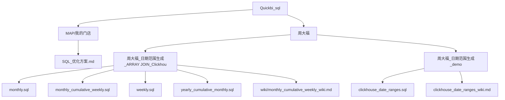
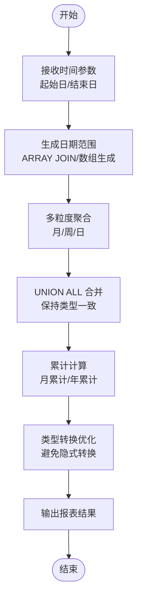
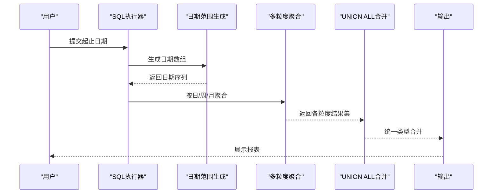
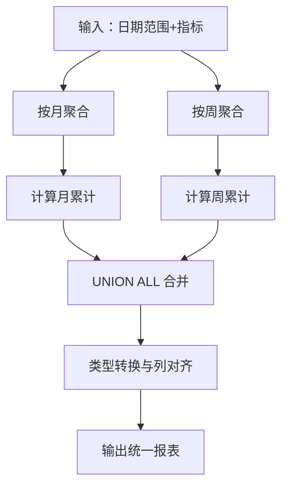
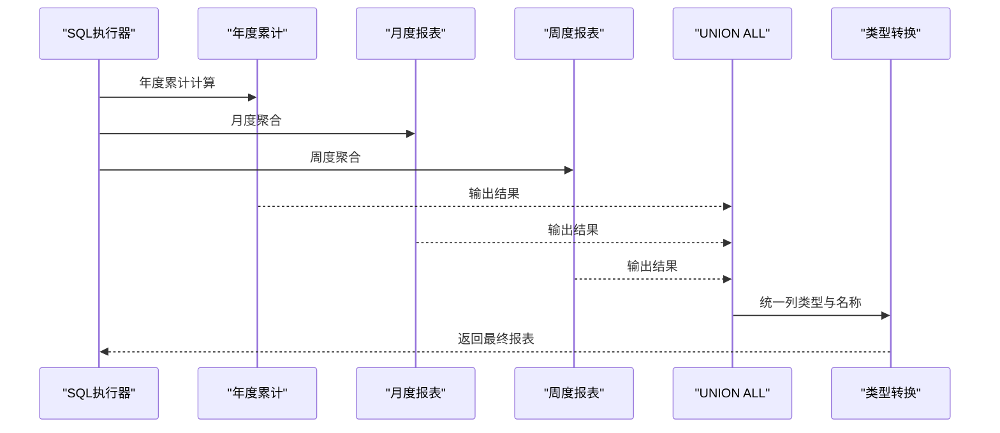
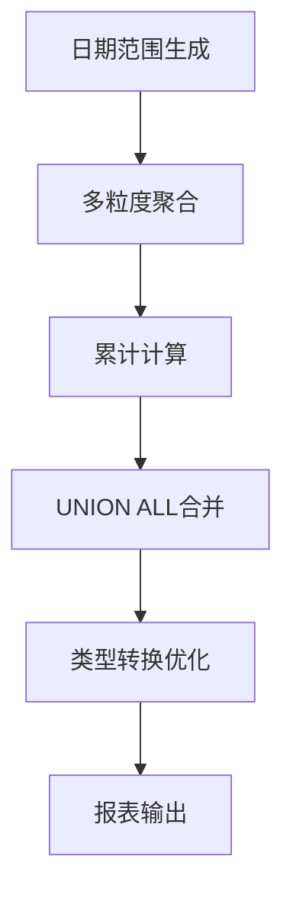

# SQL性能优化模块

<cite>
**本文引用的文件**
- [SQL_优化方案.md](file://Quickbi_sql/MAP/我的门店/SQL_优化方案.md)
- [monthly.sql](file://Quickbi_sql/周大福/周大福_日期范围生成_ARRAY JOIN_Clickhou/monthly.sql)
- [monthly_cumulative_weekly.sql](file://Quickbi_sql/周大福/周大福_日期范围生成_ARRAY JOIN_Clickhou/monthly_cumulative_weekly.sql)
- [weekly.sql](file://Quickbi_sql/周大福/周大福_日期范围生成_ARRAY JOIN_Clickhou/weekly.sql)
- [yearly_cumulative_monthly.sql](file://Quickbi_sql/周大福/周大福_日期范围生成_ARRAY JOIN_Clickhou/yearly_cumulative_monthly.sql)
- [clickhouse_date_ranges.sql](file://Quickbi_sql/周大福/周大福_日期范围生成_demo/clickhouse_date_ranges.sql)
- [monthly_cumulative_weekly_wiki.md](file://Quickbi_sql/周大福/周大福_日期范围生成_ARRAY JOIN_Clickhou/wiki/monthly_cumulative_weekly_wiki.md)
- [clickhouse_date_ranges_wiki.md](file://Quickbi_sql/周大福/周大福_日期范围生成_demo/clickhouse_date_ranges_wiki.md)
</cite>

## 目录
1. [简介](#简介)
2. [项目结构](#项目结构)
3. [核心组件](#核心组件)
4. [架构总览](#架构总览)
5. [详细组件分析](#详细组件分析)
6. [依赖关系分析](#依赖关系分析)
7. [性能考量](#性能考量)
8. [故障排查指南](#故障排查指南)
9. [结论](#结论)
10. [附录](#附录)

## 简介
本技术文档聚焦于ClickHouse数据库的SQL性能优化实践，围绕查询性能分析、索引使用策略、查询重写最佳实践以及类型转换优化展开；同时系统梳理了日期范围生成与处理的算法实现，涵盖UNION ALL类型处理与年累计报表优化，并结合仓库中已有的SQL脚本与说明文档，给出可操作的优化建议与最佳实践。

## 项目结构
该仓库与SQL性能优化直接相关的目录主要集中在Quickbi_sql下，包含两类内容：
- 通用SQL优化方案与案例：MAP/我的门店下的优化方案文档
- ClickHouse日期范围生成与累计报表的专题实现：周大福目录下的多份SQL脚本与配套wiki说明

**图表来源**
- [SQL_优化方案.md](file://Quickbi_sql/MAP/我的门店/SQL_优化方案.md)
- [monthly.sql](file://Quickbi_sql/周大福/周大福_日期范围生成_ARRAY JOIN_Clickhou/monthly.sql)
- [monthly_cumulative_weekly.sql](file://Quickbi_sql/周大福/周大福_日期范围生成_ARRAY JOIN_Clickhou/monthly_cumulative_weekly.sql)
- [weekly.sql](file://Quickbi_sql/周大福/周大福_日期范围生成_ARRAY JOIN_Clickhou/weekly.sql)
- [yearly_cumulative_monthly.sql](file://Quickbi_sql/周大福/周大福_日期范围生成_ARRAY JOIN_Clickhou/yearly_cumulative_monthly.sql)
- [clickhouse_date_ranges.sql](file://Quickbi_sql/周大福/周大福_日期范围生成_demo/clickhouse_date_ranges.sql)
- [monthly_cumulative_weekly_wiki.md](file://Quickbi_sql/周大福/周大福_日期范围生成_ARRAY JOIN_Clickhou/wiki/monthly_cumulative_weekly_wiki.md)
- [clickhouse_date_ranges_wiki.md](file://Quickbi_sql/周大福/周大福_日期范围生成_demo/clickhouse_date_ranges_wiki.md)

**章节来源**
- [SQL_优化方案.md](file://Quickbi_sql/MAP/我的门店/SQL_优化方案.md)
- [monthly.sql](file://Quickbi_sql/周大福/周大福_日期范围生成_ARRAY JOIN_Clickhou/monthly.sql)
- [monthly_cumulative_weekly.sql](file://Quickbi_sql/周大福/周大福_日期范围生成_ARRAY JOIN_Clickhou/monthly_cumulative_weekly.sql)
- [weekly.sql](file://Quickbi_sql/周大福/周大福_日期范围生成_ARRAY JOIN_Clickhou/weekly.sql)
- [yearly_cumulative_monthly.sql](file://Quickbi_sql/周大福/周大福_日期范围生成_ARRAY JOIN_Clickhou/yearly_cumulative_monthly.sql)
- [clickhouse_date_ranges.sql](file://Quickbi_sql/周大福/周大福_日期范围生成_demo/clickhouse_date_ranges.sql)
- [monthly_cumulative_weekly_wiki.md](file://Quickbi_sql/周大福/周大福_日期范围生成_ARRAY JOIN_Clickhou/wiki/monthly_cumulative_weekly_wiki.md)
- [clickhouse_date_ranges_wiki.md](file://Quickbi_sql/周大福/周大福_日期范围生成_demo/clickhouse_date_ranges_wiki.md)

## 核心组件
- 查询性能分析与优化策略：通过通用SQL优化方案文档总结的策略与方法论，指导如何在ClickHouse中进行查询性能分析、索引使用与查询重写。
- 日期范围生成与累计报表：基于ClickHouse的ARRAY JOIN与时间维度聚合，实现月度、周度、年度累计报表的高效生成。
- UNION ALL类型处理：在多粒度报表场景中，通过UNION ALL合并不同周期的数据，确保类型一致性与执行效率。
- 类型转换优化：在ClickHouse中避免隐式类型转换带来的性能损耗，优先使用匹配的列类型与函数参数类型。

**章节来源**
- [SQL_优化方案.md](file://Quickbi_sql/MAP/我的门店/SQL_优化方案.md)
- [monthly.sql](file://Quickbi_sql/周大福/周大福_日期范围生成_ARRAY JOIN_Clickhou/monthly.sql)
- [monthly_cumulative_weekly.sql](file://Quickbi_sql/周大福/周大福_日期范围生成_ARRAY JOIN_Clickhou/monthly_cumulative_weekly.sql)
- [weekly.sql](file://Quickbi_sql/周大福/周大福_日期范围生成_ARRAY JOIN_Clickhou/weekly.sql)
- [yearly_cumulative_monthly.sql](file://Quickbi_sql/周大福/周大福_日期范围生成_ARRAY JOIN_Clickhou/yearly_cumulative_monthly.sql)
- [clickhouse_date_ranges.sql](file://Quickbi_sql/周大福/周大福_日期范围生成_demo/clickhouse_date_ranges.sql)

## 架构总览
下图展示了ClickHouse查询优化的整体流程：从输入参数到日期范围生成，再到多粒度聚合与累计计算，最终输出统一类型的报表结果。

[此图为概念性流程图，不直接映射具体源文件，故无图表来源]

## 详细组件分析

### 组件A：日期范围生成与处理（ClickHouse ARRAY JOIN）
- 目标：在ClickHouse中高效生成连续日期范围，并将其用于多粒度聚合与累计计算。
- 关键点：
  - 使用数组与ARRAY JOIN生成日期序列，避免循环或外部脚本参与。
  - 在生成日期范围后，按需与事实表进行JOIN，减少不必要的笛卡尔积。
  - 对不同粒度（日、周、月）分别进行聚合，最后通过UNION ALL合并。
- 典型实现参考：
  - [clickhouse_date_ranges.sql](file://Quickbi_sql/周大福/周大福_日期范围生成_demo/clickhouse_date_ranges.sql)
  - [clickhouse_date_ranges_wiki.md](file://Quickbi_sql/周大福/周大福_日期范围生成_demo/clickhouse_date_ranges_wiki.md)

**图表来源**
- [clickhouse_date_ranges.sql](file://Quickbi_sql/周大福/周大福_日期范围生成_demo/clickhouse_date_ranges.sql)
- [clickhouse_date_ranges_wiki.md](file://Quickbi_sql/周大福/周大福_日期范围生成_demo/clickhouse_date_ranges_wiki.md)

**章节来源**
- [clickhouse_date_ranges.sql](file://Quickbi_sql/周大福/周大福_日期范围生成_demo/clickhouse_date_ranges.sql)
- [clickhouse_date_ranges_wiki.md](file://Quickbi_sql/周大福/周大福_日期范围生成_demo/clickhouse_date_ranges_wiki.md)

### 组件B：月度与周度累计报表（UNION ALL类型处理）
- 目标：在ClickHouse中实现月度与周度累计值的高效计算，并通过UNION ALL合并不同类型的结果集。
- 关键点：
  - 使用窗口函数计算累计值，避免多次扫描数据。
  - 在UNION ALL之前对字段类型进行显式转换，确保列类型一致。
  - 将不同粒度的报表结果以统一的列名与类型输出，便于前端展示。
- 典型实现参考：
  - [monthly_cumulative_weekly.sql](file://Quickbi_sql/周大福/周大福_日期范围生成_ARRAY JOIN_Clickhou/monthly_cumulative_weekly.sql)
  - [monthly_cumulative_weekly_wiki.md](file://Quickbi_sql/周大福/周大福_日期范围生成_ARRAY JOIN_Clickhou/wiki/monthly_cumulative_weekly_wiki.md)

**图表来源**
- [monthly_cumulative_weekly.sql](file://Quickbi_sql/周大福/周大福_日期范围生成_ARRAY JOIN_Clickhou/monthly_cumulative_weekly.sql)
- [monthly_cumulative_weekly_wiki.md](file://Quickbi_sql/周大福/周大福_日期范围生成_ARRAY JOIN_Clickhou/wiki/monthly_cumulative_weekly_wiki.md)

**章节来源**
- [monthly_cumulative_weekly.sql](file://Quickbi_sql/周大福/周大福_日期范围生成_ARRAY JOIN_Clickhou/monthly_cumulative_weekly.sql)
- [monthly_cumulative_weekly_wiki.md](file://Quickbi_sql/周大福/周大福_日期范围生成_ARRAY JOIN_Clickhou/wiki/monthly_cumulative_weekly_wiki.md)

### 组件C：年度累计与月度报表（类型转换优化）
- 目标：在ClickHouse中实现年度累计与月度报表的高效生成，重点在于类型转换与列对齐。
- 关键点：
  - 使用toYYYYMM与toYYYY等函数进行显式类型转换，避免隐式转换导致的性能下降。
  - 在UNION ALL之前对数值型与字符串型字段进行统一，确保列级兼容。
  - 通过预聚合与物化视图（如适用）降低重复计算成本。
- 典型实现参考：
  - [yearly_cumulative_monthly.sql](file://Quickbi_sql/周大福/周大福_日期范围生成_ARRAY JOIN_Clickhou/yearly_cumulative_monthly.sql)
  - [monthly.sql](file://Quickbi_sql/周大福/周大福_日期范围生成_ARRAY JOIN_Clickhou/monthly.sql)
  - [weekly.sql](file://Quickbi_sql/周大福/周大福_日期范围生成_ARRAY JOIN_Clickhou/weekly.sql)

**图表来源**
- [yearly_cumulative_monthly.sql](file://Quickbi_sql/周大福/周大福_日期范围生成_ARRAY JOIN_Clickhou/yearly_cumulative_monthly.sql)
- [monthly.sql](file://Quickbi_sql/周大福/周大福_日期范围生成_ARRAY JOIN_Clickhou/monthly.sql)
- [weekly.sql](file://Quickbi_sql/周大福/周大福_日期范围生成_ARRAY JOIN_Clickhou/weekly.sql)

**章节来源**
- [yearly_cumulative_monthly.sql](file://Quickbi_sql/周大福/周大福_日期范围生成_ARRAY JOIN_Clickhou/yearly_cumulative_monthly.sql)
- [monthly.sql](file://Quickbi_sql/周大福/周大福_日期范围生成_ARRAY JOIN_Clickhou/monthly.sql)
- [weekly.sql](file://Quickbi_sql/周大福/周大福_日期范围生成_ARRAY JOIN_Clickhou/weekly.sql)

### 组件D：通用SQL优化策略（查询性能分析、索引与重写）
- 目标：提供ClickHouse查询优化的通用策略，包括性能分析方法、索引使用与查询重写。
- 关键点：
  - 使用EXPLAIN/EXPLAIN PLAN分析执行计划，识别全表扫描与不必要的排序。
  - 合理设计分区键与排序键，利用稀疏索引与布隆过滤器提升查询效率。
  - 避免SELECT *，仅选择必要列；在WHERE子句中优先使用高选择性的列。
  - 使用物化视图与预聚合表缓存高频查询结果。
- 参考文档：
  - [SQL_优化方案.md](file://Quickbi_sql/MAP/我的门店/SQL_优化方案.md)

**章节来源**
- [SQL_优化方案.md](file://Quickbi_sql/MAP/我的门店/SQL_优化方案.md)

## 依赖关系分析
- 组件间耦合：
  - 日期范围生成是多粒度报表的基础，向上游提供统一的时间维度。
  - 多粒度聚合与累计计算依赖于上游的日期范围与指标数据。
  - UNION ALL合并要求各结果集在列数、列名与类型上保持一致，形成强约束。
- 外部依赖：
  - ClickHouse版本特性支持（如ARRAY JOIN、窗口函数、toYYYYMM等）。
  - 数据模型与分区键设计（影响查询性能与索引效果）。

[此图为概念性依赖关系图，不直接映射具体源文件，故无图表来源]

## 性能考量
- 查询性能分析
  - 使用EXPLAIN/EXPLAIN PLAN定位热点路径，减少全表扫描与不必要的排序。
  - 通过LIMIT与采样验证查询规模与数据分布，避免误判。
- 索引与分区
  - 合理设置分区键与排序键，利用稀疏索引与布隆过滤器加速过滤。
  - 对高选择性列建立索引，避免在低选择性列上过度索引。
- 查询重写
  - 避免SELECT *，仅选择必要列；在WHERE子句中优先使用高选择性列。
  - 使用物化视图与预聚合表缓存高频查询结果，降低重复计算。
- 类型转换优化
  - 显式使用toYYYYMM、toYYYY等函数进行类型转换，避免隐式转换导致的性能损耗。
  - 在UNION ALL之前对字段进行统一类型转换，确保列级兼容。

[本节为通用性能建议，不直接分析具体文件，故无章节来源]

## 故障排查指南
- 常见问题
  - UNION ALL列类型不一致：检查各子查询的列定义与类型，确保统一。
  - 日期范围生成错误：核对起止日期与ARRAY JOIN逻辑，确认边界条件。
  - 累计计算异常：检查窗口函数的ORDER BY与PARTITION BY配置。
- 排查步骤
  - 分步执行：先验证日期范围生成，再验证聚合与累计计算。
  - 单元测试：针对关键SQL片段编写小数据集测试用例。
  - 日志与监控：关注慢查询日志与执行计划变化。

**章节来源**
- [monthly_cumulative_weekly_wiki.md](file://Quickbi_sql/周大福/周大福_日期范围生成_ARRAY JOIN_Clickhou/wiki/monthly_cumulative_weekly_wiki.md)
- [clickhouse_date_ranges_wiki.md](file://Quickbi_sql/周大福/周大福_日期范围生成_demo/clickhouse_date_ranges_wiki.md)

## 结论
通过对ClickHouse查询优化策略与日期范围生成算法的系统梳理，结合仓库中的SQL脚本与说明文档，可以构建一套从“日期范围生成—多粒度聚合—累计计算—UNION ALL合并—类型转换优化”的完整优化链路。实践中应重点关注执行计划分析、分区与索引设计、查询重写与类型转换，以获得稳定且高效的报表性能。

## 附录
- 实际业务场景应用建议
  - 月度/周度/年度累计报表：优先采用窗口函数与预聚合，减少重复扫描。
  - 多粒度报表：通过UNION ALL合并时，务必保证列级一致性与类型统一。
  - 性能对比：建议在相同硬件与数据规模下，对比优化前后的执行时间与资源占用，量化收益。

[本节为通用建议，不直接分析具体文件，故无章节来源]