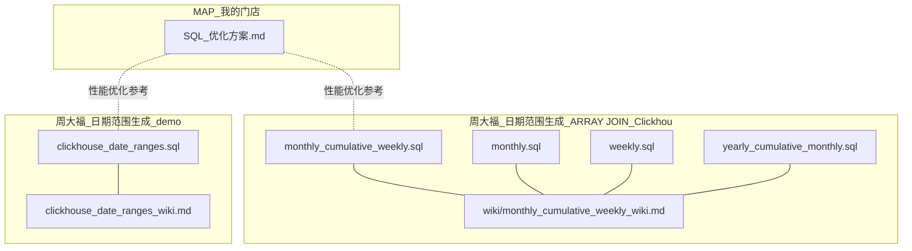
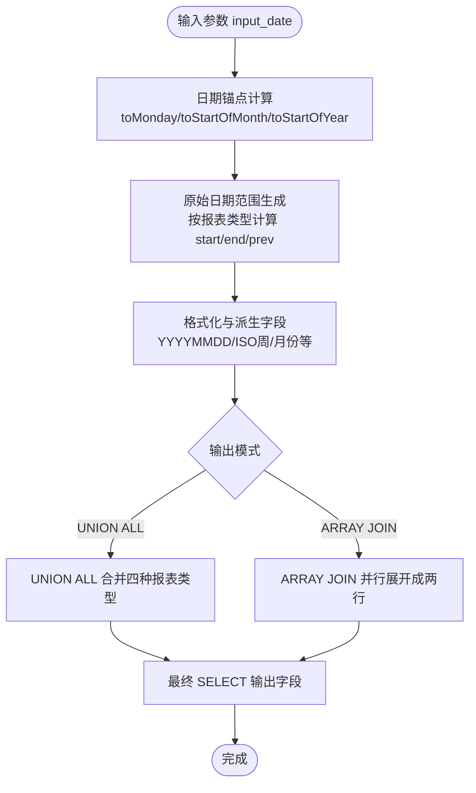
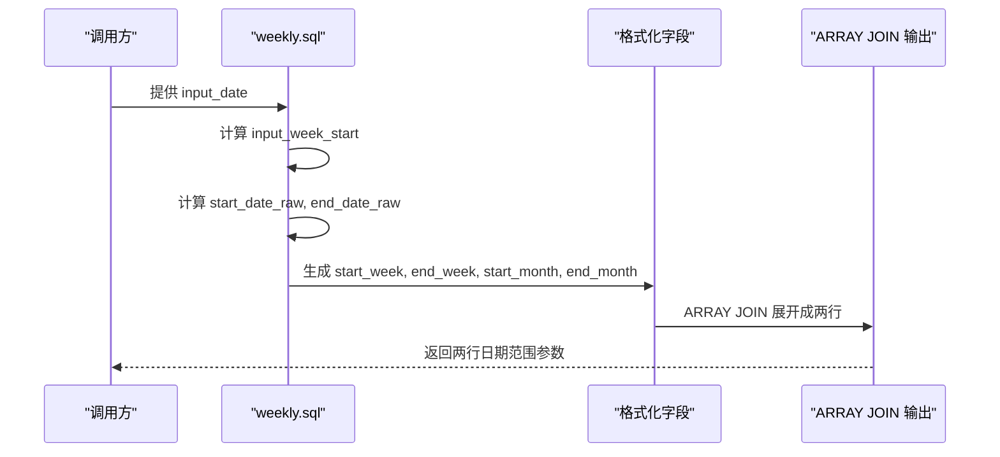
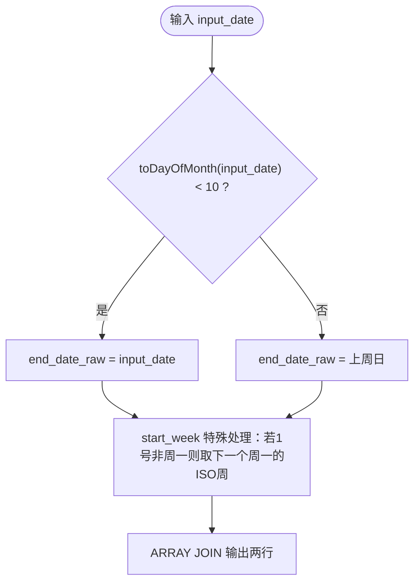
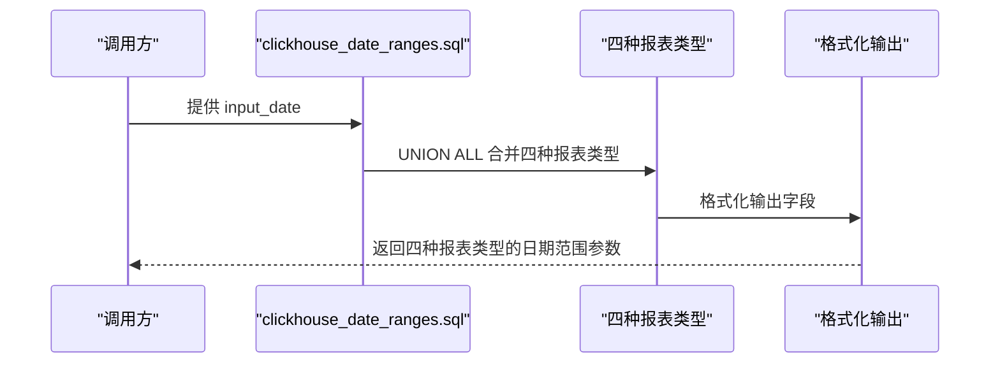
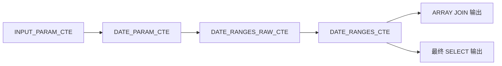

# 日期范围生成与处理

<cite>
**本文档引用的文件**
- [monthly_cumulative_weekly.sql](file://Quickbi_sql/周大福/周大福_日期范围生成_ARRAY JOIN_Clickhou/monthly_cumulative_weekly.sql)
- [monthly.sql](file://Quickbi_sql/周大福/周大福_日期范围生成_ARRAY JOIN_Clickhou/monthly.sql)
- [weekly.sql](file://Quickbi_sql/周大福/周大福_日期范围生成_ARRAY JOIN_Clickhou/weekly.sql)
- [yearly_cumulative_monthly.sql](file://Quickbi_sql/周大福/周大福_日期范围生成_ARRAY JOIN_Clickhou/yearly_cumulative_monthly.sql)
- [monthly_cumulative_weekly_wiki.md](file://Quickbi_sql/周大福/周大福_日期范围生成_ARRAY JOIN_Clickhou/wiki/monthly_cumulative_weekly_wiki.md)
- [clickhouse_date_ranges.sql](file://Quickbi_sql/周大福/周大福_日期范围生成_demo/clickhouse_date_ranges.sql)
- [clickhouse_date_ranges_wiki.md](file://Quickbi_sql/周大福/周大福_日期范围生成_demo/clickhouse_date_ranges_wiki.md)
- [SQL_优化方案.md](file://Quickbi_sql/MAP/我的门店/SQL_优化方案.md)
</cite>

## 目录
1. [简介](#简介)
2. [项目结构](#项目结构)
3. [核心组件](#核心组件)
4. [架构总览](#架构总览)
5. [详细组件分析](#详细组件分析)
6. [依赖关系分析](#依赖关系分析)
7. [性能考虑](#性能考虑)
8. [故障排查指南](#故障排查指南)
9. [结论](#结论)
10. [附录](#附录)

## 简介
本技术文档围绕ClickHouse中的日期范围生成与处理展开，系统性阐述以下主题：
- 日期计算函数的使用与组合策略
- 日期范围生成的SQL实现模式
- UNION ALL与ARRAY JOIN两种处理路径的差异与适用场景
- 月度、周度、年度累计报表的优化策略与最佳实践
- 实际业务场景中的应用案例与性能优化方法

文档基于仓库中提供的四个ClickHouse脚本与配套Wiki，结合通用ClickHouse函数与性能优化原则，帮助开发者在复杂报表体系中高效、稳定地生成日期维度参数，并支撑后续聚合与累计计算。

## 项目结构
仓库中与日期范围生成直接相关的文件主要集中在“周大福”目录下的两个子模块：
- “周大福_日期范围生成_ARRAY JOIN_Clickhou”：采用ARRAY JOIN的列转行方案，输出两行数据，便于下游按“开始/结束”维度展开
- “周大福_日期范围生成_demo”：采用UNION ALL的多报表类型合并方案，一次性输出四种报表类型的日期范围

图表来源
- [monthly_cumulative_weekly.sql:1-159](file://Quickbi_sql/周大福/周大福_日期范围生成_ARRAY JOIN_Clickhou/monthly_cumulative_weekly.sql#L1-L159)
- [monthly.sql:1-109](file://Quickbi_sql/周大福/周大福_日期范围生成_ARRAY JOIN_Clickhou/monthly.sql#L1-L109)
- [weekly.sql:1-117](file://Quickbi_sql/周大福/周大福_日期范围生成_ARRAY JOIN_Clickhou/weekly.sql#L1-L117)
- [yearly_cumulative_monthly.sql:1-109](file://Quickbi_sql/周大福/周大福_日期范围生成_ARRAY JOIN_Clickhou/yearly_cumulative_monthly.sql#L1-L109)
- [monthly_cumulative_weekly_wiki.md:1-595](file://Quickbi_sql/周大福/周大福_日期范围生成_ARRAY JOIN_Clickhou/wiki/monthly_cumulative_weekly_wiki.md#L1-L595)
- [clickhouse_date_ranges.sql:1-214](file://Quickbi_sql/周大福/周大福_日期范围生成_demo/clickhouse_date_ranges.sql#L1-L214)
- [clickhouse_date_ranges_wiki.md:1-282](file://Quickbi_sql/周大福/周大福_日期范围生成_demo/clickhouse_date_ranges_wiki.md#L1-L282)

章节来源
- [monthly_cumulative_weekly.sql:1-159](file://Quickbi_sql/周大福/周大福_日期范围生成_ARRAY JOIN_Clickhou/monthly_cumulative_weekly.sql#L1-L159)
- [monthly.sql:1-109](file://Quickbi_sql/周大福/周大福_日期范围生成_ARRAY JOIN_Clickhou/monthly.sql#L1-L109)
- [weekly.sql:1-117](file://Quickbi_sql/周大福/周大福_日期范围生成_ARRAY JOIN_Clickhou/weekly.sql#L1-L117)
- [yearly_cumulative_monthly.sql:1-109](file://Quickbi_sql/周大福/周大福_日期范围生成_ARRAY JOIN_Clickhou/yearly_cumulative_monthly.sql#L1-L109)
- [monthly_cumulative_weekly_wiki.md:1-595](file://Quickbi_sql/周大福/周大福_日期范围生成_ARRAY JOIN_Clickhou/wiki/monthly_cumulative_weekly_wiki.md#L1-L595)
- [clickhouse_date_ranges.sql:1-214](file://Quickbi_sql/周大福/周大福_日期范围生成_demo/clickhouse_date_ranges.sql#L1-L214)
- [clickhouse_date_ranges_wiki.md:1-282](file://Quickbi_sql/周大福/周大福_日期范围生成_demo/clickhouse_date_ranges_wiki.md#L1-L282)

## 核心组件
本节聚焦四个核心SQL脚本的功能职责与实现要点，涵盖输入参数、日期锚点、原始日期范围、格式化字段以及最终输出形态。

- weekly.sql：生成上周日期范围及去年同期周范围，输出两行（开始/结束）
- monthly.sql：生成上月日期范围及去年同期月范围，输出两行（开始/结束）
- monthly_cumulative_weekly.sql：生成“本月1日到上周日”的累计周范围及去年同期累计周范围，输出两行（开始/结束）
- yearly_cumulative_monthly.sql：生成“本年1月1日到上月最后一天”的累计月范围及去年同期累计月范围，输出两行（开始/结束）

章节来源
- [weekly.sql:1-117](file://Quickbi_sql/周大福/周大福_日期范围生成_ARRAY JOIN_Clickhou/weekly.sql#L1-L117)
- [monthly.sql:1-109](file://Quickbi_sql/周大福/周大福_日期范围生成_ARRAY JOIN_Clickhou/monthly.sql#L1-L109)
- [monthly_cumulative_weekly.sql:1-159](file://Quickbi_sql/周大福/周大福_日期范围生成_ARRAY JOIN_Clickhou/monthly_cumulative_weekly.sql#L1-L159)
- [yearly_cumulative_monthly.sql:1-109](file://Quickbi_sql/周大福/周大福_日期范围生成_ARRAY JOIN_Clickhou/yearly_cumulative_monthly.sql#L1-L109)

## 架构总览
两种实现路径的核心差异在于“多报表类型合并”的方式：
- UNION ALL路径：在一个CTE中通过UNION ALL合并四种报表类型的日期范围，适合一次性获取多种报表参数
- ARRAY JOIN路径：在CTE中生成多组“开始/结束”字段对，通过ARRAY JOIN并行展开为两行，适合下游按“开始/结束”维度进行列转行处理

图表来源
- [clickhouse_date_ranges.sql:49-139](file://Quickbi_sql/周大福/周大福_日期范围生成_demo/clickhouse_date_ranges.sql#L49-L139)
- [monthly_cumulative_weekly.sql:108-159](file://Quickbi_sql/周大福/周大福_日期范围生成_ARRAY JOIN_Clickhou/monthly_cumulative_weekly.sql#L108-L159)

章节来源
- [clickhouse_date_ranges.sql:1-214](file://Quickbi_sql/周大福/周大福_日期范围生成_demo/clickhouse_date_ranges.sql#L1-L214)
- [monthly_cumulative_weekly.sql:1-159](file://Quickbi_sql/周大福/周大福_日期范围生成_ARRAY JOIN_Clickhou/monthly_cumulative_weekly.sql#L1-L159)

## 详细组件分析

### weekly.sql 组件分析
- 输入参数：支持固定日期或today()，便于测试与生产切换
- 日期锚点：基于toMonday(input_date)确定本周一，进而推导上周一与上周日
- 原始日期范围：本期为“上周一~上周日”，上期为“上上周一~上上周日”
- ISO周与月份字段：使用toISOWeek与toMonth生成“YYYY-WW”和“YYYY-MM”格式
- 输出形态：通过ARRAY JOIN将“start_date/end_date”、“start_week/end_week”等字段对并行展开为两行

图表来源
- [weekly.sql:1-117](file://Quickbi_sql/周大福/周大福_日期范围生成_ARRAY JOIN_Clickhou/weekly.sql#L1-L117)

章节来源
- [weekly.sql:1-117](file://Quickbi_sql/周大福/周大福_日期范围生成_ARRAY JOIN_Clickhou/weekly.sql#L1-L117)

### monthly.sql 组件分析
- 输入参数：支持固定日期或today()
- 日期锚点：基于toStartOfMonth与toMonday计算本月与本周锚点
- 原始日期范围：本期为“上月第一天~上月最后一天”，上期为“上上月第一天~上上月最后一天”
- 重要修复：使用INTERVAL 1 DAY替代裸整数减法，避免UNION ALL中类型混合导致的日期计算异常
- 输出形态：通过ARRAY JOIN将“start_date/end_date”等字段对并行展开为两行

章节来源
- [monthly.sql:1-109](file://Quickbi_sql/周大福/周大福_日期范围生成_ARRAY JOIN_Clickhou/monthly.sql#L1-L109)

### monthly_cumulative_weekly.sql 组件分析
- 输入参数：支持固定日期或today()
- 业务规则：10号分界逻辑
  - 若input_date的“当月第几天”小于10，结束日期取input_date当天
  - 否则结束日期取“上周日”
- ISO周字段的特殊处理：当月1号非周一，start_week取“1号后第一个周一”的ISO周
- 输出形态：通过ARRAY JOIN将“start_date/end_date”、“start_week/end_week”、“start_month/end_month”等字段对并行展开为两行

图表来源
- [monthly_cumulative_weekly_wiki.md:72-105](file://Quickbi_sql/周大福/周大福_日期范围生成_ARRAY JOIN_Clickhou/wiki/monthly_cumulative_weekly_wiki.md#L72-L105)

章节来源
- [monthly_cumulative_weekly.sql:1-159](file://Quickbi_sql/周大福/周大福_日期范围生成_ARRAY JOIN_Clickhou/monthly_cumulative_weekly.sql#L1-L159)
- [monthly_cumulative_weekly_wiki.md:1-595](file://Quickbi_sql/周大福/周大福_日期范围生成_ARRAY JOIN_Clickhou/wiki/monthly_cumulative_weekly_wiki.md#L1-L595)

### yearly_cumulative_monthly.sql 组件分析
- 输入参数：支持固定日期或today()
- 原始日期范围：本期为“本年1月1日~上月最后一天”，上期为“去年1月1日~去年同期上月最后一天”
- 重要修复：年累计月报的上期结束日期使用addYears而非addMonths，确保同比口径正确
- 输出形态：通过ARRAY JOIN将“start_date/end_date”等字段对并行展开为两行

章节来源
- [yearly_cumulative_monthly.sql:1-109](file://Quickbi_sql/周大福/周大福_日期范围生成_ARRAY JOIN_Clickhou/yearly_cumulative_monthly.sql#L1-L109)

### UNION ALL 路径（clickhouse_date_ranges.sql）
- 输入参数：支持固定日期或today()
- 多报表类型合并：通过UNION ALL一次性输出四种报表类型的日期范围
- 重要修复：
  - 使用INTERVAL 1 DAY替代裸整数减法，解决UNION ALL中类型混合导致的日期计算异常
  - 年累计月报上期结束日期修正为addYears，确保同比口径正确
- 输出字段：包含本期/上期的日期范围、ISO周、月份等维度字段

图表来源
- [clickhouse_date_ranges.sql:65-139](file://Quickbi_sql/周大福/周大福_日期范围生成_demo/clickhouse_date_ranges.sql#L65-L139)

章节来源
- [clickhouse_date_ranges.sql:1-214](file://Quickbi_sql/周大福/周大福_日期范围生成_demo/clickhouse_date_ranges.sql#L1-L214)
- [clickhouse_date_ranges_wiki.md:1-282](file://Quickbi_sql/周大福/周大福_日期范围生成_demo/clickhouse_date_ranges_wiki.md#L1-L282)

## 依赖关系分析
- 函数依赖：四个脚本均依赖toMonday、toStartOfMonth、toStartOfYear、toISOWeek、toMonth、formatDateTime、concat、leftPad、if、addDays、subtractDays、subtractYears、addMonths、addYears等ClickHouse函数
- 数据流依赖：INPUT_PARAM_CTE → DATE_PARAM_CTE → DATE_RANGES_RAW_CTE → DATE_RANGES_CTE → 最终输出
- 输出形态依赖：ARRAY JOIN路径输出两行；UNION ALL路径输出四种报表类型

图表来源
- [monthly_cumulative_weekly.sql:2-108](file://Quickbi_sql/周大福/周大福_日期范围生成_ARRAY JOIN_Clickhou/monthly_cumulative_weekly.sql#L2-L108)
- [monthly.sql:3-75](file://Quickbi_sql/周大福/周大福_日期范围生成_ARRAY JOIN_Clickhou/monthly.sql#L3-L75)
- [weekly.sql:3-83](file://Quickbi_sql/周大福/周大福_日期范围生成_ARRAY JOIN_Clickhou/weekly.sql#L3-L83)
- [yearly_cumulative_monthly.sql:3-75](file://Quickbi_sql/周大福/周大福_日期范围生成_ARRAY JOIN_Clickhou/yearly_cumulative_monthly.sql#L3-L75)

章节来源
- [monthly_cumulative_weekly.sql:1-159](file://Quickbi_sql/周大福/周大福_日期范围生成_ARRAY JOIN_Clickhou/monthly_cumulative_weekly.sql#L1-L159)
- [monthly.sql:1-109](file://Quickbi_sql/周大福/周大福_日期范围生成_ARRAY JOIN_Clickhou/monthly.sql#L1-L109)
- [weekly.sql:1-117](file://Quickbi_sql/周大福/周大福_日期范围生成_ARRAY JOIN_Clickhou/weekly.sql#L1-L117)
- [yearly_cumulative_monthly.sql:1-109](file://Quickbi_sql/周大福/周大福_日期范围生成_ARRAY JOIN_Clickhou/yearly_cumulative_monthly.sql#L1-L109)

## 性能考虑
- ClickHouse日期类型陷阱与修复
  - 问题：在UNION ALL中，不同分支的日期类型混合（如Date与Date32）可能导致裸整数减法“- 1”不生效
  - 解决：统一使用INTERVAL 1 DAY等显式语法，确保类型安全
  - 影响范围：涉及“月初日期减一天取上月末”的场景（第3、4种报表的end_date_raw与prev_end_date_raw）
- ARRAY JOIN与UNION ALL的选择
  - ARRAY JOIN：适合下游需要按“开始/结束”维度进行列转行的场景，输出固定两行，便于后续维度展开
  - UNION ALL：适合一次性获取多种报表类型的日期范围，减少多次查询成本
- 通用性能优化建议（来自“我的门店”SQL优化方案）
  - 索引优化：为高频筛选字段建立复合索引，避免类型转换导致索引失效
  - 子查询优化：将MAX(dt)等子查询物化，避免重复扫描
  - LIKE优化：避免前导通配符，必要时使用IN或全文检索扩展
  - CTE物化：对多次使用的CTE进行物化，减少重复计算
  - JOIN策略：优先使用LEFT JOIN，避免不必要的FULL JOIN

章节来源
- [clickhouse_date_ranges_wiki.md:204-241](file://Quickbi_sql/周大福/周大福_日期范围生成_demo/clickhouse_date_ranges_wiki.md#L204-L241)
- [SQL_优化方案.md:20-114](file://Quickbi_sql/MAP/我的门店/SQL_优化方案.md#L20-L114)
- [SQL_优化方案.md:135-175](file://Quickbi_sql/MAP/我的门店/SQL_优化方案.md#L135-L175)
- [SQL_优化方案.md:231-254](file://Quickbi_sql/MAP/我的门店/SQL_优化方案.md#L231-L254)

## 故障排查指南
- 日期范围异常（UNION ALL）
  - 症状：使用“input_month_start - 1”等裸整数减法时，输出日期与原日期相同
  - 根因：UNION ALL中不同分支的日期类型混合导致类型提升异常
  - 解决：统一使用INTERVAL 1 DAY等显式语法
- 年累计月报上期结束日期错误
  - 症状：prev_end_date_raw使用addMonths仅往前推一个月，导致同比口径错误
  - 解决：修正为addYears，确保“去年同期上月末”的正确计算
- ISO周字段边界处理
  - 症状：当月1号非周一时，start_week取值不符合业务期望
  - 解决：采用“若1号非周一，取下一个周一”的策略，保证业务一致性

章节来源
- [clickhouse_date_ranges_wiki.md:233-239](file://Quickbi_sql/周大福/周大福_日期范围生成_demo/clickhouse_date_ranges_wiki.md#L233-L239)
- [monthly_cumulative_weekly_wiki.md:143-153](file://Quickbi_sql/周大福/周大福_日期范围生成_ARRAY JOIN_Clickhou/wiki/monthly_cumulative_weekly_wiki.md#L143-L153)

## 结论
本技术文档系统梳理了ClickHouse中日期范围生成的两种实现路径及其优化策略。通过合理运用日期计算函数、ARRAY JOIN与UNION ALL，可以在保证业务口径正确的前提下，高效生成多类报表所需的日期维度参数。结合仓库中的修复经验与通用性能优化建议，开发者能够在复杂报表体系中实现稳定、可维护且高性能的日期维度处理。

## 附录
- 实际业务场景应用案例
  - 销售数据分析：按周/月/年累计口径生成日期范围，支撑销售趋势与同比分析
  - 库存跟踪：按月累计口径生成日期范围，结合库存维度进行累计统计与预警
  - 运营周报：按周维度生成日期范围，支撑周度KPI与对比分析
- SQL代码示例路径（请参考以下文件）
  - [weekly.sql:1-117](file://Quickbi_sql/周大福/周大福_日期范围生成_ARRAY JOIN_Clickhou/weekly.sql#L1-L117)
  - [monthly.sql:1-109](file://Quickbi_sql/周大福/周大福_日期范围生成_ARRAY JOIN_Clickhou/monthly.sql#L1-L109)
  - [monthly_cumulative_weekly.sql:1-159](file://Quickbi_sql/周大福/周大福_日期范围生成_ARRAY JOIN_Clickhou/monthly_cumulative_weekly.sql#L1-L159)
  - [yearly_cumulative_monthly.sql:1-109](file://Quickbi_sql/周大福/周大福_日期范围生成_ARRAY JOIN_Clickhou/yearly_cumulative_monthly.sql#L1-L109)
  - [clickhouse_date_ranges.sql:1-214](file://Quickbi_sql/周大福/周大福_日期范围生成_demo/clickhouse_date_ranges.sql#L1-L214)