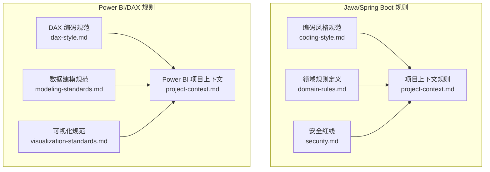
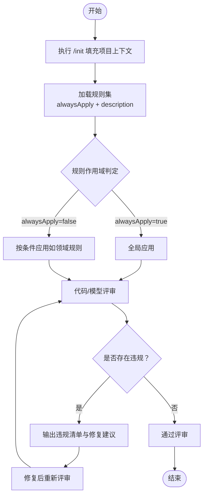
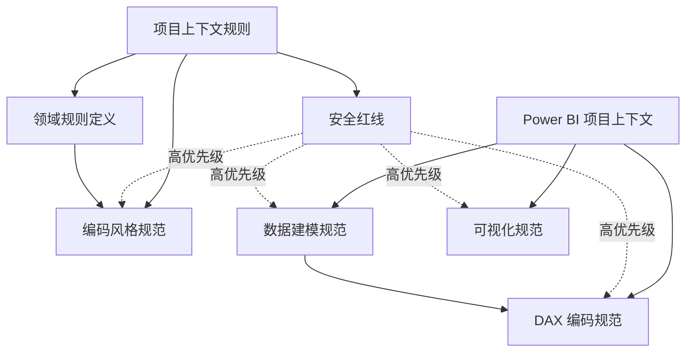

# 代码规范和规则定义

<cite>
**本文档引用的文件**
- [code_copilot/rules/coding-style.md](file://code_copilot/rules/coding-style.md)
- [code_copilot/rules/domain-rules.md](file://code_copilot/rules/domain-rules.md)
- [code_copilot/rules/project-context.md](file://code_copilot/rules/project-context.md)
- [code_copilot/rules/security.md](file://code_copilot/rules/security.md)
- [powerbi_code_copilot/rules/dax-style.md](file://powerbi_code_copilot/rules/dax-style.md)
- [powerbi_code_copilot/rules/modeling-standards.md](file://powerbi_code_copilot/rules/modeling-standards.md)
- [powerbi_code_copilot/rules/project-context.md](file://powerbi_code_copilot/rules/project-context.md)
- [powerbi_code_copilot/rules/visualization-standards.md](file://powerbi_code_copilot/rules/visualization-standards.md)
</cite>

## 目录
1. [引言](#引言)
2. [项目结构](#项目结构)
3. [核心组件](#核心组件)
4. [架构总览](#架构总览)
5. [详细组件分析](#详细组件分析)
6. [依赖分析](#依赖分析)
7. [性能考量](#性能考量)
8. [故障排查指南](#故障排查指南)
9. [结论](#结论)
10. [附录](#附录)

## 引言
本文件系统化梳理并阐释代码质量控制中的规则体系，覆盖编码风格规范、领域规则定义、项目上下文规则与安全性规则。针对不同技术栈（Java/Spring Boot 与 Power BI/DAX），分别给出适用场景、检查标准、违规后果以及规则间的优先级与组合使用方式，帮助团队建立统一、可落地的开发标准。

## 项目结构
规则定义分布在两个子项目中：
- Java/Spring Boot 规则：位于 code_copilot/rules 下，包含编码风格、领域规则、项目上下文、安全红线四类。
- Power BI/DAX 规则：位于 powerbi_code_copilot/rules 下，包含 DAX 编码规范、数据建模规范、项目上下文、可视化规范四类。

**图表来源**
- [code_copilot/rules/coding-style.md:1-34](file://code_copilot/rules/coding-style.md#L1-L34)
- [code_copilot/rules/domain-rules.md:1-18](file://code_copilot/rules/domain-rules.md#L1-L18)
- [code_copilot/rules/project-context.md:1-35](file://code_copilot/rules/project-context.md#L1-L35)
- [code_copilot/rules/security.md:1-18](file://code_copilot/rules/security.md#L1-L18)
- [powerbi_code_copilot/rules/dax-style.md:1-218](file://powerbi_code_copilot/rules/dax-style.md#L1-L218)
- [powerbi_code_copilot/rules/modeling-standards.md:1-88](file://powerbi_code_copilot/rules/modeling-standards.md#L1-L88)
- [powerbi_code_copilot/rules/project-context.md:1-69](file://powerbi_code_copilot/rules/project-context.md#L1-L69)
- [powerbi_code_copilot/rules/visualization-standards.md:1-81](file://powerbi_code_copilot/rules/visualization-standards.md#L1-L81)

**章节来源**
- [code_copilot/rules/coding-style.md:1-34](file://code_copilot/rules/coding-style.md#L1-L34)
- [code_copilot/rules/domain-rules.md:1-18](file://code_copilot/rules/domain-rules.md#L1-L18)
- [code_copilot/rules/project-context.md:1-35](file://code_copilot/rules/project-context.md#L1-L35)
- [code_copilot/rules/security.md:1-18](file://code_copilot/rules/security.md#L1-L18)
- [powerbi_code_copilot/rules/dax-style.md:1-218](file://powerbi_code_copilot/rules/dax-style.md#L1-L218)
- [powerbi_code_copilot/rules/modeling-standards.md:1-88](file://powerbi_code_copilot/rules/modeling-standards.md#L1-L88)
- [powerbi_code_copilot/rules/project-context.md:1-69](file://powerbi_code_copilot/rules/project-context.md#L1-L69)
- [powerbi_code_copilot/rules/visualization-standards.md:1-81](file://powerbi_code_copilot/rules/visualization-standards.md#L1-L81)

## 核心组件
- 编码风格规范（Java/Spring Boot）
  - 命名：类名、方法名、常量、抽象类、测试类的命名约定；禁止拼音与中英混拼。
  - 异常处理：业务异常自定义、系统异常统一兜底、禁止吞异常、catch 必须记录日志。
  - 日志：入口打 INFO、异常打 ERROR、禁止打印敏感信息。
  - 其他：接口幂等、并发同步策略、魔法值常量化。
- 领域规则定义（Java/Spring Boot）
  - 金额统一 long（分）、时间字段统一 Date、外部接口超时与降级、状态变更通过状态机。
- 项目上下文规则（Java/Spring Boot）
  - 应用概况、目录结构与模块职责、分层架构（Controller → Service → Manager → DAO）、关键依赖。
- 安全红线（Java/Spring Boot）
  - 禁止硬编码密钥/密码、禁止提交含个人信息的测试数据、禁止日志泄露敏感信息；资金/状态/权限变更需人工审查与校验。
- DAX 编码规范（Power BI）
  - 命名：度量值、计算列、表命名前缀与规则；避免与列名冲突、禁止拼音与中英混拼。
  - 格式：缩进与换行、注释规范（复杂度量值头部注释）。
  - 原则：性能优先、上下文清晰、可维护性（单一职责、显示文件夹组织）。
  - 禁止事项：隐式度量值、硬编码日期/参数、EARLIER、未经验证的 CALCULATE 嵌套、计算列引用度量值。
- 数据建模规范（Power BI）
  - 架构：星型模型优先、雪花型需说明原因；表类型标识（Fact_/Dim_/Bridge_/CT_/隐藏表）。
  - 关系：1:N、筛选方向默认单向、双向筛选需明确理由、禁止循环依赖、每事实表关联日期维度。
  - 表设计：事实表只保留外键与度量值、维度表含代理键与业务键、移除未使用列、列优化。
  - 度量值组织：Display Folder 分组、度量值表集中管理。
  - 禁止事项：自动日期/时间表、事实表之间直接关系、多对多不通过桥接表、保留未使用表/列、使用自动生成的隐藏日期层级。
- Power BI 项目上下文（Power BI）
  - 项目概况（版本、许可证、刷新方式）、数据源清单、模型结构（事实/维度表）、关系图、度量值分组、报表页面清单、安全配置（RLS、角色、网关）、关键依赖。
- 可视化规范（Power BI）
  - 布局与设计：页面布局数量限制、阅读模式、KPI 卡片位置、筛选器区域；色彩方案（企业配色、色盲友好、对比度）；字体规范。
  - 图表选型：按分析目的推荐与避免的图表类型；图表禁忌（3D、饼图过多、双 Y 轴、截断轴）。
  - 交互设计：切片器位置与数量、钻取路径、交叉筛选策略。
  - 移动端适配：关键页面移动布局、触摸友好、避免宽矩阵/表格。
  - 可访问性：Alt Text、Tab 导航、WCAG 对比度、避免仅依赖颜色传达信息。

**章节来源**
- [code_copilot/rules/coding-style.md:7-34](file://code_copilot/rules/coding-style.md#L7-L34)
- [code_copilot/rules/domain-rules.md:8-17](file://code_copilot/rules/domain-rules.md#L8-L17)
- [code_copilot/rules/project-context.md:9-35](file://code_copilot/rules/project-context.md#L9-L35)
- [code_copilot/rules/security.md:7-17](file://code_copilot/rules/security.md#L7-L17)
- [powerbi_code_copilot/rules/dax-style.md:7-217](file://powerbi_code_copilot/rules/dax-style.md#L7-L217)
- [powerbi_code_copilot/rules/modeling-standards.md:7-87](file://powerbi_code_copilot/rules/modeling-standards.md#L7-L87)
- [powerbi_code_copilot/rules/project-context.md:9-69](file://powerbi_code_copilot/rules/project-context.md#L9-L69)
- [powerbi_code_copilot/rules/visualization-standards.md:7-81](file://powerbi_code_copilot/rules/visualization-standards.md#L7-L81)

## 架构总览
规则体系的实施流程如下：
- 项目初始化：通过 /init 填充项目上下文，确保规则具备执行所需的背景信息。
- 规则加载：根据 alwaysApply 标记决定是否全局应用；description 字段用于条件触发（如领域规则）。
- 规则执行：在代码生成/评审阶段，按规则类别进行静态检查与建议输出。
- 违规处理：记录违规项、给出修复建议、必要时阻断合并或发布。

[此图为概念性流程图，无需图表来源]

## 详细组件分析

### 编码风格规范（Java/Spring Boot）
- 适用场景
  - 所有 Java/Spring Boot 后端代码编写与评审。
- 检查标准
  - 命名：类名/方法名/常量/抽象类/测试类符合约定；禁止拼音与中英混拼。
  - 异常：业务异常自定义并带错误码；系统异常统一由异常处理器兜底；禁止空 catch；catch 必须记录日志。
  - 日志：Controller 入口打 INFO（含关键参数）；异常打 ERROR（含完整堆栈）；禁止打印敏感信息。
  - 其他：对外接口考虑幂等；并发场景说明同步策略；魔法值定义为常量。
- 违规后果
  - 代码可读性与可维护性下降；异常处理不当导致问题定位困难；日志泄露敏感信息引发合规风险；接口非幂等造成业务影响。
- 规则优先级与组合
  - 安全红线优先于编码风格；异常与日志规范优先于命名风格；并发与幂等在高并发场景优先级更高。
- 示例与反例（说明性）
  - 反例：方法名使用拼音、异常块为空、日志中打印手机号、魔法值直接出现、接口未声明幂等。
  - 正例：类名使用大驼峰、方法名小驼峰动词开头、异常自定义并带错误码、INFO 入口日志、常量统一定义。

**章节来源**
- [code_copilot/rules/coding-style.md:7-34](file://code_copilot/rules/coding-style.md#L7-L34)

### 领域规则定义（Java/Spring Boot）
- 适用场景
  - 涉及业务领域特定逻辑的模块，如财务、订单、库存等。
- 检查标准
  - 金额统一 long（分）；时间字段统一 Date；外部接口调用设置超时（默认 3s）并做降级；状态变更通过状态机，禁止直接 set。
- 违规后果
  - 金额精度与一致性问题；时间解析偏差；外部依赖抖动影响稳定性；状态不一致导致业务异常。
- 规则优先级与组合
  - 金额与时间字段规范优先于命名风格；外部接口超时与降级优先于性能优化；状态机优先于直接赋值。
- 示例与反例（说明性）
  - 反例：金额使用 double、时间字段混用多种类型、外部接口未设置超时、直接修改状态字段。
  - 正例：long（分）存储金额、Date 统一时间字段、设置超时与降级、通过状态机变更状态。

**章节来源**
- [code_copilot/rules/domain-rules.md:8-17](file://code_copilot/rules/domain-rules.md#L8-L17)

### 项目上下文规则（Java/Spring Boot）
- 适用场景
  - 团队协作、代码评审、新成员入职、CI/CD 规则集成。
- 检查标准
  - 应用概况（名称、简介、技术栈、构建工具）；目录结构与模块职责；分层架构（Controller → Service → Manager → DAO）；关键依赖。
- 违规后果
  - 新成员难以理解项目结构；评审效率低；构建与部署不一致。
- 规则优先级与组合
  - 项目上下文为其他规则提供执行背景，应最先完善；分层架构与模块职责指导编码风格与领域规则的落地。
- 示例与反例（说明性）
  - 反例：未填写应用技术栈、目录职责不清、分层混乱。
  - 正例：明确技术栈与构建工具、清晰的模块职责、严格的分层架构。

**章节来源**
- [code_copilot/rules/project-context.md:9-35](file://code_copilot/rules/project-context.md#L9-L35)

### 安全红线（Java/Spring Boot）
- 适用场景
  - 所有代码与配置文件的提交与评审。
- 检查标准
  - 禁止硬编码密钥/AK/SK/数据库密码；禁止提交含个人信息的测试数据；禁止日志打印敏感信息；资金/状态/权限变更需人工审查与校验。
- 违规后果
  - 严重安全事件与合规风险；供应链攻击；审计与监管不通过。
- 规则优先级与组合
  - 安全红线最高优先级，贯穿所有规则；资金/状态/权限变更需额外人工审查。
- 示例与反例（说明性）
  - 反例：在代码中硬编码密钥、日志打印手机号、提交含身份证的测试数据。
  - 正例：密钥通过环境变量注入、日志脱敏、测试数据匿名化。

**章节来源**
- [code_copilot/rules/security.md:7-17](file://code_copilot/rules/security.md#L7-L17)

### DAX 编码规范（Power BI）
- 适用场景
  - Power BI 模型中的度量值、计算列、表命名与格式化。
- 检查标准
  - 命名：度量值前缀（KPI_/CAL_/RATIO_/YTD_/MTD_/PY_%/Rank/隐藏前缀）、表命名前缀（Dim_/Fact_/Bridge_/Param_/CT_/隐藏）、避免与列名冲突、禁止拼音与中英混拼。
  - 格式：缩进与换行、注释规范（复杂度量值头部注释）。
  - 原则：性能优先、上下文清晰、可维护性（单一职责、显示文件夹组织）。
  - 禁止事项：隐式度量值、硬编码日期/参数、EARLIER、未经验证的 CALCULATE 嵌套、计算列引用度量值。
- 违规后果
  - 报表性能劣化；上下文混乱导致结果错误；可维护性差导致迭代成本高。
- 规则优先级与组合
  - 性能优先与上下文清晰优先于命名风格；禁止事项优先于性能优化；命名一致性优先于格式细节。
- 示例与反例（说明性）
  - 反例：使用 DAX 保留字作为表名、模糊命名、嵌套 CALCULATE 超过 2 层、计算列引用度量值。
  - 正例：使用 Dim_/Fact_ 前缀、清晰的 KPI_ 前缀、VAR 避免重复计算、单一职责的度量值。

**章节来源**
- [powerbi_code_copilot/rules/dax-style.md:7-217](file://powerbi_code_copilot/rules/dax-style.md#L7-L217)

### 数据建模规范（Power BI）
- 适用场景
  - Power BI 数据建模阶段与模型维护。
- 检查标准
  - 架构：星型模型优先、雪花型需说明原因；表类型标识（Fact_/Dim_/Bridge_/CT_/隐藏）。
  - 关系：1:N、筛选方向默认单向、双向筛选需明确理由、禁止循环依赖、每事实表关联日期维度。
  - 表设计：事实表只保留外键与度量值、维度表含代理键与业务键、移除未使用列、列优化。
  - 度量值组织：Display Folder 分组、度量值表集中管理。
  - 禁止事项：自动日期/时间表、事实表之间直接关系、多对多不通过桥接表、保留未使用表/列、使用自动生成的隐藏日期层级。
- 违规后果
  - 模型性能与一致性问题；关系错乱导致计算错误；维护成本上升。
- 规则优先级与组合
  - 架构与关系设计优先于表列设计；禁止事项优先于性能优化；度量值组织优先于命名细节。
- 示例与反例（说明性）
  - 反例：使用自动日期表、事实表之间直接关系、多对多未通过桥接表、保留未使用列。
  - 正例：星型模型、Dim_/Fact_ 前缀、日期维度独立、Display Folder 分组。

**章节来源**
- [powerbi_code_copilot/rules/modeling-standards.md:7-87](file://powerbi_code_copilot/rules/modeling-standards.md#L7-L87)

### Power BI 项目上下文（Power BI）
- 适用场景
  - 团队协作、报表交付、安全与权限配置。
- 检查标准
  - 项目概况（版本、许可证、刷新方式）、数据源清单、模型结构（事实/维度表）、关系图、度量值分组、报表页面清单、安全配置（RLS、角色、网关）、关键依赖。
- 违规后果
  - 交付延迟、权限混乱、安全配置缺失。
- 规则优先级与组合
  - 项目概况与数据源清单优先于模型细节；安全配置优先于其他规范。
- 示例与反例（说明性）
  - 反例：未填写刷新方式、未配置 RLS、未列出工作区角色。
  - 正例：明确刷新方式与数据源类型、RLS 与角色配置齐全、关系图与度量值分组清晰。

**章节来源**
- [powerbi_code_copilot/rules/project-context.md:9-69](file://powerbi_code_copilot/rules/project-context.md#L9-L69)

### 可视化规范（Power BI）
- 适用场景
  - 报表设计与交付阶段。
- 检查标准
  - 布局与设计：页面布局数量限制、阅读模式、KPI 卡片位置、筛选器区域；色彩方案（企业配色、色盲友好、对比度）；字体规范。
  - 图表选型：按分析目的推荐与避免的图表类型；图表禁忌（3D、饼图过多、双 Y 轴、截断轴）。
  - 交互设计：切片器位置与数量、钻取路径、交叉筛选策略。
  - 移动端适配：关键页面移动布局、触摸友好、避免宽矩阵/表格。
  - 可访问性：Alt Text、Tab 导航、WCAG 对比度、避免仅依赖颜色传达信息。
- 违规后果
  - 用户体验差、信息传达失真、可访问性不足。
- 规则优先级与组合
  - 可访问性与图表选型优先于布局细节；移动端适配优先于非移动端优化。
- 示例与反例（说明性）
  - 反例：使用 3D 图表、饼图超过 5 个、双 Y 轴、截断 Y 轴起点。
  - 正例：折线图/面积图展示趋势、条形图/柱状图比较大小、色盲友好配色、WCAG 对比度达标。

**章节来源**
- [powerbi_code_copilot/rules/visualization-standards.md:7-81](file://powerbi_code_copilot/rules/visualization-standards.md#L7-L81)

## 依赖分析
规则之间的依赖与耦合关系如下：
- 项目上下文为其他规则提供执行背景，是前置条件。
- 安全红线具有最高优先级，贯穿所有规则。
- 领域规则与编码风格在 Java/Spring Boot 场景相互补充；DAX 规范与建模规范在 Power BI 场景相互补充。
- 可视化规范依赖于模型与度量值组织的规范。

**图表来源**
- [code_copilot/rules/project-context.md:9-35](file://code_copilot/rules/project-context.md#L9-L35)
- [code_copilot/rules/coding-style.md:7-34](file://code_copilot/rules/coding-style.md#L7-L34)
- [code_copilot/rules/domain-rules.md:8-17](file://code_copilot/rules/domain-rules.md#L8-L17)
- [code_copilot/rules/security.md:7-17](file://code_copilot/rules/security.md#L7-L17)
- [powerbi_code_copilot/rules/project-context.md:9-69](file://powerbi_code_copilot/rules/project-context.md#L9-L69)
- [powerbi_code_copilot/rules/dax-style.md:7-217](file://powerbi_code_copilot/rules/dax-style.md#L7-L217)
- [powerbi_code_copilot/rules/modeling-standards.md:7-87](file://powerbi_code_copilot/rules/modeling-standards.md#L7-L87)
- [powerbi_code_copilot/rules/visualization-standards.md:7-81](file://powerbi_code_copilot/rules/visualization-standards.md#L7-L81)

## 性能考量
- Java/Spring Boot
  - 幂等接口减少重复计算与资源消耗；异常统一处理降低异常传播开销；魔法值常量化避免重复解析。
- Power BI
  - DAX 性能优先原则：VAR 避免重复计算、减少 CALCULATE 嵌套层数、使用 REMOVEFILTERS 替代 FILTER(ALL(...))、迭代函数注意迭代表大小。
  - 数据建模性能：星型模型优先、移除未使用列、文本列尽量整数编码、日期列统一 Date 类型、数值列最小精度。

[本节为通用性能讨论，无需章节来源]

## 故障排查指南
- 常见违规类型与定位
  - Java/Spring Boot：拼音命名、空 catch、日志泄露敏感信息、直接状态赋值、硬编码密钥。
  - Power BI：使用 DAX 保留字、模糊命名、隐式度量值、自动日期表、3D 图表、截断 Y 轴。
- 修复建议
  - 命名规范化：统一命名风格，使用前缀标识类型；避免与列名冲突。
  - 异常与日志：自定义业务异常并带错误码；catch 必须记录日志；脱敏敏感信息。
  - 性能优化：减少 CALCULATE 嵌套、使用 VAR 缓存中间结果、避免不必要的上下文转换。
  - 安全加固：密钥通过环境变量注入、测试数据匿名化、RLS 与角色配置齐全。
- 审查流程
  - 初始化项目上下文；按 alwaysApply 与 description 触发规则；输出违规清单；修复后重新评审。

**章节来源**
- [code_copilot/rules/security.md:7-17](file://code_copilot/rules/security.md#L7-L17)
- [powerbi_code_copilot/rules/dax-style.md:143-170](file://powerbi_code_copilot/rules/dax-style.md#L143-L170)
- [powerbi_code_copilot/rules/modeling-standards.md:143-161](file://powerbi_code_copilot/rules/modeling-standards.md#L143-L161)
- [powerbi_code_copilot/rules/visualization-standards.md:44-49](file://powerbi_code_copilot/rules/visualization-standards.md#L44-L49)

## 结论
通过将编码风格、领域规则、项目上下文与安全红线有机组合，可形成覆盖全生命周期的质量控制体系。在 Power BI 场景下，DAX 编码规范、数据建模规范与可视化规范共同保障模型与报表的质量与一致性。建议团队在项目初期完善项目上下文，严格执行安全红线，结合领域规则与编码规范，持续优化性能与可维护性。

[本节为总结性内容，无需章节来源]

## 附录
- 规则优先级建议
  - 安全红线 > 项目上下文 > 领域规则 > 编码风格（Java/Spring Boot）；安全红线 > 项目上下文 > 数据建模规范 > DAX 编码规范 > 可视化规范（Power BI）。
- 组合使用方式
  - 在 CI/CD 中集成规则检查；在评审流程中强制执行；定期回顾与更新规则；通过模板与脚本自动化填充项目上下文。

[本节为通用建议，无需章节来源]