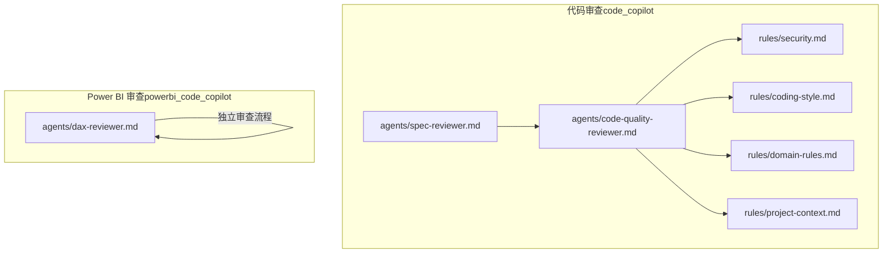
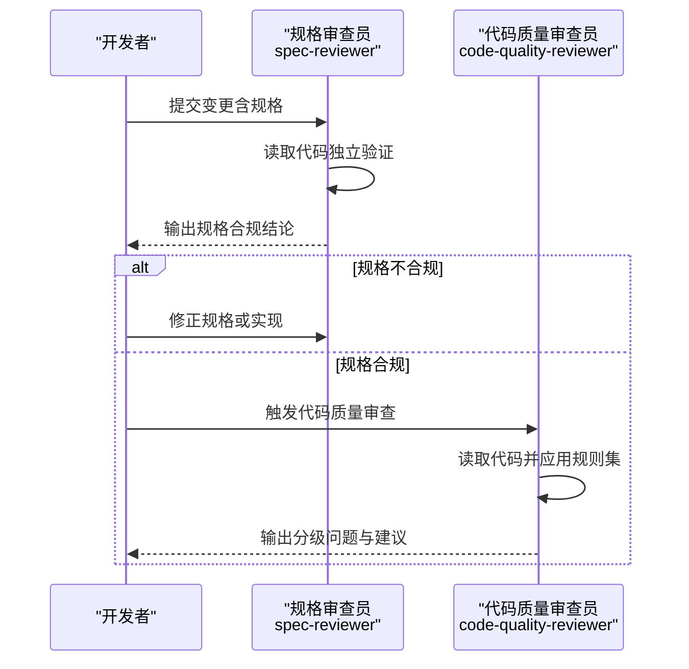
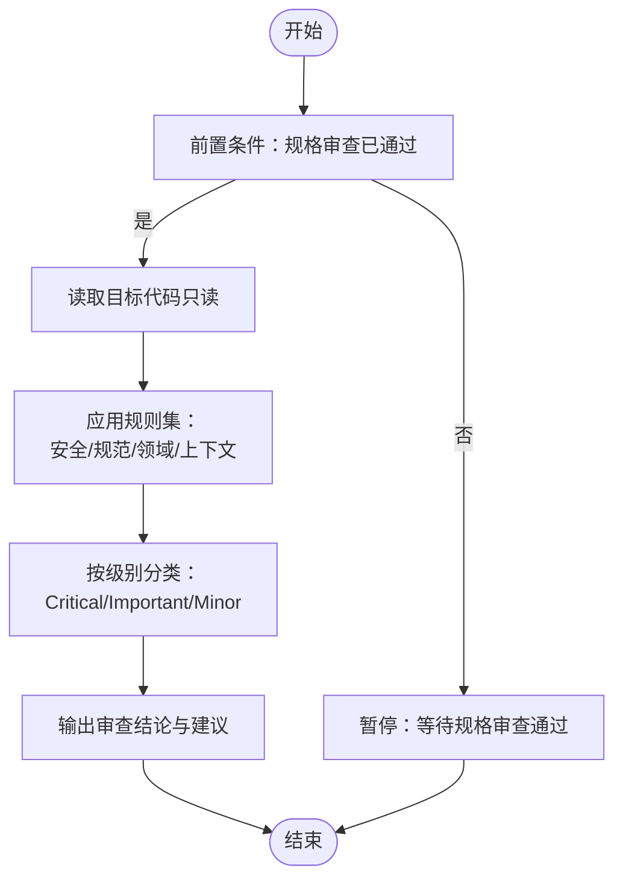
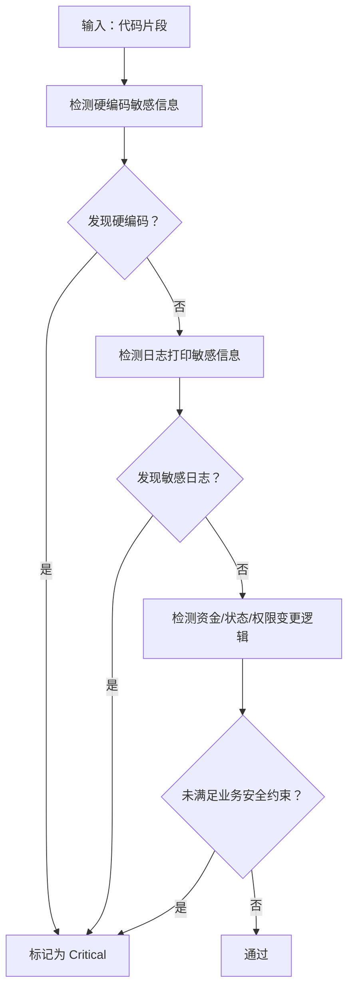
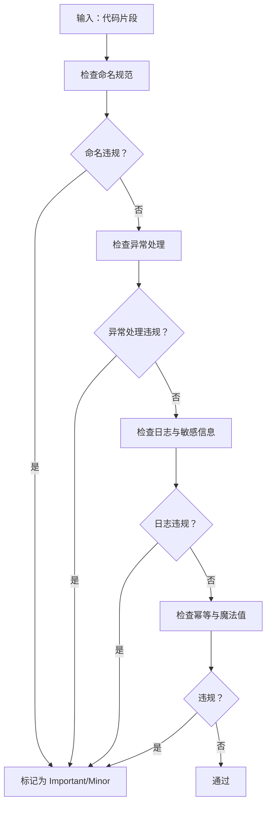
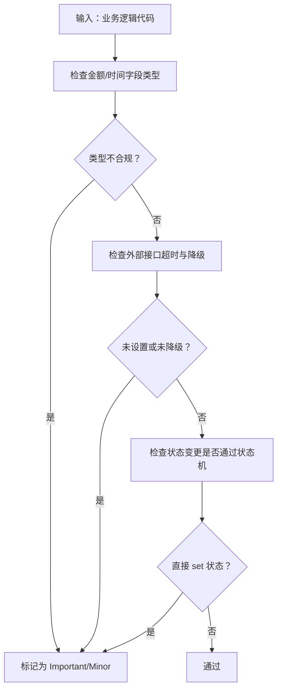
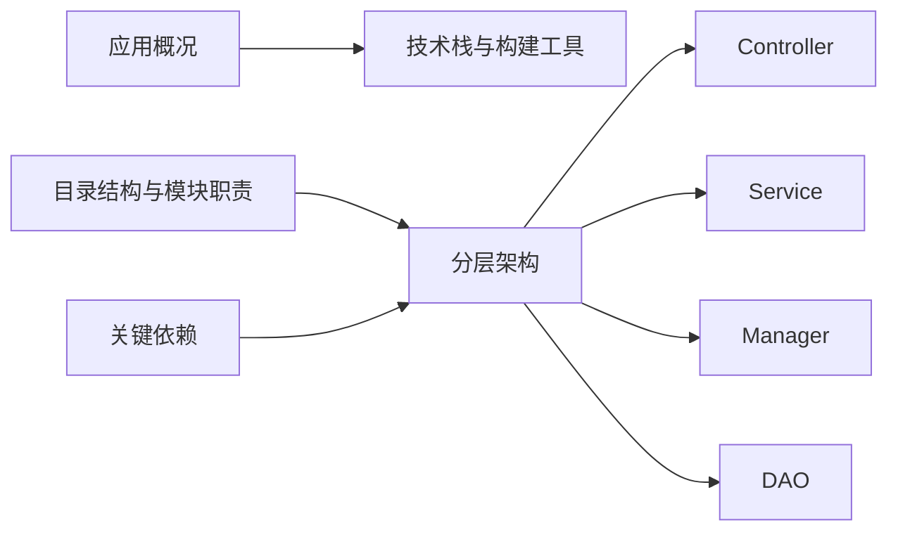
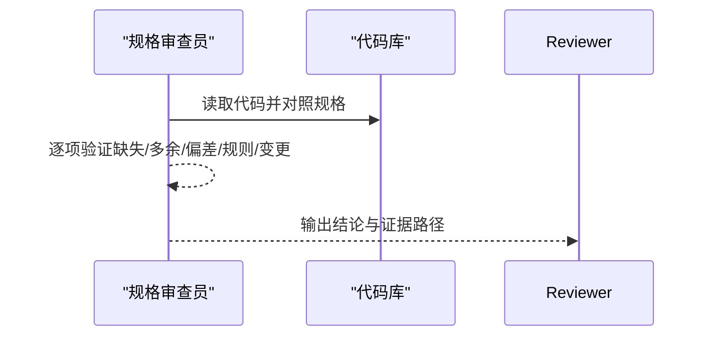
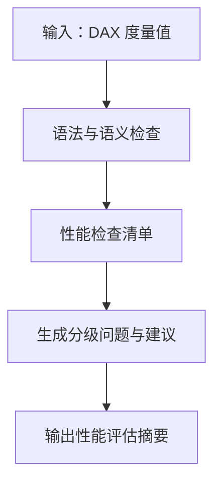
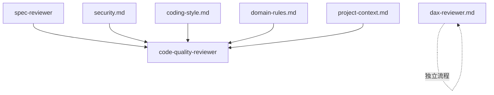

# 代码质量审查

<cite>
**本文引用的文件**
- [code-quality-reviewer.md](file://code_copilot/agents/code-quality-reviewer.md)
- [security.md](file://code_copilot/rules/security.md)
- [coding-style.md](file://code_copilot/rules/coding-style.md)
- [domain-rules.md](file://code_copilot/rules/domain-rules.md)
- [project-context.md](file://code_copilot/rules/project-context.md)
- [spec-reviewer.md](file://code_copilot/agents/spec-reviewer.md)
- [dax-reviewer.md](file://powerbi_code_copilot/agents/dax-reviewer.md)
</cite>

## 目录
1. [简介](#简介)
2. [项目结构](#项目结构)
3. [核心组件](#核心组件)
4. [架构总览](#架构总览)
5. [详细组件分析](#详细组件分析)
6. [依赖关系分析](#依赖关系分析)
7. [性能考量](#性能考量)
8. [故障排查指南](#故障排查指南)
9. [结论](#结论)
10. [附录](#附录)

## 简介
本文件面向“代码质量审查”能力，系统化阐述评估标准、自动化流程与执行机制。审查覆盖安全性、规范遵循与错误级别分类，并给出审查器工作原理、触发条件与执行顺序，帮助开发者通过标准化流程持续提升代码质量。

## 项目结构
该仓库围绕“代码审查”与“Power BI 审查”两条主线组织：
- code_copilot：面向通用代码质量与规范的审查规则与审查员说明
- powerbi_code_copilot：面向 DAX/建模/性能的审查规则与审查员说明

图示来源
- [code-quality-reviewer.md:1-13](file://code_copilot/agents/code-quality-reviewer.md#L1-L13)
- [security.md:1-18](file://code_copilot/rules/security.md#L1-L18)
- [coding-style.md:1-34](file://code_copilot/rules/coding-style.md#L1-L34)
- [domain-rules.md:1-18](file://code_copilot/rules/domain-rules.md#L1-L18)
- [project-context.md:1-35](file://code_copilot/rules/project-context.md#L1-L35)
- [spec-reviewer.md:1-25](file://code_copilot/agents/spec-reviewer.md#L1-L25)
- [dax-reviewer.md:1-56](file://powerbi_code_copilot/agents/dax-reviewer.md#L1-L56)

章节来源
- [code-quality-reviewer.md:1-13](file://code_copilot/agents/code-quality-reviewer.md#L1-L13)
- [spec-reviewer.md:1-25](file://code_copilot/agents/spec-reviewer.md#L1-L25)
- [security.md:1-18](file://code_copilot/rules/security.md#L1-L18)
- [coding-style.md:1-34](file://code_copilot/rules/coding-style.md#L1-L34)
- [domain-rules.md:1-18](file://code_copilot/rules/domain-rules.md#L1-L18)
- [project-context.md:1-35](file://code_copilot/rules/project-context.md#L1-L35)
- [dax-reviewer.md:1-56](file://powerbi_code_copilot/agents/dax-reviewer.md#L1-L56)

## 核心组件
- 审查员：代码质量审查员（code-quality-reviewer）
  - 职责：对代码质量、安全性与可维护性进行独立审查
  - 触发条件：必须在规格审查（spec-reviewer）通过之后启动
  - 权限：仅读（Read/Grep/Glob/Bash），不写入
  - 等级划分：Critical（阻塞）、Important（应修复）、Minor（建议）

- 规则集：
  - 安全红线（security）：禁止硬编码密钥、禁止泄露敏感信息、资金/状态/权限变更的强制约束
  - 编码规范（coding-style）：命名、异常处理、日志、幂等等
  - 业务领域约束（domain-rules）：金额单位、时间类型、外部接口超时与降级、状态机
  - 工程上下文（project-context）：应用概况、目录结构、分层架构、关键依赖

- 对比参考：DAX 审查员（dax-reviewer）用于 Power BI 场景，展示不同领域的审查分级与输出格式

章节来源
- [code-quality-reviewer.md:1-13](file://code_copilot/agents/code-quality-reviewer.md#L1-L13)
- [security.md:1-18](file://code_copilot/rules/security.md#L1-L18)
- [coding-style.md:1-34](file://code_copilot/rules/coding-style.md#L1-L34)
- [domain-rules.md:1-18](file://code_copilot/rules/domain-rules.md#L1-L18)
- [project-context.md:1-35](file://code_copilot/rules/project-context.md#L1-L35)
- [dax-reviewer.md:1-56](file://powerbi_code_copilot/agents/dax-reviewer.md#L1-L56)

## 架构总览
审查流程采用“先规格后实现”的顺序控制，确保实现与需求一致后再进行质量与安全审查。

图示来源
- [spec-reviewer.md:1-25](file://code_copilot/agents/spec-reviewer.md#L1-L25)
- [code-quality-reviewer.md:1-13](file://code_copilot/agents/code-quality-reviewer.md#L1-L13)

## 详细组件分析

### 代码质量审查员（code-quality-reviewer）
- 角色定位：独立于实现者上下文，基于规则集对代码进行质量与安全审查
- 触发条件：仅在规格审查通过后启动
- 权限模型：只读（Read/Grep/Glob/Bash），避免误改
- 错误级别与典型问题
  - Critical（阻塞）：安全漏洞、资金逻辑错误、并发安全、数据丢失风险
  - Important（应修复）：异常被吞、缺少参数校验、魔法值、方法过长、命名不清
  - Minor（建议）：Javadoc 缺失、注释过时、import 未清理

图示来源
- [code-quality-reviewer.md:1-13](file://code_copilot/agents/code-quality-reviewer.md#L1-L13)
- [security.md:1-18](file://code_copilot/rules/security.md#L1-L18)
- [coding-style.md:1-34](file://code_copilot/rules/coding-style.md#L1-L34)
- [domain-rules.md:1-18](file://code_copilot/rules/domain-rules.md#L1-L18)
- [project-context.md:1-35](file://code_copilot/rules/project-context.md#L1-L35)

章节来源
- [code-quality-reviewer.md:1-13](file://code_copilot/agents/code-quality-reviewer.md#L1-L13)

### 安全性规则（security）
- 代码安全：禁止硬编码密钥、AK/SK、数据库密码；禁止提交含个人敏感信息的测试数据；禁止在日志中打印手机号、身份证、银行卡等
- 业务安全：涉及资金变更的逻辑需在规格中标注并经人工审查；状态流转需检查状态机合法性；权限变更需显式校验操作人权限

图示来源
- [security.md:1-18](file://code_copilot/rules/security.md#L1-L18)

章节来源
- [security.md:1-18](file://code_copilot/rules/security.md#L1-L18)

### 编码规范（coding-style）
- 命名：类名、方法名、常量、抽象类、测试类的命名约定；禁止拼音、中英混拼
- 异常处理：业务异常自定义且带错误码；系统异常由统一处理器兜底；禁止吞异常；catch 必须记录日志
- 日志：Controller 入口打 INFO（含关键参数）；异常打 ERROR（含完整堆栈）；禁止打印敏感信息
- 其他：写接口需考虑幂等；并发场景需说明同步策略；魔法值必须定义为常量

图示来源
- [coding-style.md:1-34](file://code_copilot/rules/coding-style.md#L1-L34)

章节来源
- [coding-style.md:1-34](file://code_copilot/rules/coding-style.md#L1-L34)

### 业务领域约束（domain-rules）
- 通用领域：金额使用 long 类型（单位分）；时间字段统一使用 Date 类型；外部接口调用必须设置超时（默认 3s）并做降级处理；状态变更必须通过状态机，禁止直接 set 状态字段
- 项目特定：待实践中补充

图示来源
- [domain-rules.md:1-18](file://code_copilot/rules/domain-rules.md#L1-L18)

章节来源
- [domain-rules.md:1-18](file://code_copilot/rules/domain-rules.md#L1-L18)

### 工程上下文（project-context）
- 应用概况：应用名、简介、技术栈（如 Java 21 / Spring Boot / Maven）、构建工具
- 目录结构与模块职责：入口层（Controller）、业务编排（Service）、领域能力（Manager）、数据访问（DAO）
- 分层架构：入口层 → 业务层 → 领域层 → 数据层
- 关键依赖：中间件用途与备注（待填充）

图示来源
- [project-context.md:1-35](file://code_copilot/rules/project-context.md#L1-L35)

章节来源
- [project-context.md:1-35](file://code_copilot/rules/project-context.md#L1-L35)

### 规格审查（spec-reviewer）对比
- 核心理念：不信报告，只信代码，审查员需读取实际代码独立验证
- 审查维度：缺失实现、多余实现（YAGNI）、理解偏差、业务规则落地、数据变更准确性
- 输出格式：逐条验证结论与最终合规结论

图示来源
- [spec-reviewer.md:1-25](file://code_copilot/agents/spec-reviewer.md#L1-L25)

章节来源
- [spec-reviewer.md:1-25](file://code_copilot/agents/spec-reviewer.md#L1-L25)

### DAX 审查员（dax-reviewer）对比参考
- 审查分级：Critical（计算结果错误、上下文转换错误、循环依赖、隐式度量歧义、RLS 绕过风险）、Important（重复计算、不必要的迭代函数、命名/注释/硬编码）、Minor（格式、变量命名、可合并度量）
- 性能审查清单：上下文转换、筛选参数、迭代粒度、变量复用、时间智能、预计算
- 输出格式：分级问题列表与性能评估摘要

图示来源
- [dax-reviewer.md:1-56](file://powerbi_code_copilot/agents/dax-reviewer.md#L1-L56)

章节来源
- [dax-reviewer.md:1-56](file://powerbi_code_copilot/agents/dax-reviewer.md#L1-L56)

## 依赖关系分析
- 触发依赖：代码质量审查员依赖规格审查通过作为前置条件
- 规则依赖：代码质量审查员同时依赖安全、编码规范、领域约束与工程上下文规则集
- 并行能力：Power BI 的 DAX 审查员为独立流程，不依赖上述顺序

图示来源
- [spec-reviewer.md:1-25](file://code_copilot/agents/spec-reviewer.md#L1-L25)
- [code-quality-reviewer.md:1-13](file://code_copilot/agents/code-quality-reviewer.md#L1-L13)
- [security.md:1-18](file://code_copilot/rules/security.md#L1-L18)
- [coding-style.md:1-34](file://code_copilot/rules/coding-style.md#L1-L34)
- [domain-rules.md:1-18](file://code_copilot/rules/domain-rules.md#L1-L18)
- [project-context.md:1-35](file://code_copilot/rules/project-context.md#L1-L35)
- [dax-reviewer.md:1-56](file://powerbi_code_copilot/agents/dax-reviewer.md#L1-L56)

章节来源
- [spec-reviewer.md:1-25](file://code_copilot/agents/spec-reviewer.md#L1-L25)
- [code-quality-reviewer.md:1-13](file://code_copilot/agents/code-quality-reviewer.md#L1-L13)
- [security.md:1-18](file://code_copilot/rules/security.md#L1-L18)
- [coding-style.md:1-34](file://code_copilot/rules/coding-style.md#L1-L34)
- [domain-rules.md:1-18](file://code_copilot/rules/domain-rules.md#L1-L18)
- [project-context.md:1-35](file://code_copilot/rules/project-context.md#L1-L35)
- [dax-reviewer.md:1-56](file://powerbi_code_copilot/agents/dax-reviewer.md#L1-L56)

## 性能考量
- 仅读模式：审查员不写入，降低误操作风险
- 规则集优先级：安全红线优先于规范与领域约束
- 并发与幂等：编码规范强调幂等与并发策略，有助于减少重试与竞态带来的性能与一致性问题
- 依赖治理：外部接口超时与降级（领域约束）可显著降低链路抖动对整体性能的影响

## 故障排查指南
- 审查未触发
  - 检查前置条件：规格审查是否已通过
  - 检查权限：是否具备 Read/Grep/Glob/Bash 权限
- 审查结果与预期不符
  - 确认规则集是否正确加载（alwaysApply 标记）
  - 对照工程上下文（技术栈、目录结构、分层）核对审查结论
- 安全问题误报/漏报
  - 核对敏感信息检测范围与日志打印策略
  - 检查资金/状态/权限变更逻辑是否满足业务安全约束
- 规范问题误报/漏报
  - 核对命名、异常处理、日志与魔法值规则
  - 检查幂等与并发策略是否在代码中体现

章节来源
- [code-quality-reviewer.md:1-13](file://code_copilot/agents/code-quality-reviewer.md#L1-L13)
- [security.md:1-18](file://code_copilot/rules/security.md#L1-L18)
- [coding-style.md:1-34](file://code_copilot/rules/coding-style.md#L1-L34)
- [domain-rules.md:1-18](file://code_copilot/rules/domain-rules.md#L1-L18)
- [project-context.md:1-35](file://code_copilot/rules/project-context.md#L1-L35)

## 结论
通过“规格先行、质量紧随”的审查流程，结合安全红线、编码规范、领域约束与工程上下文规则集，代码质量审查员能够系统化地识别潜在问题、分级评估并提供可操作的改进建议。建议在团队内推广该流程，配合自动化工具与持续集成，持续提升代码质量与交付稳定性。

## 附录
- 审查员与规则的对应关系
  - 安全性：security.md
  - 规范遵循：coding-style.md
  - 业务领域：domain-rules.md
  - 工程上下文：project-context.md
  - 触发顺序：spec-reviewer → code-quality-reviewer

章节来源
- [code-quality-reviewer.md:1-13](file://code_copilot/agents/code-quality-reviewer.md#L1-L13)
- [security.md:1-18](file://code_copilot/rules/security.md#L1-L18)
- [coding-style.md:1-34](file://code_copilot/rules/coding-style.md#L1-L34)
- [domain-rules.md:1-18](file://code_copilot/rules/domain-rules.md#L1-L18)
- [project-context.md:1-35](file://code_copilot/rules/project-context.md#L1-L35)
- [spec-reviewer.md:1-25](file://code_copilot/agents/spec-reviewer.md#L1-L25)
- [dax-reviewer.md:1-56](file://powerbi_code_copilot/agents/dax-reviewer.md#L1-L56)