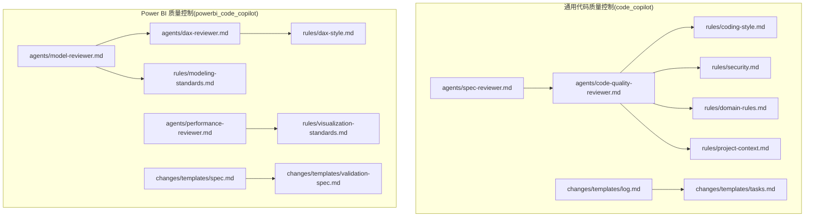
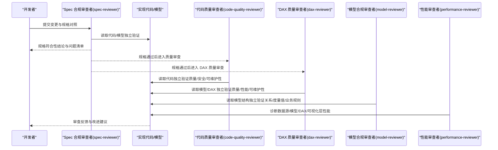
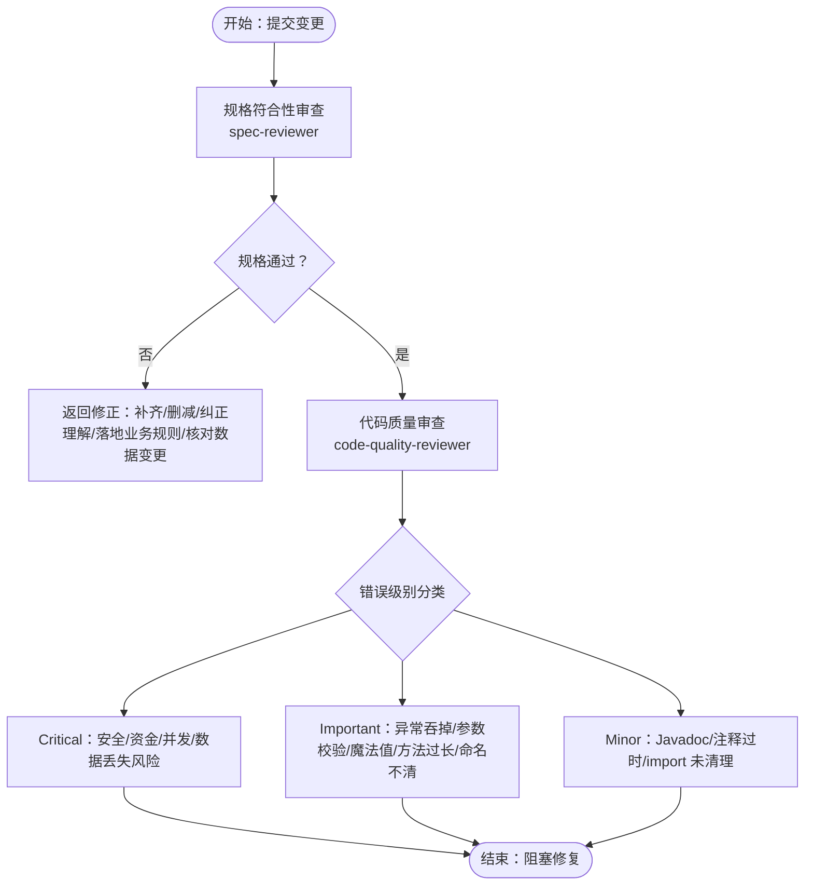
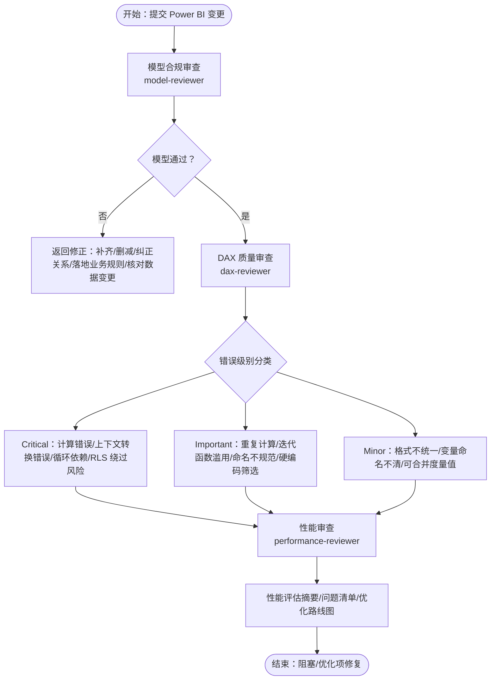
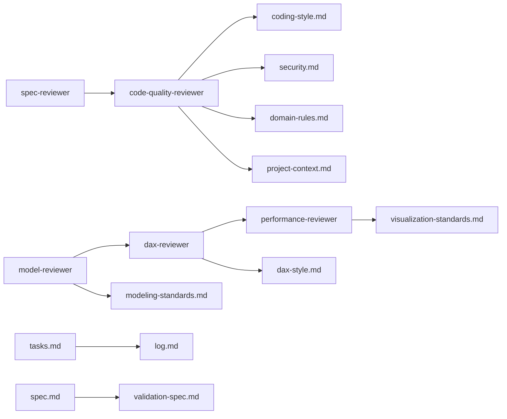

# 代码质量控制模块

<cite>
**本文引用的文件**
- [code-quality-reviewer.md](file://code_copilot/agents/code-quality-reviewer.md)
- [spec-reviewer.md](file://code_copilot/agents/spec-reviewer.md)
- [coding-style.md](file://code_copilot/rules/coding-style.md)
- [security.md](file://code_copilot/rules/security.md)
- [domain-rules.md](file://code_copilot/rules/domain-rules.md)
- [project-context.md](file://code_copilot/rules/project-context.md)
- [log.md](file://code_copilot/changes/templates/log.md)
- [tasks.md](file://code_copilot/changes/templates/tasks.md)
- [dax-reviewer.md](file://powerbi_code_copilot/agents/dax-reviewer.md)
- [model-reviewer.md](file://powerbi_code_copilot/agents/model-reviewer.md)
- [performance-reviewer.md](file://powerbi_code_copilot/agents/performance-reviewer.md)
- [dax-style.md](file://powerbi_code_copilot/rules/dax-style.md)
- [modeling-standards.md](file://powerbi_code_copilot/rules/modeling-standards.md)
- [visualization-standards.md](file://powerbi_code_copilot/rules/visualization-standards.md)
- [spec.md](file://powerbi_code_copilot/changes/templates/spec.md)
- [validation-spec.md](file://powerbi_code_copilot/changes/templates/validation-spec.md)
</cite>

## 目录
1. [简介](#简介)
2. [项目结构](#项目结构)
3. [核心组件](#核心组件)
4. [架构总览](#架构总览)
5. [详细组件分析](#详细组件分析)
6. [依赖分析](#依赖分析)
7. [性能考量](#性能考量)
8. [故障排查指南](#故障排查指南)
9. [结论](#结论)
10. [附录](#附录)

## 简介
本技术文档围绕“代码质量控制模块”展开，系统阐述两类质量控制体系：Java/通用代码质量控制与 Power BI 数据建模与可视化质量控制。前者聚焦代码质量、安全与可维护性，后者覆盖 DAX 质量、模型合规与性能诊断。文档同时给出规范遵循验证机制、错误级别分类、变更管理与模板系统使用方法，以及完整的代码与建模规范定义，帮助团队建立统一的开发与建模标准。

## 项目结构
该仓库包含两套质量控制子系统：
- code_copilot：通用代码质量控制（Java/通用）
  - agents：审查者角色定义与评审流程
  - rules：编码规范、安全红线、领域规则、工程上下文
  - changes/templates：变更日志与任务拆分模板
- powerbi_code_copilot：Power BI 质量控制
  - agents：DAX 质量审查、模型合规审查、性能审查
  - rules：DAX 编码规范、建模规范、可视化规范
  - changes/templates：Spec 模板、验证 Spec 模板

**图表来源**
- [spec-reviewer.md:1-25](file://code_copilot/agents/spec-reviewer.md#L1-L25)
- [code-quality-reviewer.md:1-13](file://code_copilot/agents/code-quality-reviewer.md#L1-L13)
- [coding-style.md:1-34](file://code_copilot/rules/coding-style.md#L1-L34)
- [security.md:1-18](file://code_copilot/rules/security.md#L1-L18)
- [domain-rules.md:1-18](file://code_copilot/rules/domain-rules.md#L1-L18)
- [project-context.md:1-35](file://code_copilot/rules/project-context.md#L1-L35)
- [log.md:1-28](file://code_copilot/changes/templates/log.md#L1-L28)
- [tasks.md:1-33](file://code_copilot/changes/templates/tasks.md#L1-L33)
- [dax-reviewer.md:1-56](file://powerbi_code_copilot/agents/dax-reviewer.md#L1-L56)
- [model-reviewer.md:1-36](file://powerbi_code_copilot/agents/model-reviewer.md#L1-L36)
- [performance-reviewer.md:1-71](file://powerbi_code_copilot/agents/performance-reviewer.md#L1-L71)
- [dax-style.md:1-218](file://powerbi_code_copilot/rules/dax-style.md#L1-L218)
- [modeling-standards.md:1-88](file://powerbi_code_copilot/rules/modeling-standards.md#L1-L88)
- [visualization-standards.md:1-81](file://powerbi_code_copilot/rules/visualization-standards.md#L1-L81)
- [spec.md:1-95](file://powerbi_code_copilot/changes/templates/spec.md#L1-L95)
- [validation-spec.md:1-69](file://powerbi_code_copilot/changes/templates/validation-spec.md#L1-L69)

**章节来源**
- [spec-reviewer.md:1-25](file://code_copilot/agents/spec-reviewer.md#L1-L25)
- [code-quality-reviewer.md:1-13](file://code_copilot/agents/code-quality-reviewer.md#L1-L13)
- [dax-reviewer.md:1-56](file://powerbi_code_copilot/agents/dax-reviewer.md#L1-L56)
- [model-reviewer.md:1-36](file://powerbi_code_copilot/agents/model-reviewer.md#L1-L36)
- [performance-reviewer.md:1-71](file://powerbi_code_copilot/agents/performance-reviewer.md#L1-L71)

## 核心组件
- 通用代码质量控制
  - 角色与流程：spec-reviewer（规格符合性审查）→ code-quality-reviewer（质量/安全/可维护性审查）
  - 规范与规则：编码规范、安全红线、领域规则、工程上下文
  - 变更模板：任务拆分模板、变更日志模板
- Power BI 质量控制
  - 角色与流程：model-reviewer（模型合规）→ dax-reviewer（DAX 质量）→ performance-reviewer（性能诊断）
  - 规范与规则：DAX 编码规范、建模规范、可视化规范
  - 变更模板：Spec 模板、验证 Spec 模板

**章节来源**
- [spec-reviewer.md:1-25](file://code_copilot/agents/spec-reviewer.md#L1-L25)
- [code-quality-reviewer.md:1-13](file://code_copilot/agents/code-quality-reviewer.md#L1-L13)
- [dax-reviewer.md:1-56](file://powerbi_code_copilot/agents/dax-reviewer.md#L1-L56)
- [model-reviewer.md:1-36](file://powerbi_code_copilot/agents/model-reviewer.md#L1-L36)
- [performance-reviewer.md:1-71](file://powerbi_code_copilot/agents/performance-reviewer.md#L1-L71)

## 架构总览
整体质量控制采用“先规格后实现”的双阶段审查：先由 spec-reviewer 对照规格文档验证实现，再由 code-quality-reviewer 或 powerbi_code_copilot 的审查者进行质量与安全审查。审查者均为只读角色，强调“不信报告，只信代码/模型”。

**图表来源**
- [spec-reviewer.md:1-25](file://code_copilot/agents/spec-reviewer.md#L1-L25)
- [code-quality-reviewer.md:1-13](file://code_copilot/agents/code-quality-reviewer.md#L1-L13)
- [dax-reviewer.md:1-56](file://powerbi_code_copilot/agents/dax-reviewer.md#L1-L56)
- [model-reviewer.md:1-36](file://powerbi_code_copilot/agents/model-reviewer.md#L1-L36)
- [performance-reviewer.md:1-71](file://powerbi_code_copilot/agents/performance-reviewer.md#L1-L71)

## 详细组件分析

### 通用代码质量控制组件
- 角色与职责
  - spec-reviewer：验证“缺失实现/多余实现/理解偏差/业务规则落地/数据变更准确性”
  - code-quality-reviewer：质量分级（Critical/Important/Minor）、安全与可维护性检查
- 规范与规则
  - 编码规范：命名、异常处理、日志、其他
  - 安全红线：硬编码密钥/敏感信息、资金/状态/权限逻辑要求
  - 领域规则：金额/时间/外部接口/状态机等
  - 工程上下文：应用概况、目录结构、分层架构、关键依赖
- 变更模板
  - 任务拆分模板：按“数据模型→接口协议→底层实现→上层编排→入口层”的顺序拆分
  - 变更日志模板：记录时间线、技术决策、踩坑记录、知识发现、Spec-Code 偏差、代码质量备忘

**图表来源**
- [spec-reviewer.md:1-25](file://code_copilot/agents/spec-reviewer.md#L1-L25)
- [code-quality-reviewer.md:1-13](file://code_copilot/agents/code-quality-reviewer.md#L1-L13)
- [coding-style.md:1-34](file://code_copilot/rules/coding-style.md#L1-L34)
- [security.md:1-18](file://code_copilot/rules/security.md#L1-L18)
- [domain-rules.md:1-18](file://code_copilot/rules/domain-rules.md#L1-L18)
- [project-context.md:1-35](file://code_copilot/rules/project-context.md#L1-L35)
- [tasks.md:1-33](file://code_copilot/changes/templates/tasks.md#L1-L33)
- [log.md:1-28](file://code_copilot/changes/templates/log.md#L1-L28)

**章节来源**
- [spec-reviewer.md:1-25](file://code_copilot/agents/spec-reviewer.md#L1-L25)
- [code-quality-reviewer.md:1-13](file://code_copilot/agents/code-quality-reviewer.md#L1-L13)
- [coding-style.md:1-34](file://code_copilot/rules/coding-style.md#L1-L34)
- [security.md:1-18](file://code_copilot/rules/security.md#L1-L18)
- [domain-rules.md:1-18](file://code_copilot/rules/domain-rules.md#L1-L18)
- [project-context.md:1-35](file://code_copilot/rules/project-context.md#L1-L35)
- [tasks.md:1-33](file://code_copilot/changes/templates/tasks.md#L1-L33)
- [log.md:1-28](file://code_copilot/changes/templates/log.md#L1-L28)

### Power BI 质量控制组件
- 角色与职责
  - model-reviewer：验证“缺失/多余实现/理解偏差/业务规则落地/模型结构合规/数据变更准确性”
  - dax-reviewer：质量分级（Critical/Important/Minor）、性能审查清单、输出格式
  - performance-reviewer：分层诊断（数据源/Power Query/模型/DAX/可视化）
- 规范与规则
  - DAX 编码规范：命名约定（度量值/计算列/表）、格式规范、编写原则、禁止事项、命名检查清单、常见错误
  - 建模规范：星型模型优先、表类型标识、关系设计、表设计规范、度量值组织、禁止事项
  - 可视化规范：布局与设计原则、图表选型指南、交互设计、移动端适配、可访问性
- 变更模板
  - Spec 模板：背景与目标、现状分析、功能点、业务规则、模型变更、DAX 设计、Power Query 变更、可视化变更、影响范围、风险与关注点、验证策略、待澄清、技术决策、执行日志、审查结论、确认记录
  - 验证 Spec 模板：验证原则、验证环境、数据准确性验证、模型结构验证、性能验证、安全验证、执行计划

**图表来源**
- [model-reviewer.md:1-36](file://powerbi_code_copilot/agents/model-reviewer.md#L1-L36)
- [dax-reviewer.md:1-56](file://powerbi_code_copilot/agents/dax-reviewer.md#L1-L56)
- [performance-reviewer.md:1-71](file://powerbi_code_copilot/agents/performance-reviewer.md#L1-L71)
- [dax-style.md:1-218](file://powerbi_code_copilot/rules/dax-style.md#L1-L218)
- [modeling-standards.md:1-88](file://powerbi_code_copilot/rules/modeling-standards.md#L1-L88)
- [visualization-standards.md:1-81](file://powerbi_code_copilot/rules/visualization-standards.md#L1-L81)
- [spec.md:1-95](file://powerbi_code_copilot/changes/templates/spec.md#L1-L95)
- [validation-spec.md:1-69](file://powerbi_code_copilot/changes/templates/validation-spec.md#L1-L69)

**章节来源**
- [model-reviewer.md:1-36](file://powerbi_code_copilot/agents/model-reviewer.md#L1-L36)
- [dax-reviewer.md:1-56](file://powerbi_code_copilot/agents/dax-reviewer.md#L1-L56)
- [performance-reviewer.md:1-71](file://powerbi_code_copilot/agents/performance-reviewer.md#L1-L71)
- [dax-style.md:1-218](file://powerbi_code_copilot/rules/dax-style.md#L1-L218)
- [modeling-standards.md:1-88](file://powerbi_code_copilot/rules/modeling-standards.md#L1-L88)
- [visualization-standards.md:1-81](file://powerbi_code_copilot/rules/visualization-standards.md#L1-L81)
- [spec.md:1-95](file://powerbi_code_copilot/changes/templates/spec.md#L1-L95)
- [validation-spec.md:1-69](file://powerbi_code_copilot/changes/templates/validation-spec.md#L1-L69)

## 依赖分析
- 通用代码质量控制
  - spec-reviewer 依赖于实现代码与规格文档；通过只读读取实现独立验证
  - code-quality-reviewer 依赖编码规范、安全红线、领域规则、工程上下文
  - 变更模板支撑任务拆分与知识沉淀
- Power BI 质量控制
  - model-reviewer 依赖建模规范与可视化规范；dax-reviewer 依赖 DAX 编码规范
  - performance-reviewer 独立于其他审查阶段，提供跨层诊断
  - 变更模板支撑 Spec 与验证流程

**图表来源**
- [spec-reviewer.md:1-25](file://code_copilot/agents/spec-reviewer.md#L1-L25)
- [code-quality-reviewer.md:1-13](file://code_copilot/agents/code-quality-reviewer.md#L1-L13)
- [coding-style.md:1-34](file://code_copilot/rules/coding-style.md#L1-L34)
- [security.md:1-18](file://code_copilot/rules/security.md#L1-L18)
- [domain-rules.md:1-18](file://code_copilot/rules/domain-rules.md#L1-L18)
- [project-context.md:1-35](file://code_copilot/rules/project-context.md#L1-L35)
- [model-reviewer.md:1-36](file://powerbi_code_copilot/agents/model-reviewer.md#L1-L36)
- [dax-reviewer.md:1-56](file://powerbi_code_copilot/agents/dax-reviewer.md#L1-L56)
- [performance-reviewer.md:1-71](file://powerbi_code_copilot/agents/performance-reviewer.md#L1-L71)
- [dax-style.md:1-218](file://powerbi_code_copilot/rules/dax-style.md#L1-L218)
- [modeling-standards.md:1-88](file://powerbi_code_copilot/rules/modeling-standards.md#L1-L88)
- [visualization-standards.md:1-81](file://powerbi_code_copilot/rules/visualization-standards.md#L1-L81)
- [tasks.md:1-33](file://code_copilot/changes/templates/tasks.md#L1-L33)
- [log.md:1-28](file://code_copilot/changes/templates/log.md#L1-L28)
- [spec.md:1-95](file://powerbi_code_copilot/changes/templates/spec.md#L1-L95)
- [validation-spec.md:1-69](file://powerbi_code_copilot/changes/templates/validation-spec.md#L1-L69)

**章节来源**
- [spec-reviewer.md:1-25](file://code_copilot/agents/spec-reviewer.md#L1-L25)
- [code-quality-reviewer.md:1-13](file://code_copilot/agents/code-quality-reviewer.md#L1-L13)
- [model-reviewer.md:1-36](file://powerbi_code_copilot/agents/model-reviewer.md#L1-L36)
- [dax-reviewer.md:1-56](file://powerbi_code_copilot/agents/dax-reviewer.md#L1-L56)
- [performance-reviewer.md:1-71](file://powerbi_code_copilot/agents/performance-reviewer.md#L1-L71)

## 性能考量
- 通用代码质量控制
  - 幻数与魔法值应定义为常量；写接口需考虑幂等；并发场景需明确同步策略
  - 异常处理：业务异常自定义并携带错误码，系统异常由统一处理器兜底；禁止吞掉异常
- Power BI 质量控制
  - DAX 编写原则：优先使用 VAR 避免重复计算；避免嵌套 CALCULATE；优先使用 REMOVEFILTERS；迭代函数注意迭代表大小；避免在度量值中使用 IF + 大型表迭代
  - 模型层：事实表与维度表分离；关系方向与基数正确；避免循环依赖；移除未使用列/表；日期表独立并标记为日期表
  - 可视化层：单页视觉对象数量建议 ≤ 8；避免 3D 图表与饼图过度使用；避免截断 Y 轴起点

**章节来源**
- [coding-style.md:1-34](file://code_copilot/rules/coding-style.md#L1-L34)
- [dax-style.md:143-170](file://powerbi_code_copilot/rules/dax-style.md#L143-L170)
- [modeling-standards.md:24-62](file://powerbi_code_copilot/rules/modeling-standards.md#L24-L62)
- [visualization-standards.md:31-49](file://powerbi_code_copilot/rules/visualization-standards.md#L31-L49)

## 故障排查指南
- 通用代码质量控制
  - 安全问题：硬编码密钥/敏感信息；日志中打印敏感信息；资金/状态/权限逻辑未在规格中标注或未显式校验
  - 规格偏差：缺失实现、多余实现、理解偏差、业务规则未落地、数据变更不准确
  - 规范违规：命名拼音/中英混拼、异常被吞、Javadoc 缺失、import 未清理、方法过长、魔法值未定义常量
- Power BI 质量控制
  - 模型问题：关系方向/基数错误、双向筛选无明确理由、循环依赖、度量值/计算列/表命名冲突或不规范
  - DAX 问题：隐式度量值、CALCULATE 嵌套不当、EARLIER 使用、硬编码日期/参数、命名不规范
  - 性能问题：查询折叠未生效、阻断查询折叠的步骤、未使用的列/表、高基数文本列、上下文转换开销、时间智能函数使用不当

**章节来源**
- [security.md:1-18](file://code_copilot/rules/security.md#L1-L18)
- [spec-reviewer.md:6-12](file://code_copilot/agents/spec-reviewer.md#L6-L12)
- [code-quality-reviewer.md:5-12](file://code_copilot/agents/code-quality-reviewer.md#L5-L12)
- [dax-reviewer.md:5-26](file://powerbi_code_copilot/agents/dax-reviewer.md#L5-L26)
- [model-reviewer.md:6-18](file://powerbi_code_copilot/agents/model-reviewer.md#L6-L18)
- [dax-style.md:163-170](file://powerbi_code_copilot/rules/dax-style.md#L163-L170)
- [modeling-standards.md:81-88](file://powerbi_code_copilot/rules/modeling-standards.md#L81-L88)

## 结论
该质量控制模块通过“规格先行、质量跟进”的双阶段审查，结合严格的错误级别分类与规范遵循验证机制，确保代码与 Power BI 模型在安全性、准确性、性能与可维护性方面达到统一标准。变更管理与模板系统为知识沉淀与可追溯性提供了结构化支撑，有助于团队持续改进与规模化交付。

## 附录
- 变更管理与模板使用建议
  - 任务拆分：严格按“数据模型→接口协议→底层实现→上层编排→入口层”顺序拆分，每个任务精确到文件路径与函数签名
  - 变更日志：实时记录技术决策、踩坑与知识发现，定期归档并沉淀至知识库
  - Power BI Spec 与验证：先以 Spec 模板明确背景、现状、功能点、业务规则与变更范围，再以验证 Spec 模板进行数据准确性、模型结构、性能与安全验证
- 规范与规则应用策略
  - 工程上下文：首次使用时执行初始化，让 AI 分析工程并填充上下文信息
  - 规则开关：部分规则（如领域规则）按需启用，确保与业务场景匹配

**章节来源**
- [tasks.md:1-33](file://code_copilot/changes/templates/tasks.md#L1-L33)
- [log.md:1-28](file://code_copilot/changes/templates/log.md#L1-L28)
- [project-context.md:1-35](file://code_copilot/rules/project-context.md#L1-L35)
- [spec.md:1-95](file://powerbi_code_copilot/changes/templates/spec.md#L1-L95)
- [validation-spec.md:1-69](file://powerbi_code_copilot/changes/templates/validation-spec.md#L1-L69)