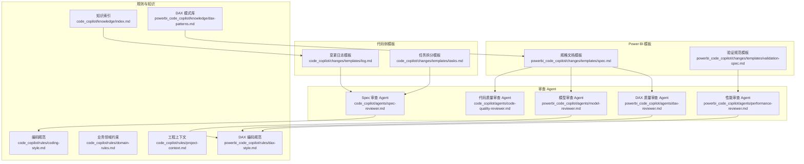
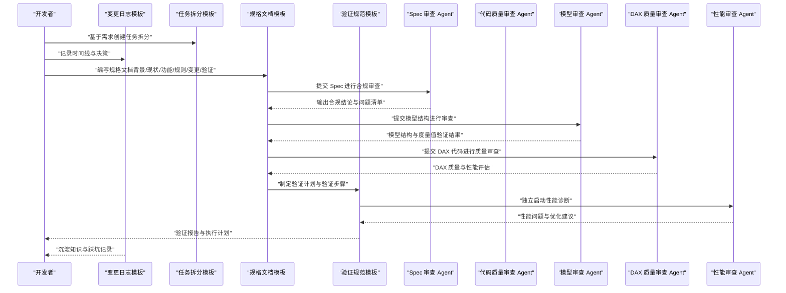
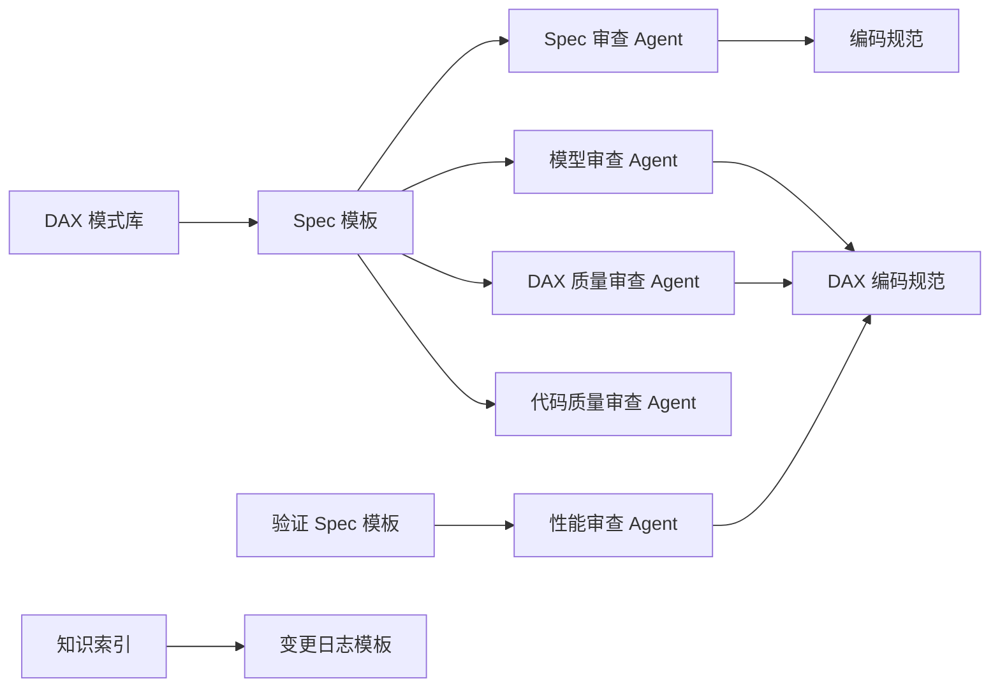

# 变更管理和模板系统

<cite>
**本文引用的文件**
- [code_copilot/changes/templates/log.md](file://code_copilot/changes/templates/log.md)
- [code_copilot/changes/templates/tasks.md](file://code_copilot/changes/templates/tasks.md)
- [powerbi_code_copilot/changes/templates/spec.md](file://powerbi_code_copilot/changes/templates/spec.md)
- [powerbi_code_copilot/changes/templates/validation-spec.md](file://powerbi_code_copilot/changes/templates/validation-spec.md)
- [code_copilot/agents/spec-reviewer.md](file://code_copilot/agents/spec-reviewer.md)
- [code_copilot/agents/code-quality-reviewer.md](file://code_copilot/agents/code-quality-reviewer.md)
- [powerbi_code_copilot/agents/model-reviewer.md](file://powerbi_code_copilot/agents/model-reviewer.md)
- [powerbi_code_copilot/agents/dax-reviewer.md](file://powerbi_code_copilot/agents/dax-reviewer.md)
- [powerbi_code_copilot/agents/performance-reviewer.md](file://powerbi_code_copilot/agents/performance-reviewer.md)
- [code_copilot/rules/coding-style.md](file://code_copilot/rules/coding-style.md)
- [code_copilot/rules/domain-rules.md](file://code_copilot/rules/domain-rules.md)
- [code_copilot/rules/project-context.md](file://code_copilot/rules/project-context.md)
- [powerbi_code_copilot/rules/dax-style.md](file://powerbi_code_copilot/rules/dax-style.md)
- [code_copilot/knowledge/index.md](file://code_copilot/knowledge/index.md)
- [powerbi_code_copilot/knowledge/dax-patterns.md](file://powerbi_code_copilot/knowledge/dax-patterns.md)
</cite>

## 目录
1. [简介](#简介)
2. [项目结构](#项目结构)
3. [核心组件](#核心组件)
4. [架构总览](#架构总览)
5. [详细组件分析](#详细组件分析)
6. [依赖分析](#依赖分析)
7. [性能考量](#性能考量)
8. [故障排查指南](#故障排查指南)
9. [结论](#结论)
10. [附录](#附录)

## 简介
本文件围绕“变更管理和模板系统”展开，系统性阐述变更流程与模板体系在代码与 Power BI 场景下的组织方式与使用方法。重点覆盖：
- 变更日志模板：记录决策、踩坑与知识沉淀
- 任务拆分模板：将需求拆解为可独立提交的原子变更
- 规格文档模板（Spec）：面向功能、模型、DAX、可视化与验证的规范化说明
- 测试规范模板（Validation Spec）：验证原则、验证步骤与执行计划
- 审查与规则：Spec 合规审查、代码质量审查、模型与 DAX 质量审查、性能审查
- 知识库与模式库：变更过程中的知识沉淀与可复用模式

通过模板标准化变更管理流程，确保每次变更具备可追溯、可验证、可沉淀的闭环。

## 项目结构
模板与审查相关的核心目录如下：
- code_copilot/changes/templates：通用变更模板（日志、任务）
- powerbi_code_copilot/changes/templates：Power BI 变更模板（Spec、验证 Spec）
- code_copilot/agents：代码侧审查 Agent（Spec 审查、代码质量审查）
- powerbi_code_copilot/agents：Power BI 审查 Agent（模型审查、DAX 审查、性能审查）
- code_copilot/rules 与 powerbi_code_copilot/rules：编码规范与建模规范
- code_copilot/knowledge 与 powerbi_code_copilot/knowledge：知识索引与 DAX 模式库

图表来源
- [code_copilot/changes/templates/log.md](file://code_copilot/changes/templates/log.md)
- [code_copilot/changes/templates/tasks.md](file://code_copilot/changes/templates/tasks.md)
- [powerbi_code_copilot/changes/templates/spec.md](file://powerbi_code_copilot/changes/templates/spec.md)
- [powerbi_code_copilot/changes/templates/validation-spec.md](file://powerbi_code_copilot/changes/templates/validation-spec.md)
- [code_copilot/agents/spec-reviewer.md](file://code_copilot/agents/spec-reviewer.md)
- [code_copilot/agents/code-quality-reviewer.md](file://code_copilot/agents/code-quality-reviewer.md)
- [powerbi_code_copilot/agents/model-reviewer.md](file://powerbi_code_copilot/agents/model-reviewer.md)
- [powerbi_code_copilot/agents/dax-reviewer.md](file://powerbi_code_copilot/agents/dax-reviewer.md)
- [powerbi_code_copilot/agents/performance-reviewer.md](file://powerbi_code_copilot/agents/performance-reviewer.md)
- [code_copilot/rules/coding-style.md](file://code_copilot/rules/coding-style.md)
- [code_copilot/rules/domain-rules.md](file://code_copilot/rules/domain-rules.md)
- [code_copilot/rules/project-context.md](file://code_copilot/rules/project-context.md)
- [powerbi_code_copilot/rules/dax-style.md](file://powerbi_code_copilot/rules/dax-style.md)
- [code_copilot/knowledge/index.md](file://code_copilot/knowledge/index.md)
- [powerbi_code_copilot/knowledge/dax-patterns.md](file://powerbi_code_copilot/knowledge/dax-patterns.md)

章节来源
- [code_copilot/changes/templates/log.md](file://code_copilot/changes/templates/log.md)
- [code_copilot/changes/templates/tasks.md](file://code_copilot/changes/templates/tasks.md)
- [powerbi_code_copilot/changes/templates/spec.md](file://powerbi_code_copilot/changes/templates/spec.md)
- [powerbi_code_copilot/changes/templates/validation-spec.md](file://powerbi_code_copilot/changes/templates/validation-spec.md)
- [code_copilot/agents/spec-reviewer.md](file://code_copilot/agents/spec-reviewer.md)
- [code_copilot/agents/code-quality-reviewer.md](file://code_copilot/agents/code-quality-reviewer.md)
- [powerbi_code_copilot/agents/model-reviewer.md](file://powerbi_code_copilot/agents/model-reviewer.md)
- [powerbi_code_copilot/agents/dax-reviewer.md](file://powerbi_code_copilot/agents/dax-reviewer.md)
- [powerbi_code_copilot/agents/performance-reviewer.md](file://powerbi_code_copilot/agents/performance-reviewer.md)
- [code_copilot/rules/coding-style.md](file://code_copilot/rules/coding-style.md)
- [code_copilot/rules/domain-rules.md](file://code_copilot/rules/domain-rules.md)
- [code_copilot/rules/project-context.md](file://code_copilot/rules/project-context.md)
- [powerbi_code_copilot/rules/dax-style.md](file://powerbi_code_copilot/rules/dax-style.md)
- [code_copilot/knowledge/index.md](file://code_copilot/knowledge/index.md)
- [powerbi_code_copilot/knowledge/dax-patterns.md](file://powerbi_code_copilot/knowledge/dax-patterns.md)

## 核心组件
- 变更日志模板：用于记录时间线、技术决策、踩坑记录、知识发现、Spec-Code 偏差与代码质量要点，支撑变更过程的可追溯与知识沉淀。
- 任务拆分模板：将需求拆分为“数据模型 → 接口协议 → 底层实现 → 上层编排 → 入口层”的原子任务，明确文件路径、函数签名、验收标准与验证命令。
- 规格文档模板（Spec）：面向背景与目标、现状分析、功能点、业务规则、模型变更、DAX 设计、Power Query 变更、可视化变更、影响范围、风险与关注点、验证策略、执行日志、审查结论与确认记录。
- 验证规范模板（Validation Spec）：定义验证原则（数据驱动、对比验证、边界测试、展示证据）、验证环境、数据准确性验证（P0/P1/P2）、模型结构验证、性能验证、安全验证与执行计划。
- 审查 Agent：Spec 合规审查、代码质量审查、模型与 DAX 质量审查、性能审查，均强调“只读不写、独立验证”，并提供分级与输出格式。
- 规则与知识：编码规范、业务领域约束、工程上下文、DAX 编码规范；知识索引与 DAX 模式库，支撑模板使用与最佳实践复用。

章节来源
- [code_copilot/changes/templates/log.md](file://code_copilot/changes/templates/log.md)
- [code_copilot/changes/templates/tasks.md](file://code_copilot/changes/templates/tasks.md)
- [powerbi_code_copilot/changes/templates/spec.md](file://powerbi_code_copilot/changes/templates/spec.md)
- [powerbi_code_copilot/changes/templates/validation-spec.md](file://powerbi_code_copilot/changes/templates/validation-spec.md)
- [code_copilot/agents/spec-reviewer.md](file://code_copilot/agents/spec-reviewer.md)
- [code_copilot/agents/code-quality-reviewer.md](file://code_copilot/agents/code-quality-reviewer.md)
- [powerbi_code_copilot/agents/model-reviewer.md](file://powerbi_code_copilot/agents/model-reviewer.md)
- [powerbi_code_copilot/agents/dax-reviewer.md](file://powerbi_code_copilot/agents/dax-reviewer.md)
- [powerbi_code_copilot/agents/performance-reviewer.md](file://powerbi_code_copilot/agents/performance-reviewer.md)
- [code_copilot/rules/coding-style.md](file://code_copilot/rules/coding-style.md)
- [code_copilot/rules/domain-rules.md](file://code_copilot/rules/domain-rules.md)
- [code_copilot/rules/project-context.md](file://code_copilot/rules/project-context.md)
- [powerbi_code_copilot/rules/dax-style.md](file://powerbi_code_copilot/rules/dax-style.md)
- [code_copilot/knowledge/index.md](file://code_copilot/knowledge/index.md)
- [powerbi_code_copilot/knowledge/dax-patterns.md](file://powerbi_code_copilot/knowledge/dax-patterns.md)

## 架构总览
模板系统与审查 Agent 的协作关系如下：

图表来源
- [code_copilot/changes/templates/log.md](file://code_copilot/changes/templates/log.md)
- [code_copilot/changes/templates/tasks.md](file://code_copilot/changes/templates/tasks.md)
- [powerbi_code_copilot/changes/templates/spec.md](file://powerbi_code_copilot/changes/templates/spec.md)
- [powerbi_code_copilot/changes/templates/validation-spec.md](file://powerbi_code_copilot/changes/templates/validation-spec.md)
- [code_copilot/agents/spec-reviewer.md](file://code_copilot/agents/spec-reviewer.md)
- [code_copilot/agents/code-quality-reviewer.md](file://code_copilot/agents/code-quality-reviewer.md)
- [powerbi_code_copilot/agents/model-reviewer.md](file://powerbi_code_copilot/agents/model-reviewer.md)
- [powerbi_code_copilot/agents/dax-reviewer.md](file://powerbi_code_copilot/agents/dax-reviewer.md)
- [powerbi_code_copilot/agents/performance-reviewer.md](file://powerbi_code_copilot/agents/performance-reviewer.md)

## 详细组件分析

### 变更日志模板（code_copilot/changes/templates/log.md）
- 用途：记录变更过程中的时间线、技术决策、踩坑与知识发现，支持在归档时将沉淀的知识迁移至知识库。
- 关键结构：时间线表格、技术决策表格、踩坑记录表格、知识发现说明、Spec-Code 偏差记录、代码质量备忘等。
- 使用场景：每次任务完成后实时记录，形成可检索的知识输入，便于后续复盘与沉淀。
- 维护建议：定期回顾“沉淀？”标记，将有价值的经验迁移至知识库；偏差记录用于追踪实现与 Spec 的差异。

章节来源
- [code_copilot/changes/templates/log.md](file://code_copilot/changes/templates/log.md)

### 任务拆分模板（code_copilot/changes/templates/tasks.md）
- 用途：将需求拆分为可独立提交的原子变更，明确文件路径、函数签名、验收标准与验证命令。
- 关键结构：前置条件、Task 列表、完成标记、变更摘要（文件数、偏差记录、遗留问题）。
- 使用场景：需求评审后，依据“数据模型 → 接口协议 → 底层实现 → 上层编排 → 入口层”的顺序拆分任务，确保每个任务可独立验证与提交。
- 维护建议：严格控制每个任务的粒度（3-5 个文件），签名与路径必须精确到文件与函数级别；验收标准应可量化。

章节来源
- [code_copilot/changes/templates/tasks.md](file://code_copilot/changes/templates/tasks.md)

### 规格文档模板（powerbi_code_copilot/changes/templates/spec.md）
- 用途：面向 Power BI 变更的规范化说明，覆盖背景与目标、现状分析、功能点、业务规则、模型变更、DAX 设计、Power Query 变更、可视化变更、影响范围、风险与关注点、验证策略、执行日志、审查结论与确认记录。
- 关键结构：元信息（状态、创建日期、复杂度、类型）、背景与目标、现状分析、功能点、业务规则、模型变更表格、DAX 设计表格、Power Query 变更表格、可视化变更表格、影响范围、风险与关注点、验证策略、待澄清、技术决策、执行日志、审查结论、确认记录。
- 使用场景：在进入实现前，通过规范化的 Spec 明确“做什么、为什么做、怎么做、如何验证”，并与审查 Agent 对齐。
- 维护建议：现状分析必须注明数据源、表名、度量值名称、DAX 表达式出处；业务规则与模型变更需与 DAX 和可视化一一对应。

章节来源
- [powerbi_code_copilot/changes/templates/spec.md](file://powerbi_code_copilot/changes/templates/spec.md)

### 验证规范模板（powerbi_code_copilot/changes/templates/validation-spec.md）
- 用途：定义验证原则（数据驱动、对比验证、边界测试、展示证据），并提供验证环境、数据准确性验证（P0/P1/P2）、模型结构验证、性能验证、安全验证与执行计划。
- 关键结构：验证原则、验证环境表格、数据准确性验证（场景、筛选条件、预期值来源、实际值、结果）、模型结构验证清单、性能验证表格、安全验证表格、执行计划。
- 使用场景：在 Spec 通过后，制定严格的验证策略与执行步骤，确保变更质量与可追溯性。
- 维护建议：P0 核心业务指标必须与已知正确值（Excel/SQL 直查）交叉对比；性能验证需设定可接受阈值；安全验证需覆盖 RLS 测试。

章节来源
- [powerbi_code_copilot/changes/templates/validation-spec.md](file://powerbi_code_copilot/changes/templates/validation-spec.md)

### 审查 Agent 与规则

#### Spec 合规审查（code_copilot/agents/spec-reviewer.md）
- 审查维度：缺失实现、多余实现、理解偏差、业务规则落地、数据变更准确性。
- 输出格式：逐条验证功能点与结论，强调“只信代码”的独立验证。
- 工具权限：仅读，无需写入。

章节来源
- [code_copilot/agents/spec-reviewer.md](file://code_copilot/agents/spec-reviewer.md)

#### 代码质量审查（code_copilot/agents/code-quality-reviewer.md）
- 审查分级：Critical（阻塞）、Important（应修复）、Minor（建议）。
- 关注点：安全漏洞、并发安全、数据丢失风险、异常吞掉、魔法值、方法过长、命名不清等。
- 工具权限：仅读，无需写入。

章节来源
- [code_copilot/agents/code-quality-reviewer.md](file://code_copilot/agents/code-quality-reviewer.md)

#### 模型合规审查（powerbi_code_copilot/agents/model-reviewer.md）
- 审查维度：缺失/多余/偏差实现、业务规则落地、模型结构合规（星型/雪花模型、关系方向、筛选器传播、循环依赖）。
- 输出格式：模型结构验证、度量值逐条验证与结论。
- 工具权限：仅读，无需写入。

章节来源
- [powerbi_code_copilot/agents/model-reviewer.md](file://powerbi_code_copilot/agents/model-reviewer.md)

#### DAX 质量审查（powerbi_code_copilot/agents/dax-reviewer.md）
- 审查分级：Critical（计算结果错误、上下文转换错误、循环依赖、隐式度量值歧义、RLS 规则绕过风险）、Important、Minor。
- 性能审查清单：上下文转换、筛选参数、迭代函数、变量复用、时间智能函数、预计算等。
- 输出格式：问题分类与性能评估摘要。
- 工具权限：仅读，无需写入。

章节来源
- [powerbi_code_copilot/agents/dax-reviewer.md](file://powerbi_code_copilot/agents/dax-reviewer.md)

#### 性能审查（powerbi_code_copilot/agents/performance-reviewer.md）
- 诊断框架：数据源层、Power Query 层、模型层、DAX 层、可视化层。
- 输出格式：整体评级、问题清单（P0/P1/P2）、优化路线图。
- 工具权限：仅读，无需写入。

章节来源
- [powerbi_code_copilot/agents/performance-reviewer.md](file://powerbi_code_copilot/agents/performance-reviewer.md)

### 规则与知识

#### 编码规范（code_copilot/rules/coding-style.md）
- 覆盖命名、异常处理、日志、幂等等规范，确保代码一致性与可维护性。

章节来源
- [code_copilot/rules/coding-style.md](file://code_copilot/rules/coding-style.md)

#### 业务领域约束（code_copilot/rules/domain-rules.md）
- 金额、时间、外部接口超时与降级、状态机等约束，保障业务正确性。

章节来源
- [code_copilot/rules/domain-rules.md](file://code_copilot/rules/domain-rules.md)

#### 工程上下文（code_copilot/rules/project-context.md）
- 应用概况、目录结构、分层架构、关键依赖，帮助 AI 与开发者快速理解项目。

章节来源
- [code_copilot/rules/project-context.md](file://code_copilot/rules/project-context.md)

#### DAX 编码规范（powerbi_code_copilot/rules/dax-style.md）
- 命名约定（度量值、计算列、表命名）、格式规范、编写原则、禁止事项与检查清单，确保 DAX 可读性与性能。

章节来源
- [powerbi_code_copilot/rules/dax-style.md](file://powerbi_code_copilot/rules/dax-style.md)

#### 知识索引（code_copilot/knowledge/index.md）
- 领域知识、技术约定、踩坑记录的轻量索引，便于快速检索与复用。

章节来源
- [code_copilot/knowledge/index.md](file://code_copilot/knowledge/index.md)

#### DAX 模式库（powerbi_code_copilot/knowledge/dax-patterns.md）
- 提供经过验证的高质量 DAX 模式（累计求和、同比/环比、动态 Top N、ABC 分析、移动平均、半加性度量值等），包含场景、代码、解释与性能说明，支持直接复用。

章节来源
- [powerbi_code_copilot/knowledge/dax-patterns.md](file://powerbi_code_copilot/knowledge/dax-patterns.md)

## 依赖分析
模板与审查 Agent 的依赖关系如下：

图表来源
- [powerbi_code_copilot/changes/templates/spec.md](file://powerbi_code_copilot/changes/templates/spec.md)
- [powerbi_code_copilot/changes/templates/validation-spec.md](file://powerbi_code_copilot/changes/templates/validation-spec.md)
- [code_copilot/agents/spec-reviewer.md](file://code_copilot/agents/spec-reviewer.md)
- [powerbi_code_copilot/agents/model-reviewer.md](file://powerbi_code_copilot/agents/model-reviewer.md)
- [powerbi_code_copilot/agents/dax-reviewer.md](file://powerbi_code_copilot/agents/dax-reviewer.md)
- [powerbi_code_copilot/agents/performance-reviewer.md](file://powerbi_code_copilot/agents/performance-reviewer.md)
- [code_copilot/rules/coding-style.md](file://code_copilot/rules/coding-style.md)
- [powerbi_code_copilot/rules/dax-style.md](file://powerbi_code_copilot/rules/dax-style.md)
- [powerbi_code_copilot/knowledge/dax-patterns.md](file://powerbi_code_copilot/knowledge/dax-patterns.md)
- [code_copilot/knowledge/index.md](file://code_copilot/knowledge/index.md)
- [code_copilot/changes/templates/log.md](file://code_copilot/changes/templates/log.md)

章节来源
- [powerbi_code_copilot/changes/templates/spec.md](file://powerbi_code_copilot/changes/templates/spec.md)
- [powerbi_code_copilot/changes/templates/validation-spec.md](file://powerbi_code_copilot/changes/templates/validation-spec.md)
- [code_copilot/agents/spec-reviewer.md](file://code_copilot/agents/spec-reviewer.md)
- [powerbi_code_copilot/agents/model-reviewer.md](file://powerbi_code_copilot/agents/model-reviewer.md)
- [powerbi_code_copilot/agents/dax-reviewer.md](file://powerbi_code_copilot/agents/dax-reviewer.md)
- [powerbi_code_copilot/agents/performance-reviewer.md](file://powerbi_code_copilot/agents/performance-reviewer.md)
- [code_copilot/rules/coding-style.md](file://code_copilot/rules/coding-style.md)
- [powerbi_code_copilot/rules/dax-style.md](file://powerbi_code_copilot/rules/dax-style.md)
- [powerbi_code_copilot/knowledge/dax-patterns.md](file://powerbi_code_copilot/knowledge/dax-patterns.md)
- [code_copilot/knowledge/index.md](file://code_copilot/knowledge/index.md)
- [code_copilot/changes/templates/log.md](file://code_copilot/changes/templates/log.md)

## 性能考量
- DAX 层：优先使用 VAR 避免重复计算，减少嵌套 CALCULATE，迭代函数在最小粒度表上运行，正确使用时间智能函数与上下文转换。
- 模型层：遵循星型/雪花模型，明确关系方向与筛选器传播，避免双向筛选与循环依赖。
- 可视化层：控制单页视觉对象数量，谨慎使用高基数列在切片器中的使用，评估自定义视觉对象与条件格式的性能影响。
- 性能审查：通过诊断框架识别数据源、Power Query、模型、DAX、可视化各层的瓶颈，给出 P0/P1/P2 问题清单与优化路线图。

章节来源
- [powerbi_code_copilot/agents/performance-reviewer.md](file://powerbi_code_copilot/agents/performance-reviewer.md)
- [powerbi_code_copilot/rules/dax-style.md](file://powerbi_code_copilot/rules/dax-style.md)

## 故障排查指南
- 验证失败（数据准确性）：对照验证 Spec 的场景与筛选条件，准备已知正确值（Excel/SQL 直查），逐项核对预期与实际值。
- 模型结构问题：检查关系方向、基数、筛选器传播、是否存在循环依赖与歧义路径；必要时进行 RLS 规则隔离验证。
- 性能问题：根据诊断框架定位瓶颈层级，优先优化影响最大的问题；关注查询折叠、阻断折叠的步骤、迭代函数的数据量与上下文转换开销。
- 安全问题（RLS）：针对涉及敏感数据/财务数据的变更，严格执行安全验证，确保角色与用户可见数据符合预期。
- 规范不符：对照编码规范与 DAX 编码规范，修正命名、格式、上下文与性能问题；必要时参考 DAX 模式库进行重构。

章节来源
- [powerbi_code_copilot/changes/templates/validation-spec.md](file://powerbi_code_copilot/changes/templates/validation-spec.md)
- [powerbi_code_copilot/agents/model-reviewer.md](file://powerbi_code_copilot/agents/model-reviewer.md)
- [powerbi_code_copilot/agents/performance-reviewer.md](file://powerbi_code_copilot/agents/performance-reviewer.md)
- [powerbi_code_copilot/agents/dax-reviewer.md](file://powerbi_code_copilot/agents/dax-reviewer.md)
- [code_copilot/rules/coding-style.md](file://code_copilot/rules/coding-style.md)
- [powerbi_code_copilot/rules/dax-style.md](file://powerbi_code_copilot/rules/dax-style.md)
- [powerbi_code_copilot/knowledge/dax-patterns.md](file://powerbi_code_copilot/knowledge/dax-patterns.md)

## 结论
通过标准化的模板体系与独立的审查 Agent，变更管理实现了“可规划、可拆分、可验证、可沉淀”。模板不仅是文档工具，更是流程契约：Spec 明确目标与范围，Validation Spec 确保质量门槛，审查 Agent 提供独立视角与质量保障，规则与知识库提供一致性与复用能力。建议在团队内推广模板使用与审查流程，持续完善知识库与模式库，提升整体交付质量与效率。

## 附录
- 模板使用最佳实践
  - 在需求评审后立即创建任务拆分模板，明确文件与签名，设定验收标准与验证命令。
  - 编写 Spec 时，现状分析必须注明数据源与出处，业务规则与模型变更需与 DAX/可视化一一对应。
  - 验证阶段严格遵循验证 Spec 的原则与步骤，P0 核心指标必须与已知正确值交叉对比。
  - 审查阶段由 Spec 审查先行，随后模型与 DAX 审查，最后独立启动性能审查。
  - 将变更过程中的知识沉淀至知识库，形成“知识飞轮”的输入。

- 模板之间的关联关系
  - 任务拆分模板与变更日志模板共同支撑变更过程的可追溯性与知识沉淀。
  - 规格文档模板是审查与验证的依据，贯穿模型、DAX、Power Query 与可视化变更。
  - 验证规范模板与性能审查 Agent 确保变更质量与性能达标。
  - 规则与知识库为模板使用提供一致性与复用能力。