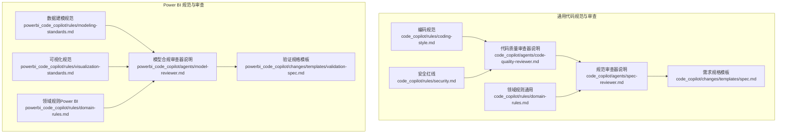
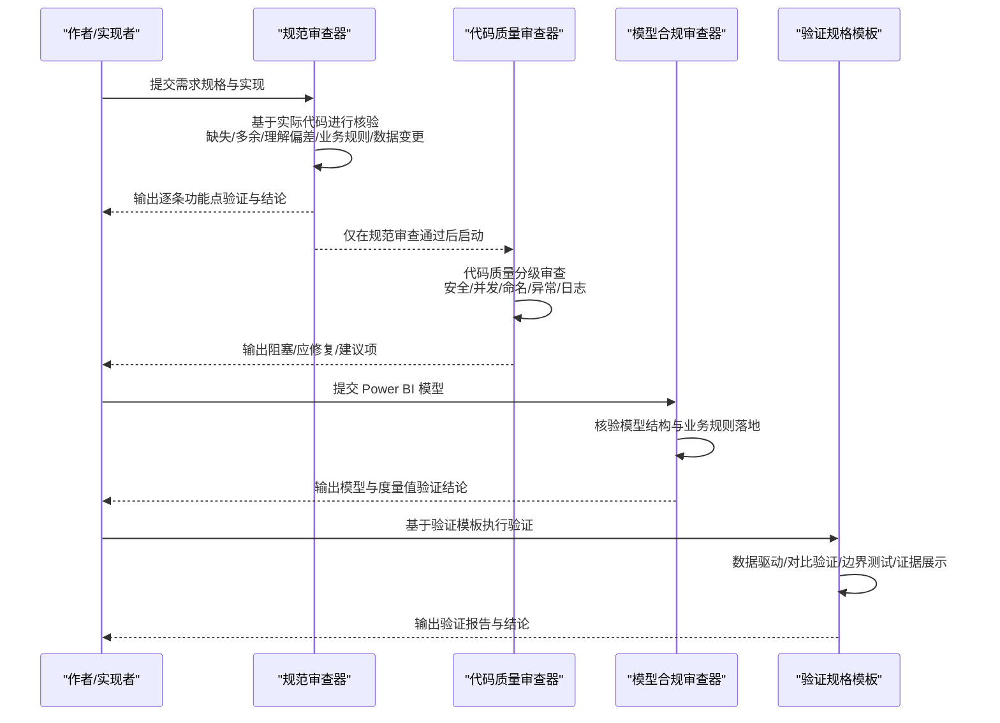
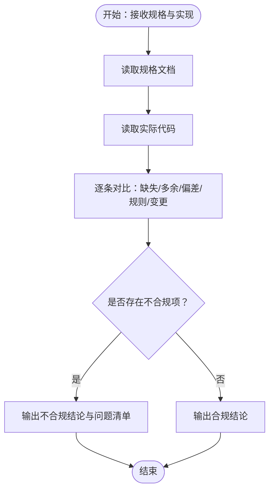
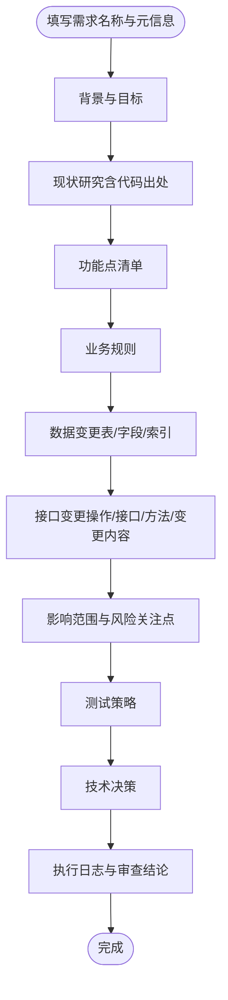
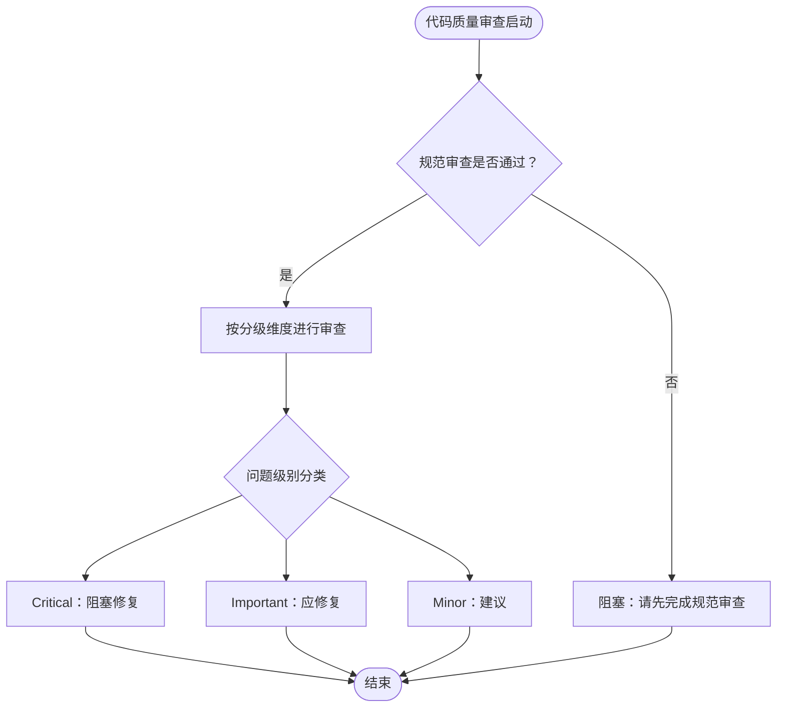
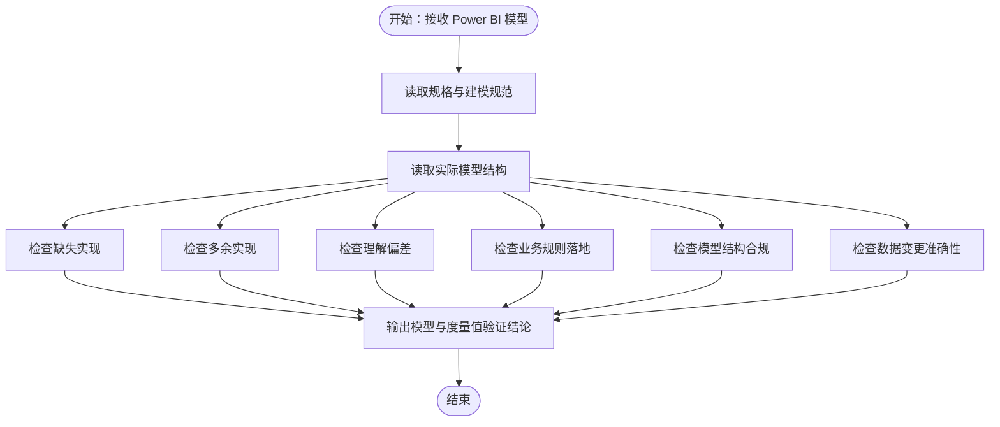
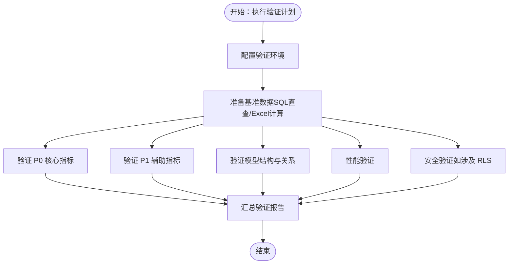
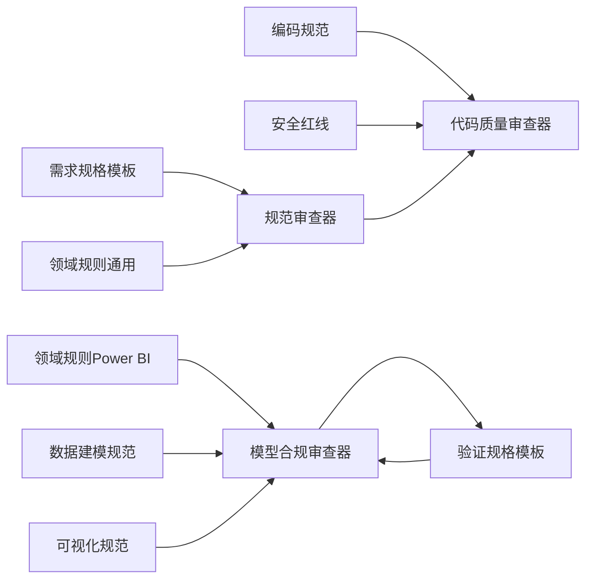

# 规范符合性检查

<cite>
**本文引用的文件**
- [规范审查器说明](file://code_copilot/agents/spec-reviewer.md)
- [需求规格模板](file://code_copilot/changes/templates/spec.md)
- [验证规格模板](file://powerbi_code_copilot/changes/templates/validation-spec.md)
- [领域规则（通用）](file://code_copilot/rules/domain-rules.md)
- [领域规则（Power BI）](file://powerbi_code_copilot/rules/domain-rules.md)
- [编码规范](file://code_copilot/rules/coding-style.md)
- [安全红线](file://code_copilot/rules/security.md)
- [数据建模规范](file://powerbi_code_copilot/rules/modeling-standards.md)
- [可视化规范](file://powerbi_code_copilot/rules/visualization-standards.md)
- [模型合规审查器说明](file://powerbi_code_copilot/agents/model-reviewer.md)
- [代码质量审查器说明](file://code_copilot/agents/code-quality-reviewer.md)
</cite>

## 目录
1. [简介](#简介)
2. [项目结构](#项目结构)
3. [核心组件](#核心组件)
4. [架构总览](#架构总览)
5. [详细组件分析](#详细组件分析)
6. [依赖分析](#依赖分析)
7. [性能考量](#性能考量)
8. [故障排查指南](#故障排查指南)
9. [结论](#结论)
10. [附录](#附录)

## 简介
本文件系统化阐述“规范符合性检查”的实现机制与流程，覆盖规格文档验证、实现与规格对比、业务规则落地检查三个层面。重点说明规范审查器如何确保代码/模型实现符合预定义的规格要求，包括功能规格、技术规格与业务规则；并提供检查示例与验证流程，展示如何通过规范符合性检查保障代码质量的一致性与可靠性，以及检查结果的处理方式与改进建议生成机制。

## 项目结构
该仓库围绕“规范符合性检查”形成了两类知识资产：
- 通用代码规范与审查工具：面向传统编程语言的规范与审查流程
- Power BI 专项规范与审查工具：面向数据建模与可视化的规范与审查流程

**图示来源**
- [规范审查器说明](file://code_copilot/agents/spec-reviewer.md)
- [需求规格模板](file://code_copilot/changes/templates/spec.md)
- [编码规范](file://code_copilot/rules/coding-style.md)
- [领域规则（通用）](file://code_copilot/rules/domain-rules.md)
- [安全红线](file://code_copilot/rules/security.md)
- [代码质量审查器说明](file://code_copilot/agents/code-quality-reviewer.md)
- [模型合规审查器说明](file://powerbi_code_copilot/agents/model-reviewer.md)
- [验证规格模板](file://powerbi_code_copilot/changes/templates/validation-spec.md)
- [数据建模规范](file://powerbi_code_copilot/rules/modeling-standards.md)
- [可视化规范](file://powerbi_code_copilot/rules/visualization-standards.md)
- [领域规则（Power BI）](file://powerbi_code_copilot/rules/domain-rules.md)

**章节来源**
- [规范审查器说明](file://code_copilot/agents/spec-reviewer.md)
- [需求规格模板](file://code_copilot/changes/templates/spec.md)
- [模型合规审查器说明](file://powerbi_code_copilot/agents/model-reviewer.md)
- [验证规格模板](file://powerbi_code_copilot/changes/templates/validation-spec.md)

## 核心组件
- 规范审查器（Spec Compliance Reviewer）
  - 职责：独立验证实现是否符合规格，只读不写，基于实际代码进行核验
  - 审查维度：缺失实现、多余实现、理解偏差、业务规则落地、数据变更准确性
  - 输出格式：逐条功能点验证与最终结论
- 需求规格模板（Spec Template）
  - 用于沉淀背景目标、现状研究、功能点、业务规则、数据变更、接口变更、影响范围、风险关注点、测试策略、执行日志、审查结论等
- 代码质量审查器（Code Quality Reviewer）
  - 前置条件：必须在规范审查通过后启动
  - 审查分级：Critical（阻塞）、Important（应修复）、Minor（建议）
- Power BI 模型合规审查器（Model Compliance Reviewer）
  - 职责：独立验证 Power BI 模型是否符合规格与建模最佳实践
  - 审查维度：缺失/多余/理解偏差、业务规则落地、模型结构合规（星型/雪花、关系方向与基数、双向筛选、循环依赖）、数据变更准确性
- 验证规格模板（Validation Spec Template）
  - 用于验证阶段的数据驱动、对比验证、边界测试与证据展示，覆盖核心/辅助指标、模型结构、性能与安全验证
- 规则体系
  - 编码规范、领域规则（通用/Power BI）、安全红线、数据建模规范、可视化规范

**章节来源**
- [规范审查器说明](file://code_copilot/agents/spec-reviewer.md)
- [需求规格模板](file://code_copilot/changes/templates/spec.md)
- [代码质量审查器说明](file://code_copilot/agents/code-quality-reviewer.md)
- [模型合规审查器说明](file://powerbi_code_copilot/agents/model-reviewer.md)
- [验证规格模板](file://powerbi_code_copilot/changes/templates/validation-spec.md)
- [编码规范](file://code_copilot/rules/coding-style.md)
- [领域规则（通用）](file://code_copilot/rules/domain-rules.md)
- [领域规则（Power BI）](file://powerbi_code_copilot/rules/domain-rules.md)
- [安全红线](file://code_copilot/rules/security.md)
- [数据建模规范](file://powerbi_code_copilot/rules/modeling-standards.md)
- [可视化规范](file://powerbi_code_copilot/rules/visualization-standards.md)

## 架构总览
规范符合性检查的总体流程分为“规格文档验证—实现与规格对比—业务规则落地检查—结果处理与改进生成”四个阶段，贯穿通用代码与 Power BI 两条主线。

**图示来源**
- [规范审查器说明](file://code_copilot/agents/spec-reviewer.md)
- [代码质量审查器说明](file://code_copilot/agents/code-quality-reviewer.md)
- [模型合规审查器说明](file://powerbi_code_copilot/agents/model-reviewer.md)
- [验证规格模板](file://powerbi_code_copilot/changes/templates/validation-spec.md)

## 详细组件分析

### 规范审查器（通用代码）
- 审查维度与判定
  - 缺失实现：规格要求但代码未实现
  - 多余实现：规格未要求但代码多做了（YAGNI）
  - 理解偏差：实现方向与规格描述不符
  - 业务规则落地：规格第4节的业务规则是否全部体现在代码中
  - 数据变更准确性：规格第5节的表/字段变更是否准确落地
- 输出格式
  - 功能点逐条验证：标注“已实现/未实现/实现方式有偏差”，并给出代码出处
  - 结论：明确“合规/不合规”，附具体问题清单
- 工具权限：仅需只读权限（Read/Grep/Glob/Bash）

**图示来源**
- [规范审查器说明](file://code_copilot/agents/spec-reviewer.md)

**章节来源**
- [规范审查器说明](file://code_copilot/agents/spec-reviewer.md)

### 需求规格模板（Spec Template）
- 用途：沉淀需求背景、现状研究、功能点、业务规则、数据/接口变更、影响范围、风险关注点、测试策略、执行日志、审查结论等
- 关键字段：状态、复杂度、创建时间、功能点清单、数据变更表/字段/索引、接口变更、测试策略、技术决策、确认记录等
- 价值：为规范审查与验证提供可追溯、可对比的基准

**图示来源**
- [需求规格模板](file://code_copilot/changes/templates/spec.md)

**章节来源**
- [需求规格模板](file://code_copilot/changes/templates/spec.md)

### 代码质量审查器（前置条件与分级）
- 前置条件：必须在规范审查通过后启动
- 审查分级
  - Critical（阻塞）：安全漏洞、资金逻辑错误、并发安全、数据丢失风险
  - Important（应修复）：异常被吞、缺少参数校验、魔法值、方法过长、命名不清
  - Minor（建议）：Javadoc 缺失、注释过时、import 未清理
- 工具权限：仅需只读权限（Read/Grep/Glob/Bash）

**图示来源**
- [代码质量审查器说明](file://code_copilot/agents/code-quality-reviewer.md)

**章节来源**
- [代码质量审查器说明](file://code_copilot/agents/code-quality-reviewer.md)

### Power BI 模型合规审查器
- 审查维度
  - 缺失实现：缺表/缺列/缺度量值/缺关系
  - 多余实现：规格未要求但多做了（YAGNI）
  - 理解偏差：关系方向/基数/筛选器传播方向错误
  - 业务规则落地：度量值/计算列是否体现业务规则
  - 模型结构合规：星型/雪花模型、事实/维度分离、关系方向与基数、双向筛选（需理由）、循环依赖
  - 数据变更准确性：表/字段变更是否准确落地
- 输出格式：模型结构验证、度量值逐条验证、最终结论
- 工具权限：仅需只读权限（Read/Grep/Glob）

**图示来源**
- [模型合规审查器说明](file://powerbi_code_copilot/agents/model-reviewer.md)
- [数据建模规范](file://powerbi_code_copilot/rules/modeling-standards.md)
- [领域规则（Power BI）](file://powerbi_code_copilot/rules/domain-rules.md)

**章节来源**
- [模型合规审查器说明](file://powerbi_code_copilot/agents/model-reviewer.md)
- [数据建模规范](file://powerbi_code_copilot/rules/modeling-standards.md)
- [领域规则（Power BI）](file://powerbi_code_copilot/rules/domain-rules.md)

### 验证规格模板（Power BI）
- 验证原则：数据驱动、对比验证、边界测试、展示证据
- 验证环境：数据源环境、数据量级、时间范围、基准值来源
- 验证内容
  - 数据准确性验证：P0/P1/P2 指标场景与边界条件
  - 模型结构验证：关系方向/基数、筛选器传播、循环依赖、RLS
  - 性能验证：页面加载、切片器筛选、钻取操作响应时间
  - 安全验证（如涉及 RLS）：角色与可见数据
- 执行计划：准备基准数据、验证核心指标、验证辅助指标、验证模型结构与关系、性能测试、安全测试、汇总报告

**图示来源**
- [验证规格模板](file://powerbi_code_copilot/changes/templates/validation-spec.md)

**章节来源**
- [验证规格模板](file://powerbi_code_copilot/changes/templates/validation-spec.md)

### 规则体系与落地要点
- 编码规范：命名、异常处理、日志、幂等等
- 领域规则（通用）：金额单位、时间字段、外部接口超时与降级、状态机
- 领域规则（Power BI）：金额/百分比格式、时间维度、同比/环比边界、排名并列处理、条件格式颜色、KPI 定义标准、数据质量规则、行业特定规则
- 安全红线：禁止硬编码密钥/敏感信息、资金/状态/权限变更需明确标注与人工审查
- 数据建模规范：星型模型优先、关系方向与基数、日期表要求、关系文档化、表与列优化、度量值组织、禁止事项
- 可视化规范：布局与设计原则、图表选型、交互设计、移动端适配、可访问性

**章节来源**
- [编码规范](file://code_copilot/rules/coding-style.md)
- [领域规则（通用）](file://code_copilot/rules/domain-rules.md)
- [领域规则（Power BI）](file://powerbi_code_copilot/rules/domain-rules.md)
- [安全红线](file://code_copilot/rules/security.md)
- [数据建模规范](file://powerbi_code_copilot/rules/modeling-standards.md)
- [可视化规范](file://powerbi_code_copilot/rules/visualization-standards.md)

## 依赖分析
- 规范审查器依赖需求规格模板与领域规则（通用/Power BI）
- 代码质量审查器依赖规范审查器（前置条件）
- 模型合规审查器依赖数据建模规范与领域规则（Power BI）
- 验证规格模板贯穿数据准确性、模型结构、性能与安全验证
- 规则体系为上述组件提供判据与约束

**图示来源**
- [需求规格模板](file://code_copilot/changes/templates/spec.md)
- [规范审查器说明](file://code_copilot/agents/spec-reviewer.md)
- [领域规则（通用）](file://code_copilot/rules/domain-rules.md)
- [领域规则（Power BI）](file://powerbi_code_copilot/rules/domain-rules.md)
- [编码规范](file://code_copilot/rules/coding-style.md)
- [安全红线](file://code_copilot/rules/security.md)
- [数据建模规范](file://powerbi_code_copilot/rules/modeling-standards.md)
- [可视化规范](file://powerbi_code_copilot/rules/visualization-standards.md)
- [模型合规审查器说明](file://powerbi_code_copilot/agents/model-reviewer.md)
- [验证规格模板](file://powerbi_code_copilot/changes/templates/validation-spec.md)

**章节来源**
- [规范审查器说明](file://code_copilot/agents/spec-reviewer.md)
- [模型合规审查器说明](file://powerbi_code_copilot/agents/model-reviewer.md)
- [验证规格模板](file://powerbi_code_copilot/changes/templates/validation-spec.md)

## 性能考量
- 通用代码
  - 代码质量审查器强调幂等、并发同步策略、魔法值常量化，有助于降低运行时开销与维护成本
- Power BI
  - 数据建模规范要求事实表与维度分离、移除未使用列、避免高基数文本列、日期列统一类型、数值列最小精度，减少模型体积与查询成本
  - 可视化规范限制图表数量与类型，避免 3D 效果与双 Y 轴，减少渲染与交互开销
  - 性能验证模板提供页面加载、切片器筛选、钻取操作的阈值，指导优化方向

**章节来源**
- [编码规范](file://code_copilot/rules/coding-style.md)
- [数据建模规范](file://powerbi_code_copilot/rules/modeling-standards.md)
- [可视化规范](file://powerbi_code_copilot/rules/visualization-standards.md)
- [验证规格模板](file://powerbi_code_copilot/changes/templates/validation-spec.md)

## 故障排查指南
- 规范审查不通过
  - 检查规格模板是否完整、功能点与业务规则是否清晰
  - 对照实现逐条核验“缺失/多余/偏差/规则/变更”
  - 修正后重新提交审查
- 代码质量阻塞项
  - 优先修复安全漏洞、资金逻辑错误、并发安全、数据丢失风险
  - 严格遵循异常处理与日志规范，避免吞异常
- Power BI 模型问题
  - 检查关系方向与基数、筛选器传播、循环依赖与 RLS
  - 确保度量值与业务规则一致，模型结构符合星型/雪花
- 验证阶段失败
  - 基于验证模板准备基准数据，进行核心/辅助指标与边界场景验证
  - 按性能与安全验证阈值优化模型与交互

**章节来源**
- [规范审查器说明](file://code_copilot/agents/spec-reviewer.md)
- [代码质量审查器说明](file://code_copilot/agents/code-quality-reviewer.md)
- [模型合规审查器说明](file://powerbi_code_copilot/agents/model-reviewer.md)
- [验证规格模板](file://powerbi_code_copilot/changes/templates/validation-spec.md)

## 结论
通过“需求规格模板—规范审查—代码质量审查—模型合规审查—验证规格模板”的闭环流程，结合编码规范、领域规则、安全红线与 Power BI 建模/可视化规范，能够系统化地确保实现与规格一致、业务规则落地、数据与性能达标。审查器坚持“只信代码/只信模型”的原则，输出可追溯、可对比的结论与问题清单，为持续改进提供明确抓手。

## 附录
- 检查示例（流程示意）
  - 通用代码：依据需求规格模板列出功能点与业务规则，规范审查器逐条核验；通过后进入代码质量审查，输出阻塞/应修复/建议项
  - Power BI：依据验证规格模板准备基准数据，进行核心指标与边界测试；模型合规审查器核验模型结构与业务规则落地；最终汇总验证报告
- 改进建议生成机制
  - 规范审查器输出“缺失/多余/偏差/规则/变更”问题清单
  - 代码质量审查器按分级输出阻塞/应修复/建议项
  - 模型合规审查器输出模型与度量值问题清单
  - 验证规格模板输出验证失败场景与阈值对比
  - 统一归档至执行日志与审查结论，形成可追溯的知识资产

**章节来源**
- [需求规格模板](file://code_copilot/changes/templates/spec.md)
- [规范审查器说明](file://code_copilot/agents/spec-reviewer.md)
- [代码质量审查器说明](file://code_copilot/agents/code-quality-reviewer.md)
- [模型合规审查器说明](file://powerbi_code_copilot/agents/model-reviewer.md)
- [验证规格模板](file://powerbi_code_copilot/changes/templates/validation-spec.md)