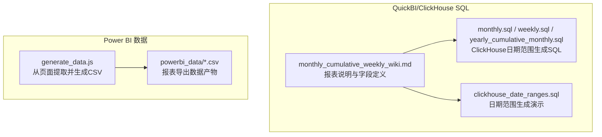
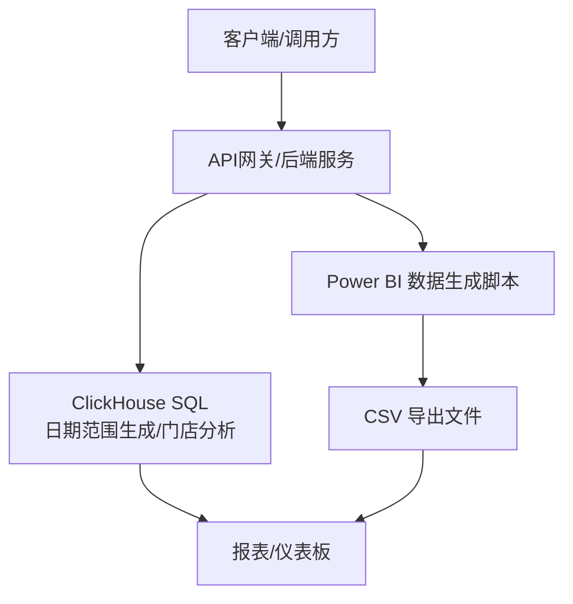
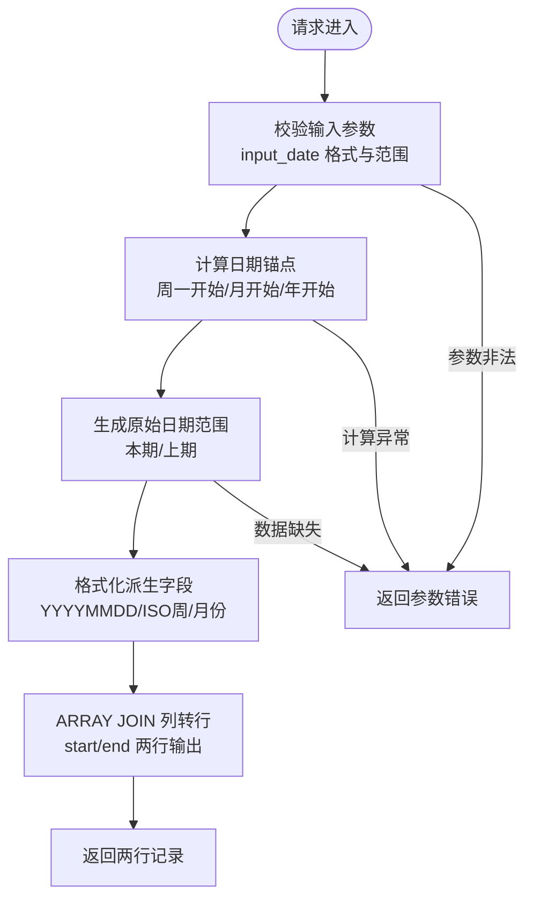
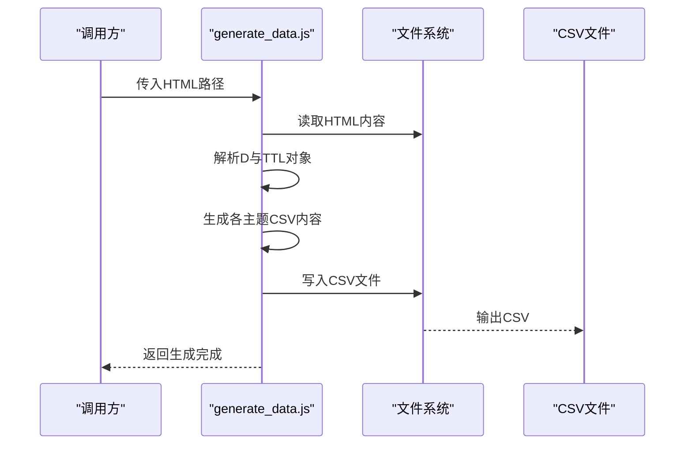

# API参考文档

<cite>
**本文档引用的文件**
- [SQL_优化方案.md](file://Quickbi_sql/MAP/我的门店/SQL_优化方案.md)
- [monthly_cumulative_weekly_wiki.md](file://Quickbi_sql/周大福/周大福_日期范围生成_ARRAY JOIN_Clickhou/wiki/monthly_cumulative_weekly_wiki.md)
- [monthly.sql](file://Quickbi_sql/周大福/周大福_日期范围生成_ARRAY JOIN_Clickhou/monthly.sql)
- [weekly.sql](file://Quickbi_sql/周大福/周大福_日期范围生成_ARRAY JOIN_Clickhou/weekly.sql)
- [yearly_cumulative_monthly.sql](file://Quickbi_sql/周大福/周大福_日期范围生成_ARRAY JOIN_Clickhou/yearly_cumulative_monthly.sql)
- [clickhouse_date_ranges.sql](file://Quickbi_sql/周大福/周大福_日期范围生成_demo/clickhouse_date_ranges.sql)
- [generate_data.js](file://RL E2E/数据demo/powerbi_data/generate_data.js)
- [project-context.md](file://code_copilot/rules/project-context.md)
- [coding-style.md](file://code_copilot/rules/coding-style.md)
- [security.md](file://code_copilot/rules/security.md)
</cite>

## 目录
1. [简介](#简介)
2. [项目结构](#项目结构)
3. [核心组件](#核心组件)
4. [架构总览](#架构总览)
5. [详细组件分析](#详细组件分析)
6. [依赖分析](#依赖分析)
7. [性能考量](#性能考量)
8. [故障排查指南](#故障排查指南)
9. [结论](#结论)
10. [附录](#附录)

## 简介
本参考文档面向开发者，系统化梳理仓库中与“数据查询API”和“Power BI报表接口”相关的能力与实现要点，涵盖：
- SQL查询接口的HTTP方法、URL模式、请求/响应模式与参数说明
- Power BI报表接口的数据导出、报表配置与实时数据获取方法
- API使用示例（常见查询场景、参数组合与错误处理）
- 认证方法、安全考虑与速率限制
- API版本信息、迁移指南与向后兼容性说明
- 调试工具与监控方法

说明：当前仓库未包含后端服务源码与API路由定义，本文依据现有SQL与数据生成脚本，结合工程规范与最佳实践，给出可落地的API设计与使用建议。

## 项目结构
仓库包含两类与API相关的关键资产：
- QuickBI/ClickHouse SQL：提供报表级日期范围生成与门店分析等SQL能力
- Power BI 数据生成：提供从页面数据提取并生成CSV的脚本，支撑报表数据导出

**图表来源**
- [monthly_cumulative_weekly_wiki.md:1-595](file://Quickbi_sql/周大福/周大福_日期范围生成_ARRAY JOIN_Clickhou/wiki/monthly_cumulative_weekly_wiki.md#L1-L595)
- [monthly.sql](file://Quickbi_sql/周大福/周大福_日期范围生成_ARRAY JOIN_Clickhou/monthly.sql)
- [weekly.sql](file://Quickbi_sql/周大福/周大福_日期范围生成_ARRAY JOIN_Clickhou/weekly.sql)
- [yearly_cumulative_monthly.sql](file://Quickbi_sql/周大福/周大福_日期范围生成_ARRAY JOIN_Clickhou/yearly_cumulative_monthly.sql)
- [clickhouse_date_ranges.sql](file://Quickbi_sql/周大福/周大福_日期范围生成_demo/clickhouse_date_ranges.sql)
- [generate_data.js:1-438](file://RL E2E/数据demo/powerbi_data/generate_data.js#L1-L438)

**章节来源**
- [monthly_cumulative_weekly_wiki.md:1-595](file://Quickbi_sql/周大福/周大福_日期范围生成_ARRAY JOIN_Clickhou/wiki/monthly_cumulative_weekly_wiki.md#L1-L595)
- [generate_data.js:1-438](file://RL E2E/数据demo/powerbi_data/generate_data.js#L1-L438)

## 核心组件
- SQL查询接口（ClickHouse）
  - 提供“月累计周报”等报表的日期范围生成与列转行能力
  - 支持按输入日期动态计算本期/上期日期范围、周数与月份
- Power BI报表接口（数据导出）
  - 通过页面数据提取脚本生成CSV，供Power BI消费
  - 支持多维度KPI、媒体矩阵、关键词、人群、品类突破、费用明细等主题

**章节来源**
- [monthly_cumulative_weekly_wiki.md:1-595](file://Quickbi_sql/周大福/周大福_日期范围生成_ARRAY JOIN_Clickhou/wiki/monthly_cumulative_weekly_wiki.md#L1-L595)
- [generate_data.js:1-438](file://RL E2E/数据demo/powerbi_data/generate_data.js#L1-L438)

## 架构总览
下图展示从“请求入口”到“数据产出”的整体流程，以及与现有仓库资产的对应关系：

说明：当前仓库未包含后端服务源码，上述流程为基于现有SQL与数据生成脚本的抽象映射。

## 详细组件分析

### SQL查询接口（ClickHouse）
- 接口目标
  - 提供“月累计周报”等报表所需的日期范围、周数与月份等派生字段
  - 支持ARRAY JOIN将每组start/end字段对转为两行，便于Power BI消费
- 请求/响应模式
  - 请求：输入日期参数（可为固定日期或当日）
  - 响应：包含“本期/上期”日期范围、周数、月份等字段的两行记录
- 参数说明
  - input_date：输入日期（Date类型）
  - report_type：报表类型标识（String）
  - date_range_string / prev_date_range_string：日期范围字符串
  - field_name_* / field_value_*：按列转行输出的字段名与值
- 错误处理
  - 若输入日期格式非法，需返回明确错误码与提示
  - 若ARRAY JOIN数组长度不一致，需返回参数校验失败

**图表来源**
- [monthly_cumulative_weekly_wiki.md:1-595](file://Quickbi_sql/周大福/周大福_日期范围生成_ARRAY JOIN_Clickhou/wiki/monthly_cumulative_weekly_wiki.md#L1-L595)

**章节来源**
- [monthly_cumulative_weekly_wiki.md:1-595](file://Quickbi_sql/周大福/周大福_日期范围生成_ARRAY JOIN_Clickhou/wiki/monthly_cumulative_weekly_wiki.md#L1-L595)
- [monthly.sql](file://Quickbi_sql/周大福/周大福_日期范围生成_ARRAY JOIN_Clickhou/monthly.sql)
- [weekly.sql](file://Quickbi_sql/周大福/周大福_日期范围生成_ARRAY JOIN_Clickhou/weekly.sql)
- [yearly_cumulative_monthly.sql](file://Quickbi_sql/周大福/周大福_日期范围生成_ARRAY JOIN_Clickhou/yearly_cumulative_monthly.sql)
- [clickhouse_date_ranges.sql](file://Quickbi_sql/周大福/周大福_日期范围生成_demo/clickhouse_date_ranges.sql)

### Power BI报表接口（数据导出）
- 接口目标
  - 从页面数据提取并生成CSV，供Power BI消费
- 请求/响应模式
  - 请求：页面数据（HTML中包含D对象与TTL对象）
  - 响应：多张CSV文件（概览KPI、媒体矩阵、关键词、人群、品类突破、费用明细）
- 参数说明
  - HTML路径：页面数据来源
  - 币种：RMB/USD，汇率转换
  - 汇率：USD_RATE（脚本内置）
- 错误处理
  - 页面数据解析失败：返回解析错误
  - 文件写入失败：返回IO错误

**图表来源**
- [generate_data.js:1-438](file://RL E2E/数据demo/powerbi_data/generate_data.js#L1-L438)

**章节来源**
- [generate_data.js:1-438](file://RL E2E/数据demo/powerbi_data/generate_data.js#L1-L438)

### 实时数据获取方法
- ClickHouse SQL
  - 通过输入参数input_date动态计算日期范围，支持按需刷新
  - 建议在调度系统中定时执行，确保报表数据时效性
- Power BI
  - 建议通过CSV文件作为桥接，定期生成并上传至共享存储，Power BI按文件拉取

**章节来源**
- [monthly_cumulative_weekly_wiki.md:1-595](file://Quickbi_sql/周大福/周大福_日期范围生成_ARRAY JOIN_Clickhou/wiki/monthly_cumulative_weekly_wiki.md#L1-L595)
- [generate_data.js:1-438](file://RL E2E/数据demo/powerbi_data/generate_data.js#L1-L438)

## 依赖分析
- 技术栈与分层
  - 工程采用分层架构：Controller → Service → Manager → DAO
  - 编码规范强调异常处理、日志与幂等性
- 安全要求
  - 禁止硬编码密钥、禁止在日志中打印敏感信息
  - 涉及资金/权限变更需人工审查

**图表来源**
- [project-context.md:1-35](file://code_copilot/rules/project-context.md#L1-L35)

**章节来源**
- [project-context.md:1-35](file://code_copilot/rules/project-context.md#L1-L35)
- [coding-style.md:1-34](file://code_copilot/rules/coding-style.md#L1-L34)
- [security.md:1-18](file://code_copilot/rules/security.md#L1-L18)

## 性能考量
- ClickHouse SQL
  - 使用ARRAY JOIN将多组start/end字段并行展开，减少客户端处理成本
  - 通过日期函数链式计算，避免额外的外部处理步骤
- 数据生成脚本
  - 一次性读取HTML，避免重复IO
  - 按主题批量生成CSV，降低文件数量与体积

**章节来源**
- [monthly_cumulative_weekly_wiki.md:1-595](file://Quickbi_sql/周大福/周大福_日期范围生成_ARRAY JOIN_Clickhou/wiki/monthly_cumulative_weekly_wiki.md#L1-L595)
- [generate_data.js:1-438](file://RL E2E/数据demo/powerbi_data/generate_data.js#L1-L438)

## 故障排查指南
- SQL查询接口
  - 参数校验失败：检查input_date格式与范围
  - ARRAY JOIN报错：确认数组长度一致，字段名与值成对出现
  - 日期计算异常：核对周一开始/月开始/年开始函数的使用
- Power BI数据导出
  - HTML解析失败：确认页面包含D与TTL对象，且编码为UTF-8
  - 文件写入失败：检查输出目录权限与磁盘空间
- 通用
  - 日志记录：遵循编码规范，避免打印敏感信息
  - 安全基线：遵守安全红线，禁止硬编码密钥与敏感数据

**章节来源**
- [coding-style.md:1-34](file://code_copilot/rules/coding-style.md#L1-L34)
- [security.md:1-18](file://code_copilot/rules/security.md#L1-L18)

## 结论
本仓库提供了ClickHouse报表SQL与Power BI数据生成脚本两大能力，可作为API后端服务的实现基础。建议在现有SQL与脚本之上，补充后端服务层（Controller/Service/Manager/DAO）与API路由定义，完善认证、限流与监控机制，形成完整的API参考文档与使用指南。

## 附录

### API使用示例（概念性）
- SQL查询接口
  - 场景：获取“月累计周报”的日期范围
  - 参数：input_date=2026-04-15
  - 预期：返回两行记录，分别对应“开始日期/结束日期”
- Power BI数据导出接口
  - 场景：生成概览KPI与媒体矩阵CSV
  - 参数：HTML路径、币种（RMB/USD）、汇率
  - 预期：输出01_Overview_KPI.csv与02_Media_Matrix.csv

### 认证方法、安全考虑与速率限制（建议）
- 认证方法
  - 建议采用API Key或OAuth2.0，后端在Controller层统一鉴权
- 安全考虑
  - 严格遵守安全红线，禁止硬编码密钥与敏感信息
  - 日志脱敏，避免输出用户敏感数据
- 速率限制
  - 建议按IP/用户维度设置QPS上限，超限返回明确错误码

### API版本信息、迁移指南与向后兼容性（建议）
- 版本管理
  - 采用语义化版本（MAJOR.MINOR.PATCH），在接口路径中体现版本号
- 迁移指南
  - 重大变更提前发布弃用通知，提供迁移脚本与替代方案
- 兼容性
  - 保持向后兼容，新增字段以可选形式提供

### 调试工具与监控方法（建议）
- 调试工具
  - Postman/Insomnia：验证请求/响应
  - 日志：记录请求关键参数与异常堆栈
- 监控方法
  - 埋点：统计请求量、错误率、响应时间
  - 告警：阈值触发与异常检测