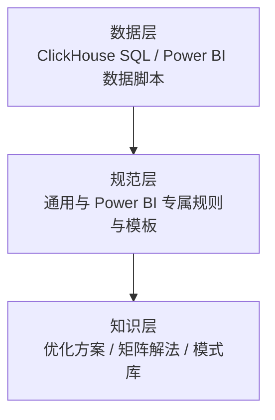
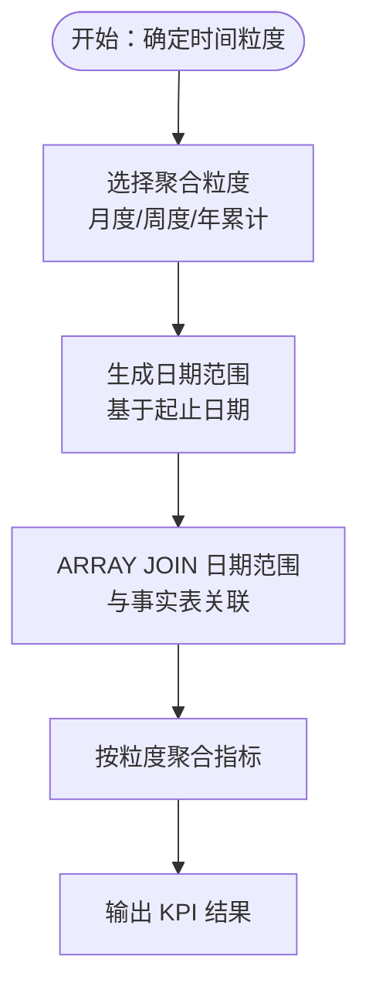
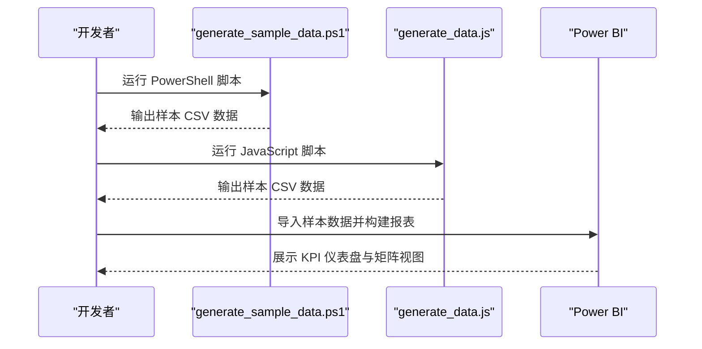
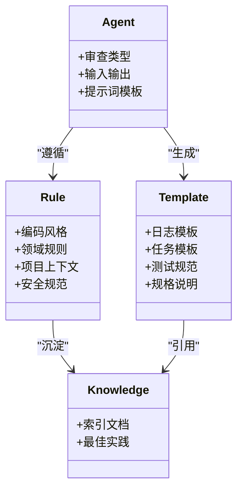
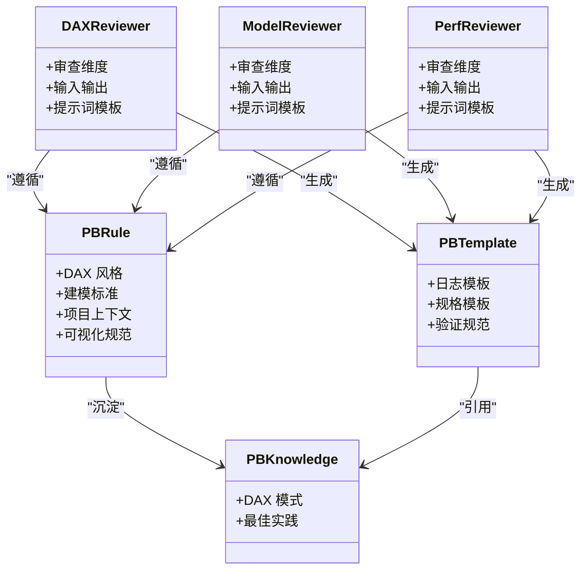
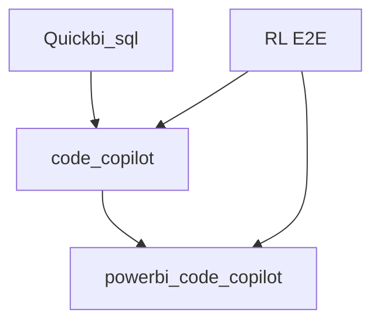

# 开发者指南

<cite>
**本文引用的文件**
- [SQL_优化方案.md](file://Quickbi_sql/MAP/我的门店/SQL_优化方案.md)
- [monthly_cumulative_weekly_wiki.md](file://Quickbi_sql/周大福/周大福_日期范围生成_ARRAY JOIN_Clickhou/wiki/monthly_cumulative_weekly_wiki.md)
- [clickhouse_date_ranges_wiki.md](file://Quickbi_sql/周大福/周大福_日期范围生成/demo/clickhouse_date_ranges_wiki.md)
- [monthly.sql](file://Quickbi_sql/周大福/周大福_日期范围生成_ARRAY JOIN_Clickhou/monthly.sql)
- [monthly_cumulative_weekly.sql](file://Quickbi_sql/周大福/周大福_日期范围生成_ARRAY JOIN_Clickhou/monthly_cumulative_weekly.sql)
- [weekly.sql](file://Quickbi_sql/周大福/周大福_日期范围生成_ARRAY JOIN_Clickhou/weekly.sql)
- [yearly_cumulative_monthly.sql](file://Quickbi_sql/周大福/周大福_日期范围生成_ARRAY JOIN_Clickhou/yearly_cumulative_monthly.sql)
- [clickhouse_date_ranges.sql](file://Quickbi_sql/周大福/周大福_日期范围生成/demo/clickhouse_date_ranges.sql)
- [kpi_breakdown_matrix_solution.md](file://RL E2E/RL E2E Traffic_Dashboard/KPI Breakdown/kpi_breakdown_matrix_solution.md)
- [KPI By Platform_matrix_solution.md](file://RL E2E/RL E2E Traffic_Dashboard/KPI By Platform/KPI By Platform_matrix_solution.md)
- [KPIs_TimeFrame_solution.md](file://RL E2E/RL E2E Traffic_Dashboard/kPIs/KPIs_TimeFrame_solution.md)
- [changelog.md](file://RL E2E/RL E2E Traffic_Operation/changelog.md)
- [generate_sample_data.ps1](file://RL E2E/数据demo/powerbi_data/powerbi_traffic/generate_sample_data.ps1)
- [generate_data.js](file://RL E2E/数据demo/powerbi_data/generate_data.js)
- [code-quality-reviewer.md](file://code_copilot/agents/code-quality-reviewer.md)
- [spec-reviewer.md](file://code_copilot/agents/spec-reviewer.md)
- [copilot-prompt.md](file://code_copilot/agents/copilot-prompt.md)
- [log.md](file://code_copilot/changes/templates/log.md)
- [tasks.md](file://code_copilot/changes/templates/tasks.md)
- [test-spec.md](file://code_copilot/changes/templates/test-spec.md)
- [index.md](file://code_copilot/knowledge/index.md)
- [coding-style.md](file://code_copilot/rules/coding-style.md)
- [domain-rules.md](file://code_copilot/rules/domain-rules.md)
- [project-context.md](file://code_copilot/rules/project-context.md)
- [security.md](file://code_copilot/rules/security.md)
- [dax-reviewer.md](file://powerbi_code_copilot/agents/dax-reviewer.md)
- [model-reviewer.md](file://powerbi_code_copilot/agents/model-reviewer.md)
- [performance-reviewer.md](file://powerbi_code_copilot/agents/performance-reviewer.md)
- [copilot-prompt.md](file://powerbi_code_copilot/agents/copilot-prompt.md)
- [log.md](file://powerbi_code_copilot/changes/templates/log.md)
- [spec.md](file://powerbi_code_copilot/changes/templates/spec.md)
- [validation-spec.md](file://powerbi_code_copilot/changes/templates/validation-spec.md)
- [dax-patterns.md](file://powerbi_code_copilot/knowledge/dax-patterns.md)
- [dax-style.md](file://powerbi_code_copilot/rules/dax-style.md)
- [modeling-standards.md](file://powerbi_code_copilot/rules/modeling-standards.md)
- [project-context.md](file://powerbi_code_copilot/rules/project-context.md)
- [visualization-standards.md](file://powerbi_code_copilot/rules/visualization-standards.md)
</cite>

## 目录
1. [简介](#简介)
2. [项目结构](#项目结构)
3. [核心组件](#核心组件)
4. [架构总览](#架构总览)
5. [详细组件分析](#详细组件分析)
6. [依赖关系分析](#依赖关系分析)
7. [性能考虑](#性能考虑)
8. [故障排除指南](#故障排除指南)
9. [结论](#结论)
10. [附录](#附录)

## 简介
本指南面向开发者，帮助您快速理解与参与本项目的开发工作。内容涵盖开发环境搭建、依赖安装、配置文件设置、开发工具使用、代码贡献与评审流程、测试与文档规范、部署与运维最佳实践、API参考与故障排除等。项目包含三类主要资产：ClickHouse SQL 优化与模板、Power BI 模型与 DAX 规范，以及代码质量与变更模板体系。

## 项目结构
仓库采用按主题与功能域划分的目录组织方式：
- Quickbi_sql：ClickHouse SQL 优化与示例，包含“我的门店”优化方案与“周大福”日期范围生成的多粒度 SQL 模板及 Wiki 说明。
- RL E2E：端到端流量仪表盘与运营分析，包含 KPI 解析矩阵、时间框架解决方案、样例数据生成脚本与变更日志。
- code_copilot：通用代码质量与规范模板（编码风格、领域规则、项目上下文、安全规范），以及变更模板与知识库。
- powerbi_code_copilot：Power BI 专属模板（DAX 审查、建模标准、可视化规范、性能审查）与变更模板、知识库。

```mermaid
graph TB
root["项目根目录"]
quickbi["Quickbi_sql<br/>ClickHouse SQL 优化与模板"]
rle2e["RL E2E<br/>仪表盘与运营分析"]
copilot["code_copilot<br/>通用代码规范与模板"]
pb_copilot["powerbi_code_copilot<br/>Power BI 规范与模板"]
root --> quickbi
root --> rle2e
root --> copilot
root --> pb_copilot
quickbi --> qmystore["我的门店<br/>SQL 优化方案"]
quickbi --> zf["周大福<br/>日期范围生成与多粒度 SQL"]
rle2e --> dash["RL E2E Traffic_Dashboard<br/>KPI 解析矩阵与时间框架"]
rle2e --> ops["RL E2E Traffic_Operation<br/>变更日志与样例数据"]
rle2e --> demo["数据demo<br/>generate_data.js 与 generate_sample_data.ps1"]
copilot --> agents["agents<br/>code-quality-reviewer / spec-reviewer / copilot-prompt"]
copilot --> rules["rules<br/>coding-style / domain-rules / project-context / security"]
copilot --> changes["changes/templates<br/>log / tasks / test-spec / spec"]
copilot --> knowledge["knowledge<br/>index"]
pb_copilot --> p_agents["agents<br/>dax-reviewer / model-reviewer / performance-reviewer / copilot-prompt"]
pb_copilot --> p_rules["rules<br/>dax-style / modeling-standards / project-context / visualization-standards"]
pb_copilot --> p_changes["changes/templates<br/>log / spec / validation-spec"]
pb_copilot --> p_knowledge["knowledge<br/>dax-patterns"]
```

**图表来源**
- [SQL_优化方案.md](file://Quickbi_sql/MAP/我的门店/SQL_优化方案.md)
- [monthly_cumulative_weekly_wiki.md](file://Quickbi_sql/周大福/周大福_日期范围生成_ARRAY JOIN_Clickhou/wiki/monthly_cumulative_weekly_wiki.md)
- [kpi_breakdown_matrix_solution.md](file://RL E2E/RL E2E Traffic_Dashboard/KPI Breakdown/kpi_breakdown_matrix_solution.md)
- [KPI By Platform_matrix_solution.md](file://RL E2E/RL E2E Traffic_Dashboard/KPI By Platform/KPI By Platform_matrix_solution.md)
- [KPIs_TimeFrame_solution.md](file://RL E2E/RL E2E Traffic_Dashboard/kPIs/KPIs_TimeFrame_solution.md)
- [changelog.md](file://RL E2E/RL E2E Traffic_Operation/changelog.md)
- [generate_sample_data.ps1](file://RL E2E/数据demo/powerbi_data/powerbi_traffic/generate_sample_data.ps1)
- [generate_data.js](file://RL E2E/数据demo/powerbi_data/generate_data.js)
- [code-quality-reviewer.md](file://code_copilot/agents/code-quality-reviewer.md)
- [spec-reviewer.md](file://code_copilot/agents/spec-reviewer.md)
- [copilot-prompt.md](file://code_copilot/agents/copilot-prompt.md)
- [log.md](file://code_copilot/changes/templates/log.md)
- [tasks.md](file://code_copilot/changes/templates/tasks.md)
- [test-spec.md](file://code_copilot/changes/templates/test-spec.md)
- [index.md](file://code_copilot/knowledge/index.md)
- [coding-style.md](file://code_copilot/rules/coding-style.md)
- [domain-rules.md](file://code_copilot/rules/domain-rules.md)
- [project-context.md](file://code_copilot/rules/project-context.md)
- [security.md](file://code_copilot/rules/security.md)
- [dax-reviewer.md](file://powerbi_code_copilot/agents/dax-reviewer.md)
- [model-reviewer.md](file://powerbi_code_copilot/agents/model-reviewer.md)
- [performance-reviewer.md](file://powerbi_code_copilot/agents/performance-reviewer.md)
- [copilot-prompt.md](file://powerbi_code_copilot/agents/copilot-prompt.md)
- [log.md](file://powerbi_code_copilot/changes/templates/log.md)
- [spec.md](file://powerbi_code_copilot/changes/templates/spec.md)
- [validation-spec.md](file://powerbi_code_copilot/changes/templates/validation-spec.md)
- [dax-patterns.md](file://powerbi_code_copilot/knowledge/dax-patterns.md)

**章节来源**
- [SQL_优化方案.md](file://Quickbi_sql/MAP/我的门店/SQL_优化方案.md)
- [monthly_cumulative_weekly_wiki.md](file://Quickbi_sql/周大福/周大福_日期范围生成_ARRAY JOIN_Clickhou/wiki/monthly_cumulative_weekly_wiki.md)
- [kpi_breakdown_matrix_solution.md](file://RL E2E/RL E2E Traffic_Dashboard/KPI Breakdown/kpi_breakdown_matrix_solution.md)
- [KPI By Platform_matrix_solution.md](file://RL E2E/RL E2E Traffic_Dashboard/KPI By Platform/KPI By Platform_matrix_solution.md)
- [KPIs_TimeFrame_solution.md](file://RL E2E/RL E2E Traffic_Dashboard/kPIs/KPIs_TimeFrame_solution.md)
- [changelog.md](file://RL E2E/RL E2E Traffic_Operation/changelog.md)
- [generate_sample_data.ps1](file://RL E2E/数据demo/powerbi_data/powerbi_traffic/generate_sample_data.ps1)
- [generate_data.js](file://RL E2E/数据demo/powerbi_data/generate_data.js)
- [code-quality-reviewer.md](file://code_copilot/agents/code-quality-reviewer.md)
- [spec-reviewer.md](file://code_copilot/agents/spec-reviewer.md)
- [copilot-prompt.md](file://code_copilot/agents/copilot-prompt.md)
- [log.md](file://code_copilot/changes/templates/log.md)
- [tasks.md](file://code_copilot/changes/templates/tasks.md)
- [test-spec.md](file://code_copilot/changes/templates/test-spec.md)
- [index.md](file://code_copilot/knowledge/index.md)
- [coding-style.md](file://code_copilot/rules/coding-style.md)
- [domain-rules.md](file://code_copilot/rules/domain-rules.md)
- [project-context.md](file://code_copilot/rules/project-context.md)
- [security.md](file://code_copilot/rules/security.md)
- [dax-reviewer.md](file://powerbi_code_copilot/agents/dax-reviewer.md)
- [model-reviewer.md](file://powerbi_code_copilot/agents/model-reviewer.md)
- [performance-reviewer.md](file://powerbi_code_copilot/agents/performance-reviewer.md)
- [copilot-prompt.md](file://powerbi_code_copilot/agents/copilot-prompt.md)
- [log.md](file://powerbi_code_copilot/changes/templates/log.md)
- [spec.md](file://powerbi_code_copilot/changes/templates/spec.md)
- [validation-spec.md](file://powerbi_code_copilot/changes/templates/validation-spec.md)
- [dax-patterns.md](file://powerbi_code_copilot/knowledge/dax-patterns.md)

## 核心组件
- ClickHouse SQL 优化与模板
  - “我的门店”SQL 优化方案：提供针对特定业务场景的查询优化策略与实现建议。
  - “周大福”日期范围生成与多粒度 SQL：包含月度、周度、年累计等不同聚合层级的 SQL 模板与说明文档。
- RL E2E 仪表盘与运营分析
  - KPI 解析矩阵与时间框架：提供 KPI 计算与时间维度处理的解决方案。
  - 变更日志：记录迭代与变更信息，便于追溯与协作。
  - 样例数据生成：提供 PowerShell 与 JavaScript 脚本，用于生成 Power BI 所需的演示数据。
- 代码质量与规范模板（code_copilot）
  - 代理（Agents）：代码质量审查、需求规格审查、提示词模板。
  - 规则（Rules）：编码风格、领域规则、项目上下文、安全规范。
  - 变更模板（Changes/Templates）：日志、任务、测试规范、规格说明。
  - 知识库（Knowledge）：索引文档，沉淀经验与最佳实践。
- Power BI 专属模板（powerbi_code_copilot）
  - 代理（Agents）：DAX 审查、模型审查、性能审查、提示词模板。
  - 规则（Rules）：DAX 风格、建模标准、项目上下文、可视化规范。
  - 变更模板（Changes/Templates）：日志、规格、验证规范。
  - 知识库（Knowledge）：DAX 模式与最佳实践。

**章节来源**
- [SQL_优化方案.md](file://Quickbi_sql/MAP/我的门店/SQL_优化方案.md)
- [monthly.sql](file://Quickbi_sql/周大福/周大福_日期范围生成_ARRAY JOIN_Clickhou/monthly.sql)
- [weekly.sql](file://Quickbi_sql/周大福/周大福_日期范围生成_ARRAY JOIN_Clickhou/weekly.sql)
- [monthly_cumulative_weekly.sql](file://Quickbi_sql/周大福/周大福_日期范围生成_ARRAY JOIN_Clickhou/monthly_cumulative_weekly.sql)
- [yearly_cumulative_monthly.sql](file://Quickbi_sql/周大福/周大福_日期范围生成_ARRAY JOIN_Clickhou/yearly_cumulative_monthly.sql)
- [kpi_breakdown_matrix_solution.md](file://RL E2E/RL E2E Traffic_Dashboard/KPI Breakdown/kpi_breakdown_matrix_solution.md)
- [KPI By Platform_matrix_solution.md](file://RL E2E/RL E2E Traffic_Dashboard/KPI By Platform/KPI By Platform_matrix_solution.md)
- [KPIs_TimeFrame_solution.md](file://RL E2E/RL E2E Traffic_Dashboard/kPIs/KPIs_TimeFrame_solution.md)
- [changelog.md](file://RL E2E/RL E2E Traffic_Operation/changelog.md)
- [generate_sample_data.ps1](file://RL E2E/数据demo/powerbi_data/powerbi_traffic/generate_sample_data.ps1)
- [generate_data.js](file://RL E2E/数据demo/powerbi_data/generate_data.js)
- [code-quality-reviewer.md](file://code_copilot/agents/code-quality-reviewer.md)
- [spec-reviewer.md](file://code_copilot/agents/spec-reviewer.md)
- [copilot-prompt.md](file://code_copilot/agents/copilot-prompt.md)
- [log.md](file://code_copilot/changes/templates/log.md)
- [tasks.md](file://code_copilot/changes/templates/tasks.md)
- [test-spec.md](file://code_copilot/changes/templates/test-spec.md)
- [index.md](file://code_copilot/knowledge/index.md)
- [coding-style.md](file://code_copilot/rules/coding-style.md)
- [domain-rules.md](file://code_copilot/rules/domain-rules.md)
- [project-context.md](file://code_copilot/rules/project-context.md)
- [security.md](file://code_copilot/rules/security.md)
- [dax-reviewer.md](file://powerbi_code_copilot/agents/dax-reviewer.md)
- [model-reviewer.md](file://powerbi_code_copilot/agents/model-reviewer.md)
- [performance-reviewer.md](file://powerbi_code_copilot/agents/performance-reviewer.md)
- [copilot-prompt.md](file://powerbi_code_copilot/agents/copilot-prompt.md)
- [log.md](file://powerbi_code_copilot/changes/templates/log.md)
- [spec.md](file://powerbi_code_copilot/changes/templates/spec.md)
- [validation-spec.md](file://powerbi_code_copilot/changes/templates/validation-spec.md)
- [dax-patterns.md](file://powerbi_code_copilot/knowledge/dax-patterns.md)

## 架构总览
本项目以“主题域 + 模板化规范”的方式组织，形成三层能力：
- 数据层：ClickHouse SQL 与 Power BI 数据生成脚本，支撑报表与分析。
- 规范层：通用与 Power BI 专属的代码规范、审查与变更模板，确保一致性与可维护性。
- 知识层：优化方案、矩阵解法、模式库，沉淀最佳实践。

[此图为概念性架构示意，不直接映射具体源码文件，故无图表来源]

## 详细组件分析

### ClickHouse SQL 组件分析
- “我的门店”SQL 优化方案：聚焦于特定业务表的查询路径优化，建议从索引设计、分区裁剪、聚合预计算等方面入手，减少扫描范围与中间结果集大小。
- “周大福”日期范围生成与多粒度 SQL：
  - 月度/周度/年累计等多粒度聚合模板，适合不同时间维度的 KPI 计算。
  - Wiki 文档提供实现思路与注意事项，便于复用与演进。
- 示例 SQL 文件：提供可直接参考的实现模板，便于快速落地。

**图表来源**
- [monthly_cumulative_weekly_wiki.md](file://Quickbi_sql/周大福/周大福_日期范围生成_ARRAY JOIN_Clickhou/wiki/monthly_cumulative_weekly_wiki.md)
- [monthly.sql](file://Quickbi_sql/周大福/周大福_日期范围生成_ARRAY JOIN_Clickhou/monthly.sql)
- [weekly.sql](file://Quickbi_sql/周大福/周大福_日期范围生成_ARRAY JOIN_Clickhou/weekly.sql)
- [monthly_cumulative_weekly.sql](file://Quickbi_sql/周大福/周大福_日期范围生成_ARRAY JOIN_Clickhou/monthly_cumulative_weekly.sql)
- [yearly_cumulative_monthly.sql](file://Quickbi_sql/周大福/周大福_日期范围生成_ARRAY JOIN_Clickhou/yearly_cumulative_monthly.sql)

**章节来源**
- [SQL_优化方案.md](file://Quickbi_sql/MAP/我的门店/SQL_优化方案.md)
- [monthly_cumulative_weekly_wiki.md](file://Quickbi_sql/周大福/周大福_日期范围生成_ARRAY JOIN_Clickhou/wiki/monthly_cumulative_weekly_wiki.md)
- [monthly.sql](file://Quickbi_sql/周大福/周大福_日期范围生成_ARRAY JOIN_Clickhou/monthly.sql)
- [weekly.sql](file://Quickbi_sql/周大福/周大福_日期范围生成_ARRAY JOIN_Clickhou/weekly.sql)
- [monthly_cumulative_weekly.sql](file://Quickbi_sql/周大福/周大福_日期范围生成_ARRAY JOIN_Clickhou/monthly_cumulative_weekly.sql)
- [yearly_cumulative_monthly.sql](file://Quickbi_sql/周大福/周大福_日期范围生成_ARRAY JOIN_Clickhou/yearly_cumulative_monthly.sql)

### RL E2E 仪表盘与运营分析组件
- KPI 解析矩阵与时间框架：提供 KPI 计算的矩阵化思路与时间维度处理方案，便于跨平台、跨品类的对比与归因。
- 变更日志：记录每次迭代的改动点，便于回溯与协作评审。
- 样例数据生成：
  - PowerShell 脚本：生成 Power BI 交通类数据的样本。
  - JavaScript 脚本：生成通用演示数据，支持快速验证与演示。

**图表来源**
- [generate_sample_data.ps1](file://RL E2E/数据demo/powerbi_data/powerbi_traffic/generate_sample_data.ps1)
- [generate_data.js](file://RL E2E/数据demo/powerbi_data/generate_data.js)
- [kpi_breakdown_matrix_solution.md](file://RL E2E/RL E2E Traffic_Dashboard/KPI Breakdown/kpi_breakdown_matrix_solution.md)
- [KPI By Platform_matrix_solution.md](file://RL E2E/RL E2E Traffic_Dashboard/KPI By Platform/KPI By Platform_matrix_solution.md)
- [KPIs_TimeFrame_solution.md](file://RL E2E/RL E2E Traffic_Dashboard/kPIs/KPIs_TimeFrame_solution.md)

**章节来源**
- [kpi_breakdown_matrix_solution.md](file://RL E2E/RL E2E Traffic_Dashboard/KPI Breakdown/kpi_breakdown_matrix_solution.md)
- [KPI By Platform_matrix_solution.md](file://RL E2E/RL E2E Traffic_Dashboard/KPI By Platform/KPI By Platform_matrix_solution.md)
- [KPIs_TimeFrame_solution.md](file://RL E2E/RL E2E Traffic_Dashboard/kPIs/KPIs_TimeFrame_solution.md)
- [changelog.md](file://RL E2E/RL E2E Traffic_Operation/changelog.md)
- [generate_sample_data.ps1](file://RL E2E/数据demo/powerbi_data/powerbi_traffic/generate_sample_data.ps1)
- [generate_data.js](file://RL E2E/数据demo/powerbi_data/generate_data.js)

### 代码质量与规范模板（code_copilot）
- 代理（Agents）：定义代码质量审查、需求规格审查与提示词模板，统一评审视角与沟通语言。
- 规则（Rules）：编码风格、领域规则、项目上下文、安全规范，作为团队共识与基线。
- 变更模板（Changes/Templates）：标准化变更记录、任务拆分、测试规范与规格说明，提升交付质量与可追溯性。
- 知识库（Knowledge）：沉淀经验与最佳实践，降低重复劳动与认知负担。

**图表来源**
- [code-quality-reviewer.md](file://code_copilot/agents/code-quality-reviewer.md)
- [spec-reviewer.md](file://code_copilot/agents/spec-reviewer.md)
- [copilot-prompt.md](file://code_copilot/agents/copilot-prompt.md)
- [coding-style.md](file://code_copilot/rules/coding-style.md)
- [domain-rules.md](file://code_copilot/rules/domain-rules.md)
- [project-context.md](file://code_copilot/rules/project-context.md)
- [security.md](file://code_copilot/rules/security.md)
- [log.md](file://code_copilot/changes/templates/log.md)
- [tasks.md](file://code_copilot/changes/templates/tasks.md)
- [test-spec.md](file://code_copilot/changes/templates/test-spec.md)
- [index.md](file://code_copilot/knowledge/index.md)

**章节来源**
- [code-quality-reviewer.md](file://code_copilot/agents/code-quality-reviewer.md)
- [spec-reviewer.md](file://code_copilot/agents/spec-reviewer.md)
- [copilot-prompt.md](file://code_copilot/agents/copilot-prompt.md)
- [coding-style.md](file://code_copilot/rules/coding-style.md)
- [domain-rules.md](file://code_copilot/rules/domain-rules.md)
- [project-context.md](file://code_copilot/rules/project-context.md)
- [security.md](file://code_copilot/rules/security.md)
- [log.md](file://code_copilot/changes/templates/log.md)
- [tasks.md](file://code_copilot/changes/templates/tasks.md)
- [test-spec.md](file://code_copilot/changes/templates/test-spec.md)
- [index.md](file://code_copilot/knowledge/index.md)

### Power BI 专属模板（powerbi_code_copilot）
- 代理（Agents）：DAX 审查、模型审查、性能审查与提示词模板，确保报表质量与运行效率。
- 规则（Rules）：DAX 风格、建模标准、项目上下文、可视化规范，统一建模与展示口径。
- 变更模板（Changes/Templates）：标准化变更日志、规格与验证规范，保障交付一致性。
- 知识库（Knowledge）：DAX 模式与最佳实践，加速学习与复用。

**图表来源**
- [dax-reviewer.md](file://powerbi_code_copilot/agents/dax-reviewer.md)
- [model-reviewer.md](file://powerbi_code_copilot/agents/model-reviewer.md)
- [performance-reviewer.md](file://powerbi_code_copilot/agents/performance-reviewer.md)
- [copilot-prompt.md](file://powerbi_code_copilot/agents/copilot-prompt.md)
- [dax-style.md](file://powerbi_code_copilot/rules/dax-style.md)
- [modeling-standards.md](file://powerbi_code_copilot/rules/modeling-standards.md)
- [project-context.md](file://powerbi_code_copilot/rules/project-context.md)
- [visualization-standards.md](file://powerbi_code_copilot/rules/visualization-standards.md)
- [log.md](file://powerbi_code_copilot/changes/templates/log.md)
- [spec.md](file://powerbi_code_copilot/changes/templates/spec.md)
- [validation-spec.md](file://powerbi_code_copilot/changes/templates/validation-spec.md)
- [dax-patterns.md](file://powerbi_code_copilot/knowledge/dax-patterns.md)

**章节来源**
- [dax-reviewer.md](file://powerbi_code_copilot/agents/dax-reviewer.md)
- [model-reviewer.md](file://powerbi_code_copilot/agents/model-reviewer.md)
- [performance-reviewer.md](file://powerbi_code_copilot/agents/performance-reviewer.md)
- [copilot-prompt.md](file://powerbi_code_copilot/agents/copilot-prompt.md)
- [dax-style.md](file://powerbi_code_copilot/rules/dax-style.md)
- [modeling-standards.md](file://powerbi_code_copilot/rules/modeling-standards.md)
- [project-context.md](file://powerbi_code_copilot/rules/project-context.md)
- [visualization-standards.md](file://powerbi_code_copilot/rules/visualization-standards.md)
- [log.md](file://powerbi_code_copilot/changes/templates/log.md)
- [spec.md](file://powerbi_code_copilot/changes/templates/spec.md)
- [validation-spec.md](file://powerbi_code_copilot/changes/templates/validation-spec.md)
- [dax-patterns.md](file://powerbi_code_copilot/knowledge/dax-patterns.md)

## 依赖关系分析
- 组件内聚与耦合
  - 各主题域（Quickbi_sql、RL E2E、code_copilot、powerbi_code_copilot）内部高内聚，彼此低耦合，便于独立演进与复用。
- 外部依赖与集成点
  - ClickHouse SQL 与 Power BI 数据脚本依赖于目标数据库与报表工具；规范模板依赖团队共识与工具链（如版本控制、评审系统）。
- 潜在循环依赖
  - 当前结构以文档与脚本为主，未见直接的循环依赖；但需注意模板与知识库之间的引用关系应保持单向，避免循环引用导致维护困难。

[此图为概念性依赖示意，不直接映射具体源码文件，故无图表来源]

**章节来源**
- [SQL_优化方案.md](file://Quickbi_sql/MAP/我的门店/SQL_优化方案.md)
- [monthly_cumulative_weekly_wiki.md](file://Quickbi_sql/周大福/周大福_日期范围生成_ARRAY JOIN_Clickhou/wiki/monthly_cumulative_weekly_wiki.md)
- [kpi_breakdown_matrix_solution.md](file://RL E2E/RL E2E Traffic_Dashboard/KPI Breakdown/kpi_breakdown_matrix_solution.md)
- [KPI By Platform_matrix_solution.md](file://RL E2E/RL E2E Traffic_Dashboard/KPI By Platform/KPI By Platform_matrix_solution.md)
- [KPIs_TimeFrame_solution.md](file://RL E2E/RL E2E Traffic_Dashboard/kPIs/KPIs_TimeFrame_solution.md)
- [changelog.md](file://RL E2E/RL E2E Traffic_Operation/changelog.md)
- [generate_sample_data.ps1](file://RL E2E/数据demo/powerbi_data/powerbi_traffic/generate_sample_data.ps1)
- [generate_data.js](file://RL E2E/数据demo/powerbi_data/generate_data.js)
- [code-quality-reviewer.md](file://code_copilot/agents/code-quality-reviewer.md)
- [spec-reviewer.md](file://code_copilot/agents/spec-reviewer.md)
- [copilot-prompt.md](file://code_copilot/agents/copilot-prompt.md)
- [dax-reviewer.md](file://powerbi_code_copilot/agents/dax-reviewer.md)
- [model-reviewer.md](file://powerbi_code_copilot/agents/model-reviewer.md)
- [performance-reviewer.md](file://powerbi_code_copilot/agents/performance-reviewer.md)
- [dax-patterns.md](file://powerbi_code_copilot/knowledge/dax-patterns.md)

## 性能考虑
- ClickHouse 查询优化
  - 使用分区与索引裁剪，减少扫描范围。
  - 将频繁聚合的指标进行预计算或物化视图，降低实时查询成本。
  - 在日期范围生成中，优先使用数组展开与 JOIN 的组合，避免复杂子查询。
- Power BI 报表性能
  - 控制维度基数与列数，避免过度聚合。
  - 使用 DAX 表达式时，优先选择高效聚合与过滤路径。
  - 利用模板化的矩阵与时间框架方案，减少重复计算与冗余逻辑。
- 数据生成与验证
  - 使用脚本生成样例数据，缩短验证周期；确保数据规模与分布符合预期。

[本节为通用性能建议，不直接分析具体文件，故无章节来源]

## 故障排除指南
- ClickHouse SQL 常见问题
  - 日期范围生成异常：检查起止日期边界与数组展开逻辑，确认与事实表的关联键一致。
  - 聚合结果不一致：核对粒度与过滤条件，确保预聚合与实时聚合口径一致。
- Power BI 报表问题
  - 指标偏差：对照矩阵解法与时间框架方案，逐项校验 DAX 表达式与筛选条件。
  - 性能下降：检查是否存在不必要的列加载与重复计算，参考 DAX 审查与性能审查模板。
- 变更与协作问题
  - 变更记录缺失：使用变更模板中的日志与任务模板，确保每次改动可追溯。
  - 规范执行不一致：依据编码风格与领域规则，统一评审与修改意见。

**章节来源**
- [monthly_cumulative_weekly_wiki.md](file://Quickbi_sql/周大福/周大福_日期范围生成_ARRAY JOIN_Clickhou/wiki/monthly_cumulative_weekly_wiki.md)
- [kpi_breakdown_matrix_solution.md](file://RL E2E/RL E2E Traffic_Dashboard/KPI Breakdown/kpi_breakdown_matrix_solution.md)
- [KPI By Platform_matrix_solution.md](file://RL E2E/RL E2E Traffic_Dashboard/KPI By Platform/KPI By Platform_matrix_solution.md)
- [KPIs_TimeFrame_solution.md](file://RL E2E/RL E2E Traffic_Dashboard/kPIs/KPIs_TimeFrame_solution.md)
- [log.md](file://code_copilot/changes/templates/log.md)
- [tasks.md](file://code_copilot/changes/templates/tasks.md)
- [test-spec.md](file://code_copilot/changes/templates/test-spec.md)
- [dax-style.md](file://powerbi_code_copilot/rules/dax-style.md)
- [modeling-standards.md](file://powerbi_code_copilot/rules/modeling-standards.md)
- [visualization-standards.md](file://powerbi_code_copilot/rules/visualization-standards.md)

## 结论
本指南围绕开发环境、贡献流程、规范模板与最佳实践，提供了从数据层到知识层的完整开发路径。建议团队在日常工作中：
- 严格遵循规范模板与变更流程，确保交付质量与可追溯性。
- 借助优化方案与矩阵解法，持续提升查询与报表性能。
- 通过知识库沉淀经验，降低学习成本与维护负担。

[本节为总结性内容，不直接分析具体文件，故无章节来源]

## 附录
- 开发环境搭建建议
  - 本地工具：文本编辑器、版本控制客户端、数据库客户端（用于 ClickHouse）、报表工具（用于 Power BI）。
  - 依赖安装：根据脚本与模板的运行需求，安装相应解释器（如 PowerShell、Node.js）。
  - 配置文件：在模板与规则中查找相关配置项，确保与本地环境一致。
- 代码贡献与评审流程
  - 提交前：使用变更模板生成日志与任务，完成自测与规范自查。
  - 提交流程：通过版本控制系统提交，附上变更说明与测试结果。
  - 评审流程：依据代理与规则进行评审，确保一致性与安全性。
- 测试与文档更新
  - 测试要求：覆盖关键路径与边界条件，参考测试规范模板。
  - 文档更新：同步更新 Wiki 与知识库，确保文档与实现一致。
- 部署与运维
  - 部署配置：依据 SQL 与脚本的运行环境准备数据库与报表工具。
  - 监控与性能：关注查询耗时与报表加载性能，定期回顾优化方案。
  - 故障排除：结合矩阵解法与审查模板定位问题，快速修复与回归验证。

[本节为通用操作建议，不直接分析具体文件，故无章节来源]