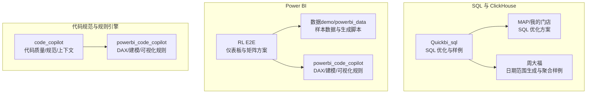
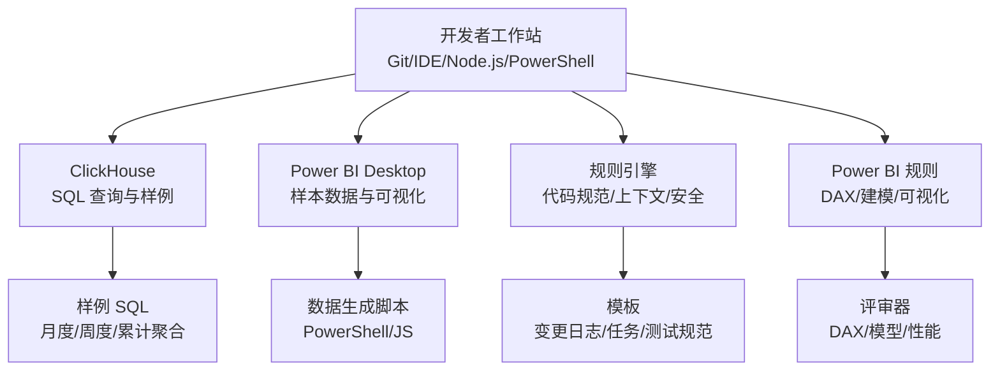
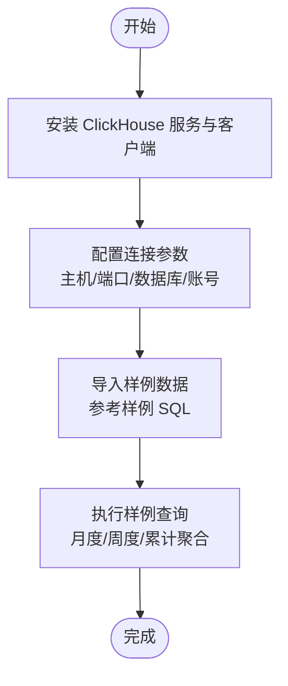
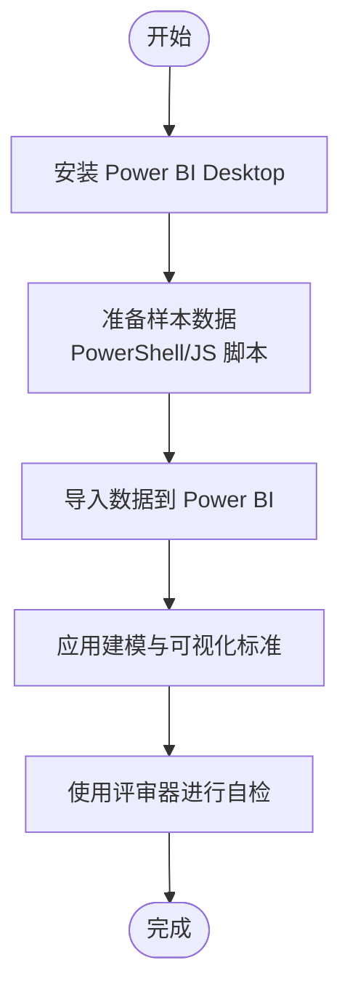
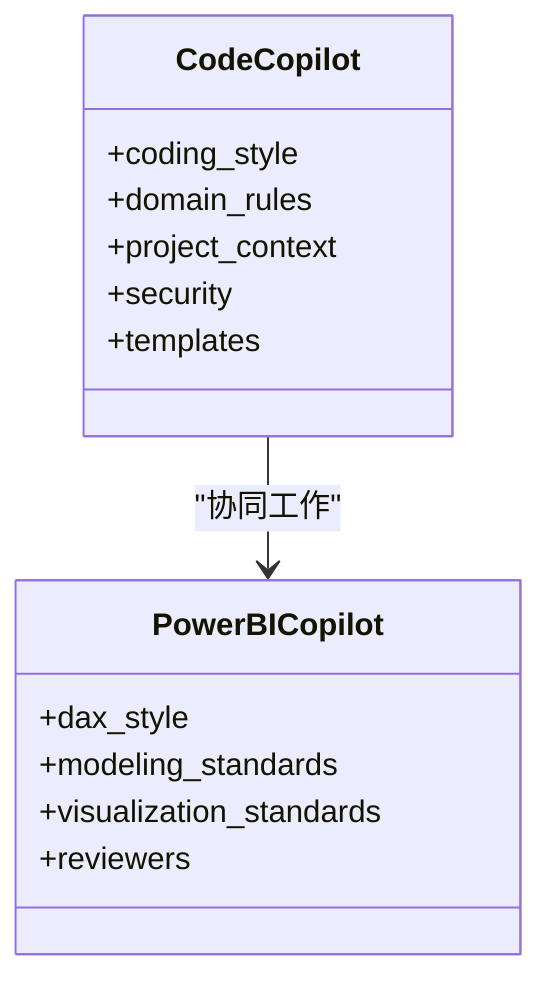
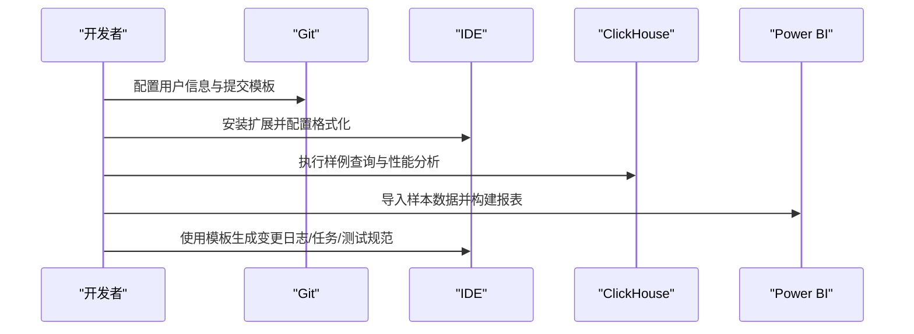
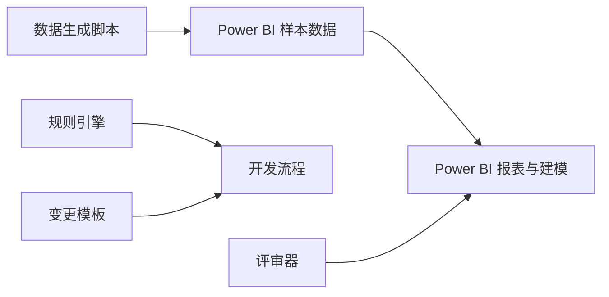

# 环境配置

<cite>
**本文引用的文件**
- [SQL_优化方案.md](file://Quickbi_sql/MAP/我的门店/SQL_优化方案.md)
- [monthly_cumulative_weekly_wiki.md](file://Quickbi_sql/周大福/周大福_日期范围生成_ARRAY JOIN_Clickhou/wiki/monthly_cumulative_weekly_wiki.md)
- [clickhouse_date_ranges_wiki.md](file://Quickbi_sql/周大福/周大福_日期范围生成_demo/clickhouse_date_ranges_wiki.md)
- [monthly.sql](file://Quickbi_sql/周大福/周大福_日期范围生成_ARRAY JOIN_Clickhou/monthly.sql)
- [monthly_cumulative_weekly.sql](file://Quickbi_sql/周大福/周大福_日期范围生成_ARRAY JOIN_Clickhou/monthly_cumulative_weekly.sql)
- [weekly.sql](file://Quickbi_sql/周大福/周大福_日期范围生成_ARRAY JOIN_Clickhou/weekly.sql)
- [yearly_cumulative_monthly.sql](file://Quickbi_sql/周大福/周大福_日期范围生成_ARRAY JOIN_Clickhou/yearly_cumulative_monthly.sql)
- [clickhouse_date_ranges.sql](file://Quickbi_sql/周大福/周大福_日期范围生成_demo/clickhouse_date_ranges.sql)
- [kpi_breakdown_matrix_solution.md](file://RL E2E/RL E2E Traffic_Dashboard/KPI Breakdown/kpi_breakdown_matrix_solution.md)
- [KPI By Platform_matrix_solution.md](file://RL E2E/RL E2E Traffic_Dashboard/KPI By Platform/KPI By Platform_matrix_solution.md)
- [KPIs_TimeFrame_solution.md](file://RL E2E/RL E2E Traffic_Dashboard/kPIs/KPIs_TimeFrame_solution.md)
- [generate_sample_data.ps1](file://RL E2E/数据demo/powerbi_data/powerbi_traffic/generate_sample_data.ps1)
- [generate_data.js](file://RL E2E/数据demo/powerbi_data/generate_data.js)
- [code-quality-reviewer.md](file://code_copilot/agents/code-quality-reviewer.md)
- [spec-reviewer.md](file://code_copilot/agents/spec-reviewer.md)
- [copilot-prompt.md](file://code_copilot/agents/copilot-prompt.md)
- [log.md](file://code_copilot/changes/templates/log.md)
- [tasks.md](file://code_copilot/changes/templates/tasks.md)
- [test-spec.md](file://code_copilot/changes/templates/test-spec.md)
- [index.md](file://code_copilot/knowledge/index.md)
- [coding-style.md](file://code_copilot/rules/coding-style.md)
- [domain-rules.md](file://code_copilot/rules/domain-rules.md)
- [project-context.md](file://code_copilot/rules/project-context.md)
- [security.md](file://code_copilot/rules/security.md)
- [dax-reviewer.md](file://powerbi_code_copilot/agents/dax-reviewer.md)
- [model-reviewer.md](file://powerbi_code_copilot/agents/model-reviewer.md)
- [performance-reviewer.md](file://powerbi_code_copilot/agents/performance-reviewer.md)
- [copilot-prompt.md](file://powerbi_code_copilot/agents/copilot-prompt.md)
- [dax-style.md](file://powerbi_code_copilot/rules/dax-style.md)
- [modeling-standards.md](file://powerbi_code_copilot/rules/modeling-standards.md)
- [project-context.md](file://powerbi_code_copilot/rules/project-context.md)
- [visualization-standards.md](file://powerbi_code_copilot/rules/visualization-standards.md)
</cite>

## 目录
1. [简介](#简介)
2. [项目结构](#项目结构)
3. [核心组件](#核心组件)
4. [架构总览](#架构总览)
5. [详细组件分析](#详细组件分析)
6. [依赖关系分析](#依赖关系分析)
7. [性能考虑](#性能考虑)
8. [故障排除指南](#故障排除指南)
9. [结论](#结论)
10. [附录](#附录)

## 简介
本指南面向开发者，帮助快速搭建本地开发环境，涵盖以下方面：
- 必要软件与工具安装：ClickHouse、Power BI、Node.js、PowerShell、Git、IDE（VS Code/PyCharm）
- 依赖与配置：数据库连接参数、数据生成脚本、规则与模板文件
- 开发工具设置：Git 提交模板、代码规范、规则引擎配置、项目上下文配置
- 环境验证：通过样例 SQL 与数据生成脚本进行验证
- 常见问题与解决方案

## 项目结构
该项目围绕“SQL 优化与 ClickHouse 使用”“Power BI 模型与可视化”“代码质量与规则引擎”三大主题组织内容，便于在不同技术栈之间协同工作。

**章节来源**
- [SQL_优化方案.md:1-200](file://Quickbi_sql/MAP/我的门店/SQL_优化方案.md#L1-L200)
- [monthly_cumulative_weekly_wiki.md:1-200](file://Quickbi_sql/周大福/周大福_日期范围生成_ARRAY JOIN_Clickhou/wiki/monthly_cumulative_weekly_wiki.md#L1-L200)
- [kpi_breakdown_matrix_solution.md:1-200](file://RL E2E/RL E2E Traffic_Dashboard/KPI Breakdown/kpi_breakdown_matrix_solution.md#L1-L200)
- [generate_sample_data.ps1:1-200](file://RL E2E/数据demo/powerbi_data/powerbi_traffic/generate_sample_data.ps1#L1-L200)
- [coding-style.md:1-200](file://code_copilot/rules/coding-style.md#L1-L200)
- [project-context.md:1-200](file://code_copilot/rules/project-context.md#L1-L200)

## 核心组件
- ClickHouse SQL 样例与优化方案：提供月度、周度、累计聚合等典型查询样例，便于本地验证与性能调优
- Power BI 样本数据与生成脚本：提供样本 CSV 与 PowerShell/JavaScript 脚本，用于快速生成测试数据
- 规则引擎与模板：定义代码规范、领域规则、项目上下文、安全策略；以及变更日志、任务清单、测试规范模板
- Power BI 规则：定义 DAX 风格、建模标准、可视化标准与评审流程

**章节来源**
- [monthly.sql:1-200](file://Quickbi_sql/周大福/周大福_日期范围生成_ARRAY JOIN_Clickhou/monthly.sql#L1-L200)
- [weekly.sql:1-200](file://Quickbi_sql/周大福/周大福_日期范围生成_ARRAY JOIN_Clickhou/weekly.sql#L1-L200)
- [monthly_cumulative_weekly.sql:1-200](file://Quickbi_sql/周大福/周大福_日期范围生成_ARRAY JOIN_Clickhou/monthly_cumulative_weekly.sql#L1-L200)
- [yearly_cumulative_monthly.sql:1-200](file://Quickbi_sql/周大福/周大福_日期范围生成_ARRAY JOIN_Clickhou/yearly_cumulative_monthly.sql#L1-L200)
- [clickhouse_date_ranges.sql:1-200](file://Quickbi_sql/周大福/周大福_日期范围生成_demo/clickhouse_date_ranges.sql#L1-L200)
- [generate_sample_data.ps1:1-200](file://RL E2E/数据demo/powerbi_data/powerbi_traffic/generate_sample_data.ps1#L1-L200)
- [generate_data.js:1-200](file://RL E2E/数据demo/powerbi_data/generate_data.js#L1-L200)
- [coding-style.md:1-200](file://code_copilot/rules/coding-style.md#L1-L200)
- [project-context.md:1-200](file://code_copilot/rules/project-context.md#L1-L200)
- [dax-style.md:1-200](file://powerbi_code_copilot/rules/dax-style.md#L1-L200)
- [modeling-standards.md:1-200](file://powerbi_code_copilot/rules/modeling-standards.md#L1-L200)
- [visualization-standards.md:1-200](file://powerbi_code_copilot/rules/visualization-standards.md#L1-L200)

## 架构总览
下图展示从“本地开发工具”到“数据源与规则引擎”的整体关系，帮助理解各模块如何协同完成 SQL 与 Power BI 的开发与验证。

[此图为概念性架构示意，不直接映射具体源码文件，故无图表来源]

## 详细组件分析

### ClickHouse 环境配置
- 安装与启动
  - 安装 ClickHouse 服务端与客户端工具
  - 启动服务并确保可访问
- 连接参数
  - 主机地址、端口、数据库名、用户名、密码（建议在本地开发时使用最小权限账户）
- 导入样例数据
  - 参考样例 SQL 文件，按需在本地数据库中创建表与导入数据
- 验证查询
  - 执行月度、周度、累计聚合等样例查询，确认返回结果与性能满足预期

**章节来源**
- [monthly.sql:1-200](file://Quickbi_sql/周大福/周大福_日期范围生成_ARRAY JOIN_Clickhou/monthly.sql#L1-L200)
- [weekly.sql:1-200](file://Quickbi_sql/周大福/周大福_日期范围生成_ARRAY JOIN_Clickhou/weekly.sql#L1-L200)
- [monthly_cumulative_weekly.sql:1-200](file://Quickbi_sql/周大福/周大福_日期范围生成_ARRAY JOIN_Clickhou/monthly_cumulative_weekly.sql#L1-L200)
- [yearly_cumulative_monthly.sql:1-200](file://Quickbi_sql/周大福/周大福_日期范围生成_ARRAY JOIN_Clickhou/yearly_cumulative_monthly.sql#L1-L200)
- [clickhouse_date_ranges.sql:1-200](file://Quickbi_sql/周大福/周大福_日期范围生成_demo/clickhouse_date_ranges.sql#L1-L200)

### Power BI 环境配置
- 安装 Power BI Desktop
- 准备样本数据
  - 使用 PowerShell 脚本生成样本数据
  - 或使用 JavaScript 脚本生成样本数据
- 导入数据并构建报表
  - 将样本 CSV 导入 Power BI
  - 应用建模与可视化标准
- 验证与评审
  - 使用 DAX 评审器与可视化评审器进行自检

**章节来源**
- [generate_sample_data.ps1:1-200](file://RL E2E/数据demo/powerbi_data/powerbi_traffic/generate_sample_data.ps1#L1-L200)
- [generate_data.js:1-200](file://RL E2E/数据demo/powerbi_data/generate_data.js#L1-L200)
- [modeling-standards.md:1-200](file://powerbi_code_copilot/rules/modeling-standards.md#L1-L200)
- [visualization-standards.md:1-200](file://powerbi_code_copilot/rules/visualization-standards.md#L1-L200)

### 规则引擎与项目上下文配置
- 代码规范
  - 统一命名、注释、缩进与复杂度限制
- 领域规则
  - 业务术语、指标口径、维度约束
- 项目上下文
  - 团队职责、交付节奏、命名约定
- 安全策略
  - 敏感字段处理、访问控制、审计要求
- 变更模板
  - 变更日志、任务清单、测试规范模板

**章节来源**
- [coding-style.md:1-200](file://code_copilot/rules/coding-style.md#L1-L200)
- [domain-rules.md:1-200](file://code_copilot/rules/domain-rules.md#L1-L200)
- [project-context.md:1-200](file://code_copilot/rules/project-context.md#L1-L200)
- [security.md:1-200](file://code_copilot/rules/security.md#L1-L200)
- [log.md:1-200](file://code_copilot/changes/templates/log.md#L1-L200)
- [tasks.md:1-200](file://code_copilot/changes/templates/tasks.md#L1-L200)
- [test-spec.md:1-200](file://code_copilot/changes/templates/test-spec.md#L1-L200)
- [dax-style.md:1-200](file://powerbi_code_copilot/rules/dax-style.md#L1-L200)
- [modeling-standards.md:1-200](file://powerbi_code_copilot/rules/modeling-standards.md#L1-L200)
- [visualization-standards.md:1-200](file://powerbi_code_copilot/rules/visualization-standards.md#L1-L200)

### 开发工具设置
- Git 配置
  - 设置用户信息与默认编辑器
  - 配置提交模板（参考变更日志模板）
- IDE 设置（VS Code/PyCharm）
  - 安装推荐扩展（如 SQL/Power BI/DAX 支持）
  - 配置格式化与保存时自动修复
- 调试工具
  - ClickHouse：使用客户端工具执行查询与 EXPLAIN
  - Power BI：启用 DAX Studio 进行 DAX 性能分析

**章节来源**
- [log.md:1-200](file://code_copilot/changes/templates/log.md#L1-L200)
- [tasks.md:1-200](file://code_copilot/changes/templates/tasks.md#L1-L200)
- [test-spec.md:1-200](file://code_copilot/changes/templates/test-spec.md#L1-L200)

## 依赖关系分析
- SQL 与 Power BI 的数据依赖
  - Power BI 样本数据由 PowerShell/JS 脚本生成，供报表与建模使用
- 规则引擎对开发流程的依赖
  - 代码规范与项目上下文指导编写与评审
  - 变更模板保证交付物一致性
- 评审器对质量的依赖
  - DAX/模型/可视化评审器提升报表质量与性能

**章节来源**
- [generate_sample_data.ps1:1-200](file://RL E2E/数据demo/powerbi_data/powerbi_traffic/generate_sample_data.ps1#L1-L200)
- [generate_data.js:1-200](file://RL E2E/数据demo/powerbi_data/generate_data.js#L1-L200)
- [modeling-standards.md:1-200](file://powerbi_code_copilot/rules/modeling-standards.md#L1-L200)
- [visualization-standards.md:1-200](file://powerbi_code_copilot/rules/visualization-standards.md#L1-L200)

## 性能考虑
- ClickHouse 查询优化
  - 使用样例 SQL 中的聚合与索引策略，避免全表扫描
  - 对时间维度建立合适索引，减少扫描范围
- Power BI 性能优化
  - 使用建模标准中的列存储与计算列策略
  - 利用 DAX 评审器检查 DAX 表达式性能
- 数据生成脚本
  - 控制样本数据规模，避免内存与 IO 压力过大

[本节为通用指导，无需列出章节来源]

## 故障排除指南
- ClickHouse 无法连接
  - 检查主机、端口、数据库名与认证信息是否正确
  - 确认防火墙与网络策略允许访问
- Power BI 报表加载缓慢
  - 检查数据模型是否符合建模标准
  - 使用 DAX 评审器定位高成本表达式
- 样本数据未生成
  - 确认 PowerShell/JS 脚本执行权限与依赖
  - 检查输出目录是否存在写权限
- 规则引擎模板未生效
  - 确认模板路径与 IDE 集成配置
  - 检查规则文件语法与编码

**章节来源**
- [generate_sample_data.ps1:1-200](file://RL E2E/数据demo/powerbi_data/powerbi_traffic/generate_sample_data.ps1#L1-L200)
- [generate_data.js:1-200](file://RL E2E/数据demo/powerbi_data/generate_data.js#L1-L200)
- [modeling-standards.md:1-200](file://powerbi_code_copilot/rules/modeling-standards.md#L1-L200)
- [dax-style.md:1-200](file://powerbi_code_copilot/rules/dax-style.md#L1-L200)

## 结论
通过本指南，开发者可以完成 ClickHouse 与 Power BI 的本地环境搭建，并结合规则引擎与模板实现高质量的开发与评审流程。建议在团队内统一规则与模板，持续优化查询与建模实践。

[本节为总结性内容，无需列出章节来源]

## 附录
- 环境验证清单
  - ClickHouse：成功连接并执行至少一条样例查询
  - Power BI：成功导入样本数据并生成基础报表
  - 规则引擎：模板与规则文件可被 IDE 正常识别
- 推荐工具
  - VS Code/PyCharm、Git、PowerShell、Node.js、DAX Studio

[本节为通用附录，无需列出章节来源]