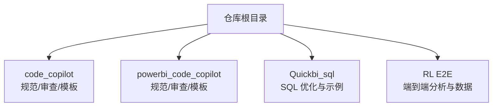
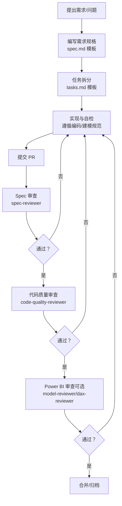
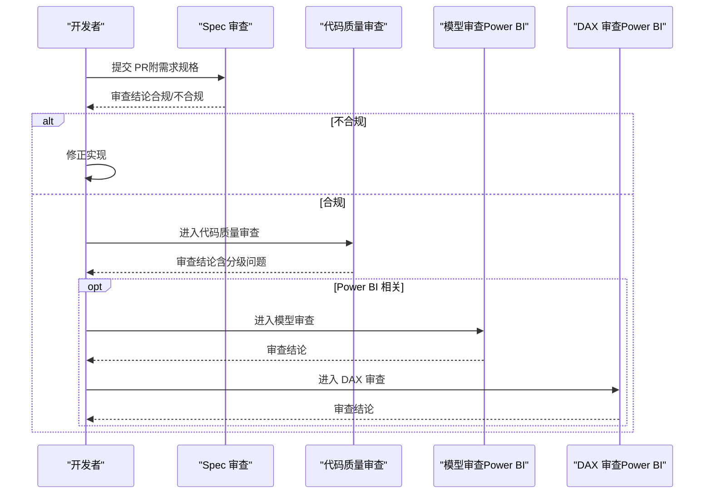
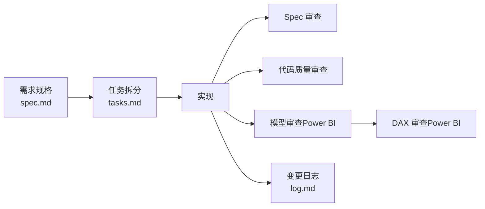

# 贡献指南

<cite>
**本文档引用的文件**
- [code_copilot/rules/coding-style.md](file://code_copilot/rules/coding-style.md)
- [code_copilot/rules/domain-rules.md](file://code_copilot/rules/domain-rules.md)
- [code_copilot/rules/security.md](file://code_copilot/rules/security.md)
- [code_copilot/rules/project-context.md](file://code_copilot/rules/project-context.md)
- [code_copilot/agents/spec-reviewer.md](file://code_copilot/agents/spec-reviewer.md)
- [code_copilot/agents/code-quality-reviewer.md](file://code_copilot/agents/code-quality-reviewer.md)
- [powerbi_code_copilot/rules/modeling-standards.md](file://powerbi_code_copilot/rules/modeling-standards.md)
- [powerbi_code_copilot/rules/dax-style.md](file://powerbi_code_copilot/rules/dax-style.md)
- [powerbi_code_copilot/rules/project-context.md](file://powerbi_code_copilot/rules/project-context.md)
- [powerbi_code_copilot/agents/model-reviewer.md](file://powerbi_code_copilot/agents/model-reviewer.md)
- [powerbi_code_copilot/agents/dax-reviewer.md](file://powerbi_code_copilot/agents/dax-reviewer.md)
- [code_copilot/changes/templates/spec.md](file://code_copilot/changes/templates/spec.md)
- [code_copilot/changes/templates/tasks.md](file://code_copilot/changes/templates/tasks.md)
- [code_copilot/changes/templates/log.md](file://code_copilot/changes/templates/log.md)
</cite>

## 目录
1. [简介](#简介)
2. [项目结构](#项目结构)
3. [核心组件](#核心组件)
4. [架构总览](#架构总览)
5. [详细组件分析](#详细组件分析)
6. [依赖分析](#依赖分析)
7. [性能考量](#性能考量)
8. [故障排查指南](#故障排查指南)
9. [结论](#结论)
10. [附录](#附录)

## 简介
本贡献指南面向开发者，提供从 Fork 项目、创建分支、提交代码到创建 Pull Request 的全流程说明；涵盖代码审查流程（含 Code Copilot 使用）、代码质量与规范、测试要求、文档更新规范以及最佳实践与常见问题解答。仓库内同时包含通用后端代码规范与 Power BI 建模规范两套体系，确保前后端协同一致。

## 项目结构
仓库采用“功能/主题”组织方式，主要目录如下：
- code_copilot：通用后端代码规范、审查流程与模板
- powerbi_code_copilot：Power BI 建模与 DAX 规范、审查流程与模板
- Quickbi_sql：SQL 优化方案与演示
- RL E2E：端到端流量分析与数据演示

## 核心组件
- 代码规范与安全基线：编码风格、领域规则、安全红线
- 审查流程：Spec 审查、代码质量审查、Power BI 模型审查、DAX 审查
- 变更管理模板：需求规格、任务拆分、变更日志
- 工程上下文：项目技术栈、分层架构、依赖与数据模型概览

章节来源
- [code_copilot/rules/coding-style.md:1-34](file://code_copilot/rules/coding-style.md#L1-L34)
- [code_copilot/rules/domain-rules.md:1-18](file://code_copilot/rules/domain-rules.md#L1-L18)
- [code_copilot/rules/security.md:1-18](file://code_copilot/rules/security.md#L1-L18)
- [code_copilot/rules/project-context.md:1-35](file://code_copilot/rules/project-context.md#L1-L35)
- [powerbi_code_copilot/rules/modeling-standards.md:1-88](file://powerbi_code_copilot/rules/modeling-standards.md#L1-L88)
- [powerbi_code_copilot/rules/dax-style.md:1-218](file://powerbi_code_copilot/rules/dax-style.md#L1-L218)
- [powerbi_code_copilot/rules/project-context.md:1-69](file://powerbi_code_copilot/rules/project-context.md#L1-L69)

## 架构总览
贡献流程由“需求—任务—实现—审查—合并”闭环构成，贯穿通用后端与 Power BI 两条主线。审查阶段强调“只信代码/模型”，通过只读工具链进行独立验证。

图表来源
- [code_copilot/agents/spec-reviewer.md:1-25](file://code_copilot/agents/spec-reviewer.md#L1-L25)
- [code_copilot/agents/code-quality-reviewer.md:1-13](file://code_copilot/agents/code-quality-reviewer.md#L1-L13)
- [powerbi_code_copilot/agents/model-reviewer.md:1-36](file://powerbi_code_copilot/agents/model-reviewer.md#L1-L36)
- [powerbi_code_copilot/agents/dax-reviewer.md:1-56](file://powerbi_code_copilot/agents/dax-reviewer.md#L1-L56)

## 详细组件分析

### 代码贡献流程（Fork→分支→提交→PR）
- Fork 与本地初始化
  - Fork 仓库至个人空间，克隆到本地，按需执行工程上下文初始化（首次使用）。
- 分支策略
  - 建议以需求/功能为单位创建特性分支，避免在主干直接提交。
- 提交与 PR
  - 提交前完成自检（规范符合性、安全基线、简单测试）。
  - 在 PR 描述中引用需求规格与任务拆分，便于审查。
- 审查与修改
  - 审查意见可能来自 Spec 审查、代码质量审查或 Power BI 审查，按反馈逐项修正。

章节来源
- [code_copilot/rules/project-context.md:1-35](file://code_copilot/rules/project-context.md#L1-L35)
- [powerbi_code_copilot/rules/project-context.md:1-69](file://powerbi_code_copilot/rules/project-context.md#L1-L69)
- [code_copilot/changes/templates/spec.md:1-63](file://code_copilot/changes/templates/spec.md#L1-L63)
- [code_copilot/changes/templates/tasks.md:1-33](file://code_copilot/changes/templates/tasks.md#L1-L33)

### 代码审查流程与 Code Copilot 使用
- 审查顺序与职责
  - 先进行 Spec 审查，再进行代码质量审查；Power BI 相关变更先模型审查，再 DAX 审查。
  - 审查者仅使用只读权限工具（Read/Grep/Glob/Bash），独立于实现者上下文。
- 审查分级
  - Critical（阻塞）、Important（应修复）、Minor（建议）三档，明确修复优先级。
- 输出与结论
  - 对照需求规格逐项验证，给出结论与问题清单，确保“只信代码/模型”。

图表来源
- [code_copilot/agents/spec-reviewer.md:1-25](file://code_copilot/agents/spec-reviewer.md#L1-L25)
- [code_copilot/agents/code-quality-reviewer.md:1-13](file://code_copilot/agents/code-quality-reviewer.md#L1-L13)
- [powerbi_code_copilot/agents/model-reviewer.md:1-36](file://powerbi_code_copilot/agents/model-reviewer.md#L1-L36)
- [powerbi_code_copilot/agents/dax-reviewer.md:1-56](file://powerbi_code_copilot/agents/dax-reviewer.md#L1-L56)

章节来源
- [code_copilot/agents/spec-reviewer.md:1-25](file://code_copilot/agents/spec-reviewer.md#L1-L25)
- [code_copilot/agents/code-quality-reviewer.md:1-13](file://code_copilot/agents/code-quality-reviewer.md#L1-L13)
- [powerbi_code_copilot/agents/model-reviewer.md:1-36](file://powerbi_code_copilot/agents/model-reviewer.md#L1-L36)
- [powerbi_code_copilot/agents/dax-reviewer.md:1-56](file://powerbi_code_copilot/agents/dax-reviewer.md#L1-L56)

### 测试要求
- 单元测试
  - 覆盖核心业务逻辑与边界条件，确保关键函数/方法的正确性。
- 集成测试
  - 验证模块间协作、接口契约与数据流一致性。
- 性能测试
  - 对热点路径与批量处理场景进行压测与基准对比，关注延迟、吞吐与资源占用。
- 测试策略模板
  - 在需求规格中明确测试范围、覆盖率目标与独立测试规范，便于审查与验收。

章节来源
- [code_copilot/changes/templates/spec.md:41-46](file://code_copilot/changes/templates/spec.md#L41-L46)

### 文档更新规范
- 文档格式
  - 使用 Markdown，标题层级清晰，段落简洁，必要时配合表格/流程图。
- 示例与变更日志
  - 变更日志记录决策、踩坑与知识沉淀，支持归档与复盘。
- 版本与追踪
  - 需求规格与任务拆分模板提供状态追踪与确认记录，确保可追溯。

章节来源
- [code_copilot/changes/templates/log.md:1-28](file://code_copilot/changes/templates/log.md#L1-L28)
- [code_copilot/changes/templates/spec.md:1-63](file://code_copilot/changes/templates/spec.md#L1-L63)
- [code_copilot/changes/templates/tasks.md:1-33](file://code_copilot/changes/templates/tasks.md#L1-L33)

### 代码质量与规范
- 编码风格
  - 命名规范（类/方法/常量/抽象类/测试类）、异常处理、日志规范、幂等等。
- 领域规则
  - 金额单位、时间字段、外部接口超时与降级、状态机变更。
- 安全红线
  - 禁止硬编码密钥/敏感信息；涉及资金/状态/权限变更需严格校验与人工审查。
- 工程上下文
  - 明确应用概况、目录结构、分层架构与关键依赖，指导实现与审查。

章节来源
- [code_copilot/rules/coding-style.md:1-34](file://code_copilot/rules/coding-style.md#L1-L34)
- [code_copilot/rules/domain-rules.md:1-18](file://code_copilot/rules/domain-rules.md#L1-L18)
- [code_copilot/rules/security.md:1-18](file://code_copilot/rules/security.md#L1-L18)
- [code_copilot/rules/project-context.md:1-35](file://code_copilot/rules/project-context.md#L1-L35)

### Power BI 建模与 DAX 规范
- 数据建模规范
  - 星型模型优先、表类型标识、关系设计原则、日期表要求、度量值组织与禁止事项。
- DAX 编码规范
  - 命名约定（度量值/计算列/表）、格式规范（缩进/换行/注释）、编写原则（性能优先/上下文清晰/可维护性）、禁止事项与命名检查清单。
- 审查流程
  - 模型审查与 DAX 审查分别验证结构合规、业务规则落地与性能评估。

章节来源
- [powerbi_code_copilot/rules/modeling-standards.md:1-88](file://powerbi_code_copilot/rules/modeling-standards.md#L1-L88)
- [powerbi_code_copilot/rules/dax-style.md:1-218](file://powerbi_code_copilot/rules/dax-style.md#L1-L218)
- [powerbi_code_copilot/agents/model-reviewer.md:1-36](file://powerbi_code_copilot/agents/model-reviewer.md#L1-L36)
- [powerbi_code_copilot/agents/dax-reviewer.md:1-56](file://powerbi_code_copilot/agents/dax-reviewer.md#L1-L56)

## 依赖分析
- 审查工具链依赖
  - 审查者仅使用只读工具（Read/Grep/Glob/Bash），降低耦合与风险。
- 规范与模板依赖
  - 需求规格、任务拆分、变更日志模板为实现与审查提供共同语言与依据。
- 项目上下文依赖
  - 工程上下文文件帮助 AI/审查者快速理解项目背景与结构，提升审查效率。

图表来源
- [code_copilot/changes/templates/spec.md:1-63](file://code_copilot/changes/templates/spec.md#L1-L63)
- [code_copilot/changes/templates/tasks.md:1-33](file://code_copilot/changes/templates/tasks.md#L1-L33)
- [code_copilot/changes/templates/log.md:1-28](file://code_copilot/changes/templates/log.md#L1-L28)
- [code_copilot/agents/spec-reviewer.md:1-25](file://code_copilot/agents/spec-reviewer.md#L1-L25)
- [code_copilot/agents/code-quality-reviewer.md:1-13](file://code_copilot/agents/code-quality-reviewer.md#L1-L13)
- [powerbi_code_copilot/agents/model-reviewer.md:1-36](file://powerbi_code_copilot/agents/model-reviewer.md#L1-L36)
- [powerbi_code_copilot/agents/dax-reviewer.md:1-56](file://powerbi_code_copilot/agents/dax-reviewer.md#L1-L56)

## 性能考量
- 通用后端
  - 幂等设计、并发同步策略、魔法值常量化、异常与日志规范有助于稳定与可观测性。
- Power BI
  - 优先使用 VAR 避免重复计算、减少上下文转换、迭代函数在最小粒度表上运行、时间智能函数正确使用日期表、预计算为计算列等。

章节来源
- [code_copilot/rules/coding-style.md:29-34](file://code_copilot/rules/coding-style.md#L29-L34)
- [powerbi_code_copilot/rules/dax-style.md:143-170](file://powerbi_code_copilot/rules/dax-style.md#L143-L170)

## 故障排查指南
- 常见问题
  - 规范不符：命名不规范、异常被吞、日志泄露敏感信息、硬编码密钥/参数。
  - 审查不通过：Spec 偏差、质量分级问题、模型结构违规、DAX 性能隐患。
- 解决步骤
  - 自检：对照编码/建模规范逐项修正。
  - 重审：修正后重新触发对应审查流程。
  - 记录：在变更日志沉淀问题与方案，形成知识闭环。

章节来源
- [code_copilot/rules/security.md:1-18](file://code_copilot/rules/security.md#L1-L18)
- [code_copilot/agents/code-quality-reviewer.md:5-12](file://code_copilot/agents/code-quality-reviewer.md#L5-L12)
- [powerbi_code_copilot/agents/dax-reviewer.md:5-26](file://powerbi_code_copilot/agents/dax-reviewer.md#L5-L26)

## 结论
本指南提供了从需求到合并的完整贡献路径，结合只读审查工具链与规范模板，确保实现与审查的一致性与可追溯性。建议在每次贡献前先阅读对应规范与模板，按顺序完成自检与评审，以提高效率与质量。

## 附录
- 变更管理模板使用建议
  - 需求规格：明确背景、目标、功能点、业务规则、数据/接口变更、影响范围、风险与测试策略。
  - 任务拆分：按“数据模型→接口协议→底层实现→上层编排→入口层”的顺序拆解，每个任务限定原子变更。
  - 变更日志：记录时间线、技术决策、踩坑与知识发现，支撑归档与复盘。

章节来源
- [code_copilot/changes/templates/spec.md:1-63](file://code_copilot/changes/templates/spec.md#L1-L63)
- [code_copilot/changes/templates/tasks.md:1-33](file://code_copilot/changes/templates/tasks.md#L1-L33)
- [code_copilot/changes/templates/log.md:1-28](file://code_copilot/changes/templates/log.md#L1-L28)