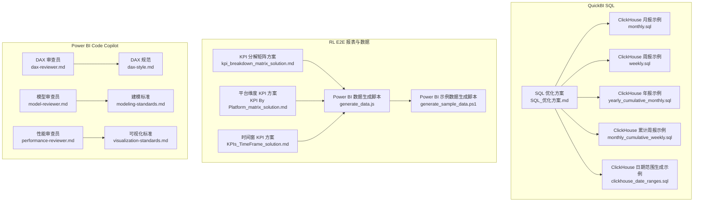
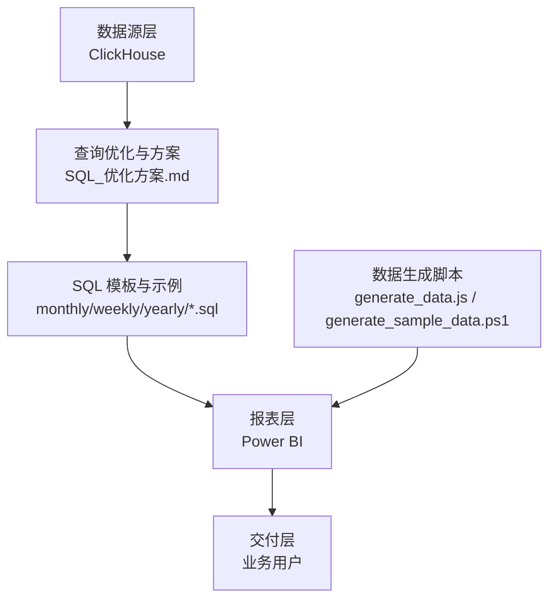
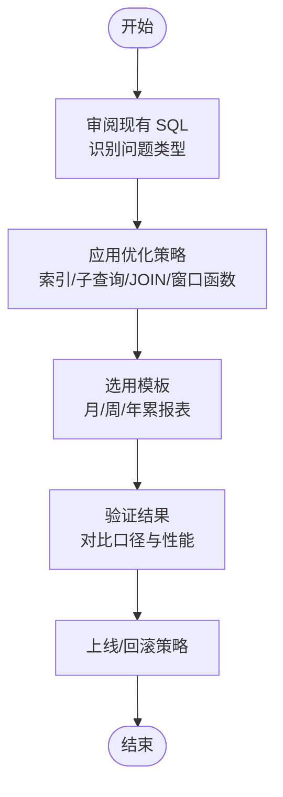
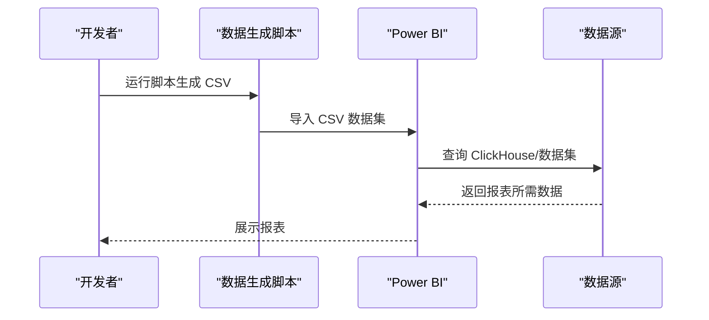
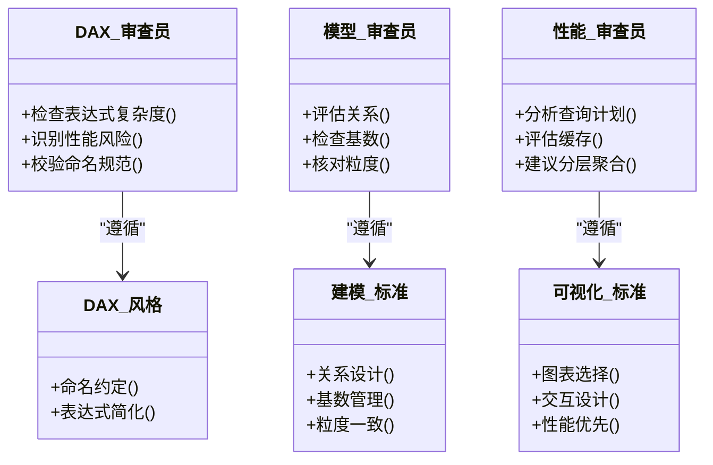
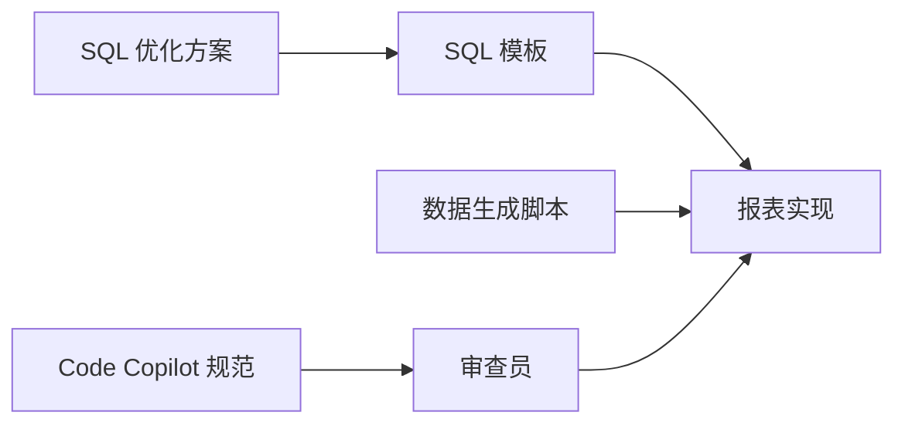

# 部署运维

<cite>
**本文引用的文件**
- [SQL_优化方案.md](file://Quickbi_sql/MAP/我的门店/SQL_优化方案.md)
- [monthly.sql](file://Quickbi_sql/周大福/周大福_日期范围生成_ARRAY JOIN_Clickhou/monthly.sql)
- [weekly.sql](file://Quickbi_sql/周大福/周大福_日期范围生成_ARRAY JOIN_Clickhou/weekly.sql)
- [yearly_cumulative_monthly.sql](file://Quickbi_sql/周大福/周大福_日期范围生成_ARRAY JOIN_Clickhou/yearly_cumulative_monthly.sql)
- [monthly_cumulative_weekly.sql](file://Quickbi_sql/周大福/周大福_日期范围生成_ARRAY JOIN_Clickhou/monthly_cumulative_weekly.sql)
- [clickhouse_date_ranges.sql](file://Quickbi_sql/周大福/周大福_日期范围生成_demo/clickhouse_date_ranges.sql)
- [kpi_breakdown_matrix_solution.md](file://RL E2E/RL E2E Traffic_Dashboard/KPI Breakdown/kpi_breakdown_matrix_solution.md)
- [KPI By Platform_matrix_solution.md](file://RL E2E/RL E2E Traffic_Dashboard/KPI By Platform/KPI By Platform_matrix_solution.md)
- [KPIs_TimeFrame_solution.md](file://RL E2E/RL E2E Traffic_Dashboard/kPIs/KPIs_TimeFrame_solution.md)
- [generate_data.js](file://RL E2E/数据demo/powerbi_data/generate_data.js)
- [generate_sample_data.ps1](file://RL E2E/数据demo/powerbi_data/powerbi_traffic/generate_sample_data.ps1)
- [dax-reviewer.md](file://powerbi_code_copilot/agents/dax-reviewer.md)
- [model-reviewer.md](file://powerbi_code_copilot/agents/model-reviewer.md)
- [performance-reviewer.md](file://powerbi_code_copilot/agents/performance-reviewer.md)
- [dax-style.md](file://powerbi_code_copilot/rules/dax-style.md)
- [modeling-standards.md](file://powerbi_code_copilot/rules/modeling-standards.md)
- [visualization-standards.md](file://powerbi_code_copilot/rules/visualization-standards.md)
</cite>

## 目录
1. [简介](#简介)
2. [项目结构](#项目结构)
3. [核心组件](#核心组件)
4. [架构总览](#架构总览)
5. [详细组件分析](#详细组件分析)
6. [依赖分析](#依赖分析)
7. [性能考虑](#性能考虑)
8. [故障排除指南](#故障排除指南)
9. [结论](#结论)
10. [附录](#附录)

## 简介
本指南面向开发者与运维工程师，围绕仓库中的数据与报表相关资产，提供部署与运维层面的实践建议。内容涵盖：
- 部署配置：生产、测试、开发环境的落地要点
- 监控设置：性能、错误与使用情况监控
- 性能调优：SQL 查询优化、Power BI 报表性能优化与系统资源优化
- 故障排除：常见问题诊断、日志分析与应急响应流程
- 最佳实践与维护建议

说明：仓库以文档与脚本为主，未包含传统后端服务代码，因此“部署”主要指向数据与报表系统的运行与维护。

## 项目结构
仓库包含三类关键资产：
- QuickBI SQL 优化与示例：ClickHouse SQL 与优化方案
- RL E2E 报表与数据：Power BI 报表解决方案与数据生成脚本
- Power BI Code Copilot 规则与评审：DAX、建模与可视化规范

**图示来源**
- [SQL_优化方案.md:1-100](file://Quickbi_sql/MAP/我的门店/SQL_优化方案.md#L1-L100)
- [monthly.sql:1-50](file://Quickbi_sql/周大福/周大福_日期范围生成_ARRAY JOIN_Clickhou/monthly.sql#L1-L50)
- [weekly.sql:1-50](file://Quickbi_sql/周大福/周大福_日期范围生成_ARRAY JOIN_Clickhou/weekly.sql#L1-L50)
- [yearly_cumulative_monthly.sql:1-50](file://Quickbi_sql/周大福/周大福_日期范围生成_ARRAY JOIN_Clickhou/yearly_cumulative_monthly.sql#L1-L50)
- [monthly_cumulative_weekly.sql:1-50](file://Quickbi_sql/周大福/周大福_日期范围生成_ARRAY JOIN_Clickhou/monthly_cumulative_weekly.sql#L1-L50)
- [clickhouse_date_ranges.sql:1-50](file://Quickbi_sql/周大福/周大福_日期范围生成_demo/clickhouse_date_ranges.sql#L1-L50)
- [kpi_breakdown_matrix_solution.md:1-100](file://RL E2E/RL E2E Traffic_Dashboard/KPI Breakdown/kpi_breakdown_matrix_solution.md#L1-L100)
- [KPI By Platform_matrix_solution.md:1-100](file://RL E2E/RL E2E Traffic_Dashboard/KPI By Platform/KPI By Platform_matrix_solution.md#L1-L100)
- [KPIs_TimeFrame_solution.md:1-100](file://RL E2E/RL E2E Traffic_Dashboard/kPIs/KPIs_TimeFrame_solution.md#L1-L100)
- [generate_data.js:1-50](file://RL E2E/数据demo/powerbi_data/generate_data.js#L1-L50)
- [generate_sample_data.ps1:1-50](file://RL E2E/数据demo/powerbi_data/powerbi_traffic/generate_sample_data.ps1#L1-L50)
- [dax-reviewer.md:1-100](file://powerbi_code_copilot/agents/dax-reviewer.md#L1-L100)
- [model-reviewer.md:1-100](file://powerbi_code_copilot/agents/model-reviewer.md#L1-L100)
- [performance-reviewer.md:1-100](file://powerbi_code_copilot/agents/performance-reviewer.md#L1-L100)
- [dax-style.md:1-100](file://powerbi_code_copilot/rules/dax-style.md#L1-L100)
- [modeling-standards.md:1-100](file://powerbi_code_copilot/rules/modeling-standards.md#L1-L100)
- [visualization-standards.md:1-100](file://powerbi_code_copilot/rules/visualization-standards.md#L1-L100)

**章节来源**
- [SQL_优化方案.md:1-100](file://Quickbi_sql/MAP/我的门店/SQL_优化方案.md#L1-L100)
- [monthly.sql:1-50](file://Quickbi_sql/周大福/周大福_日期范围生成_ARRAY JOIN_Clickhou/monthly.sql#L1-L50)
- [generate_data.js:1-50](file://RL E2E/数据demo/powerbi_data/generate_data.js#L1-L50)

## 核心组件
- SQL 优化与示例：提供 ClickHouse SQL 的优化清单与多周期（月/周/年累）报表模板，便于在生产环境中复用与校验
- 报表方案与数据：提供 KPI 分解、平台维度与时间窗的报表实现思路，并配套数据生成脚本，支撑测试与演示
- Power BI Code Copilot：定义 DAX、建模与可视化规范，辅助报表质量与性能治理

**章节来源**
- [SQL_优化方案.md:1-100](file://Quickbi_sql/MAP/我的门店/SQL_优化方案.md#L1-L100)
- [kpi_breakdown_matrix_solution.md:1-100](file://RL E2E/RL E2E Traffic_Dashboard/KPI Breakdown/kpi_breakdown_matrix_solution.md#L1-L100)
- [dax-style.md:1-100](file://powerbi_code_copilot/rules/dax-style.md#L1-L100)

## 架构总览
从运维视角，系统由“数据源层（ClickHouse）—报表层（Power BI）—交付层（用户）”构成。SQL 优化与报表方案作为中间层规范，确保查询效率与报表一致性；数据生成脚本用于测试与预演。

**图示来源**
- [SQL_优化方案.md:1-100](file://Quickbi_sql/MAP/我的门店/SQL_优化方案.md#L1-L100)
- [monthly.sql:1-50](file://Quickbi_sql/周大福/周大福_日期范围生成_ARRAY JOIN_Clickhou/monthly.sql#L1-L50)
- [weekly.sql:1-50](file://Quickbi_sql/周大福/周大福_日期范围生成_ARRAY JOIN_Clickhou/weekly.sql#L1-L50)
- [yearly_cumulative_monthly.sql:1-50](file://Quickbi_sql/周大福/周大福_日期范围生成_ARRAY JOIN_Clickhou/yearly_cumulative_monthly.sql#L1-L50)
- [generate_data.js:1-50](file://RL E2E/数据demo/powerbi_data/generate_data.js#L1-L50)
- [generate_sample_data.ps1:1-50](file://RL E2E/数据demo/powerbi_data/powerbi_traffic/generate_sample_data.ps1#L1-L50)

## 详细组件分析

### 组件A：SQL 查询优化与报表模板
- 优化清单覆盖索引失效、子查询低效、模糊匹配、重复扫描、窗口函数冗余、JOIN 不必要、聚合重复计算等典型问题
- 提供月/周/年累报表的 ClickHouse SQL 模板，便于快速落地与复用
- 通过 CTE 与日期范围生成逻辑，统一报表口径与时间维度

**图示来源**
- [SQL_优化方案.md:1-100](file://Quickbi_sql/MAP/我的门店/SQL_优化方案.md#L1-L100)
- [monthly.sql:1-50](file://Quickbi_sql/周大福/周大福_日期范围生成_ARRAY JOIN_Clickhou/monthly.sql#L1-L50)
- [weekly.sql:1-50](file://Quickbi_sql/周大福/周大福_日期范围生成_ARRAY JOIN_Clickhou/weekly.sql#L1-L50)
- [yearly_cumulative_monthly.sql:1-50](file://Quickbi_sql/周大福/周大福_日期范围生成_ARRAY JOIN_Clickhou/yearly_cumulative_monthly.sql#L1-L50)

**章节来源**
- [SQL_优化方案.md:1-100](file://Quickbi_sql/MAP/我的门店/SQL_优化方案.md#L1-L100)
- [monthly.sql:1-50](file://Quickbi_sql/周大福/周大福_日期范围生成_ARRAY JOIN_Clickhou/monthly.sql#L1-L50)
- [weekly.sql:1-50](file://Quickbi_sql/周大福/周大福_日期范围生成_ARRAY JOIN_Clickhou/weekly.sql#L1-L50)
- [yearly_cumulative_monthly.sql:1-50](file://Quickbi_sql/周大福/周大福_日期范围生成_ARRAY JOIN_Clickhou/yearly_cumulative_monthly.sql#L1-L50)

### 组件B：Power BI 报表方案与数据生成
- 提供 KPI 分解、平台维度与时间窗的报表实现思路，便于在不同业务场景下快速复制
- 数据生成脚本支持从页面提取数据并生成 CSV，便于测试与演示环境的数据准备

**图示来源**
- [generate_data.js:1-50](file://RL E2E/数据demo/powerbi_data/generate_data.js#L1-L50)
- [generate_sample_data.ps1:1-50](file://RL E2E/数据demo/powerbi_data/powerbi_traffic/generate_sample_data.ps1#L1-L50)
- [kpi_breakdown_matrix_solution.md:1-100](file://RL E2E/RL E2E Traffic_Dashboard/KPI Breakdown/kpi_breakdown_matrix_solution.md#L1-L100)
- [KPI By Platform_matrix_solution.md:1-100](file://RL E2E/RL E2E Traffic_Dashboard/KPI By Platform/KPI By Platform_matrix_solution.md#L1-L100)
- [KPIs_TimeFrame_solution.md:1-100](file://RL E2E/RL E2E Traffic_Dashboard/kPIs/KPIs_TimeFrame_solution.md#L1-L100)

**章节来源**
- [generate_data.js:1-50](file://RL E2E/数据demo/powerbi_data/generate_data.js#L1-L50)
- [generate_sample_data.ps1:1-50](file://RL E2E/数据demo/powerbi_data/powerbi_traffic/generate_sample_data.ps1#L1-L50)
- [kpi_breakdown_matrix_solution.md:1-100](file://RL E2E/RL E2E Traffic_Dashboard/KPI Breakdown/kpi_breakdown_matrix_solution.md#L1-L100)
- [KPI By Platform_matrix_solution.md:1-100](file://RL E2E/RL E2E Traffic_Dashboard/KPI By Platform/KPI By Platform_matrix_solution.md#L1-L100)
- [KPIs_TimeFrame_solution.md:1-100](file://RL E2E/RL E2E Traffic_Dashboard/kPIs/KPIs_TimeFrame_solution.md#L1-L100)

### 组件C：Power BI Code Copilot 规范与审查
- DAX 审查员：检查表达式复杂度、性能风险与命名规范
- 模型审查员：评估关系完整性、基数与粒度一致性
- 性能审查员：聚焦查询计划、缓存命中与分层聚合
- 规范文件：DAX 风格、建模标准与可视化标准，保障报表质量与可维护性

**图示来源**
- [dax-reviewer.md:1-100](file://powerbi_code_copilot/agents/dax-reviewer.md#L1-L100)
- [model-reviewer.md:1-100](file://powerbi_code_copilot/agents/model-reviewer.md#L1-L100)
- [performance-reviewer.md:1-100](file://powerbi_code_copilot/agents/performance-reviewer.md#L1-L100)
- [dax-style.md:1-100](file://powerbi_code_copilot/rules/dax-style.md#L1-L100)
- [modeling-standards.md:1-100](file://powerbi_code_copilot/rules/modeling-standards.md#L1-L100)
- [visualization-standards.md:1-100](file://powerbi_code_copilot/rules/visualization-standards.md#L1-L100)

**章节来源**
- [dax-reviewer.md:1-100](file://powerbi_code_copilot/agents/dax-reviewer.md#L1-L100)
- [model-reviewer.md:1-100](file://powerbi_code_copilot/agents/model-reviewer.md#L1-L100)
- [performance-reviewer.md:1-100](file://powerbi_code_copilot/agents/performance-reviewer.md#L1-L100)
- [dax-style.md:1-100](file://powerbi_code_copilot/rules/dax-style.md#L1-L100)
- [modeling-standards.md:1-100](file://powerbi_code_copilot/rules/modeling-standards.md#L1-L100)
- [visualization-standards.md:1-100](file://powerbi_code_copilot/rules/visualization-standards.md#L1-L100)

## 依赖分析
- SQL 优化与报表模板之间存在强依赖：优化方案指导模板编写，模板决定报表实现
- 报表方案与数据生成脚本存在间接依赖：报表需要数据，数据由脚本生成
- Code Copilot 规范与审查形成闭环：规范约束审查，审查反馈改进规范

**图示来源**
- [SQL_优化方案.md:1-100](file://Quickbi_sql/MAP/我的门店/SQL_优化方案.md#L1-L100)
- [monthly.sql:1-50](file://Quickbi_sql/周大福/周大福_日期范围生成_ARRAY JOIN_Clickhou/monthly.sql#L1-L50)
- [generate_data.js:1-50](file://RL E2E/数据demo/powerbi_data/generate_data.js#L1-L50)
- [dax-style.md:1-100](file://powerbi_code_copilot/rules/dax-style.md#L1-L100)

**章节来源**
- [SQL_优化方案.md:1-100](file://Quickbi_sql/MAP/我的门店/SQL_优化方案.md#L1-L100)
- [monthly.sql:1-50](file://Quickbi_sql/周大福/周大福_日期范围生成_ARRAY JOIN_Clickhou/monthly.sql#L1-L50)
- [generate_data.js:1-50](file://RL E2E/数据demo/powerbi_data/generate_data.js#L1-L50)
- [dax-style.md:1-100](file://powerbi_code_copilot/rules/dax-style.md#L1-L100)

## 性能考虑
- SQL 查询优化
  - 避免类型转换导致的索引失效
  - 减少子查询与重复扫描，优先使用 JOIN 与 CTE 合理拆分
  - 使用前缀匹配替代前后通配符，减少全表扫描
  - 合理使用窗口函数与聚合，避免冗余计算
- Power BI 报表性能优化
  - DAX 表达式应尽量简洁，避免嵌套复杂计算
  - 关系设计遵循“一端多”原则，减少交叉过滤成本
  - 合理使用分层聚合与缓存，提升交互性能
- 系统资源优化
  - 数据生成脚本在本地或测试环境运行，避免对生产数据源造成压力
  - 报表发布到 Power BI Service 时，启用增量刷新与数据压缩

**章节来源**
- [SQL_优化方案.md:1-100](file://Quickbi_sql/MAP/我的门店/SQL_优化方案.md#L1-L100)
- [dax-style.md:1-100](file://powerbi_code_copilot/rules/dax-style.md#L1-L100)
- [modeling-standards.md:1-100](file://powerbi_code_copilot/rules/modeling-standards.md#L1-L100)
- [visualization-standards.md:1-100](file://powerbi_code_copilot/rules/visualization-standards.md#L1-L100)

## 故障排除指南
- 常见问题诊断
  - 报表加载缓慢：检查 DAX 复杂度、关系基数与缓存命中率
  - 数据不一致：核对时间窗口径、日期范围生成逻辑与模板一致性
  - 查询超时：排查索引失效、全表扫描与子查询重复计算
- 日志分析
  - Power BI：关注查询耗时、刷新失败与缓存未命中
  - 数据生成脚本：记录输入路径、编码与输出 CSV 的完整性
- 紧急响应流程
  - 快速回滚：冻结新模板变更，恢复上一版本报表
  - 降级策略：临时关闭复杂计算，启用基础聚合视图
  - 通知机制：在变更公告中明确影响范围与恢复时间

**章节来源**
- [performance-reviewer.md:1-100](file://powerbi_code_copilot/agents/performance-reviewer.md#L1-L100)
- [generate_data.js:1-50](file://RL E2E/数据demo/powerbi_data/generate_data.js#L1-L50)

## 结论
本仓库以“SQL 优化—报表模板—数据生成—规范审查”的闭环体系支撑报表系统的稳定运行。通过遵循优化方案与规范，结合数据生成脚本与审查机制，可在生产、测试与开发环境中实现高效、可维护的报表交付。

## 附录
- 开发环境设置
  - 在本地安装 Node.js（用于数据生成脚本）与 PowerShell（用于样本数据生成）
  - 准备 ClickHouse 客户端或连接信息，确保 SQL 模板可执行
- 测试环境配置
  - 使用 generate_data.js 生成 CSV，导入 Power BI Desktop 进行验证
  - 对照 KPI 方案文档进行功能与性能回归
- 生产环境部署
  - 将 SQL 模板部署至生产数据库，建立版本控制与变更审批
  - 在 Power BI Service 发布报表，配置增量刷新与监控告警

**章节来源**
- [generate_data.js:1-50](file://RL E2E/数据demo/powerbi_data/generate_data.js#L1-L50)
- [generate_sample_data.ps1:1-50](file://RL E2E/数据demo/powerbi_data/powerbi_traffic/generate_sample_data.ps1#L1-L50)
- [monthly.sql:1-50](file://Quickbi_sql/周大福/周大福_日期范围生成_ARRAY JOIN_Clickhou/monthly.sql#L1-L50)
- [kpi_breakdown_matrix_solution.md:1-100](file://RL E2E/RL E2E Traffic_Dashboard/KPI Breakdown/kpi_breakdown_matrix_solution.md#L1-L100)