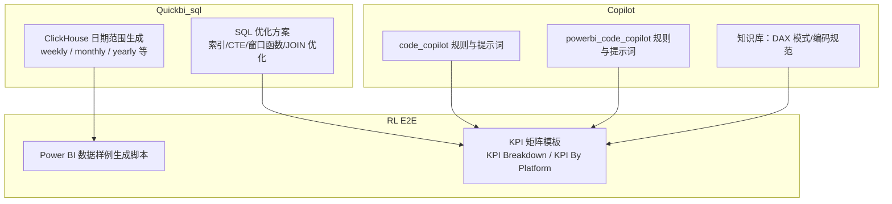
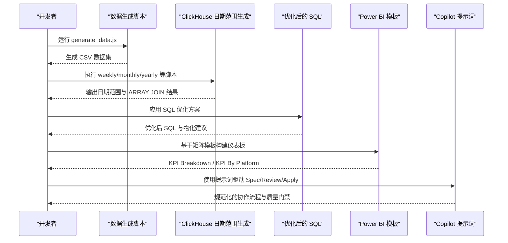
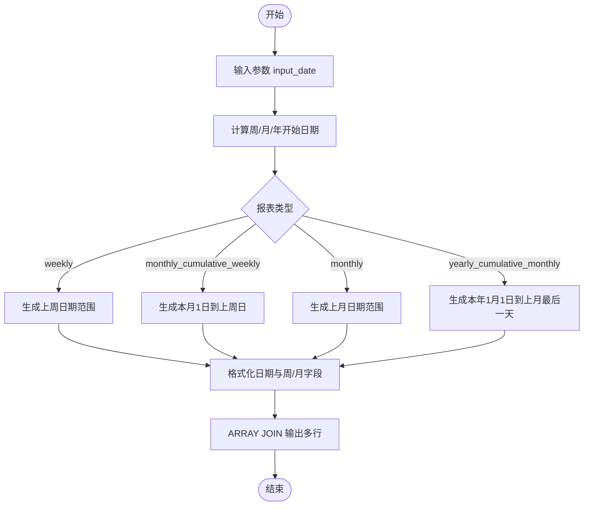
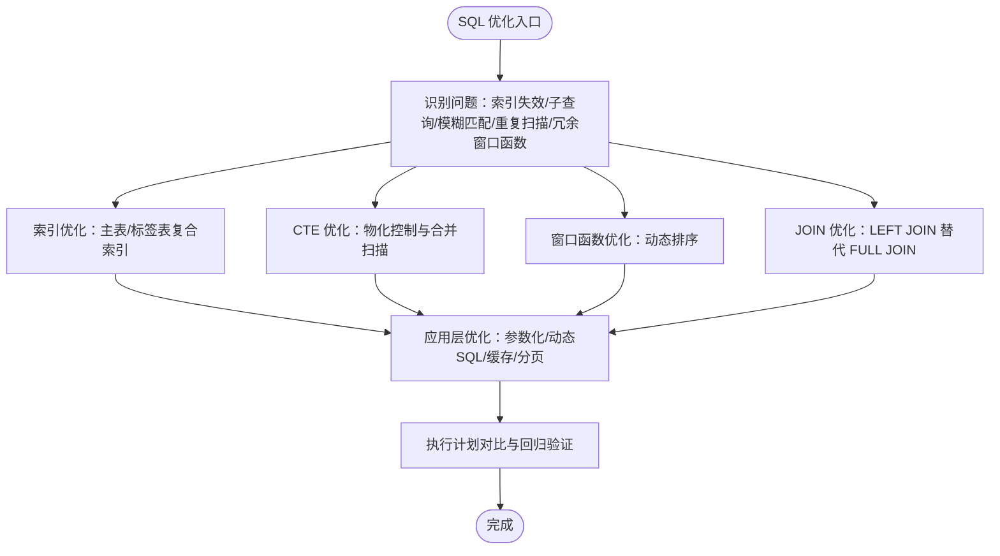
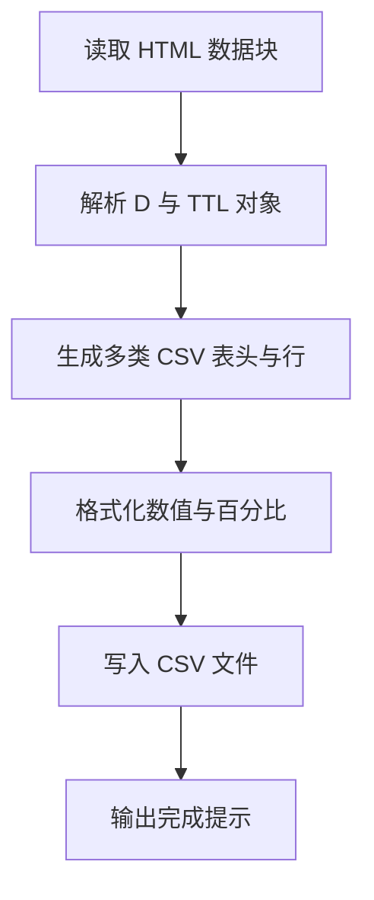
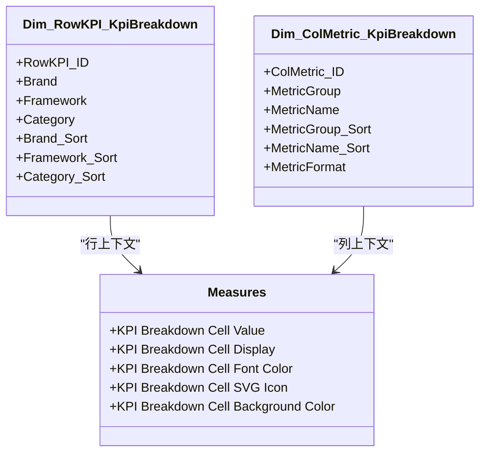
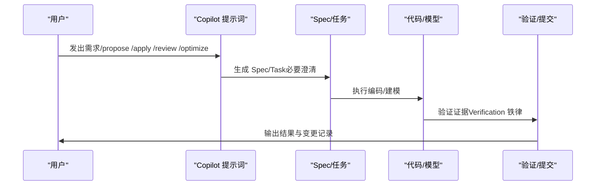
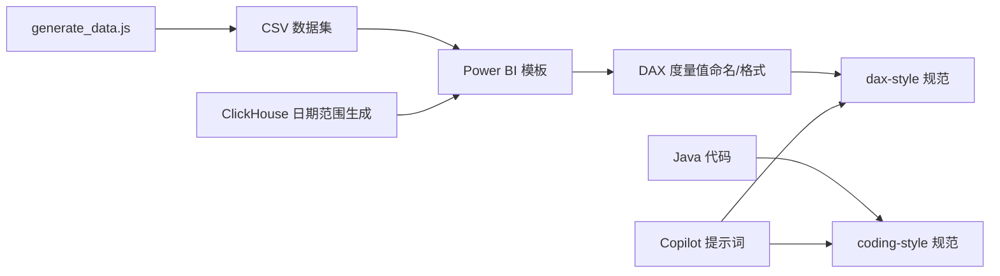

# 快速开始

<cite>
**本文引用的文件**
- [SQL_优化方案.md](file://Quickbi_sql/MAP/我的门店/SQL_优化方案.md)
- [monthly.sql](file://Quickbi_sql/周大福/周大福_日期范围生成_ARRAY JOIN_Clickhou/monthly.sql)
- [monthly_cumulative_weekly.sql](file://Quickbi_sql/周大福/周大福_日期范围生成_ARRAY JOIN_Clickhou/monthly_cumulative_weekly.sql)
- [weekly.sql](file://Quickbi_sql/周大福/周大福_日期范围生成_ARRAY JOIN_Clickhou/weekly.sql)
- [yearly_cumulative_monthly.sql](file://Quickbi_sql/周大福/周大福_日期范围生成_ARRAY JOIN_Clickhou/yearly_cumulative_monthly.sql)
- [clickhouse_date_ranges.sql](file://Quickbi_sql/周大福/周大福_日期范围生成_demo/clickhouse_date_ranges.sql)
- [index.md](file://code_copilot/knowledge/index.md)
- [dax-patterns.md](file://powerbi_code_copilot/knowledge/dax-patterns.md)
- [generate_data.js](file://RL E2E/数据demo/powerbi_data/generate_data.js)
- [coding-style.md](file://code_copilot/rules/coding-style.md)
- [dax-style.md](file://powerbi_code_copilot/rules/dax-style.md)
- [copilot-prompt.md（code_copilot）](file://code_copilot/agents/copilot-prompt.md)
- [copilot-prompt.md（powerbi_code_copilot）](file://powerbi_code_copilot/agents/copilot-prompt.md)
- [kpi_breakdown_matrix_solution.md](file://RL E2E/RL E2E Traffic_Dashboard/KPI Breakdown/kpi_breakdown_matrix_solution.md)
- [KPI By Platform_matrix_solution.md](file://RL E2E/RL E2E Traffic_Dashboard/KPI By Platform/KPI By Platform_matrix_solution.md)
</cite>

## 目录
1. [简介](#简介)
2. [项目结构](#项目结构)
3. [核心组件](#核心组件)
4. [架构总览](#架构总览)
5. [详细组件分析](#详细组件分析)
6. [依赖分析](#依赖分析)
7. [性能考虑](#性能考虑)
8. [故障排除指南](#故障排除指南)
9. [结论](#结论)
10. [附录](#附录)

## 简介
本“快速开始”旨在帮助新用户在最短时间内上手 Qoder AI 项目的核心能力，涵盖以下方面：
- 环境搭建与依赖准备
- 一键生成 Power BI 数据样例
- 第一个分析示例：ClickHouse 日期范围生成与报表联动
- SQL 优化最佳实践与落地步骤
- Power BI 仪表板与 Copilot 协作流程
- 常见问题与故障排除

## 项目结构
该项目包含三大分析域：
- Quickbi_sql：ClickHouse 日期范围生成与 SQL 优化方案
- RL E2E：Power BI 仪表板模板与数据样例
- code_copilot / powerbi_code_copilot：AI 协作助手的规则、提示词与知识库

**图表来源**
- [monthly.sql:1-109](file://Quickbi_sql/周大福/周大福_日期范围生成_ARRAY JOIN_Clickhou/monthly.sql#L1-L109)
- [SQL_优化方案.md:348-697](file://Quickbi_sql/MAP/我的门店/SQL_优化方案.md#L348-L697)
- [generate_data.js:1-438](file://RL E2E/数据demo/powerbi_data/generate_data.js#L1-L438)
- [kpi_breakdown_matrix_solution.md:1-800](file://RL E2E/RL E2E Traffic_Dashboard/KPI Breakdown/kpi_breakdown_matrix_solution.md#L1-L800)
- [KPI By Platform_matrix_solution.md:1-609](file://RL E2E/RL E2E Traffic_Dashboard/KPI By Platform/KPI By Platform_matrix_solution.md#L1-L609)
- [copilot-prompt.md（code_copilot）:1-83](file://code_copilot/agents/copilot-prompt.md#L1-L83)
- [copilot-prompt.md（powerbi_code_copilot）:1-133](file://powerbi_code_copilot/agents/copilot-prompt.md#L1-L133)

**章节来源**
- [monthly.sql:1-109](file://Quickbi_sql/周大福/周大福_日期范围生成_ARRAY JOIN_Clickhou/monthly.sql#L1-L109)
- [SQL_优化方案.md:348-697](file://Quickbi_sql/MAP/我的门店/SQL_优化方案.md#L348-L697)
- [generate_data.js:1-438](file://RL E2E/数据demo/powerbi_data/generate_data.js#L1-L438)
- [kpi_breakdown_matrix_solution.md:1-800](file://RL E2E/RL E2E Traffic_Dashboard/KPI Breakdown/kpi_breakdown_matrix_solution.md#L1-L800)
- [KPI By Platform_matrix_solution.md:1-609](file://RL E2E/RL E2E Traffic_Dashboard/KPI By Platform/KPI By Platform_matrix_solution.md#L1-L609)
- [copilot-prompt.md（code_copilot）:1-83](file://code_copilot/agents/copilot-prompt.md#L1-L83)
- [copilot-prompt.md（powerbi_code_copilot）:1-133](file://powerbi_code_copilot/agents/copilot-prompt.md#L1-L133)

## 核心组件
- ClickHouse 日期范围生成器：提供周报、月报、年累计等多口径日期范围，支持 ARRAY JOIN 输出多行结果，便于报表矩阵化展示。
- SQL 优化方案：针对复杂门店分析 SQL 的索引、CTE、窗口函数、JOIN 等进行系统性优化，提供可执行的优化后 SQL 与物化控制建议。
- Power BI 数据样例生成：通过脚本批量生成多维 CSV 文件，支撑仪表板开发与验证。
- Power BI 矩阵模板：提供“KPI Breakdown”和“KPI By Platform”两类矩阵模板，包含维度表、路由度量值、格式化与条件格式的完整实现。
- Copilot 提示词与规则：为 Java 后端与 Power BI 建模提供“Spec 驱动”的协作流程与编码规范。

**章节来源**
- [monthly.sql:1-109](file://Quickbi_sql/周大福/周大福_日期范围生成_ARRAY JOIN_Clickhou/monthly.sql#L1-L109)
- [SQL_优化方案.md:348-697](file://Quickbi_sql/MAP/我的门店/SQL_优化方案.md#L348-L697)
- [generate_data.js:1-438](file://RL E2E/数据demo/powerbi_data/generate_data.js#L1-L438)
- [kpi_breakdown_matrix_solution.md:1-800](file://RL E2E/RL E2E Traffic_Dashboard/KPI Breakdown/kpi_breakdown_matrix_solution.md#L1-L800)
- [KPI By Platform_matrix_solution.md:1-609](file://RL E2E/RL E2E Traffic_Dashboard/KPI By Platform/KPI By Platform_matrix_solution.md#L1-L609)
- [dax-style.md:1-218](file://powerbi_code_copilot/rules/dax-style.md#L1-L218)
- [coding-style.md:1-34](file://code_copilot/rules/coding-style.md#L1-L34)

## 架构总览
下图展示了从“数据生成—SQL 优化—报表矩阵—Copilot 协作”的整体流程：

**图表来源**
- [generate_data.js:1-438](file://RL E2E/数据demo/powerbi_data/generate_data.js#L1-L438)
- [monthly.sql:1-109](file://Quickbi_sql/周大福/周大福_日期范围生成_ARRAY JOIN_Clickhou/monthly.sql#L1-L109)
- [SQL_优化方案.md:348-697](file://Quickbi_sql/MAP/我的门店/SQL_优化方案.md#L348-L697)
- [kpi_breakdown_matrix_solution.md:1-800](file://RL E2E/RL E2E Traffic_Dashboard/KPI Breakdown/kpi_breakdown_matrix_solution.md#L1-L800)
- [KPI By Platform_matrix_solution.md:1-609](file://RL E2E/RL E2E Traffic_Dashboard/KPI By Platform/KPI By Platform_matrix_solution.md#L1-L609)
- [copilot-prompt.md（powerbi_code_copilot）:62-120](file://powerbi_code_copilot/agents/copilot-prompt.md#L62-L120)

## 详细组件分析

### ClickHouse 日期范围生成器
- 支持四种报表口径：周报、月累计周报、月报、年累计月报
- 统一使用 CTE 生成原始日期范围，再通过 formatDateTime 与 ARRAY JOIN 输出多行结果
- 提供“上期”对比字段，便于同比/环比分析
- demo 版本包含 bug 修复记录与自测校验，便于生产落地

**图表来源**
- [clickhouse_date_ranges.sql:49-214](file://Quickbi_sql/周大福/周大福_日期范围生成_demo/clickhouse_date_ranges.sql#L49-L214)
- [weekly.sql:1-117](file://Quickbi_sql/周大福/周大福_日期范围生成_ARRAY JOIN_Clickhou/weekly.sql#L1-L117)
- [monthly.sql:1-109](file://Quickbi_sql/周大福/周大福_日期范围生成_ARRAY JOIN_Clickhou/monthly.sql#L1-L109)
- [monthly_cumulative_weekly.sql:1-159](file://Quickbi_sql/周大福/周大福_日期范围生成_ARRAY JOIN_Clickhou/monthly_cumulative_weekly.sql#L1-L159)
- [yearly_cumulative_monthly.sql:1-109](file://Quickbi_sql/周大福/周大福_日期范围生成_ARRAY JOIN_Clickhou/yearly_cumulative_monthly.sql#L1-L109)

**章节来源**
- [clickhouse_date_ranges.sql:1-214](file://Quickbi_sql/周大福/周大福_日期范围生成_demo/clickhouse_date_ranges.sql#L1-L214)
- [weekly.sql:1-117](file://Quickbi_sql/周大福/周大福_日期范围生成_ARRAY JOIN_Clickhou/weekly.sql#L1-L117)
- [monthly.sql:1-109](file://Quickbi_sql/周大福/周大福_日期范围生成_ARRAY JOIN_Clickhou/monthly.sql#L1-L109)
- [monthly_cumulative_weekly.sql:1-159](file://Quickbi_sql/周大福/周大福_日期范围生成_ARRAY JOIN_Clickhou/monthly_cumulative_weekly.sql#L1-L159)
- [yearly_cumulative_monthly.sql:1-109](file://Quickbi_sql/周大福/周大福_日期范围生成_ARRAY JOIN_Clickhou/yearly_cumulative_monthly.sql#L1-L109)

### SQL 优化方案（门店分析）
- 索引优化：为主表与标签表设计复合索引，覆盖常用筛选字段
- CTE 优化：通过物化控制（MATERIALIZED/NOT MATERIALIZED）避免重复扫描
- 窗口函数优化：用动态排序替代多分支 CASE，减少计算开销
- JOIN 优化：在多数场景下使用 LEFT JOIN 替代 FULL JOIN
- 应用层优化：参数化查询、动态 SQL 拼接、结果缓存与分页

**图表来源**
- [SQL_优化方案.md:348-697](file://Quickbi_sql/MAP/我的门店/SQL_优化方案.md#L348-L697)

**章节来源**
- [SQL_优化方案.md:1-822](file://Quickbi_sql/MAP/我的门店/SQL_优化方案.md#L1-L822)

### Power BI 数据样例生成
- 使用 JScript/ActiveXObject 读取 HTML 中的 JSON 数据块，解析后生成多张 CSV
- 支持货币汇率转换、百分比格式化、总计行拼接
- 输出 6 类 CSV：总览 KPI、媒体矩阵、关键词、人群、品类突破、费用明细

**图表来源**
- [generate_data.js:1-438](file://RL E2E/数据demo/powerbi_data/generate_data.js#L1-L438)

**章节来源**
- [generate_data.js:1-438](file://RL E2E/数据demo/powerbi_data/generate_data.js#L1-L438)

### Power BI 矩阵模板（KPI Breakdown / KPI By Platform）
- KPI Breakdown：3 级行层次（Brand > Framework > Category）+ 2 级行层次（MetricGroup > MetricName），通过 SWITCH 分发路由到真实度量值
- KPI By Platform：行维度为 KPI 名称（自定义排序），列维度为店铺（Store），统一格式化与条件格式
- 采用“断开维度 + 路由度量值”的模式，避免关系耦合，提升可维护性

**图表来源**
- [kpi_breakdown_matrix_solution.md:103-151](file://RL E2E/RL E2E Traffic_Dashboard/KPI Breakdown/kpi_breakdown_matrix_solution.md#L103-L151)
- [kpi_breakdown_matrix_solution.md:153-198](file://RL E2E/RL E2E Traffic_Dashboard/KPI Breakdown/kpi_breakdown_matrix_solution.md#L153-L198)
- [kpi_breakdown_matrix_solution.md:227-366](file://RL E2E/RL E2E Traffic_Dashboard/KPI Breakdown/kpi_breakdown_matrix_solution.md#L227-L366)

**章节来源**
- [kpi_breakdown_matrix_solution.md:1-800](file://RL E2E/RL E2E Traffic_Dashboard/KPI Breakdown/kpi_breakdown_matrix_solution.md#L1-L800)
- [KPI By Platform_matrix_solution.md:1-609](file://RL E2E/RL E2E Traffic_Dashboard/KPI By Platform/KPI By Platform_matrix_solution.md#L1-L609)

### Copilot 协作流程（Java 后端 / Power BI）
- code-copilot：强调“Spec 驱动”，要求先有 Spec 再写代码，变更即记录，Git 提交规范明确
- powerbi-copilot：强调“Model is Cheap, Context is Expensive”，三阶段审查（Spec/Model/DAX），性能诊断四层法
- 两者均提供命令菜单与调试流程，确保可追溯与可审计

**图表来源**
- [copilot-prompt.md（code_copilot）:44-83](file://code_copilot/agents/copilot-prompt.md#L44-L83)
- [copilot-prompt.md（powerbi_code_copilot）:62-133](file://powerbi_code_copilot/agents/copilot-prompt.md#L62-L133)

**章节来源**
- [copilot-prompt.md（code_copilot）:1-83](file://code_copilot/agents/copilot-prompt.md#L1-L83)
- [copilot-prompt.md（powerbi_code_copilot）:1-133](file://powerbi_code_copilot/agents/copilot-prompt.md#L1-L133)

## 依赖分析
- 数据依赖：Power BI 模板依赖 CSV 数据集；ClickHouse 日期范围生成依赖输入日期参数
- 规范依赖：DAX 度量值命名与格式化遵循 dax-style；Java 代码遵循 coding-style
- 知识依赖：Copilot 提示词与知识库共同保障协作质量与一致性

**图表来源**
- [generate_data.js:1-438](file://RL E2E/数据demo/powerbi_data/generate_data.js#L1-L438)
- [dax-style.md:1-218](file://powerbi_code_copilot/rules/dax-style.md#L1-L218)
- [coding-style.md:1-34](file://code_copilot/rules/coding-style.md#L1-L34)
- [copilot-prompt.md（powerbi_code_copilot）:1-133](file://powerbi_code_copilot/agents/copilot-prompt.md#L1-L133)
- [copilot-prompt.md（code_copilot）:1-83](file://code_copilot/agents/copilot-prompt.md#L1-L83)

**章节来源**
- [dax-style.md:1-218](file://powerbi_code_copilot/rules/dax-style.md#L1-L218)
- [coding-style.md:1-34](file://code_copilot/rules/coding-style.md#L1-L34)

## 性能考虑
- ClickHouse：优先使用 ARRAY JOIN 批量输出；注意日期运算的类型安全（使用 INTERVAL 代替裸整数减法）
- SQL：避免前导通配符 LIKE；使用物化 CTE；将 MAX(dt) 提升为独立 CTE；动态排序替代多 CASE
- Power BI：使用断开维度 + SWITCH 路由，避免关系传播带来的筛选开销；格式化与条件格式尽量在度量值中完成
- Copilot：严格遵循 Spec 与质量门禁，减少返工与回归风险

[本节为通用指导，无需特定文件引用]

## 故障排除指南
- ClickHouse 日期范围生成
  - 问题：上期 end_date 计算错误或类型混合导致裸整数减法失败
  - 处理：统一使用 INTERVAL 1 DAY 替代 -1
  - 参考：[clickhouse_date_ranges.sql:13-24](file://Quickbi_sql/周大福/周大福_日期范围生成_demo/clickhouse_date_ranges.sql#L13-L24)
- Power BI 矩阵显示异常
  - 问题：Total 行或参差层级显示冗余子行
  - 处理：使用 ISINSCOPE 与占位同名字段抑制冗余行
  - 参考：[kpi_breakdown_matrix_solution.md:266-272](file://RL E2E/RL E2E Traffic_Dashboard/KPI Breakdown/kpi_breakdown_matrix_solution.md#L266-L272)
- DAX 性能瓶颈
  - 问题：嵌套 CALCULATE 与迭代函数过大
  - 处理：拆分度量值、使用 VAR 缓存、避免不必要的上下文转换
  - 参考：[dax-style.md:143-162](file://powerbi_code_copilot/rules/dax-style.md#L143-L162)
- Java 代码质量问题
  - 问题：异常吞掉、魔法值未定义、并发同步策略缺失
  - 处理：统一异常处理、定义常量、幂等设计
  - 参考：[coding-style.md:16-34](file://code_copilot/rules/coding-style.md#L16-L34)

**章节来源**
- [clickhouse_date_ranges.sql:13-24](file://Quickbi_sql/周大福/周大福_日期范围生成_demo/clickhouse_date_ranges.sql#L13-L24)
- [kpi_breakdown_matrix_solution.md:266-272](file://RL E2E/RL E2E Traffic_Dashboard/KPI Breakdown/kpi_breakdown_matrix_solution.md#L266-L272)
- [dax-style.md:143-162](file://powerbi_code_copilot/rules/dax-style.md#L143-L162)
- [coding-style.md:16-34](file://code_copilot/rules/coding-style.md#L16-L34)

## 结论
通过本“快速开始”，您可以在本地完成：
- Power BI 数据样例生成与验证
- ClickHouse 日期范围生成与报表联动
- SQL 优化方案的落地与回归验证
- Power BI 矩阵模板的实施与格式化
- 基于 Copilot 的规范化协作流程

建议后续深入阅读各模块的“章节来源”文件，结合实际业务场景逐步扩展与优化。

[本节为总结，无需特定文件引用]

## 附录

### 环境与依赖准备
- Power BI Desktop（用于仪表板与 DAX 开发）
- ClickHouse 客户端或支持 ClickHouse 的工具（用于执行日期范围生成脚本）
- Node.js（用于运行数据生成脚本，或使用 Windows 脚本宿主）
- Git（配合 Copilot 的版本与变更记录）

[本节为通用指导，无需特定文件引用]

### 第一个分析示例：ClickHouse 日期范围 + Power BI 矩阵
- 步骤 1：执行 ClickHouse 日期范围生成脚本，输出多行结果
  - 参考：[weekly.sql:1-117](file://Quickbi_sql/周大福/周大福_日期范围生成_ARRAY JOIN_Clickhou/weekly.sql#L1-L117)、[monthly.sql:1-109](file://Quickbi_sql/周大福/周大福_日期范围生成_ARRAY JOIN_Clickhou/monthly.sql#L1-L109)、[yearly_cumulative_monthly.sql:1-109](file://Quickbi_sql/周大福/周大福_日期范围生成_ARRAY JOIN_Clickhou/yearly_cumulative_monthly.sql#L1-L109)
- 步骤 2：运行数据生成脚本，生成 CSV 数据集
  - 参考：[generate_data.js:1-438](file://RL E2E/数据demo/powerbi_data/generate_data.js#L1-L438)
- 步骤 3：在 Power BI 中导入 CSV，创建 KPI 矩阵（KPI Breakdown 或 KPI By Platform）
  - 参考：[kpi_breakdown_matrix_solution.md:1-800](file://RL E2E/RL E2E Traffic_Dashboard/KPI Breakdown/kpi_breakdown_matrix_solution.md#L1-L800)、[KPI By Platform_matrix_solution.md:1-609](file://RL E2E/RL E2E Traffic_Dashboard/KPI By Platform/KPI By Platform_matrix_solution.md#L1-L609)
- 步骤 4：使用 Copilot 提示词驱动 Spec/Review/Apply，确保质量与可追溯性
  - 参考：[copilot-prompt.md（powerbi_code_copilot）:62-133](file://powerbi_code_copilot/agents/copilot-prompt.md#L62-L133)、[copilot-prompt.md（code_copilot）:44-83](file://code_copilot/agents/copilot-prompt.md#L44-L83)

**章节来源**
- [weekly.sql:1-117](file://Quickbi_sql/周大福/周大福_日期范围生成_ARRAY JOIN_Clickhou/weekly.sql#L1-L117)
- [monthly.sql:1-109](file://Quickbi_sql/周大福/周大福_日期范围生成_ARRAY JOIN_Clickhou/monthly.sql#L1-L109)
- [yearly_cumulative_monthly.sql:1-109](file://Quickbi_sql/周大福/周大福_日期范围生成_ARRAY JOIN_Clickhou/yearly_cumulative_monthly.sql#L1-L109)
- [generate_data.js:1-438](file://RL E2E/数据demo/powerbi_data/generate_data.js#L1-L438)
- [kpi_breakdown_matrix_solution.md:1-800](file://RL E2E/RL E2E Traffic_Dashboard/KPI Breakdown/kpi_breakdown_matrix_solution.md#L1-L800)
- [KPI By Platform_matrix_solution.md:1-609](file://RL E2E/RL E2E Traffic_Dashboard/KPI By Platform/KPI By Platform_matrix_solution.md#L1-L609)
- [copilot-prompt.md（powerbi_code_copilot）:62-133](file://powerbi_code_copilot/agents/copilot-prompt.md#L62-L133)
- [copilot-prompt.md（code_copilot）:44-83](file://code_copilot/agents/copilot-prompt.md#L44-L83)