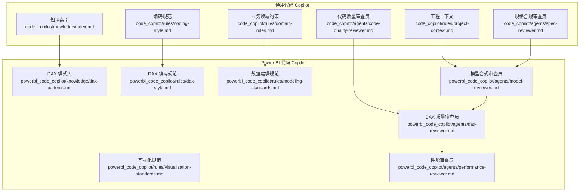
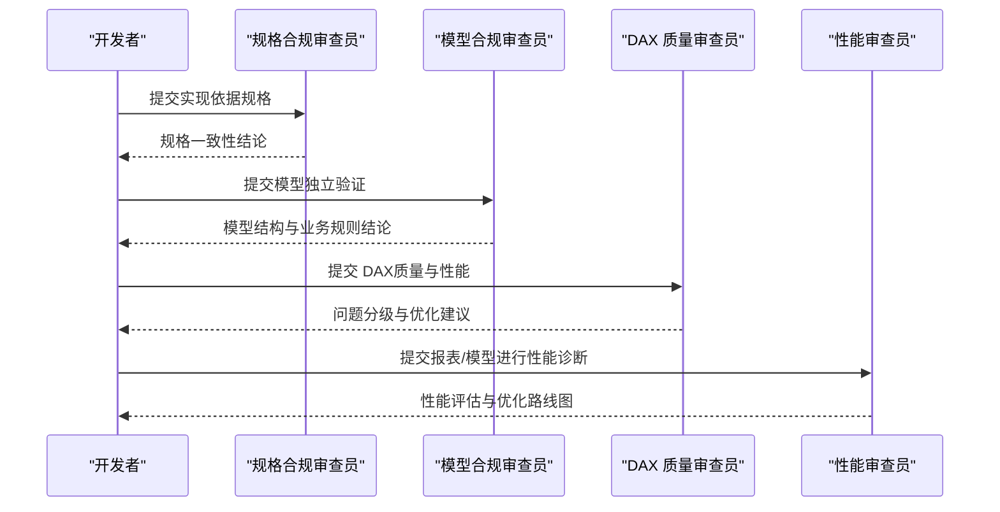
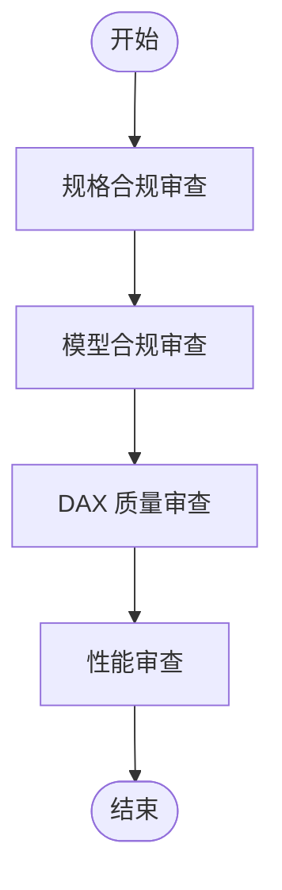
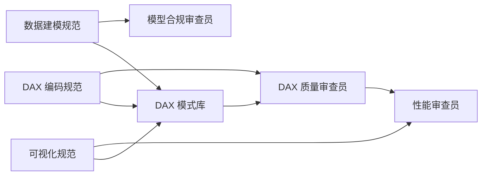

# 知识库和最佳实践

<cite>
**本文档引用的文件**
- [知识索引](file://code_copilot/knowledge/index.md)
- [DAX 模式库](file://powerbi_code_copilot/knowledge/dax-patterns.md)
- [DAX 编码规范](file://powerbi_code_copilot/rules/dax-style.md)
- [数据建模规范](file://powerbi_code_copilot/rules/modeling-standards.md)
- [可视化规范](file://powerbi_code_copilot/rules/visualization-standards.md)
- [DAX 质量审查员](file://powerbi_code_copilot/agents/dax-reviewer.md)
- [模型合规审查员](file://powerbi_code_copilot/agents/model-reviewer.md)
- [性能审查员](file://powerbi_code_copilot/agents/performance-reviewer.md)
- [编码规范](file://code_copilot/rules/coding-style.md)
- [业务领域约束](file://code_copilot/rules/domain-rules.md)
- [工程上下文](file://code_copilot/rules/project-context.md)
- [规格合规审查员](file://code_copilot/agents/spec-reviewer.md)
- [代码质量审查员](file://code_copilot/agents/code-quality-reviewer.md)
</cite>

## 目录
1. [简介](#简介)
2. [项目结构](#项目结构)
3. [核心组件](#核心组件)
4. [架构总览](#架构总览)
5. [详细组件分析](#详细组件分析)
6. [依赖分析](#依赖分析)
7. [性能考量](#性能考量)
8. [故障排查指南](#故障排查指南)
9. [结论](#结论)
10. [附录](#附录)

## 简介
本文件为知识库与最佳实践模块的权威参考，覆盖以下要点：
- 通用知识索引与代码模式识别体系
- Power BI DAX 模式的分类、应用场景与性能优化要点
- 建模、编码与可视化规范
- 审查流程与质量门禁
- 维护与更新机制建议

目标是帮助团队在实际项目中高效复用高质量模式、遵循统一规范、降低返工成本并提升报表性能与可维护性。

## 项目结构
该仓库围绕“代码 Copilot”和“Power BI 代码 Copilot”两条主线构建知识与规范：
- code_copilot：通用代码质量与规范
- powerbi_code_copilot：Power BI 建模、DAX 编码与可视化规范，以及审查流程

**图表来源**
- [知识索引](file://code_copilot/knowledge/index.md)
- [DAX 模式库](file://powerbi_code_copilot/knowledge/dax-patterns.md)
- [DAX 编码规范](file://powerbi_code_copilot/rules/dax-style.md)
- [数据建模规范](file://powerbi_code_copilot/rules/modeling-standards.md)
- [可视化规范](file://powerbi_code_copilot/rules/visualization-standards.md)
- [模型合规审查员](file://powerbi_code_copilot/agents/model-reviewer.md)
- [DAX 质量审查员](file://powerbi_code_copilot/agents/dax-reviewer.md)
- [性能审查员](file://powerbi_code_copilot/agents/performance-reviewer.md)
- [编码规范](file://code_copilot/rules/coding-style.md)
- [业务领域约束](file://code_copilot/rules/domain-rules.md)
- [工程上下文](file://code_copilot/rules/project-context.md)
- [规格合规审查员](file://code_copilot/agents/spec-reviewer.md)
- [代码质量审查员](file://code_copilot/agents/code-quality-reviewer.md)

**章节来源**
- [知识索引](file://code_copilot/knowledge/index.md)
- [DAX 模式库](file://powerbi_code_copilot/knowledge/dax-patterns.md)
- [DAX 编码规范](file://powerbi_code_copilot/rules/dax-style.md)
- [数据建模规范](file://powerbi_code_copilot/rules/modeling-standards.md)
- [可视化规范](file://powerbi_code_copilot/rules/visualization-standards.md)
- [模型合规审查员](file://powerbi_code_copilot/agents/model-reviewer.md)
- [DAX 质量审查员](file://powerbi_code_copilot/agents/dax-reviewer.md)
- [性能审查员](file://powerbi_code_copilot/agents/performance-reviewer.md)
- [编码规范](file://code_copilot/rules/coding-style.md)
- [业务领域约束](file://code_copilot/rules/domain-rules.md)
- [工程上下文](file://code_copilot/rules/project-context.md)
- [规格合规审查员](file://code_copilot/agents/spec-reviewer.md)
- [代码质量审查员](file://code_copilot/agents/code-quality-reviewer.md)

## 核心组件
- 通用知识索引：提供领域知识的轻量索引，便于快速检索与复用
- DAX 模式库：收录经验证的高质量 DAX 模式，包含场景、代码、解释与性能说明
- DAX 编码规范：命名约定、格式规范、编写原则与禁止事项
- 数据建模规范：星型模型优先、关系设计、表与列设计、度量值组织
- 可视化规范：布局、图表选型、交互与移动端适配
- 审查流程：模型合规审查、DAX 质量审查、性能审查，形成闭环质量门禁

**章节来源**
- [知识索引](file://code_copilot/knowledge/index.md)
- [DAX 模式库](file://powerbi_code_copilot/knowledge/dax-patterns.md)
- [DAX 编码规范](file://powerbi_code_copilot/rules/dax-style.md)
- [数据建模规范](file://powerbi_code_copilot/rules/modeling-standards.md)
- [可视化规范](file://powerbi_code_copilot/rules/visualization-standards.md)
- [模型合规审查员](file://powerbi_code_copilot/agents/model-reviewer.md)
- [DAX 质量审查员](file://powerbi_code_copilot/agents/dax-reviewer.md)
- [性能审查员](file://powerbi_code_copilot/agents/performance-reviewer.md)

## 架构总览
审查与质量保障的端到端流程如下：

**图表来源**
- [规格合规审查员](file://code_copilot/agents/spec-reviewer.md)
- [模型合规审查员](file://powerbi_code_copilot/agents/model-reviewer.md)
- [DAX 质量审查员](file://powerbi_code_copilot/agents/dax-reviewer.md)
- [性能审查员](file://powerbi_code_copilot/agents/performance-reviewer.md)

## 详细组件分析

### 通用知识索引与模式识别
- 作用：为领域知识提供“一句话核心逻辑”的轻量索引，便于快速检索与复用
- 维护建议：按“业务知识/技术约定/踩坑记录”三段式持续补充，确保每条索引聚焦一个核心点
- 应用：在审查与开发过程中，优先从索引定位已有模式，减少重复造轮子

**章节来源**
- [知识索引](file://code_copilot/knowledge/index.md)

### DAX 模式库：分类与应用场景
- 累计求和（Running Total）：适用于按日期维度展示从期初到当前的累计值
- 同比/环比（YoY/MoM）：计算同比增长率与环比增长率，注意时间智能函数与除零处理
- 动态 Top N：根据用户选择的 N 值动态展示前 N 名，并将其余归为“其他”
- ABC 分析（帕累托）：按贡献度将项目分为 A/B/C 三类，注意在大数据集上的性能
- 移动平均（Moving Average）：平滑趋势线，适合 N 天/月的滚动分析
- 半加性度量值（Semi-Additive Measures）：库存/余额等快照数据，取最后一天值

性能与优化要点：
- 优先使用时间智能函数（如 SAMEPERIODLASTYEAR、DATESINPERIOD、LASTDATE）
- 使用 REMOVEFILTERS 替代 FILTER(ALL(...)) 以减少筛选器泄漏
- 控制迭代函数（SUMX/AVERAGEX）的迭代规模
- 对大型维度表的排序/RANKX 注意性能阈值

**章节来源**
- [DAX 模式库](file://powerbi_code_copilot/knowledge/dax-patterns.md)

### DAX 编码规范：命名、格式与原则
- 命名约定：度量值、计算列、表的命名前缀与风格；避免与列名冲突
- 表命名：Dim_/Fact_/Bridge_/Param_/CT_/隐藏表等前缀规范
- 格式规范：缩进、换行、注释；复杂度量值必须添加头部注释
- 编写原则：性能优先、上下文清晰、可维护性优先
- 禁止事项：隐式度量值、硬编码日期/参数、EARLIER、过度嵌套 CALCULATE、在计算列中引用度量值

**章节来源**
- [DAX 编码规范](file://powerbi_code_copilot/rules/dax-style.md)

### 数据建模规范：星型模型与关系设计
- 模型架构：星型模型优先，事实表与维度表分离，必要时使用雪花型并说明原因
- 关系设计：1:N（维度→事实），默认单向筛选，禁止循环依赖，每张事实表必须关联日期维度
- 日期表：独立、连续、标记为日期表，包含 Year→Quarter→Month→Week→Day 层级
- 表与列优化：移除未使用列，控制高基数文本列，数值列选择最小精度
- 度量值组织：使用 Display Folder 分组，集中管理度量值

**章节来源**
- [数据建模规范](file://powerbi_code_copilot/rules/modeling-standards.md)

### 可视化规范：布局、图表与交互
- 布局与设计：页面视觉对象数量上限、阅读模式、KPI 卡片位置、色彩与字体规范
- 图表选型：不同分析目的下的图表推荐与禁忌
- 交互设计：切片器、钻取与书签、交叉高亮/筛选
- 移动端适配与可访问性：移动端布局、触控友好、WCAG 2.1 AA 标准

**章节来源**
- [可视化规范](file://powerbi_code_copilot/rules/visualization-standards.md)

### 审查流程与质量门禁
- 规格合规审查：验证实现是否符合规格，关注缺失/多余/偏差/规则落地/数据变更准确性
- 模型合规审查：独立读取模型结构，验证事实/维度/关系/业务规则/模型结构合规
- DAX 质量审查：基于规范进行分级（Critical/Important/Minor），关注上下文转换、重复计算、命名与注释
- 性能审查：从数据源、Power Query、模型、DAX、可视化五层诊断，输出评估与优化路线图

**图表来源**
- [规格合规审查员](file://code_copilot/agents/spec-reviewer.md)
- [模型合规审查员](file://powerbi_code_copilot/agents/model-reviewer.md)
- [DAX 质量审查员](file://powerbi_code_copilot/agents/dax-reviewer.md)
- [性能审查员](file://powerbi_code_copilot/agents/performance-reviewer.md)

**章节来源**
- [规格合规审查员](file://code_copilot/agents/spec-reviewer.md)
- [模型合规审查员](file://powerbi_code_copilot/agents/model-reviewer.md)
- [DAX 质量审查员](file://powerbi_code_copilot/agents/dax-reviewer.md)
- [性能审查员](file://powerbi_code_copilot/agents/performance-reviewer.md)

### 通用编码规范与领域约束
- 编码规范：命名风格、异常处理、日志规范、幂等与并发策略、魔法值常量化
- 业务领域约束：金额单位、时间字段、外部接口超时与降级、状态机变更

**章节来源**
- [编码规范](file://code_copilot/rules/coding-style.md)
- [业务领域约束](file://code_copilot/rules/domain-rules.md)

### 工程上下文与项目背景
- 应用概况：应用名、简介、技术栈、构建工具
- 目录结构与模块职责：入口层、业务编排层、领域能力层、数据访问层
- 关键依赖：中间件与用途

**章节来源**
- [工程上下文](file://code_copilot/rules/project-context.md)

## 依赖分析
- 规范与流程的耦合关系
  - DAX 编码规范与 DAX 模式库共同指导度量值设计与实现
  - 数据建模规范决定 DAX 的可用性与性能上限
  - 可视化规范影响 DAX 的输出形态与交互复杂度
  - 审查流程贯穿开发周期，形成闭环质量门禁

**图表来源**
- [DAX 编码规范](file://powerbi_code_copilot/rules/dax-style.md)
- [DAX 模式库](file://powerbi_code_copilot/knowledge/dax-patterns.md)
- [数据建模规范](file://powerbi_code_copilot/rules/modeling-standards.md)
- [可视化规范](file://powerbi_code_copilot/rules/visualization-standards.md)
- [DAX 质量审查员](file://powerbi_code_copilot/agents/dax-reviewer.md)
- [模型合规审查员](file://powerbi_code_copilot/agents/model-reviewer.md)
- [性能审查员](file://powerbi_code_copilot/agents/performance-reviewer.md)

**章节来源**
- [DAX 编码规范](file://powerbi_code_copilot/rules/dax-style.md)
- [DAX 模式库](file://powerbi_code_copilot/knowledge/dax-patterns.md)
- [数据建模规范](file://powerbi_code_copilot/rules/modeling-standards.md)
- [可视化规范](file://powerbi_code_copilot/rules/visualization-standards.md)
- [DAX 质量审查员](file://powerbi_code_copilot/agents/dax-reviewer.md)
- [模型合规审查员](file://powerbi_code_copilot/agents/model-reviewer.md)
- [性能审查员](file://powerbi_code_copilot/agents/performance-reviewer.md)

## 性能考量
- DAX 层
  - 优先使用时间智能函数与标量函数（如 LASTDATE）
  - 避免深层嵌套 CALCULATE 与大型表迭代
  - 使用 REMOVEFILTERS 替代 FILTER(ALL(...))
  - 通过变量缓存重复计算结果
- 模型层
  - 控制高基数文本列，选择合适的数据类型
  - 清理未使用列/表，减少模型体积
  - 合理选择计算列/计算表/Power Query 预处理
- 可视化层
  - 控制单页视觉对象数量，避免交叉筛选/高基数切片器带来的性能负担
  - 优先使用折线图/柱状图等高效图表，避免 3D 与饼图的性能陷阱

**章节来源**
- [DAX 编码规范](file://powerbi_code_copilot/rules/dax-style.md)
- [数据建模规范](file://powerbi_code_copilot/rules/modeling-standards.md)
- [可视化规范](file://powerbi_code_copilot/rules/visualization-standards.md)
- [性能审查员](file://powerbi_code_copilot/agents/performance-reviewer.md)

## 故障排查指南
- 常见问题与定位
  - 上下文转换错误：检查 CALCULATE 的筛选参数与上下文意图
  - 重复计算：使用 VAR 缓存中间结果
  - 过度迭代：将 SUMX/AVERAGEX 改写为聚合函数或缩小迭代表
  - 时间智能函数误用：确认日期表标记与层级完整性
  - 命名冲突：避免与列名重复，遵循前缀规范
- 审查清单
  - 是否避免不必要的上下文转换
  - CALCULATE 的筛选参数是否最优
  - 迭代函数是否在最小粒度表上运行
  - 是否利用变量避免重复计算
  - 时间智能函数是否正确使用日期表
  - 是否存在可以预计算为计算列的度量值

**章节来源**
- [DAX 质量审查员](file://powerbi_code_copilot/agents/dax-reviewer.md)
- [DAX 编码规范](file://powerbi_code_copilot/rules/dax-style.md)

## 结论
通过统一的知识索引、规范与审查流程，团队可以在 Power BI 项目中实现：
- 快速复用高质量 DAX 模式
- 降低开发与维护成本
- 提升报表性能与可读性
- 建立可持续的知识库与最佳实践体系

## 附录

### 维护与更新机制建议
- 知识索引与模式库
  - 每个模式附带“场景/代码/解释/性能说明”，定期回顾与优化
  - 建立“踩坑记录”板块，沉淀失败案例与教训
- 规范与流程
  - 规范随项目演进持续修订，审查员在每次评审中反馈改进点
  - 工程上下文定期更新，确保 AI 与审查员对项目理解一致
- 审查流程
  - 严格遵循“规格→模型→DAX→性能”的顺序，形成闭环
  - 对 Critical/Important 问题设定修复时限与跟踪机制

**章节来源**
- [知识索引](file://code_copilot/knowledge/index.md)
- [DAX 模式库](file://powerbi_code_copilot/knowledge/dax-patterns.md)
- [工程上下文](file://code_copilot/rules/project-context.md)
- [模型合规审查员](file://powerbi_code_copilot/agents/model-reviewer.md)
- [DAX 质量审查员](file://powerbi_code_copilot/agents/dax-reviewer.md)
- [性能审查员](file://powerbi_code_copilot/agents/performance-reviewer.md)