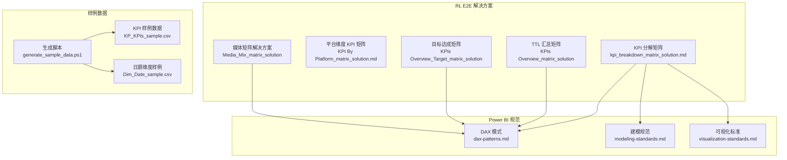
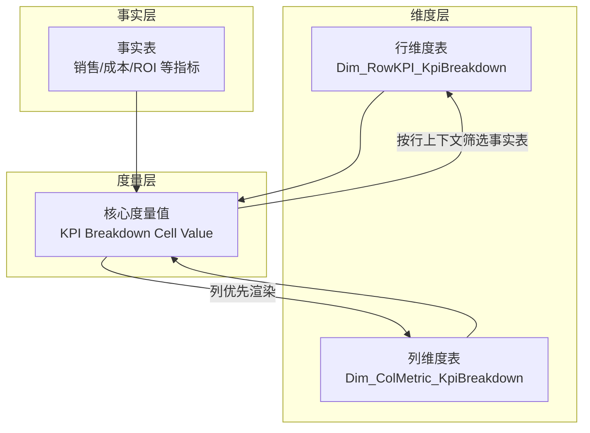
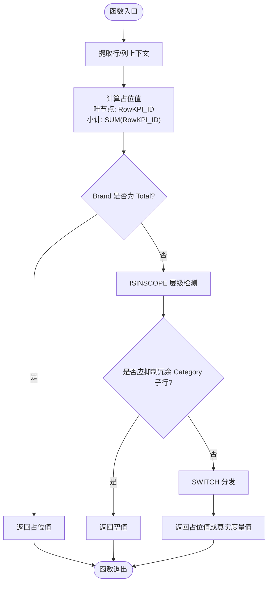
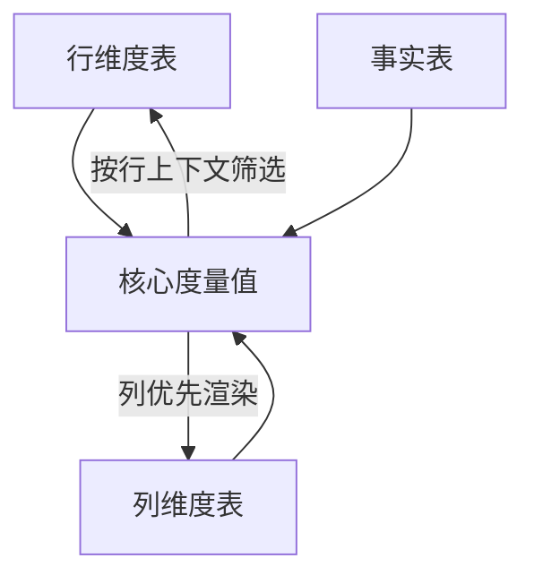
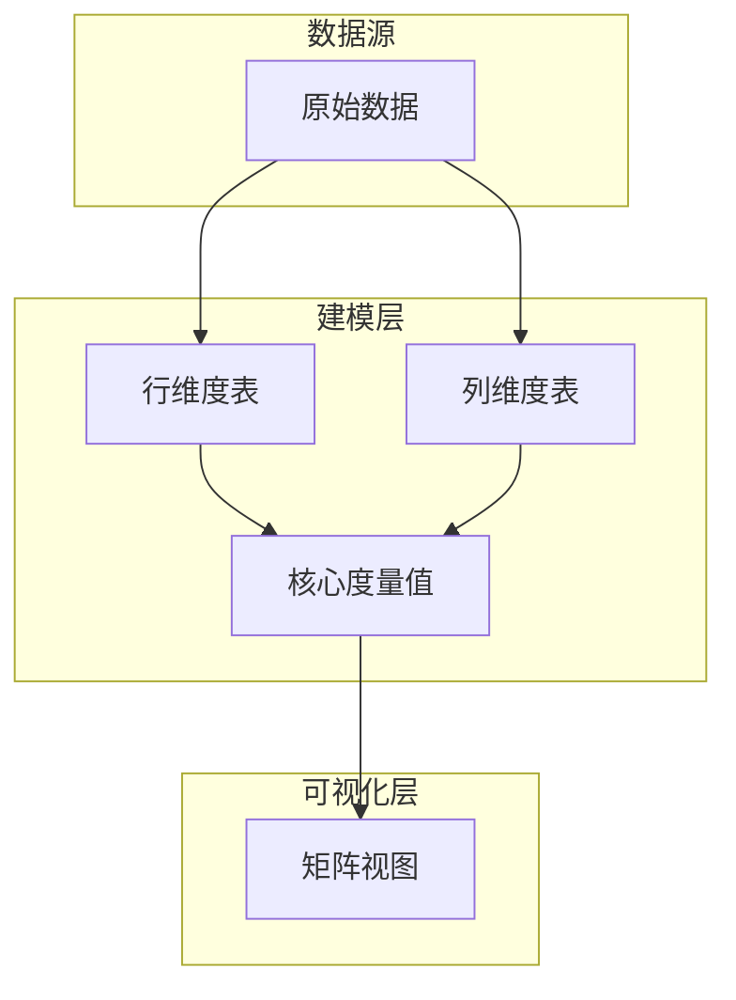
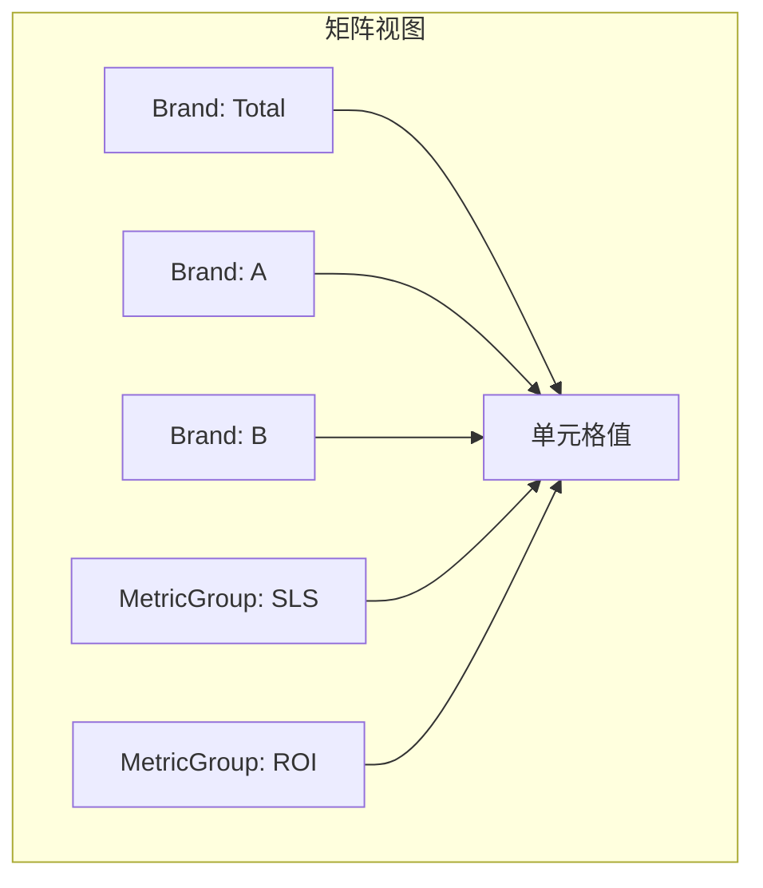

# KPI分解矩阵分析

<cite>
**本文引用的文件**
- [kpi_breakdown_matrix_solution.md](file://RL E2E/RL E2E Traffic_Dashboard/KPI Breakdown/kpi_breakdown_matrix_solution.md)
- [KPI By Platform_matrix_solution.md](file://RL E2E/RL E2E Traffic_Dashboard/KPI By Platform/KPI By Platform_matrix_solution.md)
- [KPIs Overview_matrix_solution](file://RL E2E/RL E2E Traffic_Operation/Overview/TTL汇总/KPIs Overview_matrix_solution)
- [KPIs Overview_Target_matrix_solution](file://RL E2E/RL E2E Traffic_Operation/Overview/目标达成/KPIs Overview_Target_matrix_solution)
- [Media_Mix_matrix_solution](file://RL E2E/RL E2E Traffic_Operation/Overview/TTL汇总/Media_Mix_matrix_solution)
- [generate_sample_data.ps1](file://RL E2E/数据demo/powerbi_data/generate_sample_data.ps1)
- [KP_KPIs_sample.csv](file://RL E2E/数据demo/powerbi_data/KP_KPIs_sample.csv)
- [Dim_Date_sample.csv](file://RL E2E/数据demo/powerbi_data/Dim_Date_sample.csv)
- [dax-patterns.md](file://powerbi_code_copilot/knowledge/dax-patterns.md)
- [modeling-standards.md](file://powerbi_code_copilot/rules/modeling-standards.md)
- [visualization-standards.md](file://powerbi_code_copilot/rules/visualization-standards.md)
</cite>

## 目录
1. [简介](#简介)
2. [项目结构](#项目结构)
3. [核心组件](#核心组件)
4. [架构总览](#架构总览)
5. [详细组件分析](#详细组件分析)
6. [依赖分析](#依赖分析)
7. [性能考虑](#性能考虑)
8. [故障排除指南](#故障排除指南)
9. [结论](#结论)
10. [附录](#附录)

## 简介
本技术文档围绕“KPI分解矩阵分析”功能展开，系统阐述三层级行结构（Brand > Framework > Category）与二层级列结构（MetricGroup > MetricName）的设计与实现要点。重点覆盖以下核心技术点：
- 双维度断开（Disconnected Dimensions）与列头 SWITCH 分发机制
- ISINSCOPE 层级检测与参差层级处理
- Total 行前置分支与占位值计算
- 完整的 DAX 实现步骤（行维度表、列维度表、核心度量值）
- 条件格式化、字体颜色、SVG 图标、交替行背景色等视觉优化
- 血缘关系图与最终矩阵效果示意

该文档旨在帮助开发者快速理解并落地该矩阵分析方案。

## 项目结构
本仓库中与 KPI 分解矩阵分析直接相关的文件主要集中在 RL E2E 目录下，涵盖解决方案文档、样例数据与 Power BI 规范文档。关键文件如下：
- KPI 分解矩阵解决方案：RL E2E/RL E2E Traffic_Dashboard/KPI Breakdown/kpi_breakdown_matrix_solution.md
- 平台维度 KPI 矩阵：RL E2E/RL E2E Traffic_Dashboard/KPI By Platform/KPI By Platform_matrix_solution.md
- TTL 汇总与目标达成矩阵：RL E2E/RL E2E Traffic_Operation/Overview/TTL汇总/KPIs Overview_matrix_solution 与 RL E2E/RL E2E Traffic_Operation/Overview/目标达成/KPIs Overview_Target_matrix_solution
- 媒体矩阵解决方案：RL E2E/RL E2E Traffic_Operation/Overview/TTL汇总/Media_Mix_matrix_solution
- Power BI 规范与模式参考：powerbi_code_copilot 下的 DAX 模式、建模规范与可视化标准

**图表来源**
- [kpi_breakdown_matrix_solution.md](file://RL E2E/RL E2E Traffic_Dashboard/KPI Breakdown/kpi_breakdown_matrix_solution.md)
- [KPI By Platform_matrix_solution.md](file://RL E2E/RL E2E Traffic_Dashboard/KPI By Platform/KPI By Platform_matrix_solution.md)
- [KPIs Overview_matrix_solution](file://RL E2E/RL E2E Traffic_Operation/Overview/TTL汇总/KPIs Overview_matrix_solution)
- [KPIs Overview_Target_matrix_solution](file://RL E2E/RL E2E Traffic_Operation/Overview/目标达成/KPIs Overview_Target_matrix_solution)
- [Media_Mix_matrix_solution](file://RL E2E/RL E2E Traffic_Operation/Overview/TTL汇总/Media_Mix_matrix_solution)
- [dax-patterns.md](file://powerbi_code_copilot/knowledge/dax-patterns.md)
- [modeling-standards.md](file://powerbi_code_copilot/rules/modeling-standards.md)
- [visualization-standards.md](file://powerbi_code_copilot/rules/visualization-standards.md)
- [generate_sample_data.ps1](file://RL E2E/数据demo/powerbi_data/generate_sample_data.ps1)
- [KP_KPIs_sample.csv](file://RL E2E/数据demo/powerbi_data/KP_KPIs_sample.csv)
- [Dim_Date_sample.csv](file://RL E2E/数据demo/powerbi_data/Dim_Date_sample.csv)

**章节来源**
- [kpi_breakdown_matrix_solution.md](file://RL E2E/RL E2E Traffic_Dashboard/KPI Breakdown/kpi_breakdown_matrix_solution.md)
- [KPI By Platform_matrix_solution.md](file://RL E2E/RL E2E Traffic_Dashboard/KPI By Platform/KPI By Platform_matrix_solution.md)
- [KPIs Overview_matrix_solution](file://RL E2E/RL E2E Traffic_Operation/Overview/TTL汇总/KPIs Overview_matrix_solution)
- [KPIs Overview_Target_matrix_solution](file://RL E2E/RL E2E Traffic_Operation/Overview/目标达成/KPIs Overview_Target_matrix_solution)
- [Media_Mix_matrix_solution](file://RL E2E/RL E2E Traffic_Operation/Overview/TTL汇总/Media_Mix_matrix_solution)
- [dax-patterns.md](file://powerbi_code_copilot/knowledge/dax-patterns.md)
- [modeling-standards.md](file://powerbi_code_copilot/rules/modeling-standards.md)
- [visualization-standards.md](file://powerbi_code_copilot/rules/visualization-standards.md)
- [generate_sample_data.ps1](file://RL E2E/数据demo/powerbi_data/generate_sample_data.ps1)
- [KP_KPIs_sample.csv](file://RL E2E/数据demo/powerbi_data/KP_KPIs_sample.csv)
- [Dim_Date_sample.csv](file://RL E2E/数据demo/powerbi_data/Dim_Date_sample.csv)

## 核心组件
本节聚焦于 KPI 分解矩阵的核心组件与职责划分：
- 行维度表（Dim_RowKPI_KpiBreakdown）：承载三层级行结构（Brand > Framework > Category），并提供 RowKPI_ID 用于占位值计算与小计行识别。
- 列维度表（Dim_ColMetric_KpiBreakdown）：承载二层级列结构（MetricGroup > MetricName），并提供 ColMetric_ID 与 MetricGroup、MetricName 字段，支撑 SWITCH 分发。
- 核心度量值（KPI Breakdown Cell Value）：基于行/列上下文进行断开维度计算，结合 ISINSCOPE 层级检测与 Total 行前置分支，实现占位值路由与冗余行抑制。

关键实现要点：
- 双维度断开：行维度与列维度均与事实表断开，避免自动传播影响，确保按需筛选。
- SWITCH 分发：根据列头 MetricGroup 与 MetricName 的组合，路由到对应的占位值或真实度量值。
- ISINSCOPE 层级检测：在 Framework 叶节点场景下，抑制与 Framework 值相同的 Category 冗余子行。
- Total 行前置分支：当 Brand 为 "Total" 时，跳过事实表行筛选，直接返回占位值。
- 占位值计算：叶节点使用 RowKPI_ID，小计行使用 SUM(RowKPI_ID)，再乘以 ColMetric_ID 形成静态占位值。

**章节来源**
- [kpi_breakdown_matrix_solution.md](file://RL E2E/RL E2E Traffic_Dashboard/KPI Breakdown/kpi_breakdown_matrix_solution.md)

## 架构总览
下图展示了 KPI 分解矩阵的数据流与控制流：行维度表与列维度表分别提供上下文，核心度量值在列优先的渲染顺序下，通过 SWITCH 分发到不同指标，并在必要时进行层级抑制与 Total 分支处理。

**图表来源**
- [kpi_breakdown_matrix_solution.md](file://RL E2E/RL E2E Traffic_Dashboard/KPI Breakdown/kpi_breakdown_matrix_solution.md)

## 详细组件分析

### 组件一：行维度表（Dim_RowKPI_KpiBreakdown）
- 结构设计：三层级结构（Brand > Framework > Category），并包含 RowKPI_ID 作为占位值因子。
- 作用：提供行上下文，支持 Total 行与小计行的区分；参与占位值计算与层级抑制逻辑。
- 关键字段：Brand、Framework、Category、RowKPI_ID。

实现要点：
- Total 行：Brand = "Total" 时，核心度量值不附加事实表行筛选条件。
- 小计行：RowKPI_ID 使用 SUM 替代 SELECTEDVALUE，保证小计聚合正确性。

**章节来源**
- [kpi_breakdown_matrix_solution.md](file://RL E2E/RL E2E Traffic_Dashboard/KPI Breakdown/kpi_breakdown_matrix_solution.md)

### 组件二：列维度表（Dim_ColMetric_KpiBreakdown）
- 结构设计：二层级结构（MetricGroup > MetricName），并包含 ColMetric_ID 与 MetricGroup、MetricName。
- 作用：提供列上下文，驱动 SWITCH 分发器，决定当前单元格应显示的指标或占位值。
- 关键字段：MetricGroup、MetricName、ColMetric_ID。

实现要点：
- SWITCH 分发：根据 MetricGroup 与 MetricName 的组合路由到不同占位值或真实度量值。
- 占位值：ColMetric_ID 与 RowKPI_ID（或其聚合）相乘，形成静态占位值。

**章节来源**
- [kpi_breakdown_matrix_solution.md](file://RL E2E/RL E2E Traffic_Dashboard/KPI Breakdown/kpi_breakdown_matrix_solution.md)

### 组件三：核心度量值（KPI Breakdown Cell Value）
- 功能定位：列头 SWITCH 分发器，按行/列上下文返回占位值或真实度量值。
- 控制流：
  1) 提取行上下文（Brand、Framework、Category、RowKPI_ID）与列上下文（ColMetric_ID、MetricGroup、MetricName）。
  2) 计算占位值：叶节点使用 RowKPI_ID，小计行使用 SUM(RowKPI_ID)，再乘以 ColMetric_ID。
  3) ISINSCOPE 层级检测：在 Framework 叶节点场景下，若 Category 与 Framework 值相同，则抑制该 Category 子行。
  4) Total 行前置分支：Brand = "Total" 时，直接返回占位值，不附加事实表行筛选。
  5) SWITCH 分发：根据 MetricGroup 与 MetricName 的组合，返回相应占位值或真实度量值。

**图表来源**
- [kpi_breakdown_matrix_solution.md](file://RL E2E/RL E2E Traffic_Dashboard/KPI Breakdown/kpi_breakdown_matrix_solution.md)

**章节来源**
- [kpi_breakdown_matrix_solution.md](file://RL E2E/RL E2E Traffic_Dashboard/KPI Breakdown/kpi_breakdown_matrix_solution.md)

### 组件四：平台维度 KPI 矩阵（对比参考）
- 设计思路：与 KPI 分解矩阵类似，采用断开维度与列头分发策略，但行维度可能为平台层级。
- 适用场景：需要按平台维度对 KPI 进行矩阵化展示与对比分析。

**章节来源**
- [KPI By Platform_matrix_solution.md](file://RL E2E/RL E2E Traffic_Dashboard/KPI By Platform/KPI By Platform_matrix_solution.md)

### 组件五：TTL 汇总与目标达成矩阵
- TTL 汇总：强调汇总层面的矩阵化呈现，便于观察整体趋势与占比。
- 目标达成：关注目标完成情况的矩阵化展示，辅助决策与追踪。

**章节来源**
- [KPIs Overview_matrix_solution](file://RL E2E/RL E2E Traffic_Operation/Overview/TTL汇总/KPIs Overview_matrix_solution)
- [KPIs Overview_Target_matrix_solution](file://RL E2E/RL E2E Traffic_Operation/Overview/目标达成/KPIs Overview_Target_matrix_solution)

### 组件六：媒体矩阵解决方案
- 设计要点：结合媒体渠道维度与 KPI 指标，形成矩阵化分析视图，便于评估不同渠道的投入产出。

**章节来源**
- [Media_Mix_matrix_solution](file://RL E2E/RL E2E Traffic_Operation/Overview/TTL汇总/Media_Mix_matrix_solution)

## 依赖分析
- 维度与事实断开：行维度表与列维度表均与事实表断开，避免自动传播，确保按需筛选。
- 列优先渲染：Power BI 在矩阵中优先渲染列维度，因此 SWITCH 分发器在列上下文中生效。
- 层级依赖：Framework 与 Category 存在父子层级关系，ISINSCOPE 用于检测当前可视层级，从而抑制冗余子行。
- Total 分支：Brand = "Total" 时，核心度量值不附加事实表行筛选，直接返回占位值。

**图表来源**
- [kpi_breakdown_matrix_solution.md](file://RL E2E/RL E2E Traffic_Dashboard/KPI Breakdown/kpi_breakdown_matrix_solution.md)

**章节来源**
- [kpi_breakdown_matrix_solution.md](file://RL E2E/RL E2E Traffic_Dashboard/KPI Breakdown/kpi_breakdown_matrix_solution.md)

## 性能考虑
- 断开维度与列优先渲染：减少不必要的上下文传播，降低计算复杂度。
- 占位值计算：使用静态乘法代替复杂 CALCULATE，提升渲染性能。
- ISINSCOPE 层级检测：仅在必要层级执行，避免对整表扫描。
- 小计行优化：SUM(RowKPI_ID) 仅在小计行触发，叶节点保持轻量计算。

[本节为通用性能建议，无需特定文件引用]

## 故障排除指南
- 单元格为空值：
  - 检查列维度表是否包含目标 MetricGroup 与 MetricName 组合。
  - 确认 ISINSCOPE 层级检测是否错误抑制了子行。
- Total 行显示异常：
  - 确认 Brand = "Total" 的行记录是否存在。
  - 检查 SWITCH 分发中是否为 Total 分支配置了占位值。
- 小计行数值不正确：
  - 确认小计行使用 SUM(RowKPI_ID) 替代 SELECTEDVALUE。
  - 检查行维度表中 RowKPI_ID 的生成规则是否一致。

**章节来源**
- [kpi_breakdown_matrix_solution.md](file://RL E2E/RL E2E Traffic_Dashboard/KPI Breakdown/kpi_breakdown_matrix_solution.md)

## 结论
KPI 分解矩阵通过“双维度断开 + 列头 SWITCH 分发 + ISINSCOPE 层级检测”的组合，实现了灵活、可扩展且高性能的矩阵化分析。配合 Total 行前置分支与占位值计算，能够有效处理参差层级与冗余行问题。结合 Power BI 视觉优化规范，可进一步提升用户体验与可读性。

[本节为总结性内容，无需特定文件引用]

## 附录

### DAX 实现步骤（不含代码片段，仅步骤说明）
- 步骤一：准备行维度表
  - 创建三层级结构（Brand > Framework > Category），并生成 RowKPI_ID。
  - 确保 Total 行的 Brand 值为 "Total"。
- 步骤二：准备列维度表
  - 创建二层级结构（MetricGroup > MetricName），并生成 ColMetric_ID。
  - 确保 MetricGroup 与 MetricName 的组合覆盖所有目标指标。
- 步骤三：创建核心度量值
  - 提取行/列上下文变量。
  - 计算占位值：叶节点使用 RowKPI_ID，小计行使用 SUM(RowKPI_ID)。
  - 执行 ISINSCOPE 层级检测，必要时抑制冗余子行。
  - 实现 Total 行前置分支。
  - 使用 SWITCH 根据 MetricGroup 与 MetricName 组合返回占位值或真实度量值。
- 步骤四：在 Power BI 中构建矩阵
  - 行轴：Dim_RowKPI_KpiBreakdown（含 Total 行与小计行）。
  - 列轴：Dim_ColMetric_KpiBreakdown（按 MetricGroup 与 MetricName 分组）。
  - 值：核心度量值（KPI Breakdown Cell Value）。
- 步骤五：应用视觉优化
  - 条件格式化：按指标类型设置颜色梯度或阈值色。
  - 字体颜色：重要指标使用高对比度字体颜色。
  - SVG 图标：在行/列标题中嵌入状态或趋势图标。
  - 交替行背景色：提升矩阵可读性。

**章节来源**
- [kpi_breakdown_matrix_solution.md](file://RL E2E/RL E2E Traffic_Dashboard/KPI Breakdown/kpi_breakdown_matrix_solution.md)
- [dax-patterns.md](file://powerbi_code_copilot/knowledge/dax-patterns.md)
- [modeling-standards.md](file://powerbi_code_copilot/rules/modeling-standards.md)
- [visualization-standards.md](file://powerbi_code_copilot/rules/visualization-standards.md)

### 血缘关系图（概念示意）

[本图为概念示意，无需图表来源]

### 最终矩阵效果示意（概念示意）

[本图为概念示意，无需图表来源]