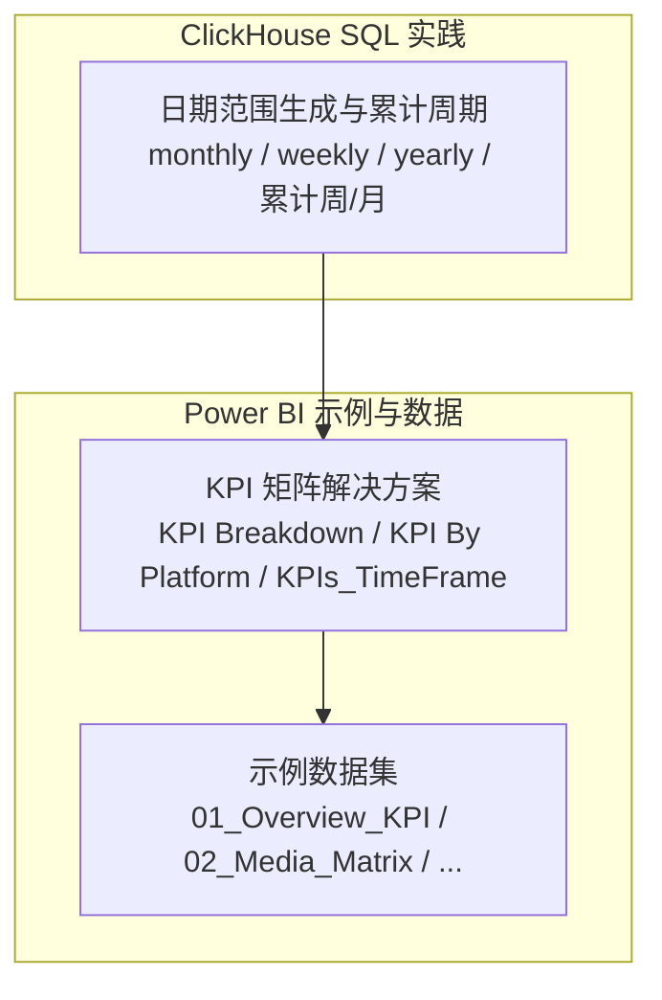
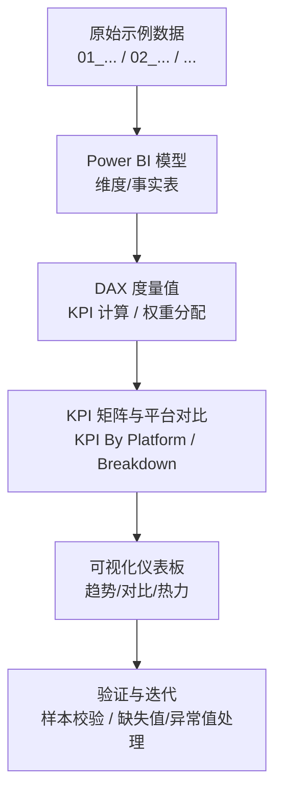
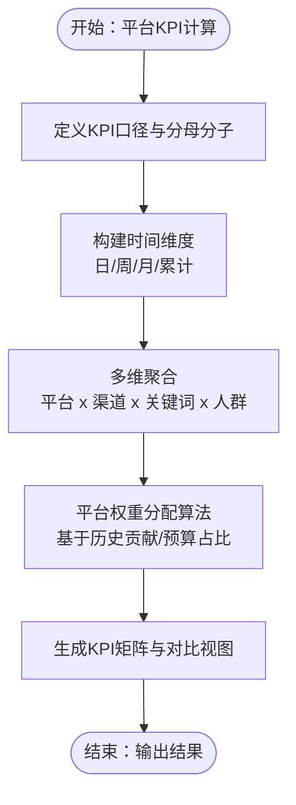
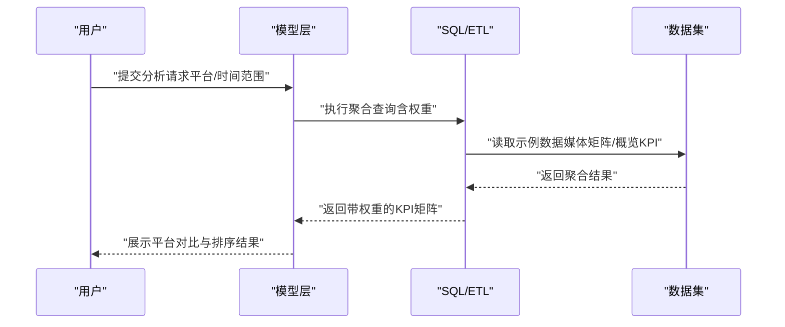
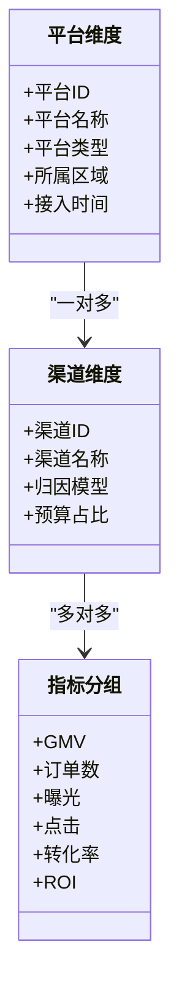
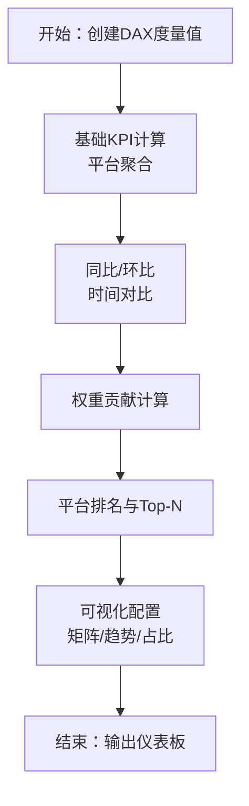
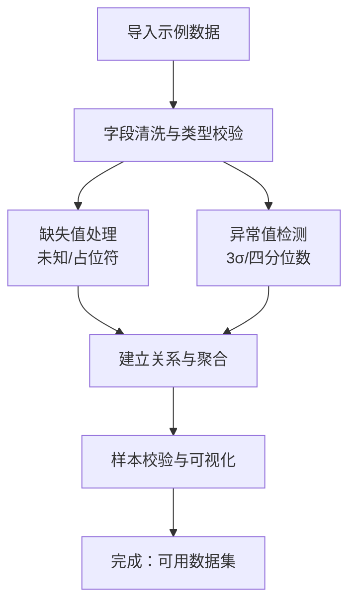
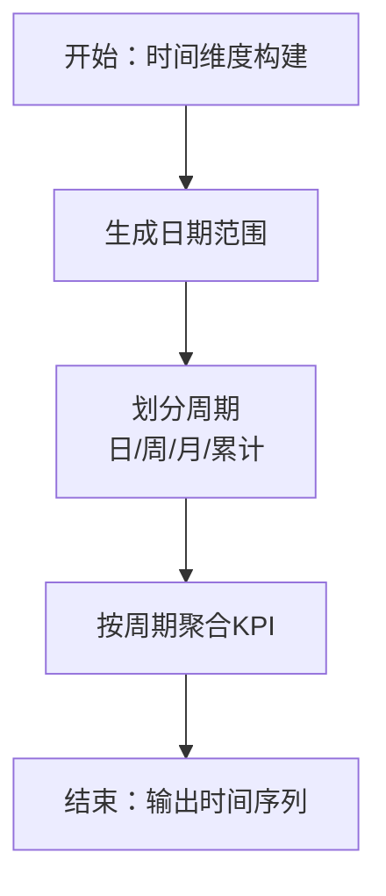
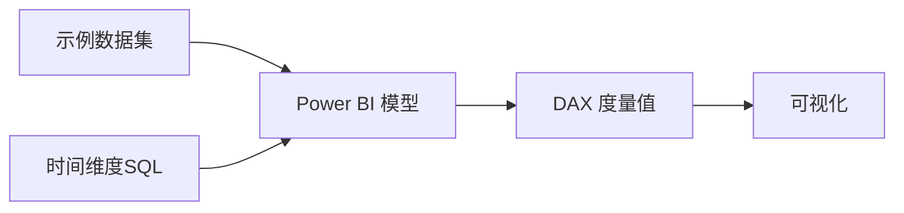

# 平台维度分析

<cite>
**本文引用的文件**
- [kpi_breakdown_matrix_solution.md](file://RL E2E/RL E2E Traffic_Dashboard/KPI Breakdown/kpi_breakdown_matrix_solution.md)
- [KPI By Platform_matrix_solution.md](file://RL E2E/RL E2E Traffic_Dashboard/KPI By Platform/KPI By Platform_matrix_solution.md)
- [KPIs_TimeFrame_solution.md](file://RL E2E/RL E2E Traffic_Dashboard/kPIs/KPIs_TimeFrame_solution.md)
- [01_Overview_KPI.csv](file://RL E2E/数据demo/powerbi_data/01_Overview_KPI.csv)
- [02_Media_Matrix.csv](file://RL E2E/数据demo/powerbi_data/02_Media_Matrix.csv)
- [03_Keywords.csv](file://RL E2E/数据demo/powerbi_data/03_Keywords.csv)
- [04_Crowd.csv](file://RL E2E/数据demo/powerbi_data/04_Crowd.csv)
- [05_Category_Breakthrough.csv](file://RL E2E/数据demo/powerbi_data/05_Category_Breakthrough.csv)
- [06_Fee_Detail.csv](file://RL E2E/数据demo/powerbi_data/06_Fee_Detail.csv)
- [Dim_Date_sample.csv](file://RL E2E/数据demo/powerbi_data/powerbi_traffic/Dim_Date_sample.csv)
- [KP_KPIs_sample.csv](file://RL E2E/数据demo/powerbi_data/powerbi_traffic/KP_KPIs_sample.csv)
- [KP_KPIs_sample - 副本.csv](file://RL E2E/数据demo/powerbi_data/powerbi_traffic/KP_KPIs_sample - 副本.csv)
- [generate_sample_data.ps1](file://RL E2E/数据demo/powerbi_data/powerbi_traffic/generate_sample_data.ps1)
- [generate_data.js](file://RL E2E/数据demo/powerbi_data/generate_data.js)
- [monthly_cumulative_weekly_wiki.md](file://Quickbi_sql/周大福/周大福_日期范围生成_ARRAY JOIN_Clickhou/wiki/monthly_cumulative_weekly_wiki.md)
- [monthly.sql](file://Quickbi_sql/周大福/周大福_日期范围生成_ARRAY JOIN_Clickhou/monthly.sql)
- [monthly_cumulative_weekly.sql](file://Quickbi_sql/周大福/周大福_日期范围生成_ARRAY JOIN_Clickhou/monthly_cumulative_weekly.sql)
- [weekly.sql](file://Quickbi_sql/周大福/周大福_日期范围生成_ARRAY JOIN_Clickhou/weekly.sql)
- [yearly_cumulative_monthly.sql](file://Quickbi_sql/周大福/周大福_日期范围生成_ARRAY JOIN_Clickhou/yearly_cumulative_monthly.sql)
- [clickhouse_date_ranges_wiki.md](file://Quickbi_sql/周大福/周大福_日期范围生成_demo/clickhouse_date_ranges_wiki.md)
- [clickhouse_date_ranges.sql](file://Quickbi_sql/周大福/周大福_日期范围生成_demo/clickhouse_date_ranges.sql)
</cite>

## 目录
1. [引言](#引言)
2. [项目结构](#项目结构)
3. [核心组件](#核心组件)
4. [架构总览](#架构总览)
5. [详细组件分析](#详细组件分析)
6. [依赖分析](#依赖分析)
7. [性能考虑](#性能考虑)
8. [故障排查指南](#故障排查指南)
9. [结论](#结论)
10. [附录](#附录)

## 引言
本技术文档围绕“平台维度分析”主题，系统阐述平台KPI计算逻辑、渠道效果对比方法、平台维度表设计、DAX度量值与可视化配置、数据导入与清洗流程，以及缺失值与异常值处理策略。文档以仓库中已有的矩阵解决方案与示例数据为基础，结合ClickHouse日期范围生成的SQL实践，帮助读者快速理解并落地平台维度分析能力。

## 项目结构
该仓库包含两大部分与平台维度分析直接相关：
- Power BI 示例与解决方案：位于 RL E2E/RL E2E Traffic_Dashboard 下的 KPI 矩阵解决方案与示例数据，涵盖概览KPI、媒体矩阵、关键词、人群、品类突破、费用明细等。
- ClickHouse SQL 实践：位于 Quickbi_sql/周大福 下的日期范围生成与累计周期SQL，可作为时间维度构建与聚合的参考。

**图表来源**
- [KPI By Platform_matrix_solution.md](file://RL E2E/RL E2E Traffic_Dashboard/KPI By Platform/KPI By Platform_matrix_solution.md)
- [kpi_breakdown_matrix_solution.md](file://RL E2E/RL E2E Traffic_Dashboard/KPI Breakdown/kpi_breakdown_matrix_solution.md)
- [KPIs_TimeFrame_solution.md](file://RL E2E/RL E2E Traffic_Dashboard/kPIs/KPIs_TimeFrame_solution.md)
- [01_Overview_KPI.csv](file://RL E2E/数据demo/powerbi_data/01_Overview_KPI.csv)
- [02_Media_Matrix.csv](file://RL E2E/数据demo/powerbi_data/02_Media_Matrix.csv)
- [monthly_cumulative_weekly.sql](file://Quickbi_sql/周大福/周大福_日期范围生成_ARRAY JOIN_Clickhou/monthly_cumulative_weekly.sql)
- [weekly.sql](file://Quickbi_sql/周大福/周大福_日期范围生成_ARRAY JOIN_Clickhou/weekly.sql)

**章节来源**
- [KPI By Platform_matrix_solution.md](file://RL E2E/RL E2E Traffic_Dashboard/KPI By Platform/KPI By Platform_matrix_solution.md)
- [kpi_breakdown_matrix_solution.md](file://RL E2E/RL E2E Traffic_Dashboard/KPI Breakdown/kpi_breakdown_matrix_solution.md)
- [KPIs_TimeFrame_solution.md](file://RL E2E/RL E2E Traffic_Dashboard/kPIs/KPIs_TimeFrame_solution.md)
- [01_Overview_KPI.csv](file://RL E2E/数据demo/powerbi_data/01_Overview_KPI.csv)
- [02_Media_Matrix.csv](file://RL E2E/数据demo/powerbi_data/02_Media_Matrix.csv)
- [03_Keywords.csv](file://RL E2E/数据demo/powerbi_data/03_Keywords.csv)
- [04_Crowd.csv](file://RL E2E/数据demo/powerbi_data/04_Crowd.csv)
- [05_Category_Breakthrough.csv](file://RL E2E/数据demo/powerbi_data/05_Category_Breakthrough.csv)
- [06_Fee_Detail.csv](file://RL E2E/数据demo/powerbi_data/06_Fee_Detail.csv)
- [Dim_Date_sample.csv](file://RL E2E/数据demo/powerbi_data/powerbi_traffic/Dim_Date_sample.csv)
- [KP_KPIs_sample.csv](file://RL E2E/数据demo/powerbi_data/powerbi_traffic/KP_KPIs_sample.csv)
- [KP_KPIs_sample - 副本.csv](file://RL E2E/数据demo/powerbi_data/powerbi_traffic/KP_KPIs_sample - 副本.csv)
- [generate_sample_data.ps1](file://RL E2E/数据demo/powerbi_data/powerbi_traffic/generate_sample_data.ps1)
- [generate_data.js](file://RL E2E/数据demo/powerbi_data/generate_data.js)

## 核心组件
- 平台KPI矩阵解决方案：提供按平台拆解的KPI分解方法与可视化思路，便于对比不同平台的贡献与效率。
- 渠道效果对比矩阵：通过平台权重分配与多维聚合，量化各渠道对整体目标的贡献。
- 时间维度与聚合：基于ClickHouse的日期范围生成SQL，支撑按日/周/月/累计周期的KPI聚合。
- 示例数据集：覆盖概览KPI、媒体矩阵、关键词、人群、品类突破、费用明细等，用于验证分析逻辑与可视化。

**章节来源**
- [KPI By Platform_matrix_solution.md](file://RL E2E/RL E2E Traffic_Dashboard/KPI By Platform/KPI By Platform_matrix_solution.md)
- [kpi_breakdown_matrix_solution.md](file://RL E2E/RL E2E Traffic_Dashboard/KPI Breakdown/kpi_breakdown_matrix_solution.md)
- [monthly_cumulative_weekly.sql](file://Quickbi_sql/周大福/周大福_日期范围生成_ARRAY JOIN_Clickhou/monthly_cumulative_weekly.sql)
- [weekly.sql](file://Quickbi_sql/周大福/周大福_日期范围生成_ARRAY JOIN_Clickhou/weekly.sql)
- [01_Overview_KPI.csv](file://RL E2E/数据demo/powerbi_data/01_Overview_KPI.csv)
- [02_Media_Matrix.csv](file://RL E2E/数据demo/powerbi_data/02_Media_Matrix.csv)
- [03_Keywords.csv](file://RL E2E/数据demo/powerbi_data/03_Keywords.csv)
- [04_Crowd.csv](file://RL E2E/数据demo/powerbi_data/04_Crowd.csv)
- [05_Category_Breakthrough.csv](file://RL E2E/数据demo/powerbi_data/05_Category_Breakthrough.csv)
- [06_Fee_Detail.csv](file://RL E2E/数据demo/powerbi_data/06_Fee_Detail.csv)

## 架构总览
平台维度分析的端到端流程由“数据准备—建模—度量值—可视化—验证”构成。下图展示了从示例数据到KPI矩阵与平台对比的关键路径：

**图表来源**
- [KPI By Platform_matrix_solution.md](file://RL E2E/RL E2E Traffic_Dashboard/KPI By Platform/KPI By Platform_matrix_solution.md)
- [kpi_breakdown_matrix_solution.md](file://RL E2E/RL E2E Traffic_Dashboard/KPI Breakdown/kpi_breakdown_matrix_solution.md)
- [01_Overview_KPI.csv](file://RL E2E/数据demo/powerbi_data/01_Overview_KPI.csv)
- [02_Media_Matrix.csv](file://RL E2E/数据demo/powerbi_data/02_Media_Matrix.csv)
- [03_Keywords.csv](file://RL E2E/数据demo/powerbi_data/03_Keywords.csv)
- [04_Crowd.csv](file://RL E2E/数据demo/powerbi_data/04_Crowd.csv)
- [05_Category_Breakthrough.csv](file://RL E2E/数据demo/powerbi_data/05_Category_Breakthrough.csv)
- [06_Fee_Detail.csv](file://RL E2E/数据demo/powerbi_data/06_Fee_Detail.csv)

## 详细组件分析

### 组件A：平台KPI计算与矩阵分解
- 目标：按平台维度拆解KPI，支持跨期对比与排名。
- 关键点：
  - KPI定义与口径统一（如点击率、转化率、ROI等），确保跨平台可比性。
  - 使用时间维度进行同比/环比，结合累计周期评估趋势。
  - 通过矩阵列/行切分，呈现平台间的相对贡献与效率差异。
- 参考实现路径：
  - [KPI By Platform_matrix_solution.md](file://RL E2E/RL E2E Traffic_Dashboard/KPI By Platform/KPI By Platform_matrix_solution.md)
  - [kpi_breakdown_matrix_solution.md](file://RL E2E/RL E2E Traffic_Dashboard/KPI Breakdown/kpi_breakdown_matrix_solution.md)

**图表来源**
- [KPI By Platform_matrix_solution.md](file://RL E2E/RL E2E Traffic_Dashboard/KPI By Platform/KPI By Platform_matrix_solution.md)
- [kpi_breakdown_matrix_solution.md](file://RL E2E/RL E2E Traffic_Dashboard/KPI Breakdown/kpi_breakdown_matrix_solution.md)
- [monthly_cumulative_weekly.sql](file://Quickbi_sql/周大福/周大福_日期范围生成_ARRAY JOIN_Clickhou/monthly_cumulative_weekly.sql)
- [weekly.sql](file://Quickbi_sql/周大福/周大福_日期范围生成_ARRAY JOIN_Clickhou/weekly.sql)

**章节来源**
- [KPI By Platform_matrix_solution.md](file://RL E2E/RL E2E Traffic_Dashboard/KPI By Platform/KPI By Platform_matrix_solution.md)
- [kpi_breakdown_matrix_solution.md](file://RL E2E/RL E2E Traffic_Dashboard/KPI Breakdown/kpi_breakdown_matrix_solution.md)

### 组件B：渠道效果对比与平台权重分配
- 思路：在平台维度下进一步细分渠道，采用归因或预算法进行权重分配；通过多维聚合得到各平台的综合评分。
- 关键步骤：
  - 渠道归因模型选择（如线性/最后一次点击/时间衰减）。
  - 权重与KPI联动，形成“权重×KPI”的贡献度。
  - 多维度交叉分析，输出平台对比矩阵。
- 参考实现路径：
  - [KPI By Platform_matrix_solution.md](file://RL E2E/RL E2E Traffic_Dashboard/KPI By Platform/KPI By Platform_matrix_solution.md)
  - [02_Media_Matrix.csv](file://RL E2E/数据demo/powerbi_data/02_Media_Matrix.csv)

**图表来源**
- [KPI By Platform_matrix_solution.md](file://RL E2E/RL E2E Traffic_Dashboard/KPI By Platform/KPI By Platform_matrix_solution.md)
- [02_Media_Matrix.csv](file://RL E2E/数据demo/powerbi_data/02_Media_Matrix.csv)
- [01_Overview_KPI.csv](file://RL E2E/数据demo/powerbi_data/01_Overview_KPI.csv)

**章节来源**
- [KPI By Platform_matrix_solution.md](file://RL E2E/RL E2E Traffic_Dashboard/KPI By Platform/KPI By Platform_matrix_solution.md)
- [02_Media_Matrix.csv](file://RL E2E/数据demo/powerbi_data/02_Media_Matrix.csv)
- [01_Overview_KPI.csv](file://RL E2E/数据demo/powerbi_data/01_Overview_KPI.csv)

### 组件C：平台维度表设计与排序规则
- 维度表建议：
  - 平台维度：平台ID/名称/类型/所属区域/接入时间等。
  - 渠道维度：渠道ID/名称/归因模型/预算占比等。
  - 关键词/人群维度：用于细粒度归因与对比。
- 指标分组与排序：
  - 指标分组：GMV/订单/曝光/点击/转化/ROI等。
  - 排序规则：按平台总贡献降序，辅以趋势/预算完成率等辅助排序。
- 参考实现路径：
  - [KPI By Platform_matrix_solution.md](file://RL E2E/RL E2E Traffic_Dashboard/KPI By Platform/KPI By Platform_matrix_solution.md)
  - [03_Keywords.csv](file://RL E2E/数据demo/powerbi_data/03_Keywords.csv)
  - [04_Crowd.csv](file://RL E2E/数据demo/powerbi_data/04_Crowd.csv)

**图表来源**
- [KPI By Platform_matrix_solution.md](file://RL E2E/RL E2E Traffic_Dashboard/KPI By Platform/KPI By Platform_matrix_solution.md)
- [03_Keywords.csv](file://RL E2E/数据demo/powerbi_data/03_Keywords.csv)
- [04_Crowd.csv](file://RL E2E/数据demo/powerbi_data/04_Crowd.csv)

**章节来源**
- [KPI By Platform_matrix_solution.md](file://RL E2E/RL E2E Traffic_Dashboard/KPI By Platform/KPI By Platform_matrix_solution.md)
- [03_Keywords.csv](file://RL E2E/数据demo/powerbi_data/03_Keywords.csv)
- [04_Crowd.csv](file://RL E2E/数据demo/powerbi_data/04_Crowd.csv)

### 组件D：DAX度量值与可视化配置
- 度量值建议：
  - 平台总KPI：按平台聚合的GMV/订单/转化等。
  - 同比/环比：基于时间维度的同比/环比计算。
  - 权重贡献：平台KPI乘以权重后的贡献值。
  - 排名与Top-N：按贡献排序并筛选Top-N平台。
- 可视化建议：
  - 矩阵热力图：平台×指标的热力对比。
  - 趋势折线：多期趋势与目标对比。
  - 饼图/柱状图：平台贡献占比与Top排名。
- 参考实现路径：
  - [KPIs_TimeFrame_solution.md](file://RL E2E/RL E2E Traffic_Dashboard/kPIs/KPIs_TimeFrame_solution.md)
  - [KP_KPIs_sample.csv](file://RL E2E/数据demo/powerbi_data/powerbi_traffic/KP_KPIs_sample.csv)

**图表来源**
- [KPIs_TimeFrame_solution.md](file://RL E2E/RL E2E Traffic_Dashboard/kPIs/KPIs_TimeFrame_solution.md)
- [KP_KPIs_sample.csv](file://RL E2E/数据demo/powerbi_data/powerbi_traffic/KP_KPIs_sample.csv)

**章节来源**
- [KPIs_TimeFrame_solution.md](file://RL E2E/RL E2E Traffic_Dashboard/kPIs/KPIs_TimeFrame_solution.md)
- [KP_KPIs_sample.csv](file://RL E2E/数据demo/powerbi_data/powerbi_traffic/KP_KPIs_sample.csv)

### 组件E：数据导入与处理流程（含缺失值与异常值）
- 导入流程：
  - 使用示例脚本生成样本数据，确保字段一致与格式规范。
  - 将CSV导入Power BI，建立维度与事实表关系。
- 缺失值处理：
  - 平台/渠道缺失：标记为“未知平台/渠道”，纳入汇总但单独标注。
  - 指标缺失：以0或占位符填充，并在可视化中提供“空值说明”。
- 异常值处理：
  - 基于统计方法识别离群点（如3σ/四分位数），提供开关过滤。
  - 对异常平台单独标注，支持交互式排除后再对比。
- 参考实现路径：
  - [generate_sample_data.ps1](file://RL E2E/数据demo/powerbi_data/powerbi_traffic/generate_sample_data.ps1)
  - [generate_data.js](file://RL E2E/数据demo/powerbi_data/generate_data.js)
  - [KP_KPIs_sample - 副本.csv](file://RL E2E/数据demo/powerbi_data/powerbi_traffic/KP_KPIs_sample - 副本.csv)

**图表来源**
- [generate_sample_data.ps1](file://RL E2E/数据demo/powerbi_data/powerbi_traffic/generate_sample_data.ps1)
- [generate_data.js](file://RL E2E/数据demo/powerbi_data/generate_data.js)
- [KP_KPIs_sample - 副本.csv](file://RL E2E/数据demo/powerbi_data/powerbi_traffic/KP_KPIs_sample - 副本.csv)

**章节来源**
- [generate_sample_data.ps1](file://RL E2E/数据demo/powerbi_data/powerbi_traffic/generate_sample_data.ps1)
- [generate_data.js](file://RL E2E/数据demo/powerbi_data/generate_data.js)
- [KP_KPIs_sample - 副本.csv](file://RL E2E/数据demo/powerbi_data/powerbi_traffic/KP_KPIs_sample - 副本.csv)

### 组件F：时间维度与聚合（ClickHouse日期范围生成）
- 目的：为平台KPI提供稳定的时间切片，支持日/周/月/累计周期的对比。
- 方法：
  - 日期范围生成：基于起止日期生成连续序列。
  - 累计周期：按周/月累计，观察趋势变化。
- 参考实现路径：
  - [monthly_cumulative_weekly_wiki.md](file://Quickbi_sql/周大福/周大福_日期范围生成_ARRAY JOIN_Clickhou/wiki/monthly_cumulative_weekly_wiki.md)
  - [monthly.sql](file://Quickbi_sql/周大福/周大福_日期范围生成_ARRAY JOIN_Clickhou/monthly.sql)
  - [weekly.sql](file://Quickbi_sql/周大福/周大福_日期范围生成_ARRAY JOIN_Clickhou/weekly.sql)
  - [yearly_cumulative_monthly.sql](file://Quickbi_sql/周大福/周大福_日期范围生成_ARRAY JOIN_Clickhou/yearly_cumulative_monthly.sql)

**图表来源**
- [monthly_cumulative_weekly_wiki.md](file://Quickbi_sql/周大福/周大福_日期范围生成_ARRAY JOIN_Clickhou/wiki/monthly_cumulative_weekly_wiki.md)
- [monthly.sql](file://Quickbi_sql/周大福/周大福_日期范围生成_ARRAY JOIN_Clickhou/monthly.sql)
- [weekly.sql](file://Quickbi_sql/周大福/周大福_日期范围生成_ARRAY JOIN_Clickhou/weekly.sql)
- [yearly_cumulative_monthly.sql](file://Quickbi_sql/周大福/周大福_日期范围生成_ARRAY JOIN_Clickhou/yearly_cumulative_monthly.sql)

**章节来源**
- [monthly_cumulative_weekly_wiki.md](file://Quickbi_sql/周大福/周大福_日期范围生成_ARRAY JOIN_Clickhou/wiki/monthly_cumulative_weekly_wiki.md)
- [monthly.sql](file://Quickbi_sql/周大福/周大福_日期范围生成_ARRAY JOIN_Clickhou/monthly.sql)
- [weekly.sql](file://Quickbi_sql/周大福/周大福_日期范围生成_ARRAY JOIN_Clickhou/weekly.sql)
- [yearly_cumulative_monthly.sql](file://Quickbi_sql/周大福/周大福_日期范围生成_ARRAY JOIN_Clickhou/yearly_cumulative_monthly.sql)

### 组件G：实际案例与最佳实践
- 案例场景：某品牌在多个电商平台投放，需要评估各平台ROI与趋势，指导预算再分配。
- 最佳实践：
  - 统一口径：明确KPI定义与计算边界，避免口径漂移。
  - 多维验证：用不同维度（平台/渠道/关键词/人群）交叉验证结论。
  - 可视化优先：先用矩阵/热力图看全貌，再用趋势图深挖拐点。
  - 敏感性测试：对异常平台与极端值做排除测试，确认稳健性。
- 参考实现路径：
  - [KPI By Platform_matrix_solution.md](file://RL E2E/RL E2E Traffic_Dashboard/KPI By Platform/KPI By Platform_matrix_solution.md)
  - [05_Category_Breakthrough.csv](file://RL E2E/数据demo/powerbi_data/05_Category_Breakthrough.csv)
  - [06_Fee_Detail.csv](file://RL E2E/数据demo/powerbi_data/06_Fee_Detail.csv)

**章节来源**
- [KPI By Platform_matrix_solution.md](file://RL E2E/RL E2E Traffic_Dashboard/KPI By Platform/KPI By Platform_matrix_solution.md)
- [05_Category_Breakthrough.csv](file://RL E2E/数据demo/powerbi_data/05_Category_Breakthrough.csv)
- [06_Fee_Detail.csv](file://RL E2E/数据demo/powerbi_data/06_Fee_Detail.csv)

## 依赖分析
- 内部依赖：
  - KPI矩阵解决方案依赖示例数据集，确保口径一致与结果可复现。
  - 时间维度SQL为KPI聚合提供稳定的周期切片。
- 外部依赖：
  - Power BI模型与DAX度量值依赖数据质量与字段一致性。
  - 可视化依赖用户交互与参数化（时间范围/Top-N等）。

**图表来源**
- [KPI By Platform_matrix_solution.md](file://RL E2E/RL E2E Traffic_Dashboard/KPI By Platform/KPI By Platform_matrix_solution.md)
- [kpi_breakdown_matrix_solution.md](file://RL E2E/RL E2E Traffic_Dashboard/KPI Breakdown/kpi_breakdown_matrix_solution.md)
- [monthly_cumulative_weekly.sql](file://Quickbi_sql/周大福/周大福_日期范围生成_ARRAY JOIN_Clickhou/monthly_cumulative_weekly.sql)

**章节来源**
- [KPI By Platform_matrix_solution.md](file://RL E2E/RL E2E Traffic_Dashboard/KPI By Platform/KPI By Platform_matrix_solution.md)
- [kpi_breakdown_matrix_solution.md](file://RL E2E/RL E2E Traffic_Dashboard/KPI Breakdown/kpi_breakdown_matrix_solution.md)
- [monthly_cumulative_weekly.sql](file://Quickbi_sql/周大福/周大福_日期范围生成_ARRAY JOIN_Clickhou/monthly_cumulative_weekly.sql)

## 性能考虑
- 数据建模：
  - 维度表尽量去重与标准化，减少关系复杂度。
  - 使用计算列预聚合常用组合，降低DAX计算压力。
- 查询与聚合：
  - 在上游ETL阶段完成粗粒度聚合，避免Power BI侧重复计算。
  - 合理设置时间切片，避免超大结果集。
- 可视化：
  - 控制交互层级，避免深层钻取导致的性能抖动。
  - 使用Top-N与筛选器减少渲染数据量。

## 故障排查指南
- 常见问题：
  - 字段类型不匹配：检查日期/数值/文本类型，确保与示例数据一致。
  - 缺失值导致分组异常：统一替换为空值标签并在可视化中标注。
  - 异常值影响对比：启用异常值过滤开关，对比排除前后的差异。
- 排查步骤：
  - 核对示例脚本生成的数据是否完整。
  - 检查DAX度量值的分母为0保护与空值处理。
  - 对照时间维度SQL的日期范围是否覆盖目标区间。

**章节来源**
- [generate_sample_data.ps1](file://RL E2E/数据demo/powerbi_data/powerbi_traffic/generate_sample_data.ps1)
- [generate_data.js](file://RL E2E/数据demo/powerbi_data/generate_data.js)
- [KP_KPIs_sample - 副本.csv](file://RL E2E/数据demo/powerbi_data/powerbi_traffic/KP_KPIs_sample - 副本.csv)

## 结论
平台维度分析以“统一口径+多维聚合+可视化对比”为核心，结合示例数据与ClickHouse时间维度实践，能够高效产出平台KPI矩阵与渠道对比结果。通过权重分配与敏感性测试，可提升分析结论的稳健性与可操作性。建议在实际项目中持续沉淀口径与模板，形成可复用的分析流水线。

## 附录
- 快速索引：
  - KPI矩阵解决方案：[KPI By Platform_matrix_solution.md](file://RL E2E/RL E2E Traffic_Dashboard/KPI By Platform/KPI By Platform_matrix_solution.md)
  - KPI分解矩阵：[kpi_breakdown_matrix_solution.md](file://RL E2E/RL E2E Traffic_Dashboard/KPI Breakdown/kpi_breakdown_matrix_solution.md)
  - 时间维度SQL：[monthly_cumulative_weekly.sql](file://Quickbi_sql/周大福/周大福_日期范围生成_ARRAY JOIN_Clickhou/monthly_cumulative_weekly.sql)、[weekly.sql](file://Quickbi_sql/周大福/周大福_日期范围生成_ARRAY JOIN_Clickhou/weekly.sql)
  - 示例数据：[01_Overview_KPI.csv](file://RL E2E/数据demo/powerbi_data/01_Overview_KPI.csv)、[02_Media_Matrix.csv](file://RL E2E/数据demo/powerbi_data/02_Media_Matrix.csv)、[03_Keywords.csv](file://RL E2E/数据demo/powerbi_data/03_Keywords.csv)、[04_Crowd.csv](file://RL E2E/数据demo/powerbi_data/04_Crowd.csv)、[05_Category_Breakthrough.csv](file://RL E2E/数据demo/powerbi_data/05_Category_Breakthrough.csv)、[06_Fee_Detail.csv](file://RL E2E/数据demo/powerbi_data/06_Fee_Detail.csv)
  - 样本数据生成：[generate_sample_data.ps1](file://RL E2E/数据demo/powerbi_data/powerbi_traffic/generate_sample_data.ps1)、[generate_data.js](file://RL E2E/数据demo/powerbi_data/generate_data.js)