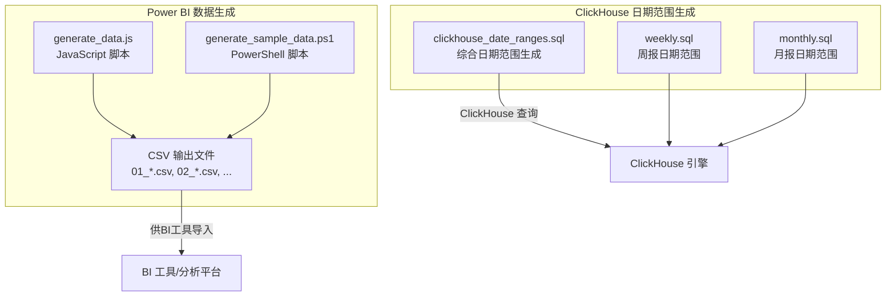
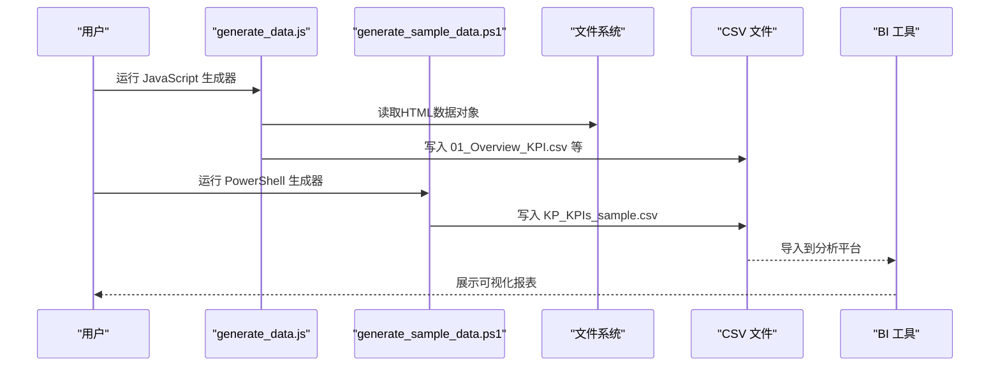
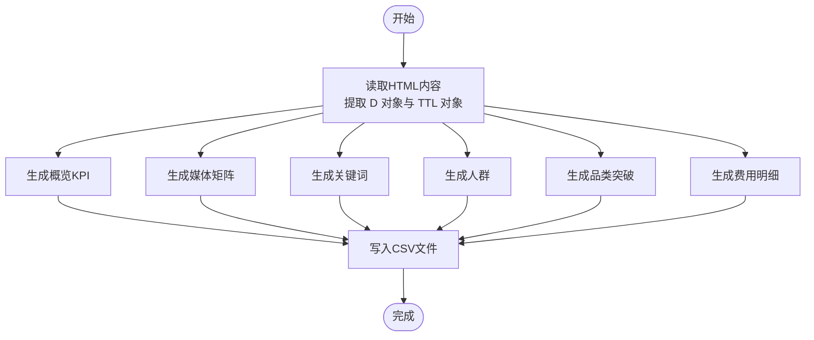
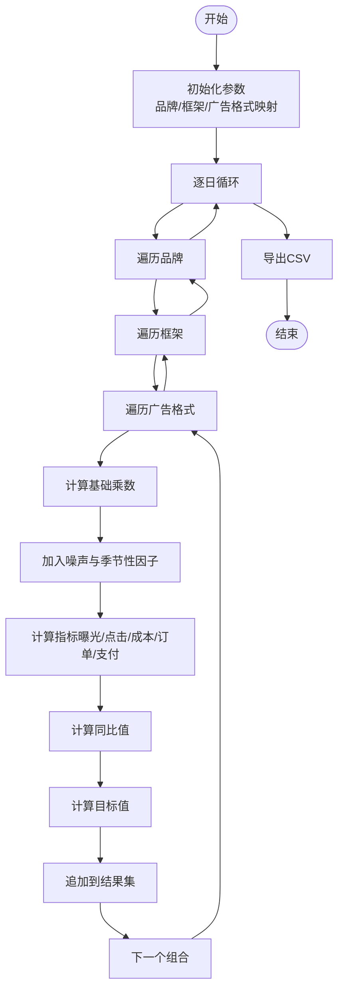
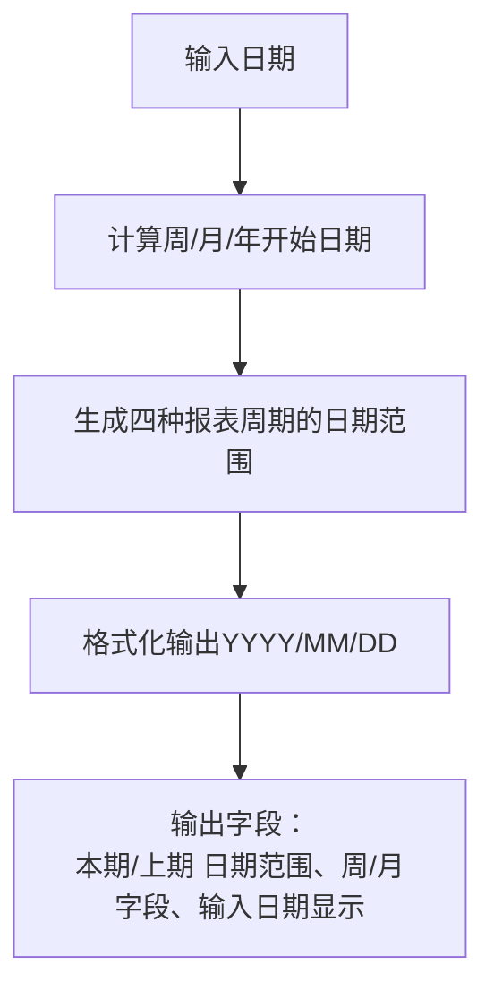
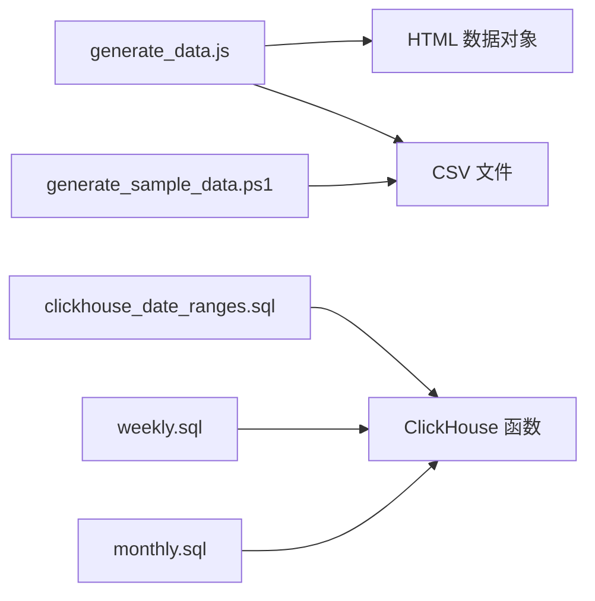

# 数据演示和样例

<cite>
**本文档引用的文件**
- [generate_data.js](file://RL E2E/数据demo/powerbi_data/generate_data.js)
- [generate_sample_data.ps1](file://RL E2E/数据demo/powerbi_data/powerbi_traffic/generate_sample_data.ps1)
- [01_Overview_KPI.csv](file://RL E2E/数据demo/powerbi_data/01_Overview_KPI.csv)
- [02_Media_Matrix.csv](file://RL E2E/数据demo/powerbi_data/02_Media_Matrix.csv)
- [03_Keywords.csv](file://RL E2E/数据demo/powerbi_data/03_Keywords.csv)
- [04_Crowd.csv](file://RL E2E/数据demo/powerbi_data/04_Crowd.csv)
- [05_Category_Breakthrough.csv](file://RL E2E/数据demo/powerbi_data/05_Category_Breakthrough.csv)
- [06_Fee_Detail.csv](file://RL E2E/数据demo/powerbi_data/06_Fee_Detail.csv)
- [KP_KPIs_sample.csv](file://RL E2E/数据demo/powerbi_data/powerbi_traffic/KP_KPIs_sample.csv)
- [clickhouse_date_ranges.sql](file://Quickbi_sql/周大福/周大福_日期范围生成_demo/clickhouse_date_ranges.sql)
- [weekly.sql](file://Quickbi_sql/周大福/周大福_日期范围生成_ARRAY JOIN_Clickhou/weekly.sql)
- [monthly.sql](file://Quickbi_sql/周大福/周大福_日期范围生成_ARRAY JOIN_Clickhou/monthly.sql)
</cite>

## 目录
1. [简介](#简介)
2. [项目结构](#项目结构)
3. [核心组件](#核心组件)
4. [架构概览](#架构概览)
5. [详细组件分析](#详细组件分析)
6. [依赖分析](#依赖分析)
7. [性能考虑](#性能考虑)
8. [故障排除指南](#故障排除指南)
9. [结论](#结论)
10. [附录](#附录)

## 简介
本文件为数据演示和样例功能的技术文档，涵盖样例数据结构与字段定义、数据生成脚本实现原理、数据导入与处理最佳实践、功能测试与性能验证方法，以及数据字典与更新维护指导。目标是帮助用户快速理解并有效使用演示数据，支持业务分析与系统验证。

## 项目结构
该项目围绕两套演示数据集组织：
- Power BI 样例数据：包含6个CSV文件，覆盖概览KPI、媒体矩阵、关键词、人群、品类突破、费用明细等维度。
- ClickHouse 日期范围生成：提供多种报表周期的日期范围计算SQL脚本，支持周报、月报、累计周报、累计月报等场景。

**图表来源**
- [generate_data.js:1-438](file://RL E2E/数据demo/powerbi_data/generate_data.js#L1-L438)
- [generate_sample_data.ps1:1-106](file://RL E2E/数据demo/powerbi_data/powerbi_traffic/generate_sample_data.ps1#L1-L106)
- [clickhouse_date_ranges.sql:1-214](file://Quickbi_sql/周大福/周大福_日期范围生成_demo/clickhouse_date_ranges.sql#L1-L214)
- [weekly.sql:1-117](file://Quickbi_sql/周大福/周大福_日期范围生成_ARRAY JOIN_Clickhou/weekly.sql#L1-L117)
- [monthly.sql:1-109](file://Quickbi_sql/周大福/周大福_日期范围生成_ARRAY JOIN_Clickhou/monthly.sql#L1-L109)

**章节来源**
- [generate_data.js:1-438](file://RL E2E/数据demo/powerbi_data/generate_data.js#L1-L438)
- [generate_sample_data.ps1:1-106](file://RL E2E/数据demo/powerbi_data/powerbi_traffic/generate_sample_data.ps1#L1-L106)
- [clickhouse_date_ranges.sql:1-214](file://Quickbi_sql/周大福/周大福_日期范围生成_demo/clickhouse_date_ranges.sql#L1-L214)
- [weekly.sql:1-117](file://Quickbi_sql/周大福/周大福_日期范围生成_ARRAY JOIN_Clickhou/weekly.sql#L1-L117)
- [monthly.sql:1-109](file://Quickbi_sql/周大福/周大福_日期范围生成_ARRAY JOIN_Clickhou/monthly.sql#L1-L109)

## 核心组件
- JavaScript 数据生成器：从HTML中的数据对象提取并生成6个CSV文件，包含货币转换、百分比格式化、YOY指标等处理逻辑。
- PowerShell KPI样本生成器：按品牌、框架、广告格式生成带噪声的时间序列KPI数据，支持目标值与同比值的生成。
- ClickHouse 日期范围生成器：提供多种报表周期的日期范围计算，包含类型安全的日期运算与格式化输出。
- CSV 样例数据：已生成的Power BI演示数据，用于BI工具直接导入与分析。

**章节来源**
- [generate_data.js:1-438](file://RL E2E/数据demo/powerbi_data/generate_data.js#L1-L438)
- [generate_sample_data.ps1:1-106](file://RL E2E/数据demo/powerbi_data/powerbi_traffic/generate_sample_data.ps1#L1-L106)
- [clickhouse_date_ranges.sql:1-214](file://Quickbi_sql/周大福/周大福_日期范围生成_demo/clickhouse_date_ranges.sql#L1-L214)

## 架构概览
下图展示数据生成与消费的整体流程：

**图表来源**
- [generate_data.js:1-438](file://RL E2E/数据demo/powerbi_data/generate_data.js#L1-L438)
- [generate_sample_data.ps1:1-106](file://RL E2E/数据demo/powerbi_data/powerbi_traffic/generate_sample_data.ps1#L1-L106)

## 详细组件分析

### Power BI 数据生成器（JavaScript）
- 输入：HTML中嵌入的D对象与TTL对象。
- 处理：遍历渠道、币种，计算成本、GMV、ROI、转化率等指标；按YOY与目标值生成同比与目标列。
- 输出：6个CSV文件，分别对应概览KPI、媒体矩阵、关键词、人群、品类突破、费用明细。
- 特点：支持美元/人民币汇率转换、百分比格式化、总计行生成。

**图表来源**
- [generate_data.js:1-438](file://RL E2E/数据demo/powerbi_data/generate_data.js#L1-L438)

**章节来源**
- [generate_data.js:1-438](file://RL E2E/数据demo/powerbi_data/generate_data.js#L1-L438)

### Power BI KPI样本生成器（PowerShell）
- 输入：起止日期、品牌映射、框架与广告格式组合。
- 处理：按品牌/框架/广告格式生成基础值，加入季节性与周末因子噪声，计算点击、订单、支付金额等指标，并生成同比与目标值。
- 输出：KP_KPIs_sample.csv，包含日期、品牌、框架、广告格式、曝光、点击、成本、订单数、支付金额等字段。

**图表来源**
- [generate_sample_data.ps1:1-106](file://RL E2E/数据demo/powerbi_data/powerbi_traffic/generate_sample_data.ps1#L1-L106)

**章节来源**
- [generate_sample_data.ps1:1-106](file://RL E2E/数据demo/powerbi_data/powerbi_traffic/generate_sample_data.ps1#L1-L106)

### ClickHouse 日期范围生成器
- 综合脚本：支持周报、月累计周报、月报、年累计月报四种周期，包含类型安全的日期运算与格式化输出。
- 单独脚本：weekly.sql与monthly.sql分别生成周报与月报的日期范围，并通过ARRAY JOIN将成对字段展开。

**图表来源**
- [clickhouse_date_ranges.sql:1-214](file://Quickbi_sql/周大福/周大福_日期范围生成_demo/clickhouse_date_ranges.sql#L1-L214)
- [weekly.sql:1-117](file://Quickbi_sql/周大福/周大福_日期范围生成_ARRAY JOIN_Clickhou/weekly.sql#L1-L117)
- [monthly.sql:1-109](file://Quickbi_sql/周大福/周大福_日期范围生成_ARRAY JOIN_Clickhou/monthly.sql#L1-L109)

**章节来源**
- [clickhouse_date_ranges.sql:1-214](file://Quickbi_sql/周大福/周大福_日期范围生成_demo/clickhouse_date_ranges.sql#L1-L214)
- [weekly.sql:1-117](file://Quickbi_sql/周大福/周大福_日期范围生成_ARRAY JOIN_Clickhou/weekly.sql#L1-L117)
- [monthly.sql:1-109](file://Quickbi_sql/周大福/周大福_日期范围生成_ARRAY JOIN_Clickhou/monthly.sql#L1-L109)

## 依赖分析
- JavaScript 生成器依赖：
  - 文件系统对象（ActiveXObject）读取HTML与写入CSV。
  - HTML中包含D与TTL数据对象，用于生成KPI与总计行。
- PowerShell 生成器依赖：
  - .NET随机数生成器与日期时间对象。
  - CSV导出模块（Export-Csv）。
- ClickHouse 脚本依赖：
  - ClickHouse内置日期函数（toMonday、toStartOfMonth、toStartOfYear等）与类型安全的日期运算。

**图表来源**
- [generate_data.js:1-438](file://RL E2E/数据demo/powerbi_data/generate_data.js#L1-L438)
- [generate_sample_data.ps1:1-106](file://RL E2E/数据demo/powerbi_data/powerbi_traffic/generate_sample_data.ps1#L1-L106)
- [clickhouse_date_ranges.sql:1-214](file://Quickbi_sql/周大福/周大福_日期范围生成_demo/clickhouse_date_ranges.sql#L1-L214)

**章节来源**
- [generate_data.js:1-438](file://RL E2E/数据demo/powerbi_data/generate_data.js#L1-L438)
- [generate_sample_data.ps1:1-106](file://RL E2E/数据demo/powerbi_data/powerbi_traffic/generate_sample_data.ps1#L1-L106)
- [clickhouse_date_ranges.sql:1-214](file://Quickbi_sql/周大福/周大福_日期范围生成_demo/clickhouse_date_ranges.sql#L1-L214)

## 性能考虑
- JavaScript 生成器：
  - 使用UTF-8编码读取HTML，避免字符集问题导致的解析失败。
  - 将所有数值计算封装为辅助函数，便于复用与调试。
- PowerShell 生成器：
  - 使用固定种子的随机数生成器保证可重复性。
  - 指定UTF-8编码导出CSV，避免乱码。
- ClickHouse 日期范围生成器：
  - 使用类型安全的日期运算（如INTERVAL 1 DAY），避免混合类型导致的性能与精度问题。
  - 通过CTE分层构建，提升可读性与可维护性。

[本节为通用建议，无需具体文件引用]

## 故障排除指南
- JavaScript 生成器常见问题：
  - HTML路径不正确：检查HTML路径是否指向实际存在的文件。
  - 编码问题：确保HTML以UTF-8保存，脚本以UTF-8读取。
  - CSV写入权限：确认运行账户对输出目录具有写入权限。
- PowerShell 生成器常见问题：
  - 权限不足：以管理员身份运行PowerShell或调整执行策略。
  - 字符集问题：确保CSV导出时指定UTF-8编码。
- ClickHouse 日期范围生成器常见问题：
  - 类型混合：使用INTERVAL语法替代裸整数减法，避免Date/Date32类型混合。
  - 日期边界：注意月末/年末的边界处理，确保上期结束日期正确。

**章节来源**
- [generate_data.js:1-438](file://RL E2E/数据demo/powerbi_data/generate_data.js#L1-L438)
- [generate_sample_data.ps1:1-106](file://RL E2E/数据demo/powerbi_data/powerbi_traffic/generate_sample_data.ps1#L1-L106)
- [clickhouse_date_ranges.sql:1-214](file://Quickbi_sql/周大福/周大福_日期范围生成_demo/clickhouse_date_ranges.sql#L1-L214)

## 结论
本技术文档提供了完整的数据演示与样例功能说明，涵盖Power BI样例数据的结构与生成脚本、ClickHouse日期范围生成器的实现原理，以及导入与处理的最佳实践。通过这些工具与数据，用户可以快速搭建演示环境，进行功能测试与性能验证，并基于数据字典理解各表之间的关系与用途。

[本节为总结性内容，无需具体文件引用]

## 附录

### 数据字典与字段说明

#### 01_Overview_KPI.csv（概览KPI）
- 字段说明：渠道、币种、成本、GMV、GMV占比、ROI、新投资占比、订单数、CPO、转化率、券金额、成本同比、净销售额、净销售额同比、需求、需求同比、新客成本、现有成本、DT、NT、成本YoY、GMV YoY、ROI YoY、订单数 YoY、CPO YoY、转化率 YoY、需求 YoY、净销售额 YoY、目标GMV占比、目标ROI、目标转化率。
- 作用：展示整体营销效果与目标对比，支持多币种与总计行。

**章节来源**
- [01_Overview_KPI.csv:1-7](file://RL E2E/数据demo/powerbi_data/01_Overview_KPI.csv#L1-L7)

#### 02_Media_Matrix.csv（媒体矩阵）
- 字段说明：渠道、币种、媒体名称、是否小计、是否总计、成本、成本占比、曝光、点击、购物车、订单数、GMV、CTR、CPC、CPA、转化率、AOV、ROI、成本YoY、曝光YoY、点击YoY、购物车YoY、订单数YoY、GMV YoY、CTR YoY、CPC YoY、CPA YoY、转化率YoY、AOV YoY、ROI YoY。
- 作用：按媒体维度拆解投放效果，支持子总计与总计行。

**章节来源**
- [02_Media_Matrix.csv:1-33](file://RL E2E/数据demo/powerbi_data/02_Media_Matrix.csv#L1-L33)

#### 03_Keywords.csv（关键词）
- 字段说明：渠道、币种、层级、父类目、关键词、成本、成本占比、曝光、点击、购物车、订单数、GMV、转化率、CTR、CPC、购物车成本、ROI。
- 作用：展示关键词层面的投放与转化表现，支持层级化父子关系。

**章节来源**
- [03_Keywords.csv:1-73](file://RL E2E/数据demo/powerbi_data/03_Keywords.csv#L1-L73)

#### 04_Crowd.csv（人群）
- 字段说明：渠道、币种、一级人群、二级人群、三级人群、人群名称、成本、成本占比、曝光、点击、购物车、订单数、GMV、CTR、CPC、转化率、购物车成本、ROI。
- 作用：按人群维度拆解投放效果，支持多级人群层级关系。

**章节来源**
- [04_Crowd.csv:1-63](file://RL E2E/数据demo/powerbi_data/04_Crowd.csv#L1-L63)

#### 05_Category_Breakthrough.csv（品类突破）
- 字段说明：渠道、币种、视图类型、标签、父标签、EOH占比、活跃ID数、净销售额占比、需求占比、成本、成本占比、购物车成本、ROI、ID WoW、净销售额WoW、成本WoW、成本占比WoW、购物车成本WoW、ROI WoW。
- 作用：展示品类突破维度的指标变化，支持Super Season、Label、Framework等视图类型。

**章节来源**
- [05_Category_Breakthrough.csv:1-125](file://RL E2E/数据demo/powerbi_data/05_Category_Breakthrough.csv#L1-L125)

#### 06_Fee_Detail.csv（费用明细）
- 字段说明：渠道、币种、平台、部门、分类、子渠道、费用、费用占比、是否小计。
- 作用：展示费用明细与占比，支持小计行。

**章节来源**
- [06_Fee_Detail.csv:1-45](file://RL E2E/数据demo/powerbi_data/06_Fee_Detail.csv#L1-L45)

#### KP_KPIs_sample.csv（KPI样本）
- 字段说明：日期、品牌、框架、广告格式、曝光、点击、成本、订单数、支付金额、新客户数、新客户成本、新客户支付金额、成本同比、支付金额同比、新客户数同比、新客户成本同比、新客户支付金额同比、成本目标、支付金额目标、新客户数目标、新客户成本目标。
- 作用：提供时间序列KPI样本，支持目标与同比对比。

**章节来源**
- [KP_KPIs_sample.csv:1-582](file://RL E2E/数据demo/powerbi_data/powerbi_traffic/KP_KPIs_sample.csv#L1-L582)

### 数据导入与处理最佳实践
- 数据清洗：
  - 统一日期格式（YYYY-MM-DD），确保排序与筛选正确。
  - 去除空值与异常值，对百分比字段进行范围校验（0-1或0-100）。
- 格式转换：
  - 数值字段统一为数字类型，文本字段统一编码（UTF-8）。
  - 货币字段保留两位小数，ROI/CVR等比率保留四位小数。
- 验证方法：
  - 校验总计行与子合计一致性。
  - 对比同比与目标值的计算逻辑。
  - 使用可视化交叉验证关键指标趋势。

[本节为通用建议，无需具体文件引用]

### 功能测试与性能验证
- 功能测试：
  - 导入CSV到BI工具，验证图表与表格的正确性。
  - 检查总计行、子总计行与小计行的显示。
  - 验证同比与目标值的动态计算。
- 性能验证：
  - 大数据量CSV的加载与渲染性能。
  - 日期范围生成器在不同输入日期下的执行时间与准确性。

[本节为通用建议，无需具体文件引用]

### 数据更新与维护指导
- 更新频率：根据业务需要定期更新，建议按月或按季度更新。
- 数据质量：建立字段校验规则与异常监控，确保数据准确性与时效性。
- 版本管理：对生成脚本与样例数据进行版本控制，便于回溯与审计。

[本节为通用建议，无需具体文件引用]