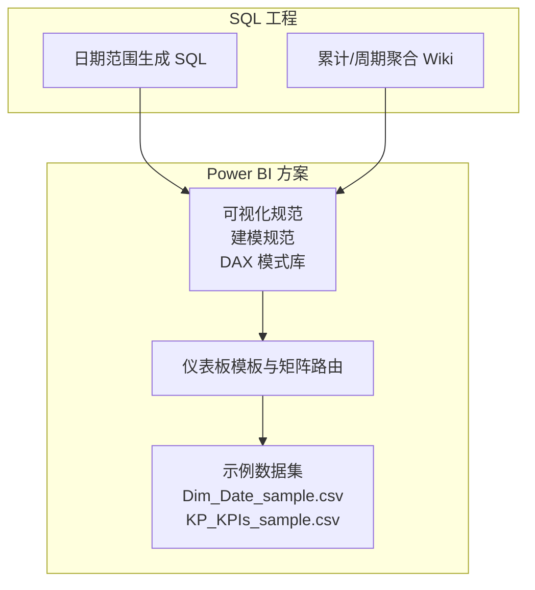
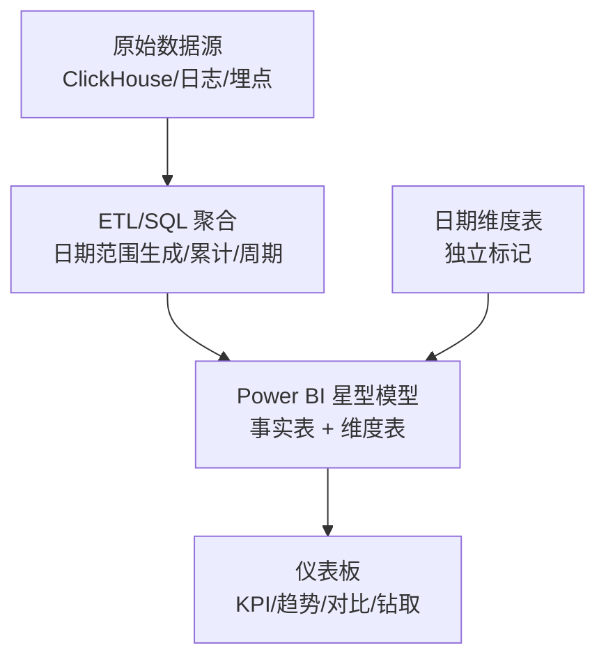
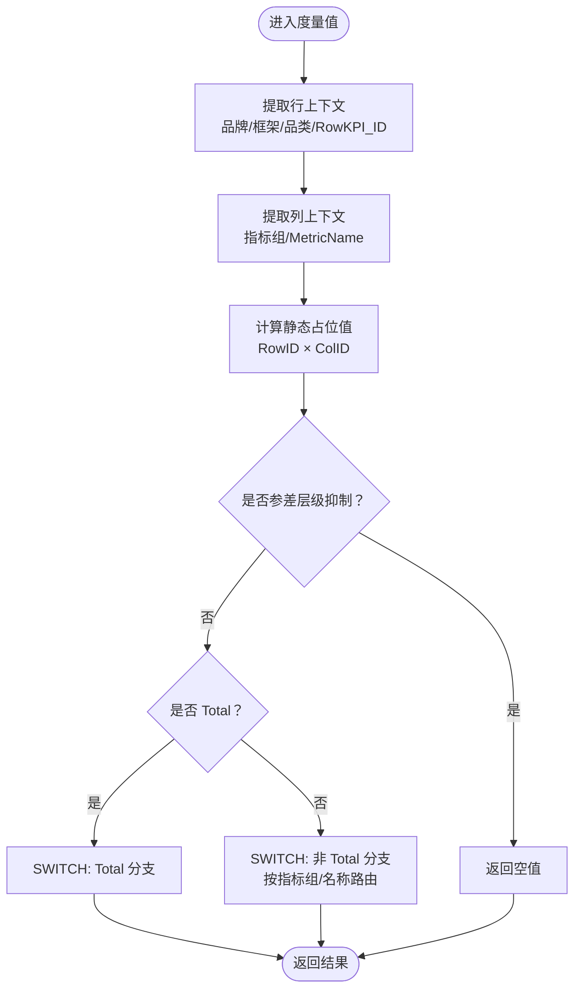
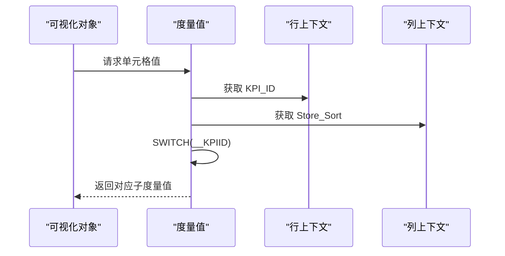
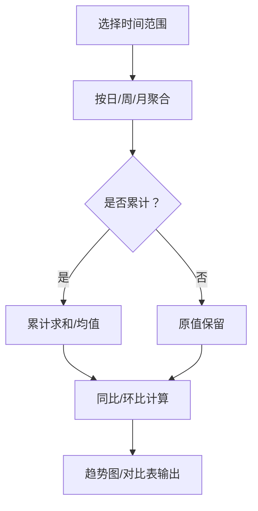
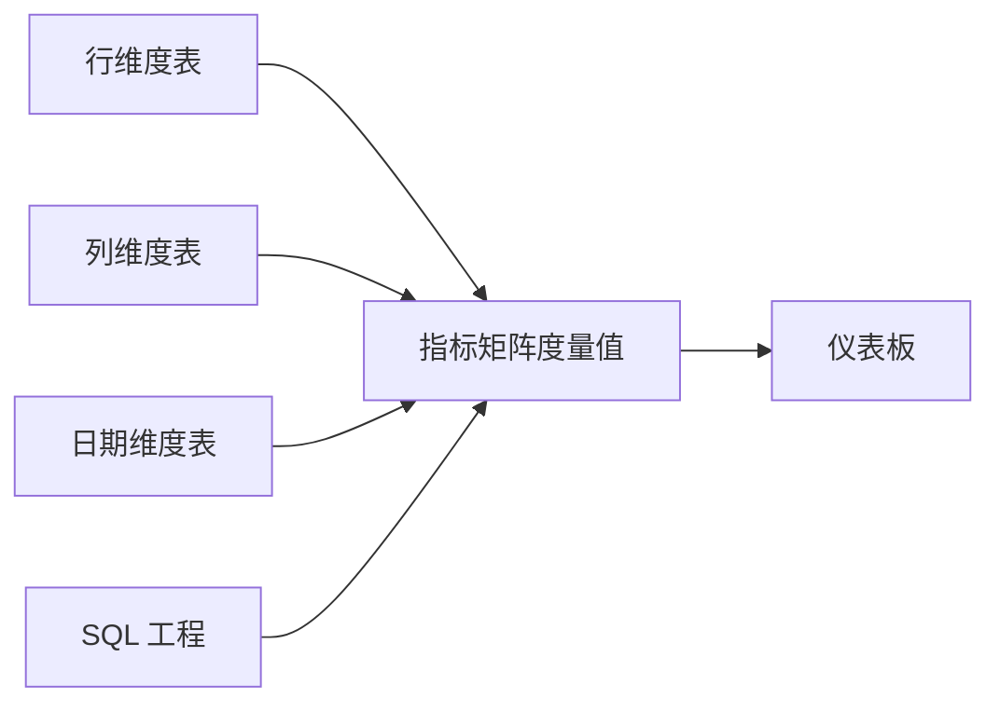

# 流量监控仪表板

<cite>
**本文引用的文件**
- [kpi_breakdown_matrix_solution.md](file://RL E2E/RL E2E Traffic_Dashboard/KPI Breakdown/kpi_breakdown_matrix_solution.md)
- [KPI By Platform_matrix_solution.md](file://RL E2E/RL E2E Traffic_Dashboard/KPI By Platform/KPI By Platform_matrix_solution.md)
- [KPIs_TimeFrame_solution.md](file://RL E2E/RL E2E Traffic_Dashboard/kPIs/KPIs_TimeFrame_solution.md)
- [visualization-standards.md](file://powerbi_code_copilot/rules/visualization-standards.md)
- [modeling-standards.md](file://powerbi_code_copilot/rules/modeling-standards.md)
- [dax-patterns.md](file://powerbi_code_copilot/knowledge/dax-patterns.md)
- [Dim_Date_sample.csv](file://RL E2E/数据demo/powerbi_data/powerbi_traffic/Dim_Date_sample.csv)
- [KP_KPIs_sample.csv](file://RL E2E/数据demo/powerbi_data/powerbi_traffic/KP_KPIs_sample.csv)
- [generate_sample_data.ps1](file://RL E2E/数据demo/powerbi_data/powerbi_traffic/generate_sample_data.ps1)
- [clickhouse_date_ranges.sql](file://Quickbi_sql/周大福/周大福_日期范围生成_demo/clickhouse_date_ranges.sql)
- [monthly_cumulative_weekly_wiki.md](file://Quickbi_sql/周大福/周大福_日期范围生成_ARRAY JOIN_Clickhou/wiki/monthly_cumulative_weekly_wiki.md)
</cite>

## 目录
1. [简介](#简介)
2. [项目结构](#项目结构)
3. [核心组件](#核心组件)
4. [架构总览](#架构总览)
5. [详细组件分析](#详细组件分析)
6. [依赖分析](#依赖分析)
7. [性能考量](#性能考量)
8. [故障排查指南](#故障排查指南)
9. [结论](#结论)
10. [附录](#附录)

## 简介
本技术文档面向“流量监控仪表板”的设计与实现，聚焦以下目标：
- 指标定义与计算：点击率、转化率、跳出率等关键指标的实现逻辑与口径说明。
- 实时监控：数据刷新机制、阈值与告警策略的落地思路。
- 时间框架分析：日、周、月等多维聚合与趋势分析方法。
- Power BI 仪表板设计：图表类型选择、交互设计与用户体验优化。
- 数据模型：事实表/维度表设计、关系建立与性能优化。
- 异常检测：基于统计与规则的异常识别与预警。

## 项目结构
本仓库围绕“流量监控”主题提供了两类关键资产：
- Power BI 方案与规范：包含可视化规范、建模规范、DAX 模式库以及示例数据。
- SQL 工程（ClickHouse）：提供日期范围生成与累计聚合的参考实现，便于对接实时数据源。

**章节来源**
- [visualization-standards.md:1-81](file://powerbi_code_copilot/rules/visualization-standards.md#L1-L81)
- [modeling-standards.md:1-55](file://powerbi_code_copilot/rules/modeling-standards.md#L1-L55)
- [dax-patterns.md](file://powerbi_code_copilot/knowledge/dax-patterns.md)
- [Dim_Date_sample.csv](file://RL E2E/数据demo/powerbi_data/powerbi_traffic/Dim_Date_sample.csv)
- [KP_KPIs_sample.csv](file://RL E2E/数据demo/powerbi_data/powerbi_traffic/KP_KPIs_sample.csv)
- [clickhouse_date_ranges.sql](file://Quickbi_sql/周大福/周大福_日期范围生成_demo/clickhouse_date_ranges.sql)
- [monthly_cumulative_weekly_wiki.md](file://Quickbi_sql/周大福/周大福_日期范围生成_ARRAY JOIN_Clickhou/wiki/monthly_cumulative_weekly_wiki.md)

## 核心组件
- 指标矩阵与路由：通过“行/列维度 + SWITCH 路由”的方式，将多个指标统一在一个单元格中按上下文动态返回对应度量值，便于在仪表板中快速切换指标与分组。
- 时间框架聚合：提供日、周、月等多粒度的时间聚合能力，支持累计与同比/环比趋势分析。
- 可视化与交互：遵循统一的图表选型、布局与交互规范，确保 KPI 卡片、趋势图、对比图等在不同设备上的可用性。
- 数据模型：采用星型模型，事实表存放可度量事件，维度表存放描述属性；日期表独立并标记为日期表，支撑时间智能筛选与层级钻取。
- 示例数据：提供日期维度与 KPI 指标样本数据，便于快速搭建与验证。

**章节来源**
- [kpi_breakdown_matrix_solution.md:231-366](file://RL E2E/RL E2E Traffic_Dashboard/KPI Breakdown/kpi_breakdown_matrix_solution.md#L231-L366)
- [KPI By Platform_matrix_solution.md:200-257](file://RL E2E/RL E2E Traffic_Dashboard/KPI By Platform/KPI By Platform_matrix_solution.md#L200-L257)
- [KPIs_TimeFrame_solution.md](file://RL E2E/RL E2E Traffic_Dashboard/kPIs/KPIs_TimeFrame_solution.md)
- [visualization-standards.md:31-66](file://powerbi_code_copilot/rules/visualization-standards.md#L31-L66)
- [modeling-standards.md:9-37](file://powerbi_code_copilot/rules/modeling-standards.md#L9-L37)
- [Dim_Date_sample.csv](file://RL E2E/数据demo/powerbi_data/powerbi_traffic/Dim_Date_sample.csv)
- [KP_KPIs_sample.csv](file://RL E2E/数据demo/powerbi_data/powerbi_traffic/KP_KPIs_sample.csv)

## 架构总览
仪表板整体架构由“数据层（ClickHouse/ODS）→ 清洗与聚合（SQL/ETL）→ Power BI 模型（星型）→ 仪表板（可视化+交互）”构成。时间维度通过独立日期表驱动，指标通过矩阵路由在运行时按上下文分发。

**图表来源**
- [clickhouse_date_ranges.sql](file://Quickbi_sql/周大福/周大福_日期范围生成_demo/clickhouse_date_ranges.sql)
- [monthly_cumulative_weekly_wiki.md](file://Quickbi_sql/周大福/周大福_日期范围生成_ARRAY JOIN_Clickhou/wiki/monthly_cumulative_weekly_wiki.md)
- [modeling-standards.md:9-37](file://powerbi_code_copilot/rules/modeling-standards.md#L9-L37)

## 详细组件分析

### 指标矩阵与路由（KPI Breakdown）
该组件通过“行维度 + 列维度 + SWITCH 路由”实现指标的动态分发，支持：
- 行上下文：品牌/框架/品类/行 ID
- 列上下文：指标组/指标名
- 动态占位值：RowKPI_ID × ColMetric_ID，小计行使用 SUM 替代
- 参差层级抑制：在特定层级抑制冗余子行
- 未来替换：将占位值替换为真实度量值（如点击率、转化率、跳出率等）

**图表来源**
- [kpi_breakdown_matrix_solution.md:231-366](file://RL E2E/RL E2E Traffic_Dashboard/KPI Breakdown/kpi_breakdown_matrix_solution.md#L231-L366)

**章节来源**
- [kpi_breakdown_matrix_solution.md:231-366](file://RL E2E/RL E2E Traffic_Dashboard/KPI Breakdown/kpi_breakdown_matrix_solution.md#L231-L366)

### 指标矩阵与路由（KPI By Platform）
该组件通过 KPI_ID 与 Store_Sort 的组合进行动态路由，将同一行在不同列返回不同子度量值，适用于平台/渠道维度下的指标对比。

**图表来源**
- [KPI By Platform_matrix_solution.md:200-257](file://RL E2E/RL E2E Traffic_Dashboard/KPI By Platform/KPI By Platform_matrix_solution.md#L200-L257)

**章节来源**
- [KPI By Platform_matrix_solution.md:200-257](file://RL E2E/RL E2E Traffic_Dashboard/KPI By Platform/KPI By Platform_matrix_solution.md#L200-L257)

### 时间框架聚合与趋势分析
- 日/周/月聚合：通过独立日期维度表与层级关系，支持按日、周（基于周起始日）、月聚合。
- 累计与同比/环比：Wiki 文档提供累计与周期聚合的实现思路，便于在 Power BI 中构建累计曲线与同比/环比趋势。
- 仪表板实践：结合矩阵路由与时间切片器，实现多时间粒度的对比与钻取。

**图表来源**
- [KPIs_TimeFrame_solution.md](file://RL E2E/RL E2E Traffic_Dashboard/kPIs/KPIs_TimeFrame_solution.md)
- [monthly_cumulative_weekly_wiki.md](file://Quickbi_sql/周大福/周大福_日期范围生成_ARRAY JOIN_Clickhou/wiki/monthly_cumulative_weekly_wiki.md)

**章节来源**
- [KPIs_TimeFrame_solution.md](file://RL E2E/RL E2E Traffic_Dashboard/kPIs/KPIs_TimeFrame_solution.md)
- [monthly_cumulative_weekly_wiki.md](file://Quickbi_sql/周大福/周大福_日期范围生成_ARRAY JOIN_Clickhou/wiki/monthly_cumulative_weekly_wiki.md)

### Power BI 仪表板设计方案
- 图表选型：趋势类用折线/面积图；对比类用柱状/条形图；占比类用环形/堆叠柱；关联类用散点/气泡；KPI 展示用卡片/仪表盘。
- 布局与交互：KPI 卡片置于顶部；切片器固定于顶部/左侧；钻取路径遵循业务层级；默认交叉高亮，谨慎使用交叉筛选。
- 移动端适配：优先展示关键 KPI；按钮与切片器尺寸适合触摸；避免宽矩阵/表格。
- 可访问性：为所有对象添加替代文本；保证色彩对比度；避免仅依赖颜色传达信息。

**章节来源**
- [visualization-standards.md:7-80](file://powerbi_code_copilot/rules/visualization-standards.md#L7-L80)

### 数据模型构建方法
- 星型模型：事实表存放可度量事件，维度表存放描述属性；仅在确有必要时使用雪花型。
- 表类型标识：Fact_XXX、Dim_XXX、Bridge_XXX、CT_XXX、_XXX 等约定清晰。
- 关系设计：1:N（维度→事实），默认单向筛选；禁止循环依赖；每张事实表必须关联日期维度。
- 日期表：独立连续日期范围，标记为日期表，包含 Year→Quarter→Month→Week→Day 层级。
- 表设计：事实表仅保留外键与度量值；维度表包含代理键与业务键及全部描述属性；小型维度表可使用 Dual 存储模式（DirectQuery 场景）。

**章节来源**
- [modeling-standards.md:9-55](file://powerbi_code_copilot/rules/modeling-standards.md#L9-L55)

### 示例数据与生成脚本
- 示例数据：包含日期维度与 KPI 指标样本，便于快速搭建与验证。
- 生成脚本：提供 PowerShell 与 JavaScript 脚本，用于生成样本数据，便于本地调试与演示。

**章节来源**
- [Dim_Date_sample.csv](file://RL E2E/数据demo/powerbi_data/powerbi_traffic/Dim_Date_sample.csv)
- [KP_KPIs_sample.csv](file://RL E2E/数据demo/powerbi_data/powerbi_traffic/KP_KPIs_sample.csv)
- [generate_sample_data.ps1](file://RL E2E/数据demo/powerbi_data/powerbi_traffic/generate_sample_data.ps1)

## 依赖分析
- 组件耦合：指标矩阵依赖行/列维度表与日期表；矩阵路由通过度量值实现低耦合扩展。
- 外部依赖：SQL 工程提供日期范围与累计聚合的实现思路，可对接 ClickHouse 等数据源。
- 关系约束：事实表与维度表之间为 1:N 关系，日期表为事实表的必需关联；关系文档化有助于维护与审计。

**图表来源**
- [kpi_breakdown_matrix_solution.md:231-366](file://RL E2E/RL E2E Traffic_Dashboard/KPI Breakdown/kpi_breakdown_matrix_solution.md#L231-L366)
- [KPI By Platform_matrix_solution.md:200-257](file://RL E2E/RL E2E Traffic_Dashboard/KPI By Platform/KPI By Platform_matrix_solution.md#L200-L257)
- [modeling-standards.md:24-43](file://powerbi_code_copilot/rules/modeling-standards.md#L24-L43)

**章节来源**
- [modeling-standards.md:24-43](file://powerbi_code_copilot/rules/modeling-standards.md#L24-L43)

## 性能考量
- 刷新策略：事实表采用增量刷新，维度表使用缓存或 Dual 存储模式；日期表保持连续完整。
- 查询优化：避免跨表大连接；使用合适的切片器与筛选器；减少不必要的列加载。
- 交互优化：默认交叉高亮，谨慎启用交叉筛选；限制每页视觉对象数量；移动端布局优先关键指标。
- 可视化优化：避免 3D 图表与过多分类的饼图；不截断 Y 轴；控制颜色种类与对比度。

**章节来源**
- [modeling-standards.md:45-55](file://powerbi_code_copilot/rules/modeling-standards.md#L45-L55)
- [visualization-standards.md:44-80](file://powerbi_code_copilot/rules/visualization-standards.md#L44-L80)

## 故障排查指南
- 指标为空或为 BLANK：检查行/列上下文是否正确传递；确认参差层级抑制逻辑；核对 SWITCH 分支是否覆盖。
- 时间维度异常：检查日期表是否标记为日期表；确认层级关系是否完整；核对时间切片器范围。
- 交互失效：检查交叉筛选/高亮设置；确认切片器数量与布局；移动端布局是否合理。
- 模型关系错误：核对 1:N 关系方向；避免循环依赖；确认事实表是否关联日期维度。
- SQL 聚合问题：核对日期范围生成逻辑；确认累计/周期聚合的边界处理。

**章节来源**
- [kpi_breakdown_matrix_solution.md:266-272](file://RL E2E/RL E2E Traffic_Dashboard/KPI Breakdown/kpi_breakdown_matrix_solution.md#L266-L272)
- [modeling-standards.md:24-37](file://powerbi_code_copilot/rules/modeling-standards.md#L24-L37)
- [clickhouse_date_ranges.sql](file://Quickbi_sql/周大福/周大福_日期范围生成_demo/clickhouse_date_ranges.sql)

## 结论
本方案以“矩阵路由 + 星型模型 + 统一可视化规范”为核心，提供可扩展、可维护、可交互的流量监控仪表板实现路径。通过明确的指标定义、时间框架聚合与异常检测思路，能够有效支撑日常运营与决策分析。

## 附录
- 指标定义建议（示例口径，供讨论与确认）：
  - 点击率：点击次数 / 展示次数
  - 转化率：转化次数 / 流量（或点击）次数
  - 跳出率：仅访问一个页面的会话数 / 总会话数
  - 平均停留时长：总停留时长 / 会话数
  - 客单价：成交金额 / 成交订单数
- 实时监控与告警（建议流程）：
  - 数据刷新：采用增量刷新 + 定时触发；关键指标设置延迟阈值。
  - 阈值与告警：基于历史分位数/标准差设定阈值；区分严重/警告级别；联动邮件/IM 通知。
  - 异常检测：统计异常（Z-score/四分位）与规则异常（突增/突降/零值）双轨并行。
- 仪表板交互建议：
  - 固定切片器位置；提供“全选/清除”；钻取路径清晰；工具提示简洁。
- 数据模型建议：
  - 事实表只保留度量值与外键；维度表包含完整属性；日期表独立并标记；关系文档化。