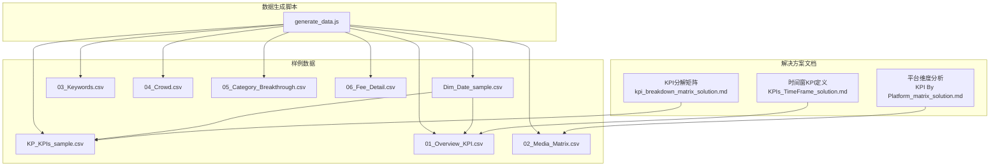
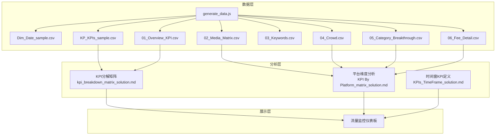
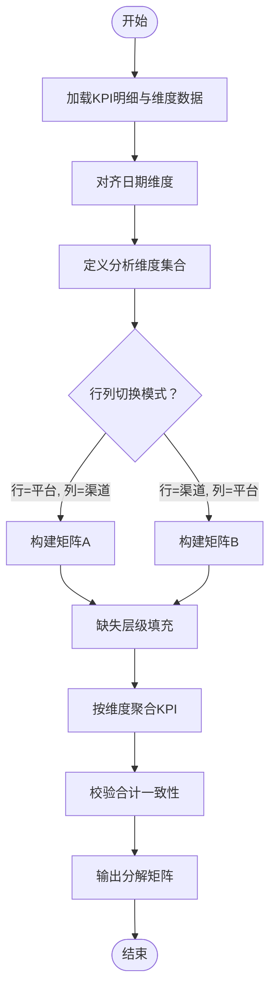
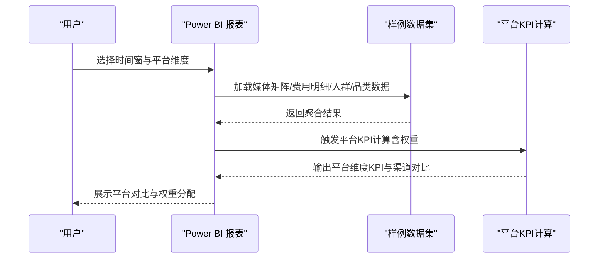
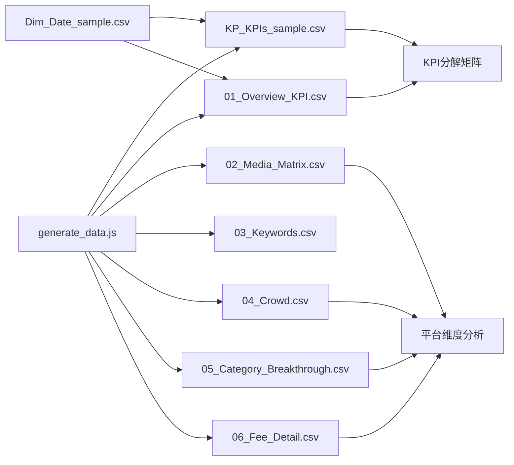

# 营销效果分析模块

<cite>
**本文引用的文件**
- [kpi_breakdown_matrix_solution.md](file://RL E2E/RL E2E Traffic_Dashboard/KPI Breakdown/kpi_breakdown_matrix_solution.md)
- [KPI By Platform_matrix_solution.md](file://RL E2E/RL E2E Traffic_Dashboard/KPI By Platform/KPI By Platform_matrix_solution.md)
- [KPIs_TimeFrame_solution.md](file://RL E2E/RL E2E Traffic_Dashboard/kPIs/KPIs_TimeFrame_solution.md)
- [generate_data.js](file://RL E2E/数据demo/powerbi_data/generate_data.js)
- [Dim_Date_sample.csv](file://RL E2E/数据demo/powerbi_data/powerbi_traffic/Dim_Date_sample.csv)
- [KP_KPIs_sample.csv](file://RL E2E/数据demo/powerbi_data/powerbi_traffic/KP_KPIs_sample.csv)
- [01_Overview_KPI.csv](file://RL E2E/数据demo/powerbi_data/01_Overview_KPI.csv)
- [02_Media_Matrix.csv](file://RL E2E/数据demo/powerbi_data/02_Media_Matrix.csv)
- [03_Keywords.csv](file://RL E2E/数据demo/powerbi_data/03_Keywords.csv)
- [04_Crowd.csv](file://RL E2E/数据demo/powerbi_data/04_Crowd.csv)
- [05_Category_Breakthrough.csv](file://RL E2E/数据demo/powerbi_data/05_Category_Breakthrough.csv)
- [06_Fee_Detail.csv](file://RL E2E/数据demo/powerbi_data/06_Fee_Detail.csv)
</cite>

## 目录
1. [简介](#简介)
2. [项目结构](#项目结构)
3. [核心组件](#核心组件)
4. [架构总览](#架构总览)
5. [详细组件分析](#详细组件分析)
6. [依赖关系分析](#依赖关系分析)
7. [性能考虑](#性能考虑)
8. [故障排查指南](#故障排查指南)
9. [结论](#结论)
10. [附录](#附录)

## 简介
本技术文档面向“营销效果分析模块”，围绕以下目标展开：  
- 解释KPI分解矩阵分析的计算逻辑与维度分析方法（含行列切换与参差层级处理）  
- 说明平台维度分析的实现原理（平台KPI计算、渠道效果对比、平台权重分配）  
- 介绍流量监控仪表板的设计思路与实时监控实现方法  
- 提供样例数据结构与数据生成脚本说明，帮助理解数据模型与分析流程  

该模块以Power BI与ClickHouse为基础，结合样例数据与解决方案文档，形成从数据准备到可视化呈现的完整链路。

## 项目结构
营销效果分析模块主要由三部分组成：  
- 解决方案文档：KPI分解矩阵、平台维度分析、时间窗KPI定义等  
- 样例数据：包含日期维表、KPI明细、媒体矩阵、关键词、人群、品类突破、费用明细等CSV文件  
- 数据生成脚本：用于自动生成符合模型的数据集，便于测试与演示  

**图表来源**
- [kpi_breakdown_matrix_solution.md](file://RL E2E/RL E2E Traffic_Dashboard/KPI Breakdown/kpi_breakdown_matrix_solution.md)
- [KPI By Platform_matrix_solution.md](file://RL E2E/RL E2E Traffic_Dashboard/KPI By Platform/KPI By Platform_matrix_solution.md)
- [KPIs_TimeFrame_solution.md](file://RL E2E/RL E2E Traffic_Dashboard/kPIs/KPIs_TimeFrame_solution.md)
- [generate_data.js](file://RL E2E/数据demo/powerbi_data/generate_data.js)
- [Dim_Date_sample.csv](file://RL E2E/数据demo/powerbi_data/powerbi_traffic/Dim_Date_sample.csv)
- [KP_KPIs_sample.csv](file://RL E2E/数据demo/powerbi_data/powerbi_traffic/KP_KPIs_sample.csv)
- [01_Overview_KPI.csv](file://RL E2E/数据demo/powerbi_data/01_Overview_KPI.csv)
- [02_Media_Matrix.csv](file://RL E2E/数据demo/powerbi_data/02_Media_Matrix.csv)
- [03_Keywords.csv](file://RL E2E/数据demo/powerbi_data/03_Keywords.csv)
- [04_Crowd.csv](file://RL E2E/数据demo/powerbi_data/04_Crowd.csv)
- [05_Category_Breakthrough.csv](file://RL E2E/数据demo/powerbi_data/05_Category_Breakthrough.csv)
- [06_Fee_Detail.csv](file://RL E2E/数据demo/powerbi_data/06_Fee_Detail.csv)

**章节来源**
- [kpi_breakdown_matrix_solution.md](file://RL E2E/RL E2E Traffic_Dashboard/KPI Breakdown/kpi_breakdown_matrix_solution.md)
- [KPI By Platform_matrix_solution.md](file://RL E2E/RL E2E Traffic_Dashboard/KPI By Platform/KPI By Platform_matrix_solution.md)
- [KPIs_TimeFrame_solution.md](file://RL E2E/RL E2E Traffic_Dashboard/kPIs/KPIs_TimeFrame_solution.md)
- [generate_data.js](file://RL E2E/数据demo/powerbi_data/generate_data.js)

## 核心组件
- KPI分解矩阵分析：定义KPI维度、计算口径、行列切换与参差层级处理策略  
- 平台维度分析：平台KPI聚合、渠道对比、平台权重分配与归因  
- 时间窗KPI定义：按日/周/月等时间粒度统一KPI口径  
- 流量监控仪表板：以样例数据驱动的可视化设计与实时监控思路  
- 样例数据与生成脚本：支撑端到端验证与演示  

**章节来源**
- [kpi_breakdown_matrix_solution.md](file://RL E2E/RL E2E Traffic_Dashboard/KPI Breakdown/kpi_breakdown_matrix_solution.md)
- [KPI By Platform_matrix_solution.md](file://RL E2E/RL E2E Traffic_Dashboard/KPI By Platform/KPI By Platform_matrix_solution.md)
- [KPIs_TimeFrame_solution.md](file://RL E2E/RL E2E Traffic_Dashboard/kPIs/KPIs_TimeFrame_solution.md)
- [generate_data.js](file://RL E2E/数据demo/powerbi_data/generate_data.js)

## 架构总览
下图展示了从数据生成到可视化呈现的整体架构，以及各组件之间的依赖关系：

**图表来源**
- [generate_data.js](file://RL E2E/数据demo/powerbi_data/generate_data.js)
- [Dim_Date_sample.csv](file://RL E2E/数据demo/powerbi_data/powerbi_traffic/Dim_Date_sample.csv)
- [KP_KPIs_sample.csv](file://RL E2E/数据demo/powerbi_data/powerbi_traffic/KP_KPIs_sample.csv)
- [01_Overview_KPI.csv](file://RL E2E/数据demo/powerbi_data/01_Overview_KPI.csv)
- [02_Media_Matrix.csv](file://RL E2E/数据demo/powerbi_data/02_Media_Matrix.csv)
- [03_Keywords.csv](file://RL E2E/数据demo/powerbi_data/03_Keywords.csv)
- [04_Crowd.csv](file://RL E2E/数据demo/powerbi_data/04_Crowd.csv)
- [05_Category_Breakthrough.csv](file://RL E2E/数据demo/powerbi_data/05_Category_Breakthrough.csv)
- [06_Fee_Detail.csv](file://RL E2E/数据demo/powerbi_data/06_Fee_Detail.csv)
- [kpi_breakdown_matrix_solution.md](file://RL E2E/RL E2E Traffic_Dashboard/KPI Breakdown/kpi_breakdown_matrix_solution.md)
- [KPI By Platform_matrix_solution.md](file://RL E2E/RL E2E Traffic_Dashboard/KPI By Platform/KPI By Platform_matrix_solution.md)
- [KPIs_TimeFrame_solution.md](file://RL E2E/RL E2E Traffic_Dashboard/kPIs/KPIs_TimeFrame_solution.md)

## 详细组件分析

### KPI分解矩阵分析
- 维度与指标定义：明确KPI的业务含义、计算口径与统计维度（如平台、渠道、关键词、人群、品类等）  
- 行列切换机制：支持将任一维度作为行或列进行切分，便于多角度对比；切换时需保持合计一致性与可加性  
- 参差层级处理：当不同维度存在不完整层级时，采用填充策略（如“其他”、“未知”）保证矩阵完整性  
- 计算逻辑：基于明细数据进行聚合，遵循时间窗对齐与口径一致原则；避免重复计算与遗漏  
- 实现要点：  
  - 使用日期维表对齐时间范围，确保跨维度的可比性  
  - 在Power BI中通过度量值与参数化筛选实现动态行列切换  
  - 对缺失层级进行标准化处理，避免误导性结论  

**图表来源**
- [kpi_breakdown_matrix_solution.md](file://RL E2E/RL E2E Traffic_Dashboard/KPI Breakdown/kpi_breakdown_matrix_solution.md)
- [KP_KPIs_sample.csv](file://RL E2E/数据demo/powerbi_data/powerbi_traffic/KP_KPIs_sample.csv)
- [Dim_Date_sample.csv](file://RL E2E/数据demo/powerbi_data/powerbi_traffic/Dim_Date_sample.csv)

**章节来源**
- [kpi_breakdown_matrix_solution.md](file://RL E2E/RL E2E Traffic_Dashboard/KPI Breakdown/kpi_breakdown_matrix_solution.md)
- [KP_KPIs_sample.csv](file://RL E2E/数据demo/powerbi_data/powerbi_traffic/KP_KPIs_sample.csv)
- [Dim_Date_sample.csv](file://RL E2E/数据demo/powerbi_data/powerbi_traffic/Dim_Date_sample.csv)

### 平台维度分析
- 平台KPI计算：以平台为聚合维度，计算转化、点击、曝光、收入等关键指标，并按时间窗对齐  
- 渠道效果对比：在平台维度下进一步细分渠道，比较不同渠道的效率与贡献，识别头部渠道与潜力渠道  
- 平台权重分配：根据平台整体规模或目标占比，对平台KPI进行加权归因，用于综合评估与资源分配  
- 实现要点：  
  - 使用媒体矩阵与费用明细进行归因与校准  
  - 在Power BI中通过切片器与参数控制时间窗与权重  
  - 保持口径一致，避免重复计入与漏计  

**图表来源**
- [KPI By Platform_matrix_solution.md](file://RL E2E/RL E2E Traffic_Dashboard/KPI By Platform/KPI By Platform_matrix_solution.md)
- [02_Media_Matrix.csv](file://RL E2E/数据demo/powerbi_data/02_Media_Matrix.csv)
- [06_Fee_Detail.csv](file://RL E2E/数据demo/powerbi_data/06_Fee_Detail.csv)
- [04_Crowd.csv](file://RL E2E/数据demo/powerbi_data/04_Crowd.csv)
- [05_Category_Breakthrough.csv](file://RL E2E/数据demo/powerbi_data/05_Category_Breakthrough.csv)

**章节来源**
- [KPI By Platform_matrix_solution.md](file://RL E2E/RL E2E Traffic_Dashboard/KPI By Platform/KPI By Platform_matrix_solution.md)
- [02_Media_Matrix.csv](file://RL E2E/数据demo/powerbi_data/02_Media_Matrix.csv)
- [06_Fee_Detail.csv](file://RL E2E/数据demo/powerbi_data/06_Fee_Detail.csv)
- [04_Crowd.csv](file://RL E2E/数据demo/powerbi_data/04_Crowd.csv)
- [05_Category_Breakthrough.csv](file://RL E2E/数据demo/powerbi_data/05_Category_Breakthrough.csv)

### 时间窗KPI定义
- 时间窗对齐：统一按日/周/月等粒度对齐KPI，确保跨维度对比的公平性  
- 指标口径：明确每个KPI的分子与分母、时间边界与排除规则  
- 动态参数：允许用户在报表中切换时间窗，实现灵活的对比分析  

**章节来源**
- [KPIs_TimeFrame_solution.md](file://RL E2E/RL E2E Traffic_Dashboard/kPIs/KPIs_TimeFrame_solution.md)

### 流量监控仪表板设计思路
- 设计目标：实时/准实时监控关键流量指标，支持平台与渠道的多维对比  
- 数据来源：以样例数据为基准，结合生成脚本可快速扩展  
- 实现方法：  
  - 使用日期维表保障时间对齐与滚动窗口  
  - 通过参数化筛选与切片器实现动态时间窗与维度切换  
  - 将平台KPI与分解矩阵整合到同一仪表板，提升可读性与决策效率  

**章节来源**
- [kpi_breakdown_matrix_solution.md](file://RL E2E/RL E2E Traffic_Dashboard/KPI Breakdown/kpi_breakdown_matrix_solution.md)
- [KPI By Platform_matrix_solution.md](file://RL E2E/RL E2E Traffic_Dashboard/KPI By Platform/KPI By Platform_matrix_solution.md)
- [KPIs_TimeFrame_solution.md](file://RL E2E/RL E2E Traffic_Dashboard/kPIs/KPIs_TimeFrame_solution.md)

## 依赖关系分析
- 数据依赖：KPI分解矩阵依赖KPI明细与日期维表；平台分析依赖媒体矩阵、费用明细、人群与品类突破  
- 工具依赖：Power BI用于建模与可视化；JavaScript脚本用于生成样例数据  
- 口径依赖：时间窗、维度层级与权重设置需在各模块间保持一致  

**图表来源**
- [generate_data.js](file://RL E2E/数据demo/powerbi_data/generate_data.js)
- [KP_KPIs_sample.csv](file://RL E2E/数据demo/powerbi_data/powerbi_traffic/KP_KPIs_sample.csv)
- [01_Overview_KPI.csv](file://RL E2E/数据demo/powerbi_data/01_Overview_KPI.csv)
- [02_Media_Matrix.csv](file://RL E2E/数据demo/powerbi_data/02_Media_Matrix.csv)
- [03_Keywords.csv](file://RL E2E/数据demo/powerbi_data/03_Keywords.csv)
- [04_Crowd.csv](file://RL E2E/数据demo/powerbi_data/04_Crowd.csv)
- [05_Category_Breakthrough.csv](file://RL E2E/数据demo/powerbi_data/05_Category_Breakthrough.csv)
- [06_Fee_Detail.csv](file://RL E2E/数据demo/powerbi_data/06_Fee_Detail.csv)
- [Dim_Date_sample.csv](file://RL E2E/数据demo/powerbi_data/powerbi_traffic/Dim_Date_sample.csv)

**章节来源**
- [generate_data.js](file://RL E2E/数据demo/powerbi_data/generate_data.js)
- [kpi_breakdown_matrix_solution.md](file://RL E2E/RL E2E Traffic_Dashboard/KPI Breakdown/kpi_breakdown_matrix_solution.md)
- [KPI By Platform_matrix_solution.md](file://RL E2E/RL E2E Traffic_Dashboard/KPI By Platform/KPI By Platform_matrix_solution.md)

## 性能考虑
- 数据规模：样例数据已覆盖典型场景，建议在生产环境中按时间窗与维度进行分区与索引优化  
- 计算复杂度：分解矩阵与平台分析涉及多维聚合，应优先使用预聚合表与缓存策略  
- 实时性：仪表板可通过增量刷新与参数化筛选降低交互延迟  
- 存储与压缩：合理设置列式存储与压缩算法，提升查询性能  

## 故障排查指南
- 数据缺失：检查日期维表是否覆盖全量时间范围，确认KPI明细是否存在空值或异常  
- 口径不一致：核对时间窗定义、合计校验与权重设置，确保跨模块一致性  
- 维度层级：若出现参差层级，使用“其他/未知”填充并标注说明  
- 生成脚本：运行前确认输出目录权限与依赖环境，确保生成文件格式正确  

**章节来源**
- [generate_data.js](file://RL E2E/数据demo/powerbi_data/generate_data.js)
- [kpi_breakdown_matrix_solution.md](file://RL E2E/RL E2E Traffic_Dashboard/KPI Breakdown/kpi_breakdown_matrix_solution.md)
- [KPI By Platform_matrix_solution.md](file://RL E2E/RL E2E Traffic_Dashboard/KPI By Platform/KPI By Platform_matrix_solution.md)

## 结论
本模块通过“数据+口径+工具”的协同，实现了从KPI分解矩阵到平台维度分析再到流量监控仪表板的完整闭环。依托样例数据与生成脚本，用户可快速搭建并验证分析流程，同时通过参数化与维度切换满足多样化业务需求。

## 附录

### 样例数据结构说明
- 日期维表（Dim_Date_sample.csv）：包含日期、年份、季度、月份、周等字段，用于时间对齐与滚动窗口  
- KPI明细（KP_KPIs_sample.csv）：包含平台、渠道、关键词、人群、品类等维度与转化、点击、曝光、收入等指标  
- 概览KPI（01_Overview_KPI.csv）：按时间窗汇总的关键指标，用于整体趋势观察  
- 媒体矩阵（02_Media_Matrix.csv）：平台与渠道映射关系，用于渠道归因与对比  
- 关键词（03_Keywords.csv）：关键词维度数据，支持搜索类流量分析  
- 人群（04_Crowd.csv）：人群维度数据，支持定向投放效果分析  
- 品类突破（05_Category_Breakthrough.csv）：品类维度数据，支持新品/爆品追踪  
- 费用明细（06_Fee_Detail.csv）：渠道与平台的费用数据，用于成本归因与ROI计算  

**章节来源**
- [Dim_Date_sample.csv](file://RL E2E/数据demo/powerbi_data/powerbi_traffic/Dim_Date_sample.csv)
- [KP_KPIs_sample.csv](file://RL E2E/数据demo/powerbi_data/powerbi_traffic/KP_KPIs_sample.csv)
- [01_Overview_KPI.csv](file://RL E2E/数据demo/powerbi_data/01_Overview_KPI.csv)
- [02_Media_Matrix.csv](file://RL E2E/数据demo/powerbi_data/02_Media_Matrix.csv)
- [03_Keywords.csv](file://RL E2E/数据demo/powerbi_data/03_Keywords.csv)
- [04_Crowd.csv](file://RL E2E/数据demo/powerbi_data/04_Crowd.csv)
- [05_Category_Breakthrough.csv](file://RL E2E/数据demo/powerbi_data/05_Category_Breakthrough.csv)
- [06_Fee_Detail.csv](file://RL E2E/数据demo/powerbi_data/06_Fee_Detail.csv)

### 数据生成脚本说明
- 用途：自动生成符合营销分析模型的样例数据，便于快速验证与演示  
- 运行方式：在本地环境中执行脚本，确保输出目录具备写入权限  
- 输出文件：日期维表、KPI明细、概览KPI、媒体矩阵、关键词、人群、品类突破、费用明细等CSV文件  
- 注意事项：生成前请确认脚本依赖与环境配置，生成后建议先在Power BI中验证数据结构与关系  

**章节来源**
- [generate_data.js](file://RL E2E/数据demo/powerbi_data/generate_data.js)