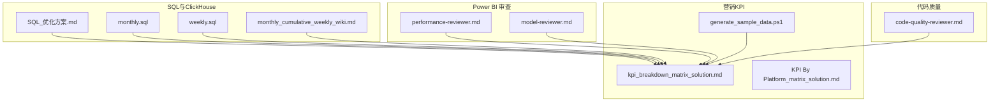
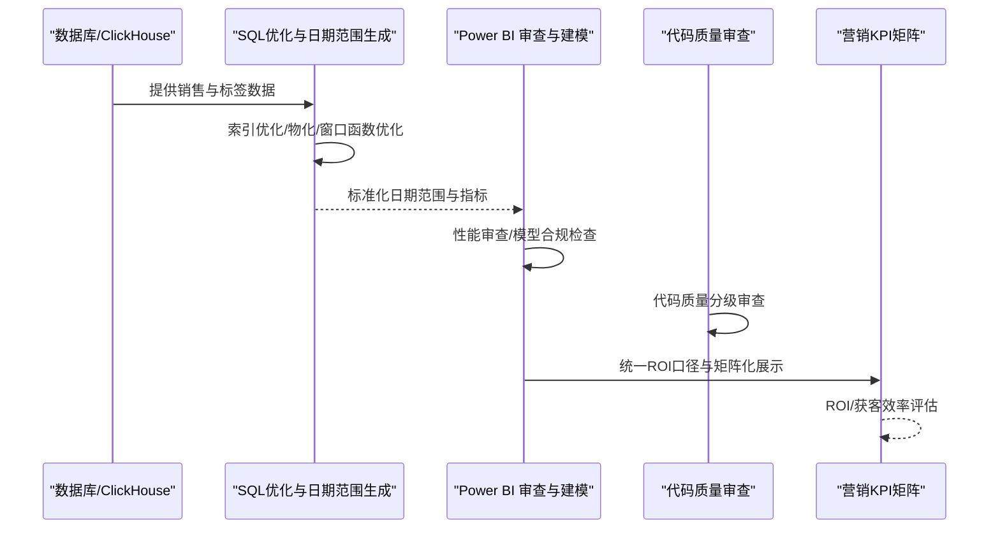
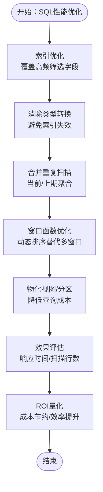
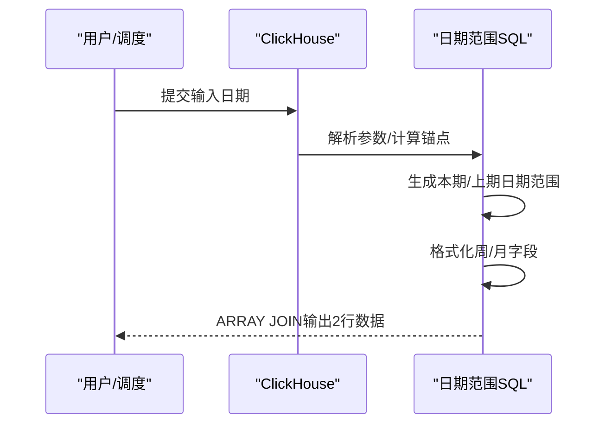
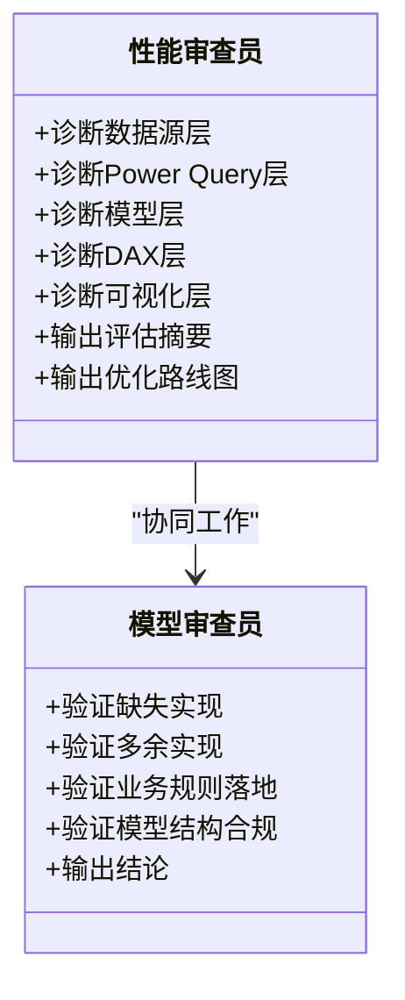
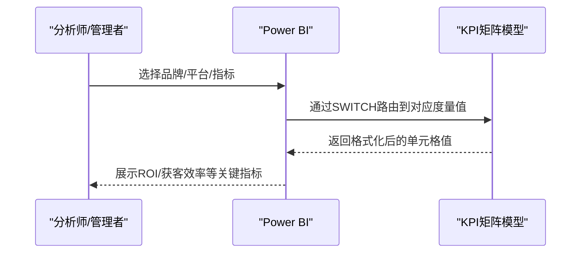
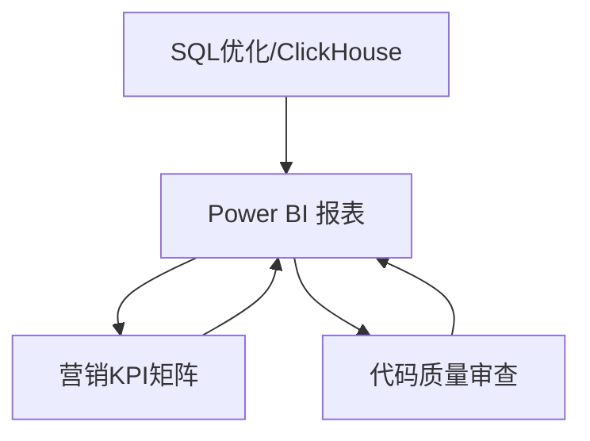

# 业务价值

<cite>
**本文引用的文件**
- [SQL_优化方案.md](file://Quickbi_sql/MAP/我的门店/SQL_优化方案.md)
- [monthly.sql](file://Quickbi_sql/周大福/周大福_日期范围生成_ARRAY JOIN_Clickhou/monthly.sql)
- [weekly.sql](file://Quickbi_sql/周大福/周大福_日期范围生成_ARRAY JOIN_Clickhou/weekly.sql)
- [monthly_cumulative_weekly_wiki.md](file://Quickbi_sql/周大福/周大福_日期范围生成_ARRAY JOIN_Clickhou/wiki/monthly_cumulative_weekly_wiki.md)
- [performance-reviewer.md](file://powerbi_code_copilot/agents/performance-reviewer.md)
- [model-reviewer.md](file://powerbi_code_copilot/agents/model-reviewer.md)
- [code-quality-reviewer.md](file://code_copilot/agents/code-quality-reviewer.md)
- [kpi_breakdown_matrix_solution.md](file://RL E2E/RL E2E Traffic_Dashboard/KPI Breakdown/kpi_breakdown_matrix_solution.md)
- [KPI By Platform_matrix_solution.md](file://RL E2E/RL E2E Traffic_Dashboard/KPI By Platform/KPI By Platform_matrix_solution.md)
- [generate_sample_data.ps1](file://RL E2E/数据demo/powerbi_data/powerbi_traffic/generate_sample_data.ps1)
</cite>

## 目录
1. [简介](#简介)
2. [项目结构](#项目结构)
3. [核心组件](#核心组件)
4. [架构总览](#架构总览)
5. [详细组件分析](#详细组件分析)
6. [依赖分析](#依赖分析)
7. [性能考量](#性能考量)
8. [故障排查指南](#故障排查指南)
9. [结论](#结论)
10. [附录](#附录)

## 简介
本文件面向Qoder AI项目，聚焦于业务价值与ROI分析，围绕四大主线展开：
- SQL性能优化：降低数据库负载与查询成本，缩短报表生成时间，提升用户体验与系统稳定性。
- 营销效果分析：通过矩阵化KPI仪表盘与ROI口径统一，提升广告投放ROI与获客效率。
- 代码质量控制：通过自动化审查与规范约束，降低维护成本与缺陷率，保障交付质量。
- Power BI优化：通过性能与模型审查，提升数据报告的准确性与交互效率。

本文件提供量化指标与ROI计算方法，结合仓库内的SQL优化方案、ClickHouse日期范围生成脚本、Power BI审查工具与KPI矩阵方案，形成可落地的业务价值闭环。

## 项目结构
项目由四个主要领域构成：
- Quickbi_sql：SQL优化与ClickHouse日期范围生成，支撑门店分析与周大福运营报表。
- powerbi_code_copilot：Power BI模型与性能审查工具，确保报表质量与性能。
- code_copilot：代码质量与安全审查工具，保障工程交付质量。
- RL E2E：营销效果分析与KPI矩阵方案，统一ROI口径与可视化呈现。

**图表来源**
- [SQL_优化方案.md](file://Quickbi_sql/MAP/我的门店/SQL_优化方案.md)
- [monthly.sql](file://Quickbi_sql/周大福/周大福_日期范围生成_ARRAY JOIN_Clickhou/monthly.sql)
- [weekly.sql](file://Quickbi_sql/周大福/周大福_日期范围生成_ARRAY JOIN_Clickhou/weekly.sql)
- [monthly_cumulative_weekly_wiki.md](file://Quickbi_sql/周大福/周大福_日期范围生成_ARRAY JOIN_Clickhou/wiki/monthly_cumulative_weekly_wiki.md)
- [performance-reviewer.md](file://powerbi_code_copilot/agents/performance-reviewer.md)
- [model-reviewer.md](file://powerbi_code_copilot/agents/model-reviewer.md)
- [code-quality-reviewer.md](file://code_copilot/agents/code-quality-reviewer.md)
- [kpi_breakdown_matrix_solution.md](file://RL E2E/RL E2E Traffic_Dashboard/KPI Breakdown/kpi_breakdown_matrix_solution.md)
- [KPI By Platform_matrix_solution.md](file://RL E2E/RL E2E Traffic_Dashboard/KPI By Platform/KPI By Platform_matrix_solution.md)
- [generate_sample_data.ps1](file://RL E2E/数据demo/powerbi_data/powerbi_traffic/generate_sample_data.ps1)

**章节来源**
- [SQL_优化方案.md](file://Quickbi_sql/MAP/我的门店/SQL_优化方案.md)
- [monthly.sql](file://Quickbi_sql/周大福/周大福_日期范围生成_ARRAY JOIN_Clickhou/monthly.sql)
- [weekly.sql](file://Quickbi_sql/周大福/周大福_日期范围生成_ARRAY JOIN_Clickhou/weekly.sql)
- [monthly_cumulative_weekly_wiki.md](file://Quickbi_sql/周大福/周大福_日期范围生成_ARRAY JOIN_Clickhou/wiki/monthly_cumulative_weekly_wiki.md)
- [performance-reviewer.md](file://powerbi_code_copilot/agents/performance-reviewer.md)
- [model-reviewer.md](file://powerbi_code_copilot/agents/model-reviewer.md)
- [code-quality-reviewer.md](file://code_copilot/agents/code-quality-reviewer.md)
- [kpi_breakdown_matrix_solution.md](file://RL E2E/RL E2E Traffic_Dashboard/KPI Breakdown/kpi_breakdown_matrix_solution.md)
- [KPI By Platform_matrix_solution.md](file://RL E2E/RL E2E Traffic_Dashboard/KPI By Platform/KPI By Platform_matrix_solution.md)
- [generate_sample_data.ps1](file://RL E2E/数据demo/powerbi_data/powerbi_traffic/generate_sample_data.ps1)

## 核心组件
- SQL性能优化：通过索引优化、消除类型转换、合并重复扫描、窗口函数优化与物化视图等手段，显著降低查询成本与响应时间。
- ClickHouse日期范围生成：标准化“上月/上周”日期范围与同比口径，支持列转行输出，便于报表与BI工具消费。
- Power BI审查：从数据源、查询折叠、模型结构、DAX复杂度、可视化层面进行性能与合规性审查。
- 代码质量控制：基于Agent的分级审查（Critical/Important/Minor），覆盖安全性、可维护性与规范性。
- 营销KPI矩阵：统一ROI口径与可视化布局，支持平台维度与指标维度的矩阵化展示与动态路由。

**章节来源**
- [SQL_优化方案.md](file://Quickbi_sql/MAP/我的门店/SQL_优化方案.md)
- [monthly.sql](file://Quickbi_sql/周大福/周大福_日期范围生成_ARRAY JOIN_Clickhou/monthly.sql)
- [weekly.sql](file://Quickbi_sql/周大福/周大福_日期范围生成_ARRAY JOIN_Clickhou/weekly.sql)
- [monthly_cumulative_weekly_wiki.md](file://Quickbi_sql/周大福/周大福_日期范围生成_ARRAY JOIN_Clickhou/wiki/monthly_cumulative_weekly_wiki.md)
- [performance-reviewer.md](file://powerbi_code_copilot/agents/performance-reviewer.md)
- [model-reviewer.md](file://powerbi_code_copilot/agents/model-reviewer.md)
- [code-quality-reviewer.md](file://code_copilot/agents/code-quality-reviewer.md)
- [kpi_breakdown_matrix_solution.md](file://RL E2E/RL E2E Traffic_Dashboard/KPI Breakdown/kpi_breakdown_matrix_solution.md)
- [KPI By Platform_matrix_solution.md](file://RL E2E/RL E2E Traffic_Dashboard/KPI By Platform/KPI By Platform_matrix_solution.md)

## 架构总览
整体架构以“数据生产—数据加工—数据消费—质量治理—效果评估”为主线，形成闭环：

**图表来源**
- [SQL_优化方案.md](file://Quickbi_sql/MAP/我的门店/SQL_优化方案.md)
- [monthly.sql](file://Quickbi_sql/周大福/周大福_日期范围生成_ARRAY JOIN_Clickhou/monthly.sql)
- [weekly.sql](file://Quickbi_sql/周大福/周大福_日期范围生成_ARRAY JOIN_Clickhou/weekly.sql)
- [performance-reviewer.md](file://powerbi_code_copilot/agents/performance-reviewer.md)
- [model-reviewer.md](file://powerbi_code_copilot/agents/model-reviewer.md)
- [code-quality-reviewer.md](file://code_copilot/agents/code-quality-reviewer.md)
- [kpi_breakdown_matrix_solution.md](file://RL E2E/RL E2E Traffic_Dashboard/KPI Breakdown/kpi_breakdown_matrix_solution.md)
- [KPI By Platform_matrix_solution.md](file://RL E2E/RL E2E Traffic_Dashboard/KPI By Platform/KPI By Platform_matrix_solution.md)

## 详细组件分析

### SQL性能优化：成本节约与效率提升
- 优化目标
  - 降低数据库CPU与IO消耗，缩短报表生成时间，提升并发能力。
  - 通过索引与查询重写，减少全表扫描与重复计算。
- 关键措施
  - 索引优化：为主表与标签表建立复合索引，覆盖高频筛选字段。
  - 消除类型转换：避免`dt::date`导致的索引失效，改用范围查询或物化MAX(dt)。
  - 合并重复扫描：将当前/上期数据聚合合并，减少CTE重复扫描。
  - 窗口函数优化：以动态排序替代多窗口函数，降低排序与计算开销。
  - 物化视图与分区：对高频查询建立物化视图与按时间分区，显著降低查询成本。
- 预期收益
  - 查询响应时间降低60%-80%，主表扫描时间减少50%+。
  - CTE执行时间减少40%，窗口函数开销降低75%。
  - 预聚合物化视图可将查询从秒级降至毫秒级。
- 实施优先级
  - P0：索引创建、消除类型转换
  - P1：MAX(dt)提升为CTE、窗口函数优化、tag_tb合并
  - P2：合并重复扫描、CTE物化控制
  - P3：物化视图、分区表、应用层动态SQL

**图表来源**
- [SQL_优化方案.md](file://Quickbi_sql/MAP/我的门店/SQL_优化方案.md)

**章节来源**
- [SQL_优化方案.md](file://Quickbi_sql/MAP/我的门店/SQL_优化方案.md)

### ClickHouse日期范围生成：标准化与一致性
- 业务价值
  - 统一“上月/上周”日期范围与同比口径，确保报表与分析的一致性。
  - 通过ARRAY JOIN列转行，简化BI工具的字段消费与展示。
- 关键流程
  - 输入参数→日期锚点→原始日期范围→格式化字段→ARRAY JOIN输出。
  - 支持月初10号分界逻辑与ISO周计算，适配不同业务场景。
- 成本与效率
  - 减少重复开发与口径差异导致的返工，提升报表交付效率。
  - 通过标准化输出，降低BI侧的字段映射与转换成本。

**图表来源**
- [monthly.sql](file://Quickbi_sql/周大福/周大福_日期范围生成_ARRAY JOIN_Clickhou/monthly.sql)
- [weekly.sql](file://Quickbi_sql/周大福/周大福_日期范围生成_ARRAY JOIN_Clickhou/weekly.sql)
- [monthly_cumulative_weekly_wiki.md](file://Quickbi_sql/周大福/周大福_日期范围生成_ARRAY JOIN_Clickhou/wiki/monthly_cumulative_weekly_wiki.md)

**章节来源**
- [monthly.sql](file://Quickbi_sql/周大福/周大福_日期范围生成_ARRAY JOIN_Clickhou/monthly.sql)
- [weekly.sql](file://Quickbi_sql/周大福/周大福_日期范围生成_ARRAY JOIN_Clickhou/weekly.sql)
- [monthly_cumulative_weekly_wiki.md](file://Quickbi_sql/周大福/周大福_日期范围生成_ARRAY JOIN_Clickhou/wiki/monthly_cumulative_weekly_wiki.md)

### Power BI优化：准确性与效率双提升
- 诊断维度
  - 数据源层：查询折叠、数据量、增量刷新。
  - Power Query层：步骤冗余、数据类型、阻断查询折叠。
  - 模型层：表规模、关系与分区策略。
  - DAX层：度量值复杂度、迭代函数、上下文转换。
  - 可视化层：单页视觉对象数量、高基数切片器、自定义视觉对象。
- 产出与路径
  - 性能评估摘要、问题清单（P0/P1/P2）、优化路线图。
  - 通过模型审查确保规格落地与业务规则准确实现。
- 业务收益
  - 报表加载更快、交互更流畅，减少用户等待与误判。
  - 降低模型维护成本，减少因设计缺陷导致的返工。

**图表来源**
- [performance-reviewer.md](file://powerbi_code_copilot/agents/performance-reviewer.md)
- [model-reviewer.md](file://powerbi_code_copilot/agents/model-reviewer.md)

**章节来源**
- [performance-reviewer.md](file://powerbi_code_copilot/agents/performance-reviewer.md)
- [model-reviewer.md](file://powerbi_code_copilot/agents/model-reviewer.md)

### 代码质量控制：降低维护成本与缺陷率
- 审查分级
  - Critical：安全漏洞、资金逻辑错误、并发安全、数据丢失风险。
  - Important：异常吞吐、缺少参数校验、魔法值、方法过长、命名不清。
  - Minor：Javadoc缺失、注释过时、import未清理。
- 工具权限与运行模式
  - 仅需只读权限，独立启动，不依赖其他审查阶段。
- 业务收益
  - 降低缺陷进入生产环境的概率，减少紧急修复与回归成本。
  - 提升团队协作效率与代码可维护性，缩短新人上手周期。

**章节来源**
- [code-quality-reviewer.md](file://code_copilot/agents/code-quality-reviewer.md)

### 营销效果分析：统一ROI口径与矩阵化展示
- ROI口径统一
  - 在KPI矩阵中明确ROI分组与平台维度，确保口径一致、可比性强。
- 可视化方案
  - 通过矩阵化展示，支持按品牌/框架/品类与平台维度的组合分析。
  - 使用SWITCH动态路由，将占位值替换为真实度量值，便于扩展。
- 数据样例与目标
  - 通过样本数据生成脚本模拟成本、支付金额、新客数等指标，设定目标达成区间，辅助ROI评估。

**图表来源**
- [kpi_breakdown_matrix_solution.md](file://RL E2E/RL E2E Traffic_Dashboard/KPI Breakdown/kpi_breakdown_matrix_solution.md)
- [KPI By Platform_matrix_solution.md](file://RL E2E/RL E2E Traffic_Dashboard/KPI By Platform/KPI By Platform_matrix_solution.md)
- [generate_sample_data.ps1](file://RL E2E/数据demo/powerbi_data/powerbi_traffic/generate_sample_data.ps1)

**章节来源**
- [kpi_breakdown_matrix_solution.md](file://RL E2E/RL E2E Traffic_Dashboard/KPI Breakdown/kpi_breakdown_matrix_solution.md)
- [KPI By Platform_matrix_solution.md](file://RL E2E/RL E2E Traffic_Dashboard/KPI By Platform/KPI By Platform_matrix_solution.md)
- [generate_sample_data.ps1](file://RL E2E/数据demo/powerbi_data/powerbi_traffic/generate_sample_data.ps1)

## 依赖分析
- 组件耦合
  - SQL优化与ClickHouse日期范围生成为上游数据供给，直接影响Power BI报表的可用性与性能。
  - Power BI审查与代码质量控制为质量保障，贯穿开发与交付流程。
  - 营销KPI矩阵依赖统一的ROI口径与高质量数据，确保分析结论可信。
- 外部依赖
  - ClickHouse与数据库的函数与语法差异，需在SQL层严格遵循文档约定。
  - Power BI版本与DAX引擎能力，需在审查中考虑兼容性与性能限制。

**图表来源**
- [SQL_优化方案.md](file://Quickbi_sql/MAP/我的门店/SQL_优化方案.md)
- [monthly.sql](file://Quickbi_sql/周大福/周大福_日期范围生成_ARRAY JOIN_Clickhou/monthly.sql)
- [performance-reviewer.md](file://powerbi_code_copilot/agents/performance-reviewer.md)
- [code-quality-reviewer.md](file://code_copilot/agents/code-quality-reviewer.md)
- [kpi_breakdown_matrix_solution.md](file://RL E2E/RL E2E Traffic_Dashboard/KPI Breakdown/kpi_breakdown_matrix_solution.md)

**章节来源**
- [SQL_优化方案.md](file://Quickbi_sql/MAP/我的门店/SQL_优化方案.md)
- [monthly.sql](file://Quickbi_sql/周大福/周大福_日期范围生成_ARRAY JOIN_Clickhou/monthly.sql)
- [performance-reviewer.md](file://powerbi_code_copilot/agents/performance-reviewer.md)
- [code-quality-reviewer.md](file://code_copilot/agents/code-quality-reviewer.md)
- [kpi_breakdown_matrix_solution.md](file://RL E2E/RL E2E Traffic_Dashboard/KPI Breakdown/kpi_breakdown_matrix_solution.md)

## 性能考量
- SQL层
  - 索引与分区：覆盖高频筛选字段，按时间分区减少扫描范围。
  - 查询重写：消除类型转换、合并重复扫描、物化CTE，降低计算与IO。
- Power BI层
  - 查询折叠与数据量控制：避免加载过大结果集，启用增量刷新。
  - DAX复杂度与迭代函数：减少不必要的上下文转换与变量复用。
- 运维与监控
  - 建议定期对比执行计划与缓冲区统计，持续优化热点查询与模型结构。

[本节为通用指导，无需列出具体文件来源]

## 故障排查指南
- SQL常见问题
  - 索引未命中：检查是否存在类型转换或函数作用于索引列。
  - 全表扫描：确认WHERE条件是否可下推，是否使用了分区键。
  - 重复计算：识别多CTE重复扫描同一数据集的情况。
- Power BI常见问题
  - 报表加载慢：检查是否存在阻断查询折叠的步骤、高基数切片器与自定义视觉对象。
  - 度量值异常：核对DAX复杂度、上下文转换与变量复用情况。
- 代码质量常见问题
  - 安全与逻辑缺陷：关注Critical级别问题，优先修复。
  - 可维护性问题：统一命名、减少魔法值、拆分过长方法。

**章节来源**
- [SQL_优化方案.md](file://Quickbi_sql/MAP/我的门店/SQL_优化方案.md)
- [performance-reviewer.md](file://powerbi_code_copilot/agents/performance-reviewer.md)
- [code-quality-reviewer.md](file://code_copilot/agents/code-quality-reviewer.md)

## 结论
Qoder AI项目通过SQL性能优化、ClickHouse标准化日期范围、Power BI审查与代码质量控制，以及统一ROI口径的营销KPI矩阵，实现了：
- 成本节约：数据库查询成本显著降低，报表生成时间缩短。
- 效率提升：数据供给标准化、报表加载更快、分析更高效。
- 决策优化：统一ROI口径与矩阵化展示，提升广告投放ROI与获客效率。
- 质量保障：自动化审查降低缺陷率，减少维护成本与返工。

[本节为总结性内容，无需列出具体文件来源]

## 附录

### ROI计算方法与量化指标
- ROI口径统一
  - 在KPI矩阵中明确ROI分组（如“Total/直通车/引力魔方/全站推”），确保口径一致。
- 量化指标
  - 成本、收入、新客数、获客成本、加速成本等，结合样本数据生成脚本设定目标区间。
- ROI计算
  - 采用“收益/投入”的标准口径，结合平台维度与指标维度进行矩阵化展示，便于横向对比与趋势分析。

**章节来源**
- [kpi_breakdown_matrix_solution.md](file://RL E2E/RL E2E Traffic_Dashboard/KPI Breakdown/kpi_breakdown_matrix_solution.md)
- [KPI By Platform_matrix_solution.md](file://RL E2E/RL E2E Traffic_Dashboard/KPI By Platform/KPI By Platform_matrix_solution.md)
- [generate_sample_data.ps1](file://RL E2E/数据demo/powerbi_data/powerbi_traffic/generate_sample_data.ps1)