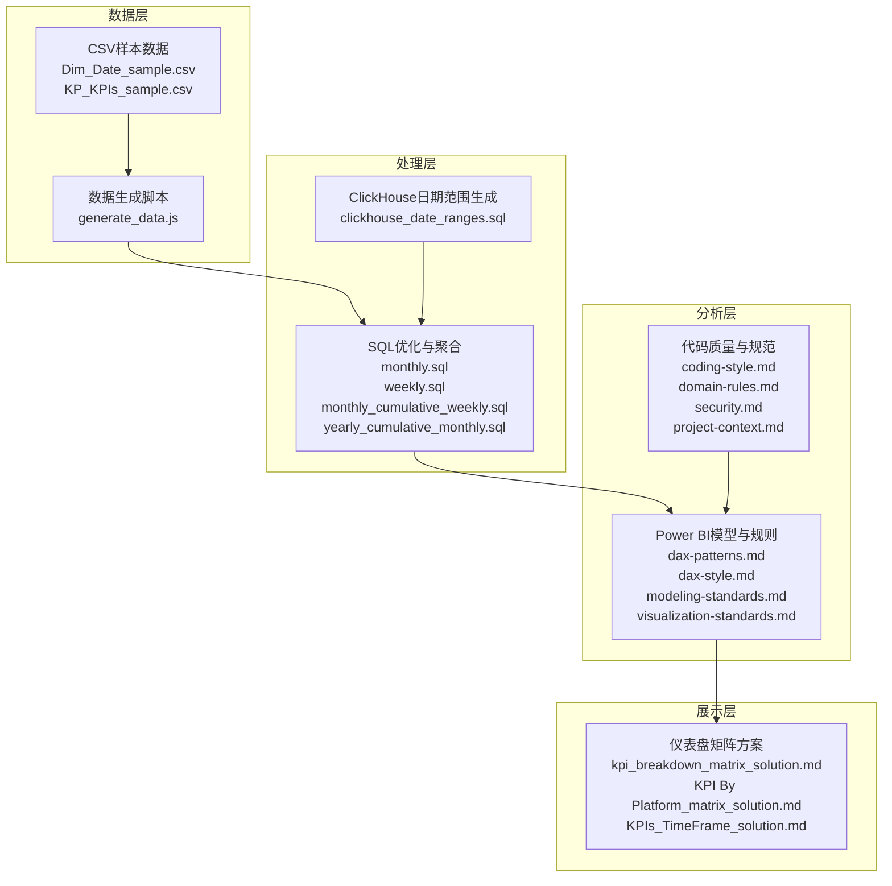
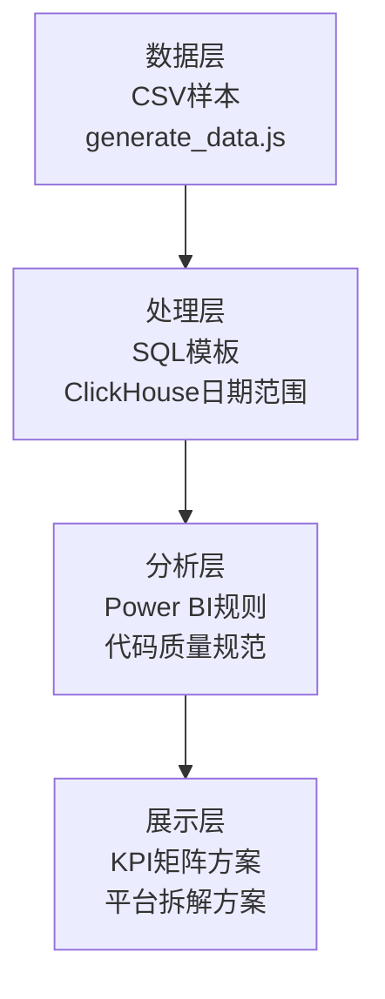
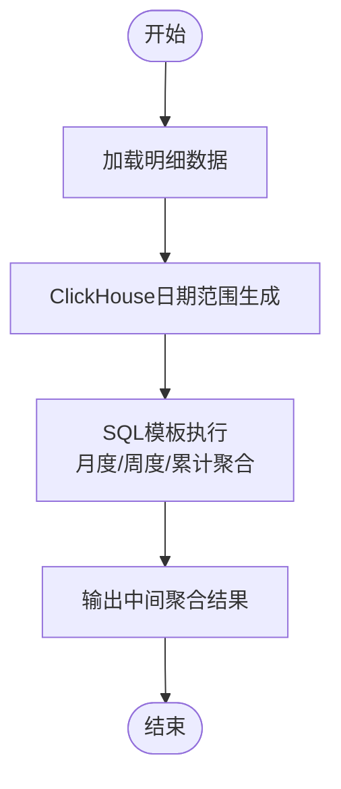
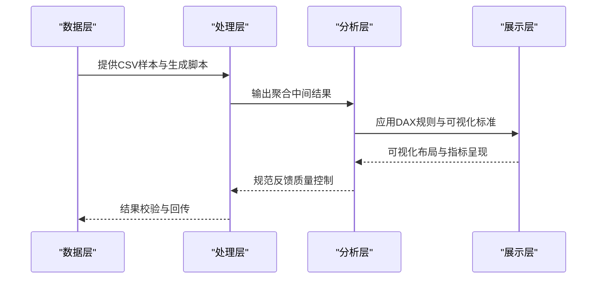
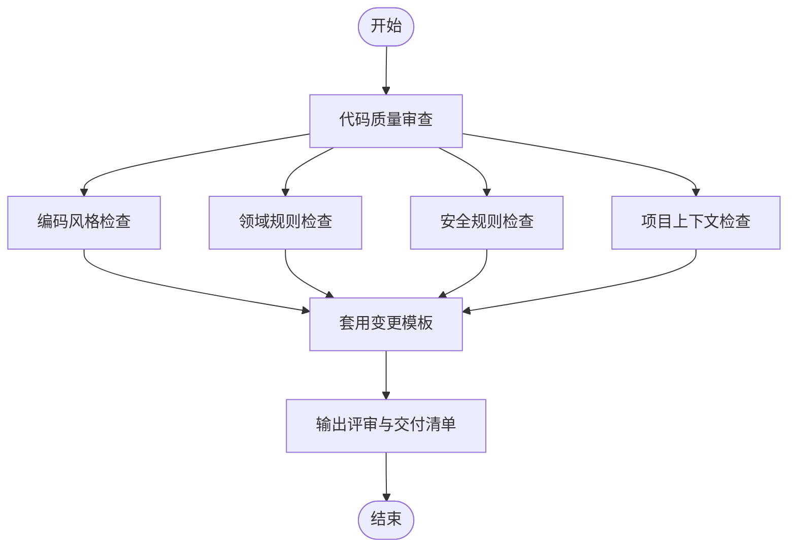
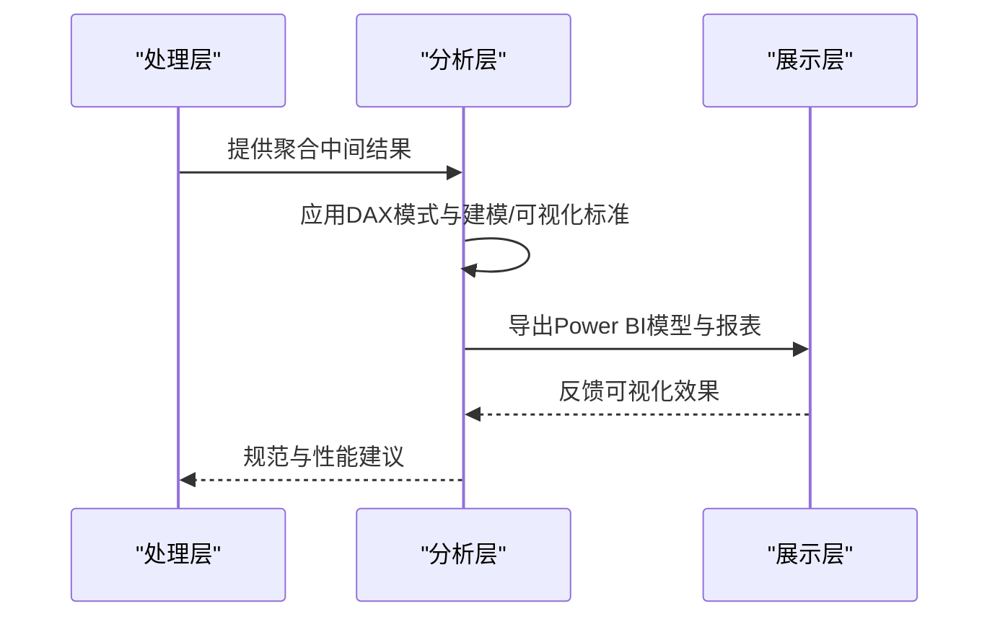
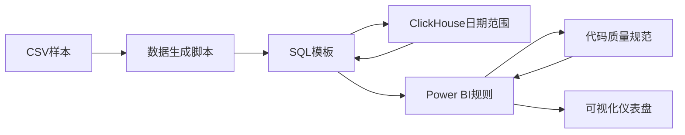

# 技术架构

<cite>
**本文引用的文件**
- [SQL_优化方案.md](file://Quickbi_sql/MAP/我的门店/SQL_优化方案.md)
- [monthly_cumulative_weekly_wiki.md](file://Quickbi_sql/周大福/周大福_日期范围生成_ARRAY JOIN_Clickhou/wiki/monthly_cumulative_weekly_wiki.md)
- [clickhouse_date_ranges_wiki.md](file://Quickbi_sql/周大福/周大福_日期范围生成_demo/clickhouse_date_ranges_wiki.md)
- [monthly.sql](file://Quickbi_sql/周大福/周大福_日期范围生成_ARRAY JOIN_Clickhou/monthly.sql)
- [monthly_cumulative_weekly.sql](file://Quickbi_sql/周大福/周大福_日期范围生成_ARRAY JOIN_Clickhou/monthly_cumulative_weekly.sql)
- [weekly.sql](file://Quickbi_sql/周大福/周大福_日期范围生成_ARRAY JOIN_Clickhou/weekly.sql)
- [yearly_cumulative_monthly.sql](file://Quickbi_sql/周大福/周大福_日期范围生成_ARRAY JOIN_Clickhou/yearly_cumulative_monthly.sql)
- [clickhouse_date_ranges.sql](file://Quickbi_sql/周大福/周大福_日期范围生成_demo/clickhouse_date_ranges.sql)
- [kpi_breakdown_matrix_solution.md](file://RL E2E/RL E2E Traffic_Dashboard/KPI Breakdown/kpi_breakdown_matrix_solution.md)
- [KPI By Platform_matrix_solution.md](file://RL E2E/RL E2E Traffic_Dashboard/KPI By Platform/KPI By Platform_matrix_solution.md)
- [KPIs_TimeFrame_solution.md](file://RL E2E/RL E2E Traffic_Dashboard/kPIs/KPIs_TimeFrame_solution.md)
- [generate_data.js](file://RL E2E/数据demo/powerbi_data/generate_data.js)
- [Dim_Date_sample.csv](file://RL E2E/数据demo/powerbi_data/powerbi_traffic/Dim_Date_sample.csv)
- [KP_KPIs_sample.csv](file://RL E2E/数据demo/powerbi_data/powerbi_traffic/KP_KPIs_sample.csv)
- [code-quality-reviewer.md](file://code_copilot/agents/code-quality-reviewer.md)
- [spec-reviewer.md](file://code_copilot/agents/spec-reviewer.md)
- [dax-reviewer.md](file://powerbi_code_copilot/agents/dax-reviewer.md)
- [model-reviewer.md](file://powerbi_code_copilot/agents/model-reviewer.md)
- [performance-reviewer.md](file://powerbi_code_copilot/agents/performance-reviewer.md)
- [dax-patterns.md](file://powerbi_code_copilot/knowledge/dax-patterns.md)
- [dax-style.md](file://powerbi_code_copilot/rules/dax-style.md)
- [modeling-standards.md](file://powerbi_code_copilot/rules/modeling-standards.md)
- [visualization-standards.md](file://powerbi_code_copilot/rules/visualization-standards.md)
- [coding-style.md](file://code_copilot/rules/coding-style.md)
- [domain-rules.md](file://code_copilot/rules/domain-rules.md)
- [project-context.md](file://code_copilot/rules/project-context.md)
- [security.md](file://code_copilot/rules/security.md)
- [log.md](file://code_copilot/changes/templates/log.md)
- [tasks.md](file://code_copilot/changes/templates/tasks.md)
- [spec.md](file://powerbi_code_copilot/changes/templates/spec.md)
- [validation-spec.md](file://powerbi_code_copilot/changes/templates/validation-spec.md)
</cite>

## 目录
1. [引言](#引言)
2. [项目结构](#项目结构)
3. [核心组件](#核心组件)
4. [架构总览](#架构总览)
5. [详细组件分析](#详细组件分析)
6. [依赖分析](#依赖分析)
7. [性能考虑](#性能考虑)
8. [故障排查指南](#故障排查指南)
9. [结论](#结论)
10. [附录](#附录)

## 引言
本技术架构文档面向Qoder AI项目，聚焦四大核心模块：SQL性能优化引擎、营销效果分析系统、代码质量控制平台与Power BI优化工具。文档从系统分层（数据层、处理层、分析层、展示层）出发，梳理模块职责、交互关系与数据流；解释技术栈选择（SQL、DAX、Power BI、ClickHouse）的应用场景；并给出系统边界、集成接口与扩展机制的说明，帮助读者快速理解与落地实施。

## 项目结构
项目采用按功能域划分的目录组织方式，四大模块分别位于独立子目录中，并辅以文档化解决方案与示例数据，便于复用与推广。

**图示来源**
- [generate_data.js:1-200](file://RL E2E/数据demo/powerbi_data/generate_data.js#L1-L200)
- [Dim_Date_sample.csv](file://RL E2E/数据demo/powerbi_data/powerbi_traffic/Dim_Date_sample.csv)
- [KP_KPIs_sample.csv](file://RL E2E/数据demo/powerbi_data/powerbi_traffic/KP_KPIs_sample.csv)
- [monthly.sql](file://Quickbi_sql/周大福/周大福_日期范围生成_ARRAY JOIN_Clickhou/monthly.sql)
- [weekly.sql](file://Quickbi_sql/周大福/周大福_日期范围生成_ARRAY JOIN_Clickhou/weekly.sql)
- [monthly_cumulative_weekly.sql](file://Quickbi_sql/周大福/周大福_日期范围生成_ARRAY JOIN_Clickhou/monthly_cumulative_weekly.sql)
- [yearly_cumulative_monthly.sql](file://Quickbi_sql/周大福/周大福_日期范围生成_ARRAY JOIN_Clickhou/yearly_cumulative_monthly.sql)
- [clickhouse_date_ranges.sql](file://Quickbi_sql/周大福/周大福_日期范围生成_demo/clickhouse_date_ranges.sql)
- [dax-patterns.md](file://powerbi_code_copilot/knowledge/dax-patterns.md)
- [dax-style.md](file://powerbi_code_copilot/rules/dax-style.md)
- [modeling-standards.md](file://powerbi_code_copilot/rules/modeling-standards.md)
- [visualization-standards.md](file://powerbi_code_copilot/rules/visualization-standards.md)
- [coding-style.md](file://code_copilot/rules/coding-style.md)
- [domain-rules.md](file://code_copilot/rules/domain-rules.md)
- [security.md](file://code_copilot/rules/security.md)
- [project-context.md](file://code_copilot/rules/project-context.md)
- [kpi_breakdown_matrix_solution.md](file://RL E2E/RL E2E Traffic_Dashboard/KPI Breakdown/kpi_breakdown_matrix_solution.md)
- [KPI By Platform_matrix_solution.md](file://RL E2E/RL E2E Traffic_Dashboard/KPI By Platform/KPI By Platform_matrix_solution.md)
- [KPIs_TimeFrame_solution.md](file://RL E2E/RL E2E Traffic_Dashboard/kPIs/KPIs_TimeFrame_solution.md)

**章节来源**
- [SQL_优化方案.md](file://Quickbi_sql/MAP/我的门店/SQL_优化方案.md)
- [monthly_cumulative_weekly_wiki.md](file://Quickbi_sql/周大福/周大福_日期范围生成_ARRAY JOIN_Clickhou/wiki/monthly_cumulative_weekly_wiki.md)
- [clickhouse_date_ranges_wiki.md](file://Quickbi_sql/周大福/周大福_日期范围生成_demo/clickhouse_date_ranges_wiki.md)

## 核心组件
- SQL性能优化引擎
  - 聚合与时间序列计算：提供月度、周度、年累计等SQL模板，支撑高基数维度下的高效聚合与滚动指标计算。
  - ClickHouse日期范围生成：通过数组JOIN与日期范围生成，降低重复计算与内存占用，提升批量处理效率。
- 营销效果分析系统
  - KPI矩阵与平台拆解：提供KPI分解与按平台拆解的解决方案文档，指导多维KPI建模与可视化布局。
  - 时间框架与目标达成：提供时间窗口与目标达成的分析模板，支撑动态对比与目标追踪。
- 代码质量控制平台
  - 规范与审查：提供编码风格、领域规则、安全与上下文规则，以及变更模板（日志、任务、规格、验证规格），确保代码一致性与可维护性。
- Power BI优化工具
  - DAX模式与风格：提供DAX模式库与风格规范，统一表达式写法与性能模式。
  - 模型与可视化标准：提供建模规范与可视化标准，保障报表一致性与可读性。

**章节来源**
- [monthly.sql](file://Quickbi_sql/周大福/周大福_日期范围生成_ARRAY JOIN_Clickhou/monthly.sql)
- [weekly.sql](file://Quickbi_sql/周大福/周大福_日期范围生成_ARRAY JOIN_Clickhou/weekly.sql)
- [monthly_cumulative_weekly.sql](file://Quickbi_sql/周大福/周大福_日期范围生成_ARRAY JOIN_Clickhou/monthly_cumulative_weekly.sql)
- [yearly_cumulative_monthly.sql](file://Quickbi_sql/周大福/周大福_日期范围生成_ARRAY JOIN_Clickhou/yearly_cumulative_monthly.sql)
- [clickhouse_date_ranges.sql](file://Quickbi_sql/周大福/周大福_日期范围生成_demo/clickhouse_date_ranges.sql)
- [kpi_breakdown_matrix_solution.md](file://RL E2E/RL E2E Traffic_Dashboard/KPI Breakdown/kpi_breakdown_matrix_solution.md)
- [KPI By Platform_matrix_solution.md](file://RL E2E/RL E2E Traffic_Dashboard/KPI By Platform/KPI By Platform_matrix_solution.md)
- [KPIs_TimeFrame_solution.md](file://RL E2E/RL E2E Traffic_Dashboard/kPIs/KPIs_TimeFrame_solution.md)
- [dax-patterns.md](file://powerbi_code_copilot/knowledge/dax-patterns.md)
- [dax-style.md](file://powerbi_code_copilot/rules/dax-style.md)
- [modeling-standards.md](file://powerbi_code_copilot/rules/modeling-standards.md)
- [visualization-standards.md](file://powerbi_code_copilot/rules/visualization-standards.md)
- [coding-style.md](file://code_copilot/rules/coding-style.md)
- [domain-rules.md](file://code_copilot/rules/domain-rules.md)
- [security.md](file://code_copilot/rules/security.md)
- [project-context.md](file://code_copilot/rules/project-context.md)
- [log.md](file://code_copilot/changes/templates/log.md)
- [tasks.md](file://code_copilot/changes/templates/tasks.md)
- [spec.md](file://powerbi_code_copilot/changes/templates/spec.md)
- [validation-spec.md](file://powerbi_code_copilot/changes/templates/validation-spec.md)

## 架构总览
系统采用“数据-处理-分析-展示”的分层架构：
- 数据层：提供CSV样本与生成脚本，支撑Power BI建模与SQL处理的数据输入。
- 处理层：SQL与ClickHouse模板负责数据聚合、时间序列与日期范围生成，形成标准化的中间结果。
- 分析层：Power BI规则与代码质量规范定义建模与代码风格，确保分析质量与一致性。
- 展示层：KPI矩阵与平台拆解方案指导可视化布局与指标呈现。

**图示来源**
- [generate_data.js:1-200](file://RL E2E/数据demo/powerbi_data/generate_data.js#L1-L200)
- [monthly.sql](file://Quickbi_sql/周大福/周大福_日期范围生成_ARRAY JOIN_Clickhou/monthly.sql)
- [clickhouse_date_ranges.sql](file://Quickbi_sql/周大福/周大福_日期范围生成_demo/clickhouse_date_ranges.sql)
- [dax-patterns.md](file://powerbi_code_copilot/knowledge/dax-patterns.md)
- [dax-style.md](file://powerbi_code_copilot/rules/dax-style.md)
- [modeling-standards.md](file://powerbi_code_copilot/rules/modeling-standards.md)
- [visualization-standards.md](file://powerbi_code_copilot/rules/visualization-standards.md)
- [coding-style.md](file://code_copilot/rules/coding-style.md)
- [domain-rules.md](file://code_copilot/rules/domain-rules.md)
- [security.md](file://code_copilot/rules/security.md)
- [project-context.md](file://code_copilot/rules/project-context.md)
- [kpi_breakdown_matrix_solution.md](file://RL E2E/RL E2E Traffic_Dashboard/KPI Breakdown/kpi_breakdown_matrix_solution.md)
- [KPI By Platform_matrix_solution.md](file://RL E2E/RL E2E Traffic_Dashboard/KPI By Platform/KPI By Platform_matrix_solution.md)
- [KPIs_TimeFrame_solution.md](file://RL E2E/RL E2E Traffic_Dashboard/kPIs/KPIs_TimeFrame_solution.md)

## 详细组件分析

### 组件A：SQL性能优化引擎
- 职责
  - 提供多粒度时间序列聚合模板（月度、周度、累计系列），降低重复计算与存储开销。
  - 通过ClickHouse日期范围生成与数组JOIN策略，减少笛卡尔积与临时表使用，提升批处理吞吐。
- 关键实现点
  - 月度/周度/年累计SQL模板用于构建滚动指标与层级累计。
  - ClickHouse日期范围生成脚本用于批量构造时间维度，避免手工枚举。
- 数据流
  - 输入：原始明细数据（CSV样本）
  - 处理：SQL模板执行与ClickHouse日期范围生成
  - 输出：聚合后的中间结果，供Power BI建模使用

**图示来源**
- [monthly.sql](file://Quickbi_sql/周大福/周大福_日期范围生成_ARRAY JOIN_Clickhou/monthly.sql)
- [weekly.sql](file://Quickbi_sql/周大福/周大福_日期范围生成_ARRAY JOIN_Clickhou/weekly.sql)
- [monthly_cumulative_weekly.sql](file://Quickbi_sql/周大福/周大福_日期范围生成_ARRAY JOIN_Clickhou/monthly_cumulative_weekly.sql)
- [yearly_cumulative_monthly.sql](file://Quickbi_sql/周大福/周大福_日期范围生成_ARRAY JOIN_Clickhou/yearly_cumulative_monthly.sql)
- [clickhouse_date_ranges.sql](file://Quickbi_sql/周大福/周大福_日期范围生成_demo/clickhouse_date_ranges.sql)

**章节来源**
- [SQL_优化方案.md](file://Quickbi_sql/MAP/我的门店/SQL_优化方案.md)
- [monthly_cumulative_weekly_wiki.md](file://Quickbi_sql/周大福/周大福_日期范围生成_ARRAY JOIN_Clickhou/wiki/monthly_cumulative_weekly_wiki.md)
- [clickhouse_date_ranges_wiki.md](file://Quickbi_sql/周大福/周大福_日期范围生成_demo/clickhouse_date_ranges_wiki.md)

### 组件B：营销效果分析系统
- 职责
  - 提供KPI矩阵与平台拆解的建模与可视化方案，支持跨维度KPI分解与目标达成追踪。
  - 提供时间框架解决方案，支撑动态时间窗口与对比口径统一。
- 关键实现点
  - KPI矩阵方案文档定义指标体系与布局策略。
  - 平台拆解方案文档定义按平台维度的KPI拆分逻辑。
  - 时间框架方案文档定义时间窗口与对比口径。
- 数据流
  - 输入：SQL处理层输出的聚合结果
  - 处理：Power BI建模与可视化配置
  - 输出：仪表盘与报表

**图示来源**
- [generate_data.js:1-200](file://RL E2E/数据demo/powerbi_data/generate_data.js#L1-L200)
- [Dim_Date_sample.csv](file://RL E2E/数据demo/powerbi_data/powerbi_traffic/Dim_Date_sample.csv)
- [KP_KPIs_sample.csv](file://RL E2E/数据demo/powerbi_data/powerbi_traffic/KP_KPIs_sample.csv)
- [kpi_breakdown_matrix_solution.md](file://RL E2E/RL E2E Traffic_Dashboard/KPI Breakdown/kpi_breakdown_matrix_solution.md)
- [KPI By Platform_matrix_solution.md](file://RL E2E/RL E2E Traffic_Dashboard/KPI By Platform/KPI By Platform_matrix_solution.md)
- [KPIs_TimeFrame_solution.md](file://RL E2E/RL E2E Traffic_Dashboard/kPIs/KPIs_TimeFrame_solution.md)

**章节来源**
- [kpi_breakdown_matrix_solution.md](file://RL E2E/RL E2E Traffic_Dashboard/KPI Breakdown/kpi_breakdown_matrix_solution.md)
- [KPI By Platform_matrix_solution.md](file://RL E2E/RL E2E Traffic_Dashboard/KPI By Platform/KPI By Platform_matrix_solution.md)
- [KPIs_TimeFrame_solution.md](file://RL E2E/RL E2E Traffic_Dashboard/kPIs/KPIs_TimeFrame_solution.md)

### 组件C：代码质量控制平台
- 职责
  - 定义编码风格、领域规则、安全与项目上下文规范，确保团队代码一致性与可维护性。
  - 提供变更模板（日志、任务、规格、验证规格），规范开发流程与交付物。
- 关键实现点
  - 规则文件覆盖风格、领域、安全与上下文四个维度。
  - 变更模板支撑需求到交付的全链路管理。
- 数据流
  - 输入：源码与需求文档
  - 处理：规范检查与模板套用
  - 输出：评审意见与交付清单

**图示来源**
- [coding-style.md](file://code_copilot/rules/coding-style.md)
- [domain-rules.md](file://code_copilot/rules/domain-rules.md)
- [security.md](file://code_copilot/rules/security.md)
- [project-context.md](file://code_copilot/rules/project-context.md)
- [log.md](file://code_copilot/changes/templates/log.md)
- [tasks.md](file://code_copilot/changes/templates/tasks.md)
- [spec.md](file://powerbi_code_copilot/changes/templates/spec.md)
- [validation-spec.md](file://powerbi_code_copilot/changes/templates/validation-spec.md)

**章节来源**
- [code-quality-reviewer.md](file://code_copilot/agents/code-quality-reviewer.md)
- [spec-reviewer.md](file://code_copilot/agents/spec-reviewer.md)
- [coding-style.md](file://code_copilot/rules/coding-style.md)
- [domain-rules.md](file://code_copilot/rules/domain-rules.md)
- [security.md](file://code_copilot/rules/security.md)
- [project-context.md](file://code_copilot/rules/project-context.md)
- [log.md](file://code_copilot/changes/templates/log.md)
- [tasks.md](file://code_copilot/changes/templates/tasks.md)
- [spec.md](file://powerbi_code_copilot/changes/templates/spec.md)
- [validation-spec.md](file://powerbi_code_copilot/changes/templates/validation-spec.md)

### 组件D：Power BI优化工具
- 职责
  - 提供DAX模式库与风格规范，统一表达式写法与性能模式。
  - 提供建模与可视化标准，保障报表一致性与可读性。
- 关键实现点
  - DAX模式库指导常见计算的最优实现路径。
  - 建模与可视化标准约束维度/度量设计与图表类型选择。
- 数据流
  - 输入：SQL处理层输出的聚合结果
  - 处理：应用DAX模式与建模/可视化标准
  - 输出：高质量Power BI模型与报表

**图示来源**
- [monthly.sql](file://Quickbi_sql/周大福/周大福_日期范围生成_ARRAY JOIN_Clickhou/monthly.sql)
- [dax-patterns.md](file://powerbi_code_copilot/knowledge/dax-patterns.md)
- [dax-style.md](file://powerbi_code_copilot/rules/dax-style.md)
- [modeling-standards.md](file://powerbi_code_copilot/rules/modeling-standards.md)
- [visualization-standards.md](file://powerbi_code_copilot/rules/visualization-standards.md)

**章节来源**
- [dax-reviewer.md](file://powerbi_code_copilot/agents/dax-reviewer.md)
- [model-reviewer.md](file://powerbi_code_copilot/agents/model-reviewer.md)
- [performance-reviewer.md](file://powerbi_code_copilot/agents/performance-reviewer.md)
- [dax-patterns.md](file://powerbi_code_copilot/knowledge/dax-patterns.md)
- [dax-style.md](file://powerbi_code_copilot/rules/dax-style.md)
- [modeling-standards.md](file://powerbi_code_copilot/rules/modeling-standards.md)
- [visualization-standards.md](file://powerbi_code_copilot/rules/visualization-standards.md)

## 依赖分析
- 内部依赖
  - 数据层依赖生成脚本产出CSV样本，作为建模与SQL处理的输入。
  - 处理层依赖SQL模板与ClickHouse日期范围生成，形成中间聚合结果。
  - 分析层依赖Power BI规则与代码质量规范，保障模型与代码质量。
  - 展示层依赖分析层的模型与规则，输出可视化结果。
- 外部依赖
  - Power BI生态：DAX表达式、建模与可视化标准。
  - ClickHouse：高性能列式存储与数组JOIN能力。
  - SQL：通用聚合与时间序列计算能力。

**图示来源**
- [generate_data.js:1-200](file://RL E2E/数据demo/powerbi_data/generate_data.js#L1-L200)
- [monthly.sql](file://Quickbi_sql/周大福/周大福_日期范围生成_ARRAY JOIN_Clickhou/monthly.sql)
- [clickhouse_date_ranges.sql](file://Quickbi_sql/周大福/周大福_日期范围生成_demo/clickhouse_date_ranges.sql)
- [dax-patterns.md](file://powerbi_code_copilot/knowledge/dax-patterns.md)
- [dax-style.md](file://powerbi_code_copilot/rules/dax-style.md)
- [modeling-standards.md](file://powerbi_code_copilot/rules/modeling-standards.md)
- [visualization-standards.md](file://powerbi_code_copilot/rules/visualization-standards.md)
- [coding-style.md](file://code_copilot/rules/coding-style.md)
- [domain-rules.md](file://code_copilot/rules/domain-rules.md)
- [security.md](file://code_copilot/rules/security.md)
- [project-context.md](file://code_copilot/rules/project-context.md)

**章节来源**
- [Dim_Date_sample.csv](file://RL E2E/数据demo/powerbi_data/powerbi_traffic/Dim_Date_sample.csv)
- [KP_KPIs_sample.csv](file://RL E2E/数据demo/powerbi_data/powerbi_traffic/KP_KPIs_sample.csv)

## 性能考虑
- SQL层面
  - 使用数组JOIN与日期范围生成减少重复计算与临时表，提高批量处理效率。
  - 通过多粒度聚合模板（月度/周度/累计）降低查询复杂度与存储压力。
- Power BI层面
  - 应用DAX模式与建模标准，避免N+1查询与低效计算，提升报表加载速度。
  - 统一可视化标准，减少不必要的视觉噪声与计算开销。
- 代码层面
  - 通过代码质量规范与模板化流程，降低重构成本与回归风险。

[本节为通用性能建议，不直接分析具体文件]

## 故障排查指南
- SQL执行异常
  - 检查日期范围生成是否正确，确认数组JOIN与时间维度对齐。
  - 对比不同粒度模板（月度/周度/累计）的差异，定位计算偏差来源。
- Power BI模型问题
  - 校验DAX模式与建模标准是否一致，确认度量与维度设计是否符合规范。
  - 检查可视化标准是否被正确应用，避免图表类型与数据不匹配。
- 代码质量相关问题
  - 对照编码风格、领域规则、安全与上下文规则，逐项核对不符合项。
  - 使用变更模板进行问题归档与修复跟踪，确保闭环管理。

**章节来源**
- [clickhouse_date_ranges_wiki.md](file://Quickbi_sql/周大福/周大福_日期范围生成_demo/clickhouse_date_ranges_wiki.md)
- [monthly_cumulative_weekly_wiki.md](file://Quickbi_sql/周大福/周大福_日期范围生成_ARRAY JOIN_Clickhou/wiki/monthly_cumulative_weekly_wiki.md)
- [dax-style.md](file://powerbi_code_copilot/rules/dax-style.md)
- [modeling-standards.md](file://powerbi_code_copilot/rules/modeling-standards.md)
- [visualization-standards.md](file://powerbi_code_copilot/rules/visualization-standards.md)
- [coding-style.md](file://code_copilot/rules/coding-style.md)
- [domain-rules.md](file://code_copilot/rules/domain-rules.md)
- [security.md](file://code_copilot/rules/security.md)
- [project-context.md](file://code_copilot/rules/project-context.md)

## 结论
Qoder AI项目通过清晰的分层架构与模块化设计，实现了从数据准备、SQL优化、Power BI建模到可视化展示的完整闭环。SQL性能优化引擎与ClickHouse结合，确保了大规模时间序列处理的效率；营销效果分析系统提供了可复用的KPI矩阵与平台拆解方案；代码质量控制平台与Power BI优化工具共同保障了模型与代码的质量与一致性。该架构具备良好的扩展性与可维护性，适合在多业务场景下推广与复用。

[本节为总结性内容，不直接分析具体文件]

## 附录
- 系统边界
  - 内部边界：四类模块各自职责明确，模块间通过标准化中间产物与规则文件衔接。
  - 外部边界：依赖Power BI生态与ClickHouse数据库，遵循其生态规范与最佳实践。
- 集成接口
  - 数据接口：CSV样本与生成脚本作为统一输入；SQL模板与ClickHouse日期范围作为中间处理接口。
  - 规则接口：Power BI规则与代码质量规范作为统一约束条件。
- 扩展机制
  - 新增时间粒度：在SQL模板与ClickHouse日期范围生成中扩展新的聚合周期。
  - 新增KPI维度：在KPI矩阵与平台拆解方案中补充新的拆解维度与可视化布局。
  - 新增规范：在Power BI与代码质量规范中新增或修订规则，保持一致性与可演进性。

[本节为概念性说明，不直接分析具体文件]