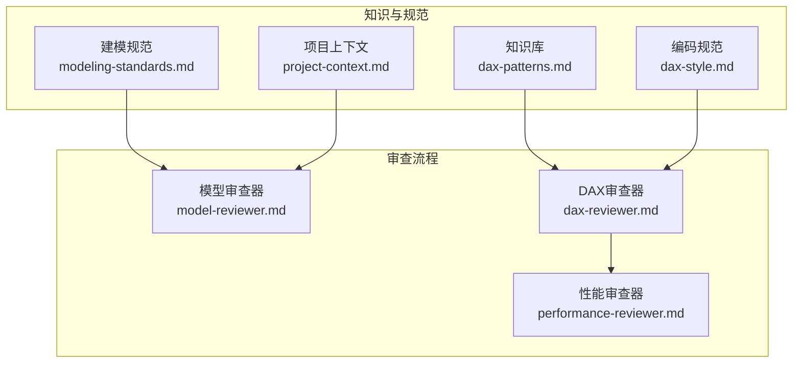
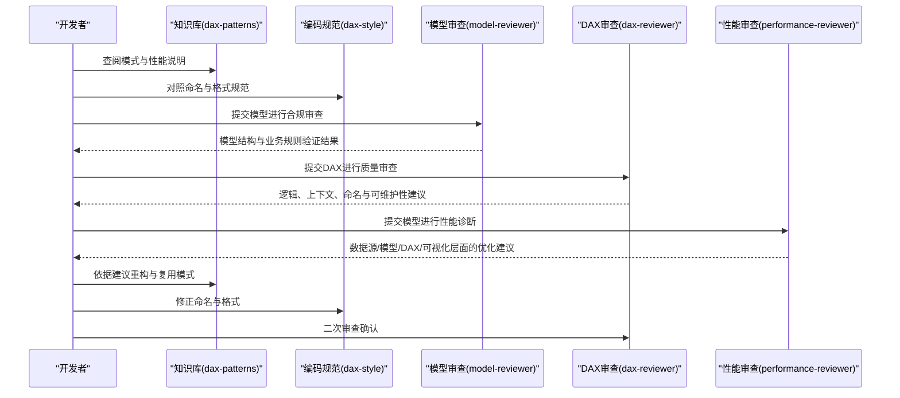
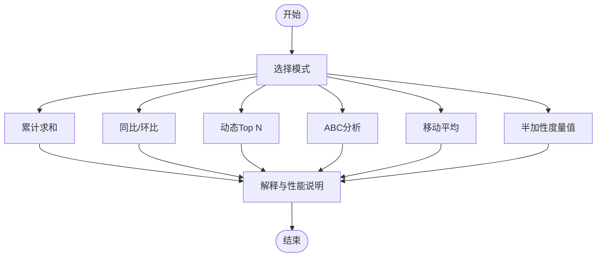
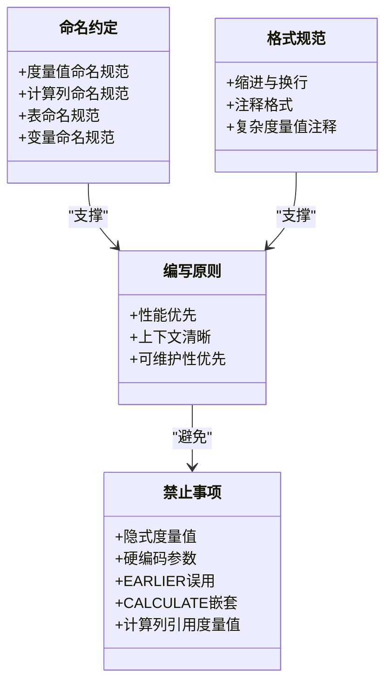
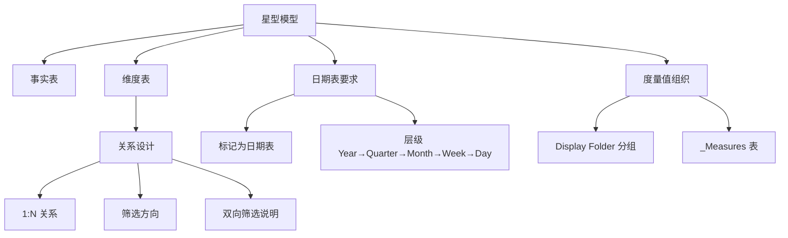
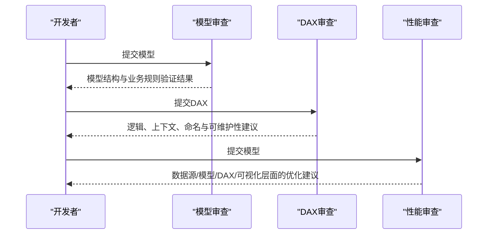
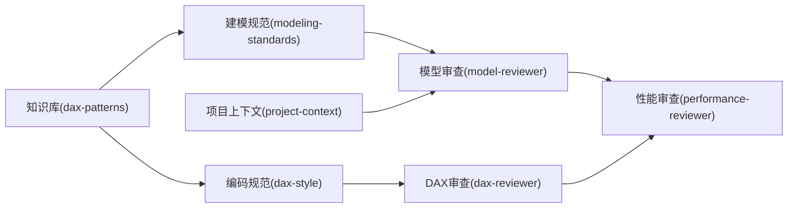

# DAX模式与知识库

<cite>
**本文档引用的文件**
- [dax-patterns.md](file://powerbi_code_copilot/knowledge/dax-patterns.md)
- [dax-style.md](file://powerbi_code_copilot/rules/dax-style.md)
- [modeling-standards.md](file://powerbi_code_copilot/rules/modeling-standards.md)
- [model-reviewer.md](file://powerbi_code_copilot/agents/model-reviewer.md)
- [dax-reviewer.md](file://powerbi_code_copilot/agents/dax-reviewer.md)
- [performance-reviewer.md](file://powerbi_code_copilot/agents/performance-reviewer.md)
- [project-context.md](file://powerbi_code_copilot/rules/project-context.md)
</cite>

## 目录
1. [简介](#简介)
2. [项目结构](#项目结构)
3. [核心组件](#核心组件)
4. [架构总览](#架构总览)
5. [详细组件分析](#详细组件分析)
6. [依赖分析](#依赖分析)
7. [性能考量](#性能考量)
8. [故障排除指南](#故障排除指南)
9. [结论](#结论)
10. [附录](#附录)

## 简介
本知识库聚焦于Power BI中的DAX模式与最佳实践，覆盖以下主题：
- 常用DAX模式：累计求和、同比/环比、动态Top N、ABC分析、移动平均、半加性度量值
- 性能优化：上下文转换、迭代函数、时间智能函数、变量复用、预计算策略
- 常见问题与陷阱：隐式度量值、EARLIER误用、循环依赖、筛选器泄漏、硬编码参数
- 实战应用：如何在实际报表中选择与重构DAX模式，提升可维护性与性能

本知识库同时提供一套完整的审查流程与规范，帮助团队在开发过程中持续产出高质量的DAX度量值与数据模型。

## 项目结构
该仓库围绕Power BI DAX与建模实践构建了知识与规则体系，主要由以下部分组成：
- 知识库：收录经验证的DAX常用模式与性能说明
- 规范与标准：命名约定、格式规范、建模标准、禁止事项
- 审查器：模型合规审查、DAX质量审查、性能审查
- 项目上下文：项目背景、数据源、模型结构、安全配置等

图表来源
- [dax-patterns.md:1-205](file://powerbi_code_copilot/knowledge/dax-patterns.md#L1-L205)
- [dax-style.md:1-218](file://powerbi_code_copilot/rules/dax-style.md#L1-L218)
- [modeling-standards.md:1-88](file://powerbi_code_copilot/rules/modeling-standards.md#L1-L88)
- [model-reviewer.md:1-36](file://powerbi_code_copilot/agents/model-reviewer.md#L1-L36)
- [dax-reviewer.md:1-56](file://powerbi_code_copilot/agents/dax-reviewer.md#L1-L56)
- [performance-reviewer.md:1-71](file://powerbi_code_copilot/agents/performance-reviewer.md#L1-L71)
- [project-context.md:1-69](file://powerbi_code_copilot/rules/project-context.md#L1-L69)

章节来源
- [dax-patterns.md:1-205](file://powerbi_code_copilot/knowledge/dax-patterns.md#L1-L205)
- [dax-style.md:1-218](file://powerbi_code_copilot/rules/dax-style.md#L1-L218)
- [modeling-standards.md:1-88](file://powerbi_code_copilot/rules/modeling-standards.md#L1-L88)
- [model-reviewer.md:1-36](file://powerbi_code_copilot/agents/model-reviewer.md#L1-L36)
- [dax-reviewer.md:1-56](file://powerbi_code_copilot/agents/dax-reviewer.md#L1-L56)
- [performance-reviewer.md:1-71](file://powerbi_code_copilot/agents/performance-reviewer.md#L1-L71)
- [project-context.md:1-69](file://powerbi_code_copilot/rules/project-context.md#L1-L69)

## 核心组件
- DAX常用模式库：提供可直接复用的高质量模式，包含场景、代码、解释与性能说明
- DAX编码规范：命名约定、格式规范、编写原则、禁止事项
- 数据建模规范：星型模型、关系设计、日期表要求、度量值组织
- 审查器：模型合规审查、DAX质量审查、性能审查，形成闭环质量保障
- 项目上下文：为审查与优化提供背景信息与约束条件

章节来源
- [dax-patterns.md:1-205](file://powerbi_code_copilot/knowledge/dax-patterns.md#L1-L205)
- [dax-style.md:1-218](file://powerbi_code_copilot/rules/dax-style.md#L1-L218)
- [modeling-standards.md:1-88](file://powerbi_code_copilot/rules/modeling-standards.md#L1-L88)
- [model-reviewer.md:1-36](file://powerbi_code_copilot/agents/model-reviewer.md#L1-L36)
- [dax-reviewer.md:1-56](file://powerbi_code_copilot/agents/dax-reviewer.md#L1-L56)
- [performance-reviewer.md:1-71](file://powerbi_code_copilot/agents/performance-reviewer.md#L1-L71)
- [project-context.md:1-69](file://powerbi_code_copilot/rules/project-context.md#L1-L69)

## 架构总览
DAX模式与知识库的实施采用“知识沉淀—规范约束—审查反馈—持续优化”的闭环架构。审查器在不同层面发现问题并给出优化建议，最终指导开发者在建模与DAX编写中遵循最佳实践。

图表来源
- [dax-patterns.md:1-205](file://powerbi_code_copilot/knowledge/dax-patterns.md#L1-L205)
- [dax-style.md:1-218](file://powerbi_code_copilot/rules/dax-style.md#L1-L218)
- [model-reviewer.md:1-36](file://powerbi_code_copilot/agents/model-reviewer.md#L1-L36)
- [dax-reviewer.md:1-56](file://powerbi_code_copilot/agents/dax-reviewer.md#L1-L56)
- [performance-reviewer.md:1-71](file://powerbi_code_copilot/agents/performance-reviewer.md#L1-L71)

## 详细组件分析

### 组件A：DAX常用模式库
- 模式覆盖：累计求和、同比/环比、动态Top N、ABC分析、移动平均、半加性度量值
- 设计要点：明确场景、提供可复用代码、解释上下文转换与性能考量
- 性能提示：标注性能等级与优化建议，便于快速决策

图表来源
- [dax-patterns.md:1-205](file://powerbi_code_copilot/knowledge/dax-patterns.md#L1-L205)

章节来源
- [dax-patterns.md:1-205](file://powerbi_code_copilot/knowledge/dax-patterns.md#L1-L205)

### 组件B：DAX编码规范
- 命名约定：度量值、计算列、表命名的前缀与后缀规范；避免与列名冲突
- 格式规范：缩进、换行、注释位置与复杂度量值的头部注释要求
- 编写原则：性能优先、上下文清晰、可维护性优先
- 禁止事项：隐式度量值、硬编码参数、EARLIER误用、未经验证的嵌套CALCULATE、计算列引用度量值

图表来源
- [dax-style.md:1-218](file://powerbi_code_copilot/rules/dax-style.md#L1-L218)

章节来源
- [dax-style.md:1-218](file://powerbi_code_copilot/rules/dax-style.md#L1-L218)

### 组件C：数据建模规范
- 模型架构：星型模型优先，必要时使用雪花型并说明原因
- 关系设计：1:N关系、筛选方向、双向筛选的限制与文档化
- 日期表要求：独立日期表、连续日期范围、层级标记
- 度量值组织：Display Folder分组、度量值表管理
- 禁止事项：自动日期表、事实表间直接关系、多对多关系未通过桥接表、未使用表/列

图表来源
- [modeling-standards.md:1-88](file://powerbi_code_copilot/rules/modeling-standards.md#L1-L88)

章节来源
- [modeling-standards.md:1-88](file://powerbi_code_copilot/rules/modeling-standards.md#L1-L88)

### 组件D：审查器与质量保障
- 模型审查：验证缺失实现、多余实现、理解偏差、业务规则落地、模型结构合规、数据变更准确性
- DAX审查：逻辑错误、上下文转换错误、循环依赖、隐式度量值歧义、RLS绕过风险、命名与可维护性
- 性能审查：数据源层、Power Query层、模型层、DAX层、可视化层的诊断框架与输出格式

图表来源
- [model-reviewer.md:1-36](file://powerbi_code_copilot/agents/model-reviewer.md#L1-L36)
- [dax-reviewer.md:1-56](file://powerbi_code_copilot/agents/dax-reviewer.md#L1-L56)
- [performance-reviewer.md:1-71](file://powerbi_code_copilot/agents/performance-reviewer.md#L1-L71)

章节来源
- [model-reviewer.md:1-36](file://powerbi_code_copilot/agents/model-reviewer.md#L1-L36)
- [dax-reviewer.md:1-56](file://powerbi_code_copilot/agents/dax-reviewer.md#L1-L56)
- [performance-reviewer.md:1-71](file://powerbi_code_copilot/agents/performance-reviewer.md#L1-L71)

### 组件E：项目上下文
- 项目概况：版本、许可证、刷新方式
- 数据源清单：类型、连接方式、刷新频率
- 数据模型结构：事实表、维度表、关系图
- 度量值分组：Display Folder与核心度量值
- 安全配置：RLS、工作区角色、数据网关
- 关键依赖：自定义视觉对象、外部工具

章节来源
- [project-context.md:1-69](file://powerbi_code_copilot/rules/project-context.md#L1-L69)

## 依赖分析
- 知识库依赖于编码规范与建模规范，确保模式可复用且符合最佳实践
- 审查器依赖于项目上下文与规范，提供有针对性的诊断与建议
- DAX审查与性能审查相互补充，前者关注逻辑与可维护性，后者关注执行效率

图表来源
- [dax-patterns.md:1-205](file://powerbi_code_copilot/knowledge/dax-patterns.md#L1-L205)
- [dax-style.md:1-218](file://powerbi_code_copilot/rules/dax-style.md#L1-L218)
- [modeling-standards.md:1-88](file://powerbi_code_copilot/rules/modeling-standards.md#L1-L88)
- [model-reviewer.md:1-36](file://powerbi_code_copilot/agents/model-reviewer.md#L1-L36)
- [dax-reviewer.md:1-56](file://powerbi_code_copilot/agents/dax-reviewer.md#L1-L56)
- [performance-reviewer.md:1-71](file://powerbi_code_copilot/agents/performance-reviewer.md#L1-L71)
- [project-context.md:1-69](file://powerbi_code_copilot/rules/project-context.md#L1-L69)

章节来源
- [dax-patterns.md:1-205](file://powerbi_code_copilot/knowledge/dax-patterns.md#L1-L205)
- [dax-style.md:1-218](file://powerbi_code_copilot/rules/dax-style.md#L1-L218)
- [modeling-standards.md:1-88](file://powerbi_code_copilot/rules/modeling-standards.md#L1-L88)
- [model-reviewer.md:1-36](file://powerbi_code_copilot/agents/model-reviewer.md#L1-L36)
- [dax-reviewer.md:1-56](file://powerbi_code_copilot/agents/dax-reviewer.md#L1-L56)
- [performance-reviewer.md:1-71](file://powerbi_code_copilot/agents/performance-reviewer.md#L1-L71)
- [project-context.md:1-69](file://powerbi_code_copilot/rules/project-context.md#L1-L69)

## 性能考量
- 上下文转换：避免不必要的CALCULATE嵌套，优先使用REMOVEFILTERS替代FILTER(ALL(...))
- 迭代函数：注意迭代表大小，尽量在最小粒度表上运行，避免在大型表上使用IF+大型表迭代
- 变量复用：使用VAR缓存重复计算的结果，减少重复扫描
- 时间智能函数：正确使用日期表，利用引擎优化过的函数（如SAMEPERIODLASTYEAR、DATESINPERIOD）
- 预计算策略：对于复杂度量值，考虑预计算为计算列或计算表，降低运行时成本
- 模型层优化：控制表基数与大小，移除未使用列，合理选择存储模式与分区策略

章节来源
- [dax-style.md:143-170](file://powerbi_code_copilot/rules/dax-style.md#L143-L170)
- [performance-reviewer.md:26-38](file://powerbi_code_copilot/agents/performance-reviewer.md#L26-L38)

## 故障排除指南
- 逻辑错误与上下文转换错误：检查CALCULATE筛选参数意图，避免EARLIER误用
- 循环依赖：检查度量值与计算列之间的相互引用
- 隐式度量值歧义：避免直接拖拽字段到值区域，使用显式度量值
- RLS绕过风险：确保行级安全性规则正确配置与测试
- 性能瓶颈定位：按数据源层、Power Query层、模型层、DAX层、可视化层逐层排查
- 命名与可维护性：对照命名规范与格式规范，修正命名与注释

章节来源
- [dax-reviewer.md:7-26](file://powerbi_code_copilot/agents/dax-reviewer.md#L7-L26)
- [dax-style.md:163-170](file://powerbi_code_copilot/rules/dax-style.md#L163-L170)
- [performance-reviewer.md:5-38](file://powerbi_code_copilot/agents/performance-reviewer.md#L5-L38)

## 结论
通过系统化的DAX模式库、严格的编码规范与建模标准，以及多层次的审查流程，团队可以在Power BI项目中持续产出高质量、高性能、可维护的度量值与数据模型。建议在日常开发中：
- 优先复用知识库中的成熟模式
- 严格遵循命名与格式规范
- 在审查器的帮助下及时发现并修复问题
- 结合项目上下文制定针对性的优化策略

## 附录
- 常用模式速查：累计求和、同比/环比、动态Top N、ABC分析、移动平均、半加性度量值
- 审查清单：模型结构、度量值实现、命名与格式、性能影响
- 优化建议：上下文转换、迭代函数、变量复用、时间智能函数、预计算策略