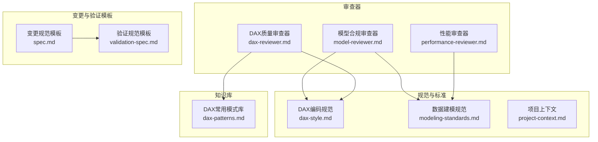
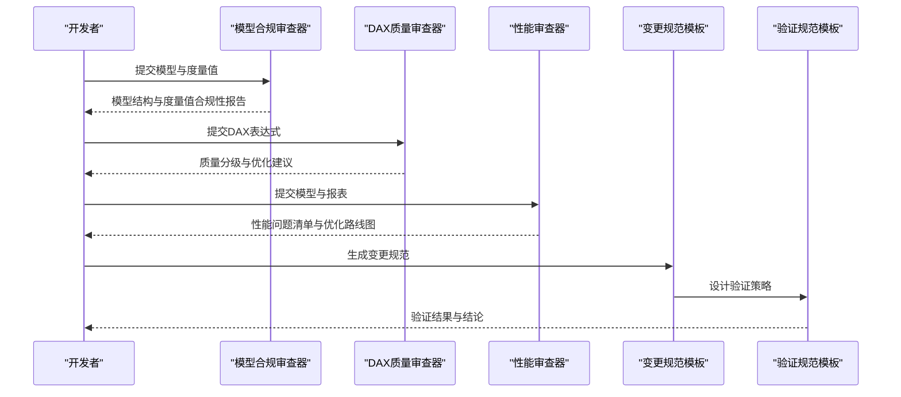
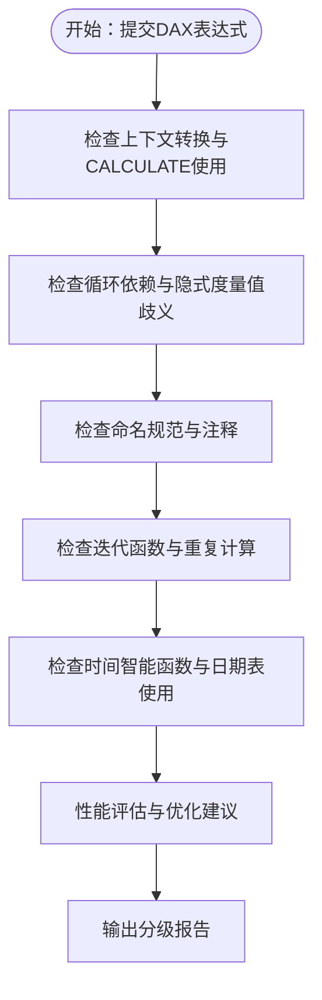
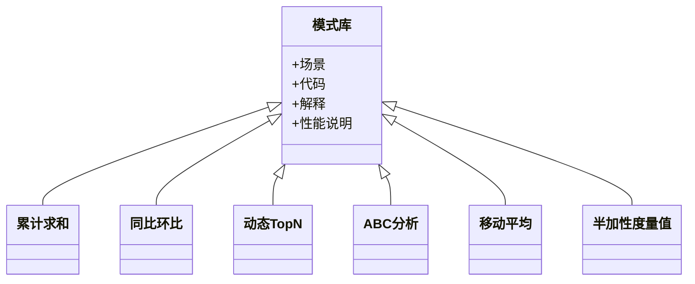
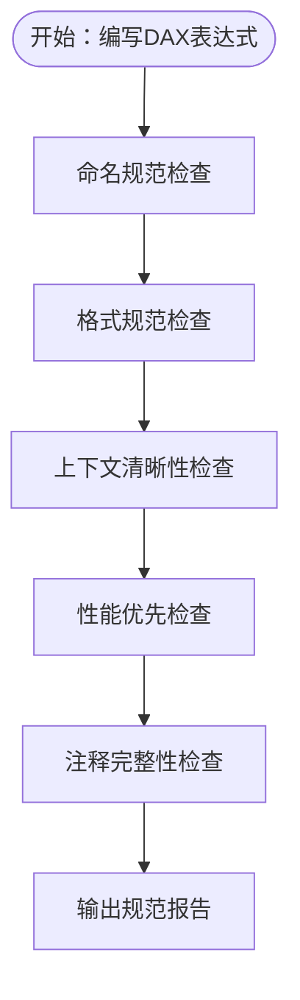
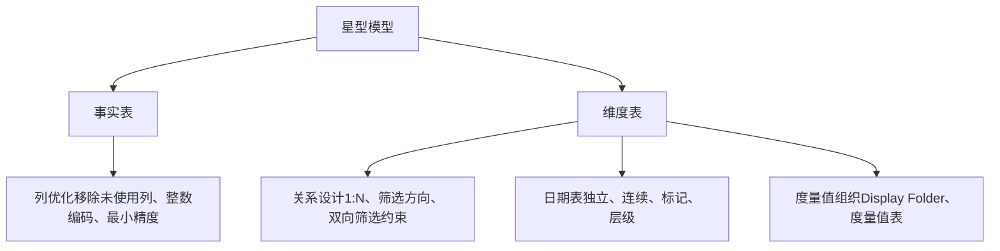
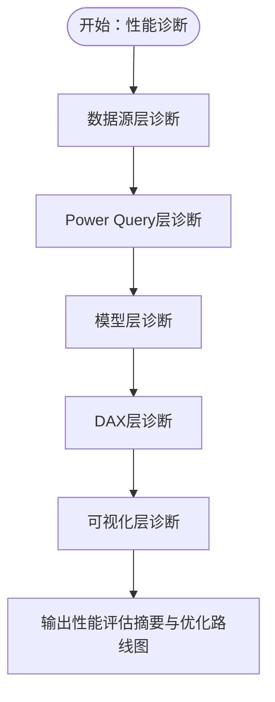
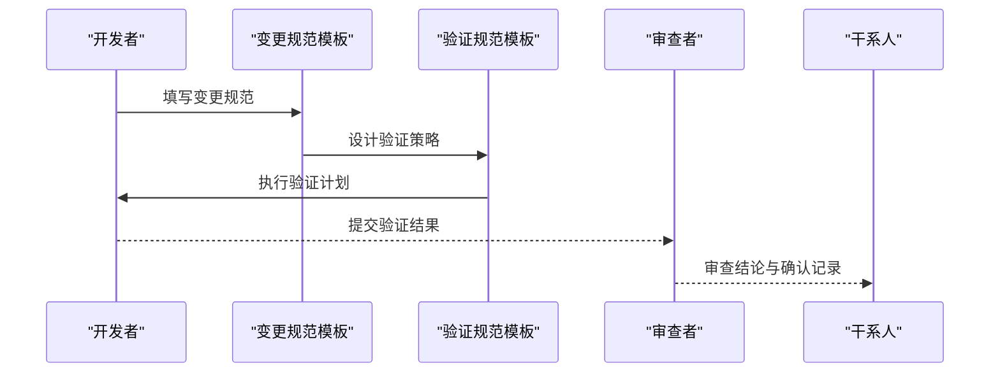
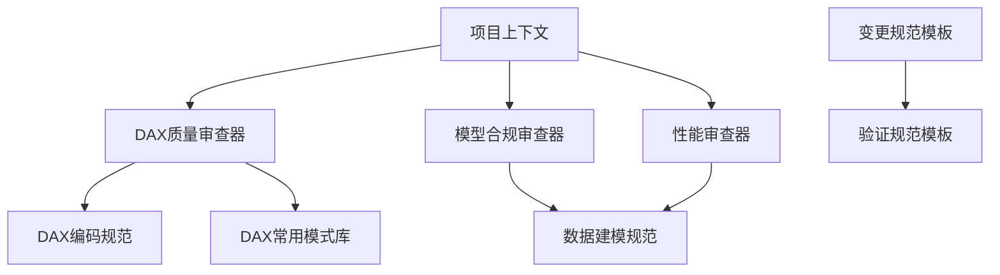

# DAX表达式审查

<cite>
**本文档引用的文件**
- [dax-reviewer.md](file://powerbi_code_copilot/agents/dax-reviewer.md)
- [dax-patterns.md](file://powerbi_code_copilot/knowledge/dax-patterns.md)
- [dax-style.md](file://powerbi_code_copilot/rules/dax-style.md)
- [modeling-standards.md](file://powerbi_code_copilot/rules/modeling-standards.md)
- [performance-reviewer.md](file://powerbi_code_copilot/agents/performance-reviewer.md)
- [model-reviewer.md](file://powerbi_code_copilot/agents/model-reviewer.md)
- [project-context.md](file://powerbi_code_copilot/rules/project-context.md)
- [spec.md](file://powerbi_code_copilot/changes/templates/spec.md)
- [validation-spec.md](file://powerbi_code_copilot/changes/templates/validation-spec.md)
- [kpi_breakdown_matrix_solution.md](file://RL E2E/RL E2E Traffic_Dashboard/KPI Breakdown/kpi_breakdown_matrix_solution.md)
- [KPI By Platform_matrix_solution.md](file://RL E2E/RL E2E Traffic_Dashboard/KPI By Platform/KPI By Platform_matrix_solution.md)
</cite>

## 目录
1. [简介](#简介)
2. [项目结构](#项目结构)
3. [核心组件](#核心组件)
4. [架构概览](#架构概览)
5. [详细组件分析](#详细组件分析)
6. [依赖分析](#依赖分析)
7. [性能考量](#性能考量)
8. [故障排除指南](#故障排除指南)
9. [结论](#结论)
10. [附录](#附录)

## 简介
本文件为Power BI开发者提供专业的DAX表达式审查指导与优化建议，覆盖质量评估方法、性能审查清单、错误类型识别机制、语法检查与逻辑验证流程，以及DAX样式规范与最佳实践。通过对仓库中现有审查器、样式规范、模式库与验证模板的系统化梳理，形成一套可执行、可追溯、可复用的DAX代码审查体系。

## 项目结构
该仓库围绕Power BI模型与DAX质量保障建立了多层次的审查与规范体系：
- 审查器（Agents）：负责模型合规审查、DAX质量审查、性能审查
- 规范与标准（Rules）：定义数据建模规范、DAX编码规范、项目上下文
- 知识库（Knowledge）：收录经验证的DAX常用模式
- 变更与验证模板（Changes/Templates）：支撑变更管理与验证闭环

图表来源
- [model-reviewer.md:1-36](file://powerbi_code_copilot/agents/model-reviewer.md#L1-L36)
- [dax-reviewer.md:1-56](file://powerbi_code_copilot/agents/dax-reviewer.md#L1-L56)
- [performance-reviewer.md:1-71](file://powerbi_code_copilot/agents/performance-reviewer.md#L1-L71)
- [dax-style.md:1-218](file://powerbi_code_copilot/rules/dax-style.md#L1-L218)
- [modeling-standards.md:1-88](file://powerbi_code_copilot/rules/modeling-standards.md#L1-L88)
- [dax-patterns.md:1-205](file://powerbi_code_copilot/knowledge/dax-patterns.md#L1-L205)
- [spec.md:1-95](file://powerbi_code_copilot/changes/templates/spec.md#L1-L95)
- [validation-spec.md:1-69](file://powerbi_code_copilot/changes/templates/validation-spec.md#L1-L69)

章节来源
- [model-reviewer.md:1-36](file://powerbi_code_copilot/agents/model-reviewer.md#L1-L36)
- [dax-reviewer.md:1-56](file://powerbi_code_copilot/agents/dax-reviewer.md#L1-L56)
- [performance-reviewer.md:1-71](file://powerbi_code_copilot/agents/performance-reviewer.md#L1-L71)
- [dax-style.md:1-218](file://powerbi_code_copilot/rules/dax-style.md#L1-L218)
- [modeling-standards.md:1-88](file://powerbi_code_copilot/rules/modeling-standards.md#L1-L88)
- [dax-patterns.md:1-205](file://powerbi_code_copilot/knowledge/dax-patterns.md#L1-L205)
- [spec.md:1-95](file://powerbi_code_copilot/changes/templates/spec.md#L1-L95)
- [validation-spec.md:1-69](file://powerbi_code_copilot/changes/templates/validation-spec.md#L1-L69)

## 核心组件
- DAX质量审查器：定义审查分级（Critical/Important/Minor）、性能审查清单与输出格式，强调上下文转换、CALCULATE滥用、EARLIER误用、循环依赖、隐式度量值歧义与RLS风险等阻塞性问题。
- DAX常用模式库：提供经过验证的高质量模式（累计求和、同比/环比、动态TopN、ABC分析、移动平均、半加性度量值），包含场景、代码、解释与性能说明，便于复用与对照。
- DAX编码规范：涵盖命名约定（度量值、计算列、表命名、列命名、变量）、格式规范（缩进、换行、注释）、编写原则（性能优先、上下文清晰、可维护性）与禁止事项，提供命名检查清单与常见错误示例。
- 数据建模规范：强调星型模型优先、关系设计原则（1:N、筛选方向、双向筛选约束）、日期表要求、表设计规范（事实表/维度表/列优化）、度量值组织（Display Folder分组与度量值表）与禁止事项。
- 性能审查器：提供性能诊断框架，覆盖数据源层、Power Query层、模型层、DAX层与可视化层，支持问题分级与优化路线图输出。
- 变更与验证模板：规范变更流程（背景、现状、功能点、业务规则、模型变更、DAX设计、Power Query变更、可视化变更、影响范围、风险与关注点、验证策略、技术决策、执行日志、审查结论）与验证规范（数据准确性、模型结构、性能、安全验证）。

章节来源
- [dax-reviewer.md:5-56](file://powerbi_code_copilot/agents/dax-reviewer.md#L5-L56)
- [dax-patterns.md:1-205](file://powerbi_code_copilot/knowledge/dax-patterns.md#L1-L205)
- [dax-style.md:7-218](file://powerbi_code_copilot/rules/dax-style.md#L7-L218)
- [modeling-standards.md:7-88](file://powerbi_code_copilot/rules/modeling-standards.md#L7-L88)
- [performance-reviewer.md:5-71](file://powerbi_code_copilot/agents/performance-reviewer.md#L5-L71)
- [spec.md:1-95](file://powerbi_code_copilot/changes/templates/spec.md#L1-L95)
- [validation-spec.md:1-69](file://powerbi_code_copilot/changes/templates/validation-spec.md#L1-L69)

## 架构概览
DAX表达式审查的总体流程由“模型合规 → DAX质量 → 性能诊断”三层组成，辅以变更与验证闭环，确保从模型结构到表达式质量再到性能表现的全面把控。

图表来源
- [model-reviewer.md:1-36](file://powerbi_code_copilot/agents/model-reviewer.md#L1-L36)
- [dax-reviewer.md:1-56](file://powerbi_code_copilot/agents/dax-reviewer.md#L1-L56)
- [performance-reviewer.md:1-71](file://powerbi_code_copilot/agents/performance-reviewer.md#L1-L71)
- [spec.md:1-95](file://powerbi_code_copilot/changes/templates/spec.md#L1-L95)
- [validation-spec.md:1-69](file://powerbi_code_copilot/changes/templates/validation-spec.md#L1-L69)

## 详细组件分析

### DAX质量审查器
- 审查分级
  - Critical（阻塞）：计算结果错误、上下文转换错误（CALCULATE滥用、EARLIER误用）、循环依赖、隐式度量值歧义、RLS规则绕过风险
  - Important（应修复）：未使用VAR导致重复计算、不必要的迭代函数、FILTER(ALL(...))可用REMOVEFILTERS替代、度量值命名不符合规范、复杂度量值缺少注释、硬编码筛选条件
  - Minor（建议）：格式不统一、变量命名不清晰、可合并的简单度量值
- 性能审查清单
  - 避免不必要的上下文转换、CALCULATE筛选参数优化、迭代函数在最小粒度表上运行、利用VAR避免重复计算、时间智能函数正确使用日期表、可预计算为计算列的度量值
- 输出格式
  - 分级列出问题与建议，提供性能评估摘要与优化建议

图表来源
- [dax-reviewer.md:7-52](file://powerbi_code_copilot/agents/dax-reviewer.md#L7-L52)

章节来源
- [dax-reviewer.md:5-56](file://powerbi_code_copilot/agents/dax-reviewer.md#L5-L56)

### DAX常用模式库
- 模式覆盖：累计求和、同比/环比、动态TopN、ABC分析、移动平均、半加性度量值
- 模式要素：场景、代码、解释、性能说明，便于对照与复用
- 性能提示：时间智能函数优化、日期表标记、迭代函数规模控制

图表来源
- [dax-patterns.md:5-205](file://powerbi_code_copilot/knowledge/dax-patterns.md#L5-L205)

章节来源
- [dax-patterns.md:1-205](file://powerbi_code_copilot/knowledge/dax-patterns.md#L1-L205)

### DAX编码规范
- 命名约定
  - 度量值：前缀（KPI_、CAL_、RATIO_、YTD_、MTD_、PY_、百分比%、排名Rank、内部度量值_前缀）、避免与列名冲突
  - 计算列：CC_前缀（团队约定）、体现业务含义
  - 表命名：Dim_、Fact_、Bridge_、Param_、CT_、_隐藏表，单数名词，避免空格与保留字
  - 列命名：主键Key/ID后缀、外键与关联维度表主键同名、布尔列Is/Has前缀、PascalCase
  - 变量：__前缀或清晰描述性命名
- 格式规范
  - 缩进与换行：每VAR独占一行、RETURN与VAR同级缩进、嵌套函数每层缩进4空格、长参数列表每参数独占一行、逻辑运算符放在行首
  - 注释：复杂度量值（>5行）必须添加头部注释，注释格式规范
- 编写原则
  - 性能优先：优先使用VAR、避免嵌套CALCULATE、优先使用REMOVEFILTERS、注意迭代函数规模、避免IF+大型表迭代
  - 上下文清晰：明确区分行/筛选器上下文、CALCULATE筛选参数明确意图、避免不必要上下文转换、SELECTEDVALUE优于VALUES
  - 可维护性：复杂计算分解为基础→中间→最终、使用Display Folder组织、每个度量值单一职责
- 禁止事项
  - 禁止隐式度量值、禁止硬编码日期/业务参数、禁止EARLIER、禁止未经验证的CALCULATE嵌套、禁止计算列引用度量值
- 命名检查清单与常见错误示例

图表来源
- [dax-style.md:7-170](file://powerbi_code_copilot/rules/dax-style.md#L7-L170)

章节来源
- [dax-style.md:7-218](file://powerbi_code_copilot/rules/dax-style.md#L7-L218)

### 数据建模规范
- 模型架构：星型模型优先、事实表与维度表分离、确有必要时使用雪花型
- 关系设计：1:N关系、筛选方向默认单向、双向筛选需明确业务理由、禁止循环依赖、每事实表关联日期维度表
- 日期表：独立日期维度表、完整连续日期范围、标记为日期表、包含标准层级
- 表设计：事实表仅保留外键与度量值列、维度表包含代理键与业务键、移除未使用列、文本列检查整数编码替代
- 度量值组织：Display Folder分组、度量值表集中管理
- 禁止事项：禁止自动日期/时间表、禁止事实表间直接关系、禁止多对多关系、禁止保留未使用表/列、禁止使用自动生成的隐藏日期层级

图表来源
- [modeling-standards.md:9-88](file://powerbi_code_copilot/rules/modeling-standards.md#L9-L88)

章节来源
- [modeling-standards.md:1-88](file://powerbi_code_copilot/rules/modeling-standards.md#L1-L88)

### 性能审查器
- 诊断框架：数据源层（查询折叠、数据源延迟、数据量、增量刷新）、Power Query层（步骤冗余、数据类型、阻断查询折叠、合并/追加性能）、模型层（表基数与大小、列数据类型、关系数量与复杂度、未使用列/表、计算列vs计算表vs预处理、分区策略）、DAX层（度量值复杂度、迭代函数数据量、上下文转换开销、变量复用、时间智能优化）、可视化层（单页视觉对象数量、高基数列切片器、交叉高亮/筛选复杂度、自定义视觉对象性能、条件格式与动态标题）
- 输出格式：整体评级、模型大小、度量值数量、表数量、问题清单（按影响排序）、优化路线图

图表来源
- [performance-reviewer.md:7-67](file://powerbi_code_copilot/agents/performance-reviewer.md#L7-L67)

章节来源
- [performance-reviewer.md:1-71](file://powerbi_code_copilot/agents/performance-reviewer.md#L1-L71)

### 变更与验证模板
- 变更规范模板：背景与目标、现状分析、功能点、业务规则、模型变更、DAX度量值设计、Power Query变更、可视化变更、影响范围、风险与关注点、验证策略、技术决策、执行日志、审查结论
- 验证规范模板：验证原则（数据驱动、对比验证、边界测试、展示证据）、验证环境、数据准确性验证（P0/P1/P2）、模型结构验证、性能验证、安全验证（如涉及RLS）、执行计划

图表来源
- [spec.md:1-95](file://powerbi_code_copilot/changes/templates/spec.md#L1-L95)
- [validation-spec.md:1-69](file://powerbi_code_copilot/changes/templates/validation-spec.md#L1-L69)

章节来源
- [spec.md:1-95](file://powerbi_code_copilot/changes/templates/spec.md#L1-L95)
- [validation-spec.md:1-69](file://powerbi_code_copilot/changes/templates/validation-spec.md#L1-L69)

## 依赖分析
- 审查器依赖关系
  - DAX质量审查器依赖DAX编码规范与常用模式库
  - 模型合规审查器依赖数据建模规范
  - 性能审查器依赖数据建模规范
  - 变更与验证模板贯穿全流程，确保可追溯与可验证
- 外部依赖与集成点
  - 项目上下文提供Power BI版本、许可证类型、数据刷新方式、数据源类型等，影响审查策略与性能建议
  - 具体DAX示例文件（如KPI矩阵解决方案）可作为命名与结构规范的实际参考

图表来源
- [dax-reviewer.md:1-56](file://powerbi_code_copilot/agents/dax-reviewer.md#L1-L56)
- [dax-style.md:1-218](file://powerbi_code_copilot/rules/dax-style.md#L1-L218)
- [dax-patterns.md:1-205](file://powerbi_code_copilot/knowledge/dax-patterns.md#L1-L205)
- [model-reviewer.md:1-36](file://powerbi_code_copilot/agents/model-reviewer.md#L1-L36)
- [modeling-standards.md:1-88](file://powerbi_code_copilot/rules/modeling-standards.md#L1-L88)
- [performance-reviewer.md:1-71](file://powerbi_code_copilot/agents/performance-reviewer.md#L1-L71)
- [project-context.md:1-69](file://powerbi_code_copilot/rules/project-context.md#L1-L69)
- [spec.md:1-95](file://powerbi_code_copilot/changes/templates/spec.md#L1-L95)
- [validation-spec.md:1-69](file://powerbi_code_copilot/changes/templates/validation-spec.md#L1-L69)

章节来源
- [project-context.md:9-69](file://powerbi_code_copilot/rules/project-context.md#L9-L69)
- [kpi_breakdown_matrix_solution.md:1-620](file://RL E2E/RL E2E Traffic_Dashboard/KPI Breakdown/kpi_breakdown_matrix_solution.md#L1-L620)
- [KPI By Platform_matrix_solution.md:1-500](file://RL E2E/RL E2E Traffic_Dashboard/KPI By Platform/KPI By Platform_matrix_solution.md#L1-L500)

## 性能考量
- 优先使用VAR避免重复计算，减少上下文转换开销
- 优化迭代函数：在最小粒度表上运行，控制迭代规模
- 合理使用时间智能函数：确保日期表正确标记与层级完整
- 评估是否可将度量值预计算为计算列，降低运行时计算压力
- 通过性能审查器的问题清单与优化路线图，按影响排序优先处理

## 故障排除指南
- 循环依赖
  - 现象：模型或度量值无法正确计算，出现错误或无限递归
  - 排查：检查关系方向、筛选器传播、度量值相互引用
  - 参考：模型合规审查器的循环依赖检查要点
- 上下文转换错误
  - 现象：CALCULATE筛选参数导致筛选器泄漏或传播异常
  - 排查：确认REMOVEFILTERS使用、筛选器叠加逻辑
  - 参考：DAX质量审查器的上下文转换检查清单
- 性能瓶颈
  - 现象：报表加载缓慢、切片器响应慢、钻取卡顿
  - 排查：迭代函数规模、日期表使用、变量复用程度、关系复杂度
  - 参考：性能审查器的诊断框架与问题分级
- 命名与可维护性问题
  - 现象：度量值难以理解、注释缺失、变量命名混乱
  - 排查：遵循命名约定、格式规范与注释要求
  - 参考：DAX编码规范的命名检查清单与格式规范

章节来源
- [dax-reviewer.md:7-26](file://powerbi_code_copilot/agents/dax-reviewer.md#L7-L26)
- [performance-reviewer.md:7-38](file://powerbi_code_copilot/agents/performance-reviewer.md#L7-L38)
- [dax-style.md:171-218](file://powerbi_code_copilot/rules/dax-style.md#L171-L218)

## 结论
通过将模型合规审查、DAX质量审查与性能审查有机结合，并配合规范化的变更与验证流程，可系统性提升Power BI模型与DAX表达式的质量、性能与可维护性。建议在日常开发中严格执行命名与格式规范，优先采用经过验证的DAX模式，持续进行性能审查与回归验证，确保交付稳定可靠的商业智能解决方案。

## 附录
- DAX样式规范要点速览
  - 命名约定：度量值前缀、表/列命名、变量命名
  - 格式规范：缩进、换行、注释
  - 编写原则：性能优先、上下文清晰、可维护性
  - 禁止事项：隐式度量值、硬编码、EARLIER、CALCULATE嵌套、计算列引用度量值
- 常用模式参考
  - 累计求和、同比/环比、动态TopN、ABC分析、移动平均、半加性度量值
- 变更与验证模板
  - 变更规范模板：背景、现状、功能点、业务规则、模型变更、DAX设计、Power Query变更、可视化变更、影响范围、风险与关注点、验证策略、技术决策、执行日志、审查结论
  - 验证规范模板：验证原则、验证环境、数据准确性验证、模型结构验证、性能验证、安全验证、执行计划

章节来源
- [dax-style.md:7-170](file://powerbi_code_copilot/rules/dax-style.md#L7-L170)
- [dax-patterns.md:5-205](file://powerbi_code_copilot/knowledge/dax-patterns.md#L5-L205)
- [spec.md:1-95](file://powerbi_code_copilot/changes/templates/spec.md#L1-L95)
- [validation-spec.md:1-69](file://powerbi_code_copilot/changes/templates/validation-spec.md#L1-L69)