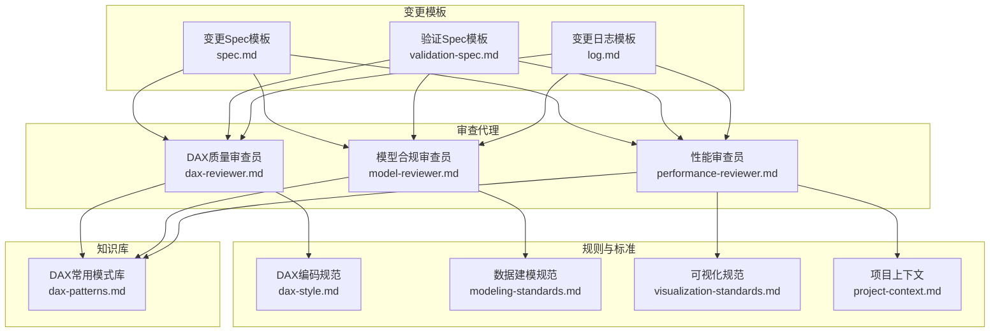
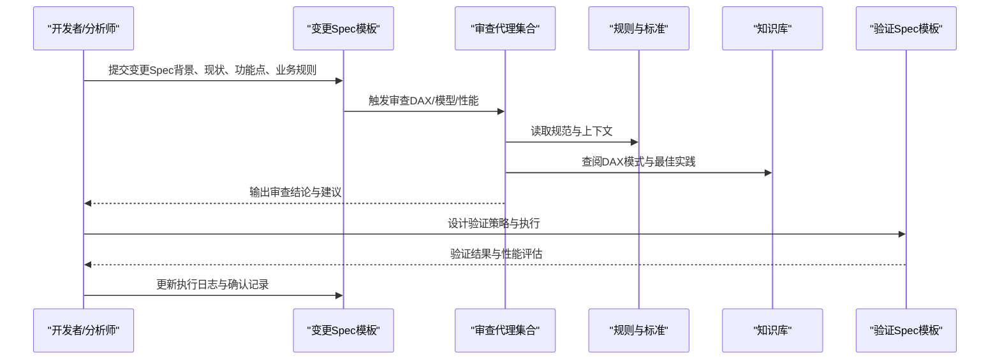
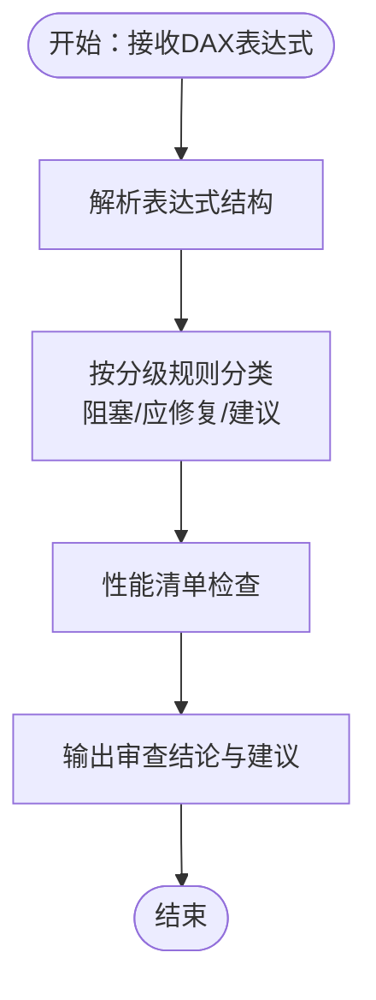
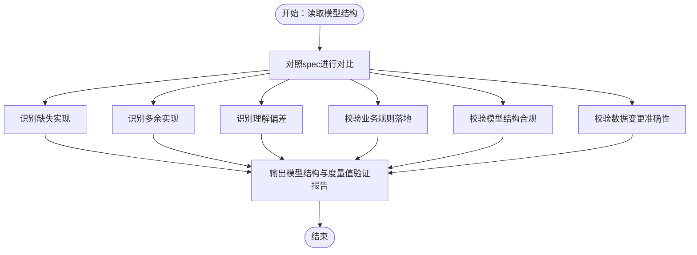
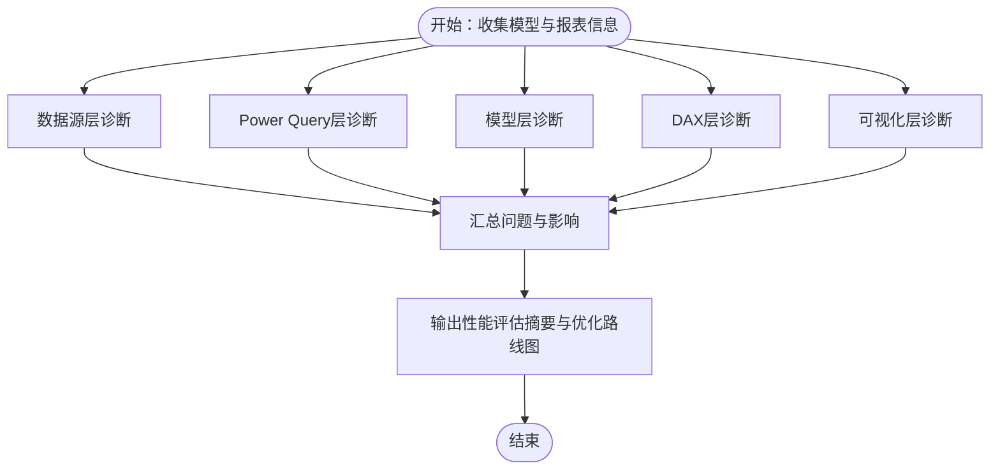
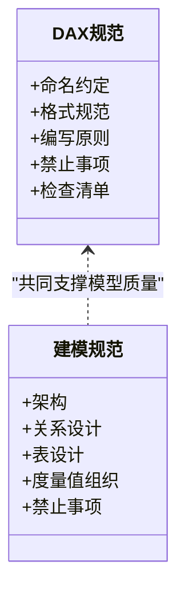
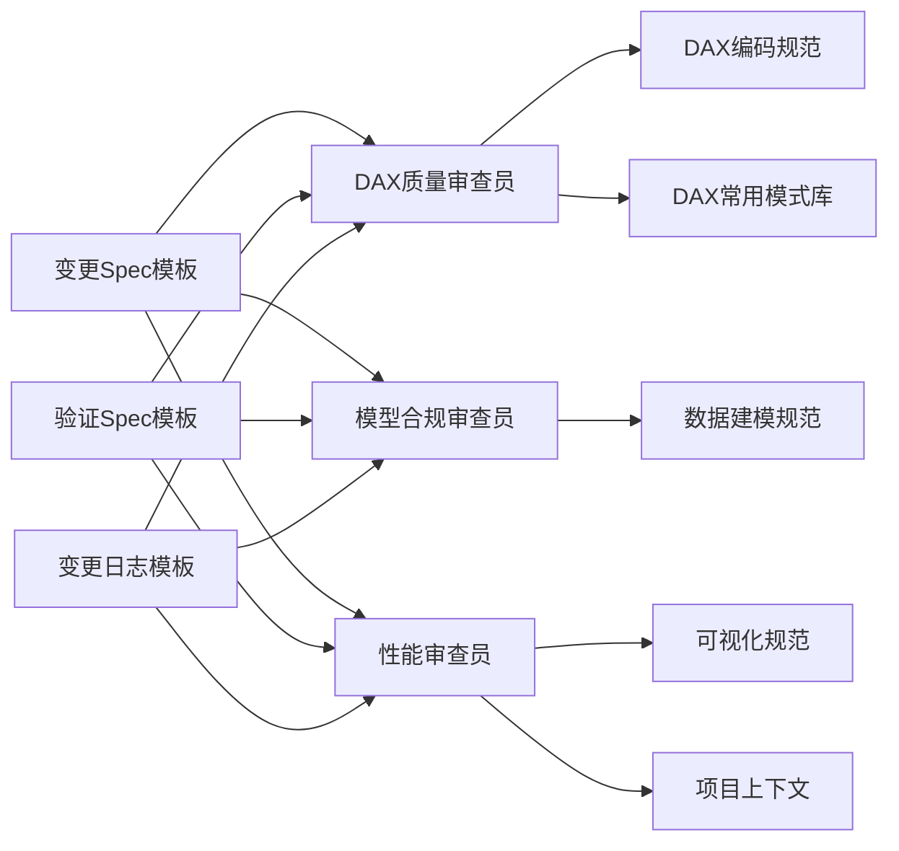

# Power BI优化模块

<cite>
**本文档引用的文件**
- [dax-reviewer.md](file://powerbi_code_copilot/agents/dax-reviewer.md)
- [model-reviewer.md](file://powerbi_code_copilot/agents/model-reviewer.md)
- [performance-reviewer.md](file://powerbi_code_copilot/agents/performance-reviewer.md)
- [dax-style.md](file://powerbi_code_copilot/rules/dax-style.md)
- [modeling-standards.md](file://powerbi_code_copilot/rules/modeling-standards.md)
- [visualization-standards.md](file://powerbi_code_copilot/rules/visualization-standards.md)
- [project-context.md](file://powerbi_code_copilot/rules/project-context.md)
- [dax-patterns.md](file://powerbi_code_copilot/knowledge/dax-patterns.md)
- [spec.md](file://powerbi_code_copilot/changes/templates/spec.md)
- [validation-spec.md](file://powerbi_code_copilot/changes/templates/validation-spec.md)
- [log.md](file://powerbi_code_copilot/changes/templates/log.md)
</cite>

## 目录
1. [引言](#引言)
2. [项目结构](#项目结构)
3. [核心组件](#核心组件)
4. [架构总览](#架构总览)
5. [详细组件分析](#详细组件分析)
6. [依赖分析](#依赖分析)
7. [性能考量](#性能考量)
8. [故障排除指南](#故障排除指南)
9. [结论](#结论)
10. [附录](#附录)

## 引言
本文件系统化阐述Power BI优化模块的设计与实施方法，聚焦于专用的代码审查与优化体系，覆盖DAX表达式质量评估、数据模型验证与性能诊断三大能力域。文档提供可操作的审查分级、性能诊断清单、错误类型识别机制，以及数据模型结构检查、关系验证、度量值验证的完整流程。同时，结合建模标准、可视化标准与项目上下文规则，给出优化模式与常见问题的解决方案，帮助Power BI开发者与数据分析师建立可复用的模型优化与性能调优方法论。

## 项目结构
Power BI优化模块由“审查代理”“规则与标准”“知识库”“变更模板”四大部分组成，形成“规则驱动 + 知识复用 + 流程规范”的闭环。

**图表来源**
- [dax-reviewer.md:1-56](file://powerbi_code_copilot/agents/dax-reviewer.md#L1-L56)
- [model-reviewer.md:1-36](file://powerbi_code_copilot/agents/model-reviewer.md#L1-L36)
- [performance-reviewer.md:1-71](file://powerbi_code_copilot/agents/performance-reviewer.md#L1-L71)
- [dax-style.md:1-218](file://powerbi_code_copilot/rules/dax-style.md#L1-L218)
- [modeling-standards.md:1-88](file://powerbi_code_copilot/rules/modeling-standards.md#L1-L88)
- [visualization-standards.md:1-81](file://powerbi_code_copilot/rules/visualization-standards.md#L1-L81)
- [project-context.md:1-69](file://powerbi_code_copilot/rules/project-context.md#L1-L69)
- [dax-patterns.md:1-205](file://powerbi_code_copilot/knowledge/dax-patterns.md#L1-L205)
- [spec.md:1-95](file://powerbi_code_copilot/changes/templates/spec.md#L1-L95)
- [validation-spec.md:1-69](file://powerbi_code_copilot/changes/templates/validation-spec.md#L1-L69)
- [log.md:1-46](file://powerbi_code_copilot/changes/templates/log.md#L1-L46)

**章节来源**
- [dax-reviewer.md:1-56](file://powerbi_code_copilot/agents/dax-reviewer.md#L1-L56)
- [model-reviewer.md:1-36](file://powerbi_code_copilot/agents/model-reviewer.md#L1-L36)
- [performance-reviewer.md:1-71](file://powerbi_code_copilot/agents/performance-reviewer.md#L1-L71)
- [dax-style.md:1-218](file://powerbi_code_copilot/rules/dax-style.md#L1-L218)
- [modeling-standards.md:1-88](file://powerbi_code_copilot/rules/modeling-standards.md#L1-L88)
- [visualization-standards.md:1-81](file://powerbi_code_copilot/rules/visualization-standards.md#L1-L81)
- [project-context.md:1-69](file://powerbi_code_copilot/rules/project-context.md#L1-L69)
- [dax-patterns.md:1-205](file://powerbi_code_copilot/knowledge/dax-patterns.md#L1-L205)
- [spec.md:1-95](file://powerbi_code_copilot/changes/templates/spec.md#L1-L95)
- [validation-spec.md:1-69](file://powerbi_code_copilot/changes/templates/validation-spec.md#L1-L69)
- [log.md:1-46](file://powerbi_code_copilot/changes/templates/log.md#L1-L46)

## 核心组件
- DAX质量审查员：负责DAX表达式的质量、性能与可维护性审查，提供阻塞/应修复/建议三级分级与性能清单。
- 模型合规审查员：独立验证Power BI数据模型是否符合规格与建模最佳实践，覆盖缺失/多余/偏差/业务规则落地/结构合规/数据变更准确性。
- 性能审查员：独立诊断数据源层、Power Query层、模型层、DAX层与可视化层的性能问题，输出整体评级、问题清单与优化路线图。
- 规则与标准：提供DAX编码规范、数据建模规范、可视化规范与项目上下文，作为审查与优化的依据。
- 知识库：沉淀经验证的DAX模式，支持快速复用与性能优化参考。
- 变更模板：规范变更Spec、验证Spec与变更日志，确保优化过程可追踪、可验证、可沉淀。

**章节来源**
- [dax-reviewer.md:1-56](file://powerbi_code_copilot/agents/dax-reviewer.md#L1-L56)
- [model-reviewer.md:1-36](file://powerbi_code_copilot/agents/model-reviewer.md#L1-L36)
- [performance-reviewer.md:1-71](file://powerbi_code_copilot/agents/performance-reviewer.md#L1-L71)
- [dax-style.md:1-218](file://powerbi_code_copilot/rules/dax-style.md#L1-L218)
- [modeling-standards.md:1-88](file://powerbi_code_copilot/rules/modeling-standards.md#L1-L88)
- [visualization-standards.md:1-81](file://powerbi_code_copilot/rules/visualization-standards.md#L1-L81)
- [project-context.md:1-69](file://powerbi_code_copilot/rules/project-context.md#L1-L69)
- [dax-patterns.md:1-205](file://powerbi_code_copilot/knowledge/dax-patterns.md#L1-L205)
- [spec.md:1-95](file://powerbi_code_copilot/changes/templates/spec.md#L1-L95)
- [validation-spec.md:1-69](file://powerbi_code_copilot/changes/templates/validation-spec.md#L1-L69)
- [log.md:1-46](file://powerbi_code_copilot/changes/templates/log.md#L1-L46)

## 架构总览
审查与优化流程以“规则驱动 + 知识复用 + 模板规范”为核心，贯穿变更提出、设计评审、实现验证与持续优化的全生命周期。

**图表来源**
- [spec.md:1-95](file://powerbi_code_copilot/changes/templates/spec.md#L1-L95)
- [validation-spec.md:1-69](file://powerbi_code_copilot/changes/templates/validation-spec.md#L1-L69)
- [dax-reviewer.md:1-56](file://powerbi_code_copilot/agents/dax-reviewer.md#L1-L56)
- [model-reviewer.md:1-36](file://powerbi_code_copilot/agents/model-reviewer.md#L1-L36)
- [performance-reviewer.md:1-71](file://powerbi_code_copilot/agents/performance-reviewer.md#L1-L71)
- [dax-style.md:1-218](file://powerbi_code_copilot/rules/dax-style.md#L1-L218)
- [modeling-standards.md:1-88](file://powerbi_code_copilot/rules/modeling-standards.md#L1-L88)
- [visualization-standards.md:1-81](file://powerbi_code_copilot/rules/visualization-standards.md#L1-L81)
- [dax-patterns.md:1-205](file://powerbi_code_copilot/knowledge/dax-patterns.md#L1-L205)

## 详细组件分析

### DAX质量审查员
- 审查分级
  - 阻塞（Critical）：计算结果错误、上下文转换错误、循环依赖、隐式度量值歧义、RLS规则绕过风险。
  - 应修复（Important）：未使用VAR导致重复计算、不必要的迭代函数、FILTER(ALL(...))可替换为REMOVEFILTERS、度量值命名不规范、复杂度量值缺少注释、硬编码筛选条件。
  - 建议（Minor）：格式不统一、变量命名不清、可合并的简单度量值。
- 性能审查清单
  - 是否避免不必要的上下文转换
  - CALCULATE筛选参数是否最优
  - 迭代函数是否在最小粒度表上运行
  - 是否利用VAR避免重复计算
  - 时间智能函数是否正确使用日期表
  - 是否存在可预计算为计算列的度量值
- 输出格式
  - 分级列出问题与建议，附带性能影响评估与优化摘要。

**图表来源**
- [dax-reviewer.md:1-56](file://powerbi_code_copilot/agents/dax-reviewer.md#L1-L56)

**章节来源**
- [dax-reviewer.md:1-56](file://powerbi_code_copilot/agents/dax-reviewer.md#L1-L56)

### 模型合规审查员
- 审查维度
  - 缺失实现：spec要求但模型未实现（缺表/缺列/缺度量值/缺关系）
  - 多余实现：spec未要求但多做了（YAGNI违规）
  - 理解偏差：做了但方向错误（关系方向/基数/筛选器传播方向）
  - 业务规则落地：度量值/计算列是否体现spec业务规则
  - 模型结构合规：星型/雪花型模型、事实表与维度表分离、关系正确性、双向筛选合理性、循环依赖
  - 数据变更准确性：spec中的表/字段变更是否准确落地
- 输出格式
  - 模型结构验证、度量值逐条验证、结论（Spec合规/不合规）。

**图表来源**
- [model-reviewer.md:1-36](file://powerbi_code_copilot/agents/model-reviewer.md#L1-L36)

**章节来源**
- [model-reviewer.md:1-36](file://powerbi_code_copilot/agents/model-reviewer.md#L1-L36)

### 性能审查员
- 诊断框架
  - 数据源层：查询折叠、数据源响应延迟、数据量合理性、增量刷新
  - Power Query层：步骤冗余、数据类型源端指定、阻断查询折叠的步骤、合并/追加性能
  - 模型层：表基数与大小、列数据类型最优性、关系数量与复杂度、未使用列/表清理、计算列/计算表/预处理选择、分区策略
  - DAX层：度量值复杂度、迭代函数数据量、上下文转换开销、变量复用、时间智能优化
  - 可视化层：单页视觉对象数量、高基数列在切片器使用、交叉高亮/筛选复杂度、自定义视觉对象性能、条件格式与动态标题开销
- 输出格式
  - 性能评估摘要（整体评级、模型大小、度量值数量、表数量）、问题清单（按影响排序）、优化路线图。

**图表来源**
- [performance-reviewer.md:1-71](file://powerbi_code_copilot/agents/performance-reviewer.md#L1-L71)

**章节来源**
- [performance-reviewer.md:1-71](file://powerbi_code_copilot/agents/performance-reviewer.md#L1-L71)

### DAX编码规范与建模标准
- DAX编码规范
  - 命名约定：度量值、计算列、表命名前缀与语义、变量命名风格、注释要求
  - 格式规范：缩进与换行、注释格式、长参数列表换行
  - 编写原则：性能优先、上下文清晰、可维护性
  - 禁止事项：隐式度量值、硬编码日期/参数、EARLIER使用、CALCULATE嵌套、计算列引用度量值
  - 检查清单与常见错误示例
- 数据建模规范
  - 架构：星型模型优先、表类型标识、雪花型使用限制
  - 关系设计：1:N方向、筛选方向、双向筛选的业务理由、循环依赖禁止、日期表要求
  - 表设计：事实表/维度表/列优化、存储模式、未使用对象清理
  - 度量值组织：Display Folder分组、度量值表管理
  - 禁止事项：自动日期/时间表、事实表间直接关系、多对多关系、未使用对象、内置隐藏日期层级

**图表来源**
- [dax-style.md:1-218](file://powerbi_code_copilot/rules/dax-style.md#L1-L218)
- [modeling-standards.md:1-88](file://powerbi_code_copilot/rules/modeling-standards.md#L1-L88)

**章节来源**
- [dax-style.md:1-218](file://powerbi_code_copilot/rules/dax-style.md#L1-L218)
- [modeling-standards.md:1-88](file://powerbi_code_copilot/rules/modeling-standards.md#L1-L88)

### 可视化规范与项目上下文
- 可视化规范
  - 布局与设计原则：页面布局、色彩方案、字体规范
  - 图表选型指南：不同分析目的的图表选择与禁忌
  - 交互设计：切片器、钻取与书签、交叉筛选
  - 移动端适配与可访问性
- 项目上下文
  - 项目概况、数据源清单、数据模型结构、度量值分组、报表页面清单、安全配置、关键依赖

**章节来源**
- [visualization-standards.md:1-81](file://powerbi_code_copilot/rules/visualization-standards.md#L1-L81)
- [project-context.md:1-69](file://powerbi_code_copilot/rules/project-context.md#L1-L69)

### DAX常用模式库
- 模式类别：累计求和、同比/环比、动态Top N、ABC分析、移动平均、半加性度量值
- 每个模式包含：场景、代码、解释、性能说明，便于复用与性能优化参考

**章节来源**
- [dax-patterns.md:1-205](file://powerbi_code_copilot/knowledge/dax-patterns.md#L1-L205)

### 变更模板与验证流程
- 变更Spec模板
  - 背景与目标、现状分析、功能点、业务规则、模型变更、DAX度量值设计、Power Query变更、可视化变更、影响范围、风险与关注点、验证策略、技术决策、执行日志、审查结论
- 验证Spec模板
  - 验证原则、验证环境、数据准确性验证（P0/P1/P2）、模型结构验证、性能验证、安全验证、执行计划
- 变更日志模板
  - 时间线、技术决策、踩坑记录、知识发现、Spec-实现偏差记录、性能对比记录、质量备忘

**章节来源**
- [spec.md:1-95](file://powerbi_code_copilot/changes/templates/spec.md#L1-L95)
- [validation-spec.md:1-69](file://powerbi_code_copilot/changes/templates/validation-spec.md#L1-L69)
- [log.md:1-46](file://powerbi_code_copilot/changes/templates/log.md#L1-L46)

## 依赖分析
审查代理与规则/知识/模板之间的耦合关系如下：

**图表来源**
- [dax-reviewer.md:1-56](file://powerbi_code_copilot/agents/dax-reviewer.md#L1-L56)
- [model-reviewer.md:1-36](file://powerbi_code_copilot/agents/model-reviewer.md#L1-L36)
- [performance-reviewer.md:1-71](file://powerbi_code_copilot/agents/performance-reviewer.md#L1-L71)
- [dax-style.md:1-218](file://powerbi_code_copilot/rules/dax-style.md#L1-L218)
- [modeling-standards.md:1-88](file://powerbi_code_copilot/rules/modeling-standards.md#L1-L88)
- [visualization-standards.md:1-81](file://powerbi_code_copilot/rules/visualization-standards.md#L1-L81)
- [project-context.md:1-69](file://powerbi_code_copilot/rules/project-context.md#L1-L69)
- [dax-patterns.md:1-205](file://powerbi_code_copilot/knowledge/dax-patterns.md#L1-L205)
- [spec.md:1-95](file://powerbi_code_copilot/changes/templates/spec.md#L1-L95)
- [validation-spec.md:1-69](file://powerbi_code_copilot/changes/templates/validation-spec.md#L1-L69)
- [log.md:1-46](file://powerbi_code_copilot/changes/templates/log.md#L1-L46)

**章节来源**
- [dax-reviewer.md:1-56](file://powerbi_code_copilot/agents/dax-reviewer.md#L1-L56)
- [model-reviewer.md:1-36](file://powerbi_code_copilot/agents/model-reviewer.md#L1-L36)
- [performance-reviewer.md:1-71](file://powerbi_code_copilot/agents/performance-reviewer.md#L1-L71)
- [dax-style.md:1-218](file://powerbi_code_copilot/rules/dax-style.md#L1-L218)
- [modeling-standards.md:1-88](file://powerbi_code_copilot/rules/modeling-standards.md#L1-L88)
- [visualization-standards.md:1-81](file://powerbi_code_copilot/rules/visualization-standards.md#L1-L81)
- [project-context.md:1-69](file://powerbi_code_copilot/rules/project-context.md#L1-L69)
- [dax-patterns.md:1-205](file://powerbi_code_copilot/knowledge/dax-patterns.md#L1-L205)
- [spec.md:1-95](file://powerbi_code_copilot/changes/templates/spec.md#L1-L95)
- [validation-spec.md:1-69](file://powerbi_code_copilot/changes/templates/validation-spec.md#L1-L69)
- [log.md:1-46](file://powerbi_code_copilot/changes/templates/log.md#L1-L46)

## 性能考量
- 性能优先原则
  - 优先使用VAR避免重复计算
  - 避免嵌套CALCULATE（超过2层需重构）
  - 优先使用REMOVEFILTERS替代FILTER(ALL(...))
  - 迭代函数注意迭代表的大小
  - 避免在度量值中使用IF+大型表迭代
- 上下文清晰
  - 明确区分行上下文与筛选器上下文
  - CALCULATE的每个筛选参数必须有明确意图
  - 避免不必要的上下文转换
  - 使用SELECTEDVALUE替代VALUES（当期望单值时）
- 可维护性
  - 复杂计算分解为多个度量值（基础→中间→最终）
  - 使用Display Folder组织度量值
  - 每个度量值单一职责

**章节来源**
- [dax-style.md:143-162](file://powerbi_code_copilot/rules/dax-style.md#L143-L162)

## 故障排除指南
- 常见错误类型与识别机制
  - 计算结果错误：通过验证Spec模板中的数据准确性验证与对比验证定位
  - 上下文转换错误：检查CALCULATE使用与筛选器传播方向，参考性能审查清单
  - 循环依赖：通过模型结构验证与关系文档化识别
  - 隐式度量值歧义：通过命名规范与禁止事项检查
  - RLS规则绕过：通过安全验证与RLS规则测试
- 优化建议与路线图
  - 首先：查询折叠生效、阻断折叠的步骤、未使用列/表清理
  - 然后：迭代函数优化、上下文转换开销降低、时间智能函数优化
  - 最后：可视化层优化（单页视觉对象数量、交叉筛选复杂度、自定义视觉对象）

**章节来源**
- [dax-reviewer.md:7-26](file://powerbi_code_copilot/agents/dax-reviewer.md#L7-L26)
- [performance-reviewer.md:40-67](file://powerbi_code_copilot/agents/performance-reviewer.md#L40-L67)
- [validation-spec.md:6-12](file://powerbi_code_copilot/changes/templates/validation-spec.md#L6-L12)

## 结论
Power BI优化模块通过“规则驱动 + 知识复用 + 模板规范”的方法论，构建了覆盖DAX质量、模型合规与性能诊断的系统化能力。依托标准化的审查分级、性能清单与验证流程，能够有效提升模型质量与报表性能，降低维护成本，保障业务可解释性与可扩展性。建议在项目实践中持续沉淀知识库与变更日志，形成可传承的优化经验。

## 附录
- 变更流程要点
  - 使用变更Spec模板明确背景、现状、功能点与业务规则
  - 通过审查代理进行DAX/模型/性能审查
  - 使用验证Spec模板进行数据准确性、模型结构、性能与安全验证
  - 通过变更日志模板沉淀技术决策与踩坑记录
- 参考资源
  - DAX常用模式库：累计求和、同比/环比、动态Top N、ABC分析、移动平均、半加性度量值

**章节来源**
- [spec.md:1-95](file://powerbi_code_copilot/changes/templates/spec.md#L1-L95)
- [validation-spec.md:1-69](file://powerbi_code_copilot/changes/templates/validation-spec.md#L1-L69)
- [log.md:1-46](file://powerbi_code_copilot/changes/templates/log.md#L1-L46)
- [dax-patterns.md:1-205](file://powerbi_code_copilot/knowledge/dax-patterns.md#L1-L205)