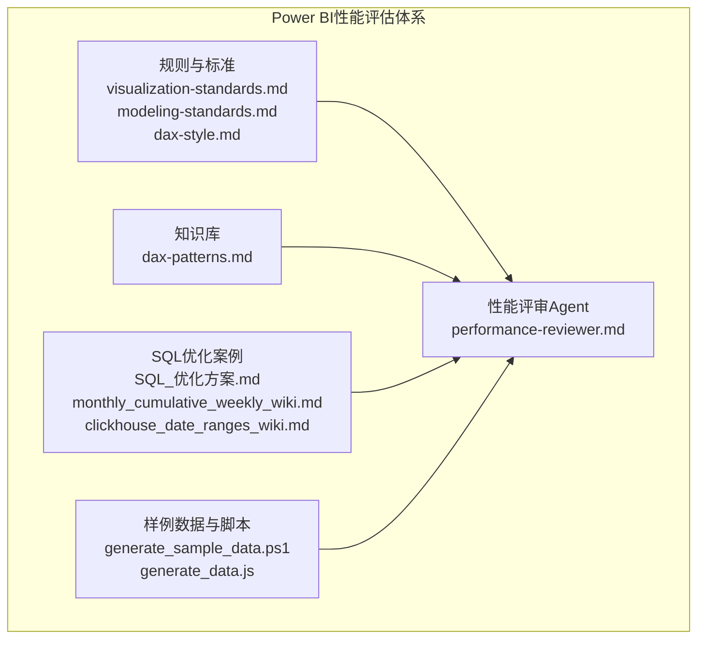
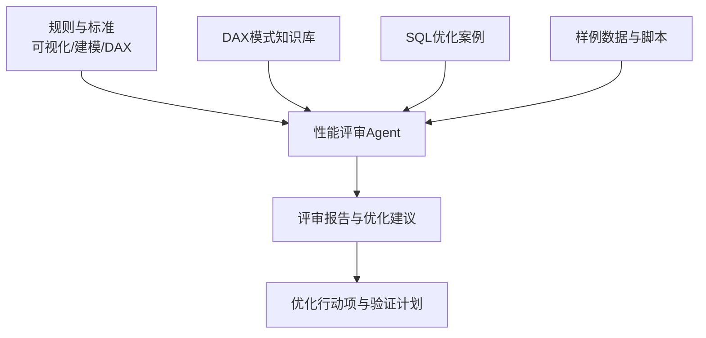
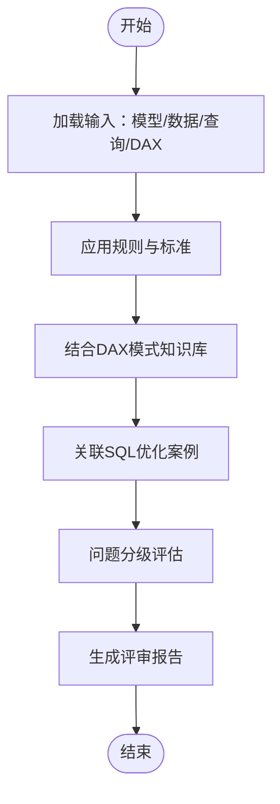
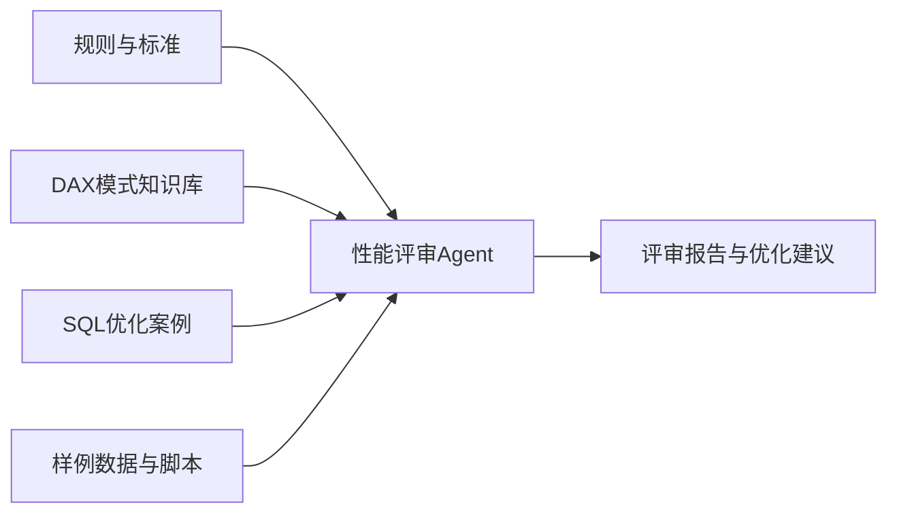

# 性能评估

<cite>
**本文引用的文件**
- [performance-reviewer.md](file://powerbi_code_copilot/agents/performance-reviewer.md)
- [visualization-standards.md](file://powerbi_code_copilot/rules/visualization-standards.md)
- [modeling-standards.md](file://powerbi_code_copilot/rules/modeling-standards.md)
- [dax-style.md](file://powerbi_code_copilot/rules/dax-style.md)
- [dax-patterns.md](file://powerbi_code_copilot/knowledge/dax-patterns.md)
- [SQL_优化方案.md](file://Quickbi_sql/MAP/我的门店/SQL_优化方案.md)
- [monthly_cumulative_weekly_wiki.md](file://Quickbi_sql/周大福/周大福_日期范围生成_ARRAY JOIN_Clickhou/wiki/monthly_cumulative_weekly_wiki.md)
- [clickhouse_date_ranges_wiki.md](file://Quickbi_sql/周大福/周大福_日期范围生成_demo/clickhouse_date_ranges_wiki.md)
- [generate_sample_data.ps1](file://RL E2E/数据demo/powerbi_data/powerbi_traffic/generate_sample_data.ps1)
- [generate_data.js](file://RL E2E/数据demo/powerbi_data/generate_data.js)
</cite>

## 目录
1. [简介](#简介)
2. [项目结构](#项目结构)
3. [核心组件](#核心组件)
4. [架构总览](#架构总览)
5. [详细组件分析](#详细组件分析)
6. [依赖关系分析](#依赖关系分析)
7. [性能考量](#性能考量)
8. [故障排查指南](#故障排查指南)
9. [结论](#结论)
10. [附录](#附录)

## 简介
本文件面向Power BI管理员与性能工程师，系统化梳理性能评估与优化方法论，覆盖以下主题：
- 性能诊断方法与问题分级评估
- 可视化性能优化标准与交互响应时间优化
- 数据加载优化策略（建模、DAX、查询）
- 性能监控指标与基准测试方法（查询性能、内存使用、渲染效率）
- 工具权限管理与资源优化配置
- 结合仓库中的规则与样例，形成可落地的优化路线图

## 项目结构
该仓库围绕Power BI性能评估与优化提供了多类资产：
- 规则与标准：可视化标准、建模规范、DAX风格与模式
- 代理（Agent）：性能评审器等自动化质量把关工具
- SQL优化案例：ClickHouse日期范围生成与聚合场景的优化实践
- 样例数据与生成脚本：用于构建测试环境与基准测试

**图表来源**
- [visualization-standards.md](file://powerbi_code_copilot/rules/visualization-standards.md)
- [modeling-standards.md](file://powerbi_code_copilot/rules/modeling-standards.md)
- [dax-style.md](file://powerbi_code_copilot/rules/dax-style.md)
- [dax-patterns.md](file://powerbi_code_copilot/knowledge/dax-patterns.md)
- [performance-reviewer.md](file://powerbi_code_copilot/agents/performance-reviewer.md)
- [SQL_优化方案.md](file://Quickbi_sql/MAP/我的门店/SQL_优化方案.md)
- [monthly_cumulative_weekly_wiki.md](file://Quickbi_sql/周大福/周大福_日期范围生成_ARRAY JOIN_Clickhou/wiki/monthly_cumulative_weekly_wiki.md)
- [clickhouse_date_ranges_wiki.md](file://Quickbi_sql/周大福/周大福_日期范围生成_demo/clickhouse_date_ranges_wiki.md)
- [generate_sample_data.ps1](file://RL E2E/数据demo/powerbi_data/powerbi_traffic/generate_sample_data.ps1)
- [generate_data.js](file://RL E2E/数据demo/powerbi_traffic/generate_sample_data.ps1)

**章节来源**
- [performance-reviewer.md](file://powerbi_code_copilot/agents/performance-reviewer.md)
- [visualization-standards.md](file://powerbi_code_copilot/rules/visualization-standards.md)
- [modeling-standards.md](file://powerbi_code_copilot/rules/modeling-standards.md)
- [dax-style.md](file://powerbi_code_copilot/rules/dax-style.md)
- [dax-patterns.md](file://powerbi_code_copilot/knowledge/dax-patterns.md)
- [SQL_优化方案.md](file://Quickbi_sql/MAP/我的门店/SQL_优化方案.md)
- [monthly_cumulative_weekly_wiki.md](file://Quickbi_sql/周大福/周大福_日期范围生成_ARRAY JOIN_Clickhou/wiki/monthly_cumulative_weekly_wiki.md)
- [clickhouse_date_ranges_wiki.md](file://Quickbi_sql/周大福/周大福_日期范围生成_demo/clickhouse_date_ranges_wiki.md)
- [generate_sample_data.ps1](file://RL E2E/数据demo/powerbi_data/powerbi_traffic/generate_sample_data.ps1)
- [generate_data.js](file://RL E2E/数据demo/powerbi_data/generate_data.js)

## 核心组件
- 性能评审Agent：基于规则与知识库对Power BI模型进行性能维度的自动评审，输出问题与改进建议。
- 规则与标准：定义可视化、建模与DAX层面的性能约束与最佳实践，作为评审依据。
- 知识库：沉淀常见DAX模式与反模式，辅助识别潜在性能瓶颈。
- SQL优化案例：提供具体场景下的查询优化思路与实现参考。
- 样例数据与脚本：支撑基准测试与回归验证。

**章节来源**
- [performance-reviewer.md](file://powerbi_code_copilot/agents/performance-reviewer.md)
- [visualization-standards.md](file://powerbi_code_copilot/rules/visualization-standards.md)
- [modeling-standards.md](file://powerbi_code_copilot/rules/modeling-standards.md)
- [dax-style.md](file://powerbi_code_copilot/rules/dax-style.md)
- [dax-patterns.md](file://powerbi_code_copilot/knowledge/dax-patterns.md)
- [SQL_优化方案.md](file://Quickbi_sql/MAP/我的门店/SQL_优化方案.md)

## 架构总览
下图展示了从“规则与知识库”到“性能评审Agent”，再到“SQL优化案例与样例数据”的整体评估与优化流程。

**图表来源**
- [performance-reviewer.md](file://powerbi_code_copilot/agents/performance-reviewer.md)
- [visualization-standards.md](file://powerbi_code_copilot/rules/visualization-standards.md)
- [modeling-standards.md](file://powerbi_code_copilot/rules/modeling-standards.md)
- [dax-style.md](file://powerbi_code_copilot/rules/dax-style.md)
- [dax-patterns.md](file://powerbi_code_copilot/knowledge/dax-patterns.md)
- [SQL_优化方案.md](file://Quickbi_sql/MAP/我的门店/SQL_优化方案.md)
- [generate_sample_data.ps1](file://RL E2E/数据demo/powerbi_data/powerbi_traffic/generate_sample_data.ps1)
- [generate_data.js](file://RL E2E/数据demo/powerbi_data/generate_data.js)

## 详细组件分析

### 组件A：性能评审Agent
- 职责：基于规则与知识库对Power BI模型进行性能维度的自动评审，输出问题分级与优化建议。
- 输入：模型结构、DAX表达式、可视化配置、数据源查询。
- 输出：问题清单（严重/高/中/低）、根因定位、修复建议、验证路径。
- 评审维度：可视化复杂度、DAX计算成本、数据模型设计、查询路径与缓存命中率、交互响应时间预期。

**图表来源**
- [performance-reviewer.md](file://powerbi_code_copilot/agents/performance-reviewer.md)
- [visualization-standards.md](file://powerbi_code_copilot/rules/visualization-standards.md)
- [modeling-standards.md](file://powerbi_code_copilot/rules/modeling-standards.md)
- [dax-style.md](file://powerbi_code_copilot/rules/dax-style.md)
- [dax-patterns.md](file://powerbi_code_copilot/knowledge/dax-patterns.md)
- [SQL_优化方案.md](file://Quickbi_sql/MAP/我的门店/SQL_优化方案.md)

**章节来源**
- [performance-reviewer.md](file://powerbi_code_copilot/agents/performance-reviewer.md)

### 组件B：可视化性能优化标准
- 关注点：视觉元素数量、筛选器链路、动态计算字段、切片器与报表交互频率、分页与懒加载策略。
- 优化目标：降低渲染压力、减少重绘次数、缩短交互响应时间。
- 评审要点：是否存在过度计算、是否使用了昂贵的DAX函数、是否滥用动态标题/条件格式、是否缺少必要的索引或分区。

**章节来源**
- [visualization-standards.md](file://powerbi_code_copilot/rules/visualization-standards.md)

### 组件C：建模与DAX性能标准
- 建模：星型/雪花模型、维度表与事实表分离、合理使用桥接表、避免冗余列。
- DAX：优先使用标量计算、避免在视觉级别重复计算、减少上下文转换、利用早期过滤与缓存。
- 风格：命名规范、注释规范、版本控制与变更追踪。

**章节来源**
- [modeling-standards.md](file://powerbi_code_copilot/rules/modeling-standards.md)
- [dax-style.md](file://powerbi_code_copilot/rules/dax-style.md)

### 组件D：DAX模式知识库
- 作用：沉淀常见高效与低效的DAX模式，辅助快速识别潜在性能瓶颈。
- 应用：在评审Agent中作为“模式匹配”与“反模式提示”的依据。

**章节来源**
- [dax-patterns.md](file://powerbi_code_copilot/knowledge/dax-patterns.md)

### 组件E：SQL优化案例
- 场景：ClickHouse日期范围生成、数组JOIN、累计聚合等。
- 方法：通过合理的查询路径、索引与分区策略，降低数据扫描与计算开销。
- 价值：为Power BI数据层优化提供可复用的模板与思路。

**章节来源**
- [SQL_优化方案.md](file://Quickbi_sql/MAP/我的门店/SQL_优化方案.md)
- [monthly_cumulative_weekly_wiki.md](file://Quickbi_sql/周大福/周大福_日期范围生成_ARRAY JOIN_Clickhou/wiki/monthly_cumulative_weekly_wiki.md)
- [clickhouse_date_ranges_wiki.md](file://Quickbi_sql/周大福/周大福_日期范围生成_demo/clickhouse_date_ranges_wiki.md)

### 组件F：样例数据与脚本
- 用途：构建可重复的基准测试环境，模拟不同规模与分布的数据集，验证优化效果。
- 覆盖：生成样本数据、批量生成报表、自动化回归测试。

**章节来源**
- [generate_sample_data.ps1](file://RL E2E/数据demo/powerbi_data/powerbi_traffic/generate_sample_data.ps1)
- [generate_data.js](file://RL E2E/数据demo/powerbi_data/generate_data.js)

## 依赖关系分析
- 性能评审Agent依赖规则与标准、DAX模式知识库、SQL优化案例与样例数据。
- 规则与标准为评审提供“基线”，知识库提供“模式识别”，案例提供“实证参考”，样例数据提供“验证载体”。

**图表来源**
- [performance-reviewer.md](file://powerbi_code_copilot/agents/performance-reviewer.md)
- [visualization-standards.md](file://powerbi_code_copilot/rules/visualization-standards.md)
- [modeling-standards.md](file://powerbi_code_copilot/rules/modeling-standards.md)
- [dax-style.md](file://powerbi_code_copilot/rules/dax-style.md)
- [dax-patterns.md](file://powerbi_code_copilot/knowledge/dax-patterns.md)
- [SQL_优化方案.md](file://Quickbi_sql/MAP/我的门店/SQL_优化方案.md)
- [generate_sample_data.ps1](file://RL E2E/数据demo/powerbi_data/powerbi_traffic/generate_sample_data.ps1)
- [generate_data.js](file://RL E2E/数据demo/powerbi_data/generate_data.js)

**章节来源**
- [performance-reviewer.md](file://powerbi_code_copilot/agents/performance-reviewer.md)

## 性能考量
- 可视化性能优化标准
  - 控制视觉元素数量与复杂度，避免在视觉级别重复计算。
  - 合理使用切片器与筛选器链路，减少不必要的上下文切换。
  - 使用分页与懒加载策略，降低单次渲染压力。
- 交互响应时间优化
  - 通过早期过滤与缓存提升交互响应速度；避免在用户操作时触发昂贵的DAX计算。
  - 对高频交互的视觉元素采用预计算列或度量缓存。
- 数据加载优化策略
  - 建模层面：星型模型、合理分区与索引；减少冗余列与重复计算。
  - 查询层面：优化SQL路径、使用数组JOIN与累计聚合等高效模式。
  - DAX层面：优先标量计算、避免上下文转换、减少重复计算。
- 性能监控指标与基准测试
  - 指标：查询执行时间、内存使用峰值、渲染耗时、缓存命中率、交互延迟。
  - 基准：以样例数据为基础，设定不同规模的测试集，定期回归验证。
- 工具权限管理与资源优化配置
  - 权限：最小权限原则，限制对敏感数据源的直接访问。
  - 资源：合理配置数据集刷新频率、缓存大小与并发连接数，避免资源争用。

[本节为通用性能指导，不直接分析具体文件]

## 故障排查指南
- 常见问题与定位
  - 交互卡顿：检查是否存在昂贵的DAX计算或过多的视觉元素。
  - 加载缓慢：核查数据模型设计与查询路径，确认索引与分区是否合理。
  - 内存占用高：排查是否存在重复计算、未清理的临时变量或缓存溢出。
- 评审与验证流程
  - 使用性能评审Agent生成问题清单与修复建议。
  - 基于样例数据与脚本进行基准测试，验证修复效果。
  - 将优化结果纳入规则与知识库，形成持续改进闭环。

**章节来源**
- [performance-reviewer.md](file://powerbi_code_copilot/agents/performance-reviewer.md)
- [visualization-standards.md](file://powerbi_code_copilot/rules/visualization-standards.md)
- [modeling-standards.md](file://powerbi_code_copilot/rules/modeling-standards.md)
- [dax-style.md](file://powerbi_code_copilot/rules/dax-style.md)
- [dax-patterns.md](file://powerbi_code_copilot/knowledge/dax-patterns.md)
- [SQL_优化方案.md](file://Quickbi_sql/MAP/我的门店/SQL_优化方案.md)
- [generate_sample_data.ps1](file://RL E2E/数据demo/powerbi_data/powerbi_traffic/generate_sample_data.ps1)
- [generate_data.js](file://RL E2E/数据demo/powerbi_data/generate_data.js)

## 结论
通过将规则与标准、DAX模式知识库、SQL优化案例与样例数据相结合，性能评审Agent能够为Power BI提供系统化的性能评估与优化支持。建议在日常开发中持续应用该体系，建立基准测试与回归验证机制，确保性能质量的持续改进。

[本节为总结性内容，不直接分析具体文件]

## 附录
- 术语说明
  - 缓存命中率：衡量重复查询被缓存命中的比例，越高越好。
  - 交互延迟：用户操作到界面响应的时间，越短越好。
  - 渲染耗时：报表渲染完成所需时间，越短越好。
- 最佳实践清单
  - 在建模阶段即考虑查询与缓存需求。
  - 在DAX中优先使用标量计算与早期过滤。
  - 在可视化中控制复杂度与交互频率。
  - 定期进行基准测试与回归验证。

[本节为概念性内容，不直接分析具体文件]