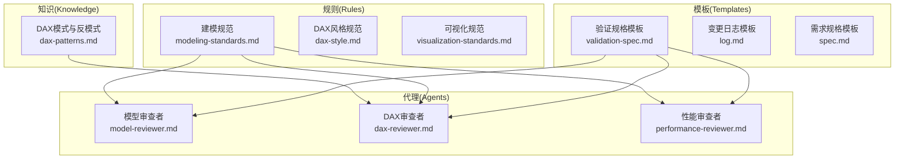
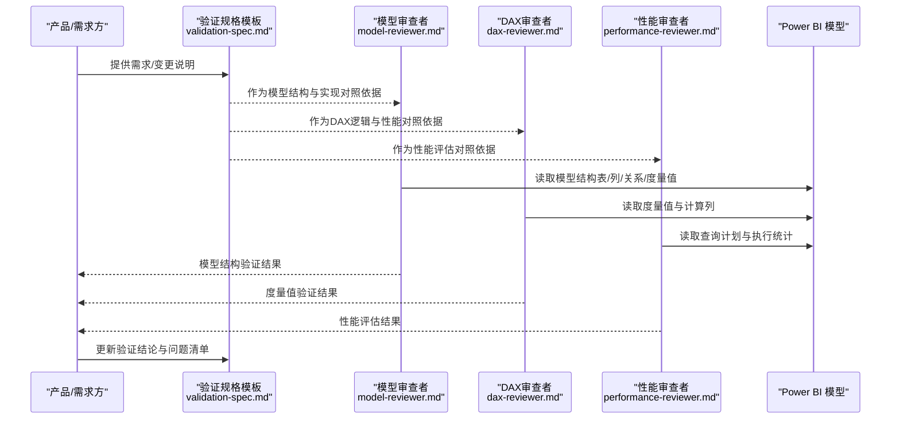
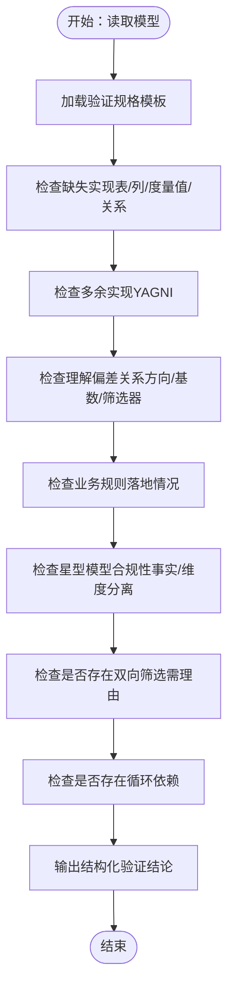
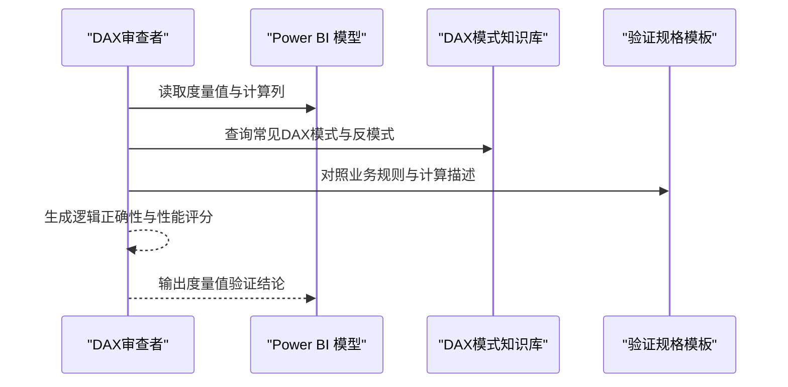
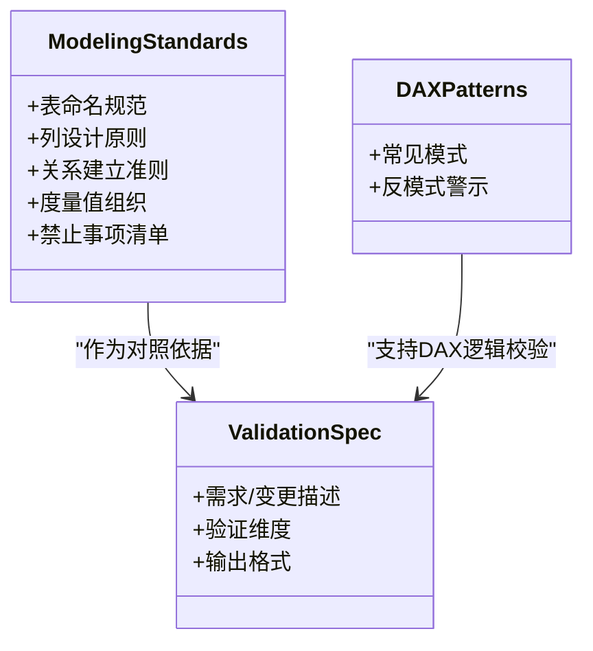
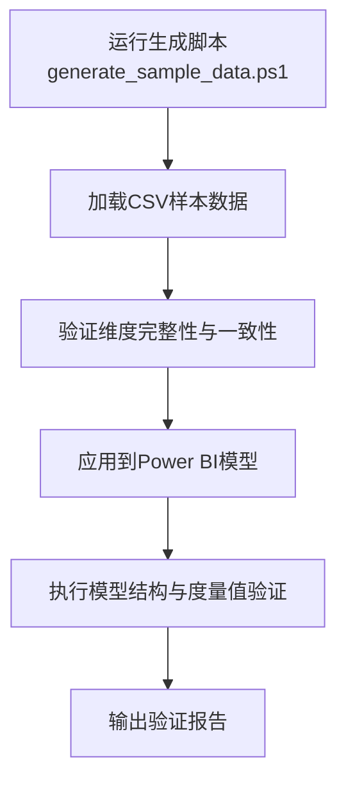
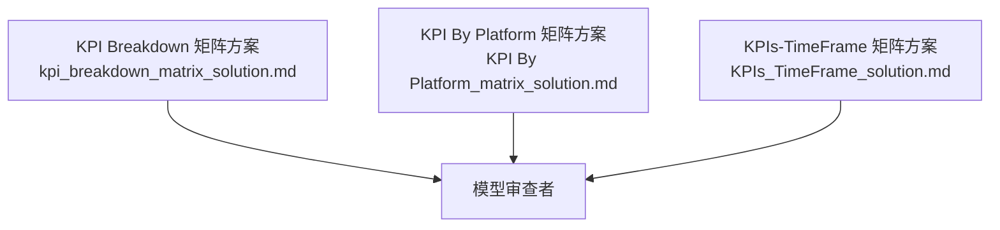
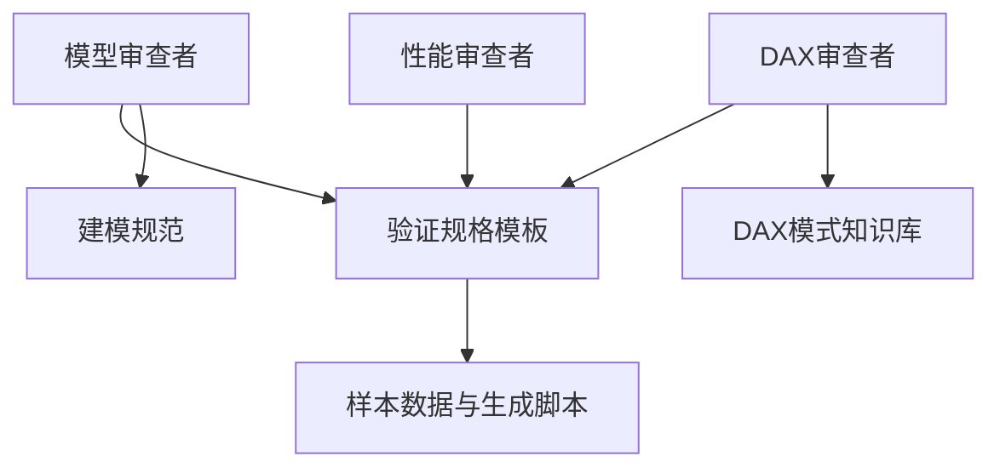

# 数据模型验证

<cite>
**本文引用的文件**
- [model-reviewer.md](file://powerbi_code_copilot/agents/model-reviewer.md)
- [modeling-standards.md](file://powerbi_code_copilot/rules/modeling-standards.md)
- [validation-spec.md](file://powerbi_code_copilot/changes/templates/validation-spec.md)
- [dax-patterns.md](file://powerbi_code_copilot/knowledge/dax-patterns.md)
- [dax-reviewer.md](file://powerbi_code_copilot/agents/dax-reviewer.md)
- [performance-reviewer.md](file://powerbi_code_copilot/agents/performance-reviewer.md)
- [kpi_breakdown_matrix_solution.md](file://RL E2E/RL E2E Traffic_Dashboard/KPI Breakdown/kpi_breakdown_matrix_solution.md)
- [KPI By Platform_matrix_solution.md](file://RL E2E/RL E2E Traffic_Dashboard/KPI By Platform/KPI By Platform_matrix_solution.md)
- [KPIs_TimeFrame_solution.md](file://RL E2E/RL E2E Traffic_Dashboard/kPIs/KPIs_TimeFrame_solution.md)
- [generate_sample_data.ps1](file://RL E2E/数据demo/powerbi_data/powerbi_traffic/generate_sample_data.ps1)
- [Dim_Date_sample.csv](file://RL E2E/数据demo/powerbi_data/powerbi_traffic/Dim_Date_sample.csv)
- [KP_KPIs_sample.csv](file://RL E2E/数据demo/powerbi_data/powerbi_traffic/KP_KPIs_sample.csv)
- [01_Overview_KPI.csv](file://RL E2E/数据demo/powerbi_data/01_Overview_KPI.csv)
- [02_Media_Matrix.csv](file://RL E2E/数据demo/powerbi_data/02_Media_Matrix.csv)
- [03_Keywords.csv](file://RL E2E/数据demo/powerbi_data/03_Keywords.csv)
- [04_Crowd.csv](file://RL E2E/数据demo/powerbi_data/04_Crowd.csv)
- [05_Category_Breakthrough.csv](file://RL E2E/数据demo/powerbi_data/05_Category_Breakthrough.csv)
- [06_Fee_Detail.csv](file://RL E2E/数据demo/powerbi_data/06_Fee_Detail.csv)
</cite>

## 目录
1. [引言](#引言)
2. [项目结构](#项目结构)
3. [核心组件](#核心组件)
4. [架构总览](#架构总览)
5. [详细组件分析](#详细组件分析)
6. [依赖分析](#依赖分析)
7. [性能考量](#性能考量)
8. [故障排查指南](#故障排查指南)
9. [结论](#结论)
10. [附录](#附录)

## 引言
本文件面向数据建模师与Power BI开发者，系统化阐述“数据模型验证”的专业流程与方法论。内容覆盖：
- 星型模型设计原则与表关系优化
- 关系验证与数据完整性检查
- 度量值验证：计算逻辑、性能与业务规则一致性
- 建模标准规范：命名、列设计、关系建立最佳实践
- 基于仓库现有规则与模板的可执行验证清单与流程

目标是帮助团队建立可重复、可追溯、可量化的模型质量保证体系。

## 项目结构
该仓库围绕Power BI建模与质量保障形成“规则-模板-知识-代理”协同体系：
- rules：建模与DAX风格的权威规范
- changes/templates：变更与验证的结构化模板
- knowledge：DAX模式与常见陷阱
- agents：三类审查者（模型合规、DAX逻辑、性能）的职责与流程

**图示来源**
- [modeling-standards.md](file://powerbi_code_copilot/rules/modeling-standards.md)
- [validation-spec.md](file://powerbi_code_copilot/changes/templates/validation-spec.md)
- [dax-patterns.md](file://powerbi_code_copilot/knowledge/dax-patterns.md)
- [model-reviewer.md](file://powerbi_code_copilot/agents/model-reviewer.md)
- [dax-reviewer.md](file://powerbi_code_copilot/agents/dax-reviewer.md)
- [performance-reviewer.md](file://powerbi_code_copilot/agents/performance-reviewer.md)

**章节来源**
- [modeling-standards.md](file://powerbi_code_copilot/rules/modeling-standards.md)
- [validation-spec.md](file://powerbi_code_copilot/changes/templates/validation-spec.md)
- [dax-patterns.md](file://powerbi_code_copilot/knowledge/dax-patterns.md)
- [model-reviewer.md](file://powerbi_code_copilot/agents/model-reviewer.md)
- [dax-reviewer.md](file://powerbi_code_copilot/agents/dax-reviewer.md)
- [performance-reviewer.md](file://powerbi_code_copilot/agents/performance-reviewer.md)

## 核心组件
- 模型审查者（Model Compliance Reviewer）
  - 职责：基于实际模型结构进行独立验证，确保与需求/规范一致
  - 关注点：缺失实现、多余实现、理解偏差、业务规则落地、模型结构合规、数据变更准确性
- DAX审查者（DAX Reviewer）
  - 职责：聚焦度量值与计算列的逻辑正确性、性能与可维护性
- 性能审查者（Performance Reviewer）
  - 职责：识别潜在性能瓶颈，提出优化建议
- 建模规范（Modeling Standards）
  - 覆盖表/列/关系/度量值组织与禁止事项
- 验证规格模板（Validation Spec Template）
  - 提供结构化输出格式，便于记录与追踪问题

**章节来源**
- [model-reviewer.md](file://powerbi_code_copilot/agents/model-reviewer.md)
- [modeling-standards.md](file://powerbi_code_copilot/rules/modeling-standards.md)
- [validation-spec.md](file://powerbi_code_copilot/changes/templates/validation-spec.md)
- [dax-reviewer.md](file://powerbi_code_copilot/agents/dax-reviewer.md)
- [performance-reviewer.md](file://powerbi_code_copilot/agents/performance-reviewer.md)

## 架构总览
下图展示了从“需求/规范”到“模型验证”的端到端流程，以及三类审查者如何协作：

**图示来源**
- [validation-spec.md](file://powerbi_code_copilot/changes/templates/validation-spec.md)
- [model-reviewer.md](file://powerbi_code_copilot/agents/model-reviewer.md)
- [dax-reviewer.md](file://powerbi_code_copilot/agents/dax-reviewer.md)
- [performance-reviewer.md](file://powerbi_code_copilot/agents/performance-reviewer.md)

## 详细组件分析

### 组件一：模型结构验证（星型模型与关系校验）
- 设计原则
  - 星型/雪花模型：事实表与维度表分离；维度表尽量去规范化
  - 关系方向：1:N 明确，避免交叉筛选导致的歧义
  - 双向筛选：仅在有明确业务理由时启用
  - 循环依赖：必须消除
- 实施要点
  - 缺失实现：对照需求/规范检查是否存在缺失的表/列/度量值/关系
  - 多余实现：避免YAGNI（不必要的复杂度）
  - 理解偏差：关系方向、基数、筛选器传播方向是否与业务一致
  - 数据变更准确性：需求中的表/字段变更是否准确落地

**图示来源**
- [model-reviewer.md](file://powerbi_code_copilot/agents/model-reviewer.md)
- [validation-spec.md](file://powerbi_code_copilot/changes/templates/validation-spec.md)

**章节来源**
- [model-reviewer.md](file://powerbi_code_copilot/agents/model-reviewer.md)
- [validation-spec.md](file://powerbi_code_copilot/changes/templates/validation-spec.md)

### 组件二：度量值验证（逻辑、性能与业务规则）
- 计算逻辑检查
  - 对照需求/规范逐条核验度量值实现
  - 关注DAX模式与反模式，避免常见陷阱
- 性能评估
  - 识别潜在高成本计算（如跨表聚合、复杂迭代）
  - 建议使用缓存、预聚合或桥接表等手段优化
- 业务规则验证
  - 确保度量值与业务规则一致，例如时间维度、汇率转换、折扣规则等

**图示来源**
- [dax-reviewer.md](file://powerbi_code_copilot/agents/dax-reviewer.md)
- [dax-patterns.md](file://powerbi_code_copilot/knowledge/dax-patterns.md)
- [validation-spec.md](file://powerbi_code_copilot/changes/templates/validation-spec.md)

**章节来源**
- [dax-reviewer.md](file://powerbi_code_copilot/agents/dax-reviewer.md)
- [dax-patterns.md](file://powerbi_code_copilot/knowledge/dax-patterns.md)
- [validation-spec.md](file://powerbi_code_copilot/changes/templates/validation-spec.md)

### 组件三：建模标准与最佳实践
- 表命名与组织
  - 使用清晰、可读的前缀/后缀区分事实/维度/度量值表
  - 将度量值集中放置于专用表（如“_Measures”）或按业务域拆分
- 列设计
  - 移除未使用列；优先整数编码替代文本；控制基数；数值列选择最小精度
  - 日期列统一为Date类型，避免DateTime冗余
- 关系建立
  - 禁止事实表间直接关系；多对多关系需通过桥接表
  - 禁止使用自动生成的日期/时间表与隐藏层级
- 度量值组织
  - 使用Display Folder分层：基础度量值、时间智能、比率与KPI、排名、格式化、内部辅助

**图示来源**
- [modeling-standards.md](file://powerbi_code_copilot/rules/modeling-standards.md)
- [validation-spec.md](file://powerbi_code_copilot/changes/templates/validation-spec.md)
- [dax-patterns.md](file://powerbi_code_copilot/knowledge/dax-patterns.md)

**章节来源**
- [modeling-standards.md](file://powerbi_code_copilot/rules/modeling-standards.md)
- [validation-spec.md](file://powerbi_code_copilot/changes/templates/validation-spec.md)
- [dax-patterns.md](file://powerbi_code_copilot/knowledge/dax-patterns.md)

### 组件四：数据完整性与样本数据
- 样本数据用于验证模型在真实场景下的表现
  - 日期维度样例：Dim_Date_sample.csv
  - KPI样例：KP_KPIs_sample.csv
  - 其他业务表样例：01_Overview_KPI.csv、02_Media_Matrix.csv、03_Keywords.csv、04_Crowd.csv、05_Category_Breakthrough.csv、06_Fee_Detail.csv
- 生成脚本：generate_sample_data.ps1 提供自动化生成流程，便于回归测试与持续集成

**图示来源**
- [generate_sample_data.ps1](file://RL E2E/数据demo/powerbi_data/powerbi_traffic/generate_sample_data.ps1)
- [Dim_Date_sample.csv](file://RL E2E/数据demo/powerbi_data/powerbi_traffic/Dim_Date_sample.csv)
- [KP_KPIs_sample.csv](file://RL E2E/数据demo/powerbi_data/powerbi_traffic/KP_KPIs_sample.csv)
- [01_Overview_KPI.csv](file://RL E2E/数据demo/powerbi_data/01_Overview_KPI.csv)
- [02_Media_Matrix.csv](file://RL E2E/数据demo/powerbi_data/02_Media_Matrix.csv)
- [03_Keywords.csv](file://RL E2E/数据demo/powerbi_data/03_Keywords.csv)
- [04_Crowd.csv](file://RL E2E/数据demo/powerbi_data/04_Crowd.csv)
- [05_Category_Breakthrough.csv](file://RL E2E/数据demo/powerbi_data/05_Category_Breakthrough.csv)
- [06_Fee_Detail.csv](file://RL E2E/数据demo/powerbi_data/06_Fee_Detail.csv)

**章节来源**
- [generate_sample_data.ps1](file://RL E2E/数据demo/powerbi_data/powerbi_traffic/generate_sample_data.ps1)
- [Dim_Date_sample.csv](file://RL E2E/数据demo/powerbi_data/powerbi_traffic/Dim_Date_sample.csv)
- [KP_KPIs_sample.csv](file://RL E2E/数据demo/powerbi_data/powerbi_traffic/KP_KPIs_sample.csv)
- [01_Overview_KPI.csv](file://RL E2E/数据demo/powerbi_data/01_Overview_KPI.csv)
- [02_Media_Matrix.csv](file://RL E2E/数据demo/powerbi_data/02_Media_Matrix.csv)
- [03_Keywords.csv](file://RL E2E/数据demo/powerbi_data/03_Keywords.csv)
- [04_Crowd.csv](file://RL E2E/数据demo/powerbi_data/04_Crowd.csv)
- [05_Category_Breakthrough.csv](file://RL E2E/数据demo/powerbi_data/05_Category_Breakthrough.csv)
- [06_Fee_Detail.csv](file://RL E2E/数据demo/powerbi_data/06_Fee_Detail.csv)

### 组件五：Dashboard矩阵解决方案（参考）
- KPI Breakdown矩阵、KPI By Platform矩阵、KPIs-TimeFrame矩阵解决方案文档可用于验证：
  - 维度切片与聚合的合理性
  - 时间维度与业务维度的组合是否满足分析需求
  - 是否存在过度细分或聚合不足的问题

**图示来源**
- [kpi_breakdown_matrix_solution.md](file://RL E2E/RL E2E Traffic_Dashboard/KPI Breakdown/kpi_breakdown_matrix_solution.md)
- [KPI By Platform_matrix_solution.md](file://RL E2E/RL E2E Traffic_Dashboard/KPI By Platform/KPI By Platform_matrix_solution.md)
- [KPIs_TimeFrame_solution.md](file://RL E2E/RL E2E Traffic_Dashboard/kPIs/KPIs_TimeFrame_solution.md)

**章节来源**
- [kpi_breakdown_matrix_solution.md](file://RL E2E/RL E2E Traffic_Dashboard/KPI Breakdown/kpi_breakdown_matrix_solution.md)
- [KPI By Platform_matrix_solution.md](file://RL E2E/RL E2E Traffic_Dashboard/KPI By Platform/KPI By Platform_matrix_solution.md)
- [KPIs_TimeFrame_solution.md](file://RL E2E/RL E2E Traffic_Dashboard/kPIs/KPIs_TimeFrame_solution.md)

## 依赖分析
- 模型审查者依赖验证规格模板与建模规范，确保“以模型为准”的独立验证
- DAX审查者依赖DAX模式知识库与验证规格模板，聚焦度量值与计算列
- 性能审查者依赖验证规格模板，结合模型查询计划进行评估
- 样本数据与生成脚本为模型验证提供真实输入，支撑回归与持续集成

**图示来源**
- [model-reviewer.md](file://powerbi_code_copilot/agents/model-reviewer.md)
- [validation-spec.md](file://powerbi_code_copilot/changes/templates/validation-spec.md)
- [modeling-standards.md](file://powerbi_code_copilot/rules/modeling-standards.md)
- [dax-patterns.md](file://powerbi_code_copilot/knowledge/dax-patterns.md)
- [generate_sample_data.ps1](file://RL E2E/数据demo/powerbi_data/powerbi_traffic/generate_sample_data.ps1)

**章节来源**
- [model-reviewer.md](file://powerbi_code_copilot/agents/model-reviewer.md)
- [validation-spec.md](file://powerbi_code_copilot/changes/templates/validation-spec.md)
- [modeling-standards.md](file://powerbi_code_copilot/rules/modeling-standards.md)
- [dax-patterns.md](file://powerbi_code_copilot/knowledge/dax-patterns.md)
- [generate_sample_data.ps1](file://RL E2E/数据demo/powerbi_data/powerbi_traffic/generate_sample_data.ps1)

## 性能考量
- 关系与筛选器
  - 避免交叉筛选与双向筛选，减少不必要的计算开销
  - 保持1:N关系清晰，降低过滤传播复杂度
- 列与基数
  - 控制文本列基数，优先整数编码；数值列选择最小精度
- 度量值与计算列
  - 避免重复计算，利用缓存与预聚合
  - 使用桥接表处理多对多关系，减少笛卡尔积
- 样本数据驱动的回归测试
  - 通过generate_sample_data.ps1生成稳定输入，复现并定位性能问题

**章节来源**
- [modeling-standards.md](file://powerbi_code_copilot/rules/modeling-standards.md)
- [performance-reviewer.md](file://powerbi_code_copilot/agents/performance-reviewer.md)
- [generate_sample_data.ps1](file://RL E2E/数据demo/powerbi_data/powerbi_traffic/generate_sample_data.ps1)

## 故障排查指南
- 常见问题与定位
  - 缺失实现：对照验证规格模板逐项检查表/列/度量值/关系
  - 多余实现：识别YAGNI，清理未使用对象
  - 理解偏差：重新审视关系方向、基数与筛选器传播
  - 业务规则未落地：比对需求描述与度量值实现
  - 模型结构不合规：检查是否遵循星型/雪花模型、是否存在双向筛选与循环依赖
- 建议流程
  - 以模型为依据，先结构后逻辑，再性能
  - 使用验证规格模板记录问题与结论
  - 用样本数据复现问题，便于回归测试

**章节来源**
- [model-reviewer.md](file://powerbi_code_copilot/agents/model-reviewer.md)
- [validation-spec.md](file://powerbi_code_copilot/changes/templates/validation-spec.md)

## 结论
通过“规则-模板-知识-代理”的协同体系，可以系统化地完成Power BI数据模型的结构验证、关系校验与度量值验证。建议在团队内固化以下流程：
- 以验证规格模板为基准，开展独立的模型审查
- 以建模规范为准绳，持续优化表/列/关系与度量值组织
- 以DAX模式知识库为参考，提升度量值质量与可维护性
- 以样本数据与生成脚本为基础，构建回归与持续集成能力

## 附录
- 参考文档与资源
  - 建模规范：[modeling-standards.md](file://powerbi_code_copilot/rules/modeling-standards.md)
  - 验证规格模板：[validation-spec.md](file://powerbi_code_copilot/changes/templates/validation-spec.md)
  - DAX模式知识库：[dax-patterns.md](file://powerbi_code_copilot/knowledge/dax-patterns.md)
  - 模型审查者：[model-reviewer.md](file://powerbi_code_copilot/agents/model-reviewer.md)
  - DAX审查者：[dax-reviewer.md](file://powerbi_code_copilot/agents/dax-reviewer.md)
  - 性能审查者：[performance-reviewer.md](file://powerbi_code_copilot/agents/performance-reviewer.md)
  - 样本数据与生成脚本：[generate_sample_data.ps1](file://RL E2E/数据demo/powerbi_data/powerbi_traffic/generate_sample_data.ps1)
  - 业务样例表：Dim_Date_sample.csv、KP_KPIs_sample.csv、01_Overview_KPI.csv、02_Media_Matrix.csv、03_Keywords.csv、04_Crowd.csv、05_Category_Breakthrough.csv、06_Fee_Detail.csv
  - Dashboard矩阵方案：KPI Breakdown、KPI By Platform、KPIs-TimeFrame