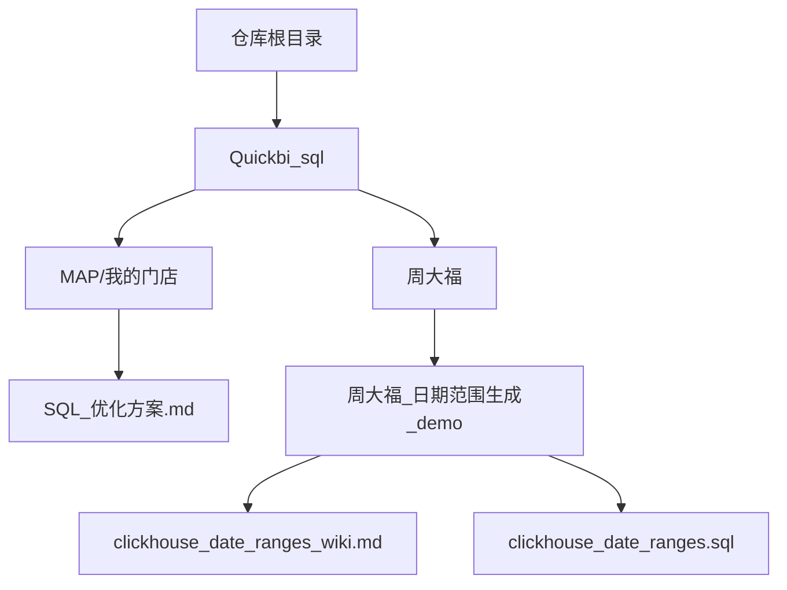
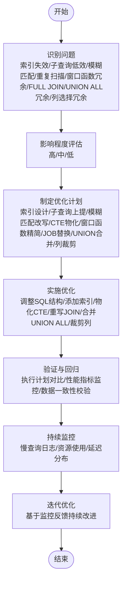
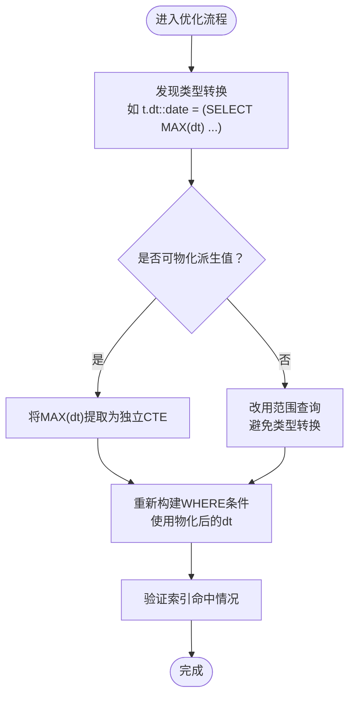
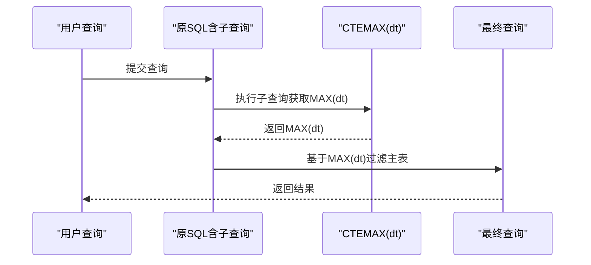
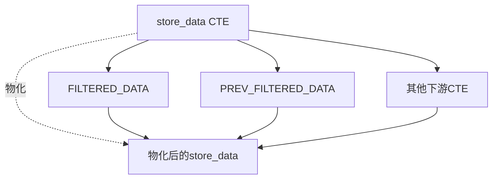
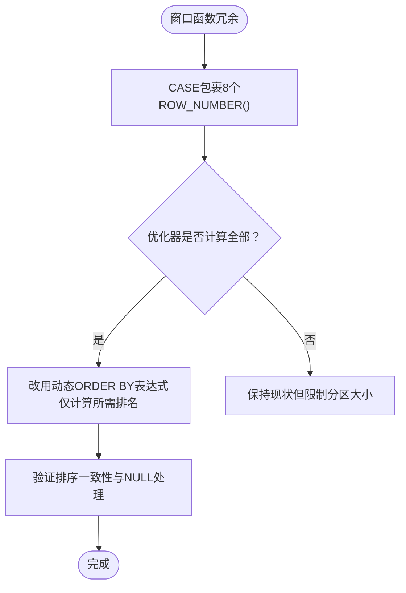
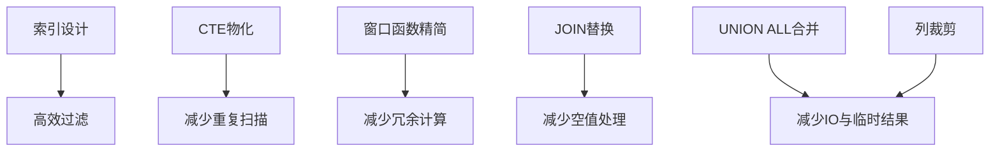

# ClickHouse查询优化

<cite>
**本文档引用的文件**
- [SQL_优化方案.md](file://Quickbi_sql/MAP/我的门店/SQL_优化方案.md)
</cite>

## 目录
1. [简介](#简介)
2. [项目结构](#项目结构)
3. [核心组件](#核心组件)
4. [架构总览](#架构总览)
5. [详细组件分析](#详细组件分析)
6. [依赖分析](#依赖分析)
7. [性能考虑](#性能考虑)
8. [故障排查指南](#故障排查指南)
9. [结论](#结论)
10. [附录](#附录)

## 简介
本文件面向数据库管理员与开发者，系统梳理ClickHouse查询优化的关键技术与实践路径，围绕以下主题展开：索引失效的识别与修复、子查询低效问题的优化、模糊匹配导致的全表扫描处理、类型转换优化（如dt::date转换）、重复扫描问题的解决方案、窗口函数冗余计算的优化方法、CTE物化控制、UNION ALL合并优化、FULL JOIN替换为LEFT JOIN等高级技术。同时提供从问题识别到优化实施的完整流程，并结合仓库中的优化案例进行说明。

## 项目结构
该仓库包含与ClickHouse相关的SQL优化文档与示例，重点聚焦于“门店分析排名”场景的SQL优化方案。优化方案文档系统性地列举了常见问题、影响程度评估、优化建议与实现要点，是本次优化指导的核心来源。

**章节来源**
- [SQL_优化方案.md:1-20](file://Quickbi_sql/MAP/我的门店/SQL_优化方案.md#L1-L20)

## 核心组件
- 索引失效问题：通过消除类型转换（如dt::date）或改用范围查询，使索引可用，降低扫描成本。
- 子查询低效：将MAX(dt)等子查询提升为独立CTE，避免重复扫描与多次计算。
- 模糊匹配：避免前导通配符导致的全表扫描，采用前缀匹配或预处理策略。
- 重复扫描：对多处引用的CTE进行物化（MATERIALIZED），避免重复计算。
- 窗口函数冗余：减少不必要的多窗口函数并行计算，仅计算所需排名。
- JOIN优化：在满足业务需求的前提下，将FULL JOIN替换为LEFT JOIN，减少空值处理成本。
- CTE物化控制：针对不同使用频次的CTE选择NOT MATERIALIZED或MATERIALIZED，平衡内存与计算。
- UNION ALL合并：合并可合并的查询片段，减少重复扫描与临时结果集。
- 列选择优化：仅选择必要的列，减少IO与内存占用。

**章节来源**
- [SQL_优化方案.md:5-16](file://Quickbi_sql/MAP/我的门店/SQL_优化方案.md#L5-L16)
- [SQL_优化方案.md:325-345](file://Quickbi_sql/MAP/我的门店/SQL_优化方案.md#L325-L345)

## 架构总览
下图展示了从问题识别到优化落地的整体流程，涵盖索引、子查询、模糊匹配、重复扫描、窗口函数、JOIN、CTE物化、UNION ALL合并等关键环节。

## 详细组件分析

### 索引失效问题
- 问题表现：WHERE中存在类型转换（如dt::date），导致索引无法使用，引发全表扫描。
- 优化策略：
  - 先物化MAX(dt)等派生值，避免在WHERE中进行类型转换。
  - 若dt为timestamp类型，优先使用范围查询替代类型转换。
- 实施要点：确保筛选列与索引类型一致；在批量查询中尽量使用常量或变量而非函数包装。

**章节来源**
- [SQL_优化方案.md:7](file://Quickbi_sql/MAP/我的门店/SQL_优化方案.md#L7)
- [SQL_优化方案.md:76-95](file://Quickbi_sql/MAP/我的门店/SQL_优化方案.md#L76-L95)

### 子查询低效问题
- 问题表现：WHERE中嵌套SELECT MAX(dt)子查询，每次执行都会重复扫描，造成性能瓶颈。
- 优化策略：将MAX(dt)子查询提升为独立CTE，供多处引用，避免重复扫描。
- 实施要点：确保CTE物化（MATERIALIZED）以避免重复计算；在上游过滤后再传递给下游。

**章节来源**
- [SQL_优化方案.md:8](file://Quickbi_sql/MAP/我的门店/SQL_优化方案.md#L8)
- [SQL_优化方案.md:95-105](file://Quickbi_sql/MAP/我的门店/SQL_优化方案.md#L95-L105)

### 模糊匹配导致的全表扫描
- 问题表现：LIKE '%...%' 前导通配符导致全表扫描，性能劣化。
- 优化策略：改用前缀匹配、建立前缀索引或预处理数据（如建立前缀列）。
- 实施要点：评估业务需求与数据分布，选择合适的匹配策略；对高频前缀建立辅助索引。

**章节来源**
- [SQL_优化方案.md:9](file://Quickbi_sql/MAP/我的门店/SQL_优化方案.md#L9)

### 重复扫描问题
- 问题表现：同一CTE被多个下游CTE分别扫描，导致重复IO与CPU消耗。
- 优化策略：对多处引用的CTE进行物化（MATERIALIZED），避免重复扫描。
- 实施要点：区分“仅一次使用”的CTE（NOT MATERIALIZED）与“多次使用”的CTE（MATERIALIZED）。

**章节来源**
- [SQL_优化方案.md:10](file://Quickbi_sql/MAP/我的门店/SQL_优化方案.md#L10)
- [SQL_优方案.md:325-345](file://Quickbi_sql/MAP/我的门店/SQL_优化方案.md#L325-L345)

### 窗口函数冗余计算
- 问题表现：CASE包裹多个ROW_NUMBER()窗口函数，数据库可能计算全部后再取其一，造成冗余。
- 优化策略：使用动态ORDER BY表达式替代多个窗口函数；仅计算需要的排名。
- 实施要点：通过乘以-1将降序转为升序比较；若优化器不支持，可在应用层动态拼接SQL。

**章节来源**
- [SQL_优化方案.md:11](file://Quickbi_sql/MAP/我的门店/SQL_优化方案.md#L11)
- [SQL_优化方案.md:177-208](file://Quickbi_sql/MAP/我的门店/SQL_优化方案.md#L177-L208)

### FULL JOIN替换为LEFT JOIN
- 问题表现：业务场景中使用FULL JOIN，但大多数情况下LEFT JOIN即可满足需求。
- 优化策略：在确认业务语义后，将FULL JOIN替换为LEFT JOIN，减少空值处理成本。
- 实施要点：严格验证数据一致性与业务规则，确保替换不会引入错误。

**章节来源**
- [SQL_优化方案.md:12](file://Quickbi_sql/MAP/我的门店/SQL_优化方案.md#L12)

### CTE物化控制
- 适用场景：多处引用的CTE应物化（MATERIALIZED）；仅一次使用的CTE可NOT MATERIALIZED以允许内联优化。
- 实施要点：结合查询规模与引用次数选择合适策略；关注内存与计算的权衡。

**章节来源**
- [SQL_优化方案.md:325-345](file://Quickbi_sql/MAP/我的门店/SQL_优化方案.md#L325-L345)

### UNION ALL合并优化
- 问题表现：两段查询可合并为单一查询，但目前拆分为多段，导致重复扫描与额外开销。
- 优化策略：合并可合并的查询片段，减少重复扫描与临时结果集。
- 实施要点：确保合并后的查询仍具备良好的过滤条件与索引利用。

**章节来源**
- [SQL_优化方案.md:14](file://Quickbi_sql/MAP/我的门店/SQL_优化方案.md#L14)

### 列选择冗余
- 问题表现：CTE选取了过多未使用的列，增加IO与内存压力。
- 优化策略：仅选择必要的列，减少数据传输与存储开销。
- 实施要点：在CTE层即进行列裁剪，避免在下游再次过滤。

**章节来源**
- [SQL_优化方案.md:15](file://Quickbi_sql/MAP/我的门店/SQL_优化方案.md#L15)

### 类型转换优化（如dt::date）
- 优化方向：避免在WHERE中进行类型转换；优先使用与索引类型一致的数据形式。
- 实施要点：在ETL阶段统一时间格式；或在查询中使用范围条件替代类型转换。

**章节来源**
- [SQL_优化方案.md:76-95](file://Quickbi_sql/MAP/我的门店/SQL_优化方案.md#L76-L95)

### 聚合重复计算与CASE转换低效
- 聚合重复计算：嵌套聚合SUM(SUM(...))可预先计算，减少重复扫描。
- CASE转换低效：在等值比较中使用CASE转换，可改用预计算列或直接比较数值。
- 实施要点：在CTE层完成预计算；对高频转换建立辅助列。

**章节来源**
- [SQL_优化方案.md:13](file://Quickbi_sql/MAP/我的门店/SQL_优化方案.md#L13)
- [SQL_优化方案.md:14](file://Quickbi_sql/MAP/我的门店/SQL_优化方案.md#L14)

## 依赖分析
- 组件耦合关系：优化后的SQL依赖于合理的索引设计、物化的CTE以及精简的窗口函数；各优化点之间相互补充，共同降低扫描与计算成本。
- 外部依赖：索引与物化策略受ClickHouse版本与配置影响；UNION ALL与JOIN替换需满足业务等价性。

## 性能考虑
- 执行计划分析：通过EXPLAIN/EXPLAIN PLAN观察索引命中、扫描范围与中间结果集大小；重点关注是否发生全表扫描与不必要的排序。
- 性能监控指标：关注查询延迟、扫描行数、读取字节、内存峰值、并发等待时间；对慢查询建立告警与归因机制。
- 优化闭环：以测试环境验证数据正确性与性能收益，再逐步推广至生产；持续监控与迭代优化。

## 故障排查指南
- 索引失效排查：确认WHERE条件中是否存在类型转换或函数包装；检查索引定义与查询谓词是否匹配。
- 子查询重复扫描：检查子查询是否被多次执行；将子查询上提为CTE并物化。
- 模糊匹配问题：避免前导通配符；对高频前缀建立前缀索引或预处理列。
- 窗口函数异常：验证排序一致性与NULL处理逻辑；必要时在应用层动态拼接SQL。
- JOIN替换风险：核对业务语义，确保LEFT JOIN不会遗漏数据；进行充分回归测试。
- CTE物化不当：根据引用次数选择MATERIALIZED或NOT MATERIALIZED；监控内存与计算资源。

**章节来源**
- [SQL_优化方案.md:815-821](file://Quickbi_sql/MAP/我的门店/SQL_优化方案.md#L815-L821)

## 结论
ClickHouse查询优化是一个系统工程，涉及索引设计、SQL结构重写、CTE物化控制、窗口函数精简与JOIN策略等多个维度。通过问题识别—影响评估—优化实施—验证监控—持续迭代的闭环流程，可显著降低扫描与计算成本，提升查询性能与稳定性。建议在测试环境充分验证后，再逐步推广至生产，并建立完善的监控与告警体系。

## 附录
- 优化案例参考：详见“门店分析排名”SQL优化方案文档，涵盖索引失效、子查询低效、模糊匹配、重复扫描、窗口函数冗余、JOIN替换、CTE物化、UNION ALL合并与列裁剪等典型场景的优化思路与实施步骤。

**章节来源**
- [SQL_优化方案.md:1-821](file://Quickbi_sql/MAP/我的门店/SQL_优化方案.md#L1-L821)