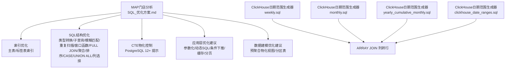
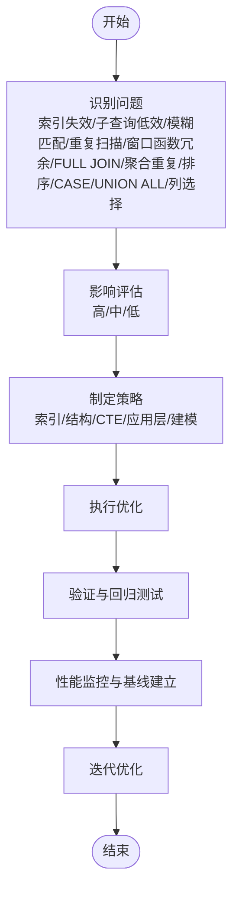
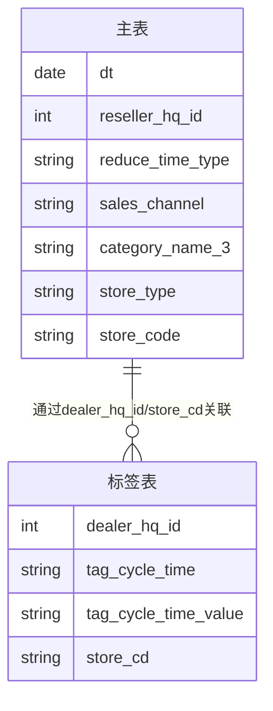
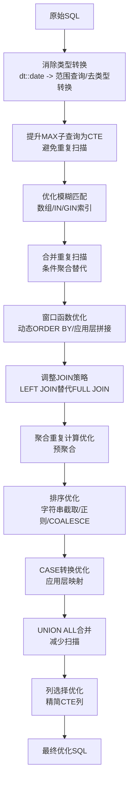
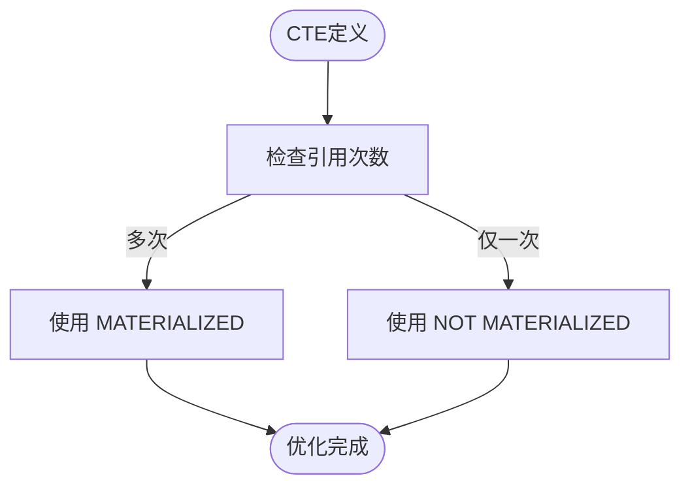
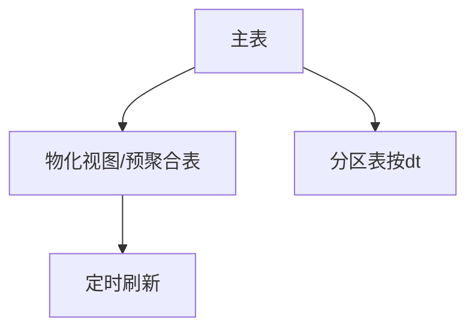
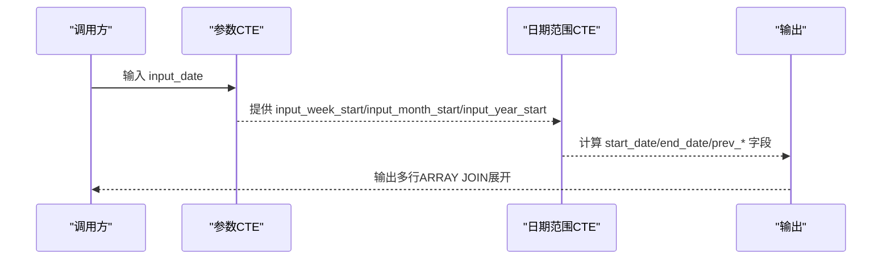
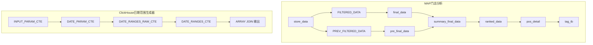

# SQL优化最佳实践

<cite>
**本文档引用的文件**
- [SQL_优化方案.md](file://Quickbi_sql/MAP/我的门店/SQL_优化方案.md)
- [monthly.sql](file://Quickbi_sql/周大福/周大福_日期范围生成_ARRAY JOIN_Clickhou/monthly.sql)
- [weekly.sql](file://Quickbi_sql/周大福/周大福_日期范围生成_ARRAY JOIN_Clickhou/weekly.sql)
- [yearly_cumulative_monthly.sql](file://Quickbi_sql/周大福/周大福_日期范围生成_ARRAY JOIN_Clickhou/yearly_cumulative_monthly.sql)
- [clickhouse_date_ranges.sql](file://Quickbi_sql/周大福/周大福_日期范围生成_demo/clickhouse_date_ranges.sql)
</cite>

## 目录
1. [简介](#简介)
2. [项目结构](#项目结构)
3. [核心组件](#核心组件)
4. [架构总览](#架构总览)
5. [详细组件分析](#详细组件分析)
6. [依赖关系分析](#依赖关系分析)
7. [性能考量](#性能考量)
8. [故障排查指南](#故障排查指南)
9. [结论](#结论)
10. [附录](#附录)

## 简介
本文件面向开发者与数据库管理员，系统性总结SQL查询优化的十大问题类型及其解决方案，并结合仓库中的真实SQL案例，提供从问题识别、影响评估到具体优化策略的完整流程。内容涵盖索引失效、子查询低效、模糊匹配、重复扫描、窗口函数冗余、FULL JOIN不必要、聚合重复计算、CASE转换低效、UNION ALL冗余、列选择冗余等常见问题；同时介绍CTE物化控制、类型转换优化、条件聚合替代、动态SQL拼接等高级技术，以及执行计划分析方法、性能监控指标与应用层优化建议。

## 项目结构
该仓库包含两类典型SQL优化场景：
- PostgreSQL/ClickHouse通用的复杂报表SQL优化案例（MAP门店分析）
- ClickHouse日期范围生成器（周大福运营周报/月报/年累计）

图表来源
- [SQL_优化方案.md:1-822](file://Quickbi_sql/MAP/我的门店/SQL_优化方案.md#L1-L822)
- [weekly.sql:1-117](file://Quickbi_sql/周大福/周大福_日期范围生成_ARRAY JOIN_Clickhou/weekly.sql#L1-L117)
- [monthly.sql:1-109](file://Quickbi_sql/周大福/周大福_日期范围生成_ARRAY JOIN_Clickhou/monthly.sql#L1-L109)
- [yearly_cumulative_monthly.sql:1-109](file://Quickbi_sql/周大福/周大福_日期范围生成_ARRAY JOIN_Clickhou/yearly_cumulative_monthly.sql#L1-L109)
- [clickhouse_date_ranges.sql:1-214](file://Quickbi_sql/周大福/周大福_日期范围生成_demo/clickhouse_date_ranges.sql#L1-L214)

章节来源
- [SQL_优化方案.md:1-822](file://Quickbi_sql/MAP/我的门店/SQL_优化方案.md#L1-L822)
- [weekly.sql:1-117](file://Quickbi_sql/周大福/周大福_日期范围生成_ARRAY JOIN_Clickhou/weekly.sql#L1-L117)
- [monthly.sql:1-109](file://Quickbi_sql/周大福/周大福_日期范围生成_ARRAY JOIN_Clickhou/monthly.sql#L1-L109)
- [yearly_cumulative_monthly.sql:1-109](file://Quickbi_sql/周大福/周大福_日期范围生成_ARRAY JOIN_Clickhou/yearly_cumulative_monthly.sql#L1-L109)
- [clickhouse_date_ranges.sql:1-214](file://Quickbi_sql/周大福/周大福_日期范围生成_demo/clickhouse_date_ranges.sql#L1-L214)

## 核心组件
- 索引优化：为主表与标签表设计复合索引，覆盖主要筛选条件与时间字段，提升过滤效率。
- SQL结构优化：消除类型转换、提升MAX(dt)子查询为CTE、优化模糊匹配、合并重复扫描、简化窗口函数、调整JOIN策略、条件聚合替代、排序优化、CASE转换、UNION ALL合并、列选择优化。
- CTE物化控制：利用PostgreSQL 12+的CTE物化提示，控制重复计算与内联优化。
- 应用层优化：参数化查询、动态SQL拼接、条件下推、结果缓存、分页。
- 数据建模优化：预聚合物化视图、分区表。

章节来源
- [SQL_优化方案.md:20-822](file://Quickbi_sql/MAP/我的门店/SQL_优化方案.md#L20-L822)

## 架构总览
整体优化路径由“问题识别—影响评估—策略制定—执行验证—持续监控”构成，贯穿数据库层与应用层。

## 详细组件分析

### 组件A：索引优化（主表与标签表）
- 问题：类型转换导致索引失效，降低过滤效率。
- 解决：为dt、筛选字段建立复合索引；为标签表建立覆盖索引。
- 影响：显著降低扫描成本，缩短查询响应时间。

图表来源
- [SQL_优化方案.md:24-71](file://Quickbi_sql/MAP/我的门店/SQL_优化方案.md#L24-L71)

章节来源
- [SQL_优化方案.md:20-71](file://Quickbi_sql/MAP/我的门店/SQL_优化方案.md#L20-L71)

### 组件B：SQL结构优化（类型转换、子查询、模糊匹配、重复扫描、窗口函数、JOIN、聚合、排序、CASE、UNION ALL、列选择）
- 类型转换与子查询：消除dt::date转换，将MAX(dt)提升为CTE，避免重复扫描。
- 模糊匹配：将LIKE '%...%'替换为数组/IN或使用GIN索引+pg_trgm扩展。
- 重复扫描：合并FILTERED_DATA与PREV_FILTERED_DATA，使用条件聚合分离当前/上期。
- 窗口函数：使用动态ORDER BY替代多个ROW_NUMBER()，或在应用层动态拼接SQL。
- JOIN策略：在业务允许时将FULL JOIN改为LEFT JOIN。
- 聚合重复：将SUM(SUM(...))拆分为预聚合，减少重复计算。
- 排序优化：使用字符串截取/正则/COALESCE处理store_tier排序。
- CASE转换：将CASE转换映射移至应用层，减少数据库端转换。
- UNION ALL：合并相似查询，减少扫描次数。
- 列选择：精简CTE列，避免无关列参与计算。

图表来源
- [SQL_优化方案.md:77-321](file://Quickbi_sql/MAP/我的门店/SQL_优化方案.md#L77-L321)

章节来源
- [SQL_优化方案.md:75-321](file://Quickbi_sql/MAP/我的门店/SQL_优化方案.md#L75-L321)

### 组件C：CTE物化控制（PostgreSQL 12+）
- 问题：多处CTE被多次引用，导致重复计算。
- 解决：对多次使用的CTE使用MATERIALIZED，对仅使用一次的CTE使用NOT MATERIALIZED。
- 建议：store_data、FILTERED_DATA等大结果集使用MATERIALIZED；小结果集保持默认。

图表来源
- [SQL_优化方案.md:325-345](file://Quickbi_sql/MAP/我的门店/SQL_优化方案.md#L325-L345)

章节来源
- [SQL_优化方案.md:325-345](file://Quickbi_sql/MAP/我的门店/SQL_优化方案.md#L325-L345)

### 组件D：应用层优化建议
- 参数化查询：避免SQL注入并利用执行计划缓存。
- 动态SQL拼接：对rank_type、rank_type_asc_desc、top_rank_type等在应用层构建。
- 条件下推：将category_name_4的可选筛选移至应用层，减少数据库内CASE。
- 结果缓存：对max_dt等每日变化一次的结果在应用层缓存。
- 分页优化：在pos_detail层加入LIMIT/OFFSET减少返回数据量。

章节来源
- [SQL_优化方案.md:721-730](file://Quickbi_sql/MAP/我的门店/SQL_优化方案.md#L721-L730)

### 组件E：数据建模优化建议
- 预聚合物化视图：为高频访问场景创建物化视图，定时刷新。
- 分区表：按dt进行分区，减少扫描范围。

图表来源
- [SQL_优化方案.md:733-790](file://Quickbi_sql/MAP/我的门店/SQL_优化方案.md#L733-L790)

章节来源
- [SQL_优化方案.md:733-790](file://Quickbi_sql/MAP/我的门店/SQL_优化方案.md#L733-L790)

### 组件F：ClickHouse日期范围生成器（ARRAY JOIN）
- 目标：根据输入日期生成周报/月报/年累计等四种报表的日期范围，并输出成行。
- 技术点：使用CTE生成基础参数，计算本期/上期起止日期，格式化输出；通过ARRAY JOIN将多组字段并行展开为行。

图表来源
- [weekly.sql:1-117](file://Quickbi_sql/周大福/周大福_日期范围生成_ARRAY JOIN_Clickhou/weekly.sql#L1-L117)
- [monthly.sql:1-109](file://Quickbi_sql/周大福/周大福_日期范围生成_ARRAY JOIN_Clickhou/monthly.sql#L1-L109)
- [yearly_cumulative_monthly.sql:1-109](file://Quickbi_sql/周大福/周大福_日期范围生成_ARRAY JOIN_Clickhou/yearly_cumulative_monthly.sql#L1-L109)
- [clickhouse_date_ranges.sql:1-214](file://Quickbi_sql/周大福/周大福_日期范围生成_demo/clickhouse_date_ranges.sql#L1-L214)

章节来源
- [weekly.sql:1-117](file://Quickbi_sql/周大福/周大福_日期范围生成_ARRAY JOIN_Clickhou/weekly.sql#L1-L117)
- [monthly.sql:1-109](file://Quickbi_sql/周大福/周大福_日期范围生成_ARRAY JOIN_Clickhou/monthly.sql#L1-L109)
- [yearly_cumulative_monthly.sql:1-109](file://Quickbi_sql/周大福/周大福_日期范围生成_ARRAY JOIN_Clickhou/yearly_cumulative_monthly.sql#L1-L109)
- [clickhouse_date_ranges.sql:1-214](file://Quickbi_sql/周大福/周大福_日期范围生成_demo/clickhouse_date_ranges.sql#L1-L214)

## 依赖关系分析
- MAP门店分析SQL依赖主表与标签表，关键路径为store_data → FILTERED_DATA/ PREV_FILTERED_DATA → final_data/pre_final_data → summary_final_data → ranked_data → pos_detail → tag_tb。
- ClickHouse日期范围生成器依赖输入日期，通过CTE链路计算多种报表类型的日期范围，并通过ARRAY JOIN输出。

图表来源
- [SQL_优化方案.md:348-697](file://Quickbi_sql/MAP/我的门店/SQL_优化方案.md#L348-L697)
- [weekly.sql:1-117](file://Quickbi_sql/周大福/周大福_日期范围生成_ARRAY JOIN_Clickhou/weekly.sql#L1-L117)
- [monthly.sql:1-109](file://Quickbi_sql/周大福/周大福_日期范围生成_ARRAY JOIN_Clickhou/monthly.sql#L1-L109)
- [yearly_cumulative_monthly.sql:1-109](file://Quickbi_sql/周大福/周大福_日期范围生成_ARRAY JOIN_Clickhou/yearly_cumulative_monthly.sql#L1-L109)
- [clickhouse_date_ranges.sql:1-214](file://Quickbi_sql/周大福/周大福_日期范围生成_demo/clickhouse_date_ranges.sql#L1-L214)

章节来源
- [SQL_优化方案.md:348-697](file://Quickbi_sql/MAP/我的门店/SQL_优化方案.md#L348-L697)
- [weekly.sql:1-117](file://Quickbi_sql/周大福/周大福_日期范围生成_ARRAY JOIN_Clickhou/weekly.sql#L1-L117)
- [monthly.sql:1-109](file://Quickbi_sql/周大福/周大福_日期范围生成_ARRAY JOIN_Clickhou/monthly.sql#L1-L109)
- [yearly_cumulative_monthly.sql:1-109](file://Quickbi_sql/周大福/周大福_日期范围生成_ARRAY JOIN_Clickhou/yearly_cumulative_monthly.sql#L1-L109)
- [clickhouse_date_ranges.sql:1-214](file://Quickbi_sql/周大福/周大福_日期范围生成_demo/clickhouse_date_ranges.sql#L1-L214)

## 性能考量
- 执行计划分析：使用EXPLAIN (ANALYZE, BUFFERS, FORMAT TEXT)查看扫描方式、排序策略、JOIN策略、CTE物化情况与过滤移除行数。
- 监控指标：关注Seq Scan、Sort、Hash Join vs Nested Loop、CTE Scan、Rows Removed by Filter等。
- 实施优先级：P0（立即）→ P1（短期）→ P2（中期）→ P3（长期）。

章节来源
- [SQL_优化方案.md:701-822](file://Quickbi_sql/MAP/我的门店/SQL_优化方案.md#L701-L822)

## 故障排查指南
- 数据正确性验证：所有优化必须在测试环境验证，特别是排名结果一致性。
- 索引维护：新增索引会增加写入开销，需监控INSERT/UPDATE性能。
- JOIN语义确认：将FULL JOIN改为LEFT JOIN前需确认业务需求。
- 排序技巧验证：乘-1技巧需验证NULL值处理逻辑与原始CASE分支一致。
- 物化视图刷新：需与ETL流程协调，确保数据时效性。

章节来源
- [SQL_优化方案.md:815-822](file://Quickbi_sql/MAP/我的门店/SQL_优化方案.md#L815-L822)

## 结论
通过索引优化、SQL结构优化、CTE物化控制、应用层优化与数据建模优化，可系统性降低查询成本、提升稳定性与可维护性。建议按照P0-P3优先级逐步落地，并建立执行计划分析与性能监控基线，持续迭代优化。

## 附录
- 优化效果预估（来自仓库文档）：
  - 索引优化：查询响应时间减少60-80%
  - 消除dt类型转换：主表扫描时间减少50%+
  - 合并重复扫描：CTE执行时间减少40%
  - 窗口函数优化：排名计算减少75%开销
  - tag_tb合并：标签查询减少一次全表扫描
  - 预聚合物化视图：整体查询从秒级降到毫秒级

章节来源
- [SQL_优化方案.md:793-803](file://Quickbi_sql/MAP/我的门店/SQL_优化方案.md#L793-L803)