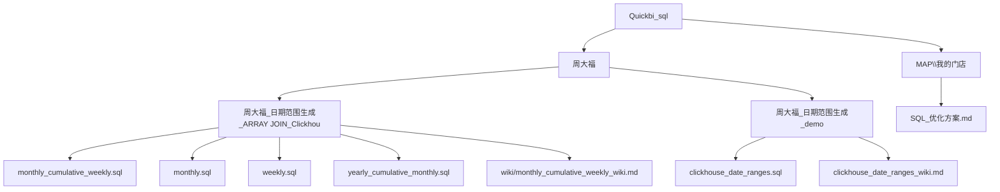
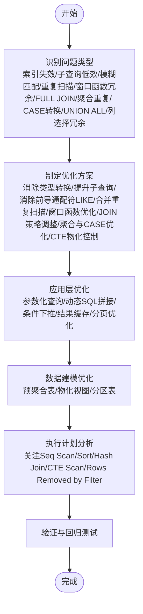
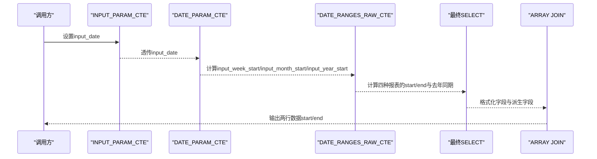
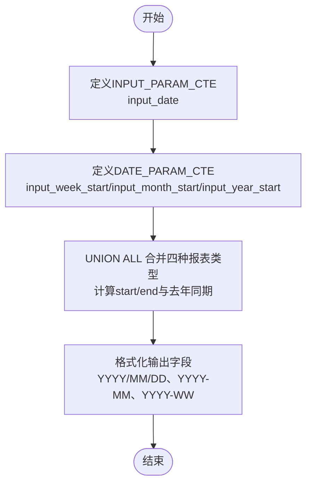
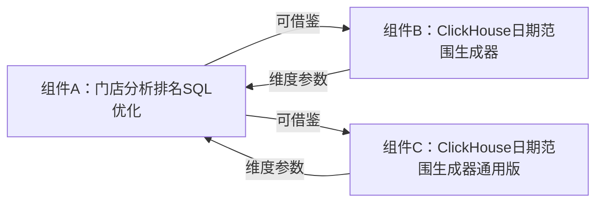

# SQL性能优化模块

<cite>
**本文引用的文件**
- [SQL_优化方案.md](file://Quickbi_sql/MAP/我的门店/SQL_优化方案.md)
- [monthly_cumulative_weekly.sql](file://Quickbi_sql/周大福/周大福_日期范围生成_ARRAY JOIN_Clickhou/monthly_cumulative_weekly.sql)
- [monthly.sql](file://Quickbi_sql/周大福/周大福_日期范围生成_ARRAY JOIN_Clickhou/monthly.sql)
- [weekly.sql](file://Quickbi_sql/周大福/周大福_日期范围生成_ARRAY JOIN_Clickhou/weekly.sql)
- [yearly_cumulative_monthly.sql](file://Quickbi_sql/周大福/周大福_日期范围生成_ARRAY JOIN_Clickhou/yearly_cumulative_monthly.sql)
- [clickhouse_date_ranges.sql](file://Quickbi_sql/周大福/周大福_日期范围生成_demo/clickhouse_date_ranges.sql)
- [monthly_cumulative_weekly_wiki.md](file://Quickbi_sql/周大福/周大福_日期范围生成_ARRAY JOIN_Clickhou/wiki/monthly_cumulative_weekly_wiki.md)
- [clickhouse_date_ranges_wiki.md](file://Quickbi_sql/周大福/周大福_日期范围生成_demo/clickhouse_date_ranges_wiki.md)
</cite>

## 目录
1. [简介](#简介)
2. [项目结构](#项目结构)
3. [核心组件](#核心组件)
4. [架构总览](#架构总览)
5. [详细组件分析](#详细组件分析)
6. [依赖关系分析](#依赖关系分析)
7. [性能考量](#性能考量)
8. [故障排查指南](#故障排查指南)
9. [结论](#结论)
10. [附录](#附录)

## 简介
本模块聚焦于ClickHouse数据库的SQL性能优化，围绕查询优化、索引策略设计、查询重写技术与性能调优方法展开。文档总结了SQL优化的十大问题类型（索引失效、子查询低效、模糊匹配、重复扫描等）及其解决方案，并结合具体案例展示从问题识别到优化实施的完整流程。同时，涵盖CTE物化控制、类型转换优化、窗口函数优化等高级技术，提供执行计划分析方法与性能监控指标，帮助数据库管理员与开发者建立系统化的优化实践。

## 项目结构
仓库中与SQL性能优化直接相关的文件主要集中在Quickbi_sql目录下的“MAP我的门店”和“周大福”两个主题域：
- “MAP我的门店”提供完整的门店分析排名SQL优化方案，包含索引建议、SQL结构优化、CTE物化控制、窗口函数优化、执行计划分析建议与应用层优化建议。
- “周大福”提供ClickHouse日期范围生成器系列SQL，覆盖周报、月报、月累计周报、年累计月报四种报表类型，重点体现CTE链式结构、ARRAY JOIN列转行、类型安全与日期函数的最佳实践。

图表来源
- [SQL_优化方案.md:1-822](file://Quickbi_sql/MAP/我的门店/SQL_优化方案.md#L1-L822)
- [monthly_cumulative_weekly.sql:1-159](file://Quickbi_sql/周大福/周大福_日期范围生成_ARRAY JOIN_Clickhou/monthly_cumulative_weekly.sql#L1-L159)
- [monthly.sql:1-109](file://Quickbi_sql/周大福/周大福_日期范围生成_ARRAY JOIN_Clickhou/monthly.sql#L1-L109)
- [weekly.sql:1-117](file://Quickbi_sql/周大福/周大福_日期范围生成_ARRAY JOIN_Clickhou/weekly.sql#L1-L117)
- [yearly_cumulative_monthly.sql:1-109](file://Quickbi_sql/周大福/周大福_日期范围生成_ARRAY JOIN_Clickhou/yearly_cumulative_monthly.sql#L1-L109)
- [clickhouse_date_ranges.sql:1-214](file://Quickbi_sql/周大福/周大福_日期范围生成_demo/clickhouse_date_ranges.sql#L1-L214)

章节来源
- [SQL_优化方案.md:1-822](file://Quickbi_sql/MAP/我的门店/SQL_优化方案.md#L1-L822)
- [monthly_cumulative_weekly.sql:1-159](file://Quickbi_sql/周大福/周大福_日期范围生成_ARRAY JOIN_Clickhou/monthly_cumulative_weekly.sql#L1-L159)
- [monthly.sql:1-109](file://Quickbi_sql/周大福/周大福_日期范围生成_ARRAY JOIN_Clickhou/monthly.sql#L1-L109)
- [weekly.sql:1-117](file://Quickbi_sql/周大福/周大福_日期范围生成_ARRAY JOIN_Clickhou/weekly.sql#L1-L117)
- [yearly_cumulative_monthly.sql:1-109](file://Quickbi_sql/周大福/周大福_日期范围生成_ARRAY JOIN_Clickhou/yearly_cumulative_monthly.sql#L1-L109)
- [clickhouse_date_ranges.sql:1-214](file://Quickbi_sql/周大福/周大福_日期范围生成_demo/clickhouse_date_ranges.sql#L1-L214)

## 核心组件
- 索引优化建议：为主表与标签表设计复合索引，覆盖主要筛选条件；为MAX(dt)快速定位建立独立索引。
- SQL结构优化：消除类型转换、提升MAX(dt)子查询为CTE、消除前导通配符LIKE、合并重复扫描CTE、优化窗口函数、调整JOIN策略、合并UNION ALL、精简列选择。
- CTE物化控制：在PostgreSQL 12+中使用NOT MATERIALIZED与MATERIALIZED提示，控制CTE内联与物化，避免重复计算。
- 执行计划分析：通过EXPLAIN(ANALYZE, BUFFERS, FORMAT TEXT)关注全表扫描、排序策略、JOIN策略、CTE扫描与过滤移除行数等指标。
- 应用层优化：参数化查询、动态SQL拼接、条件下推、结果缓存、分页优化。
- 数据建模优化：预聚合表与物化视图、分区表策略。

章节来源
- [SQL_优化方案.md:20-800](file://Quickbi_sql/MAP/我的门店/SQL_优化方案.md#L20-L800)

## 架构总览
ClickHouse日期范围生成器采用“输入参数→日期锚点→原始日期范围→格式化字段→ARRAY JOIN列转行”的四层CTE链式结构，最终输出两行数据（start/end），并提供多种维度字段（日期、周、月、去年同期）。

图表来源
- [monthly_cumulative_weekly.sql:1-159](file://Quickbi_sql/周大福/周大福_日期范围生成_ARRAY JOIN_Clickhou/monthly_cumulative_weekly.sql#L1-L159)
- [monthly.sql:1-109](file://Quickbi_sql/周大福/周大福_日期范围生成_ARRAY JOIN_Clickhou/monthly.sql#L1-L109)
- [weekly.sql:1-117](file://Quickbi_sql/周大福/周大福_日期范围生成_ARRAY JOIN_Clickhou/weekly.sql#L1-L117)
- [yearly_cumulative_monthly.sql:1-109](file://Quickbi_sql/周大福/周大福_日期范围生成_ARRAY JOIN_Clickhou/yearly_cumulative_monthly.sql#L1-L109)

章节来源
- [monthly_cumulative_weekly_wiki.md:9-16](file://Quickbi_sql/周大福/周大福_日期范围生成_ARRAY JOIN_Clickhou/wiki/monthly_cumulative_weekly_wiki.md#L9-L16)
- [clickhouse_date_ranges_wiki.md:179-201](file://Quickbi_sql/周大福/周大福_日期范围生成_demo/clickhouse_date_ranges_wiki.md#L179-L201)

## 详细组件分析

### 组件A：门店分析排名SQL优化（PostgreSQL）
- 问题识别与分类：索引失效、子查询低效、模糊匹配、重复扫描、窗口函数冗余、FULL JOIN不必要、聚合重复计算、CASE转换低效、UNION ALL冗余、列选择冗余。
- 解决方案要点：
  - 消除类型转换：避免t.dt::date导致索引失效，优先使用范围查询或直接匹配。
  - 提升子查询：将MAX(dt)子查询物化为独立CTE，缩小过滤范围。
  - 消除前导通配符LIKE：改用数组或IN列表，或使用GIN索引+pg_trgm扩展加速。
  - 合并重复扫描：将FILTERED_DATA与PREV_FILTERED_DATA合并为一次聚合，使用条件聚合分离当前/上期。
  - 窗口函数优化：使用动态ORDER BY表达式替代多个ROW_NUMBER()，或在应用层动态拼接SQL。
  - JOIN策略：在业务允许的情况下将FULL JOIN改为LEFT JOIN。
  - 聚合与CASE优化：合并重复计算，简化CASE转换，合并UNION ALL，精简列选择。
- CTE物化控制：对多次引用的CTE使用MATERIALIZED，对一次性使用的CTE使用NOT MATERIALIZED。
- 执行计划分析：关注Seq Scan、Sort、Hash Join vs Nested Loop、CTE Scan、Rows Removed by Filter等指标。
- 应用层优化：参数化查询、动态SQL拼接、条件下推、结果缓存、分页优化。
- 数据建模优化：预聚合表与物化视图、分区表策略。

图表来源
- [SQL_优化方案.md:3-800](file://Quickbi_sql/MAP/我的门店/SQL_优化方案.md#L3-L800)

章节来源
- [SQL_优化方案.md:3-800](file://Quickbi_sql/MAP/我的门店/SQL_优化方案.md#L3-L800)

### 组件B：ClickHouse日期范围生成器（ARRAY JOIN列转行）
- 设计模式：四层CTE链式结构 + ARRAY JOIN列转行，输出两行数据（start/end）。
- 关键技术点：
  - 日期锚点：toMonday、toStartOfMonth、toStartOfYear。
  - 日期边界：使用INTERVAL语法确保类型安全，避免裸整数减法在UNION ALL中失效。
  - 10号分界逻辑：月初不足10天时取当天，否则取上周日。
  - ISO周与月份：toISOWeek、toMonth、formatDateTime、leftPad。
  - ARRAY JOIN：并行展开多组start/end数组，实现列转行。
- 性能建议：
  - 使用INTERVAL语法进行日期加减，避免类型提升导致的逻辑错误。
  - 在UNION ALL中统一日期类型，减少隐式转换成本。
  - 通过CTE链式结构降低重复计算，配合ARRAY JOIN高效输出。

图表来源
- [monthly_cumulative_weekly.sql:1-159](file://Quickbi_sql/周大福/周大福_日期范围生成_ARRAY JOIN_Clickhou/monthly_cumulative_weekly.sql#L1-L159)
- [weekly.sql:1-117](file://Quickbi_sql/周大福/周大福_日期范围生成_ARRAY JOIN_Clickhou/weekly.sql#L1-L117)
- [monthly.sql:1-109](file://Quickbi_sql/周大福/周大福_日期范围生成_ARRAY JOIN_Clickhou/monthly.sql#L1-L109)
- [yearly_cumulative_monthly.sql:1-109](file://Quickbi_sql/周大福/周大福_日期范围生成_ARRAY JOIN_Clickhou/yearly_cumulative_monthly.sql#L1-L109)

章节来源
- [monthly_cumulative_weekly_wiki.md:9-16](file://Quickbi_sql/周大福/周大福_日期范围生成_ARRAY JOIN_Clickhou/wiki/monthly_cumulative_weekly_wiki.md#L9-L16)
- [clickhouse_date_ranges_wiki.md:204-241](file://Quickbi_sql/周大福/周大福_日期范围生成_demo/clickhouse_date_ranges_wiki.md#L204-L241)

### 组件C：ClickHouse日期范围生成器（通用版本）
- 采用UNION ALL合并四种报表类型，统一日期类型与INTERVAL语法，确保类型安全。
- 输出字段包括report_type、description、本期/上期日期范围、ISO周、月份等。
- 适用于生产环境集成，支持today()作为输入日期。

图表来源
- [clickhouse_date_ranges.sql:1-214](file://Quickbi_sql/周大福/周大福_日期范围生成_demo/clickhouse_date_ranges.sql#L1-L214)

章节来源
- [clickhouse_date_ranges_wiki.md:1-282](file://Quickbi_sql/周大福/周大福_日期范围生成_demo/clickhouse_date_ranges_wiki.md#L1-L282)

## 依赖关系分析
- 组件A（门店分析排名SQL优化）与组件B/C（ClickHouse日期范围生成器）在数据口径与维度上互补：前者关注业务指标与性能优化，后者提供标准化的日期范围参数。
- 组件B/C中的ARRAY JOIN与CTE链式结构可借鉴到组件A的复杂查询中，以降低重复扫描与提高可读性。
- 组件A的索引策略与物化控制建议可推广至ClickHouse的分区表与物化视图设计思路。

图表来源
- [SQL_优化方案.md:3-800](file://Quickbi_sql/MAP/我的门店/SQL_优化方案.md#L3-L800)
- [monthly_cumulative_weekly.sql:1-159](file://Quickbi_sql/周大福/周大福_日期范围生成_ARRAY JOIN_Clickhou/monthly_cumulative_weekly.sql#L1-L159)
- [clickhouse_date_ranges.sql:1-214](file://Quickbi_sql/周大福/周大福_日期范围生成_demo/clickhouse_date_ranges.sql#L1-L214)

章节来源
- [SQL_优化方案.md:3-800](file://Quickbi_sql/MAP/我的门店/SQL_优化方案.md#L3-L800)
- [monthly_cumulative_weekly_wiki.md:9-16](file://Quickbi_sql/周大福/周大福_日期范围生成_ARRAY JOIN_Clickhou/wiki/monthly_cumulative_weekly_wiki.md#L9-L16)
- [clickhouse_date_ranges_wiki.md:179-201](file://Quickbi_sql/周大福/周大福_日期范围生成_demo/clickhouse_date_ranges_wiki.md#L179-L201)

## 性能考量
- 索引策略：为主表与标签表设计复合索引，覆盖主要筛选条件；为MAX(dt)快速定位建立独立索引。
- 类型转换优化：避免t.dt::date导致索引失效，优先使用范围查询或直接匹配。
- CTE物化控制：对多次引用的CTE使用MATERIALIZED，对一次性使用的CTE使用NOT MATERIALIZED。
- 窗口函数优化：使用动态ORDER BY表达式替代多个ROW_NUMBER()，或在应用层动态拼接SQL。
- JOIN策略：在业务允许的情况下将FULL JOIN改为LEFT JOIN。
- 执行计划分析：关注Seq Scan、Sort、Hash Join vs Nested Loop、CTE Scan、Rows Removed by Filter等指标。
- 应用层优化：参数化查询、动态SQL拼接、条件下推、结果缓存、分页优化。
- 数据建模优化：预聚合表与物化视图、分区表策略。

章节来源
- [SQL_优化方案.md:20-800](file://Quickbi_sql/MAP/我的门店/SQL_优化方案.md#L20-L800)

## 故障排查指南
- ClickHouse类型陷阱：在UNION ALL中，Date与Date32混合后，裸整数减法“- 1”可能不被正确解释为“减一天”。建议统一使用INTERVAL语法进行日期加减。
- 年累计月报上期公式错误：prev_end_date_raw使用addMonths(input_month_start, -1)仅往前推一个月，应使用addYears(...) - INTERVAL 1 DAY。
- 10号分界逻辑：月初不足10天时取当天，否则取上周日，需确保业务规则与日期计算一致。
- 执行计划异常：关注Seq Scan频繁出现、Sort未使用索引、Hash Join代价过高、CTE未物化等问题，结合优化建议逐项排查。

章节来源
- [clickhouse_date_ranges_wiki.md:204-241](file://Quickbi_sql/周大福/周大福_日期范围生成_demo/clickhouse_date_ranges_wiki.md#L204-L241)
- [monthly_cumulative_weekly_wiki.md:72-105](file://Quickbi_sql/周大福/周大福_日期范围生成_ARRAY JOIN_Clickhou/wiki/monthly_cumulative_weekly_wiki.md#L72-L105)

## 结论
本模块通过“问题识别—方案制定—实施验证—持续优化”的闭环，系统化地覆盖了ClickHouse与PostgreSQL场景下的SQL性能优化路径。组件A强调业务指标与性能优化的协同，组件B/C展示了ClickHouse在日期范围生成上的最佳实践。建议在实际落地中结合执行计划分析与性能监控指标，持续迭代索引策略、查询重写与数据建模，以获得稳定且可扩展的查询性能。

## 附录
- 术语表
  - CTE：公用表表达式（Common Table Expression）
  - ARRAY JOIN：ClickHouse特有的列转行语法
  - INTERSECT/UNION ALL：集合操作，需注意类型一致性
  - 物化视图：预聚合结果的存储与刷新机制
  - 分区表：按时间或其他维度拆分的大表结构
- 参考函数（ClickHouse）
  - toMonday、toStartOfMonth、toStartOfYear、toISOWeek、toMonth、formatDateTime、leftPad、addMonths、addYears、subtractDays、subtractYears、INTERVAL等

章节来源
- [monthly_cumulative_weekly_wiki.md:263-595](file://Quickbi_sql/周大福/周大福_日期范围生成_ARRAY JOIN_Clickhou/wiki/monthly_cumulative_weekly_wiki.md#L263-L595)
- [clickhouse_date_ranges_wiki.md:269-282](file://Quickbi_sql/周大福/周大福_日期范围生成_demo/clickhouse_date_ranges_wiki.md#L269-L282)