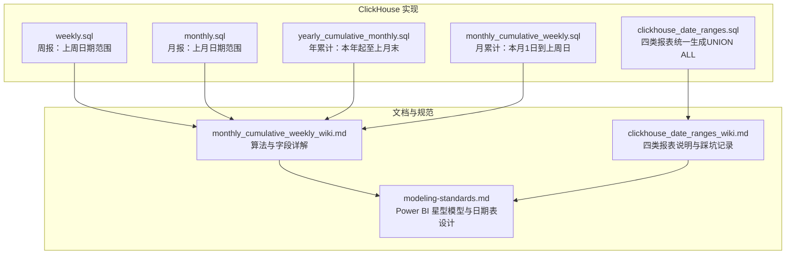
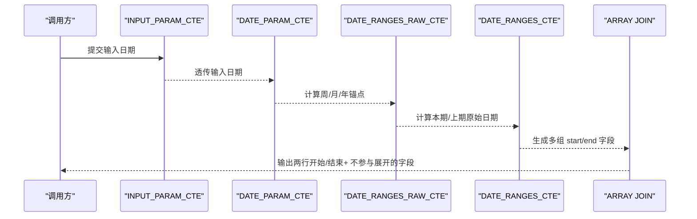
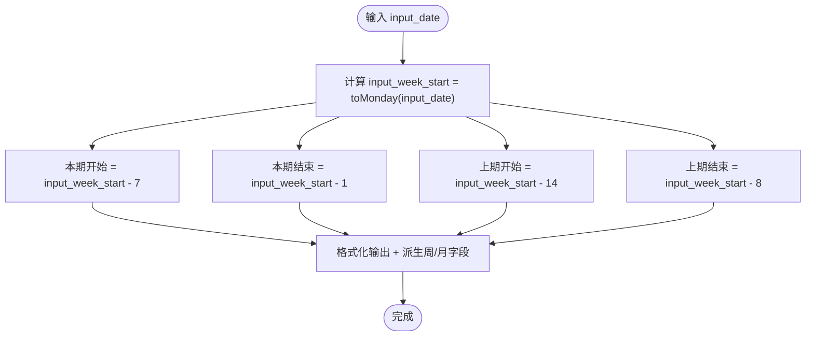
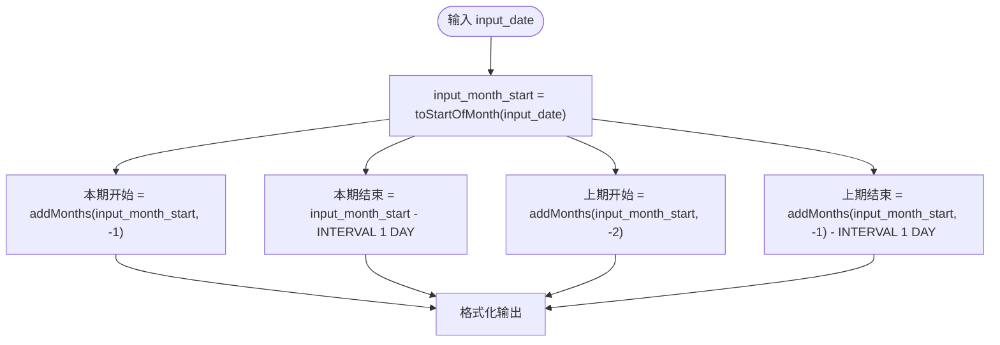
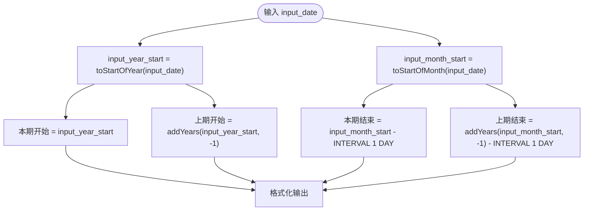
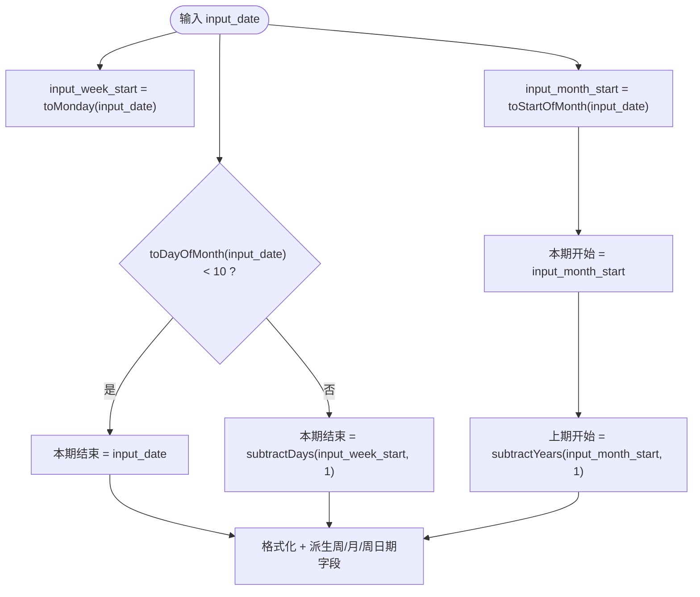
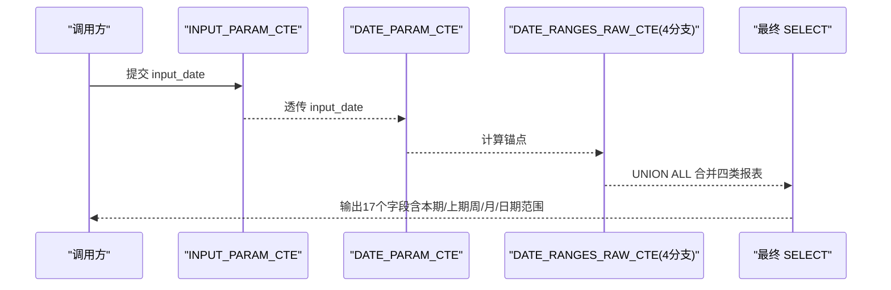
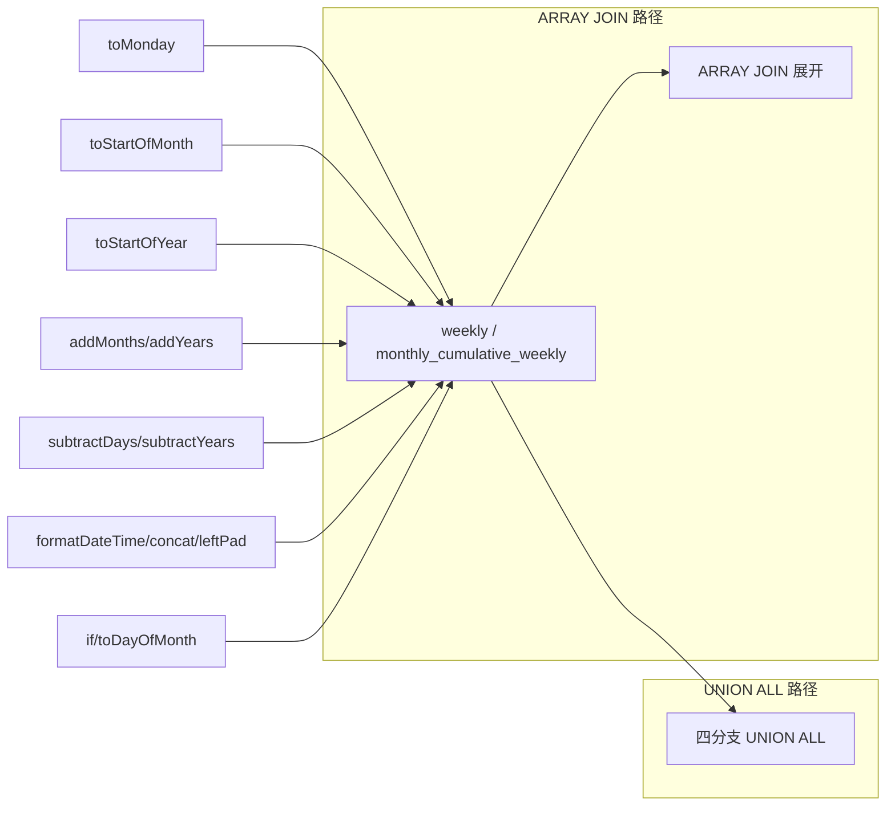

# 日期范围生成与处理

<cite>
**本文引用的文件**
- [monthly.sql](file://Quickbi_sql/周大福/周大福_日期范围生成_ARRAY JOIN_Clickhou/monthly.sql)
- [weekly.sql](file://Quickbi_sql/周大福/周大福_日期范围生成_ARRAY JOIN_Clickhou/weekly.sql)
- [yearly_cumulative_monthly.sql](file://Quickbi_sql/周大福/周大福_日期范围生成_ARRAY JOIN_Clickhou/yearly_cumulative_monthly.sql)
- [monthly_cumulative_weekly.sql](file://Quickbi_sql/周大福/周大福_日期范围生成_ARRAY JOIN_Clickhou/monthly_cumulative_weekly.sql)
- [monthly_cumulative_weekly_wiki.md](file://Quickbi_sql/周大福/周大福_日期范围生成_ARRAY JOIN_Clickhou/wiki/monthly_cumulative_weekly_wiki.md)
- [clickhouse_date_ranges.sql](file://Quickbi_sql/周大福/周大福_日期范围生成_demo/clickhouse_date_ranges.sql)
- [clickhouse_date_ranges_wiki.md](file://Quickbi_sql/周大福/周大福_日期范围生成_demo/clickhouse_date_ranges_wiki.md)
- [modeling-standards.md](file://powerbi_code_copilot/rules/modeling-standards.md)
</cite>

## 目录
1. [简介](#简介)
2. [项目结构](#项目结构)
3. [核心组件](#核心组件)
4. [架构总览](#架构总览)
5. [详细组件分析](#详细组件分析)
6. [依赖分析](#依赖分析)
7. [性能考量](#性能考量)
8. [故障排查指南](#故障排查指南)
9. [结论](#结论)
10. [附录](#附录)

## 简介
本文件面向数据工程师与分析师，系统化梳理 ClickHouse 中“日期范围生成与处理”的实现方法与最佳实践。内容覆盖：
- 月度、周度、年度及累计类报表的日期范围生成策略
- ARRAY JOIN 的列转行技巧与性能优势
- 日期累积计算的优化路径与边界处理
- 传统 JOIN 与 ARRAY JOIN 的对比与选择建议
- 日期索引与时间维度表设计原则
- 营销分析场景下的应用范式与落地建议

## 项目结构
本仓库围绕“周大福运营报表”主题，提供了两类实现路径：
- 基于 CTE 链式结构与 ARRAY JOIN 的列转行方案（多文件）
- 基于 UNION ALL 的一次性聚合方案（单文件）

图表来源
- [weekly.sql:1-117](file://Quickbi_sql/周大福/周大福_日期范围生成_ARRAY JOIN_Clickhou/weekly.sql#L1-L117)
- [monthly.sql:1-109](file://Quickbi_sql/周大福/周大福_日期范围生成_ARRAY JOIN_Clickhou/monthly.sql#L1-L109)
- [yearly_cumulative_monthly.sql:1-109](file://Quickbi_sql/周大福/周大福_日期范围生成_ARRAY JOIN_Clickhou/yearly_cumulative_monthly.sql#L1-L109)
- [monthly_cumulative_weekly.sql:1-159](file://Quickbi_sql/周大福/周大福_日期范围生成_ARRAY JOIN_Clickhou/monthly_cumulative_weekly.sql#L1-L159)
- [clickhouse_date_ranges.sql:1-214](file://Quickbi_sql/周大福/周大福_日期范围生成_demo/clickhouse_date_ranges.sql#L1-L214)
- [monthly_cumulative_weekly_wiki.md:1-595](file://Quickbi_sql/周大福/周大福_日期范围生成_ARRAY JOIN_Clickhou/wiki/monthly_cumulative_weekly_wiki.md#L1-L595)
- [clickhouse_date_ranges_wiki.md:1-282](file://Quickbi_sql/周大福/周大福_日期范围生成_demo/clickhouse_date_ranges_wiki.md#L1-L282)
- [modeling-standards.md:1-55](file://powerbi_code_copilot/rules/modeling-standards.md#L1-L55)

章节来源
- [weekly.sql:1-117](file://Quickbi_sql/周大福/周大福_日期范围生成_ARRAY JOIN_Clickhou/weekly.sql#L1-L117)
- [monthly.sql:1-109](file://Quickbi_sql/周大福/周大福_日期范围生成_ARRAY JOIN_Clickhou/monthly.sql#L1-L109)
- [yearly_cumulative_monthly.sql:1-109](file://Quickbi_sql/周大福/周大福_日期范围生成_ARRAY JOIN_Clickhou/yearly_cumulative_monthly.sql#L1-L109)
- [monthly_cumulative_weekly.sql:1-159](file://Quickbi_sql/周大福/周大福_日期范围生成_ARRAY JOIN_Clickhou/monthly_cumulative_weekly.sql#L1-L159)
- [clickhouse_date_ranges.sql:1-214](file://Quickbi_sql/周大福/周大福_日期范围生成_demo/clickhouse_date_ranges.sql#L1-L214)
- [monthly_cumulative_weekly_wiki.md:1-595](file://Quickbi_sql/周大福/周大福_日期范围生成_ARRAY JOIN_Clickhou/wiki/monthly_cumulative_weekly_wiki.md#L1-L595)
- [clickhouse_date_ranges_wiki.md:1-282](file://Quickbi_sql/周大福/周大福_日期范围生成_demo/clickhouse_date_ranges_wiki.md#L1-L282)
- [modeling-standards.md:1-55](file://powerbi_code_copilot/rules/modeling-standards.md#L1-L55)

## 核心组件
- 输入参数层（INPUT_PARAM_CTE）
  - 提供可替换的基准日期输入，支持固定日期或当日日期(today())
- 日期锚点层（DATE_PARAM_CTE）
  - 派生本周一、本月一日、本年一日等关键锚点，统一后续计算基线
- 原始日期范围层（DATE_RANGES_RAW_CTE）
  - 针对不同报表类型（周报、月报、月累计周报、年累计月报）计算本期与上期的原始日期（Date/Date32）
- 格式化与派生层（DATE_RANGES_CTE）
  - 将原始日期格式化为字符串，拼接日期范围，计算ISO周、月份等维度字段
- 列转行层（ARRAY JOIN）
  - 将成对的 start/end 字段并行展开为两行，便于下游按“开始/结束”维度消费

章节来源
- [weekly.sql:3-10](file://Quickbi_sql/周大福/周大福_日期范围生成_ARRAY JOIN_Clickhou/weekly.sql#L3-L10)
- [monthly.sql:3-10](file://Quickbi_sql/周大福/周大福_日期范围生成_ARRAY JOIN_Clickhou/monthly.sql#L3-L10)
- [yearly_cumulative_monthly.sql:3-10](file://Quickbi_sql/周大福/周大福_日期范围生成_ARRAY JOIN_Clickhou/yearly_cumulative_monthly.sql#L3-L10)
- [monthly_cumulative_weekly.sql:2-10](file://Quickbi_sql/周大福/周大福_日期范围生成_ARRAY JOIN_Clickhou/monthly_cumulative_weekly.sql#L2-L10)
- [monthly_cumulative_weekly_wiki.md:22-163](file://Quickbi_sql/周大福/周大福_日期范围生成_ARRAY JOIN_Clickhou/wiki/monthly_cumulative_weekly_wiki.md#L22-L163)

## 架构总览
两种实现路径的核心差异在于“列转行”阶段：
- ARRAY JOIN 路径：先生成多组 start/end 字段，再一次性并行展开为两行
- UNION ALL 路径：在单一查询中通过多分支 UNION ALL 直接产出四类报表的完整字段集

图表来源
- [monthly_cumulative_weekly.sql:11-108](file://Quickbi_sql/周大福/周大福_日期范围生成_ARRAY JOIN_Clickhou/monthly_cumulative_weekly.sql#L11-L108)
- [monthly_cumulative_weekly_wiki.md:166-194](file://Quickbi_sql/周大福/周大福_日期范围生成_ARRAY JOIN_Clickhou/wiki/monthly_cumulative_weekly_wiki.md#L166-L194)

章节来源
- [monthly_cumulative_weekly.sql:11-108](file://Quickbi_sql/周大福/周大福_日期范围生成_ARRAY JOIN_Clickhou/monthly_cumulative_weekly.sql#L11-L108)
- [monthly_cumulative_weekly_wiki.md:166-194](file://Quickbi_sql/周大福/周大福_日期范围生成_ARRAY JOIN_Clickhou/wiki/monthly_cumulative_weekly_wiki.md#L166-L194)

## 详细组件分析

### 组件A：周报（weekly）——上周日期范围
- 本期：上周一至上周日
- 上期：上上周一至上上周日
- 日期锚点：基于 toMonday(input_date) 推导
- 输出：日期范围字符串、ISO周、月份、上期对照

图表来源
- [weekly.sql:6-26](file://Quickbi_sql/周大福/周大福_日期范围生成_ARRAY JOIN_Clickhou/weekly.sql#L6-L26)

章节来源
- [weekly.sql:1-117](file://Quickbi_sql/周大福/周大福_日期范围生成_ARRAY JOIN_Clickhou/weekly.sql#L1-L117)
- [clickhouse_date_ranges.sql:65-81](file://Quickbi_sql/周大福/周大福_日期范围生成_demo/clickhouse_date_ranges.sql#L65-L81)

### 组件B：月报（monthly）——上月日期范围
- 本期：上月第一天至上月最后一天
- 上期：上上月第一天至上上月最后一天
- 关键优化：使用 INTERVAL 1 DAY 替代裸整数减法，避免 UNION ALL 中类型混合导致的减一天失效

图表来源
- [monthly.sql:15-18](file://Quickbi_sql/周大福/周大福_日期范围生成_ARRAY JOIN_Clickhou/monthly.sql#L15-L18)
- [clickhouse_date_ranges.sql:109-118](file://Quickbi_sql/周大福/周大福_日期范围生成_demo/clickhouse_date_ranges.sql#L109-L118)

章节来源
- [monthly.sql:1-109](file://Quickbi_sql/周大福/周大福_日期范围生成_ARRAY JOIN_Clickhou/monthly.sql#L1-L109)
- [clickhouse_date_ranges.sql:109-118](file://Quickbi_sql/周大福/周大福_日期范围生成_demo/clickhouse_date_ranges.sql#L109-L118)
- [clickhouse_date_ranges_wiki.md:204-231](file://Quickbi_sql/周大福/周大福_日期范围生成_demo/clickhouse_date_ranges_wiki.md#L204-L231)

### 组件C：年累计月报（yearly_cumulative_monthly）——本年起至上月末
- 本期：本年1月1日 至 上月最后一天
- 上期：去年1月1日 至 去年同期上月最后一天
- 关键优化：上期结束使用 addYears(..., -1) - INTERVAL 1 DAY，修正原公式 addMonths(..., -1) - 1 的逻辑错误

图表来源
- [yearly_cumulative_monthly.sql:15-18](file://Quickbi_sql/周大福/周大福_日期范围生成_ARRAY JOIN_Clickhou/yearly_cumulative_monthly.sql#L15-L18)
- [clickhouse_date_ranges.sql:129-137](file://Quickbi_sql/周大福/周大福_日期范围生成_demo/clickhouse_date_ranges.sql#L129-L137)

章节来源
- [yearly_cumulative_monthly.sql:1-109](file://Quickbi_sql/周大福/周大福_日期范围生成_ARRAY JOIN_Clickhou/yearly_cumulative_monthly.sql#L1-L109)
- [clickhouse_date_ranges.sql:129-137](file://Quickbi_sql/周大福/周大福_日期范围生成_demo/clickhouse_date_ranges.sql#L129-L137)
- [clickhouse_date_ranges_wiki.md:233-240](file://Quickbi_sql/周大福/周大福_日期范围生成_demo/clickhouse_date_ranges_wiki.md#L233-L240)

### 组件D：月累计周报（monthly_cumulative_weekly）——本月1日到上周日（或当天）
- 本期：本月1日 至 上周日
- 上期：去年同月1日 至 去年同期上周日
- 特殊规则：当 input_date 的日序小于10时，结束日取 input_date；否则取上周日
- 日期锚点：toMonday(input_date)、toStartOfMonth(input_date)、toStartOfYear(input_date)

图表来源
- [monthly_cumulative_weekly.sql:14-23](file://Quickbi_sql/周大福/周大福_日期范围生成_ARRAY JOIN_Clickhou/monthly_cumulative_weekly.sql#L14-L23)
- [monthly_cumulative_weekly_wiki.md:72-77](file://Quickbi_sql/周大福/周大福_日期范围生成_ARRAY JOIN_Clickhou/wiki/monthly_cumulative_weekly_wiki.md#L72-L77)

章节来源
- [monthly_cumulative_weekly.sql:1-159](file://Quickbi_sql/周大福/周大福_日期范围生成_ARRAY JOIN_Clickhou/monthly_cumulative_weekly.sql#L1-L159)
- [monthly_cumulative_weekly_wiki.md:72-163](file://Quickbi_sql/周大福/周大福_日期范围生成_ARRAY JOIN_Clickhou/wiki/monthly_cumulative_weekly_wiki.md#L72-L163)

### 组件E：四类报表统一生成（UNION ALL）
- 将周报、月累计周报、月报、年累计月报四个分支合并，一次性输出四组报表参数
- 关键点：在 UNION ALL 中统一使用 INTERVAL 语法，避免 Date/Date32 类型混合导致的减一天失效

图表来源
- [clickhouse_date_ranges.sql:49-213](file://Quickbi_sql/周大福/周大福_日期范围生成_demo/clickhouse_date_ranges.sql#L49-L213)

章节来源
- [clickhouse_date_ranges.sql:1-214](file://Quickbi_sql/周大福/周大福_日期范围生成_demo/clickhouse_date_ranges.sql#L1-L214)
- [clickhouse_date_ranges_wiki.md:179-201](file://Quickbi_sql/周大福/周大福_日期范围生成_demo/clickhouse_date_ranges_wiki.md#L179-L201)

## 依赖分析
- 函数依赖
  - 日期锚点：toMonday、toStartOfMonth、toStartOfYear
  - 日期运算：addMonths、addYears、subtractDays、subtractYears
  - 格式化：formatDateTime、concat、leftPad、toString
  - 条件控制：if、toDayOfMonth
- 两种实现路径的耦合与内聚
  - ARRAY JOIN 路径：高内聚（同一 CTE 生成多组 start/end），低耦合（最终 ARRAY JOIN 解耦输出）
  - UNION ALL 路径：低内聚（四分支重复计算锚点），高内聚（一次性输出四类报表）

图表来源
- [weekly.sql:6-26](file://Quickbi_sql/周大福/周大福_日期范围生成_ARRAY JOIN_Clickhou/weekly.sql#L6-L26)
- [monthly_cumulative_weekly.sql:14-23](file://Quickbi_sql/周大福/周大福_日期范围生成_ARRAY JOIN_Clickhou/monthly_cumulative_weekly.sql#L14-L23)
- [clickhouse_date_ranges.sql:65-137](file://Quickbi_sql/周大福/周大福_日期范围生成_demo/clickhouse_date_ranges.sql#L65-L137)

章节来源
- [weekly.sql:6-26](file://Quickbi_sql/周大福/周大福_日期范围生成_ARRAY JOIN_Clickhou/weekly.sql#L6-L26)
- [monthly_cumulative_weekly.sql:14-23](file://Quickbi_sql/周大福/周大福_日期范围生成_ARRAY JOIN_Clickhou/monthly_cumulative_weekly.sql#L14-L23)
- [clickhouse_date_ranges.sql:65-137](file://Quickbi_sql/周大福/周大福_日期范围生成_demo/clickhouse_date_ranges.sql#L65-L137)

## 性能考量
- ARRAY JOIN 与传统 JOIN 的性能对比
  - ARRAY JOIN 适合“列转行”场景，无需关联条件，天然避免笛卡尔积风险，执行计划更简洁
  - 传统 JOIN 在字段对齐复杂、多表关联时易引入额外成本，需谨慎评估连接键与过滤条件
- 日期计算优化
  - 统一使用 INTERVAL 语法进行加减，避免裸整数减法在 UNION ALL/子查询中触发类型提升异常
  - 合理利用 toMonday、toStartOfMonth、toStartOfYear 等原生函数，减少自定义边界判断
- 列转行的代价
  - ARRAY JOIN 将固定数量的数组并行展开，行数与数组长度线性相关；对于大量字段对，建议在 CTE 内集中生成，减少重复计算
- 时间维度表设计
  - 建议在下游（如 Power BI）构建独立日期维度表，包含 Year → Quarter → Month → Week → Day 层级，标记为日期表，确保筛选与计算一致性

章节来源
- [monthly_cumulative_weekly_wiki.md:554-595](file://Quickbi_sql/周大福/周大福_日期范围生成_ARRAY JOIN_Clickhou/wiki/monthly_cumulative_weekly_wiki.md#L554-L595)
- [clickhouse_date_ranges_wiki.md:204-231](file://Quickbi_sql/周大福/周大福_日期范围生成_demo/clickhouse_date_ranges_wiki.md#L204-L231)
- [modeling-standards.md:33-37](file://powerbi_code_copilot/rules/modeling-standards.md#L33-L37)

## 故障排查指南
- 问题：UNION ALL 中“月初日期 - 1”未生效，导致上月末取值错误
  - 原因：UNION ALL 触发类型提升，Date 与 Date32 混合时裸整数减法语义不明确
  - 解决：统一使用 INTERVAL 1 DAY
  - 参考：[clickhouse_date_ranges_wiki.md:204-231](file://Quickbi_sql/周大福/周大福_日期范围生成_demo/clickhouse_date_ranges_wiki.md#L204-L231)
- 问题：年累计月报上期结束日期错误
  - 原因：原公式使用 addMonths(..., -1) - 1，实际应整体前推一年
  - 解决：使用 addYears(..., -1) - INTERVAL 1 DAY
  - 参考：[clickhouse_date_ranges_wiki.md:233-240](file://Quickbi_sql/周大福/周大福_日期范围生成_demo/clickhouse_date_ranges_wiki.md#L233-L240)
- 问题：ARRAY JOIN 报错“数组长度不一致”
  - 原因：并行展开的数组元素个数不匹配
  - 解决：确保每组 start/end 数组长度一致，且非数组字段在每行重复
  - 参考：[monthly_cumulative_weekly_wiki.md:591-595](file://Quickbi_sql/周大福/周大福_日期范围生成_ARRAY JOIN_Clickhou/wiki/monthly_cumulative_weekly_wiki.md#L591-L595)

章节来源
- [clickhouse_date_ranges_wiki.md:204-240](file://Quickbi_sql/周大福/周大福_日期范围生成_demo/clickhouse_date_ranges_wiki.md#L204-L240)
- [monthly_cumulative_weekly_wiki.md:591-595](file://Quickbi_sql/周大福/周大福_日期范围生成_ARRAY JOIN_Clickhou/wiki/monthly_cumulative_weekly_wiki.md#L591-L595)

## 结论
- 月度、周度、年度与累计类报表的日期范围生成在 ClickHouse 中可通过 CTE 链式结构与日期函数高效实现
- ARRAY JOIN 在“列转行”场景具备更高的可读性与执行效率，建议优先采用
- 在 UNION ALL 路径中务必使用 INTERVAL 语法规避类型混合问题
- 下游建模建议采用独立日期维度表，确保筛选与计算的一致性与性能

## 附录
- SQL 实现案例路径
  - 周报：[weekly.sql:1-117](file://Quickbi_sql/周大福/周大福_日期范围生成_ARRAY JOIN_Clickhou/weekly.sql#L1-L117)
  - 月报：[monthly.sql:1-109](file://Quickbi_sql/周大福/周大福_日期范围生成_ARRAY JOIN_Clickhou/monthly.sql#L1-L109)
  - 年累计月报：[yearly_cumulative_monthly.sql:1-109](file://Quickbi_sql/周大福/周大福_日期范围生成_ARRAY JOIN_Clickhou/yearly_cumulative_monthly.sql#L1-L109)
  - 月累计周报（含 ARRAY JOIN）：[monthly_cumulative_weekly.sql:1-159](file://Quickbi_sql/周大福/周大福_日期范围生成_ARRAY JOIN_Clickhou/monthly_cumulative_weekly.sql#L1-L159)
  - 四类报表统一生成（UNION ALL）：[clickhouse_date_ranges.sql:1-214](file://Quickbi_sql/周大福/周大福_日期范围生成_demo/clickhouse_date_ranges.sql#L1-L214)
- 文档与规范
  - 月累计周报算法详解：[monthly_cumulative_weekly_wiki.md:1-595](file://Quickbi_sql/周大福/周大福_日期范围生成_ARRAY JOIN_Clickhou/wiki/monthly_cumulative_weekly_wiki.md#L1-L595)
  - 四类报表说明与踩坑记录：[clickhouse_date_ranges_wiki.md:1-282](file://Quickbi_sql/周大福/周大福_日期范围生成_demo/clickhouse_date_ranges_wiki.md#L1-L282)
  - Power BI 星型模型与日期表设计：[modeling-standards.md:1-55](file://powerbi_code_copilot/rules/modeling-standards.md#L1-L55)