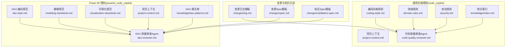
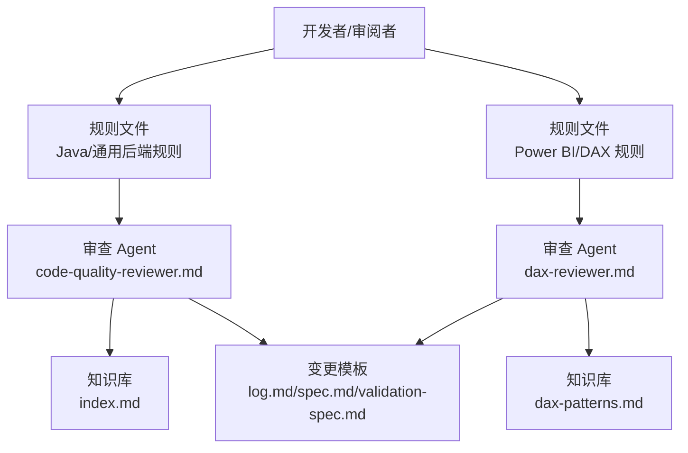
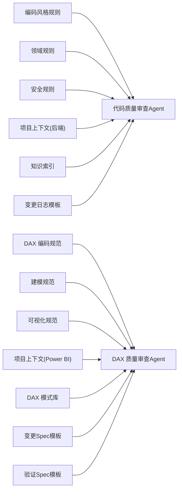

# 代码规则系统

<cite>
**本文引用的文件**
- [code_copilot/rules/coding-style.md](file://code_copilot/rules/coding-style.md)
- [code_copilot/rules/domain-rules.md](file://code_copilot/rules/domain-rules.md)
- [code_copilot/rules/project-context.md](file://code_copilot/rules/project-context.md)
- [code_copilot/rules/security.md](file://code_copilot/rules/security.md)
- [powerbi_code_copilot/rules/dax-style.md](file://powerbi_code_copilot/rules/dax-style.md)
- [powerbi_code_copilot/rules/modeling-standards.md](file://powerbi_code_copilot/rules/modeling-standards.md)
- [powerbi_code_copilot/rules/project-context.md](file://powerbi_code_copilot/rules/project-context.md)
- [powerbi_code_copilot/rules/visualization-standards.md](file://powerbi_code_copilot/rules/visualization-standards.md)
- [code_copilot/agents/code-quality-reviewer.md](file://code_copilot/agents/code-quality-reviewer.md)
- [powerbi_code_copilot/agents/dax-reviewer.md](file://powerbi_code_copilot/agents/dax-reviewer.md)
- [code_copilot/knowledge/index.md](file://code_copilot/knowledge/index.md)
- [powerbi_code_copilot/knowledge/dax-patterns.md](file://powerbi_code_copilot/knowledge/dax-patterns.md)
- [code_copilot/changes/templates/log.md](file://code_copilot/changes/templates/log.md)
- [powerbi_code_copilot/changes/templates/spec.md](file://powerbi_code_copilot/changes/templates/spec.md)
- [powerbi_code_copilot/changes/templates/validation-spec.md](file://powerbi_code_copilot/changes/templates/validation-spec.md)
</cite>

## 目录
1. [简介](#简介)
2. [项目结构](#项目结构)
3. [核心组件](#核心组件)
4. [架构总览](#架构总览)
5. [详细组件分析](#详细组件分析)
6. [依赖分析](#依赖分析)
7. [性能考量](#性能考量)
8. [故障排查指南](#故障排查指南)
9. [结论](#结论)
10. [附录](#附录)

## 简介
本文件系统性梳理“代码规则系统”的架构与实现，覆盖两类语言/技术栈：
- Java/通用后端规则：编码风格、领域规则、项目上下文、安全红线
- Power BI/DAX 规则：DAX 编码规范、数据建模规范、可视化规范、项目上下文

系统通过“规则文件 + 审查 Agent + 知识库 + 变更模板”的协同，支撑多语言、多项目的代码质量控制与一致性治理。

## 项目结构
规则系统主要分布在两个子项目中：
- code_copilot：通用后端规则与审查
- powerbi_code_copilot：Power BI/DAX 规则与审查

**图表来源**
- [code_copilot/rules/coding-style.md:1-34](file://code_copilot/rules/coding-style.md#L1-L34)
- [code_copilot/rules/domain-rules.md:1-18](file://code_copilot/rules/domain-rules.md#L1-L18)
- [code_copilot/rules/project-context.md:1-35](file://code_copilot/rules/project-context.md#L1-L35)
- [code_copilot/rules/security.md:1-18](file://code_copilot/rules/security.md#L1-L18)
- [powerbi_code_copilot/rules/dax-style.md:1-218](file://powerbi_code_copilot/rules/dax-style.md#L1-L218)
- [powerbi_code_copilot/rules/modeling-standards.md:1-88](file://powerbi_code_copilot/rules/modeling-standards.md#L1-L88)
- [powerbi_code_copilot/rules/project-context.md:1-69](file://powerbi_code_copilot/rules/project-context.md#L1-L69)
- [powerbi_code_copilot/rules/visualization-standards.md:1-81](file://powerbi_code_copilot/rules/visualization-standards.md#L1-L81)
- [code_copilot/agents/code-quality-reviewer.md:1-13](file://code_copilot/agents/code-quality-reviewer.md#L1-L13)
- [powerbi_code_copilot/agents/dax-reviewer.md:1-56](file://powerbi_code_copilot/agents/dax-reviewer.md#L1-L56)
- [code_copilot/knowledge/index.md:1-17](file://code_copilot/knowledge/index.md#L1-L17)
- [powerbi_code_copilot/knowledge/dax-patterns.md:1-205](file://powerbi_code_copilot/knowledge/dax-patterns.md#L1-L205)
- [code_copilot/changes/templates/log.md:1-28](file://code_copilot/changes/templates/log.md#L1-L28)
- [powerbi_code_copilot/changes/templates/spec.md:1-95](file://powerbi_code_copilot/changes/templates/spec.md#L1-L95)
- [powerbi_code_copilot/changes/templates/validation-spec.md:1-69](file://powerbi_code_copilot/changes/templates/validation-spec.md#L1-L69)

**章节来源**
- [code_copilot/rules/coding-style.md:1-34](file://code_copilot/rules/coding-style.md#L1-L34)
- [powerbi_code_copilot/rules/dax-style.md:1-218](file://powerbi_code_copilot/rules/dax-style.md#L1-L218)

## 核心组件
- 规则文件：以 Markdown + YAML Front Matter 的形式定义规则与元信息（如 alwaysApply、描述）
- 审查 Agent：定义审查级别、关注点、输出格式与工具权限
- 知识库：沉淀模式与经验，供规则执行时参考
- 变更模板：规范变更流程，确保可追溯、可验证、可沉淀

**章节来源**
- [code_copilot/rules/coding-style.md:1-34](file://code_copilot/rules/coding-style.md#L1-L34)
- [code_copilot/rules/domain-rules.md:1-18](file://code_copilot/rules/domain-rules.md#L1-L18)
- [code_copilot/rules/security.md:1-18](file://code_copilot/rules/security.md#L1-L18)
- [powerbi_code_copilot/rules/modeling-standards.md:1-88](file://powerbi_code_copilot/rules/modeling-standards.md#L1-L88)
- [powerbi_code_copilot/rules/visualization-standards.md:1-81](file://powerbi_code_copilot/rules/visualization-standards.md#L1-L81)
- [code_copilot/agents/code-quality-reviewer.md:1-13](file://code_copilot/agents/code-quality-reviewer.md#L1-L13)
- [powerbi_code_copilot/agents/dax-reviewer.md:1-56](file://powerbi_code_copilot/agents/dax-reviewer.md#L1-L56)
- [code_copilot/knowledge/index.md:1-17](file://code_copilot/knowledge/index.md#L1-L17)
- [powerbi_code_copilot/knowledge/dax-patterns.md:1-205](file://powerbi_code_copilot/knowledge/dax-patterns.md#L1-L205)
- [code_copilot/changes/templates/log.md:1-28](file://code_copilot/changes/templates/log.md#L1-L28)
- [powerbi_code_copilot/changes/templates/spec.md:1-95](file://powerbi_code_copilot/changes/templates/spec.md#L1-L95)
- [powerbi_code_copilot/changes/templates/validation-spec.md:1-69](file://powerbi_code_copilot/changes/templates/validation-spec.md#L1-L69)

## 架构总览
规则系统采用“规则即文档 + 自动化审查 + 知识沉淀 + 流程模板”的架构，支持多语言与多项目：

**图表来源**
- [code_copilot/agents/code-quality-reviewer.md:1-13](file://code_copilot/agents/code-quality-reviewer.md#L1-L13)
- [powerbi_code_copilot/agents/dax-reviewer.md:1-56](file://powerbi_code_copilot/agents/dax-reviewer.md#L1-L56)
- [code_copilot/knowledge/index.md:1-17](file://code_copilot/knowledge/index.md#L1-L17)
- [powerbi_code_copilot/knowledge/dax-patterns.md:1-205](file://powerbi_code_copilot/knowledge/dax-patterns.md#L1-L205)
- [code_copilot/changes/templates/log.md:1-28](file://code_copilot/changes/templates/log.md#L1-L28)
- [powerbi_code_copilot/changes/templates/spec.md:1-95](file://powerbi_code_copilot/changes/templates/spec.md#L1-L95)
- [powerbi_code_copilot/changes/templates/validation-spec.md:1-69](file://powerbi_code_copilot/changes/templates/validation-spec.md#L1-L69)

## 详细组件分析

### 编码风格规则（Java/通用后端）
- 覆盖命名、异常处理、日志、其他最佳实践
- alwaysApply: true，表示该规则始终生效
- 作用机制：作为代码编写的基础约束，贯穿开发全流程
- 应用场景：新功能开发、代码评审、静态检查集成
- 优先级与继承：基础规则，通常优先于领域规则；与项目上下文规则共同构成“通用基线”
- 冲突处理：若与项目上下文存在矛盾，以项目上下文为准（后者可覆盖通用基线）

**章节来源**
- [code_copilot/rules/coding-style.md:1-34](file://code_copilot/rules/coding-style.md#L1-L34)

### 领域规则（Java/通用后端）
- alwaysApply: false，仅在涉及业务领域特定逻辑时应用
- 作用机制：约束金额、时间、外部接口、状态机等关键领域行为
- 应用场景：支付、订单、风控、运营等业务模块
- 优先级：高于通用编码风格，低于安全红线
- 冲突处理：当与安全规则冲突时，以安全规则为准

**章节来源**
- [code_copilot/rules/domain-rules.md:1-18](file://code_copilot/rules/domain-rules.md#L1-L18)

### 项目上下文规则（Java/通用后端）
- alwaysApply: true，首次使用需执行 /init 填充
- 作用机制：定义应用概况、目录结构、分层架构、关键依赖，指导代码组织与模块划分
- 应用场景：新项目初始化、团队协作、架构演进
- 优先级：作为“项目基线”，与编码风格、领域规则共同构成项目级规则集

**章节来源**
- [code_copilot/rules/project-context.md:1-35](file://code_copilot/rules/project-context.md#L1-L35)

### 安全规则（Java/通用后端）
- alwaysApply: true，安全红线，严禁触碰
- 作用机制：禁止硬编码密钥、禁止泄露敏感信息、业务安全与权限校验
- 应用场景：所有涉及外部系统、用户数据、资金与状态变更的逻辑
- 优先级：最高，阻断式规则，不可豁免
- 冲突处理：任何违反安全规则的行为均为严重阻断项

**章节来源**
- [code_copilot/rules/security.md:1-18](file://code_copilot/rules/security.md#L1-L18)

### DAX 编码规范（Power BI）
- alwaysApply: true，适用于所有 DAX 开发
- 作用机制：命名约定、格式规范、编写原则、禁止事项、检查清单与常见错误
- 应用场景：度量值、计算列、变量、表与列命名
- 优先级：作为 DAX 开发的强制性基线
- 冲突处理：与建模规范冲突时，以建模规范为准（后者约束模型结构）

**章节来源**
- [powerbi_code_copilot/rules/dax-style.md:1-218](file://powerbi_code_copilot/rules/dax-style.md#L1-L218)

### 数据建模规范（Power BI）
- alwaysApply: true，适用于所有建模阶段
- 作用机制：星型模型优先、关系设计、表设计、度量值组织、禁止事项
- 应用场景：模型设计、关系文档化、度量值分组
- 优先级：高于 DAX 编码规范，约束模型结构与关系
- 冲突处理：DAX 编码规范不得破坏建模规范

**章节来源**
- [powerbi_code_copilot/rules/modeling-standards.md:1-88](file://powerbi_code_copilot/rules/modeling-standards.md#L1-L88)

### 可视化规范（Power BI）
- alwaysApply: true，适用于报表与可视化设计
- 作用机制：布局与设计原则、图表选型、交互设计、移动端适配、可访问性
- 应用场景：页面布局、图表选择、切片器与钻取、移动端体验
- 优先级：作为设计与交互的强制性基线
- 冲突处理：与建模/性能冲突时，以性能与数据准确性为先

**章节来源**
- [powerbi_code_copilot/rules/visualization-standards.md:1-81](file://powerbi_code_copilot/rules/visualization-standards.md#L1-L81)

### 项目上下文规则（Power BI）
- alwaysApply: true，首次使用需执行 /init 填充
- 作用机制：项目概况、数据源清单、模型结构、度量值分组、报表页面、安全配置、关键依赖
- 应用场景：新项目初始化、跨团队协作、审计与合规
- 优先级：作为 Power BI 项目的“基线配置”

**章节来源**
- [powerbi_code_copilot/rules/project-context.md:1-69](file://powerbi_code_copilot/rules/project-context.md#L1-L69)

### 代码质量审查 Agent（Java/通用后端）
- 审查分级：Critical（阻塞）、Important（应修复）、Minor（建议）
- 工具权限：只读（Read/Grep/Glob/Bash）
- 作用机制：在 spec 审查通过后启动，聚焦质量、安全与可维护性
- 应用场景：代码评审、自动化检查、CI 集成

**章节来源**
- [code_copilot/agents/code-quality-reviewer.md:1-13](file://code_copilot/agents/code-quality-reviewer.md#L1-L13)

### DAX 质量审查 Agent（Power BI）
- 审查分级：Critical、Important、Minor
- 工具权限：只读（Read/Grep/Glob）
- 作用机制：聚焦计算结果正确性、上下文转换、性能与可维护性
- 应用场景：DAX 评审、性能评估、模式复用

**章节来源**
- [powerbi_code_copilot/agents/dax-reviewer.md:1-56](file://powerbi_code_copilot/agents/dax-reviewer.md#L1-L56)

### 知识库与模式库
- 知识索引：轻量索引，记录领域知识、技术约定、踩坑记录
- DAX 模式库：常用高质量模式（累计求和、同比/环比、动态 Top N、ABC 分析、移动平均、半加性度量值等），含场景、代码、解释、性能说明
- 作用机制：为规则执行提供可复用的参考与最佳实践

**章节来源**
- [code_copilot/knowledge/index.md:1-17](file://code_copilot/knowledge/index.md#L1-L17)
- [powerbi_code_copilot/knowledge/dax-patterns.md:1-205](file://powerbi_code_copilot/knowledge/dax-patterns.md#L1-L205)

### 变更与验证模板
- 变更日志模板：记录决策、踩坑与知识发现，驱动知识飞轮
- 变更 Spec 模板：规范背景、现状、功能点、业务规则、模型/度量值/DAX/可视化变更、影响范围、风险与验证策略、执行日志、审查结论
- 验证 Spec 模板：强调数据驱动、对比验证、边界测试、展示证据、模型结构验证、性能验证、安全验证
- 作用机制：确保变更可追溯、可验证、可沉淀

**章节来源**
- [code_copilot/changes/templates/log.md:1-28](file://code_copilot/changes/templates/log.md#L1-L28)
- [powerbi_code_copilot/changes/templates/spec.md:1-95](file://powerbi_code_copilot/changes/templates/spec.md#L1-L95)
- [powerbi_code_copilot/changes/templates/validation-spec.md:1-69](file://powerbi_code_copilot/changes/templates/validation-spec.md#L1-L69)

## 依赖分析
规则系统内部依赖关系如下：

**图表来源**
- [code_copilot/agents/code-quality-reviewer.md:1-13](file://code_copilot/agents/code-quality-reviewer.md#L1-L13)
- [powerbi_code_copilot/agents/dax-reviewer.md:1-56](file://powerbi_code_copilot/agents/dax-reviewer.md#L1-L56)
- [code_copilot/knowledge/index.md:1-17](file://code_copilot/knowledge/index.md#L1-L17)
- [powerbi_code_copilot/knowledge/dax-patterns.md:1-205](file://powerbi_code_copilot/knowledge/dax-patterns.md#L1-L205)
- [code_copilot/changes/templates/log.md:1-28](file://code_copilot/changes/templates/log.md#L1-L28)
- [powerbi_code_copilot/changes/templates/spec.md:1-95](file://powerbi_code_copilot/changes/templates/spec.md#L1-L95)
- [powerbi_code_copilot/changes/templates/validation-spec.md:1-69](file://powerbi_code_copilot/changes/templates/validation-spec.md#L1-L69)

**章节来源**
- [code_copilot/rules/coding-style.md:1-34](file://code_copilot/rules/coding-style.md#L1-L34)
- [code_copilot/rules/domain-rules.md:1-18](file://code_copilot/rules/domain-rules.md#L1-L18)
- [code_copilot/rules/security.md:1-18](file://code_copilot/rules/security.md#L1-L18)
- [code_copilot/rules/project-context.md:1-35](file://code_copilot/rules/project-context.md#L1-L35)
- [powerbi_code_copilot/rules/dax-style.md:1-218](file://powerbi_code_copilot/rules/dax-style.md#L1-L218)
- [powerbi_code_copilot/rules/modeling-standards.md:1-88](file://powerbi_code_copilot/rules/modeling-standards.md#L1-L88)
- [powerbi_code_copilot/rules/visualization-standards.md:1-81](file://powerbi_code_copilot/rules/visualization-standards.md#L1-L81)
- [powerbi_code_copilot/rules/project-context.md:1-69](file://powerbi_code_copilot/rules/project-context.md#L1-L69)

## 性能考量
- DAX 性能优先：优先使用 VAR 避免重复计算、减少 CALCULATE 嵌套、明确上下文、避免不必要的上下文转换
- 建模性能：星型模型优先、关系 1:N、日期表独立并标记、移除未使用列、数值列最小精度
- 可视化性能：页面视觉对象数量限制、避免 3D 效果、双 Y 轴慎用、截断 Y 轴避免误导
- Agent 只读权限：减少误操作风险，便于 CI 集成与大规模扫描

**章节来源**
- [powerbi_code_copilot/agents/dax-reviewer.md:27-35](file://powerbi_code_copilot/agents/dax-reviewer.md#L27-L35)
- [powerbi_code_copilot/rules/dax-style.md:145-162](file://powerbi_code_copilot/rules/dax-style.md#L145-L162)
- [powerbi_code_copilot/rules/modeling-standards.md:45-63](file://powerbi_code_copilot/rules/modeling-standards.md#L45-L63)
- [powerbi_code_copilot/rules/visualization-standards.md:31-49](file://powerbi_code_copilot/rules/visualization-standards.md#L31-L49)

## 故障排查指南
- 审查分级定位问题
  - Critical：阻断项（安全漏洞、资金逻辑错误、并发安全、数据丢失风险；计算结果错误、上下文转换错误、循环依赖、RLS 规则绕过风险）
  - Important：应修复（未使用 VAR、不必要的迭代函数、FILTER(ALL(...)) 可用 REMOVEFILTERS 替代、度量值命名不符合规范、缺少注释的复杂度量值、硬编码筛选条件）
  - Minor：建议（格式不统一、变量命名不够清晰、可合并的简单度量值）
- 性能评估清单：避免不必要的上下文转换、CALCULATE 筛选参数最优、迭代函数在最小粒度表上运行、利用变量避免重复计算、时间智能函数正确使用日期表、可预计算为计算列的度量值
- 安全检查：硬编码密钥/AK/SK/数据库密码、敏感信息泄露、资金/状态/权限变更逻辑的人工审查与权限校验

**章节来源**
- [code_copilot/agents/code-quality-reviewer.md:5-12](file://code_copilot/agents/code-quality-reviewer.md#L5-L12)
- [powerbi_code_copilot/agents/dax-reviewer.md:7-26](file://powerbi_code_copilot/agents/dax-reviewer.md#L7-L26)
- [powerbi_code_copilot/agents/dax-reviewer.md:27-35](file://powerbi_code_copilot/agents/dax-reviewer.md#L27-L35)
- [code_copilot/rules/security.md:9-17](file://code_copilot/rules/security.md#L9-L17)

## 结论
规则系统通过“规则文件 + 审查 Agent + 知识库 + 变更模板”的闭环，实现了多语言、多项目的代码质量控制与一致性治理。其关键特征包括：
- 规则即文档，明确优先级与适用范围
- 审查 Agent 明确分级与工具权限，便于自动化与规模化
- 知识库沉淀模式与经验，降低重复劳动
- 变更模板确保可追溯、可验证、可沉淀

## 附录

### 规则优先级与继承关系
- 安全规则（最高） > 领域规则 > 编码风格规则 > 项目上下文规则
- 项目上下文规则可覆盖通用基线，但不得违反安全规则
- Power BI 建模规范优先于 DAX 编码规范，二者共同约束模型与实现

**章节来源**
- [code_copilot/rules/security.md:1-18](file://code_copilot/rules/security.md#L1-L18)
- [code_copilot/rules/domain-rules.md:1-18](file://code_copilot/rules/domain-rules.md#L1-L18)
- [code_copilot/rules/coding-style.md:1-34](file://code_copilot/rules/coding-style.md#L1-L34)
- [code_copilot/rules/project-context.md:1-35](file://code_copilot/rules/project-context.md#L1-L35)
- [powerbi_code_copilot/rules/modeling-standards.md:1-88](file://powerbi_code_copilot/rules/modeling-standards.md#L1-L88)
- [powerbi_code_copilot/rules/dax-style.md:1-218](file://powerbi_code_copilot/rules/dax-style.md#L1-L218)

### 规则配置最佳实践
- 添加规则
  - 在对应子项目 rules 目录新增规则文件，使用 YAML Front Matter 声明 alwaysApply 与描述
  - 在审查 Agent 中补充相应关注点与输出格式
- 修改规则
  - 更新规则文件后，同步更新 Agent 的审查清单与模板
  - 对既有代码进行回溯检查，确保一致性
- 删除规则
  - 通过版本管理与变更模板记录删除原因与影响范围
  - 逐步迁移，避免遗留风险

**章节来源**
- [code_copilot/agents/code-quality-reviewer.md:1-13](file://code_copilot/agents/code-quality-reviewer.md#L1-L13)
- [powerbi_code_copilot/agents/dax-reviewer.md:1-56](file://powerbi_code_copilot/agents/dax-reviewer.md#L1-L56)
- [code_copilot/changes/templates/spec.md:1-95](file://code_copilot/changes/templates/spec.md#L1-L95)
- [powerbi_code_copilot/changes/templates/spec.md:1-95](file://powerbi_code_copilot/changes/templates/spec.md#L1-L95)

### 多语言与多项目支持
- 多语言：Java/通用后端规则与 Power BI/DAX 规则分别维护，互不干扰
- 多项目：通过项目上下文规则与 Agent 的只读权限，确保不同项目在各自基线上运行
- 可扩展性：新增语言/项目只需新增规则文件、Agent 与模板，复用现有知识库与流程

**章节来源**
- [code_copilot/rules/project-context.md:1-35](file://code_copilot/rules/project-context.md#L1-L35)
- [powerbi_code_copilot/rules/project-context.md:1-69](file://powerbi_code_copilot/rules/project-context.md#L1-L69)
- [code_copilot/agents/code-quality-reviewer.md:11-13](file://code_copilot/agents/code-quality-reviewer.md#L11-L13)
- [powerbi_code_copilot/agents/dax-reviewer.md:54-56](file://powerbi_code_copilot/agents/dax-reviewer.md#L54-L56)