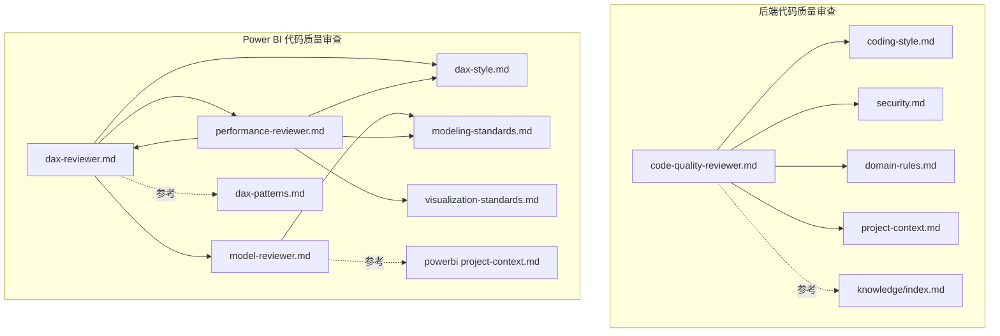
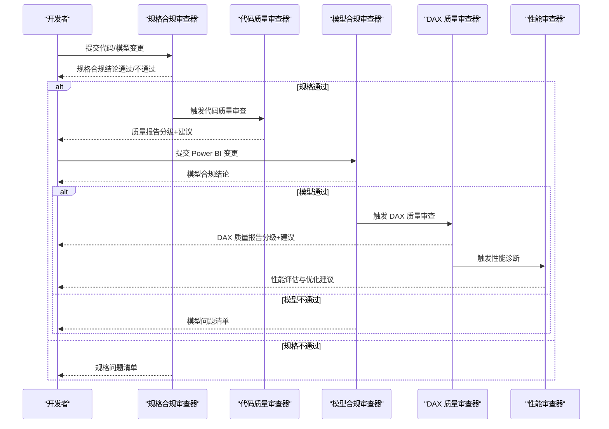
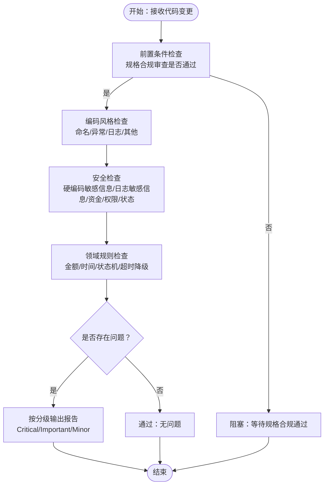
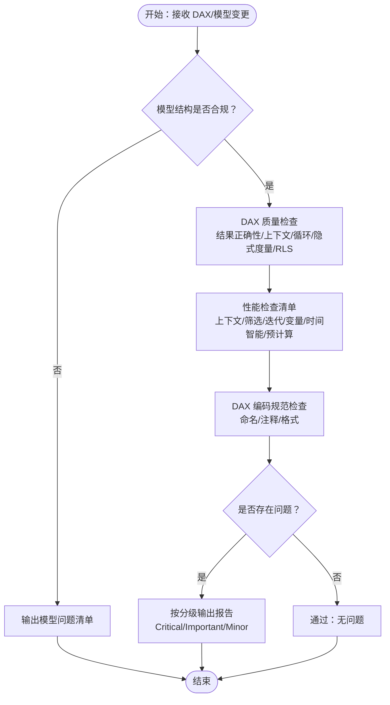
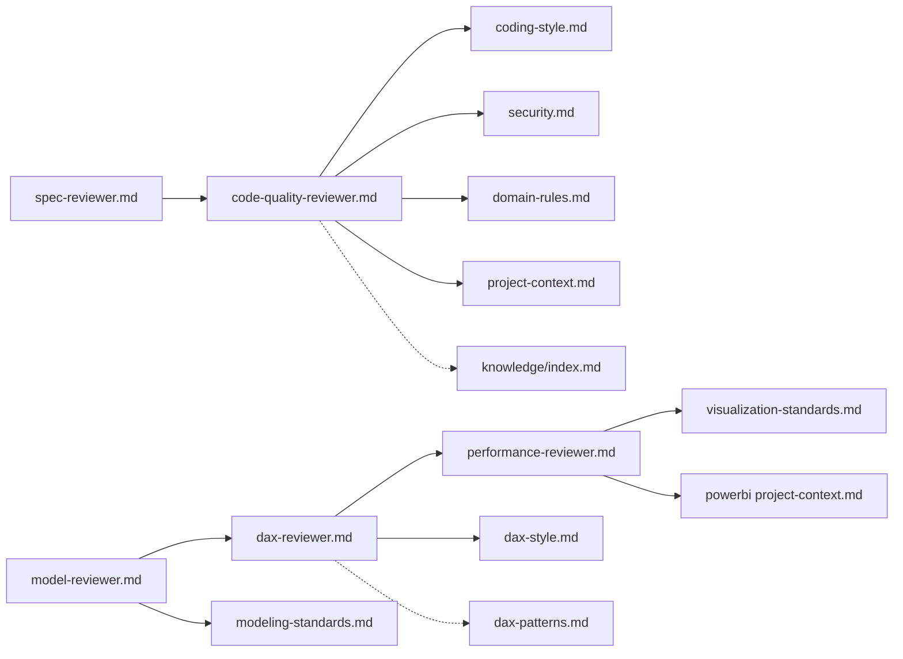

# 代码质量审查器

<cite>
**本文引用的文件**
- [code-quality-reviewer.md](file://code_copilot/agents/code-quality-reviewer.md)
- [spec-reviewer.md](file://code_copilot/agents/spec-reviewer.md)
- [coding-style.md](file://code_copilot/rules/coding-style.md)
- [security.md](file://code_copilot/rules/security.md)
- [domain-rules.md](file://code_copilot/rules/domain-rules.md)
- [project-context.md](file://code_copilot/rules/project-context.md)
- [index.md](file://code_copilot/knowledge/index.md)
- [dax-reviewer.md](file://powerbi_code_copilot/agents/dax-reviewer.md)
- [model-reviewer.md](file://powerbi_code_copilot/agents/model-reviewer.md)
- [performance-reviewer.md](file://powerbi_code_copilot/agents/performance-reviewer.md)
- [dax-style.md](file://powerbi_code_copilot/rules/dax-style.md)
- [modeling-standards.md](file://powerbi_code_copilot/rules/modeling-standards.md)
- [visualization-standards.md](file://powerbi_code_copilot/rules/visualization-standards.md)
- [project-context.md](file://powerbi_code_copilot/rules/project-context.md)
- [dax-patterns.md](file://powerbi_code_copilot/knowledge/dax-patterns.md)
</cite>

## 目录
1. [简介](#简介)
2. [项目结构](#项目结构)
3. [核心组件](#核心组件)
4. [架构总览](#架构总览)
5. [详细组件分析](#详细组件分析)
6. [依赖分析](#依赖分析)
7. [性能考量](#性能考量)
8. [故障排查指南](#故障排查指南)
9. [结论](#结论)
10. [附录](#附录)

## 简介
本文件系统化梳理“代码质量审查器”的工作原理与实现机制，覆盖Java后端与Power BI两大技术栈的审查能力。审查器以“只读、可独立运行”为前提，围绕编码风格、安全性、规范遵循与潜在问题识别四维构建质量评估体系；同时提供审查分级、输出格式与工具权限约束，确保自动化质量保障的可落地性与可追溯性。

## 项目结构
- 后端代码质量审查（Java/Spring Boot）
  - 审查器：code_copilot/agents/code-quality-reviewer.md
  - 规则与上下文：code_copilot/rules/*.md
  - 知识索引：code_copilot/knowledge/index.md
- Power BI 代码质量审查（DAX/建模/可视化）
  - 审查器：powerbi_code_copilot/agents/*.md
  - 规则与上下文：powerbi_code_copilot/rules/*.md
  - 模式库：powerbi_code_copilot/knowledge/dax-patterns.md

**图表来源**
- [code-quality-reviewer.md:1-13](file://code_copilot/agents/code-quality-reviewer.md#L1-L13)
- [coding-style.md:1-34](file://code_copilot/rules/coding-style.md#L1-L34)
- [security.md:1-18](file://code_copilot/rules/security.md#L1-L18)
- [domain-rules.md:1-18](file://code_copilot/rules/domain-rules.md#L1-L18)
- [project-context.md:1-35](file://code_copilot/rules/project-context.md#L1-L35)
- [index.md:1-17](file://code_copilot/knowledge/index.md#L1-L17)
- [dax-reviewer.md:1-56](file://powerbi_code_copilot/agents/dax-reviewer.md#L1-L56)
- [model-reviewer.md:1-36](file://powerbi_code_copilot/agents/model-reviewer.md#L1-L36)
- [performance-reviewer.md:1-71](file://powerbi_code_copilot/agents/performance-reviewer.md#L1-L71)
- [dax-style.md:1-218](file://powerbi_code_copilot/rules/dax-style.md#L1-L218)
- [modeling-standards.md:1-88](file://powerbi_code_copilot/rules/modeling-standards.md#L1-L88)
- [visualization-standards.md:1-81](file://powerbi_code_copilot/rules/visualization-standards.md#L1-L81)
- [project-context.md:1-69](file://powerbi_code_copilot/rules/project-context.md#L1-L69)
- [dax-patterns.md:1-205](file://powerbi_code_copilot/knowledge/dax-patterns.md#L1-L205)

**章节来源**
- [code-quality-reviewer.md:1-13](file://code_copilot/agents/code-quality-reviewer.md#L1-L13)
- [dax-reviewer.md:1-56](file://powerbi_code_copilot/agents/dax-reviewer.md#L1-L56)

## 核心组件
- 后端代码质量审查器
  - 审查职责：质量、安全与可维护性
  - 审查分级：Critical（阻塞）、Important（应修复）、Minor（建议）
  - 工具权限：仅读（Read/Grep/Glob/Bash）
  - 前置条件：需先通过“规格合规审查器”
- Power BI DAX 质量审查器
  - 审查职责：DAX 质量、性能与可维护性
  - 审查分级：Critical（阻塞）、Important（应修复）、Minor（建议）
  - 性能审查清单：上下文转换、迭代函数、时间智能、变量复用等
  - 工具权限：仅读（Read/Grep/Glob）
  - 前置条件：需先通过“模型合规审查器”

**章节来源**
- [code-quality-reviewer.md:1-13](file://code_copilot/agents/code-quality-reviewer.md#L1-L13)
- [dax-reviewer.md:1-56](file://powerbi_code_copilot/agents/dax-reviewer.md#L1-L56)

## 架构总览
审查器采用“分层+并行”的架构：
- 规格合规审查器（Spec Reviewer）先行，确保实现与规格一致
- 代码质量审查器（Code Quality Reviewer）随后，聚焦编码风格、安全与潜在问题
- Power BI 审查器链路：模型合规审查器 → DAX 质量审查器 → 性能审查器
- 所有审查器均声明“只读”，避免误改代码

**图表来源**
- [spec-reviewer.md:1-25](file://code_copilot/agents/spec-reviewer.md#L1-L25)
- [code-quality-reviewer.md:1-13](file://code_copilot/agents/code-quality-reviewer.md#L1-L13)
- [model-reviewer.md:1-36](file://powerbi_code_copilot/agents/model-reviewer.md#L1-L36)
- [dax-reviewer.md:1-56](file://powerbi_code_copilot/agents/dax-reviewer.md#L1-L56)
- [performance-reviewer.md:1-71](file://powerbi_code_copilot/agents/performance-reviewer.md#L1-L71)

## 详细组件分析

### 后端代码质量审查器
- 审查目标
  - 编码风格：命名、异常处理、日志、其他约束
  - 安全性：硬编码敏感信息、日志敏感信息泄露、资金/权限/状态变更的合规性
  - 规范遵循：工程上下文、领域规则
  - 潜在问题：魔法值、方法过长、命名不清、异常吞掉等
- 审查分级
  - Critical：安全漏洞、资金逻辑错误、并发安全、数据丢失风险
  - Important：异常吞掉、缺少参数校验、魔法值、方法过长、命名不清
  - Minor：Javadoc 缺失、注释过时、import 未清理
- 工具权限与前置条件
  - 仅读（Read/Grep/Glob/Bash），无需写入
  - 必须在规格合规审查器通过后启动

**图表来源**
- [code-quality-reviewer.md:1-13](file://code_copilot/agents/code-quality-reviewer.md#L1-L13)
- [coding-style.md:1-34](file://code_copilot/rules/coding-style.md#L1-L34)
- [security.md:1-18](file://code_copilot/rules/security.md#L1-L18)
- [domain-rules.md:1-18](file://code_copilot/rules/domain-rules.md#L1-L18)
- [project-context.md:1-35](file://code_copilot/rules/project-context.md#L1-L35)

**章节来源**
- [code-quality-reviewer.md:1-13](file://code_copilot/agents/code-quality-reviewer.md#L1-L13)
- [coding-style.md:1-34](file://code_copilot/rules/coding-style.md#L1-L34)
- [security.md:1-18](file://code_copilot/rules/security.md#L1-L18)
- [domain-rules.md:1-18](file://code_copilot/rules/domain-rules.md#L1-L18)
- [project-context.md:1-35](file://code_copilot/rules/project-context.md#L1-L35)

### Power BI DAX 质量审查器
- 审查目标
  - DAX 质量：计算结果正确性、上下文转换、循环依赖、隐式度量值歧义、RLS 规避风险
  - 性能：上下文转换、CALCULATE 筛选参数、迭代函数粒度、变量复用、时间智能、预计算
  - 可维护性：命名规范、注释、格式统一
- 审查分级
  - Critical：计算结果错误、上下文转换错误、循环依赖、隐式度量值歧义、RLS 规避风险
  - Important：未使用 VAR、不必要的迭代函数、FILTER(ALL(...))、命名不规范、复杂度量值缺注释、硬编码筛选
  - Minor：格式不统一、变量命名不清、可合并的简单度量值
- 性能审查清单
  - 是否避免不必要的上下文转换
  - CALCULATE 的筛选参数是否最优
  - 迭代函数是否在最小粒度表上运行
  - 是否利用变量避免重复计算
  - 时间智能函数是否正确使用日期表
  - 是否存在可以预计算为计算列的度量值

**图表来源**
- [dax-reviewer.md:1-56](file://powerbi_code_copilot/agents/dax-reviewer.md#L1-L56)
- [dax-style.md:1-218](file://powerbi_code_copilot/rules/dax-style.md#L1-L218)
- [modeling-standards.md:1-88](file://powerbi_code_copilot/rules/modeling-standards.md#L1-L88)

**章节来源**
- [dax-reviewer.md:1-56](file://powerbi_code_copilot/agents/dax-reviewer.md#L1-L56)
- [dax-style.md:1-218](file://powerbi_code_copilot/rules/dax-style.md#L1-L218)
- [modeling-standards.md:1-88](file://powerbi_code_copilot/rules/modeling-standards.md#L1-L88)

### Power BI 模型合规审查器
- 审查维度
  - 缺失/多余/理解偏差/业务规则落地/模型结构合规（星型/雪花、关系方向、双向筛选、循环依赖）/数据变更准确性
- 输出格式
  - 模型结构验证、度量值逐条验证、结论（合规/不合规）

**章节来源**
- [model-reviewer.md:1-36](file://powerbi_code_copilot/agents/model-reviewer.md#L1-L36)

### Power BI 性能审查器
- 诊断框架（数据源/Power Query/模型/DAX/可视化）
- 输出格式
  - 性能评估摘要（整体评级、模型大小、度量值数量、表数量）
  - 问题清单（P0/P1/P2 按影响排序）
  - 优化路线图

**章节来源**
- [performance-reviewer.md:1-71](file://powerbi_code_copilot/agents/performance-reviewer.md#L1-L71)

## 依赖分析
- 审查器之间的依赖
  - 后端：spec-reviewer → code-quality-reviewer
  - Power BI：model-reviewer → dax-reviewer → performance-reviewer
- 规则与上下文的依赖
  - 后端：coding-style、security、domain-rules、project-context
  - Power BI：dax-style、modeling-standards、visualization-standards、project-context
- 知识库与模式库
  - 后端：knowledge/index.md（轻量索引）
  - Power BI：dax-patterns.md（常用高质量模式）

**图表来源**
- [spec-reviewer.md:1-25](file://code_copilot/agents/spec-reviewer.md#L1-L25)
- [code-quality-reviewer.md:1-13](file://code_copilot/agents/code-quality-reviewer.md#L1-L13)
- [model-reviewer.md:1-36](file://powerbi_code_copilot/agents/model-reviewer.md#L1-L36)
- [dax-reviewer.md:1-56](file://powerbi_code_copilot/agents/dax-reviewer.md#L1-L56)
- [performance-reviewer.md:1-71](file://powerbi_code_copilot/agents/performance-reviewer.md#L1-L71)
- [coding-style.md:1-34](file://code_copilot/rules/coding-style.md#L1-L34)
- [security.md:1-18](file://code_copilot/rules/security.md#L1-L18)
- [domain-rules.md:1-18](file://code_copilot/rules/domain-rules.md#L1-L18)
- [project-context.md:1-35](file://code_copilot/rules/project-context.md#L1-L35)
- [index.md:1-17](file://code_copilot/knowledge/index.md#L1-L17)
- [dax-style.md:1-218](file://powerbi_code_copilot/rules/dax-style.md#L1-L218)
- [modeling-standards.md:1-88](file://powerbi_code_copilot/rules/modeling-standards.md#L1-L88)
- [visualization-standards.md:1-81](file://powerbi_code_copilot/rules/visualization-standards.md#L1-L81)
- [project-context.md:1-69](file://powerbi_code_copilot/rules/project-context.md#L1-L69)
- [dax-patterns.md:1-205](file://powerbi_code_copilot/knowledge/dax-patterns.md#L1-L205)

**章节来源**
- [spec-reviewer.md:1-25](file://code_copilot/agents/spec-reviewer.md#L1-L25)
- [code-quality-reviewer.md:1-13](file://code_copilot/agents/code-quality-reviewer.md#L1-L13)
- [model-reviewer.md:1-36](file://powerbi_code_copilot/agents/model-reviewer.md#L1-L36)
- [dax-reviewer.md:1-56](file://powerbi_code_copilot/agents/dax-reviewer.md#L1-L56)
- [performance-reviewer.md:1-71](file://powerbi_code_copilot/agents/performance-reviewer.md#L1-L71)

## 性能考量
- 后端
  - 幂等接口设计、并发同步策略、魔法值常量化，有助于减少运行期异常与性能抖动
- Power BI
  - 优先使用 VAR 避免重复计算、减少上下文转换、迭代函数在最小粒度表上运行、时间智能函数正确使用日期表、必要时将复杂度量值预计算为计算列
  - 控制页面视觉对象数量、避免 3D/饼图等高开销图表、合理使用切片器与钻取交互

**章节来源**
- [coding-style.md:29-34](file://code_copilot/rules/coding-style.md#L29-L34)
- [dax-style.md:143-170](file://powerbi_code_copilot/rules/dax-style.md#L143-L170)
- [performance-reviewer.md:5-38](file://powerbi_code_copilot/agents/performance-reviewer.md#L5-L38)

## 故障排查指南
- 常见问题定位
  - 后端：异常吞掉、缺少参数校验、魔法值、方法过长、命名不清、硬编码敏感信息、日志泄露、资金/权限/状态变更未标注或未通过人工审查
  - Power BI：CALCULATE 嵌套不当、EARLIER 滥用、隐式度量值、FILTER(ALL(...)) 未替换、命名不规范、注释缺失、格式不统一
- 审查报告解读
  - Critical：阻塞项，必须立即修复
  - Important：应修复项，影响较大，建议尽快处理
  - Minor：建议项，提升可维护性与一致性
- 改进建议生成机制
  - 基于规则与上下文文档，审查器自动匹配问题类型并生成分级与建议
  - Power BI 模式库提供可复用的高质量 DAX 模式，便于替换低效实现

**章节来源**
- [code-quality-reviewer.md:5-12](file://code_copilot/agents/code-quality-reviewer.md#L5-L12)
- [security.md:7-17](file://code_copilot/rules/security.md#L7-L17)
- [dax-reviewer.md:5-26](file://powerbi_code_copilot/agents/dax-reviewer.md#L5-L26)
- [dax-patterns.md:1-205](file://powerbi_code_copilot/knowledge/dax-patterns.md#L1-L205)

## 结论
代码质量审查器通过“只读、可独立运行”的设计，结合编码规范、安全红线、领域规则与工程上下文，为后端与 Power BI 提供系统化的质量保障。审查分级与输出格式确保问题可追踪、可治理；性能审查清单与模式库进一步提升可维护性与运行效率。建议在 CI/CD 中集成审查器，形成持续的质量反馈闭环。

## 附录
- 使用建议
  - 后端：先通过规格合规审查，再运行代码质量审查；针对 Critical/Important 问题优先修复
  - Power BI：先模型合规审查，再 DAX 质量审查，最后性能诊断；按 P0/P1/P2 优先级推进
- 工具权限
  - 后端：Read/Grep/Glob/Bash
  - Power BI：Read/Grep/Glob

**章节来源**
- [code-quality-reviewer.md:11-12](file://code_copilot/agents/code-quality-reviewer.md#L11-L12)
- [dax-reviewer.md:54-55](file://powerbi_code_copilot/agents/dax-reviewer.md#L54-L55)
- [performance-reviewer.md:69-70](file://powerbi_code_copilot/agents/performance-reviewer.md#L69-L70)