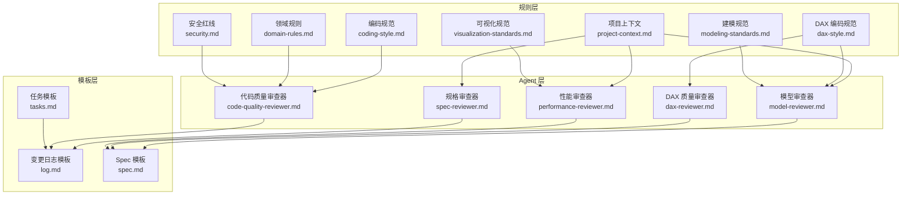
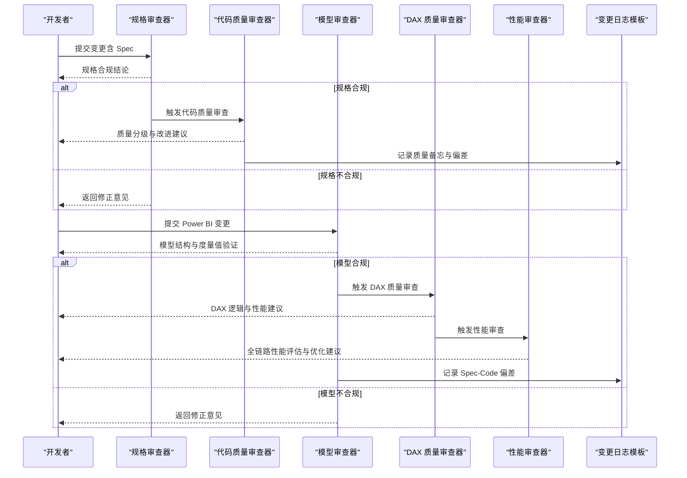
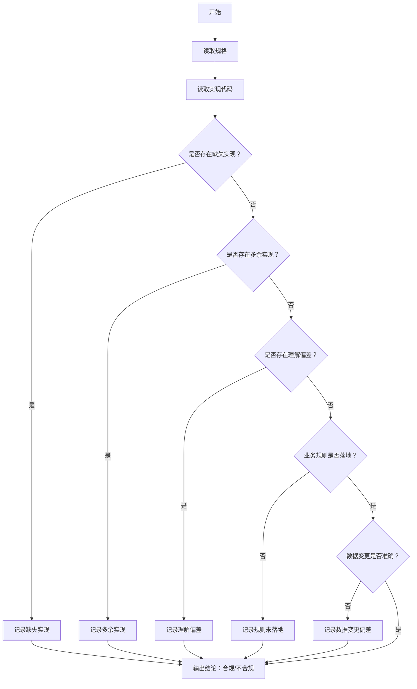
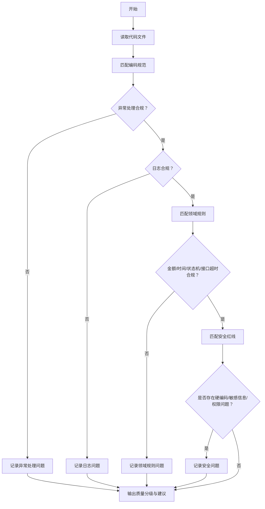
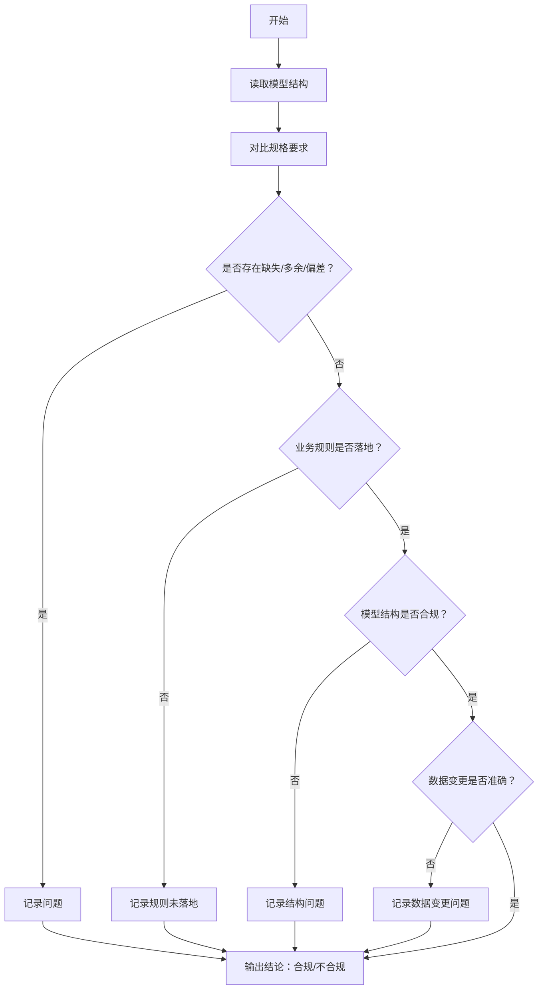
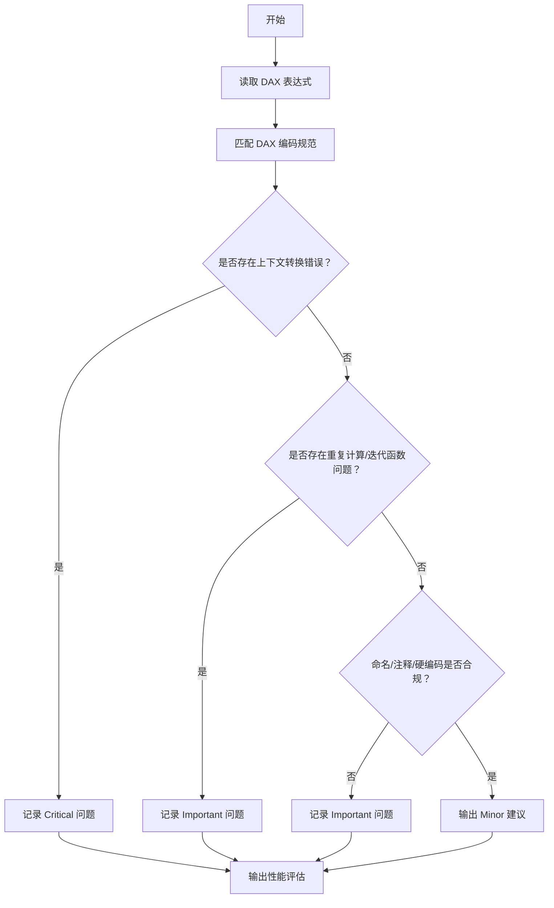
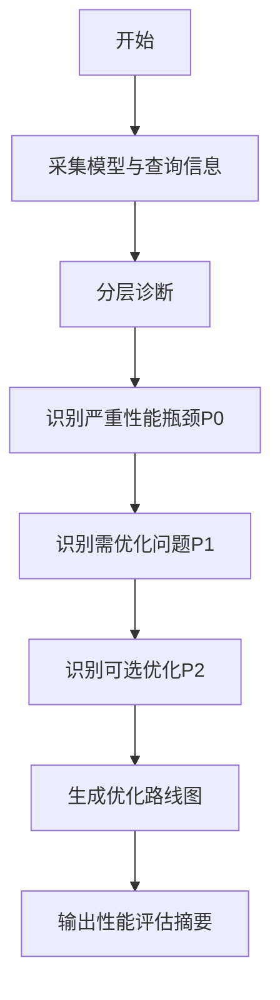
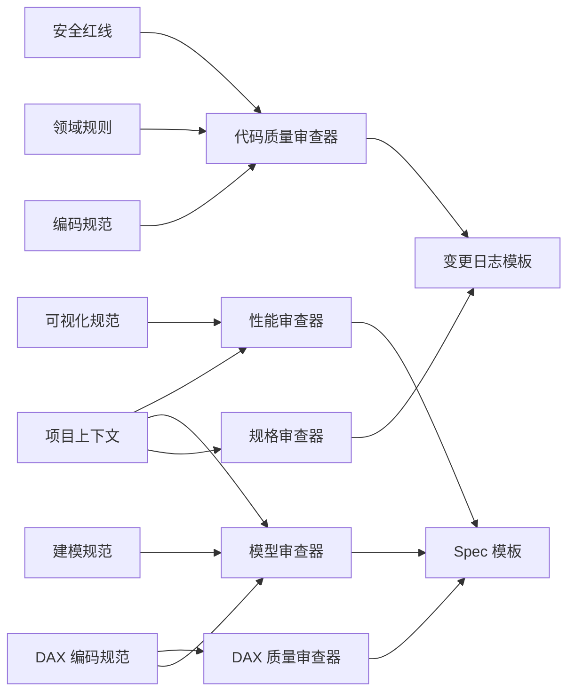

# 代码质量控制模块

<cite>
**本文引用的文件**
- [code-quality-reviewer.md](file://code_copilot/agents/code-quality-reviewer.md)
- [spec-reviewer.md](file://code_copilot/agents/spec-reviewer.md)
- [coding-style.md](file://code_copilot/rules/coding-style.md)
- [domain-rules.md](file://code_copilot/rules/domain-rules.md)
- [project-context.md](file://code_copilot/rules/project-context.md)
- [security.md](file://code_copilot/rules/security.md)
- [log.md](file://code_copilot/changes/templates/log.md)
- [tasks.md](file://code_copilot/changes/templates/tasks.md)
- [dax-reviewer.md](file://powerbi_code_copilot/agents/dax-reviewer.md)
- [model-reviewer.md](file://powerbi_code_copilot/agents/model-reviewer.md)
- [performance-reviewer.md](file://powerbi_code_copilot/agents/performance-reviewer.md)
- [dax-style.md](file://powerbi_code_copilot/rules/dax-style.md)
- [modeling-standards.md](file://powerbi_code_copilot/rules/modeling-standards.md)
- [project-context.md](file://powerbi_code_copilot/rules/project-context.md)
- [visualization-standards.md](file://powerbi_code_copilot/rules/visualization-standards.md)
- [spec.md](file://powerbi_code_copilot/changes/templates/spec.md)
</cite>

## 目录
1. [简介](#简介)
2. [项目结构](#项目结构)
3. [核心组件](#核心组件)
4. [架构总览](#架构总览)
5. [详细组件分析](#详细组件分析)
6. [依赖分析](#依赖分析)
7. [性能考量](#性能考量)
8. [故障排查指南](#故障排查指南)
9. [结论](#结论)
10. [附录](#附录)

## 简介
本文件为“代码质量控制模块”的权威文档，覆盖基于规则的代码审查体系，包括：
- 代码质量评估标准与分级
- 安全性检查方法与红线
- 规范遵循验证机制
- Agent 系统工作原理（代码质量审查器、规格审查器、DAX/模型/性能审查器）
- 变更管理流程（变更日志模板、任务管理模板、Spec 模板）
- 编码风格规范、领域规则与项目上下文规则
- 面向开发团队的自动化质量保证方案与最佳实践

该模块同时支持传统代码（Java/Spring Boot）与 Power BI（DAX/建模/可视化）两类场景，确保跨技术栈的一致性质量基线。

## 项目结构
模块采用“规则 + Agent + 模板”的分层组织方式：
- 规则层：定义编码规范、领域约束、安全红线、项目上下文等
- Agent 层：定义不同视角的审查者（规格合规、代码质量、DAX/模型/性能）
- 模板层：提供变更日志、任务拆分、Spec 等标准化文档模板

**图表来源**
- [coding-style.md:1-34](file://code_copilot/rules/coding-style.md#L1-L34)
- [domain-rules.md:1-18](file://code_copilot/rules/domain-rules.md#L1-L18)
- [project-context.md:1-35](file://code_copilot/rules/project-context.md#L1-L35)
- [security.md:1-18](file://code_copilot/rules/security.md#L1-L18)
- [dax-style.md:1-218](file://powerbi_code_copilot/rules/dax-style.md#L1-L218)
- [modeling-standards.md:1-88](file://powerbi_code_copilot/rules/modeling-standards.md#L1-L88)
- [visualization-standards.md:1-81](file://powerbi_code_copilot/rules/visualization-standards.md#L1-L81)
- [spec-reviewer.md:1-25](file://code_copilot/agents/spec-reviewer.md#L1-L25)
- [code-quality-reviewer.md:1-13](file://code_copilot/agents/code-quality-reviewer.md#L1-L13)
- [model-reviewer.md:1-36](file://powerbi_code_copilot/agents/model-reviewer.md#L1-L36)
- [dax-reviewer.md:1-56](file://powerbi_code_copilot/agents/dax-reviewer.md#L1-L56)
- [performance-reviewer.md:1-71](file://powerbi_code_copilot/agents/performance-reviewer.md#L1-L71)
- [log.md:1-28](file://code_copilot/changes/templates/log.md#L1-L28)
- [tasks.md:1-33](file://code_copilot/changes/templates/tasks.md#L1-L33)
- [spec.md:1-95](file://powerbi_code_copilot/changes/templates/spec.md#L1-L95)

**章节来源**
- [project-context.md:1-35](file://code_copilot/rules/project-context.md#L1-L35)
- [project-context.md:1-69](file://powerbi_code_copilot/rules/project-context.md#L1-L69)

## 核心组件
- 规格审查器（Spec Compliance Reviewer）
  - 职责：验证实现是否符合规格，独立于实现者上下文，只读不写
  - 审查维度：缺失实现、多余实现、理解偏差、业务规则落地、数据变更准确性
  - 输出格式：逐条验证 + 结论
- 代码质量审查器（Code Quality Reviewer）
  - 职责：质量、安全、可维护性审查；前置条件为规格审查通过
  - 审查分级：Critical（阻塞）、Important（应修复）、Minor（建议）
  - 工具权限：只读（Read/Grep/Glob/Bash）
- DAX/模型/性能审查器（Power BI）
  - 模型审查器：验证模型结构、关系、度量值与业务规则的落地
  - DAX 质量审查器：计算结果正确性、上下文转换、性能隐患、命名规范
  - 性能审查器：数据源/Power Query/模型/DAX/可视化全链路诊断
- 规则与模板
  - 编码规范、领域规则、安全红线、项目上下文
  - 变更日志、任务拆分、Spec 模板

**章节来源**
- [spec-reviewer.md:1-25](file://code_copilot/agents/spec-reviewer.md#L1-L25)
- [code-quality-reviewer.md:1-13](file://code_copilot/agents/code-quality-reviewer.md#L1-L13)
- [dax-reviewer.md:1-56](file://powerbi_code_copilot/agents/dax-reviewer.md#L1-L56)
- [model-reviewer.md:1-36](file://powerbi_code_copilot/agents/model-reviewer.md#L1-L36)
- [performance-reviewer.md:1-71](file://powerbi_code_copilot/agents/performance-reviewer.md#L1-L71)

## 架构总览
审查流程分为两条主线：
- 代码主线：Spec 审查 → 代码质量审查 → 变更日志沉淀
- Power BI 主线：模型审查 → DAX 质量审查 → 性能审查 → Spec/变更模板沉淀

**图表来源**
- [spec-reviewer.md:1-25](file://code_copilot/agents/spec-reviewer.md#L1-L25)
- [code-quality-reviewer.md:1-13](file://code_copilot/agents/code-quality-reviewer.md#L1-L13)
- [model-reviewer.md:1-36](file://powerbi_code_copilot/agents/model-reviewer.md#L1-L36)
- [dax-reviewer.md:1-56](file://powerbi_code_copilot/agents/dax-reviewer.md#L1-L56)
- [performance-reviewer.md:1-71](file://powerbi_code_copilot/agents/performance-reviewer.md#L1-L71)
- [log.md:1-28](file://code_copilot/changes/templates/log.md#L1-L28)

## 详细组件分析

### 规格审查器（Spec Compliance Reviewer）
- 审查维度
  - 缺失实现：规格要求但代码未实现
  - 多余实现：规格未要求但代码多做（YAGNI）
  - 理解偏差：实现方向与规格描述不符
  - 业务规则落地：第4节规则是否体现在代码中
  - 数据变更准确性：第5节表/字段变更是否准确落地
- 输出格式
  - 功能点逐条验证（✅/❌/⚠️）
  - 结论：Spec 合规/不合规（附具体问题）

**图表来源**
- [spec-reviewer.md:6-12](file://code_copilot/agents/spec-reviewer.md#L6-L12)

**章节来源**
- [spec-reviewer.md:1-25](file://code_copilot/agents/spec-reviewer.md#L1-L25)

### 代码质量审查器（Code Quality Reviewer）
- 审查分级
  - Critical（阻塞）：安全漏洞、资金逻辑错误、并发安全、数据丢失风险
  - Important（应修复）：异常被吞、缺少参数校验、魔法值、方法过长、命名不清
  - Minor（建议）：Javadoc 缺失、注释过时、import 未清理
- 工具权限：只读（Read/Grep/Glob/Bash）
- 评估依据
  - 编码规范：命名、异常处理、日志、其他
  - 领域规则：金额/时间/状态机/外部接口超时与降级
  - 安全红线：硬编码密钥/AKSK/密码、敏感信息泄露、资金/状态/权限逻辑

**图表来源**
- [coding-style.md:16-34](file://code_copilot/rules/coding-style.md#L16-L34)
- [domain-rules.md:10-13](file://code_copilot/rules/domain-rules.md#L10-L13)
- [security.md:9-17](file://code_copilot/rules/security.md#L9-L17)

**章节来源**
- [code-quality-reviewer.md:1-13](file://code_copilot/agents/code-quality-reviewer.md#L1-L13)
- [coding-style.md:1-34](file://code_copilot/rules/coding-style.md#L1-L34)
- [domain-rules.md:1-18](file://code_copilot/rules/domain-rules.md#L1-L18)
- [security.md:1-18](file://code_copilot/rules/security.md#L1-L18)

### Power BI 审查器

#### 模型审查器（Model Compliance Reviewer）
- 审查维度
  - 缺失/多余/理解偏差
  - 业务规则落地（度量值/计算列）
  - 模型结构合规（星型/雪花模型、关系方向、双向筛选、循环依赖）
  - 数据变更准确性
- 输出格式：模型结构验证 + 度量值逐条验证 + 结论

**图表来源**
- [model-reviewer.md:6-18](file://powerbi_code_copilot/agents/model-reviewer.md#L6-L18)

**章节来源**
- [model-reviewer.md:1-36](file://powerbi_code_copilot/agents/model-reviewer.md#L1-L36)

#### DAX 质量审查器（DAX Quality Reviewer）
- 审查分级
  - Critical：计算结果错误、上下文转换错误、循环依赖、隐式度量值歧义、RLS 规则绕过
  - Important：未使用 VAR 导致重复计算、不必要的迭代函数、命名/注释问题、硬编码筛选
  - Minor：格式不统一、变量命名不清、可合并度量值
- 性能审查清单：上下文转换、筛选参数、迭代粒度、变量复用、时间智能、预计算
- 输出格式：分级问题 + 性能评估摘要

**图表来源**
- [dax-reviewer.md:5-26](file://powerbi_code_copilot/agents/dax-reviewer.md#L5-L26)
- [dax-style.md:143-170](file://powerbi_code_copilot/rules/dax-style.md#L143-L170)

**章节来源**
- [dax-reviewer.md:1-56](file://powerbi_code_copilot/agents/dax-reviewer.md#L1-L56)
- [dax-style.md:1-218](file://powerbi_code_copilot/rules/dax-style.md#L1-L218)

#### 性能审查器（Performance Reviewer）
- 诊断框架：数据源层、Power Query 层、模型层、DAX 层、可视化层
- 输出格式：整体评级、问题清单（P0/P1/P2）、优化路线图

**图表来源**
- [performance-reviewer.md:5-38](file://powerbi_code_copilot/agents/performance-reviewer.md#L5-L38)

**章节来源**
- [performance-reviewer.md:1-71](file://powerbi_code_copilot/agents/performance-reviewer.md#L1-L71)

### 规则与模板

#### 编码规范（Java/Spring Boot）
- 命名：类/方法/常量/抽象类/测试类命名规范
- 异常处理：自定义业务异常、系统异常兜底、禁止吞异常
- 日志：入口/异常日志级别与敏感信息保护
- 其他：幂等、并发策略、魔法值常量化

**章节来源**
- [coding-style.md:1-34](file://code_copilot/rules/coding-style.md#L1-L34)

#### 领域规则
- 金额使用 long（分）、时间字段统一 Date、外部接口超时与降级、状态变更通过状态机

**章节来源**
- [domain-rules.md:1-18](file://code_copilot/rules/domain-rules.md#L1-L18)

#### 安全红线
- 代码安全：禁止硬编码密钥/AKSK/密码；禁止提交含个人信息的测试数据；禁止日志泄露敏感信息
- 业务安全：资金/状态/权限逻辑必须明确标注并经人工审查

**章节来源**
- [security.md:1-18](file://code_copilot/rules/security.md#L1-L18)

#### 项目上下文（Java）
- 应用概况、目录结构与模块职责、分层架构、关键依赖

**章节来源**
- [project-context.md:1-35](file://code_copilot/rules/project-context.md#L1-L35)

#### DAX 编码规范
- 命名约定：度量值/计算列/表命名前缀与风格
- 格式规范：缩进/换行/注释
- 编写原则：性能优先、上下文清晰、可维护性
- 禁止事项：隐式度量值、硬编码、EARLIER、CALCULATE 嵌套、计算列引用度量值
- 检查清单与常见错误示例

**章节来源**
- [dax-style.md:1-218](file://powerbi_code_copilot/rules/dax-style.md#L1-L218)

#### 数据建模规范
- 模型架构：星型模型优先、表类型标识
- 关系设计：1:N、筛选方向、双向筛选、循环依赖、日期表
- 表设计：事实表/维度表/列优化
- 度量值组织：Display Folder 分组、度量值表
- 禁止事项：自动日期表、事实表间直接关系、多对多关系、未使用表/列

**章节来源**
- [modeling-standards.md:1-88](file://powerbi_code_copilot/rules/modeling-standards.md#L1-L88)

#### 可视化规范
- 布局与设计：页面布局、色彩方案、字体规范
- 图表选型：推荐与禁忌
- 交互设计：切片器、钻取与书签、交叉筛选
- 移动端适配与可访问性

**章节来源**
- [visualization-standards.md:1-81](file://powerbi_code_copilot/rules/visualization-standards.md#L1-L81)

#### 变更日志模板（log.md）
- 时间线、技术决策、踩坑记录、知识发现、Spec-Code 偏差记录、代码质量备忘

**章节来源**
- [log.md:1-28](file://code_copilot/changes/templates/log.md#L1-L28)

#### 任务拆分模板（tasks.md）
- 拆分顺序：数据模型 → 接口协议 → 底层实现 → 上层编排 → 入口层
- 每个任务：目标、涉及文件、关键签名、依赖、验收标准、验证命令
- 变更摘要：文件数、Spec-Plan 偏差记录、遗留问题

**章节来源**
- [tasks.md:1-33](file://code_copilot/changes/templates/tasks.md#L1-L33)

#### Power BI Spec 模板（spec.md）
- 背景与目标、现状分析、功能点、业务规则、模型变更、DAX 设计、Power Query 变更、可视化变更、影响范围、风险与关注点、验证策略、待澄清、技术决策、执行日志、审查结论、确认记录（HARD-GATE）

**章节来源**
- [spec.md:1-95](file://powerbi_code_copilot/changes/templates/spec.md#L1-L95)

## 依赖分析
- 规则依赖
  - 代码质量审查依赖编码规范、领域规则、安全红线、项目上下文
  - Power BI 审查依赖 DAX 编码规范、建模规范、可视化规范、项目上下文
- Agent 依赖
  - 代码质量审查器前置依赖规格审查器
  - DAX 质量审查器前置依赖模型审查器
- 模板依赖
  - 规格审查与代码质量审查共同沉淀至变更日志模板
  - Power BI 审查沉淀至 Spec 模板与变更日志模板

**图表来源**
- [coding-style.md:1-34](file://code_copilot/rules/coding-style.md#L1-L34)
- [domain-rules.md:1-18](file://code_copilot/rules/domain-rules.md#L1-L18)
- [security.md:1-18](file://code_copilot/rules/security.md#L1-L18)
- [project-context.md:1-35](file://code_copilot/rules/project-context.md#L1-L35)
- [dax-style.md:1-218](file://powerbi_code_copilot/rules/dax-style.md#L1-L218)
- [modeling-standards.md:1-88](file://powerbi_code_copilot/rules/modeling-standards.md#L1-L88)
- [visualization-standards.md:1-81](file://powerbi_code_copilot/rules/visualization-standards.md#L1-L81)
- [spec-reviewer.md:1-25](file://code_copilot/agents/spec-reviewer.md#L1-L25)
- [code-quality-reviewer.md:1-13](file://code_copilot/agents/code-quality-reviewer.md#L1-L13)
- [model-reviewer.md:1-36](file://powerbi_code_copilot/agents/model-reviewer.md#L1-L36)
- [dax-reviewer.md:1-56](file://powerbi_code_copilot/agents/dax-reviewer.md#L1-L56)
- [performance-reviewer.md:1-71](file://powerbi_code_copilot/agents/performance-reviewer.md#L1-L71)
- [log.md:1-28](file://code_copilot/changes/templates/log.md#L1-L28)
- [spec.md:1-95](file://powerbi_code_copilot/changes/templates/spec.md#L1-L95)

**章节来源**
- [spec-reviewer.md:1-25](file://code_copilot/agents/spec-reviewer.md#L1-L25)
- [code-quality-reviewer.md:1-13](file://code_copilot/agents/code-quality-reviewer.md#L1-L13)
- [model-reviewer.md:1-36](file://powerbi_code_copilot/agents/model-reviewer.md#L1-L36)
- [dax-reviewer.md:1-56](file://powerbi_code_copilot/agents/dax-reviewer.md#L1-L56)
- [performance-reviewer.md:1-71](file://powerbi_code_copilot/agents/performance-reviewer.md#L1-L71)

## 性能考量
- 代码质量审查
  - 优先使用只读工具（Read/Grep/Glob/Bash），避免对生产环境产生副作用
  - 对异常处理与魔法值进行静态扫描，减少运行时开销
- Power BI 审查
  - 优先使用 VAR 避免重复计算，减少迭代函数在大表上的使用
  - 明确上下文转换意图，避免不必要的 CALCULATE 嵌套
  - 通过 Display Folder 组织度量值，提升可维护性与查询缓存命中率

[本节为通用指导，无需特定文件引用]

## 故障排查指南
- 规格审查不通过
  - 检查缺失/多余/理解偏差项，对照输出格式逐条修正
  - 确保业务规则与数据变更准确落地
- 代码质量审查出现 Critical 问题
  - 重点核查安全红线（硬编码、敏感信息、权限/资金/状态逻辑）
  - 修复异常处理与日志记录问题
- DAX 质量审查出现 Critical 问题
  - 修正计算结果错误、上下文转换错误、循环依赖、RLS 规则绕过
  - 优化重复计算与迭代函数使用
- 性能审查出现 P0/P1 问题
  - 优先解决数据源/查询折叠问题
  - 优化模型关系与列设计，减少高基数文本列
  - 优化 DAX 表达式与可视化交互复杂度

**章节来源**
- [spec-reviewer.md:14-21](file://code_copilot/agents/spec-reviewer.md#L14-L21)
- [code-quality-reviewer.md:7-9](file://code_copilot/agents/code-quality-reviewer.md#L7-L9)
- [dax-reviewer.md:7-26](file://powerbi_code_copilot/agents/dax-reviewer.md#L7-L26)
- [performance-reviewer.md:49-66](file://powerbi_code_copilot/agents/performance-reviewer.md#L49-L66)

## 结论
本模块通过“规则 + Agent + 模板”的协同机制，构建了覆盖代码与 Power BI 的自动化质量保证体系。团队可据此实现：
- 基于规则的质量评估与分级反馈
- 从规格到实现的闭环验证
- 全链路性能诊断与优化建议
- 标准化的变更管理与知识沉淀

建议在团队内推广使用，持续完善规则与模板，形成“知识飞轮”，提升交付质量与效率。

[本节为总结，无需特定文件引用]

## 附录
- 变更日志模板要点
  - 记录时间线、技术决策、踩坑与知识发现
  - 持续沉淀 Spec-Code 偏差与质量备忘
- 任务拆分模板要点
  - 明确目标、文件与签名、依赖与验收标准
  - 控制任务粒度，确保原子性与可提交性
- Power BI Spec 模板要点
  - 清晰背景与目标、现状分析、功能点与业务规则
  - 明确模型/度量值/DAX/可视化变更与验证策略

**章节来源**
- [log.md:1-28](file://code_copilot/changes/templates/log.md#L1-L28)
- [tasks.md:1-33](file://code_copilot/changes/templates/tasks.md#L1-L33)
- [spec.md:1-95](file://powerbi_code_copilot/changes/templates/spec.md#L1-L95)