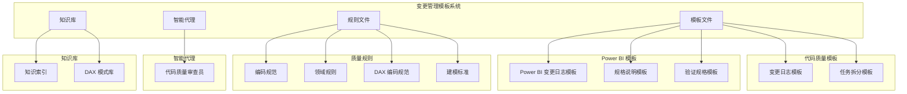
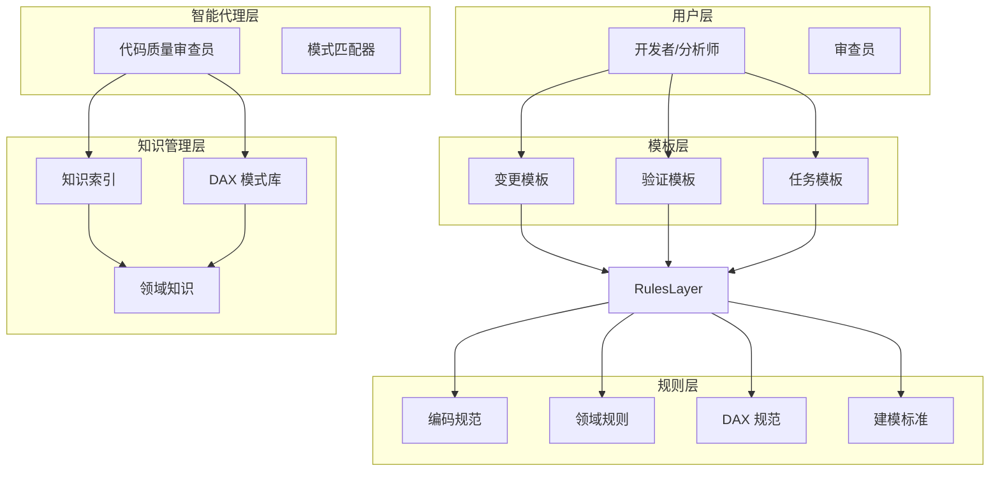
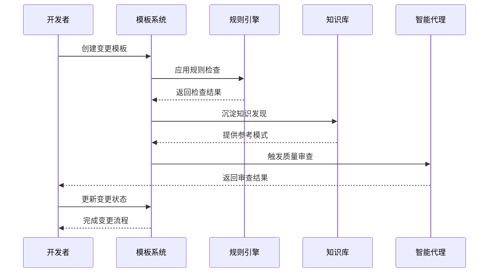
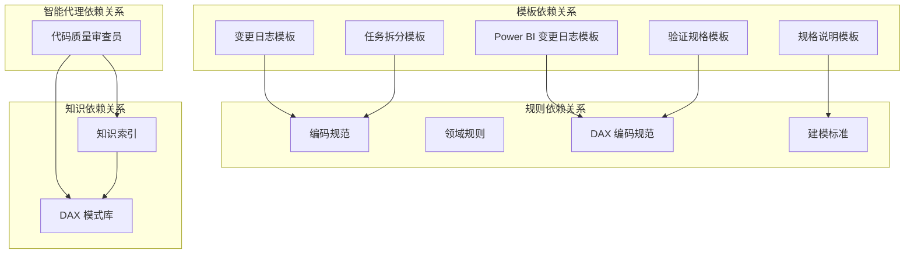

# 变更管理模板

<cite>
**本文档引用的文件**
- [code_copilot/changes/templates/log.md](file://code_copilot/changes/templates/log.md)
- [code_copilot/changes/templates/tasks.md](file://code_copilot/changes/templates/tasks.md)
- [powerbi_code_copilot/changes/templates/log.md](file://powerbi_code_copilot/changes/templates/log.md)
- [powerbi_code_copilot/changes/templates/spec.md](file://powerbi_code_copilot/changes/templates/spec.md)
- [powerbi_code_copilot/changes/templates/validation-spec.md](file://powerbi_code_copilot/changes/templates/validation-spec.md)
- [code_copilot/rules/coding-style.md](file://code_copilot/rules/coding-style.md)
- [code_copilot/rules/domain-rules.md](file://code_copilot/rules/domain-rules.md)
- [powerbi_code_copilot/rules/dax-style.md](file://powerbi_code_copilot/rules/dax-style.md)
- [powerbi_code_copilot/rules/modeling-standards.md](file://powerbi_code_copilot/rules/modeling-standards.md)
- [code_copilot/agents/code-quality-reviewer.md](file://code_copilot/agents/code-quality-reviewer.md)
- [code_copilot/knowledge/index.md](file://code_copilot/knowledge/index.md)
- [powerbi_code_copilot/knowledge/dax-patterns.md](file://powerbi_code_copilot/knowledge/dax-patterns.md)
</cite>

## 目录
1. [简介](#简介)
2. [项目结构](#项目结构)
3. [核心组件](#核心组件)
4. [架构概览](#架构概览)
5. [详细组件分析](#详细组件分析)
6. [依赖关系分析](#依赖关系分析)
7. [性能考量](#性能考量)
8. [故障排除指南](#故障排除指南)
9. [结论](#结论)

## 简介

变更管理模板系统是一个结构化的知识管理系统，旨在为软件开发和数据分析项目提供标准化的变更记录、任务管理和质量控制流程。该系统通过预定义的模板结构和严格的填写规范，确保团队能够有效地追踪变更历史、管理任务进度并维护代码质量。

系统主要服务于两个核心领域：
- **代码质量控制**：通过编码规范、领域规则和质量审查机制
- **Power BI 数据分析**：通过 DAX 编码规范、数据建模标准和验证策略

## 项目结构

变更管理模板系统采用模块化设计，按照功能领域进行组织：

**图表来源**
- [code_copilot/changes/templates/log.md:1-28](file://code_copilot/changes/templates/log.md#L1-L28)
- [powerbi_code_copilot/changes/templates/spec.md:1-95](file://powerbi_code_copilot/changes/templates/spec.md#L1-L95)
- [code_copilot/rules/coding-style.md:1-34](file://code_copilot/rules/coding-style.md#L1-L34)

**章节来源**
- [code_copilot/changes/templates/log.md:1-28](file://code_copilot/changes/templates/log.md#L1-L28)
- [code_copilot/changes/templates/tasks.md:1-33](file://code_copilot/changes/templates/tasks.md#L1-L33)
- [powerbi_code_copilot/changes/templates/log.md:1-46](file://powerbi_code_copilot/changes/templates/log.md#L1-L46)
- [powerbi_code_copilot/changes/templates/spec.md:1-95](file://powerbi_code_copilot/changes/templates/spec.md#L1-L95)

## 核心组件

### 变更日志模板

变更日志模板是系统的核心组件之一，用于记录项目变更过程中的关键信息。模板包含以下主要部分：

#### 时间线记录
- **时间**：变更发生的具体时间点
- **阶段**：变更所处的开发阶段
- **事件**：具体发生的变更事件
- **备注**：相关的补充说明

#### 技术决策记录
- **决策**：做出的技术决策内容
- **选择**：最终的选择方案
- **放弃的方案**：被放弃的替代方案
- **原因**：选择该方案的理由

#### 踩坑记录
- **问题**：遇到的技术问题
- **原因**：问题产生的根本原因
- **解决方案**：采取的解决措施
- **沉淀？**：是否将经验沉淀到知识库

#### 知识发现
- **关键词**：知识发现的核心关键词
- **描述**：知识发现的详细描述

**章节来源**
- [code_copilot/changes/templates/log.md:1-28](file://code_copilot/changes/templates/log.md#L1-L28)
- [powerbi_code_copilot/changes/templates/log.md:1-46](file://powerbi_code_copilot/changes/templates/log.md#L1-L46)

### 任务拆分模板

任务拆分模板用于将复杂的变更需求分解为可执行的原子任务。模板强调任务的独立性和可验证性。

#### 任务结构规范
- **前置条件**：任务执行的前提条件
- **任务目标**：明确的一句话描述
- **涉及文件**：具体的文件路径列表
- **关键签名**：精确的函数签名定义
- **依赖关系**：任务间的依赖关系
- **验收标准**：任务完成的评判标准
- **验证命令**：可选的验证命令

#### 任务执行流程
1. **数据模型**：先处理数据层面的变更
2. **接口协议**：再处理接口层面的变更  
3. **底层实现**：然后处理具体实现细节
4. **上层编排**：最后处理业务编排
5. **入口层**：最终处理用户入口

**章节来源**
- [code_copilot/changes/templates/tasks.md:1-33](file://code_copilot/changes/templates/tasks.md#L1-L33)

### Power BI 规格说明模板

Power BI 规格说明模板专门针对 Power BI 项目的变更管理，提供了更详细的功能描述和验证要求。

#### 规格说明结构
- **状态管理**：propose、apply、review、done 状态流转
- **复杂度评估**：简单、中等、复杂三个等级
- **变更类型**：新建报表、模型变更、度量值开发等五种类型

#### 核心内容模块
- **背景与目标**：变更的动机和预期效果
- **现状分析**：基于研究发现的现状描述
- **功能点**：具体的功能需求列表
- **业务规则**：可验证的业务规则
- **模型变更**：数据模型的具体变更
- **DAX 设计**：度量值的详细设计
- **可视化变更**：报表界面的变更
- **影响范围**：变更的影响评估
- **风险与关注点**：潜在风险的识别
- **验证策略**：验证方法和标准

**章节来源**
- [powerbi_code_copilot/changes/templates/spec.md:1-95](file://powerbi_code_copilot/changes/templates/spec.md#L1-L95)

### 验证规格模板

验证规格模板用于定义变更的验证标准和验证流程，确保变更的质量和正确性。

#### 验证原则
- **数据驱动**：基于实际数据结果的验证
- **对比验证**：与已知正确值进行对比
- **边界测试**：测试各种边界条件
- **展示证据**：提供实际的验证证据

#### 验证环境
- **数据源环境**：开发、测试、生产环境标识
- **数据量级**：验证的数据规模
- **数据时间范围**：验证的时间范围
- **基准值来源**：已知正确值的来源

#### 验证策略
- **P0 核心业务指标**：必须验证的关键指标
- **P1 辅助指标**：重要的辅助指标
- **P2 格式与展示**：界面展示的验证
- **模型结构验证**：数据模型的结构验证
- **性能验证**：性能指标的验证
- **安全验证**：安全性的验证

**章节来源**
- [powerbi_code_copilot/changes/templates/validation-spec.md:1-69](file://powerbi_code_copilot/changes/templates/validation-spec.md#L1-L69)

## 架构概览

变更管理模板系统采用分层架构设计，确保各组件之间的松耦合和高内聚：

**图表来源**
- [code_copilot/agents/code-quality-reviewer.md:1-13](file://code_copilot/agents/code-quality-reviewer.md#L1-L13)
- [powerbi_code_copilot/rules/dax-style.md:1-218](file://powerbi_code_copilot/rules/dax-style.md#L1-L218)

### 数据流架构

**图表来源**
- [code_copilot/changes/templates/tasks.md:1-33](file://code_copilot/changes/templates/tasks.md#L1-L33)
- [code_copilot/agents/code-quality-reviewer.md:1-13](file://code_copilot/agents/code-quality-reviewer.md#L1-L13)

## 详细组件分析

### 编码规范组件

编码规范组件为代码质量控制提供了统一的标准和指导原则。

#### 命名规范
系统制定了详细的命名约定，涵盖类名、方法名、常量等不同类型的命名要求：

- **类名**：采用大驼峰命名法，见名知意
- **方法名**：采用小驼峰命名法，动词开头
- **常量**：采用全大写下划线分隔
- **抽象类**：以 Abstract 或 Base 开头
- **测试类**：以被测类名开头，Test 结尾

#### 异常处理规范
- **业务异常**：使用自定义 BizException，携带错误码
- **系统异常**：向上抛出，由统一异常处理器兜底
- **异常记录**：禁止吞掉异常，必须记录日志

#### 日志规范
- **Controller 入口**：打 INFO 日志，包含请求关键参数
- **异常处理**：打 ERROR 日志，包含完整堆栈
- **敏感信息**：禁止在日志中打印用户敏感信息

**章节来源**
- [code_copilot/rules/coding-style.md:1-34](file://code_copilot/rules/coding-style.md#L1-L34)

### DAX 编码规范组件

DAX 编码规范组件专门为 Power BI 数据分析提供了专业的编码指导。

#### 命名约定
系统制定了详细的 DAX 对象命名规范：

**度量值命名前缀体系**：
- **无前缀**：基础聚合度量值（如 Total Sales）
- **KPI_**：关键绩效指标（如 KPI_SalesGrowth）
- **CAL_**：复杂计算指标（如 CAL_SalesPerCustomer）
- **RATIO_**：比率指标（如 RATIO_ConversionRate）
- **YTD_**：本年至今（如 YTD_Sales）
- **MTD_**：本月至今（如 MTD_Sales）
- **PY_**：去年同期（如 PY_Sales）
- **% 结尾**：百分比/比率（如 Profit Margin %）
- **Rank 结尾**：排名（如 Sales Rank）
- **_ 前缀**：辅助/内部度量值（如 _Base Revenue）

**表命名规范**：
基于 Kimball 维度建模方法论，采用前缀标识表类型：
- **Dim_**：维度表（如 Dim_Customer）
- **Fact_**：事实表（如 Fact_Sales）
- **Bridge_**：桥接表（如 Bridge_SalesTerritory）
- **Param_**：参数表（如 Param_TimeFrame）
- **CT_**：计算表（如 CT_DateRange）
- **_**：隐藏辅助表（如 _Measures）

#### DAX 编写原则
系统制定了五个核心编写原则：

**性能优先**：
- 优先使用 VAR 避免重复计算
- 避免嵌套 CALCULATE（超过 2 层需重构）
- 优先使用 REMOVEFILTERS 替代 FILTER(ALL(...))

**上下文清晰**：
- 明确区分行上下文和筛选器上下文
- CALCULATE 的每个筛选参数必须有明确意图
- 避免不必要的上下文转换

**可维护性**：
- 复杂计算分解为多个度量值
- 使用 Display Folder 组织度量值
- 每个度量值单一职责

**章节来源**
- [powerbi_code_copilot/rules/dax-style.md:1-218](file://powerbi_code_copilot/rules/dax-style.md#L1-L218)

### 数据建模规范组件

数据建模规范组件为 Power BI 数据建模提供了专业的指导原则。

#### 模型架构
**星型模型优先**：
- 所有模型必须基于星型模型设计
- 事实表存放可度量的业务事件
- 维度表存放描述性属性
- 仅在确有必要时使用雪花型模型

**表类型标识**：
- Fact_xxx：事实表（如 Fact_Sales）
- Dim_xxx：维度表（如 Dim_Date）
- Bridge_xxx：桥接表（如 Bridge_CustomerProduct）
- CT_xxx：计算表（如 CT_DateRange）
- _xxx：辅助/隐藏表（如 _Measures）

#### 关系设计
**基本原则**：
- 所有关系必须是 1:N（一对多）
- 从维度表指向事实表
- 筛选方向默认单向
- 双向筛选必须有明确业务理由

**日期表要求**：
- 必须有独立的日期维度表
- 日期表必须包含完整连续的日期范围
- 必须标记为日期表
- 包含标准层级：Year → Quarter → Month → Week → Day

#### 表设计规范
**事实表**：
- 只保留外键和度量值列
- 描述性属性放维度表
- 大型事实表考虑增量刷新

**维度表**：
- 包含代理键和业务键
- 包含所有描述性属性
- 小型维度表使用 Dual 存储模式

**列优化**：
- 移除所有未使用的列
- 文本列检查是否可用整数编码替代
- 避免高基数文本列
- 日期列统一为 Date 类型
- 数值列选择最小精度

**章节来源**
- [powerbi_code_copilot/rules/modeling-standards.md:1-88](file://powerbi_code_copilot/rules/modeling-standards.md#L1-L88)

### 代码质量审查员组件

代码质量审查员智能代理负责自动化代码质量审查，确保代码符合既定标准。

#### 审查分级
系统制定了三级审查标准：

**Critical（阻塞）**：
- 安全漏洞
- 资金逻辑错误
- 并发安全问题
- 数据丢失风险

**Important（应修复）**：
- 异常被吞
- 缺少参数校验
- 魔法值
- 方法过长
- 命名不清

**Minor（建议）**：
- Javadoc 缺失
- 注释过时
- import 未清理

#### 工具权限
审查员仅需只读权限：
- Read 权限：读取代码文件
- Grep 权限：搜索代码模式
- Glob 权限：匹配文件模式
- Bash 权限：执行基本命令

**章节来源**
- [code_copilot/agents/code-quality-reviewer.md:1-13](file://code_copilot/agents/code-quality-reviewer.md#L1-L13)

## 依赖关系分析

变更管理模板系统具有清晰的依赖层次结构，确保各组件之间的协调工作：

**图表来源**
- [code_copilot/rules/coding-style.md:1-34](file://code_copilot/rules/coding-style.md#L1-L34)
- [powerbi_code_copilot/rules/dax-style.md:1-218](file://powerbi_code_copilot/rules/dax-style.md#L1-L218)

### 组件耦合度分析

系统采用低耦合设计，各组件之间的依赖关系清晰明确：

**模板与规则的松耦合**：
- 模板文件独立存在，不直接依赖具体实现
- 规则文件提供约束和指导，不影响模板结构
- 通过配置文件实现规则的动态加载

**智能代理的独立性**：
- 智能代理独立运行，不依赖具体模板
- 通过规则引擎获取质量标准
- 通过知识库获取最佳实践

**知识库的可扩展性**：
- 知识库独立维护，支持动态更新
- 支持多种格式的知识存储
- 提供统一的知识检索接口

**章节来源**
- [code_copilot/knowledge/index.md:1-17](file://code_copilot/knowledge/index.md#L1-L17)
- [powerbi_code_copilot/knowledge/dax-patterns.md:1-205](file://powerbi_code_copilot/knowledge/dax-patterns.md#L1-L205)

## 性能考量

变更管理模板系统在设计时充分考虑了性能优化，确保在大规模项目中的高效运行。

### 模板渲染性能
- **静态模板**：模板文件为纯文本格式，渲染开销极小
- **批量处理**：支持批量模板生成和处理
- **缓存机制**：频繁使用的模板和规则可以缓存

### 规则检查性能
- **增量检查**：只对变更的部分进行规则检查
- **并行处理**：支持多规则并行检查
- **早期失败**：发现严重违规立即停止检查

### 知识检索性能
- **索引优化**：知识库采用倒排索引提高检索速度
- **模糊匹配**：支持关键词模糊匹配
- **结果排序**：基于相关性对检索结果排序

### 内存使用优化
- **流式处理**：大文件采用流式处理减少内存占用
- **延迟加载**：不常用的组件采用延迟加载
- **垃圾回收**：合理管理内存使用，及时释放资源

## 故障排除指南

### 常见问题及解决方案

#### 模板生成失败
**问题症状**：模板生成过程中出现错误
**可能原因**：
- 模板文件格式不正确
- 缺少必需的字段
- 规则检查失败

**解决步骤**：
1. 检查模板文件的语法格式
2. 确认所有必需字段都已填写
3. 查看规则检查的错误信息
4. 参考相应的模板示例

#### 规则检查异常
**问题症状**：规则检查过程中出现异常
**可能原因**：
- 规则文件格式错误
- 规则表达式语法错误
- 规则依赖缺失

**解决步骤**：
1. 检查规则文件的 YAML 格式
2. 验证规则表达式的语法
3. 确认规则依赖的完整性
4. 查看规则引擎的日志输出

#### 知识检索失败
**问题症状**：知识检索功能无法正常工作
**可能原因**：
- 知识库索引损坏
- 搜索关键词格式错误
- 知识库权限问题

**解决步骤**：
1. 重建知识库索引
2. 检查搜索关键词的格式
3. 验证知识库访问权限
4. 查看知识库服务状态

### 调试工具和技巧

#### 日志分析
系统提供了详细的日志记录功能，便于问题诊断：
- **模板处理日志**：记录模板生成的详细过程
- **规则检查日志**：显示规则检查的执行结果
- **知识检索日志**：记录知识库的访问情况

#### 性能监控
- **执行时间统计**：监控各组件的执行时间
- **内存使用监控**：跟踪内存使用情况
- **错误率统计**：统计各类错误的发生频率

#### 调试模式
系统支持调试模式，提供更详细的执行信息：
- **详细日志输出**：显示完整的执行过程
- **中间结果保存**：保存中间处理结果
- **错误回溯**：提供完整的错误堆栈信息

**章节来源**
- [code_copilot/changes/templates/log.md:1-28](file://code_copilot/changes/templates/log.md#L1-L28)
- [powerbi_code_copilot/changes/templates/spec.md:1-95](file://powerbi_code_copilot/changes/templates/spec.md#L1-L95)

## 结论

变更管理模板系统通过标准化的模板结构、严格的规则约束和智能化的审查机制，为软件开发和数据分析项目提供了全面的变更管理解决方案。

### 系统优势

**标准化程度高**：
- 统一的模板格式确保信息的一致性
- 明确的填写规范减少歧义
- 标准化的流程提高效率

**可扩展性强**：
- 模块化设计支持功能扩展
- 规则引擎支持自定义规则
- 知识库支持持续改进

**自动化程度高**：
- 智能代理自动进行质量审查
- 规则引擎自动进行合规检查
- 知识库自动沉淀最佳实践

### 应用价值

**提升代码质量**：
- 通过编码规范确保代码一致性
- 通过质量审查发现潜在问题
- 通过知识沉淀积累经验

**优化变更流程**：
- 通过模板化管理变更过程
- 通过任务拆分提高执行效率
- 通过验证机制确保变更质量

**促进知识传承**：
- 通过知识库沉淀经验
- 通过模式库提供参考
- 通过最佳实践指导开发

### 发展前景

随着项目的不断发展，变更管理模板系统将继续演进：
- **智能化增强**：引入机器学习算法优化规则匹配
- **协作功能**：增加团队协作和评审功能
- **集成能力**：与其他开发工具深度集成
- **可视化改进**：提供更直观的界面和报告

通过持续的优化和完善，变更管理模板系统将成为项目管理的重要基础设施，为团队的长期发展提供有力支撑。