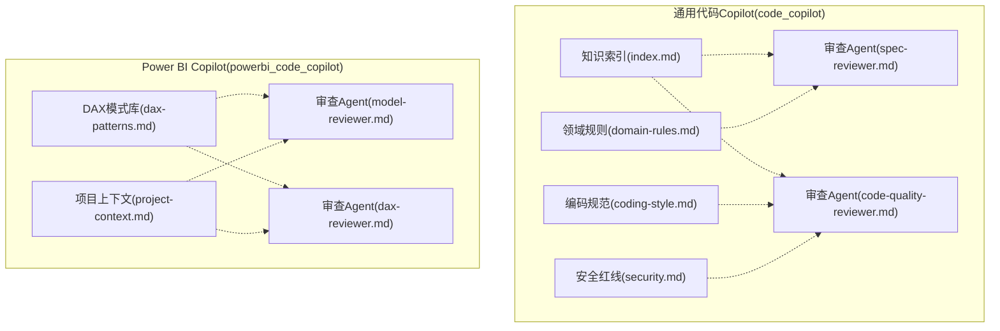
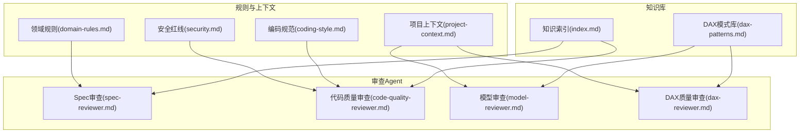
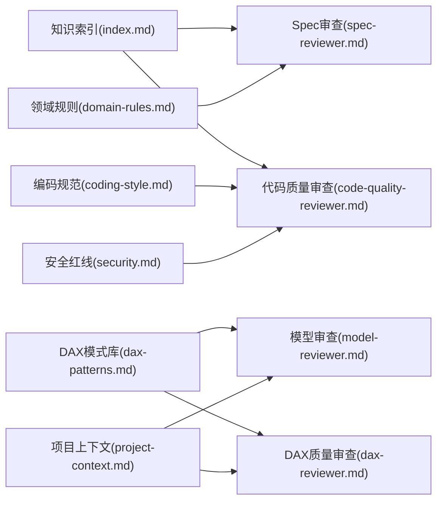

# 知识库系统

<cite>
**本文档引用的文件**
- [code_copilot/knowledge/index.md](file://code_copilot/knowledge/index.md)
- [powerbi_code_copilot/knowledge/dax-patterns.md](file://powerbi_code_copilot/knowledge/dax-patterns.md)
- [code_copilot/agents/spec-reviewer.md](file://code_copilot/agents/spec-reviewer.md)
- [code_copilot/agents/code-quality-reviewer.md](file://code_copilot/agents/code-quality-reviewer.md)
- [powerbi_code_copilot/agents/model-reviewer.md](file://powerbi_code_copilot/agents/model-reviewer.md)
- [powerbi_code_copilot/agents/dax-reviewer.md](file://powerbi_code_copilot/agents/dax-reviewer.md)
- [code_copilot/rules/coding-style.md](file://code_copilot/rules/coding-style.md)
- [code_copilot/rules/domain-rules.md](file://code_copilot/rules/domain-rules.md)
- [code_copilot/rules/security.md](file://code_copilot/rules/security.md)
- [powerbi_code_copilot/rules/project-context.md](file://powerbi_code_copilot/rules/project-context.md)
</cite>

## 目录
1. [简介](#简介)
2. [项目结构](#项目结构)
3. [核心组件](#核心组件)
4. [架构总览](#架构总览)
5. [详细组件分析](#详细组件分析)
6. [依赖分析](#依赖分析)
7. [性能考量](#性能考量)
8. [故障排查指南](#故障排查指南)
9. [结论](#结论)
10. [附录](#附录)

## 简介
本知识库系统围绕“代码Copilot”与“Power BI Copilot”两条主线，构建了面向代码质量与DAX建模质量的知识索引与规则体系。系统通过“知识索引”“模式库”“审查Agent”“规则与上下文”四大模块协同工作，支撑代码审查与模型审查的智能化与标准化，帮助团队沉淀最佳实践、加速问题定位与修复。

## 项目结构
仓库采用按主题与技术栈分层的目录组织：
- code_copilot：通用代码Copilot知识与规则，包含知识索引、审查Agent、编码规范、领域规则、安全红线等。
- powerbi_code_copilot：Power BI专用Copilot知识与规则，包含DAX模式库、审查Agent、建模规范、项目上下文等。
- Quickbi_sql 与 RL E2E：作为外部样例与实践素材，用于SQL优化与仪表板矩阵方案沉淀，便于迁移至知识库。

图表来源
- [code_copilot/knowledge/index.md:1-17](file://code_copilot/knowledge/index.md#L1-L17)
- [powerbi_code_copilot/knowledge/dax-patterns.md:1-205](file://powerbi_code_copilot/knowledge/dax-patterns.md#L1-L205)
- [code_copilot/agents/spec-reviewer.md:1-25](file://code_copilot/agents/spec-reviewer.md#L1-L25)
- [code_copilot/agents/code-quality-reviewer.md:1-13](file://code_copilot/agents/code-quality-reviewer.md#L1-L13)
- [powerbi_code_copilot/agents/model-reviewer.md:1-36](file://powerbi_code_copilot/agents/model-reviewer.md#L1-L36)
- [powerbi_code_copilot/agents/dax-reviewer.md:1-56](file://powerbi_code_copilot/agents/dax-reviewer.md#L1-L56)
- [code_copilot/rules/coding-style.md:1-34](file://code_copilot/rules/coding-style.md#L1-L34)
- [code_copilot/rules/domain-rules.md:1-18](file://code_copilot/rules/domain-rules.md#L1-L18)
- [code_copilot/rules/security.md:1-18](file://code_copilot/rules/security.md#L1-L18)
- [powerbi_code_copilot/rules/project-context.md:1-69](file://powerbi_code_copilot/rules/project-context.md#L1-L69)

章节来源
- [code_copilot/knowledge/index.md:1-17](file://code_copilot/knowledge/index.md#L1-L17)
- [powerbi_code_copilot/knowledge/dax-patterns.md:1-205](file://powerbi_code_copilot/knowledge/dax-patterns.md#L1-L205)
- [code_copilot/agents/spec-reviewer.md:1-25](file://code_copilot/agents/spec-reviewer.md#L1-L25)
- [code_copilot/agents/code-quality-reviewer.md:1-13](file://code_copilot/agents/code-quality-reviewer.md#L1-L13)
- [powerbi_code_copilot/agents/model-reviewer.md:1-36](file://powerbi_code_copilot/agents/model-reviewer.md#L1-L36)
- [powerbi_code_copilot/agents/dax-reviewer.md:1-56](file://powerbi_code_copilot/agents/dax-reviewer.md#L1-L56)
- [code_copilot/rules/coding-style.md:1-34](file://code_copilot/rules/coding-style.md#L1-L34)
- [code_copilot/rules/domain-rules.md:1-18](file://code_copilot/rules/domain-rules.md#L1-L18)
- [code_copilot/rules/security.md:1-18](file://code_copilot/rules/security.md#L1-L18)
- [powerbi_code_copilot/rules/project-context.md:1-69](file://powerbi_code_copilot/rules/project-context.md#L1-L69)

## 核心组件
- 知识索引：提供领域知识的轻量索引，聚焦“一句话讲清核心逻辑”，便于快速检索与触发后续审查动作。
- DAX模式库：提供经验证的高质量DAX模式，覆盖常用场景、代码、解释与性能说明，支持直接复用与二次开发。
- 审查Agent：面向不同审查目标的自动化脚本，包含规范符合性审查、代码质量审查、模型结构审查、DAX质量审查等，强调只读与独立验证。
- 规则与上下文：涵盖编码规范、领域规则、安全红线以及Power BI项目上下文，为审查提供标准与背景信息。

章节来源
- [code_copilot/knowledge/index.md:1-17](file://code_copilot/knowledge/index.md#L1-L17)
- [powerbi_code_copilot/knowledge/dax-patterns.md:1-205](file://powerbi_code_copilot/knowledge/dax-patterns.md#L1-L205)
- [code_copilot/agents/spec-reviewer.md:1-25](file://code_copilot/agents/spec-reviewer.md#L1-L25)
- [code_copilot/agents/code-quality-reviewer.md:1-13](file://code_copilot/agents/code-quality-reviewer.md#L1-L13)
- [powerbi_code_copilot/agents/model-reviewer.md:1-36](file://powerbi_code_copilot/agents/model-reviewer.md#L1-L36)
- [powerbi_code_copilot/agents/dax-reviewer.md:1-56](file://powerbi_code_copilot/agents/dax-reviewer.md#L1-L56)
- [code_copilot/rules/coding-style.md:1-34](file://code_copilot/rules/coding-style.md#L1-L34)
- [code_copilot/rules/domain-rules.md:1-18](file://code_copilot/rules/domain-rules.md#L1-L18)
- [code_copilot/rules/security.md:1-18](file://code_copilot/rules/security.md#L1-L18)
- [powerbi_code_copilot/rules/project-context.md:1-69](file://powerbi_code_copilot/rules/project-context.md#L1-L69)

## 架构总览
系统采用“知识库 + 审查Agent + 规则上下文”的协同架构：
- 知识库模块负责沉淀与检索模式与经验；
- 审查Agent基于规则与上下文进行只读验证；
- 规则与上下文为Agent提供标准与背景，确保审查一致性与可追溯性。

图表来源
- [code_copilot/knowledge/index.md:1-17](file://code_copilot/knowledge/index.md#L1-L17)
- [powerbi_code_copilot/knowledge/dax-patterns.md:1-205](file://powerbi_code_copilot/knowledge/dax-patterns.md#L1-L205)
- [code_copilot/agents/spec-reviewer.md:1-25](file://code_copilot/agents/spec-reviewer.md#L1-L25)
- [code_copilot/agents/code-quality-reviewer.md:1-13](file://code_copilot/agents/code-quality-reviewer.md#L1-L13)
- [powerbi_code_copilot/agents/model-reviewer.md:1-36](file://powerbi_code_copilot/agents/model-reviewer.md#L1-L36)
- [powerbi_code_copilot/agents/dax-reviewer.md:1-56](file://powerbi_code_copilot/agents/dax-reviewer.md#L1-L56)
- [code_copilot/rules/coding-style.md:1-34](file://code_copilot/rules/coding-style.md#L1-L34)
- [code_copilot/rules/domain-rules.md:1-18](file://code_copilot/rules/domain-rules.md#L1-L18)
- [code_copilot/rules/security.md:1-18](file://code_copilot/rules/security.md#L1-L18)
- [powerbi_code_copilot/rules/project-context.md:1-69](file://powerbi_code_copilot/rules/project-context.md#L1-L69)

## 详细组件分析

### 知识索引(index.md)
- 目标：提供领域知识的轻量索引，聚焦“一句话讲清核心逻辑”，便于快速检索与触发后续审查动作。
- 组织：按“业务知识/技术约定/踩坑记录”分类，留白供持续补充。
- 使用建议：每次实践后补充一条索引，形成“触发关键词 + 核心逻辑”的检索入口；必要时附加“包名.类名.方法名”以便回溯。

章节来源
- [code_copilot/knowledge/index.md:1-17](file://code_copilot/knowledge/index.md#L1-L17)

### DAX模式库(dax-patterns.md)
- 目标：沉淀高质量DAX模式，支持直接复用与二次开发。
- 内容：覆盖累计求和、同比/环比、动态TopN、ABC分析、移动平均、半加性度量值等典型场景。
- 结构：每个模式包含“场景、代码、解释、性能说明”，并以分隔线分段，便于阅读与检索。
- 使用建议：在建模或优化时优先参考对应模式，结合性能说明评估适用性；复杂度量值建议拆分与注释化。

章节来源
- [powerbi_code_copilot/knowledge/dax-patterns.md:1-205](file://powerbi_code_copilot/knowledge/dax-patterns.md#L1-L205)

### 审查Agent：Spec审查(spec-reviewer.md)
- 目标：验证实现是否符合规格说明书，坚持“只信代码”的独立验证原则。
- 维度：缺失实现、多余实现、理解偏差、业务规则落地、数据变更准确性。
- 输出：逐条验证与结论，强调可追溯的引用路径。
- 权限：只读，无需写入。

章节来源
- [code_copilot/agents/spec-reviewer.md:1-25](file://code_copilot/agents/spec-reviewer.md#L1-L25)

### 审查Agent：代码质量审查(code-quality-reviewer.md)
- 目标：审查代码质量、安全性与可维护性。
- 分级：Critical（阻塞）、Important（应修复）、Minor（建议）。
- 权限：只读。

章节来源
- [code_copilot/agents/code-quality-reviewer.md:1-13](file://code_copilot/agents/code-quality-reviewer.md#L1-L13)

### 审查Agent：模型审查(model-reviewer.md)
- 目标：验证Power BI数据模型是否符合规格与建模最佳实践。
- 维度：缺失/多余实现、理解偏差、业务规则落地、模型结构合规（星型/雪花模型、关系方向、双向筛选、循环依赖）、数据变更准确性。
- 输出：模型结构验证、度量值逐条验证与结论。
- 权限：只读。

章节来源
- [powerbi_code_copilot/agents/model-reviewer.md:1-36](file://powerbi_code_copilot/agents/model-reviewer.md#L1-L36)

### 审查Agent：DAX质量审查(dax-reviewer.md)
- 目标：审查DAX代码质量、性能与可维护性。
- 分级：Critical（阻塞）、Important（应修复）、Minor（建议）。
- 性能清单：上下文转换、筛选参数、迭代函数粒度、变量复用、时间智能函数、预计算列等。
- 输出：问题分类、性能评估与优化建议摘要。
- 权限：只读。

章节来源
- [powerbi_code_copilot/agents/dax-reviewer.md:1-56](file://powerbi_code_copilot/agents/dax-reviewer.md#L1-L56)

### 规则与上下文：编码规范(coding-style.md)
- 覆盖命名、异常处理、日志规范与其他最佳实践。
- 作用：为代码质量审查提供统一标准。

章节来源
- [code_copilot/rules/coding-style.md:1-34](file://code_copilot/rules/coding-style.md#L1-L34)

### 规则与上下文：领域规则(domain-rules.md)
- 提供通用与项目特定的业务约束，指导金额、时间、接口、状态机等关键领域的实现。
- 作用：为Spec审查提供业务规则依据。

章节来源
- [code_copilot/rules/domain-rules.md:1-18](file://code_copilot/rules/domain-rules.md#L1-L18)

### 规则与上下文：安全红线(security.md)
- 明确禁止行为与警示事项，涵盖代码安全与业务安全。
- 作用：为代码质量审查提供安全基线。

章节来源
- [code_copilot/rules/security.md:1-18](file://code_copilot/rules/security.md#L1-L18)

### 规则与上下文：项目上下文(project-context.md)
- 提供Power BI项目的概况、数据源、模型结构、度量值分组、报表页面、安全配置与关键依赖。
- 作用：为模型审查与DAX质量审查提供背景信息与结构化输入。

章节来源
- [powerbi_code_copilot/rules/project-context.md:1-69](file://powerbi_code_copilot/rules/project-context.md#L1-L69)

## 依赖分析
- 知识索引与审查Agent之间存在弱耦合依赖：索引作为触发与检索入口，Agent在只读前提下独立验证。
- DAX模式库与模型审查、DAX质量审查强关联：前者提供可复用模板，后者基于模板进行质量与性能评估。
- 规则与上下文为Agent提供标准与背景，确保审查的一致性与可追溯性。

图表来源
- [code_copilot/knowledge/index.md:1-17](file://code_copilot/knowledge/index.md#L1-L17)
- [powerbi_code_copilot/knowledge/dax-patterns.md:1-205](file://powerbi_code_copilot/knowledge/dax-patterns.md#L1-L205)
- [code_copilot/agents/spec-reviewer.md:1-25](file://code_copilot/agents/spec-reviewer.md#L1-L25)
- [code_copilot/agents/code-quality-reviewer.md:1-13](file://code_copilot/agents/code-quality-reviewer.md#L1-L13)
- [powerbi_code_copilot/agents/model-reviewer.md:1-36](file://powerbi_code_copilot/agents/model-reviewer.md#L1-L36)
- [powerbi_code_copilot/agents/dax-reviewer.md:1-56](file://powerbi_code_copilot/agents/dax-reviewer.md#L1-L56)
- [code_copilot/rules/coding-style.md:1-34](file://code_copilot/rules/coding-style.md#L1-L34)
- [code_copilot/rules/domain-rules.md:1-18](file://code_copilot/rules/domain-rules.md#L1-L18)
- [code_copilot/rules/security.md:1-18](file://code_copilot/rules/security.md#L1-L18)
- [powerbi_code_copilot/rules/project-context.md:1-69](file://powerbi_code_copilot/rules/project-context.md#L1-L69)

## 性能考量
- DAX模式库中的性能说明为审查提供量化参考，建议优先采用性能良好的模式（如累计求和、移动平均、半加性度量值），并在复杂场景中评估迭代函数与筛选范围。
- 审查Agent的性能清单可作为日常优化抓手：减少不必要的上下文转换、优化筛选参数、在最小粒度表上运行迭代函数、利用变量避免重复计算、正确使用时间智能函数、评估预计算列的收益。

章节来源
- [powerbi_code_copilot/knowledge/dax-patterns.md:27-205](file://powerbi_code_copilot/knowledge/dax-patterns.md#L27-L205)
- [powerbi_code_copilot/agents/dax-reviewer.md:27-35](file://powerbi_code_copilot/agents/dax-reviewer.md#L27-L35)

## 故障排查指南
- 审查结论不一致：优先核对Agent输出中的引用路径与结论，确认是否遗漏关键上下文或规则。
- DAX性能问题：对照性能清单逐项检查，优先处理上下文转换与筛选范围过大问题。
- 规范与安全问题：依据编码规范与安全红线逐条自查，重点关注异常处理、日志与敏感信息。
- 项目上下文缺失：在首次使用Power BI审查时执行初始化，填充项目概况、数据源、模型结构与安全配置。

章节来源
- [code_copilot/agents/spec-reviewer.md:14-21](file://code_copilot/agents/spec-reviewer.md#L14-L21)
- [powerbi_code_copilot/agents/dax-reviewer.md:36-52](file://powerbi_code_copilot/agents/dax-reviewer.md#L36-L52)
- [code_copilot/rules/coding-style.md:16-27](file://code_copilot/rules/coding-style.md#L16-L27)
- [code_copilot/rules/security.md:7-17](file://code_copilot/rules/security.md#L7-L17)
- [powerbi_code_copilot/rules/project-context.md:7](file://powerbi_code_copilot/rules/project-context.md#L7)

## 结论
该知识库系统通过“知识索引+模式库+审查Agent+规则上下文”的协同，实现了代码与模型审查的标准化与智能化。建议在团队内推广“先索引、再模式、后审查”的工作流，持续补充知识与规则，以提升审查效率与质量。

## 附录

### 使用方法与搜索技巧
- 使用知识索引快速定位核心逻辑，配合“触发关键词 + 核心逻辑”进行检索。
- 在Power BI建模与DAX优化时，优先参考DAX模式库中的成熟模式，并结合性能说明评估适用性。
- 审查输出中包含可追溯的引用路径，便于回溯与复核。

章节来源
- [code_copilot/knowledge/index.md:3-8](file://code_copilot/knowledge/index.md#L3-L8)
- [powerbi_code_copilot/knowledge/dax-patterns.md:3](file://powerbi_code_copilot/knowledge/dax-patterns.md#L3)

### 常见问题与解决方案
- Q：如何保证审查结论的独立性？
  A：审查Agent坚持“只信代码”的原则，独立于实现者上下文进行验证。
- Q：如何处理复杂的DAX度量值？
  A：优先拆分与注释化，评估是否可预计算为计算列，并对照性能清单逐项优化。
- Q：如何快速定位业务规则落地问题？
  A：结合领域规则与Spec审查Agent，逐条验证业务规则与实现的一致性。

章节来源
- [code_copilot/agents/spec-reviewer.md:4](file://code_copilot/agents/spec-reviewer.md#L4)
- [powerbi_code_copilot/agents/dax-reviewer.md:27-35](file://powerbi_code_copilot/agents/dax-reviewer.md#L27-L35)
- [code_copilot/rules/domain-rules.md:8-12](file://code_copilot/rules/domain-rules.md#L8-L12)