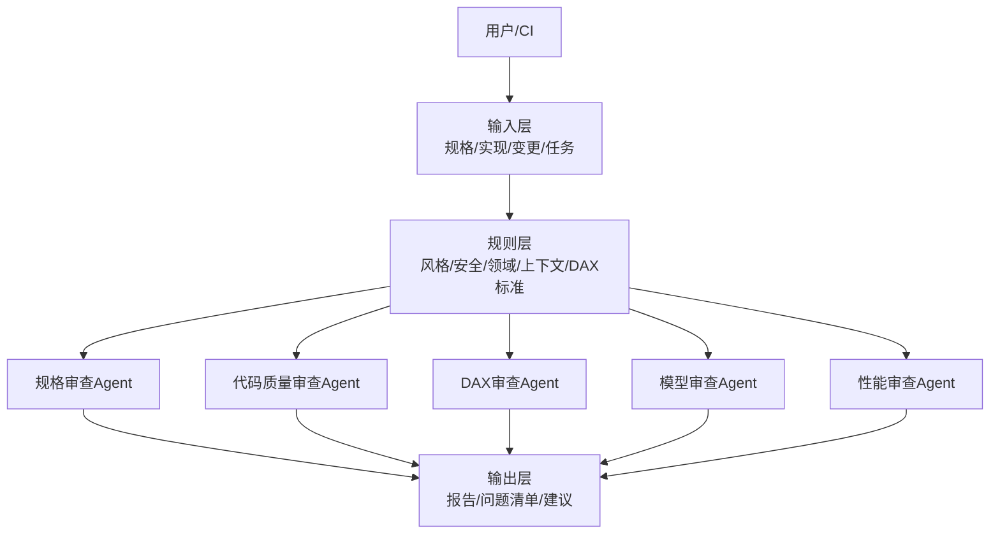
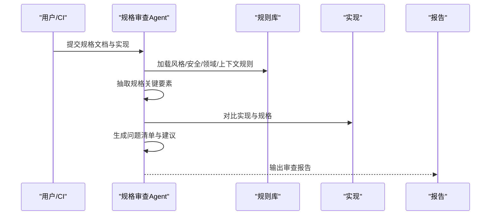
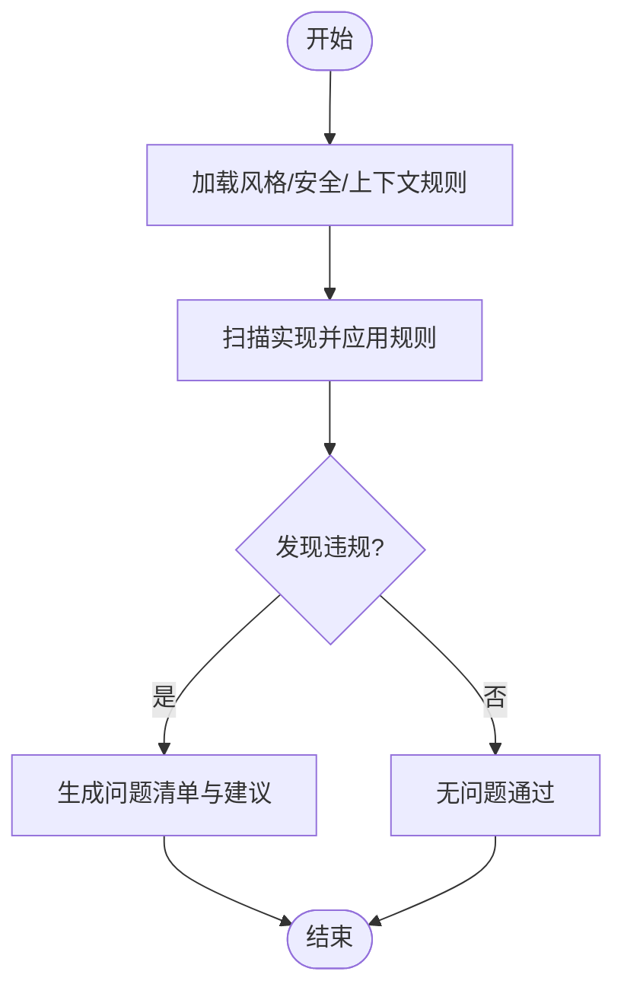
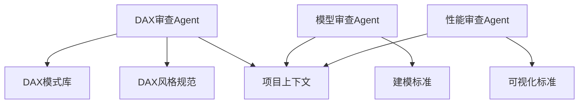
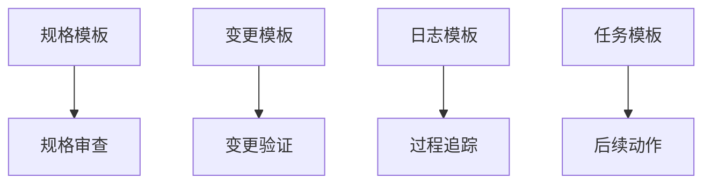
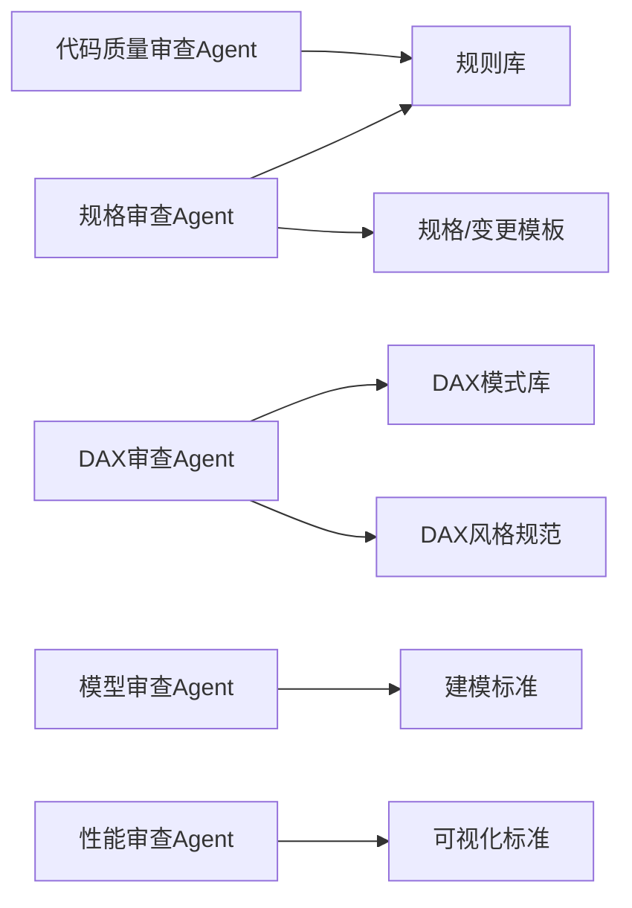

# 规格审查器

<cite>
**本文引用的文件**
- [spec-reviewer.md](file://code_copilot/agents/spec-reviewer.md)
- [code-quality-reviewer.md](file://code_copilot/agents/code-quality-reviewer.md)
- [coding-style.md](file://code_copilot/rules/coding-style.md)
- [domain-rules.md](file://code_copilot/rules/domain-rules.md)
- [project-context.md](file://code_copilot/rules/project-context.md)
- [security.md](file://code_copilot/rules/security.md)
- [validation-spec.md](file://powerbi_code_copilot/changes/templates/validation-spec.md)
- [spec.md](file://powerbi_code_copilot/changes/templates/spec.md)
- [log.md](file://powerbi_code_copilot/changes/templates/log.md)
- [tasks.md](file://powerbi_code_copilot/changes/templates/tasks.md)
- [dax-reviewer.md](file://powerbi_code_copilot/agents/dax-reviewer.md)
- [model-reviewer.md](file://powerbi_code_copilot/agents/model-reviewer.md)
- [performance-reviewer.md](file://powerbi_code_copilot/agents/performance-reviewer.md)
- [dax-patterns.md](file://powerbi_code_copilot/knowledge/dax-patterns.md)
- [dax-style.md](file://powerbi_code_copilot/rules/dax-style.md)
- [modeling-standards.md](file://powerbi_code_copilot/rules/modeling-standards.md)
- [visualization-standards.md](file://powerbi_code_copilot/rules/visualization-standards.md)
- [project-context.md](file://powerbi_code_copilot/rules/project-context.md)
</cite>

## 目录
1. [简介](#简介)
2. [项目结构](#项目结构)
3. [核心组件](#核心组件)
4. [架构总览](#架构总览)
5. [详细组件分析](#详细组件分析)
6. [依赖关系分析](#依赖关系分析)
7. [性能考量](#性能考量)
8. [故障排查指南](#故障排查指南)
9. [结论](#结论)
10. [附录](#附录)

## 简介
本文件面向“规格审查器”的使用者与维护者，系统化阐述其功能边界、工作机制与最佳实践。规格审查器的核心目标是：
- 验证规格文档的完整性与一致性
- 对比实现与规格，识别偏差
- 检查业务规则在实现中的落地情况
- 生成可追踪的问题清单与改进建议

通过模板化的规格与变更记录，结合领域规则与风格规范，规格审查器能够自动化地完成“从规格到实现”的一致性检查，并输出结构化的审查报告。

## 项目结构
仓库中与规格审查直接相关的内容主要分布在以下位置：
- 通用代码审查Agent与规则：code_copilot/agents 与 code_copilot/rules
- Power BI 专用审查Agent与规则：powerbi_code_copilot/agents、rules、changes/templates、knowledge
- 示例规格与变更模板：powerbi_code_copilot/changes/templates 下的 spec.md、validation-spec.md、log.md、tasks.md

```mermaid
graph TB
subgraph "通用代码审查"
A1["agents/spec-reviewer.md"]
A2["agents/code-quality-reviewer.md"]
R1["rules/coding-style.md"]
R2["rules/domain-rules.md"]
R3["rules/project-context.md"]
R4["rules/security.md"]
end
subgraph "Power BI 审查"
B1["powerbi_code_copilot/agents/dax-reviewer.md"]
B2["powerbi_code_copilot/agents/model-reviewer.md"]
B3["powerbi_code_copilot/agents/performance-reviewer.md"]
C1["changes/templates/spec.md"]
C2["changes/templates/validation-spec.md"]
C3["changes/templates/log.md"]
C4["changes/templates/tasks.md"]
K1["knowledge/dax-patterns.md"]
S1["rules/dax-style.md"]
S2["rules/modeling-standards.md"]
S3["rules/visualization-standards.md"]
S4["rules/project-context.md"]
end
A1 --> R1
A1 --> R2
A1 --> R3
A1 --> R4
B1 --> K1
B1 --> S1
B2 --> S2
B3 --> S3
B1 --> S4
B2 --> S4
B3 --> S4
A1 -. 使用 .-> C1
A1 -. 使用 .-> C2
A1 -. 使用 .-> C3
A1 -. 使用 .-> C4
```

图表来源
- [spec-reviewer.md](file://code_copilot/agents/spec-reviewer.md)
- [code-quality-reviewer.md](file://code_copilot/agents/code-quality-reviewer.md)
- [coding-style.md](file://code_copilot/rules/coding-style.md)
- [domain-rules.md](file://code_copilot/rules/domain-rules.md)
- [project-context.md](file://code_copilot/rules/project-context.md)
- [security.md](file://code_copilot/rules/security.md)
- [dax-reviewer.md](file://powerbi_code_copilot/agents/dax-reviewer.md)
- [model-reviewer.md](file://powerbi_code_copilot/agents/model-reviewer.md)
- [performance-reviewer.md](file://powerbi_code_copilot/agents/performance-reviewer.md)
- [dax-patterns.md](file://powerbi_code_copilot/knowledge/dax-patterns.md)
- [dax-style.md](file://powerbi_code_copilot/rules/dax-style.md)
- [modeling-standards.md](file://powerbi_code_copilot/rules/modeling-standards.md)
- [visualization-standards.md](file://powerbi_code_copilot/rules/visualization-standards.md)
- [spec.md](file://powerbi_code_copilot/changes/templates/spec.md)
- [validation-spec.md](file://powerbi_code_copilot/changes/templates/validation-spec.md)
- [log.md](file://powerbi_code_copilot/changes/templates/log.md)
- [tasks.md](file://powerbi_code_copilot/changes/templates/tasks.md)

章节来源
- [spec-reviewer.md](file://code_copilot/agents/spec-reviewer.md)
- [spec.md](file://powerbi_code_copilot/changes/templates/spec.md)
- [validation-spec.md](file://powerbi_code_copilot/changes/templates/validation-spec.md)
- [log.md](file://powerbi_code_copilot/changes/templates/log.md)
- [tasks.md](file://powerbi_code_copilot/changes/templates/tasks.md)

## 核心组件
- 规格审查Agent（通用）：负责解析规格文档、提取关键约束与规则、与实现进行对比，输出一致性检查结果与问题清单。
- 代码质量审查Agent：对实现进行风格、安全与上下文一致性检查，作为规格审查的补充。
- Power BI 审查Agent集合：针对DAX公式、建模规范与可视化标准进行专项审查。
- 规则与知识库：编码风格、领域规则、项目上下文、安全策略、DAX模式与标准等，为审查提供权威依据。
- 变更与规格模板：用于规范化地记录规格、变更与验证要点，确保审查过程可追溯。

章节来源
- [spec-reviewer.md](file://code_copilot/agents/spec-reviewer.md)
- [code-quality-reviewer.md](file://code_copilot/agents/code-quality-reviewer.md)
- [dax-reviewer.md](file://powerbi_code_copilot/agents/dax-reviewer.md)
- [model-reviewer.md](file://powerbi_code_copilot/agents/model-reviewer.md)
- [performance-reviewer.md](file://powerbi_code_copilot/agents/performance-reviewer.md)
- [coding-style.md](file://code_copilot/rules/coding-style.md)
- [domain-rules.md](file://code_copilot/rules/domain-rules.md)
- [project-context.md](file://code_copilot/rules/project-context.md)
- [security.md](file://code_copilot/rules/security.md)
- [dax-patterns.md](file://powerbi_code_copilot/knowledge/dax-patterns.md)
- [dax-style.md](file://powerbi_code_copilot/rules/dax-style.md)
- [modeling-standards.md](file://powerbi_code_copilot/rules/modeling-standards.md)
- [visualization-standards.md](file://powerbi_code_copilot/rules/visualization-standards.md)

## 架构总览
规格审查器采用“规则驱动 + 模板化输入 + 多Agent协同”的架构：
- 输入层：规格文档、实现代码/模型、变更说明与任务清单
- 规则层：风格、安全、领域与项目上下文规则；Power BI 的DAX模式与建模标准
- 审查层：规格审查Agent、代码质量审查Agent、Power BI 审查Agent
- 输出层：一致性检查报告、问题定位与改进建议

图表来源
- [spec-reviewer.md](file://code_copilot/agents/spec-reviewer.md)
- [code-quality-reviewer.md](file://code_copilot/agents/code-quality-reviewer.md)
- [dax-reviewer.md](file://powerbi_code_copilot/agents/dax-reviewer.md)
- [model-reviewer.md](file://powerbi_code_copilot/agents/model-reviewer.md)
- [performance-reviewer.md](file://powerbi_code_copilot/agents/performance-reviewer.md)
- [coding-style.md](file://code_copilot/rules/coding-style.md)
- [domain-rules.md](file://code_copilot/rules/domain-rules.md)
- [project-context.md](file://code_copilot/rules/project-context.md)
- [security.md](file://code_copilot/rules/security.md)
- [dax-patterns.md](file://powerbi_code_copilot/knowledge/dax-patterns.md)
- [dax-style.md](file://powerbi_code_copilot/rules/dax-style.md)
- [modeling-standards.md](file://powerbi_code_copilot/rules/modeling-standards.md)
- [visualization-standards.md](file://powerbi_code_copilot/rules/visualization-standards.md)

## 详细组件分析

### 规格审查Agent（通用）
职责与流程
- 解析规格文档，抽取关键要素（目标、约束、接口、数据流、业务规则）
- 与实现进行对比，识别缺失项、不一致项与风险点
- 结合规则库进行风格、安全与上下文一致性检查
- 生成结构化报告，包含问题定位、影响评估与修复建议

图表来源
- [spec-reviewer.md](file://code_copilot/agents/spec-reviewer.md)
- [coding-style.md](file://code_copilot/rules/coding-style.md)
- [domain-rules.md](file://code_copilot/rules/domain-rules.md)
- [project-context.md](file://code_copilot/rules/project-context.md)
- [security.md](file://code_copilot/rules/security.md)

章节来源
- [spec-reviewer.md](file://code_copilot/agents/spec-reviewer.md)
- [coding-style.md](file://code_copilot/rules/coding-style.md)
- [domain-rules.md](file://code_copilot/rules/domain-rules.md)
- [project-context.md](file://code_copilot/rules/project-context.md)
- [security.md](file://code_copilot/rules/security.md)

### 代码质量审查Agent（通用）
职责与流程
- 基于编码风格与安全规则，对实现进行静态检查
- 结合项目上下文，识别潜在风险与改进点
- 与规格审查结果互补，提升整体质量基线

图表来源
- [code-quality-reviewer.md](file://code_copilot/agents/code-quality-reviewer.md)
- [coding-style.md](file://code_copilot/rules/coding-style.md)
- [security.md](file://code_copilot/rules/security.md)
- [project-context.md](file://code_copilot/rules/project-context.md)

章节来源
- [code-quality-reviewer.md](file://code_copilot/agents/code-quality-reviewer.md)
- [coding-style.md](file://code_copilot/rules/coding-style.md)
- [security.md](file://code_copilot/rules/security.md)
- [project-context.md](file://code_copilot/rules/project-context.md)

### Power BI 审查Agent集合
职责与流程
- DAX审查Agent：基于DAX模式与风格规范，检查公式正确性、性能隐患与可维护性
- 模型审查Agent：依据建模标准，检查维度/事实表、关系与粒度一致性
- 性能审查Agent：基于可视化标准与上下文，评估交互性能与渲染效率

图表来源
- [dax-reviewer.md](file://powerbi_code_copilot/agents/dax-reviewer.md)
- [model-reviewer.md](file://powerbi_code_copilot/agents/model-reviewer.md)
- [performance-reviewer.md](file://powerbi_code_copilot/agents/performance-reviewer.md)
- [dax-patterns.md](file://powerbi_code_copilot/knowledge/dax-patterns.md)
- [dax-style.md](file://powerbi_code_copilot/rules/dax-style.md)
- [modeling-standards.md](file://powerbi_code_copilot/rules/modeling-standards.md)
- [visualization-standards.md](file://powerbi_code_copilot/rules/visualization-standards.md)
- [project-context.md](file://powerbi_code_copilot/rules/project-context.md)

章节来源
- [dax-reviewer.md](file://powerbi_code_copilot/agents/dax-reviewer.md)
- [model-reviewer.md](file://powerbi_code_copilot/agents/model-reviewer.md)
- [performance-reviewer.md](file://powerbi_code_copilot/agents/performance-reviewer.md)
- [dax-patterns.md](file://powerbi_code_copilot/knowledge/dax-patterns.md)
- [dax-style.md](file://powerbi_code_copilot/rules/dax-style.md)
- [modeling-standards.md](file://powerbi_code_copilot/rules/modeling-standards.md)
- [visualization-standards.md](file://powerbi_code_copilot/rules/visualization-standards.md)
- [project-context.md](file://powerbi_code_copilot/rules/project-context.md)

### 规格与变更模板
- 规格模板：用于标准化描述目标、约束、接口与验收条件
- 变更验证模板：用于记录变更内容、影响范围与验证要点
- 日志与任务模板：用于追踪审查过程与后续动作

图表来源
- [spec.md](file://powerbi_code_copilot/changes/templates/spec.md)
- [validation-spec.md](file://powerbi_code_copilot/changes/templates/validation-spec.md)
- [log.md](file://powerbi_code_copilot/changes/templates/log.md)
- [tasks.md](file://powerbi_code_copilot/changes/templates/tasks.md)

章节来源
- [spec.md](file://powerbi_code_copilot/changes/templates/spec.md)
- [validation-spec.md](file://powerbi_code_copilot/changes/templates/validation-spec.md)
- [log.md](file://powerbi_code_copilot/changes/templates/log.md)
- [tasks.md](file://powerbi_code_copilot/changes/templates/tasks.md)

## 依赖关系分析
- 规格审查Agent依赖规则库与模板，形成“输入-规则-输出”的闭环
- Power BI 审查Agent依赖专门的知识库与标准，确保审查的专业性
- 代码质量审查Agent与规格审查Agent互补，共同提升实现质量

图表来源
- [spec-reviewer.md](file://code_copilot/agents/spec-reviewer.md)
- [code-quality-reviewer.md](file://code_copilot/agents/code-quality-reviewer.md)
- [dax-reviewer.md](file://powerbi_code_copilot/agents/dax-reviewer.md)
- [model-reviewer.md](file://powerbi_code_copilot/agents/model-reviewer.md)
- [performance-reviewer.md](file://powerbi_code_copilot/agents/performance-reviewer.md)
- [coding-style.md](file://code_copilot/rules/coding-style.md)
- [domain-rules.md](file://code_copilot/rules/domain-rules.md)
- [project-context.md](file://code_copilot/rules/project-context.md)
- [security.md](file://code_copilot/rules/security.md)
- [dax-patterns.md](file://powerbi_code_copilot/knowledge/dax-patterns.md)
- [dax-style.md](file://powerbi_code_copilot/rules/dax-style.md)
- [modeling-standards.md](file://powerbi_code_copilot/rules/modeling-standards.md)
- [visualization-standards.md](file://powerbi_code_copilot/rules/visualization-standards.md)

章节来源
- [spec-reviewer.md](file://code_copilot/agents/spec-reviewer.md)
- [code-quality-reviewer.md](file://code_copilot/agents/code-quality-reviewer.md)
- [dax-reviewer.md](file://powerbi_code_copilot/agents/dax-reviewer.md)
- [model-reviewer.md](file://powerbi_code_copilot/agents/model-reviewer.md)
- [performance-reviewer.md](file://powerbi_code_copilot/agents/performance-reviewer.md)
- [coding-style.md](file://code_copilot/rules/coding-style.md)
- [domain-rules.md](file://code_copilot/rules/domain-rules.md)
- [project-context.md](file://code_copilot/rules/project-context.md)
- [security.md](file://code_copilot/rules/security.md)
- [dax-patterns.md](file://powerbi_code_copilot/knowledge/dax-patterns.md)
- [dax-style.md](file://powerbi_code_copilot/rules/dax-style.md)
- [modeling-standards.md](file://powerbi_code_copilot/rules/modeling-standards.md)
- [visualization-standards.md](file://powerbi_code_copilot/rules/visualization-standards.md)

## 性能考量
- 规则匹配与实现扫描的复杂度取决于输入规模与规则数量，建议：
  - 将规则分层加载，按需启用
  - 对大型实现进行分模块扫描，减少一次性处理压力
  - 利用缓存与增量更新，避免重复计算
- Power BI 审查应关注DAX公式的执行计划与数据量级，优先优化热点路径

## 故障排查指南
- 规则未生效
  - 检查规则文件是否正确加载与启用
  - 确认规则与实现类型匹配（如DAX规则仅适用于Power BI）
- 审查结果为空
  - 核对输入规格与实现是否完整
  - 确认模板字段是否填写完整
- 报告不准确
  - 检查规则优先级与冲突
  - 对比历史版本，确认变更是否被正确识别

章节来源
- [spec-reviewer.md](file://code_copilot/agents/spec-reviewer.md)
- [code-quality-reviewer.md](file://code_copilot/agents/code-quality-reviewer.md)
- [dax-reviewer.md](file://powerbi_code_copilot/agents/dax-reviewer.md)
- [model-reviewer.md](file://powerbi_code_copilot/agents/model-reviewer.md)
- [performance-reviewer.md](file://powerbi_code_copilot/agents/performance-reviewer.md)

## 结论
规格审查器通过“规则+模板+多Agent”的组合，实现了从规格到实现的一致性保障与质量提升。建议在团队内推广使用统一的规格与变更模板，持续完善规则库与知识库，以获得更稳定、可复用的审查能力。

## 附录
- 实际应用场景与操作示例（基于模板）
  - 规格变更验证：使用变更模板记录变更，再用验证模板核对实现，最后生成日志与任务跟踪
  - 业务规则落地检查：在规格中明确规则条目，审查Agent自动比对实现，输出问题清单
- 问题定位机制
  - 基于规则命中与实现片段映射，生成可点击的问题定位链接
  - 结合任务模板，将问题转化为可执行的动作项

章节来源
- [spec.md](file://powerbi_code_copilot/changes/templates/spec.md)
- [validation-spec.md](file://powerbi_code_copilot/changes/templates/validation-spec.md)
- [log.md](file://powerbi_code_copilot/changes/templates/log.md)
- [tasks.md](file://powerbi_code_copilot/changes/templates/tasks.md)