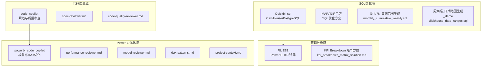
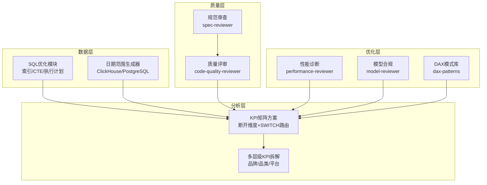
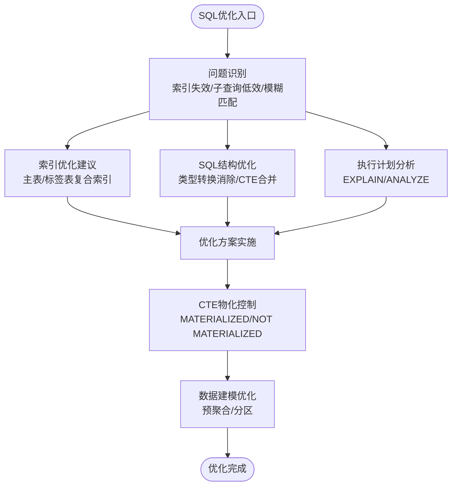
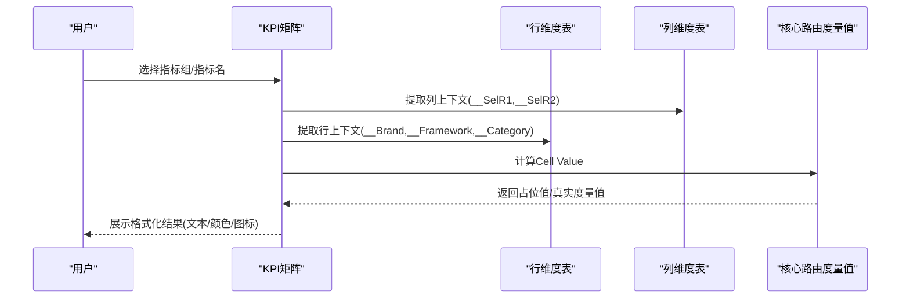

# 核心模块概览

<cite>
**本文档引用的文件**
- [SQL_优化方案.md](file://Quickbi_sql/MAP/我的门店/SQL_优化方案.md)
- [monthly_cumulative_weekly.sql](file://Quickbi_sql/周大福/周大福_日期范围生成_ARRAY JOIN_Clickhou/monthly_cumulative_weekly.sql)
- [clickhouse_date_ranges.sql](file://Quickbi_sql/周大福/周大福_日期范围生成_demo/clickhouse_date_ranges.sql)
- [kpi_breakdown_matrix_solution.md](file://RL E2E/RL E2E Traffic_Dashboard/KPI Breakdown/kpi_breakdown_matrix_solution.md)
- [code-quality-reviewer.md](file://code_copilot/agents/code-quality-reviewer.md)
- [spec-reviewer.md](file://code_copilot/agents/spec-reviewer.md)
- [performance-reviewer.md](file://powerbi_code_copilot/agents/performance-reviewer.md)
- [model-reviewer.md](file://powerbi_code_copilot/agents/model-reviewer.md)
- [dax-patterns.md](file://powerbi_code_copilot/knowledge/dax-patterns.md)
- [project-context.md](file://powerbi_code_copilot/rules/project-context.md)
</cite>

## 目录
1. [简介](#简介)
2. [项目结构](#项目结构)
3. [核心组件](#核心组件)
4. [架构总览](#架构总览)
5. [详细组件分析](#详细组件分析)
6. [依赖分析](#依赖分析)
7. [性能考量](#性能考量)
8. [故障排查指南](#故障排查指南)
9. [结论](#结论)
10. [附录](#附录)

## 简介
本文件面向Qoder AI项目的核心模块，系统梳理四大模块的能力边界与协作机制：SQL性能优化模块、营销效果分析模块、代码质量控制模块、Power BI优化模块。文档旨在帮助业务与技术读者理解各模块的技术特点、适用场景与业务价值，并提供模块选择与组合使用指导。

## 项目结构
项目采用“功能域+技术栈”并行组织方式：
- Quickbi_sql：ClickHouse/PostgreSQL SQL优化与日期范围生成
- RL E2E：Power BI KPI矩阵与流量分析方案
- code_copilot：通用代码质量与规范审查能力
- powerbi_code_copilot：Power BI模型与DAX优化能力

**图表来源**
- [SQL_优化方案.md:1-822](file://Quickbi_sql/MAP/我的门店/SQL_优化方案.md#L1-L822)
- [monthly_cumulative_weekly.sql:1-159](file://Quickbi_sql/周大福/周大福_日期范围生成_ARRAY JOIN_Clickhou/monthly_cumulative_weekly.sql#L1-L159)
- [clickhouse_date_ranges.sql:1-214](file://Quickbi_sql/周大福/周大福_日期范围生成_demo/clickhouse_date_ranges.sql#L1-L214)
- [kpi_breakdown_matrix_solution.md:1-939](file://RL E2E/RL E2E Traffic_Dashboard/KPI Breakdown/kpi_breakdown_matrix_solution.md#L1-L939)
- [spec-reviewer.md:1-25](file://code_copilot/agents/spec-reviewer.md#L1-L25)
- [code-quality-reviewer.md:1-13](file://code_copilot/agents/code-quality-reviewer.md#L1-L13)
- [performance-reviewer.md:1-71](file://powerbi_code_copilot/agents/performance-reviewer.md#L1-L71)
- [model-reviewer.md:1-36](file://powerbi_code_copilot/agents/model-reviewer.md#L1-L36)
- [dax-patterns.md:1-205](file://powerbi_code_copilot/knowledge/dax-patterns.md#L1-L205)
- [project-context.md:1-69](file://powerbi_code_copilot/rules/project-context.md#L1-L69)

**章节来源**
- [SQL_优化方案.md:1-822](file://Quickbi_sql/MAP/我的门店/SQL_优化方案.md#L1-L822)
- [monthly_cumulative_weekly.sql:1-159](file://Quickbi_sql/周大福/周大福_日期范围生成_ARRAY JOIN_Clickhou/monthly_cumulative_weekly.sql#L1-L159)
- [clickhouse_date_ranges.sql:1-214](file://Quickbi_sql/周大福/周大福_日期范围生成_demo/clickhouse_date_ranges.sql#L1-L214)
- [kpi_breakdown_matrix_solution.md:1-939](file://RL E2E/RL E2E Traffic_Dashboard/KPI Breakdown/kpi_breakdown_matrix_solution.md#L1-L939)
- [spec-reviewer.md:1-25](file://code_copilot/agents/spec-reviewer.md#L1-L25)
- [code-quality-reviewer.md:1-13](file://code_copilot/agents/code-quality-reviewer.md#L1-L13)
- [performance-reviewer.md:1-71](file://powerbi_code_copilot/agents/performance-reviewer.md#L1-L71)
- [model-reviewer.md:1-36](file://powerbi_code_copilot/agents/model-reviewer.md#L1-L36)
- [dax-patterns.md:1-205](file://powerbi_code_copilot/knowledge/dax-patterns.md#L1-L205)
- [project-context.md:1-69](file://powerbi_code_copilot/rules/project-context.md#L1-L69)

## 核心组件
- SQL性能优化模块
  - 能力：索引优化、SQL结构重构、CTE物化控制、执行计划分析、预聚合与分区建模
  - 技术特点：PostgreSQL 12+ CTE物化提示、ClickHouse ARRAY JOIN、日期范围生成器
  - 适用场景：高频报表、大规模明细表、跨周期对比分析
  - 业务价值：显著降低查询延迟、减少全表扫描、提升可维护性
- 营销效果分析模块
  - 能力：KPI矩阵可视化、多层级维度拆解、动态Top N、同比/环比、ABC分析
  - 技术特点：断开维度矩阵、列优先SWITCH路由、格式化与条件渲染
  - 适用场景：品牌/品类/平台多维KPI拆解、营销活动归因分析
  - 业务价值：统一口径、提升洞察效率、支持实时钻取
- 代码质量控制模块
  - 能力：规范符合性审查、代码质量评审、安全与可维护性评估
  - 技术特点：只读审查、独立验证、分级问题管理
  - 适用场景：研发流程质量门禁、自动化代码审计
  - 业务价值：降低回归风险、统一团队标准、加速交付
- Power BI优化模块
  - 能力：性能诊断、模型合规审查、DAX模式库、项目上下文管理
  - 技术特点：分层诊断框架、度量值复杂度评估、时间智能优化
  - 适用场景：报表性能瓶颈定位、模型结构治理、度量值一致性
  - 业务价值：缩短报表响应时间、提升用户体验、保障模型稳定性

**章节来源**
- [SQL_优化方案.md:1-822](file://Quickbi_sql/MAP/我的门店/SQL_优化方案.md#L1-L822)
- [monthly_cumulative_weekly.sql:1-159](file://Quickbi_sql/周大福/周大福_日期范围生成_ARRAY JOIN_Clickhou/monthly_cumulative_weekly.sql#L1-L159)
- [clickhouse_date_ranges.sql:1-214](file://Quickbi_sql/周大福/周大福_日期范围生成_demo/clickhouse_date_ranges.sql#L1-L214)
- [kpi_breakdown_matrix_solution.md:1-939](file://RL E2E/RL E2E Traffic_Dashboard/KPI Breakdown/kpi_breakdown_matrix_solution.md#L1-L939)
- [spec-reviewer.md:1-25](file://code_copilot/agents/spec-reviewer.md#L1-L25)
- [code-quality-reviewer.md:1-13](file://code_copilot/agents/code-quality-reviewer.md#L1-L13)
- [performance-reviewer.md:1-71](file://powerbi_code_copilot/agents/performance-reviewer.md#L1-L71)
- [model-reviewer.md:1-36](file://powerbi_code_copilot/agents/model-reviewer.md#L1-L36)
- [dax-patterns.md:1-205](file://powerbi_code_copilot/knowledge/dax-patterns.md#L1-L205)
- [project-context.md:1-69](file://powerbi_code_copilot/rules/project-context.md#L1-L69)

## 架构总览
四大模块通过“数据-分析-质量-优化”的闭环协作实现业务价值最大化：
- 数据层：SQL优化模块提供高效稳定的查询与日期范围生成
- 分析层：营销分析模块提供多维KPI矩阵与可视化
- 质量层：代码质量控制模块保障实现与规范一致
- 优化层：Power BI优化模块保障报表性能与模型健康

**图表来源**
- [SQL_优化方案.md:1-822](file://Quickbi_sql/MAP/我的门店/SQL_优化方案.md#L1-L822)
- [monthly_cumulative_weekly.sql:1-159](file://Quickbi_sql/周大福/周大福_日期范围生成_ARRAY JOIN_Clickhou/monthly_cumulative_weekly.sql#L1-L159)
- [clickhouse_date_ranges.sql:1-214](file://Quickbi_sql/周大福/周大福_日期范围生成_demo/clickhouse_date_ranges.sql#L1-L214)
- [kpi_breakdown_matrix_solution.md:1-939](file://RL E2E/RL E2E Traffic_Dashboard/KPI Breakdown/kpi_breakdown_matrix_solution.md#L1-L939)
- [spec-reviewer.md:1-25](file://code_copilot/agents/spec-reviewer.md#L1-L25)
- [code-quality-reviewer.md:1-13](file://code_copilot/agents/code-quality-reviewer.md#L1-L13)
- [performance-reviewer.md:1-71](file://powerbi_code_copilot/agents/performance-reviewer.md#L1-L71)
- [model-reviewer.md:1-36](file://powerbi_code_copilot/agents/model-reviewer.md#L1-L36)
- [dax-patterns.md:1-205](file://powerbi_code_copilot/knowledge/dax-patterns.md#L1-L205)

## 详细组件分析

### SQL性能优化模块
- 核心功能
  - 索引设计与优化：主表与标签表复合索引、辅助索引、独立dt索引
  - SQL结构优化：消除类型转换、提升MAX(dt)子查询、模糊匹配优化、CTE合并与物化
  - 执行计划分析：对比分析、关注Seq Scan、Sort、Hash Join、CTE Scan等指标
  - 数据建模优化：预聚合物化视图、分区表策略
- 技术特点
  - PostgreSQL 12+ CTE物化提示（NOT MATERIALIZED/MATERIALIZED）
  - ClickHouse ARRAY JOIN实现日期范围成对输出
  - 多报表类型日期范围生成（周报、月累计周报、月报、年累计月报）
- 适用场景
  - 门店销售排名、跨周期对比、高频预聚合报表
- 业务价值
  - 显著降低查询延迟、减少全表扫描、提升可维护性与扩展性

**图表来源**
- [SQL_优化方案.md:1-822](file://Quickbi_sql/MAP/我的门店/SQL_优化方案.md#L1-L822)

**章节来源**
- [SQL_优化方案.md:1-822](file://Quickbi_sql/MAP/我的门店/SQL_优化方案.md#L1-L822)
- [monthly_cumulative_weekly.sql:1-159](file://Quickbi_sql/周大福/周大福_日期范围生成_ARRAY JOIN_Clickhou/monthly_cumulative_weekly.sql#L1-L159)
- [clickhouse_date_ranges.sql:1-214](file://Quickbi_sql/周大福/周大福_日期范围生成_demo/clickhouse_date_ranges.sql#L1-L214)

### 营销效果分析模块
- 核心功能
  - 多层级KPI矩阵：品牌>框架>品类三层行维度，指标组>指标名两列维度
  - 断开维度矩阵：行/列维度表断开关系，通过SWITCH路由到具体度量值
  - 动态格式化：按指标类型返回格式化文本、颜色、SVG图标、背景色
  - 参差层级处理：Framework叶节点抑制冗余Category子行
- 技术特点
  - SWITCH(__SelR1,__SelR2)列头路由，Total行前置分支
  - 小计行SUM(RowKPI_ID) × ColMetric_ID占位值
  - 排序列起始值从7开始，遵循domain-rules.md
- 适用场景
  - 品牌/品类/平台KPI拆解、营销渠道归因、实时钻取分析
- 业务价值
  - 统一口径、提升洞察效率、支持多维联动

**图表来源**
- [kpi_breakdown_matrix_solution.md:231-366](file://RL E2E/RL E2E Traffic_Dashboard/KPI Breakdown/kpi_breakdown_matrix_solution.md#L231-L366)

**章节来源**
- [kpi_breakdown_matrix_solution.md:1-939](file://RL E2E/RL E2E Traffic_Dashboard/KPI Breakdown/kpi_breakdown_matrix_solution.md#L1-L939)

### 代码质量控制模块
- 核心功能
  - 规范符合性审查：缺失实现、多余实现、理解偏差、业务规则落地、数据变更准确性
  - 代码质量评审：安全漏洞、并发安全、异常处理、命名规范、方法长度
- 技术特点
  - 只读审查，独立于实现者上下文
  - 分级问题管理（Critical/Important/Minor）
  - 输出格式标准化（功能点逐条验证、结论）
- 适用场景
  - 研发流程质量门禁、自动化代码审计、团队标准统一
- 业务价值
  - 降低回归风险、提升交付质量与可维护性

**章节来源**
- [spec-reviewer.md:1-25](file://code_copilot/agents/spec-reviewer.md#L1-L25)
- [code-quality-reviewer.md:1-13](file://code_copilot/agents/code-quality-reviewer.md#L1-L13)

### Power BI优化模块
- 核心功能
  - 性能诊断：数据源层、Power Query层、模型层、DAX层、可视化层
  - 模型合规审查：事实表/维度表分离、关系方向、双向筛选、循环依赖
  - DAX模式库：累计求和、同比/环比、动态Top N、ABC分析、移动平均、半加性度量值
  - 项目上下文：版本、许可证、数据源、模型结构、度量值分组、报表页面、安全配置
- 技术特点
  - 分层诊断框架，问题分级（P0/P1/P2）
  - DAX模式可复用，性能说明明确
  - 仅需只读权限，不写入
- 适用场景
  - 报表性能瓶颈定位、模型结构治理、度量值一致性保障
- 业务价值
  - 缩短报表响应时间、提升用户体验、保障模型稳定性

**章节来源**
- [performance-reviewer.md:1-71](file://powerbi_code_copilot/agents/performance-reviewer.md#L1-L71)
- [model-reviewer.md:1-36](file://powerbi_code_copilot/agents/model-reviewer.md#L1-L36)
- [dax-patterns.md:1-205](file://powerbi_code_copilot/knowledge/dax-patterns.md#L1-L205)
- [project-context.md:1-69](file://powerbi_code_copilot/rules/project-context.md#L1-L69)

## 依赖分析
- 模块间耦合与协作
  - SQL优化模块为营销分析模块提供稳定的数据源与日期范围
  - Power BI优化模块为营销分析模块提供性能保障与模型合规
  - 代码质量控制模块贯穿SQL与Power BI实现，确保规范与质量
- 数据流
  - SQL优化模块输出优化后的查询与日期范围
  - 营销分析模块消费数据，生成KPI矩阵
  - Power BI优化模块对报表与模型进行诊断与优化
  - 代码质量控制模块对实现进行审查与评审

**图表来源**
- [SQL_优化方案.md:1-822](file://Quickbi_sql/MAP/我的门店/SQL_优化方案.md#L1-L822)
- [kpi_breakdown_matrix_solution.md:1-939](file://RL E2E/RL E2E Traffic_Dashboard/KPI Breakdown/kpi_breakdown_matrix_solution.md#L1-L939)
- [performance-reviewer.md:1-71](file://powerbi_code_copilot/agents/performance-reviewer.md#L1-L71)
- [spec-reviewer.md:1-25](file://code_copilot/agents/spec-reviewer.md#L1-L25)

**章节来源**
- [SQL_优化方案.md:1-822](file://Quickbi_sql/MAP/我的门店/SQL_优化方案.md#L1-L822)
- [kpi_breakdown_matrix_solution.md:1-939](file://RL E2E/RL E2E Traffic_Dashboard/KPI Breakdown/kpi_breakdown_matrix_solution.md#L1-L939)
- [performance-reviewer.md:1-71](file://powerbi_code_copilot/agents/performance-reviewer.md#L1-L71)
- [spec-reviewer.md:1-25](file://code_copilot/agents/spec-reviewer.md#L1-L25)

## 性能考量
- SQL层面
  - 使用索引避免全表扫描，消除类型转换，合并重复CTE扫描
  - 利用CTE物化控制减少重复计算，结合执行计划分析定位瓶颈
- Power BI层面
  - 采用断开维度矩阵、列优先SWITCH路由，减少上下文切换
  - 使用DAX模式库中的高性能函数（如SAMEPERIODLASTYEAR、DATESINPERIOD）
  - 控制单页视觉对象数量、避免高基数列在切片器中的过度使用
- 代码质量层面
  - 通过规范审查与质量评审，减少潜在性能隐患（如异常吞吐、魔法值、方法过长）

[本节为通用性能指导，不直接分析具体文件]

## 故障排查指南
- SQL性能问题
  - 使用EXPLAIN/ANALYZE对比优化前后执行计划，关注Seq Scan、Sort、Hash Join、CTE Scan
  - 检查索引是否命中，确认类型转换是否消除
- Power BI性能问题
  - 按数据源层、Power Query层、模型层、DAX层、可视化层逐层诊断
  - 关注查询折叠、阻断步骤、关系复杂度、度量值复杂度与变量复用
- 代码质量问题
  - 依据规范审查清单逐项核对，重点关注缺失实现、多余实现、理解偏差
  - 通过质量评审识别安全漏洞、并发安全、异常处理等问题

**章节来源**
- [SQL_优化方案.md:701-717](file://Quickbi_sql/MAP/我的门店/SQL_优化方案.md#L701-L717)
- [performance-reviewer.md:5-38](file://powerbi_code_copilot/agents/performance-reviewer.md#L5-L38)
- [spec-reviewer.md:6-12](file://code_copilot/agents/spec-reviewer.md#L6-L12)
- [code-quality-reviewer.md:5-12](file://code_copilot/agents/code-quality-reviewer.md#L5-L12)

## 结论
Qoder AI通过四大模块形成“数据高效-分析直观-质量可控-优化持续”的闭环体系。SQL优化模块奠定数据基础，营销分析模块提供业务洞察，代码质量控制模块保障实现质量，Power BI优化模块确保体验稳定。模块化设计实现了功能解耦与复用，便于按需组合与迭代升级。

[本节为总结性内容，不直接分析具体文件]

## 附录
- 模块选择与使用指导
  - 仅需快速报表与日期范围：优先SQL优化模块（索引/CTE/执行计划）
  - 需要多维KPI矩阵与可视化：优先营销分析模块（断开维度矩阵）
  - 强调研发质量与规范：优先代码质量控制模块（规范审查/质量评审）
  - 需要报表性能与模型治理：优先Power BI优化模块（性能诊断/模型合规/DAX模式库）
- 常用DAX模式参考
  - 累计求和、同比/环比、动态Top N、ABC分析、移动平均、半加性度量值

**章节来源**
- [dax-patterns.md:1-205](file://powerbi_code_copilot/knowledge/dax-patterns.md#L1-L205)