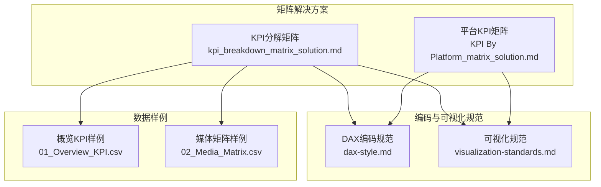
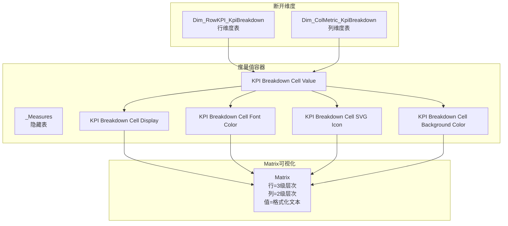
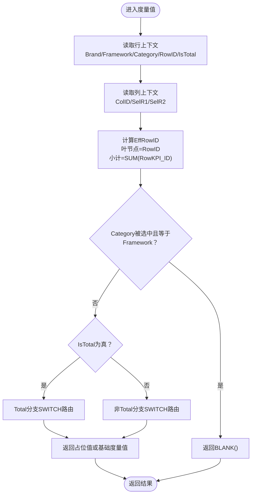
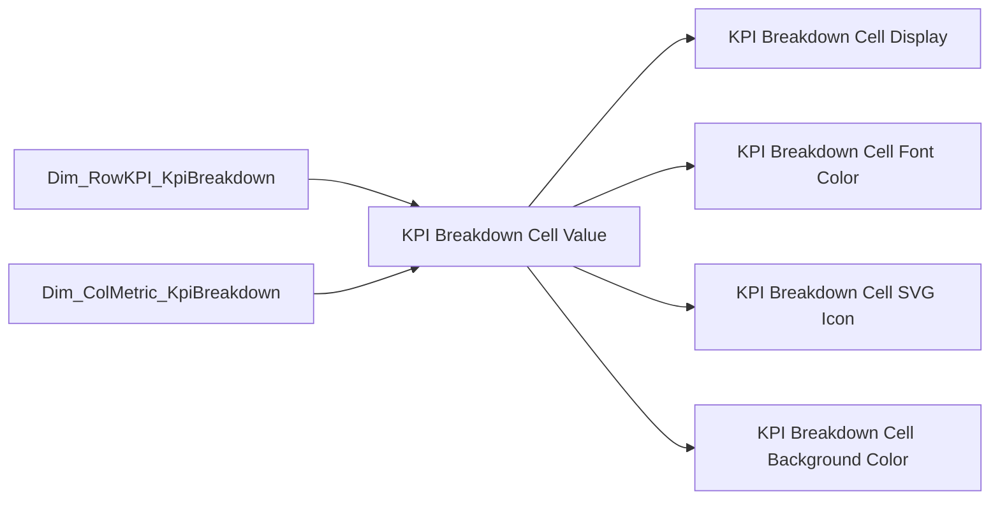
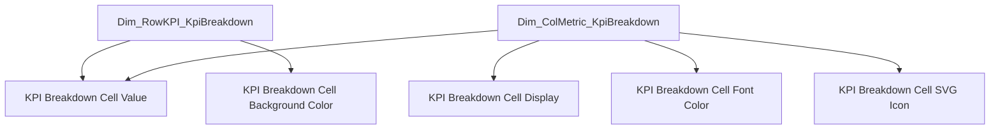

# KPI分解矩阵分析

<cite>
**本文档引用的文件**
- [kpi_breakdown_matrix_solution.md](file://RL E2E/RL E2E Traffic_Dashboard/KPI Breakdown/kpi_breakdown_matrix_solution.md)
- [KPI By Platform_matrix_solution.md](file://RL E2E/RL E2E Traffic_Dashboard/KPI By Platform/KPI By Platform_matrix_solution.md)
- [dax-style.md](file://powerbi_code_copilot/rules/dax-style.md)
- [visualization-standards.md](file://powerbi_code_copilot/rules/visualization-standards.md)
- [01_Overview_KPI.csv](file://RL E2E/数据demo/powerbi_data/01_Overview_KPI.csv)
- [02_Media_Matrix.csv](file://RL E2E/数据demo/powerbi_data/02_Media_Matrix.csv)
</cite>

## 目录
1. [简介](#简介)
2. [项目结构](#项目结构)
3. [核心组件](#核心组件)
4. [架构总览](#架构总览)
5. [详细组件分析](#详细组件分析)
6. [依赖分析](#依赖分析)
7. [性能考量](#性能考量)
8. [故障排查指南](#故障排查指南)
9. [结论](#结论)
10. [附录](#附录)

## 简介
本文件面向Power BI开发者，系统化阐述“中国式报表”中的多层级KPI分解矩阵实现方案。该方案以断开维度为核心，结合列头SWITCH分发、ISINSCOPE层级检测、Total行前置分支、参差层级抑制与占位值计算等关键技术，构建稳定可扩展的矩阵分析框架。文档提供完整的DAX实现路径、可视化配置要点、条件格式化与视觉效果实现指引，并给出数据计算示例与矩阵示意，帮助快速落地可复用的矩阵分析解决方案。

## 项目结构
本仓库中与KPI分解矩阵直接相关的文件主要集中在RL E2E Traffic Dashboard下的KPI Breakdown与KPI By Platform两个矩阵解决方案，以及Power BI编码规范与可视化标准文件。数据demo提供了概览KPI与媒体矩阵的CSV样例，便于理解数据结构与字段含义。

**图表来源**
- [kpi_breakdown_matrix_solution.md:1-939](file://RL E2E/RL E2E Traffic_Dashboard/KPI Breakdown/kpi_breakdown_matrix_solution.md#L1-L939)
- [KPI By Platform_matrix_solution.md:1-609](file://RL E2E/RL E2E Traffic_Dashboard/KPI By Platform/KPI By Platform_matrix_solution.md#L1-L609)
- [dax-style.md:1-218](file://powerbi_code_copilot/rules/dax-style.md#L1-L218)
- [visualization-standards.md:1-81](file://powerbi_code_copilot/rules/visualization-standards.md#L1-L81)
- [01_Overview_KPI.csv:1-7](file://RL E2E/数据demo/powerbi_data/01_Overview_KPI.csv#L1-L7)
- [02_Media_Matrix.csv:1-33](file://RL E2E/数据demo/powerbi_data/02_Media_Matrix.csv#L1-L33)

**章节来源**
- [kpi_breakdown_matrix_solution.md:1-939](file://RL E2E/RL E2E Traffic_Dashboard/KPI Breakdown/kpi_breakdown_matrix_solution.md#L1-L939)
- [KPI By Platform_matrix_solution.md:1-609](file://RL E2E/RL E2E Traffic_Dashboard/KPI By Platform/KPI By Platform_matrix_solution.md#L1-L609)
- [dax-style.md:1-218](file://powerbi_code_copilot/rules/dax-style.md#L1-L218)
- [visualization-standards.md:1-81](file://powerbi_code_copilot/rules/visualization-standards.md#L1-L81)
- [01_Overview_KPI.csv:1-7](file://RL E2E/数据demo/powerbi_data/01_Overview_KPI.csv#L1-L7)
- [02_Media_Matrix.csv:1-33](file://RL E2E/数据demo/powerbi_data/02_Media_Matrix.csv#L1-L33)

## 核心组件
- 行维度表 Dim_RowKPI_KpiBreakdown：定义3级行层次（Brand > Framework > Category），包含排序列与Total占位策略。
- 列维度表 Dim_ColMetric_KpiBreakdown：定义2级列层次（MetricGroup > MetricName），包含格式类型标识。
- 度量值容器表 _Measures：集中存放所有度量值，按Display Folder组织（Base Metrics、Formatting）。
- 核心路由度量值 KPI Breakdown Cell Value：通过列上下文SWITCH分发到14个指标分支，支持Total与非Total两条路径。
- 格式化度量值：KPI Breakdown Cell Display（文本格式化）、KPI Breakdown Cell Font Color（字体颜色）、KPI Breakdown Cell SVG Icon（SVG图标）、KPI Breakdown Cell Background Color（交替行背景色）。
- Matrix可视化：行=3级层次，列=2级层次，值=格式化文本度量值，开启阶梯布局与行小计，关闭列小计与Grand Total。

**章节来源**
- [kpi_breakdown_matrix_solution.md:103-198](file://RL E2E/RL E2E Traffic_Dashboard/KPI Breakdown/kpi_breakdown_matrix_solution.md#L103-L198)
- [kpi_breakdown_matrix_solution.md:227-570](file://RL E2E/RL E2E Traffic_Dashboard/KPI Breakdown/kpi_breakdown_matrix_solution.md#L227-L570)
- [kpi_breakdown_matrix_solution.md:572-594](file://RL E2E/RL E2E Traffic_Dashboard/KPI Breakdown/kpi_breakdown_matrix_solution.md#L572-L594)

## 架构总览
整体架构围绕“断开维度 + 列头SWITCH分发 + ISINSCOPE层级检测”的核心思想展开。行维度表与列维度表均断开，不与任何事实表建立关系；Matrix自动对两维度做笛卡尔积，形成完整的矩阵网格。核心度量值通过SELECTEDVALUE读取行列上下文，再依据MetricFormat进行格式化输出。

**图表来源**
- [kpi_breakdown_matrix_solution.md:210-226](file://RL E2E/RL E2E Traffic_Dashboard/KPI Breakdown/kpi_breakdown_matrix_solution.md#L210-L226)
- [kpi_breakdown_matrix_solution.md:227-570](file://RL E2E/RL E2E Traffic_Dashboard/KPI Breakdown/kpi_breakdown_matrix_solution.md#L227-L570)
- [kpi_breakdown_matrix_solution.md:572-594](file://RL E2E/RL E2E Traffic_Dashboard/KPI Breakdown/kpi_breakdown_matrix_solution.md#L572-L594)

## 详细组件分析

### 行维度表 Dim_RowKPI_KpiBreakdown
- 作用：定义3级行层次结构，包含Brand、Framework、Category三列及对应的排序列；Total作为Brand的一个值，Framework/Category使用同名占位，运行时抑制冗余子行。
- 参差层级处理：Framework级叶节点（如T-shirt、Complemen）Category与其同名，通过Category=Framework的占位实现抑制。
- 小计行为：叶节点使用RowKPI_ID，小计行使用SUM(RowKPI_ID)，Total行使用固定ID。

**章节来源**
- [kpi_breakdown_matrix_solution.md:103-151](file://RL E2E/RL E2E Traffic_Dashboard/KPI Breakdown/kpi_breakdown_matrix_solution.md#L103-L151)

### 列维度表 Dim_ColMetric_KpiBreakdown
- 作用：定义2级列层次（MetricGroup > MetricName），包含14个指标列，跨4个分组；每列包含格式类型标识（如delta_pt、percent、number）。
- 排序约束：MetricName存在重复值（如Total/直通车/引力魔方/全站推），需保证同名值的MetricName_Sort一致。

**章节来源**
- [kpi_breakdown_matrix_solution.md:153-198](file://RL E2E/RL E2E Traffic_Dashboard/KPI Breakdown/kpi_breakdown_matrix_solution.md#L153-L198)

### 核心路由度量值 KPI Breakdown Cell Value
- 行上下文变量：__Brand、__Framework、__Category、__RowID、__IsTotal。
- 列上下文变量：__ColID、__SelR1（MetricGroup）、__SelR2（MetricName）。
- 占位值计算：叶节点=RowID×ColID，小计行=SUM(RowKPI_ID)×ColID。
- Total行前置分支：Total分支直接返回占位值或基础度量值；非Total分支通过CALCULATE对事实表行字段进行筛选。
- 参差层级抑制：通过ISINSCOPE检测Category是否被选中，且Category=Framework时抑制冗余子行。

**图表来源**
- [kpi_breakdown_matrix_solution.md:233-366](file://RL E2E/RL E2E Traffic_Dashboard/KPI Breakdown/kpi_breakdown_matrix_solution.md#L233-L366)

**章节来源**
- [kpi_breakdown_matrix_solution.md:233-366](file://RL E2E/RL E2E Traffic_Dashboard/KPI Breakdown/kpi_breakdown_matrix_solution.md#L233-L366)

### 格式化显示度量值 KPI Breakdown Cell Display
- 依据MetricFormat返回格式化文本，支持整数、小数、百分比、货币、增减百分比、增减点数、增减基点等多种格式。
- 默认返回两位小数的数值格式。

**章节来源**
- [kpi_breakdown_matrix_solution.md:394-490](file://RL E2E/RL E2E Traffic_Dashboard/KPI Breakdown/kpi_breakdown_matrix_solution.md#L394-L490)

### 条件格式度量值
- 字体颜色 KPI Breakdown Cell Font Color：针对delta_pt类型的列，正值草绿色、负值玫瑰红、零值亮黄色。
- SVG图标 KPI Breakdown Cell SVG Icon：针对delta_pt类型的列，返回对应颜色的圆形SVG图标。
- 交替行背景色 KPI Breakdown Cell Background Color：基于RowKPI_ID奇偶性返回浅灰或白色。

**章节来源**
- [kpi_breakdown_matrix_solution.md:492-570](file://RL E2E/RL E2E Traffic_Dashboard/KPI Breakdown/kpi_breakdown_matrix_solution.md#L492-L570)

### Matrix可视化配置
- 行：Brand > Framework > Category（3级层次）
- 列：MetricGroup > MetricName（2级层次）
- 值：KPI Breakdown Cell Display（格式化文本）
- 格式设置：阶梯布局开启、行小计开启、列小计关闭、Grand Total关闭、隐藏Total与Framework级叶节点的冗余子行。
- 行标题第1列重命名为"Brand Level"。

**章节来源**
- [kpi_breakdown_matrix_solution.md:572-594](file://RL E2E/RL E2E Traffic_Dashboard/KPI Breakdown/kpi_breakdown_matrix_solution.md#L572-L594)

### 接入真实数据（SWITCH替换指南）
- Total分支：替换为直接调用基础度量值（不加行筛选条件）。
- 非Total分支：替换为CALCULATE([度量值], 事实表行筛选条件)。
- 小计层注意事项：在子度量值中使用ISINSCOPE判断层级，或采用CALCULATETABLE+FILTER方式忽略BLANK筛选条件。

**章节来源**
- [kpi_breakdown_matrix_solution.md:596-642](file://RL E2E/RL E2E Traffic_Dashboard/KPI Breakdown/kpi_breakdown_matrix_solution.md#L596-L642)

### 血缘关系图（Lineage Diagram）

**图表来源**
- [kpi_breakdown_matrix_solution.md:672-721](file://RL E2E/RL E2E Traffic_Dashboard/KPI Breakdown/kpi_breakdown_matrix_solution.md#L672-L721)

**章节来源**
- [kpi_breakdown_matrix_solution.md:672-721](file://RL E2E/RL E2E Traffic_Dashboard/KPI Breakdown/kpi_breakdown_matrix_solution.md#L672-L721)

### 最终矩阵效果示意
- 占位值=EffRowID×ColMetric_ID。
- 可见行EffRowID索引与矩阵数据表（SLS、Cost MOB%）示例展示了不同列ID下的数据分布与层级关系。

**章节来源**
- [kpi_breakdown_matrix_solution.md:724-800](file://RL E2E/RL E2E Traffic_Dashboard/KPI Breakdown/kpi_breakdown_matrix_solution.md#L724-L800)

## 依赖分析
- 行维度表与列维度表均为断开维度，不与任何事实表建立关系。
- 核心路由度量值依赖两维度表提供的上下文变量。
- 格式化度量值依赖列维度表的MetricFormat字段。
- Matrix通过笛卡尔积自动组合行列，无需中间桥接表。

**图表来源**
- [kpi_breakdown_matrix_solution.md:712-721](file://RL E2E/RL E2E Traffic_Dashboard/KPI Breakdown/kpi_breakdown_matrix_solution.md#L712-L721)

**章节来源**
- [kpi_breakdown_matrix_solution.md:712-721](file://RL E2E/RL E2E Traffic_Dashboard/KPI Breakdown/kpi_breakdown_matrix_solution.md#L712-L721)

## 性能考量
- SWITCH度量值在当前规模（14个指标×若干行）下性能良好；接入真实数据后需关注各子度量值的计算复杂度。
- 优先使用VAR缓存中间结果，避免重复计算。
- 避免深层CALCULATE嵌套，必要时使用REMOVEFILTERS或CALCULATETABLE简化筛选逻辑。
- 对于小计层，建议在子度量值中使用ISINSCOPE判断层级，减少无效筛选带来的性能损耗。

## 故障排查指南
- 单元格显示空白：检查MetricFormat是否正确，或EffRowID是否为BLANK（参差层级抑制）。
- Total行与非Total行混淆：确认__IsTotal判断逻辑与Total分支的SWITCH路由。
- 小计行异常：核对RowKPI_ID的SUM范围是否覆盖正确层级，或在子度量值中处理ISINSCOPE。
- 排序错乱：确认Sort by Column配置是否指向正确的排序列（Brand_Sort、Framework_Sort、Category_Sort、MetricGroup_Sort、MetricName_Sort）。
- 条件格式不生效：确认度量值数据类别设置（如SVG图标需设为"图像URL"），并检查字段绑定是否正确。

**章节来源**
- [kpi_breakdown_matrix_solution.md:588-594](file://RL E2E/RL E2E Traffic_Dashboard/KPI Breakdown/kpi_breakdown_matrix_solution.md#L588-L594)
- [kpi_breakdown_matrix_solution.md:625-642](file://RL E2E/RL E2E Traffic_Dashboard/KPI Breakdown/kpi_breakdown_matrix_solution.md#L625-L642)

## 结论
本方案通过断开维度与列头SWITCH分发，实现了稳定的多层级KPI分解矩阵。借助ISINSCOPE层级检测与Total行前置分支，既能处理参差层级，又能保证Total与非Total的差异化需求。配合格式化与条件格式度量值，最终呈现符合中国式报表审美的矩阵效果。该方案具备良好的可扩展性，便于逐步接入真实业务度量值并持续优化性能与体验。

## 附录
- 编码规范参考：遵循DAX编码规范，度量值命名采用KPI_/CAL_/RATIO_等前缀，变量使用双下划线前缀，注释完整。
- 可视化规范参考：页面布局、色彩方案、字体规范与交互设计遵循Power BI可视化标准。
- 数据样例参考：概览KPI与媒体矩阵CSV可用于理解字段结构与业务含义，便于模拟真实数据接入。

**章节来源**
- [dax-style.md:1-218](file://powerbi_code_copilot/rules/dax-style.md#L1-L218)
- [visualization-standards.md:1-81](file://powerbi_code_copilot/rules/visualization-standards.md#L1-L81)
- [01_Overview_KPI.csv:1-7](file://RL E2E/数据demo/powerbi_data/01_Overview_KPI.csv#L1-L7)
- [02_Media_Matrix.csv:1-33](file://RL E2E/数据demo/powerbi_data/02_Media_Matrix.csv#L1-L33)