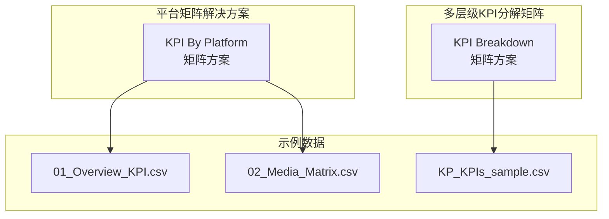
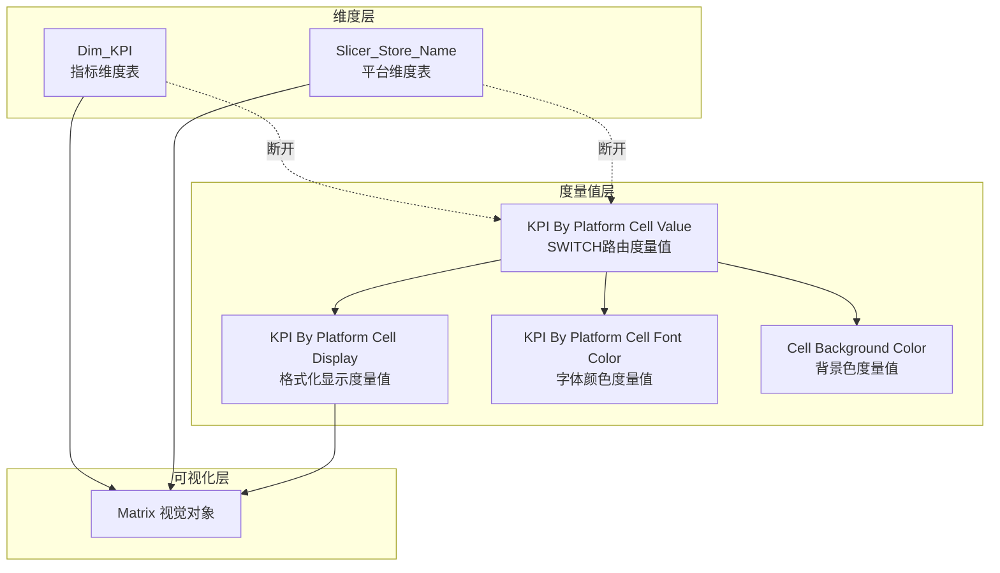
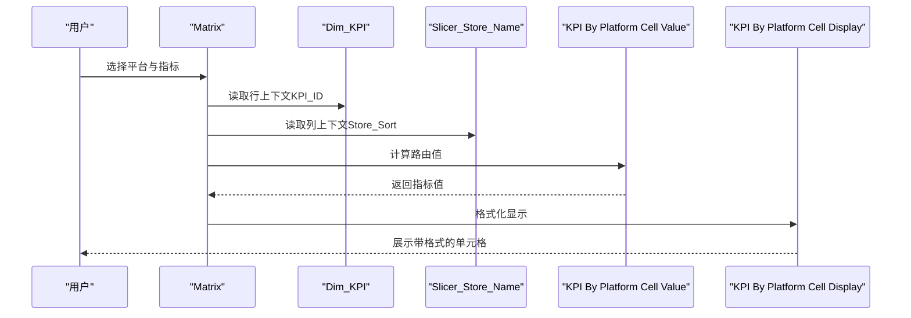
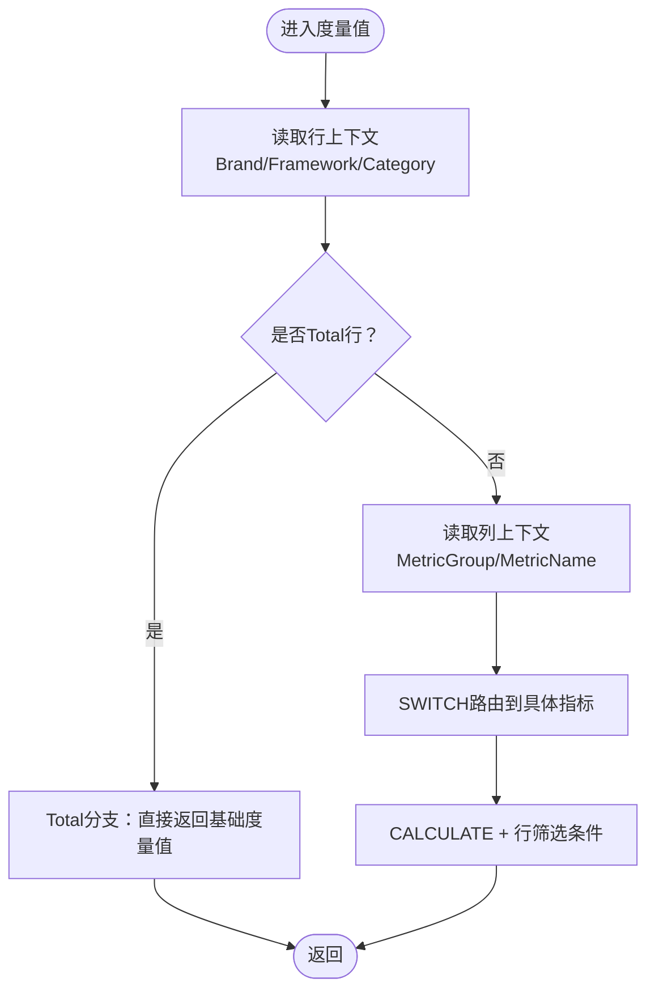
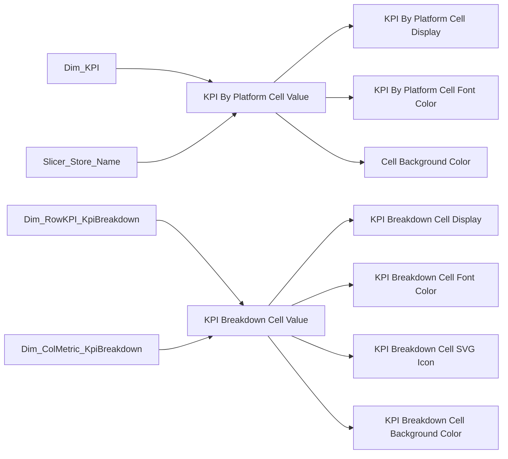

# 平台维度分析

<cite>
**本文档引用的文件**
- [KPI By Platform_matrix_solution.md](file://RL E2E/RL E2E Traffic_Dashboard/KPI By Platform/KPI By Platform_matrix_solution.md)
- [kpi_breakdown_matrix_solution.md](file://RL E2E/RL E2E Traffic_Dashboard/KPI Breakdown/kpi_breakdown_matrix_solution.md)
- [01_Overview_KPI.csv](file://RL E2E/数据demo/powerbi_data/01_Overview_KPI.csv)
- [02_Media_Matrix.csv](file://RL E2E/数据demo/powerbi_data/02_Media_Matrix.csv)
- [KP_KPIs_sample.csv](file://RL E2E/数据demo/powerbi_data/powerbi_traffic/KP_KPIs_sample.csv)
</cite>

## 目录
1. [简介](#简介)
2. [项目结构](#项目结构)
3. [核心组件](#核心组件)
4. [架构总览](#架构总览)
5. [详细组件分析](#详细组件分析)
6. [依赖关系分析](#依赖关系分析)
7. [性能考虑](#性能考虑)
8. [故障排除指南](#故障排除指南)
9. [结论](#结论)
10. [附录](#附录)

## 简介
本文件面向“平台维度分析”主题，系统性阐述在Power BI中以平台（渠道/店铺）为维度进行KPI分析的实现方法。内容涵盖：
- 平台KPI计算逻辑与多维度聚合
- 渠道效果对比分析与平台权重分配机制
- 完整DAX度量值创建指南（平台筛选、指标计算、结果展示）
- 可视化实现（图表类型选择、交互设计、动态筛选）
- 实际分析案例与数据示例，帮助快速落地

## 项目结构
仓库中与平台维度分析直接相关的资源主要集中在以下位置：
- 平台矩阵解决方案：RL E2E/RL E2E Traffic_Dashboard/KPI By Platform/
- 多层级KPI分解矩阵：RL E2E/RL E2E Traffic_Dashboard/KPI Breakdown/
- 示例数据：RL E2E/数据demo/powerbi_data/

**图表来源**
- [KPI By Platform_matrix_solution.md:1-609](file://RL E2E/RL E2E Traffic_Dashboard/KPI By Platform/KPI By Platform_matrix_solution.md#L1-L609)
- [kpi_breakdown_matrix_solution.md:1-939](file://RL E2E/RL E2E Traffic_Dashboard/KPI Breakdown/kpi_breakdown_matrix_solution.md#L1-L939)
- [01_Overview_KPI.csv:1-7](file://RL E2E/数据demo/powerbi_data/01_Overview_KPI.csv#L1-L7)
- [02_Media_Matrix.csv:1-33](file://RL E2E/数据demo/powerbi_data/02_Media_Matrix.csv#L1-L33)
- [KP_KPIs_sample.csv:1-582](file://RL E2E/数据demo/powerbi_data/powerbi_traffic/KP_KPIs_sample.csv#L1-L582)

**章节来源**
- [KPI By Platform_matrix_solution.md:1-609](file://RL E2E/RL E2E Traffic_Dashboard/KPI By Platform/KPI By Platform_matrix_solution.md#L1-L609)
- [kpi_breakdown_matrix_solution.md:1-939](file://RL E2E/RL E2E Traffic_Dashboard/KPI Breakdown/kpi_breakdown_matrix_solution.md#L1-L939)
- [01_Overview_KPI.csv:1-7](file://RL E2E/数据demo/powerbi_data/01_Overview_KPI.csv#L1-L7)
- [02_Media_Matrix.csv:1-33](file://RL E2E/数据demo/powerbi_data/02_Media_Matrix.csv#L1-L33)
- [KP_KPIs_sample.csv:1-582](file://RL E2E/数据demo/powerbi_data/powerbi_traffic/KP_KPIs_sample.csv#L1-L582)

## 核心组件
- 行维度表（平台/渠道）：通过断开维度表实现与事实表的解耦，支持按平台维度进行矩阵交叉。
- 列维度表（KPI/指标）：定义指标名称、排序、格式类型，支撑矩阵列头与格式化显示。
- 度量值（Measure）：采用“断开维度 + 分发路由”的模式，通过SWITCH根据行/列上下文分发到具体指标。
- 可视化（Matrix）：将行/列维度表进行笛卡尔积，形成矩阵网格，值区域绑定格式化度量值。

关键要点：
- 行/列维度表均与事实表断开关系，避免筛选传播干扰。
- 通过SELECTEDVALUE读取当前行/列上下文，驱动度量值路由。
- 格式化度量值负责将数值转换为带单位/百分比的文本，便于矩阵展示。

**章节来源**
- [KPI By Platform_matrix_solution.md:83-122](file://RL E2E/RL E2E Traffic_Dashboard/KPI By Platform/KPI By Platform_matrix_solution.md#L83-L122)
- [KPI By Platform_matrix_solution.md:196-270](file://RL E2E/RL E2E Traffic_Dashboard/KPI By Platform/KPI By Platform_matrix_solution.md#L196-L270)
- [KPI By Platform_matrix_solution.md:271-336](file://RL E2E/RL E2E Traffic_Dashboard/KPI By Platform/KPI By Platform_matrix_solution.md#L271-L336)

## 架构总览
平台维度分析采用“断开维度 + 动态路由”的架构模式，核心流程如下：

**图表来源**
- [KPI By Platform_matrix_solution.md:22-41](file://RL E2E/RL E2E Traffic_Dashboard/KPI By Platform/KPI By Platform_matrix_solution.md#L22-L41)
- [KPI By Platform_matrix_solution.md:196-270](file://RL E2E/RL E2E Traffic_Dashboard/KPI By Platform/KPI By Platform_matrix_solution.md#L196-L270)
- [KPI By Platform_matrix_solution.md:271-336](file://RL E2E/RL E2E Traffic_Dashboard/KPI By Platform/KPI By Platform_matrix_solution.md#L271-L336)

## 详细组件分析

### 组件A：平台KPI矩阵（按平台维度）
- 行维度：Dim_KPI（指标维度表），包含指标名称、排序、格式类型。
- 列维度：Slicer_Store_Name（平台维度表），包含平台ID、排序、显示名。
- 核心度量值：
  - KPI By Platform Cell Value：SWITCH路由，按KPI_ID与Store_Sort分发到具体指标。
  - KPI By Platform Cell Display：根据格式类型（货币、百分比、增减等）格式化输出。
  - 条件格式度量值：字体颜色与背景色，提升可读性。
- 可视化：Matrix，行=Dim_KPI[KPI_Name]，列=Slicer_Store_Name[Store_Display]，值=[KPI By Platform Cell Display]。

**图表来源**
- [KPI By Platform_matrix_solution.md:205-270](file://RL E2E/RL E2E Traffic_Dashboard/KPI By Platform/KPI By Platform_matrix_solution.md#L205-L270)
- [KPI By Platform_matrix_solution.md:271-336](file://RL E2E/RL E2E Traffic_Dashboard/KPI By Platform/KPI By Platform_matrix_solution.md#L271-L336)

**章节来源**
- [KPI By Platform_matrix_solution.md:83-122](file://RL E2E/RL E2E Traffic_Dashboard/KPI By Platform/KPI By Platform_matrix_solution.md#L83-L122)
- [KPI By Platform_matrix_solution.md:196-270](file://RL E2E/RL E2E Traffic_Dashboard/KPI By Platform/KPI By Platform_matrix_solution.md#L196-L270)
- [KPI By Platform_matrix_solution.md:271-336](file://RL E2E/RL E2E Traffic_Dashboard/KPI By Platform/KPI By Platform_matrix_solution.md#L271-L336)

### 组件B：多层级KPI分解矩阵（品牌/框架/品类）
- 行维度：Dim_RowKPI_KpiBreakdown（品牌 > 框架 > 品类三层结构），包含排序与Total行处理。
- 列维度：Dim_ColMetric_KpiBreakdown（指标分组 > 指标名称），包含格式类型与排序。
- 核心度量值：
  - KPI Breakdown Cell Value：按列上下文（MetricGroup/MetricName）分发到14个指标，支持Total行与小计行。
  - KPI Breakdown Cell Display：按格式类型（整数、百分比、货币、增减等）格式化。
  - 条件格式度量值：字体颜色、背景色、SVG图标，增强可视化表达。
- 可视化：Matrix，行=品牌>框架>品类，列=指标分组>指标名称，值=格式化显示。

**图表来源**
- [kpi_breakdown_matrix_solution.md:233-366](file://RL E2E/RL E2E Traffic_Dashboard/KPI Breakdown/kpi_breakdown_matrix_solution.md#L233-L366)

**章节来源**
- [kpi_breakdown_matrix_solution.md:103-150](file://RL E2E/RL E2E Traffic_Dashboard/KPI Breakdown/kpi_breakdown_matrix_solution.md#L103-L150)
- [kpi_breakdown_matrix_solution.md:153-197](file://RL E2E/RL E2E Traffic_Dashboard/KPI Breakdown/kpi_breakdown_matrix_solution.md#L153-L197)
- [kpi_breakdown_matrix_solution.md:231-366](file://RL E2E/RL E2E Traffic_Dashboard/KPI Breakdown/kpi_breakdown_matrix_solution.md#L231-L366)
- [kpi_breakdown_matrix_solution.md:394-570](file://RL E2E/RL E2E Traffic_Dashboard/KPI Breakdown/kpi_breakdown_matrix_solution.md#L394-L570)

### 组件C：平台权重分配机制
- 权重来源：可在平台维度表中扩展列（如Store_Weight），或在度量值中引入权重参数。
- 计算方式：在度量值中乘以权重，或在SUMMARIZE/ADDCOLUMNS中预计算加权指标。
- 影响范围：影响矩阵中单元格的绝对值与对比分析，但不改变行/列排序与格式化规则。

（本节为概念性说明，未直接引用具体文件）

## 依赖关系分析
- 行维度表（Dim_KPI/Dim_RowKPI_KpiBreakdown）与列维度表（Slicer_Store_Name/Dim_ColMetric_KpiBreakdown）均与事实表断开，避免筛选传播。
- 度量值通过SELECTEDVALUE读取上下文，再通过SWITCH/CALCULATE访问事实表中的具体指标。
- Matrix视觉对象负责笛卡尔积与单元格渲染，格式化度量值与条件格式共同决定最终展示效果。

**图表来源**
- [KPI By Platform_matrix_solution.md:196-336](file://RL E2E/RL E2E Traffic_Dashboard/KPI By Platform/KPI By Platform_matrix_solution.md#L196-L336)
- [kpi_breakdown_matrix_solution.md:231-570](file://RL E2E/RL E2E Traffic_Dashboard/KPI Breakdown/kpi_breakdown_matrix_solution.md#L231-L570)

**章节来源**
- [KPI By Platform_matrix_solution.md:196-336](file://RL E2E/RL E2E Traffic_Dashboard/KPI By Platform/KPI By Platform_matrix_solution.md#L196-L336)
- [kpi_breakdown_matrix_solution.md:231-570](file://RL E2E/RL E2E Traffic_Dashboard/KPI Breakdown/kpi_breakdown_matrix_solution.md#L231-L570)

## 性能考虑
- SWITCH度量值在当前规模（17路×5列=85次求值）下性能良好，接入真实数据后需关注子度量值本身性能。
- 使用Sort by Column确保行/列排序稳定，避免额外计算。
- 条件格式（字体颜色、背景色、SVG图标）应尽量简化表达式，避免在大数据集上造成卡顿。
- 对于多层级矩阵，Total行与小计行的处理需谨慎，避免CALCULATE中出现过多BLANK筛选导致性能下降。

（本节为通用指导，未直接引用具体文件）

## 故障排除指南
常见问题与解决建议：
- 矩阵未显示预期值：检查Dim_KPI与Slicer_Store_Name的排序列（KPI_Sort、Store_Sort）是否正确配置。
- SWITCH路由未命中：确认KPI_ID与Store_Sort是否存在于维度表中，BLANK兜底逻辑是否生效。
- 格式化显示异常：核对格式类型（currency、percent、delta_pct等）与FORMAT表达式是否匹配。
- 条件格式无效：确认条件格式绑定的度量值与数据类别设置正确（如SVG图标需设为图像URL）。

**章节来源**
- [KPI By Platform_matrix_solution.md:580-593](file://RL E2E/RL E2E Traffic_Dashboard/KPI By Platform/KPI By Platform_matrix_solution.md#L580-L593)
- [kpi_breakdown_matrix_solution.md:588-593](file://RL E2E/RL E2E Traffic_Dashboard/KPI Breakdown/kpi_breakdown_matrix_solution.md#L588-L593)

## 结论
通过“断开维度 + 动态路由”的矩阵方案，可以在Power BI中高效实现平台维度的KPI分析与对比。该方案具备以下优势：
- 解耦维度与事实表，避免筛选传播干扰
- 以SWITCH路由实现灵活扩展，易于接入真实度量值
- 丰富的格式化与条件格式能力，满足多样化展示需求
- 支持多层级分解矩阵，覆盖更复杂的业务分析场景

## 附录

### A. DAX度量值创建清单（平台矩阵）
- 创建行维度表Dim_KPI（包含KPI_ID、KPI_Name、KPI_Sort、KPI_Format）
- 创建列维度表Slicer_Store_Name（包含Store_ID、Store_Sort、Store_Display）
- 创建核心度量值：
  - KPI By Platform Cell Value（SWITCH路由）
  - KPI By Platform Cell Display（格式化）
  - KPI By Platform Cell Font Color（条件格式）
  - Cell Background Color（条件格式）
- 在Matrix中配置字段与格式，并应用条件格式

**章节来源**
- [KPI By Platform_matrix_solution.md:83-122](file://RL E2E/RL E2E Traffic_Dashboard/KPI By Platform/KPI By Platform_matrix_solution.md#L83-L122)
- [KPI By Platform_matrix_solution.md:196-270](file://RL E2E/RL E2E Traffic_Dashboard/KPI By Platform/KPI By Platform_matrix_solution.md#L196-L270)
- [KPI By Platform_matrix_solution.md:271-336](file://RL E2E/RL E2E Traffic_Dashboard/KPI By Platform/KPI By Platform_matrix_solution.md#L271-L336)

### B. 数据示例与字段说明
- 01_Overview_KPI.csv：包含Channel、Currency、Cost、GMV、ROI、New_Invest_Pct等字段，适合用于平台整体KPI对比。
- 02_Media_Matrix.csv：包含Channel、Media_Name、Cost、GMV、ROI等字段，适合用于媒体矩阵与平台效果分析。
- KP_KPIs_sample.csv：包含品牌、框架、广告形式、点击、转化、成本等字段，适合用于多层级KPI分解矩阵。

**章节来源**
- [01_Overview_KPI.csv:1-7](file://RL E2E/数据demo/powerbi_data/01_Overview_KPI.csv#L1-L7)
- [02_Media_Matrix.csv:1-33](file://RL E2E/数据demo/powerbi_data/02_Media_Matrix.csv#L1-L33)
- [KP_KPIs_sample.csv:1-582](file://RL E2E/数据demo/powerbi_data/powerbi_traffic/KP_KPIs_sample.csv#L1-L582)