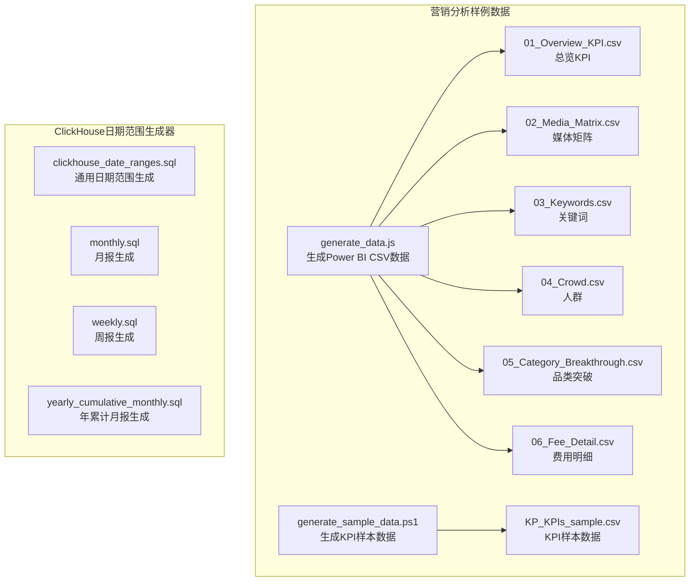
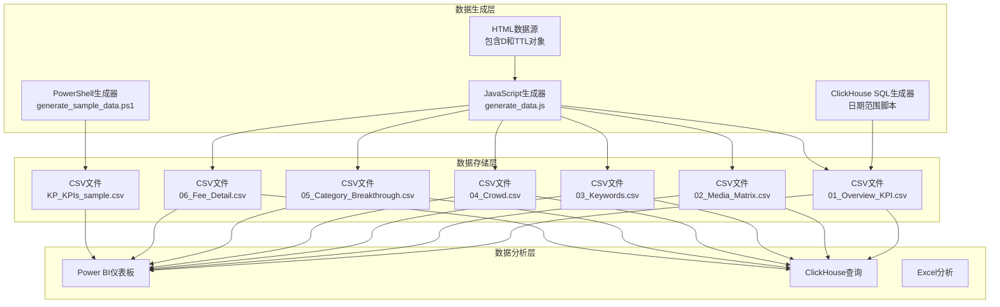
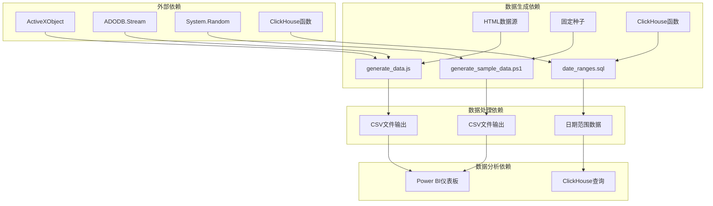

# 数据演示和样例

<cite>
**本文档引用的文件**
- [generate_data.js](file://RL E2E\数据demo\powerbi_data\generate_data.js)
- [generate_sample_data.ps1](file://RL E2E\数据demo\powerbi_data\powerbi_traffic\generate_sample_data.ps1)
- [01_Overview_KPI.csv](file://RL E2E\数据demo\powerbi_data\01_Overview_KPI.csv)
- [02_Media_Matrix.csv](file://RL E2E\数据demo\powerbi_data\02_Media_Matrix.csv)
- [03_Keywords.csv](file://RL E2E\数据demo\powerbi_data\03_Keywords.csv)
- [04_Crowd.csv](file://RL E2E\数据demo\powerbi_data\04_Crowd.csv)
- [05_Category_Breakthrough.csv](file://RL E2E\数据demo\powerbi_data\05_Category_Breakthrough.csv)
- [06_Fee_Detail.csv](file://RL E2E\数据demo\powerbi_data\06_Fee_Detail.csv)
- [KP_KPIs_sample.csv](file://RL E2E\数据demo\powerbi_data\powerbi_traffic\KP_KPIs_sample.csv)
- [clickhouse_date_ranges.sql](file://Quickbi_sql\周大福\周大福_日期范围生成_demo\clickhouse_date_ranges.sql)
- [monthly.sql](file://Quickbi_sql\周大福\周大福_日期范围生成_ARRAY JOIN_Clickhou\monthly.sql)
- [weekly.sql](file://Quickbi_sql\周大福\周大福_日期范围生成_ARRAY JOIN_Clickhou\weekly.sql)
- [yearly_cumulative_monthly.sql](file://Quickbi_sql\周大福\周大福_日期范围生成_ARRAY JOIN_Clickhou\yearly_cumulative_monthly.sql)
</cite>

## 目录
1. [简介](#简介)
2. [项目结构](#项目结构)
3. [核心组件](#核心组件)
4. [架构概览](#架构概览)
5. [详细组件分析](#详细组件分析)
6. [依赖分析](#依赖分析)
7. [性能考虑](#性能考虑)
8. [故障排除指南](#故障排除指南)
9. [结论](#结论)
10. [附录](#附录)

## 简介

本文件为营销分析模块的数据演示和样例功能综合文档。内容涵盖样例数据结构与生成脚本，包括Overview_KPI.csv、Media_Matrix.csv等核心数据文件的字段定义与业务含义；JavaScript和PowerShell脚本的使用方法，用于数据生成、样本数据创建和测试数据管理；完整的数据字典说明，包括各表之间的关系、字段约束和业务规则；以及如何使用这些样例数据进行功能测试和演示，包括数据导入、模型构建和分析验证。

## 项目结构

该项目采用按功能域划分的组织方式，主要包含两大部分：

- **营销分析样例数据与脚本**：位于 `RL E2E\数据demo\powerbi_data` 目录下，包含6个CSV样例数据文件和两个数据生成脚本（JavaScript和PowerShell），用于生成Power BI分析所需的演示数据。
- **ClickHouse日期范围生成器**：位于 `Quickbi_sql\周大福` 目录下，提供多种报表类型的日期范围生成SQL脚本，支持周报、月报、月累计周报和年累计月报的日期范围计算。



**图表来源**
- [generate_data.js:1-438](file://RL E2E\数据demo\powerbi_data\generate_data.js#L1-L438)
- [generate_sample_data.ps1:1-106](file://RL E2E\数据demo\powerbi_data\powerbi_traffic\generate_sample_data.ps1#L1-L106)
- [clickhouse_date_ranges.sql:1-214](file://Quickbi_sql\周大福\周大福_日期范围生成_demo\clickhouse_date_ranges.sql#L1-L214)

**章节来源**
- [generate_data.js:1-438](file://RL E2E\数据demo\powerbi_data\generate_data.js#L1-L438)
- [generate_sample_data.ps1:1-106](file://RL E2E\数据demo\powerbi_data\powerbi_traffic\generate_sample_data.ps1#L1-L106)
- [clickhouse_date_ranges.sql:1-214](file://Quickbi_sql\周大福\周大福_日期范围生成_demo\clickhouse_date_ranges.sql#L1-L214)

## 核心组件

### JavaScript数据生成器（generate_data.js）

该脚本使用JScript for cscript.exe，从HTML文件中提取数据对象并生成Power BI所需的CSV文件。支持以下功能：

- **多渠道支持**：支持TM和JD两个渠道的数据生成
- **多货币支持**：同时生成RMB和USD两种货币格式的数据
- **多维度分析**：生成总览KPI、媒体矩阵、关键词、人群、品类突破和费用明细六个维度的数据
- **汇率转换**：内置USD汇率转换功能
- **自动汇总**：自动生成TTL（总计）行数据

**章节来源**
- [generate_data.js:1-438](file://RL E2E\数据demo\powerbi_data\generate_data.js#L1-L438)

### PowerShell样本数据生成器（generate_sample_data.ps1）

该脚本专门用于生成KPI样本数据，支持以下特性：

- **时间范围覆盖**：从2026-01-01到2026-04-18的完整日期范围
- **多品牌组合**：支持"M Polo"和"W Polo"两个品牌
- **框架映射**：不同品牌对应不同的产品框架组合
- **广告格式**：支持ZTC、YLMF、QZT三种广告格式
- **随机性控制**：使用固定种子确保数据可重现性
- **同比数据**：生成去年同期（LY）和目标（Target）数据

**章节来源**
- [generate_sample_data.ps1:1-106](file://RL E2E\数据demo\powerbi_data\powerbi_traffic\generate_sample_data.ps1#L1-L106)

### ClickHouse日期范围生成器

提供四种报表类型的日期范围生成能力：

- **周报（weekly）**：上周日期范围
- **月累计周报（monthly_cumulative_weekly）**：本月1日到上周日
- **月报（monthly）**：上月日期范围
- **年累计月报（yearly_cumulative_monthly）**：本年1月1日到上月最后一天

**章节来源**
- [clickhouse_date_ranges.sql:1-214](file://Quickbi_sql\周大福\周大福_日期范围生成_demo\clickhouse_date_ranges.sql#L1-L214)
- [monthly.sql:1-109](file://Quickbi_sql\周大福\周大福_日期范围生成_ARRAY JOIN_Clickhou\monthly.sql#L1-L109)
- [weekly.sql:1-117](file://Quickbi_sql\周大福\周大福_日期范围生成_ARRAY JOIN_Clickhou\weekly.sql#L1-L117)
- [yearly_cumulative_monthly.sql:1-109](file://Quickbi_sql\周大福\周大福_日期范围生成_ARRAY JOIN_Clickhou\yearly_cumulative_monthly.sql#L1-L109)

## 架构概览

系统采用分层架构设计，包含数据生成层、数据存储层和数据分析层：



**图表来源**
- [generate_data.js:1-438](file://RL E2E\数据demo\powerbi_data\generate_data.js#L1-L438)
- [generate_sample_data.ps1:1-106](file://RL E2E\数据demo\powerbi_data\powerbi_traffic\generate_sample_data.ps1#L1-L106)
- [clickhouse_date_ranges.sql:1-214](file://Quickbi_sql\周大福\周大福_日期范围生成_demo\clickhouse_date_ranges.sql#L1-L214)

## 详细组件分析

### Overview_KPI.csv 数据字典

Overview_KPI.csv提供营销活动的总体指标数据，包含以下字段：

| 字段名 | 数据类型 | 描述 | 业务含义 |
|--------|----------|------|----------|
| Channel | String | 渠道标识 | TM或JD |
| Currency | String | 货币单位 | RMB或USD |
| Cost | Number | 成本 | 总推广成本 |
| GMV | Number | 总成交额 | 总交易金额 |
| GMV_Pct | Number | GMV占比 | 占比百分比 |
| ROI | Number | 投资回报率 | 投资回报率 |
| New_Invest_Pct | Number | 新客户投资占比 | 新客户相关投入占比 |
| Orders | Number | 订单量 | 总订单数量 |
| CPO | Number | 客单价 | 客单价 |
| CR | Number | 转化率 | 转化率 |
| Coupon | Number | 优惠券成本 | 优惠券相关成本 |
| Cost_Progress | Number | 成本进度 | 成本完成进度 |
| Net_Sales | Number | 净销售额 | 净销售金额 |
| NS_Progress | Number | 净销售额进度 | 净销售额完成进度 |
| Demand | Number | 需求量 | 市场需求量 |
| Demand_Progress | Number | 需求进度 | 需求完成进度 |
| New_Cost | Number | 新客户成本 | 新客户获取成本 |
| Existing_Cost | Number | 老客户成本 | 老客户维护成本 |
| DT | Number | 直投成本 | 直投相关成本 |
| NT | Number | 非直投成本 | 非直投相关成本 |
| Cost_YoY | Number | 成本同比增长 | 同比增长百分比 |
| GMV_YoY | Number | GMV同比增长 | 同比增长百分比 |
| ROI_YoY | Number | ROI同比增长 | 同比增长百分比 |
| Orders_YoY | Number | 订单量同比增长 | 同比增长百分比 |
| CPO_YoY | Number | 客单价同比增长 | 同比增长百分比 |
| CR_YoY_pp | Number | 转化率同比变化 | 同比变化百分点 |
| Demand_YoY | Number | 需求同比增长 | 同比增长百分比 |
| NS_YoY | Number | 净销售额同比增长 | 同比增长百分比 |
| Target_GMV_Pct | Number | 目标GMV占比 | 目标完成占比 |
| Target_ROI | Number | 目标ROI | 目标投资回报率 |
| Target_CR | Number | 目标转化率 | 目标转化率 |

**章节来源**
- [01_Overview_KPI.csv:1-7](file://RL E2E\数据demo\powerbi_data\01_Overview_KPI.csv#L1-L7)

### Media_Matrix.csv 数据字典

Media_Matrix.csv提供媒体投放矩阵数据，包含以下字段：

| 字段名 | 数据类型 | 描述 | 业务含义 |
|--------|----------|------|----------|
| Channel | String | 渠道标识 | TM或JD |
| Currency | String | 货币单位 | RMB或USD |
| Media_Name | String | 媒体名称 | 媒体平台名称 |
| Is_SubTotal | Integer | 小计标记 | 是否为小计行 |
| Is_GrandTotal | Integer | 总计标记 | 是否为总计行 |
| Cost | Number | 成本 | 媒体投放成本 |
| Cost_Pct | Number | 成本占比 | 成本占比百分比 |
| IMP | Number | 展示量 | 广告展示次数 |
| Click | Number | 点击量 | 广告点击次数 |
| Cart | Number | 加购量 | 加购物车次数 |
| Orders | Number | 订单量 | 订单数量 |
| GMV | Number | 成交额 | 成交金额 |
| CTR | Number | 展示转化率 | 展示转化率 |
| CPC | Number | 单次点击成本 | 单次点击成本 |
| CPA | Number | 单次加购成本 | 单次加购成本 |
| CVR | Number | 加购转化率 | 加购转化率 |
| AOV | Number | 平均客单价 | 平均客单价 |
| ROI | Number | 投资回报率 | 投资回报率 |
| Cost_YoY | Number | 成本同比增长 | 同比增长百分比 |
| IMP_YoY | Number | 展示量同比增长 | 同比增长百分比 |
| Click_YoY | Number | 点击量同比增长 | 同比增长百分比 |
| Cart_YoY | Number | 加购量同比增长 | 同比增长百分比 |
| Orders_YoY | Number | 订单量同比增长 | 同比增长百分比 |
| GMV_YoY | Number | 成交额同比增长 | 同比增长百分比 |
| CTR_YoY | Number | 展示转化率同比增长 | 同比增长百分比 |
| CPC_YoY | Number | 单次点击成本同比增长 | 同比增长百分比 |
| CPA_YoY | Number | 单次加购成本同比增长 | 同比增长百分比 |
| CVR_YoY | Number | 加购转化率同比增长 | 同比增长百分比 |
| AOV_YoY | Number | 平均客单价同比增长 | 同比增长百分比 |
| ROI_YoY | Number | 投资回报率同比增长 | 同比增长百分比 |

**章节来源**
- [02_Media_Matrix.csv:1-33](file://RL E2E\数据demo\powerbi_data\02_Media_Matrix.csv#L1-L33)

### Keywords.csv 数据字典

Keywords.csv提供关键词层级分析数据，包含以下字段：

| 字段名 | 数据类型 | 描述 | 业务含义 |
|--------|----------|------|----------|
| Channel | String | 渠道标识 | TM或JD |
| Currency | String | 货币单位 | RMB或USD |
| Level | String | 层级类型 | Category或Keyword或Total |
| Parent_Category | String | 父级分类 | 关键词所属的大类 |
| Keyword | String | 关键词名称 | 具体关键词 |
| Cost | Number | 成本 | 关键词相关成本 |
| Cost_Pct | Number | 成本占比 | 成本占比百分比 |
| IMP | Number | 展示量 | 关键词相关展示次数 |
| Click | Number | 点击量 | 关键词相关点击次数 |
| Cart | Number | 加购量 | 关键词相关加购次数 |
| Orders | Number | 订单量 | 关键词相关订单数量 |
| GMV | Number | 成交额 | 关键词相关成交金额 |
| CVR | Number | 转化率 | 关键词转化率 |
| CTR | Number | 展示转化率 | 关键词展示转化率 |
| CPC | Number | 单次点击成本 | 关键词单次点击成本 |
| Cart_Cost | Number | 加购成本 | 关键词加购相关成本 |
| ROI | Number | 投资回报率 | 关键词投资回报率 |

**章节来源**
- [03_Keywords.csv:1-73](file://RL E2E\数据demo\powerbi_data\03_Keywords.csv#L1-L73)

### Crowd.csv 数据字典

Crowd.csv提供人群分析数据，包含以下字段：

| 字段名 | 数据类型 | 描述 | 业务含义 |
|--------|----------|------|----------|
| Channel | String | 渠道标识 | TM或JD |
| Currency | String | 货币单位 | RMB或USD |
| Level1 | String | 一级标签 | New或Existing |
| Level2 | String | 二级标签 | OA或I或PL或A2或A3/A4 |
| Level3 | String | 三级标签 | 具体人群细分 |
| Crowd_Name | String | 人群名称 | 人群具体名称 |
| Cost | Number | 成本 | 人群相关成本 |
| Cost_Pct | Number | 成本占比 | 成本占比百分比 |
| IMP | Number | 展示量 | 人群相关展示次数 |
| Click | Number | 点击量 | 人群相关点击次数 |
| Cart | Number | 加购量 | 人群相关加购次数 |
| Orders | Number | 订单量 | 人群相关订单数量 |
| GMV | Number | 成交额 | 人群相关成交金额 |
| CTR | Number | 展示转化率 | 人群展示转化率 |
| CPC | Number | 单次点击成本 | 人群单次点击成本 |
| CVR | Number | 转化率 | 人群转化率 |
| Cart_Cost | Number | 加购成本 | 人群加购相关成本 |
| ROI | Number | 投资回报率 | 人群投资回报率 |

**章节来源**
- [04_Crowd.csv:1-63](file://RL E2E\数据demo\powerbi_data\04_Crowd.csv#L1-L63)

### Category_Breakthrough.csv 数据字典

Category_Breakthrough.csv提供品类突破分析数据，包含以下字段：

| 字段名 | 数据类型 | 描述 | 业务含义 |
|--------|----------|------|----------|
| Channel | String | 渠道标识 | TM或JD |
| Currency | String | 货币单位 | RMB或USD |
| View_Type | String | 视图类型 | Super_Season、Label、Framework或Label_x_Category |
| Label | String | 标签名称 | 品牌或产品标签 |
| Parent_Label | String | 父级标签 | 父级分类标签 |
| EOH_Pct | Number | 首发占比 | 首发产品占比 |
| Active_IDs | Number | 活跃商品数 | 活跃商品数量 |
| NS_Pct | Number | 净销售额占比 | 净销售额占比 |
| Demand_Pct | Number | 需求占比 | 需求占比 |
| Cost | Number | 成本 | 品类突破相关成本 |
| Cost_Pct | Number | 成本占比 | 成本占比百分比 |
| Cart_Cost | Number | 加购成本 | 加购相关成本 |
| ROI | Number | 投资回报率 | 投资回报率 |
| IDs_WoW | Number | 商品数周环比 | 商品数周环比变化 |
| NS_WoW | Number | 净销售额周环比 | 净销售额周环比变化 |
| Cost_WoW | Number | 成本周环比 | 成本周环比变化 |
| CostPct_WoW | Number | 成本占比周环比 | 成本占比周环比变化 |
| CartCost_WoW | Number | 加购成本周环比 | 加购成本周环比变化 |
| ROI_WoW | Number | ROI周环比 | ROI周环比变化 |

**章节来源**
- [05_Category_Breakthrough.csv:1-125](file://RL E2E\数据demo\powerbi_data\05_Category_Breakthrough.csv#L1-L125)

### Fee_Detail.csv 数据字典

Fee_Detail.csv提供费用明细数据，包含以下字段：

| 字段名 | 数据类型 | 描述 | 业务含义 |
|--------|----------|------|----------|
| Channel | String | 渠道标识 | TM或JD |
| Currency | String | 货币单位 | RMB或USD |
| Platform | String | 平台 | 平台名称 |
| Section | String | 部门 | 部门分类 |
| Classification | String | 分类 | 业务分类 |
| Sub_Channel | String | 子渠道 | 具体子渠道 |
| Fee | Number | 费用 | 具体费用金额 |
| Fee_Ratio | Number | 费用比率 | 费用占总费用比例 |
| Is_SubTotal | Integer | 小计标记 | 是否为小计行 |

**章节来源**
- [06_Fee_Detail.csv:1-45](file://RL E2E\数据demo\powerbi_data\06_Fee_Detail.csv#L1-L45)

### KP_KPIs_sample.csv 数据字典

KP_KPIs_sample.csv提供KPI样本数据，包含以下字段：

| 字段名 | 数据类型 | 描述 | 业务含义 |
|--------|----------|------|----------|
| dt | Date | 日期 | 业务日期 |
| brand | String | 品牌 | M Polo或W Polo |
| framework | String | 产品框架 | Acceleration、Foundation、T-shirt、Complemen等 |
| ads_format | String | 广告格式 | ZTC、YLMF、QZT |
| impression | Number | 展示量 | 广告展示次数 |
| click | Number | 点击量 | 广告点击次数 |
| cost | Number | 成本 | 推广成本 |
| order_cnt | Number | 订单量 | 订单数量 |
| pay_amount | Number | 支付金额 | 实际支付金额 |
| new_customer_cnt | Number | 新客户数 | 新客户数量 |
| new_customer_cost | Number | 新客户成本 | 新客户获取成本 |
| new_customer_pay_amount | Number | 新客户支付金额 | 新客户实际支付金额 |
| cost_ly | Number | 成本去年同期 | 去年同期成本 |
| pay_amount_ly | Number | 支付金额去年同期 | 去年同期支付金额 |
| new_customer_cnt_ly | Number | 新客户数去年同期 | 去年同期新客户数量 |
| new_customer_cost_ly | Number | 新客户成本去年同期 | 去年同期新客户成本 |
| new_customer_pay_amount_ly | Number | 新客户支付金额去年同期 | 去年同期新客户支付金额 |
| cost_target | Number | 成本目标 | 目标成本 |
| pay_amount_target | Number | 支付金额目标 | 目标支付金额 |
| new_customer_cnt_target | Number | 新客户数目标 | 目标新客户数量 |
| new_customer_cost_target | Number | 新客户成本目标 | 目标新客户成本 |

**章节来源**
- [KP_KPIs_sample.csv:1-582](file://RL E2E\数据demo\powerbi_data\powerbi_traffic\KP_KPIs_sample.csv#L1-L582)

## 依赖分析

系统各组件之间的依赖关系如下：



**图表来源**
- [generate_data.js:1-438](file://RL E2E\数据demo\powerbi_data\generate_data.js#L1-L438)
- [generate_sample_data.ps1:1-106](file://RL E2E\数据demo\powerbi_data\powerbi_traffic\generate_sample_data.ps1#L1-L106)
- [clickhouse_date_ranges.sql:1-214](file://Quickbi_sql\周大福\周大福_日期范围生成_demo\clickhouse_date_ranges.sql#L1-L214)

### 组件耦合度分析

- **高内聚低耦合**：每个CSV文件都有明确的数据职责，字段定义清晰
- **数据生成器独立性**：JavaScript和PowerShell生成器相互独立，可单独运行
- **ClickHouse脚本复用性**：多个SQL脚本共享相同的日期计算逻辑

**章节来源**
- [generate_data.js:1-438](file://RL E2E\数据demo\powerbi_data\generate_data.js#L1-L438)
- [generate_sample_data.ps1:1-106](file://RL E2E\数据demo\powerbi_data\powerbi_traffic\generate_sample_data.ps1#L1-L106)
- [clickhouse_date_ranges.sql:1-214](file://Quickbi_sql\周大福\周大福_日期范围生成_demo\clickhouse_date_ranges.sql#L1-L214)

## 性能考虑

### 数据生成性能

1. **JavaScript生成器性能**
   - 使用内存流进行文件写入，避免磁盘I/O频繁操作
   - 批量字符串拼接，减少DOM操作
   - 内置汇率转换缓存，避免重复计算

2. **PowerShell生成器性能**
   - 使用ArrayList集合存储数据，提高插入效率
   - 固定随机种子确保可重现性的同时减少计算开销
   - 批量导出CSV，避免逐行写入

3. **ClickHouse脚本性能**
   - 使用CTE（公用表表达式）减少重复计算
   - 统一的日期函数调用，避免类型转换错误
   - ARRAY JOIN优化列转行操作

### 内存使用优化

- JavaScript：使用UTF-8编码避免字符集转换开销
- PowerShell：使用强类型变量减少内存占用
- ClickHouse：合理使用INTERVAL语法避免类型混合问题

## 故障排除指南

### JavaScript生成器常见问题

1. **HTML文件路径错误**
   ```javascript
   // 检查HTML路径是否正确
   var HTML_PATH = "C:\\Users\\jm043195\\Documents\\WXWork\\1688855609749784\\Cache\\File\\2026-04\\RL_推广周报_Dashboard.html";
   ```

2. **数据提取失败**
   - 确认HTML中包含"D={"和"TTL={"对象
   - 检查JSON格式是否正确

3. **CSV编码问题**
   - 确保使用UTF-8编码保存文件
   - 检查特殊字符处理

**章节来源**
- [generate_data.js:1-438](file://RL E2E\数据demo\powerbi_data\generate_data.js#L1-L438)

### PowerShell生成器常见问题

1. **随机数种子问题**
   ```powershell
   $rand = New-Object System.Random(42)  # 固定种子确保可重现性
   ```

2. **日期范围错误**
   - 检查起始和结束日期设置
   - 确认时区设置正确

3. **数据量不足**
   - 调整日期范围扩大数据量
   - 修改随机数范围增加数据波动

**章节来源**
- [generate_sample_data.ps1:1-106](file://RL E2E\数据demo\powerbi_data\powerbi_traffic\generate_sample_data.ps1#L1-L106)

### ClickHouse脚本常见问题

1. **类型转换错误**
   ```sql
   -- 使用INTERVAL语法替代裸整数运算
   input_month_start - INTERVAL 1 DAY  -- 正确
   -- input_month_start - 1           -- 错误
   ```

2. **日期范围计算错误**
   - 检查toMonday、toStartOfMonth、toStartOfYear函数使用
   - 确认addMonths、addYears函数参数正确

3. **ARRAY JOIN性能问题**
   - 确保所有数组长度一致
   - 检查字段映射关系

**章节来源**
- [clickhouse_date_ranges.sql:1-214](file://Quickbi_sql\周大福\周大福_日期范围生成_demo\clickhouse_date_ranges.sql#L1-L214)

## 结论

本数据演示和样例功能提供了完整的营销分析数据解决方案，包含：

1. **全面的数据覆盖**：涵盖渠道、媒体、关键词、人群、品类突破和费用等六个维度
2. **多样化的生成方式**：支持JavaScript和PowerShell两种数据生成方式
3. **灵活的日期范围计算**：提供多种报表类型的日期范围生成能力
4. **完善的错误处理**：针对不同脚本类型提供相应的故障排除指导
5. **高性能的数据处理**：通过合理的算法选择和优化策略确保数据生成效率

这些样例数据和工具为开发者和分析师提供了可靠的数据准备和测试基础，确保营销分析功能的正确性和可靠性。

## 附录

### 使用指南

1. **数据生成流程**
   - 运行generate_data.js生成Power BI样例数据
   - 运行generate_sample_data.ps1生成KPI样本数据
   - 在Power BI中导入生成的CSV文件

2. **ClickHouse日期范围使用**
   - 根据需要选择合适的SQL脚本
   - 修改输入参数调整日期范围
   - 在ClickHouse中执行生成日期范围

3. **数据验证步骤**
   - 检查CSV文件完整性
   - 验证字段类型和数据范围
   - 确认合计行计算正确性

### 最佳实践

1. **数据质量保证**
   - 定期更新HTML数据源
   - 验证生成数据的业务合理性
   - 建立数据质量监控机制

2. **性能优化建议**
   - 对大数据量场景使用批处理方式
   - 缓存常用计算结果
   - 优化数据库查询性能

3. **维护策略**
   - 建立版本控制系统
   - 文档化数据字典变更
   - 定期审查和更新生成脚本