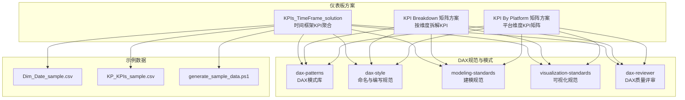
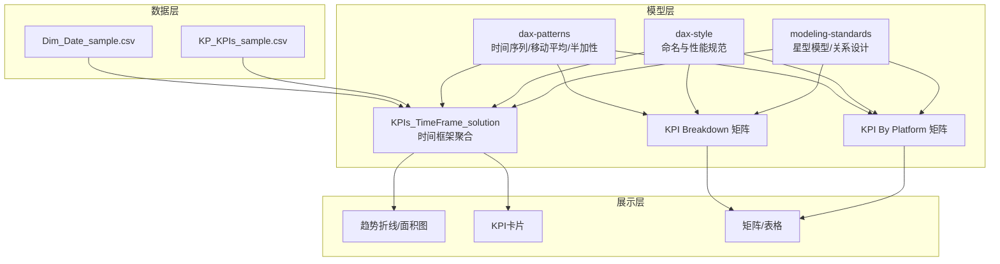
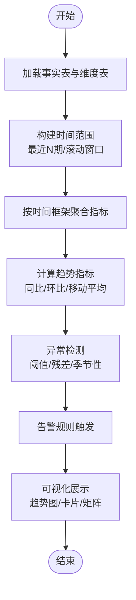
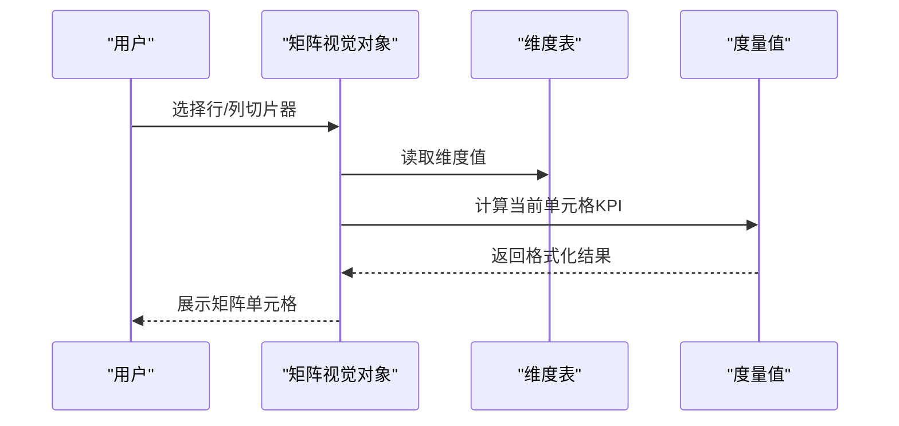
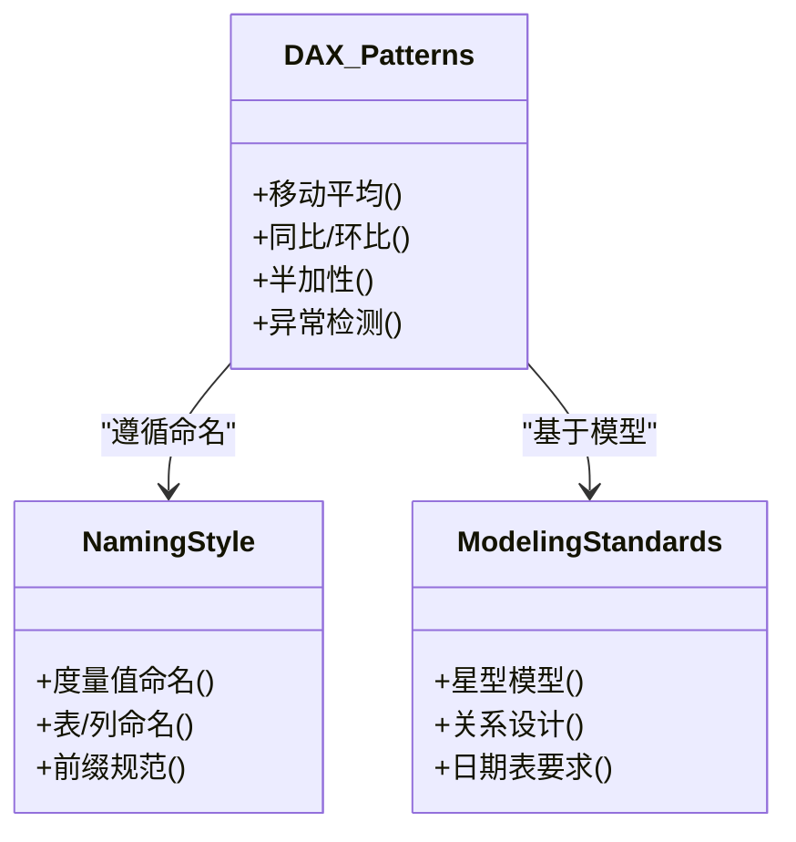
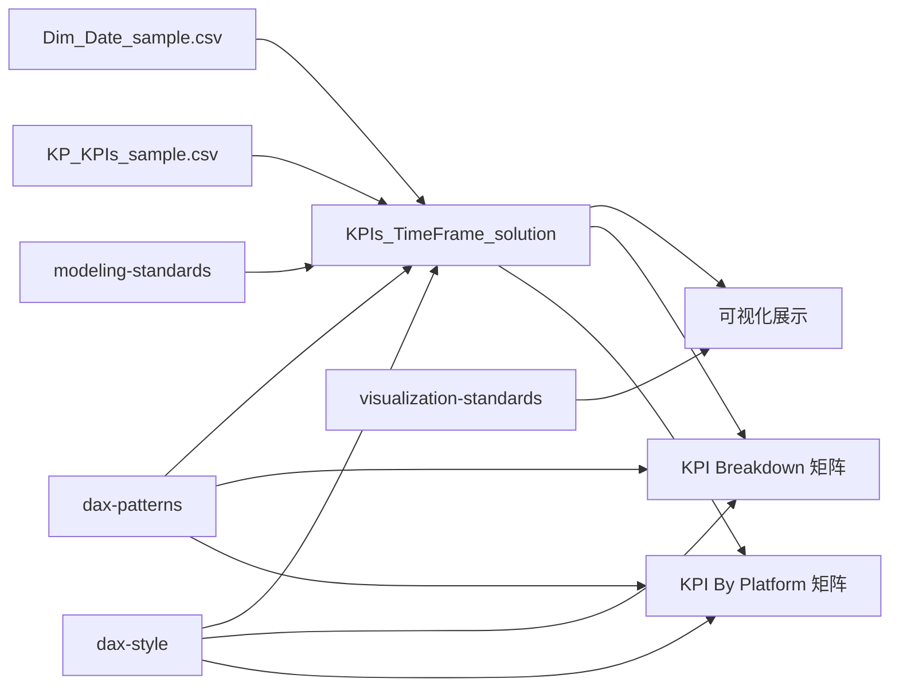

# 流量监控仪表板

<cite>
**本文引用的文件**
- [KPIs_TimeFrame_solution.md](file://RL E2E/RL E2E Traffic_Dashboard/kPIs/KPIs_TimeFrame_solution.md)
- [kpi_breakdown_matrix_solution.md](file://RL E2E/RL E2E Traffic_Dashboard/KPI Breakdown/kpi_breakdown_matrix_solution.md)
- [KPI By Platform_matrix_solution.md](file://RL E2E/RL E2E Traffic_Dashboard/KPI By Platform/KPI By Platform_matrix_solution.md)
- [dax-patterns.md](file://powerbi_code_copilot/knowledge/dax-patterns.md)
- [dax-style.md](file://powerbi_code_copilot/rules/dax-style.md)
- [modeling-standards.md](file://powerbi_code_copilot/rules/modeling-standards.md)
- [visualization-standards.md](file://powerbi_code_copilot/rules/visualization-standards.md)
- [dax-reviewer.md](file://powerbi_code_copilot/agents/dax-reviewer.md)
- [Dim_Date_sample.csv](file://powerbi_code_copilot/data/demo/powerbi_data/powerbi_traffic/Dim_Date_sample.csv)
- [KP_KPIs_sample.csv](file://powerbi_code_copilot/data/demo/powerbi_data/powerbi_traffic/KP_KPIs_sample.csv)
- [generate_sample_data.ps1](file://powerbi_code_copilot/data/demo/powerbi_data/powerbi_traffic/generate_sample_data.ps1)
</cite>

## 目录
1. [引言](#引言)
2. [项目结构](#项目结构)
3. [核心组件](#核心组件)
4. [架构总览](#架构总览)
5. [详细组件分析](#详细组件分析)
6. [依赖分析](#依赖分析)
7. [性能考量](#性能考量)
8. [故障排查指南](#故障排查指南)
9. [结论](#结论)
10. [附录](#附录)

## 引言
本文件面向“流量监控仪表板”的设计与实现，聚焦于实时流量监控与趋势分析，涵盖指标定义、时间框架分析、异常检测机制、KPIs_TimeFrame_solution 的实现逻辑（数据聚合、时间序列分析与可视化）、仪表板设计指南（关键指标选择、图表组合与交互）、以及基于 DAX 的流量趋势预测、异常值检测与告警思路。同时提供可操作的监控场景与配置示例，帮助用户快速落地。

## 项目结构
该仓库围绕 Power BI 仪表板与 DAX 实践组织内容，重点文件如下：
- 仪表板实现方案：KPIs_TimeFrame_solution、KPI Breakdown 矩阵方案、KPI By Platform 矩阵方案
- DAX 模式与规范：dax-patterns、dax-style、modeling-standards、visualization-standards、dax-reviewer
- 示例数据：Dim_Date_sample.csv、KP_KPIs_sample.csv、generate_sample_data.ps1

**图表来源**
- [KPIs_TimeFrame_solution.md](file://RL E2E/RL E2E Traffic_Dashboard/kPIs/KPIs_TimeFrame_solution.md)
- [kpi_breakdown_matrix_solution.md](file://RL E2E/RL E2E Traffic_Dashboard/KPI Breakdown/kpi_breakdown_matrix_solution.md)
- [KPI By Platform_matrix_solution.md](file://RL E2E/RL E2E Traffic_Dashboard/KPI By Platform/KPI By Platform_matrix_solution.md)
- [dax-patterns.md](file://powerbi_code_copilot/knowledge/dax-patterns.md)
- [dax-style.md](file://powerbi_code_copilot/rules/dax-style.md)
- [modeling-standards.md](file://powerbi_code_copilot/rules/modeling-standards.md)
- [visualization-standards.md](file://powerbi_code_copilot/rules/visualization-standards.md)
- [dax-reviewer.md](file://powerbi_code_copilot/agents/dax-reviewer.md)
- [Dim_Date_sample.csv](file://powerbi_code_copilot/data/demo/powerbi_data/powerbi_traffic/Dim_Date_sample.csv)
- [KP_KPIs_sample.csv](file://powerbi_code_copilot/data/demo/powerbi_data/powerbi_traffic/KP_KPIs_sample.csv)
- [generate_sample_data.ps1](file://powerbi_code_copilot/data/demo/powerbi_data/powerbi_traffic/generate_sample_data.ps1)

**章节来源**
- [KPIs_TimeFrame_solution.md](file://RL E2E/RL E2E Traffic_Dashboard/kPIs/KPIs_TimeFrame_solution.md)
- [kpi_breakdown_matrix_solution.md](file://RL E2E/RL E2E Traffic_Dashboard/KPI Breakdown/kpi_breakdown_matrix_solution.md)
- [KPI By Platform_matrix_solution.md](file://RL E2E/RL E2E Traffic_Dashboard/KPI By Platform/KPI By Platform_matrix_solution.md)
- [dax-patterns.md](file://powerbi_code_copilot/knowledge/dax-patterns.md)
- [dax-style.md](file://powerbi_code_copilot/rules/dax-style.md)
- [modeling-standards.md](file://powerbi_code_copilot/rules/modeling-standards.md)
- [visualization-standards.md](file://powerbi_code_copilot/rules/visualization-standards.md)
- [dax-reviewer.md](file://powerbi_code_copilot/agents/dax-reviewer.md)
- [Dim_Date_sample.csv](file://powerbi_code_copilot/data/demo/powerbi_data/powerbi_traffic/Dim_Date_sample.csv)
- [KP_KPIs_sample.csv](file://powerbi_code_copilot/data/demo/powerbi_data/powerbi_traffic/KP_KPIs_sample.csv)
- [generate_sample_data.ps1](file://powerbi_code_copilot/data/demo/powerbi_data/powerbi_traffic/generate_sample_data.ps1)

## 核心组件
- KPIs_TimeFrame_solution：提供按时间框架聚合的 KPI 计算与展示方案，强调数据聚合、时间序列分析与可视化。
- KPI Breakdown 矩阵方案：通过矩阵视觉对象与度量值组合，实现按维度拆解的 KPI 展示与格式化。
- KPI By Platform 矩阵方案：在平台维度上进行 KPI 矩阵展示，强调行列组合与筛选器上下文。
- DAX 模式库与规范：提供命名、性能、时间智能、半加性等 DAX 模式与编写规范，支撑仪表板实现。
- 建模与可视化规范：确保模型架构、关系设计与图表选型符合最佳实践。
- 示例数据：提供日期维度与 KPI 元数据样例，便于快速搭建与验证。

**章节来源**
- [KPIs_TimeFrame_solution.md](file://RL E2E/RL E2E Traffic_Dashboard/kPIs/KPIs_TimeFrame_solution.md)
- [kpi_breakdown_matrix_solution.md](file://RL E2E/RL E2E Traffic_Dashboard/KPI Breakdown/kpi_breakdown_matrix_solution.md)
- [KPI By Platform_matrix_solution.md](file://RL E2E/RL E2E Traffic_Dashboard/KPI By Platform/KPI By Platform_matrix_solution.md)
- [dax-patterns.md](file://powerbi_code_copilot/knowledge/dax-patterns.md)
- [dax-style.md](file://powerbi_code_copilot/rules/dax-style.md)
- [modeling-standards.md](file://powerbi_code_copilot/rules/modeling-standards.md)
- [visualization-standards.md](file://powerbi_code_copilot/rules/visualization-standards.md)
- [Dim_Date_sample.csv](file://powerbi_code_copilot/data/demo/powerbi_data/powerbi_traffic/Dim_Date_sample.csv)
- [KP_KPIs_sample.csv](file://powerbi_code_copilot/data/demo/powerbi_data/powerbi_traffic/KP_KPIs_sample.csv)
- [generate_sample_data.ps1](file://powerbi_code_copilot/data/demo/powerbi_data/powerbi_traffic/generate_sample_data.ps1)

## 架构总览
仪表板整体由“数据层（事实/维度）—模型层（DAX/关系）—展示层（矩阵/折线/卡片）”构成。KPIs_TimeFrame_solution 作为核心聚合层，结合 DAX 模式与可视化规范，输出趋势与对比视图；KPI Breakdown 与 KPI By Platform 提供多维拆解与平台对比能力。

**图表来源**
- [KPIs_TimeFrame_solution.md](file://RL E2E/RL E2E Traffic_Dashboard/kPIs/KPIs_TimeFrame_solution.md)
- [kpi_breakdown_matrix_solution.md](file://RL E2E/RL E2E Traffic_Dashboard/KPI Breakdown/kpi_breakdown_matrix_solution.md)
- [KPI By Platform_matrix_solution.md](file://RL E2E/RL E2E Traffic_Dashboard/KPI By Platform/KPI By Platform_matrix_solution.md)
- [dax-patterns.md](file://powerbi_code_copilot/knowledge/dax-patterns.md)
- [dax-style.md](file://powerbi_code_copilot/rules/dax-style.md)
- [modeling-standards.md](file://powerbi_code_copilot/rules/modeling-standards.md)
- [Dim_Date_sample.csv](file://powerbi_code_copilot/data/demo/powerbi_data/powerbi_traffic/Dim_Date_sample.csv)
- [KP_KPIs_sample.csv](file://powerbi_code_copilot/data/demo/powerbi_data/powerbi_traffic/KP_KPIs_sample.csv)

## 详细组件分析

### KPIs_TimeFrame_solution 实现逻辑
- 数据聚合：按时间框架（日/周/月/季度/年）对流量指标进行聚合，支持同比、环比与滚动窗口。
- 时间序列分析：利用时间智能函数构建日期范围，计算移动平均、同比/环比变化，识别趋势与周期性。
- 可视化展示：结合矩阵/折线/面积图展示 KPI 趋势，使用 KPI 卡片突出关键指标，支持切片器联动。

**图表来源**
- [KPIs_TimeFrame_solution.md](file://RL E2E/RL E2E Traffic_Dashboard/kPIs/KPIs_TimeFrame_solution.md)
- [dax-patterns.md](file://powerbi_code_copilot/knowledge/dax-patterns.md)

**章节来源**
- [KPIs_TimeFrame_solution.md](file://RL E2E/RL E2E Traffic_Dashboard/kPIs/KPIs_TimeFrame_solution.md)
- [dax-patterns.md](file://powerbi_code_copilot/knowledge/dax-patterns.md)

### KPI Breakdown 矩阵方案
- 矩阵天然笛卡尔积：行维度（KPI）与列维度（如门店/渠道）组合，无需桥接表。
- 自定义排序与格式：通过度量值与格式化开关，实现非字母序排序与差异化格式显示。
- 切片器联动：矩阵独立页面时，无需脚手架表即可完成筛选器上下文传递。

**图表来源**
- [kpi_breakdown_matrix_solution.md](file://RL E2E/RL E2E Traffic_Dashboard/KPI Breakdown/kpi_breakdown_matrix_solution.md)

**章节来源**
- [kpi_breakdown_matrix_solution.md](file://RL E2E/RL E2E Traffic_Dashboard/KPI Breakdown/kpi_breakdown_matrix_solution.md)

### KPI By Platform 矩阵方案
- 平台维度：将平台作为列维度，KPI 作为行维度，天然生成组合单元格。
- 无需脚手架：当前场景为全排列且矩阵独立页面，无需桥接表。
- 交互与格式：通过度量值与格式化规则，实现差异化展示与颜色映射。

**章节来源**
- [KPI By Platform_matrix_solution.md](file://RL E2E/RL E2E Traffic_Dashboard/KPI By Platform/KPI By Platform_matrix_solution.md)

### DAX 模式与实现要点
- 命名与性能：遵循命名前缀与性能优先原则，避免隐式度量值与过度嵌套 CALCULATE。
- 时间智能：使用 DATESINPERIOD、SAMEPERIODLASTYEAR 等函数构建时间范围与同比。
- 移动平均：通过 AVERAGEX 与日期范围计算滚动均值，平滑趋势。
- 半加性度量：库存/余额等快照类指标需取末日值而非累加。

**图表来源**
- [dax-patterns.md](file://powerbi_code_copilot/knowledge/dax-patterns.md)
- [dax-style.md](file://powerbi_code_copilot/rules/dax-style.md)
- [modeling-standards.md](file://powerbi_code_copilot/rules/modeling-standards.md)

**章节来源**
- [dax-patterns.md](file://powerbi_code_copilot/knowledge/dax-patterns.md)
- [dax-style.md](file://powerbi_code_copilot/rules/dax-style.md)
- [modeling-standards.md](file://powerbi_code_copilot/rules/modeling-standards.md)

### 仪表板设计指南
- 关键指标选择：优先选择可解释性强、业务价值高的 KPI（如流量、转化率、留存率）。
- 图表组合：趋势图（折线/面积）+ KPI 卡片 + 矩阵/表格，兼顾概览与细节。
- 交互设计：切片器固定位置、日期切片器使用范围类型、交叉高亮为主、适度交叉筛选。
- 可访问性：统一配色、足够对比度、避免仅依赖颜色传达信息。

**章节来源**
- [visualization-standards.md](file://powerbi_code_copilot/rules/visualization-standards.md)

### 实际监控场景与配置示例
- 场景一：实时流量监控
  - 指标：UV/PV、跳出率、平均停留时长
  - 时间框架：分钟级滚动窗口 + 日/周趋势
  - 可视化：折线图 + KPI 卡片 + 矩阵（按渠道/地区）
- 场景二：异常检测与告警
  - 方法：阈值告警（单边/双边）、Z-Score、残差回归
  - 触发：异常指标持续 N 期、幅度超阈值
  - 响应：邮件/IM 通知 + 仪表板高亮
- 场景三：趋势预测
  - 方法：时间序列分解（趋势+季节性+残差）、ARIMA（外部建议）、移动平均平滑
  - 输出：预测区间 + 置信度标注

**章节来源**
- [KPIs_TimeFrame_solution.md](file://RL E2E/RL E2E Traffic_Dashboard/kPIs/KPIs_TimeFrame_solution.md)
- [dax-patterns.md](file://powerbi_code_copilot/knowledge/dax-patterns.md)

## 依赖分析
- 组件耦合：KPIs_TimeFrame_solution 依赖日期维度与 KPI 元数据；矩阵方案依赖维度表与度量值。
- 外部依赖：示例数据（Dim_Date_sample.csv、KP_KPIs_sample.csv）用于快速搭建；Power BI 模型与 DAX 引擎。
- 规范约束：命名、建模与可视化规范确保可维护性与一致性。

**图表来源**
- [KPIs_TimeFrame_solution.md](file://RL E2E/RL E2E Traffic_Dashboard/kPIs/KPIs_TimeFrame_solution.md)
- [kpi_breakdown_matrix_solution.md](file://RL E2E/RL E2E Traffic_Dashboard/KPI Breakdown/kpi_breakdown_matrix_solution.md)
- [KPI By Platform_matrix_solution.md](file://RL E2E/RL E2E Traffic_Dashboard/KPI By Platform/KPI By Platform_matrix_solution.md)
- [dax-patterns.md](file://powerbi_code_copilot/knowledge/dax-patterns.md)
- [dax-style.md](file://powerbi_code_copilot/rules/dax-style.md)
- [modeling-standards.md](file://powerbi_code_copilot/rules/modeling-standards.md)
- [visualization-standards.md](file://powerbi_code_copilot/rules/visualization-standards.md)
- [Dim_Date_sample.csv](file://powerbi_code_copilot/data/demo/powerbi_data/powerbi_traffic/Dim_Date_sample.csv)
- [KP_KPIs_sample.csv](file://powerbi_code_copilot/data/demo/powerbi_data/powerbi_traffic/KP_KPIs_sample.csv)

**章节来源**
- [KPIs_TimeFrame_solution.md](file://RL E2E/RL E2E Traffic_Dashboard/kPIs/KPIs_TimeFrame_solution.md)
- [kpi_breakdown_matrix_solution.md](file://RL E2E/RL E2E Traffic_Dashboard/KPI Breakdown/kpi_breakdown_matrix_solution.md)
- [KPI By Platform_matrix_solution.md](file://RL E2E/RL E2E Traffic_Dashboard/KPI By Platform/KPI By Platform_matrix_solution.md)
- [dax-patterns.md](file://powerbi_code_copilot/knowledge/dax-patterns.md)
- [dax-style.md](file://powerbi_code_copilot/rules/dax-style.md)
- [modeling-standards.md](file://powerbi_code_copilot/rules/modeling-standards.md)
- [visualization-standards.md](file://powerbi_code_copilot/rules/visualization-standards.md)
- [Dim_Date_sample.csv](file://powerbi_code_copilot/data/demo/powerbi_data/powerbi_traffic/Dim_Date_sample.csv)
- [KP_KPIs_sample.csv](file://powerbi_code_copilot/data/demo/powerbi_data/powerbi_traffic/KP_KPIs_sample.csv)

## 性能考量
- 避免不必要的上下文转换与深层嵌套 CALCULATE。
- 使用 VAR 缓存中间结果，减少重复计算。
- 优先使用时间智能函数（如 DATESINPERIOD）与最小迭代表。
- 对大型事实表采用分区/增量刷新策略（建模规范建议）。

**章节来源**
- [dax-style.md](file://powerbi_code_copilot/rules/dax-style.md)
- [modeling-standards.md](file://powerbi_code_copilot/rules/modeling-standards.md)

## 故障排查指南
- 常见问题
  - 结果错误：检查上下文转换与 CALCULATE 参数。
  - 性能瓶颈：确认迭代函数在最小表上运行，避免隐式度量值。
  - 循环依赖：检查度量值间相互引用。
  - RLS 规则绕过：确保行级安全性配置正确。
- 工具与流程
  - 使用 DAX 质量评审工具进行分级审查与性能评估。
  - 逐步拆分复杂度量值，明确单一职责与可维护性。

**章节来源**
- [dax-reviewer.md](file://powerbi_code_copilot/agents/dax-reviewer.md)
- [dax-style.md](file://powerbi_code_copilot/rules/dax-style.md)

## 结论
通过 KPIs_TimeFrame_solution 与矩阵方案的组合，结合 DAX 模式与规范，可高效构建实时流量监控与趋势分析仪表板。建议优先落实关键指标、时间框架与可视化设计，再引入异常检测与预测机制，最终形成可运维、可扩展的监控体系。

## 附录
- 示例数据生成：使用 generate_sample_data.ps1 快速生成日期与 KPI 样例数据，便于本地验证与演示。
- 参考文件路径：见“本文引用的文件”。

**章节来源**
- [generate_sample_data.ps1](file://powerbi_code_copilot/data/demo/powerbi_data/powerbi_traffic/generate_sample_data.ps1)
- [Dim_Date_sample.csv](file://powerbi_code_copilot/data/demo/powerbi_data/powerbi_traffic/Dim_Date_sample.csv)
- [KP_KPIs_sample.csv](file://powerbi_code_copilot/data/demo/powerbi_data/powerbi_traffic/KP_KPIs_sample.csv)