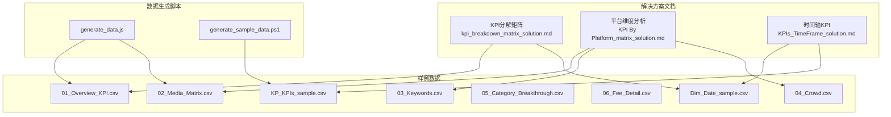
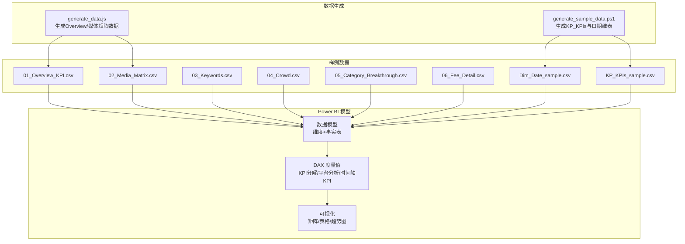
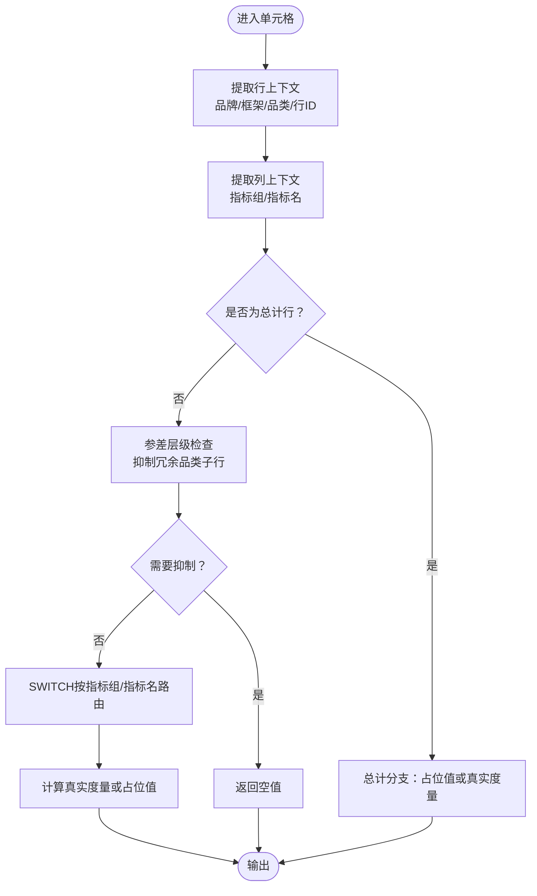
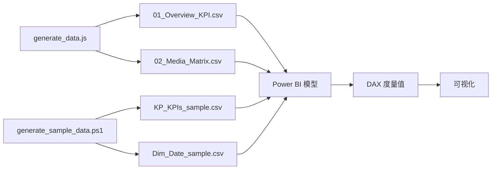

# 营销效果分析模块

<cite>
**本文引用的文件**
- [kpi_breakdown_matrix_solution.md](file://RL E2E/RL E2E Traffic_Dashboard/KPI Breakdown/kpi_breakdown_matrix_solution.md)
- [KPI By Platform_matrix_solution.md](file://RL E2E/RL E2E Traffic_Dashboard/KPI By Platform/KPI By Platform_matrix_solution.md)
- [KPIs_TimeFrame_solution.md](file://RL E2E/RL E2E Traffic_Dashboard/kPIs/KPIs_TimeFrame_solution.md)
- [generate_data.js](file://RL E2E/数据demo/powerbi_data/generate_data.js)
- [generate_sample_data.ps1](file://RL E2E/数据demo/powerbi_data/powerbi_traffic/generate_sample_data.ps1)
- [01_Overview_KPI.csv](file://RL E2E/数据demo/powerbi_data/01_Overview_KPI.csv)
- [02_Media_Matrix.csv](file://RL E2E/数据demo/powerbi_data/02_Media_Matrix.csv)
- [03_Keywords.csv](file://RL E2E/数据demo/powerbi_data/03_Keywords.csv)
- [04_Crowd.csv](file://RL E2E/数据demo/powerbi_data/04_Crowd.csv)
- [05_Category_Breakthrough.csv](file://RL E2E/数据demo/powerbi_data/05_Category_Breakthrough.csv)
- [06_Fee_Detail.csv](file://RL E2E/数据demo/powerbi_data/06_Fee_Detail.csv)
- [Dim_Date_sample.csv](file://RL E2E/数据demo/powerbi_data/powerbi_traffic/Dim_Date_sample.csv)
- [KP_KPIs_sample.csv](file://RL E2E/数据demo/powerbi_data/powerbi_traffic/KP_KPIs_sample.csv)
</cite>

## 目录
1. [引言](#引言)
2. [项目结构](#项目结构)
3. [核心组件](#核心组件)
4. [架构总览](#架构总览)
5. [详细组件分析](#详细组件分析)
6. [依赖分析](#依赖分析)
7. [性能考虑](#性能考虑)
8. [故障排除指南](#故障排除指南)
9. [结论](#结论)
10. [附录](#附录)

## 引言
本文件面向营销分析师与数据科学家，系统化梳理营销效果分析模块的端到端能力：KPI分解矩阵分析、平台维度分析、流量监控仪表板与成本效益分析。文档围绕以下主题展开：
- KPI分解矩阵：支持三级行维度（品牌/框架/品类）与两级列维度（指标组/指标名），覆盖参差层级与合计行的特殊处理。
- 平台维度分析：按渠道/媒体等平台维度进行KPI对比与趋势追踪。
- 流量监控仪表板：以时间序列与目标达成为核心，结合YoY对比与目标完成度。
- 成本效益分析：围绕成本、转化、客单价、ROI等关键指标，提供多口径评估框架。

同时，文档给出Power BI数据模型设计建议、度量值创建规范与可视化实现思路，并提供样例数据结构与分析流程，帮助快速落地。

## 项目结构
该模块主要由三部分构成：
- 解决方案文档：定义KPI分解矩阵、平台维度分析与时间轴KPI的DAX实现思路与数据血缘。
- 样例数据：包含Overview KPI、媒体矩阵、关键词、人群、品类突破、费用明细以及日期维表与KPI样本表。
- 数据生成脚本：提供JavaScript与PowerShell脚本，用于生成符合分析模型的数据集。

**图表来源**
- [kpi_breakdown_matrix_solution.md:1-710](file://RL E2E/RL E2E Traffic_Dashboard/KPI Breakdown/kpi_breakdown_matrix_solution.md#L1-L710)
- [KPI By Platform_matrix_solution.md](file://RL E2E/RL E2E Traffic_Dashboard/KPI By Platform/KPI By Platform_matrix_solution.md)
- [KPIs_TimeFrame_solution.md](file://RL E2E/RL E2E Traffic_Dashboard/kPIs/KPIs_TimeFrame_solution.md)
- [generate_data.js:96-129](file://RL E2E/数据demo/powerbi_data/generate_data.js#L96-L129)
- [generate_sample_data.ps1:76-105](file://RL E2E/数据demo/powerbi_data/powerbi_traffic/generate_sample_data.ps1#L76-L105)

**章节来源**
- [kpi_breakdown_matrix_solution.md:1-710](file://RL E2E/RL E2E Traffic_Dashboard/KPI Breakdown/kpi_breakdown_matrix_solution.md#L1-L710)
- [generate_data.js:96-129](file://RL E2E/数据demo/powerbi_data/generate_data.js#L96-L129)
- [generate_sample_data.ps1:76-105](file://RL E2E/数据demo/powerbi_data/powerbi_traffic/generate_sample_data.ps1#L76-L105)

## 核心组件
- KPI分解矩阵（多层级行×指标组×指标名列）
  - 行维度：品牌 > 框架 > 品类（含“总计”行，框架/品类在事实表中无对应值）
  - 列维度：指标组 > 指标名（如SLS、Cost MOB%、ROI、新客成本占比等）
  - 特性：参差层级（某些框架为叶节点，无品类子级）、合计行不带行筛选、格式差异化（百分比、数值、带图标）
- 平台维度分析（渠道/媒体）
  - 维度：渠道、媒体名称、是否小计/合计
  - 指标：成本、展现、点击、购物车、订单、GMV、CTR、CPC、CPA、CVR、AOV、ROI及YoY变化
- 时间轴KPI（目标达成与趋势）
  - 维度：日期（维表）
  - 指标：总成本、GMV、转化率、新客成本、目标完成度、YoY对比
- 成本效益分析（费用明细与ROI）
  - 维度：费用类别、货币、目标/实际对比
  - 指标：成本、GMV、ROI、CPA、CVR、CPM、CPA等

**章节来源**
- [kpi_breakdown_matrix_solution.md:12-30](file://RL E2E/RL E2E Traffic_Dashboard/KPI Breakdown/kpi_breakdown_matrix_solution.md#L12-L30)
- [KPI By Platform_matrix_solution.md](file://RL E2E/RL E2E Traffic_Dashboard/KPI By Platform/KPI By Platform_matrix_solution.md)
- [KPIs_TimeFrame_solution.md](file://RL E2E/RL E2E Traffic_Dashboard/kPIs/KPIs_TimeFrame_solution.md)
- [01_Overview_KPI.csv](file://RL E2E/数据demo/powerbi_data/01_Overview_KPI.csv)
- [02_Media_Matrix.csv](file://RL E2E/数据demo/powerbi_data/02_Media_Matrix.csv)
- [06_Fee_Detail.csv](file://RL E2E/数据demo/powerbi_data/06_Fee_Detail.csv)

## 架构总览
下图展示了从数据生成到Power BI建模与可视化的整体流程，以及各组件之间的依赖关系。

**图表来源**
- [generate_data.js:96-129](file://RL E2E/数据demo/powerbi_data/generate_data.js#L96-L129)
- [generate_sample_data.ps1:76-105](file://RL E2E/数据demo/powerbi_data/powerbi_traffic/generate_sample_data.ps1#L76-L105)
- [01_Overview_KPI.csv](file://RL E2E/数据demo/powerbi_data/01_Overview_KPI.csv)
- [02_Media_Matrix.csv](file://RL E2E/数据demo/powerbi_data/02_Media_Matrix.csv)
- [03_Keywords.csv](file://RL E2E/数据demo/powerbi_data/03_Keywords.csv)
- [04_Crowd.csv](file://RL E2E/数据demo/powerbi_data/04_Crowd.csv)
- [05_Category_Breakthrough.csv](file://RL E2E/数据demo/powerbi_data/05_Category_Breakthrough.csv)
- [06_Fee_Detail.csv](file://RL E2E/数据demo/powerbi_data/06_Fee_Detail.csv)
- [Dim_Date_sample.csv](file://RL E2E/数据demo/powerbi_data/powerbi_traffic/Dim_Date_sample.csv)
- [KP_KPIs_sample.csv](file://RL E2E/数据demo/powerbi_data/powerbi_traffic/KP_KPIs_sample.csv)

## 详细组件分析

### KPI分解矩阵分析
- 行维度与参差层级
  - 三级结构：品牌 > 框架 > 品类；当框架为叶节点时，品类子行应被抑制，避免冗余。
  - “总计”行不带事实表行筛选，且其列值来自占位计算，便于后续替换为真实度量。
- 列维度与格式化
  - 两级结构：指标组（如SLS、Cost MOB%、ROI、新客成本占比）> 指标名（如Total、直通车、引力魔方、全站推）。
  - 不同指标采用不同格式（百分比、数值、带图标），提升可读性。
- 计算逻辑与路由
  - 使用列上下文（指标组/指标名）进行SWITCH路由，将占位值映射到具体度量。
  - 叶节点与小计行采用不同的行ID取值策略（SELECTEDVALUE vs SUM）。
- 可视化要点
  - 行优先布局，列优先渲染；对合计行与参差层级进行显隐控制。

**图表来源**
- [kpi_breakdown_matrix_solution.md:231-366](file://RL E2E/RL E2E Traffic_Dashboard/KPI Breakdown/kpi_breakdown_matrix_solution.md#L231-L366)

**章节来源**
- [kpi_breakdown_matrix_solution.md:12-30](file://RL E2E/RL E2E Traffic_Dashboard/KPI Breakdown/kpi_breakdown_matrix_solution.md#L12-L30)
- [kpi_breakdown_matrix_solution.md:231-366](file://RL E2E/RL E2E Traffic_Dashboard/KPI Breakdown/kpi_breakdown_matrix_solution.md#L231-L366)

### 平台维度分析（渠道/媒体）
- 维度与指标
  - 维度：渠道、媒体名称、是否小计/合计标识。
  - 指标：成本、展现、点击、购物车、订单、GMV、CTR、CPC、CPA、CVR、AOV、ROI及其YoY变化。
- 数据来源
  - 媒体矩阵样例数据包含渠道、币种、媒体名称、是否小计/合计及各项指标。
- 分析方法
  - 按渠道/媒体聚合，计算转化链路关键指标，对比目标与实际，识别高价值渠道与低效媒体。
  - 结合YoY变化，评估媒体策略调整的效果。

**章节来源**
- [KPI By Platform_matrix_solution.md](file://RL E2E/RL E2E Traffic_Dashboard/KPI By Platform/KPI By Platform_matrix_solution.md)
- [02_Media_Matrix.csv](file://RL E2E/数据demo/powerbi_data/02_Media_Matrix.csv)

### 流量监控仪表板（时间轴KPI）
- 维度与指标
  - 维度：日期（维表），支持日/周/月粒度。
  - 指标：总成本、GMV、转化率、新客成本、目标完成度、YoY对比。
- 目标达成
  - 对比实际与目标，计算完成率与偏差，辅助运营决策。
- 趋势分析
  - 展示滚动窗口趋势与同比变化，识别周期性与异常波动。

**章节来源**
- [KPIs_TimeFrame_solution.md](file://RL E2E/RL E2E Traffic_Dashboard/kPIs/KPIs_TimeFrame_solution.md)
- [Dim_Date_sample.csv](file://RL E2E/数据demo/powerbi_data/powerbi_traffic/Dim_Date_sample.csv)
- [KP_KPIs_sample.csv](file://RL E2E/数据demo/powerbi_data/powerbi_traffic/KP_KPIs_sample.csv)

### 成本效益分析（费用明细与ROI）
- 维度与指标
  - 维度：费用类别、货币、目标/实际。
  - 指标：成本、GMV、ROI、CPA、CVR、CPM、CPA等。
- ROI框架
  - 总体ROI = GMV / 总成本；新客ROI = 新客GMV / 新客成本；平台ROI按渠道/媒体拆分。
- 效果对比
  - 渠道/媒体/关键词/人群维度对比，识别高贡献与低效资源，指导预算再分配。

**章节来源**
- [01_Overview_KPI.csv](file://RL E2E/数据demo/powerbi_data/01_Overview_KPI.csv)
- [06_Fee_Detail.csv](file://RL E2E/数据demo/powerbi_data/06_Fee_Detail.csv)

## 依赖分析
- 数据生成脚本与样例数据
  - JavaScript脚本负责生成Overview KPI与媒体矩阵数据；PowerShell脚本负责生成KP_KPIs与日期维表。
- Power BI模型依赖
  - KPI分解矩阵依赖行维度表与列指标表；平台分析依赖媒体矩阵与关键词/人群/品类突破数据；时间轴KPI依赖日期维表与KPI事实表。
- 度量值依赖
  - KPI分解矩阵的占位值需逐步替换为真实度量值，且需考虑合计行与参差层级的特殊处理。

**图表来源**
- [generate_data.js:96-129](file://RL E2E/数据demo/powerbi_data/generate_data.js#L96-L129)
- [generate_sample_data.ps1:76-105](file://RL E2E/数据demo/powerbi_data/powerbi_traffic/generate_sample_data.ps1#L76-L105)
- [01_Overview_KPI.csv](file://RL E2E/数据demo/powerbi_data/01_Overview_KPI.csv)
- [02_Media_Matrix.csv](file://RL E2E/数据demo/powerbi_data/02_Media_Matrix.csv)
- [KP_KPIs_sample.csv](file://RL E2E/数据demo/powerbi_data/powerbi_traffic/KP_KPIs_sample.csv)
- [Dim_Date_sample.csv](file://RL E2E/数据demo/powerbi_data/powerbi_traffic/Dim_Date_sample.csv)

**章节来源**
- [generate_data.js:96-129](file://RL E2E/数据demo/powerbi_data/generate_data.js#L96-L129)
- [generate_sample_data.ps1:76-105](file://RL E2E/数据demo/powerbi_data/powerbi_traffic/generate_sample_data.ps1#L76-L105)

## 性能考虑
- 数据规模与粒度
  - 日期维表与KPI事实表应保持合理粒度，避免过细导致查询膨胀；必要时引入汇总层。
- DAX计算优化
  - 使用WITH语句缓存中间变量，减少重复计算；对合计行与参差层级使用ISINSCOPE与BLANK抑制冗余计算。
- 可视化性能
  - 控制矩阵列数与行数，避免超大矩阵导致渲染卡顿；对高基数维度启用分页或筛选器。
- 数据刷新
  - 对高频更新的指标采用增量刷新策略，降低刷新时间。

## 故障排除指南
- 参差层级显示异常
  - 确认框架叶节点的品类子行已被抑制；检查合计行的路由逻辑是否正确。
- 合计行指标异常
  - 确保合计行不带行筛选条件；核对行ID取值策略（叶节点用SELECTEDVALUE，小计行用SUM）。
- 指标格式错乱
  - 检查列指标表中的格式字段配置；确保不同指标组/指标名采用相应格式。
- 数据缺失或不一致
  - 核对生成脚本输出字段与样例CSV字段一致性；确认日期维表与KPI事实表的关联键完整。

**章节来源**
- [kpi_breakdown_matrix_solution.md:266-272](file://RL E2E/RL E2E Traffic_Dashboard/KPI Breakdown/kpi_breakdown_matrix_solution.md#L266-L272)
- [generate_data.js:114-130](file://RL E2E/数据demo/powerbi_data/generate_data.js#L114-L130)
- [generate_sample_data.ps1:76-105](file://RL E2E/数据demo/powerbi_data/powerbi_traffic/generate_sample_data.ps1#L76-L105)

## 结论
本模块提供了从数据生成、Power BI建模到可视化呈现的一体化营销效果分析方案。通过KPI分解矩阵、平台维度分析、时间轴KPI与成本效益分析，能够支撑多维度的营销洞察与决策。建议在实际部署中：
- 以样例数据为基准，逐步替换为真实度量值；
- 严格遵循参差层级与合计行的处理规范；
- 结合业务目标设定动态阈值与预警机制；
- 持续迭代可视化与交互体验，提升分析效率。

## 附录

### Power BI数据模型设计建议
- 维度表
  - 日期维表：包含日、周、月等层级字段，支持灵活切片。
  - 行维度表：品牌、框架、品类及其排序字段，支持合计行与参差层级。
  - 列指标表：指标组、指标名、格式与排序字段。
- 事实表
  - Overview KPI：总成本、GMV、转化率、新客成本、目标完成度等。
  - 媒体矩阵：渠道、媒体、是否小计/合计及各项指标。
  - 关键词/人群/品类突破：用于平台分析与归因。
  - 费用明细：用于成本效益分析与ROI拆解。
- 度量值创建
  - 以KPI分解矩阵的占位值为基础，逐步替换为真实度量值；
  - 在平台分析中，按渠道/媒体聚合并计算转化链路指标；
  - 在时间轴KPI中，计算目标完成度与YoY变化。

**章节来源**
- [kpi_breakdown_matrix_solution.md:672-710](file://RL E2E/RL E2E Traffic_Dashboard/KPI Breakdown/kpi_breakdown_matrix_solution.md#L672-L710)
- [KPI By Platform_matrix_solution.md](file://RL E2E/RL E2E Traffic_Dashboard/KPI By Platform/KPI By Platform_matrix_solution.md)
- [KPIs_TimeFrame_solution.md](file://RL E2E/RL E2E Traffic_Dashboard/kPIs/KPIs_TimeFrame_solution.md)
- [01_Overview_KPI.csv](file://RL E2E/数据demo/powerbi_data/01_Overview_KPI.csv)
- [02_Media_Matrix.csv](file://RL E2E/数据demo/powerbi_data/02_Media_Matrix.csv)
- [03_Keywords.csv](file://RL E2E/数据demo/powerbi_data/03_Keywords.csv)
- [04_Crowd.csv](file://RL E2E/数据demo/powerbi_data/04_Crowd.csv)
- [05_Category_Breakthrough.csv](file://RL E2E/数据demo/powerbi_data/05_Category_Breakthrough.csv)
- [06_Fee_Detail.csv](file://RL E2E/数据demo/powerbi_data/06_Fee_Detail.csv)
- [Dim_Date_sample.csv](file://RL E2E/数据demo/powerbi_data/powerbi_traffic/Dim_Date_sample.csv)
- [KP_KPIs_sample.csv](file://RL E2E/数据demo/powerbi_data/powerbi_traffic/KP_KPIs_sample.csv)