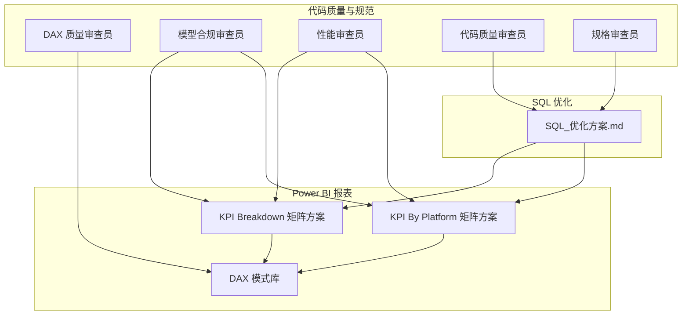
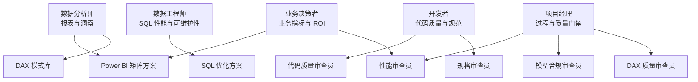
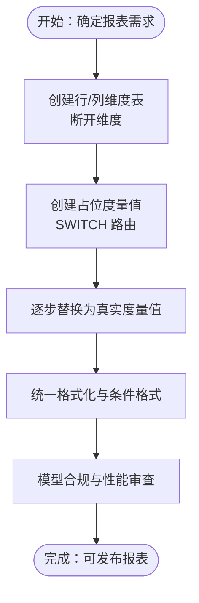
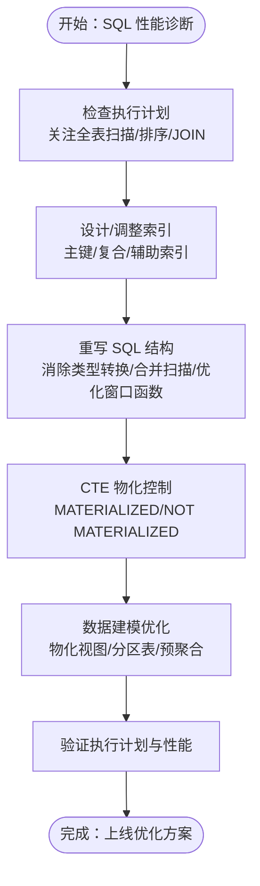
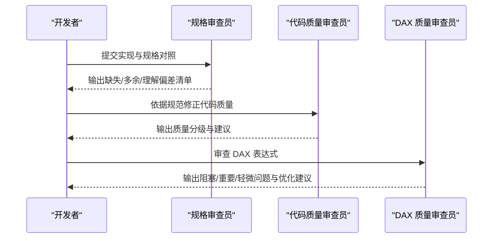
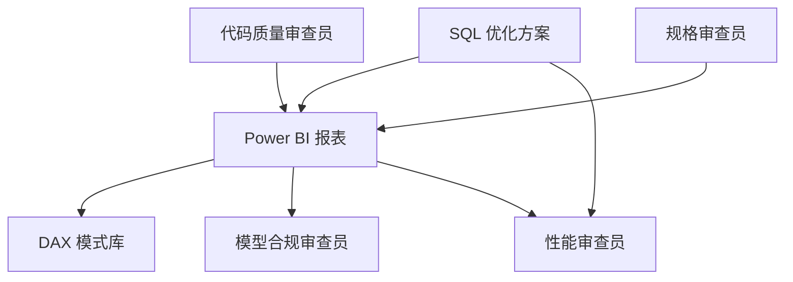

# 目标用户群体

<cite>
**本文档引用的文件**
- [SQL_优化方案.md](file://Quickbi_sql/MAP/我的门店/SQL_优化方案.md)
- [kpi_breakdown_matrix_solution.md](file://RL E2E/RL E2E Traffic_Dashboard/KPI Breakdown/kpi_breakdown_matrix_solution.md)
- [KPI By Platform_matrix_solution.md](file://RL E2E/RL E2E Traffic_Dashboard/KPI By Platform/KPI By Platform_matrix_solution.md)
- [dax-patterns.md](file://powerbi_code_copilot/knowledge/dax-patterns.md)
- [dax-reviewer.md](file://powerbi_code_copilot/agents/dax-reviewer.md)
- [model-reviewer.md](file://powerbi_code_copilot/agents/model-reviewer.md)
- [performance-reviewer.md](file://powerbi_code_copilot/agents/performance-reviewer.md)
- [code-quality-reviewer.md](file://code_copilot/agents/code-quality-reviewer.md)
- [spec-reviewer.md](file://code_copilot/agents/spec-reviewer.md)
</cite>

## 目录
1. [简介](#简介)
2. [项目结构](#项目结构)
3. [核心组件](#核心组件)
4. [架构总览](#架构总览)
5. [详细组件分析](#详细组件分析)
6. [依赖分析](#依赖分析)
7. [性能考量](#性能考量)
8. [故障排查指南](#故障排查指南)
9. [结论](#结论)
10. [附录](#附录)

## 简介
本文件面向 Qoder AI 项目的目标用户群体，结合仓库中的 SQL 优化、Power BI 报表与度量值开发、以及代码质量与规范审查能力，系统化梳理不同角色的需求、使用场景、期望价值与最佳实践。目标是帮助数据分析师、数据工程师、开发者、项目经理与业务决策者高效协作，围绕“数据洞察—报表呈现—代码质量—性能保障”形成闭环。

## 项目结构
仓库围绕三大主线组织内容：
- SQL 优化与性能调优：面向数据工程师与高级分析师，聚焦 ClickHouse/PostgreSQL 等引擎的 SQL 结构优化、索引设计与执行计划分析。
- Power BI 报表与度量值：面向数据分析师与 BI 工程师，提供矩阵式报表的断开维度 + 动态路由模式，支撑复杂的 KPI 展示与格式化。
- 代码质量与规范审查：面向开发者与技术负责人，提供 DAX/代码规范审查、模型合规审查与性能诊断工具链。

**图表来源**
- [SQL_优化方案.md:1-822](file://Quickbi_sql/MAP/我的门店/SQL_优化方案.md#L1-L822)
- [kpi_breakdown_matrix_solution.md:1-939](file://RL E2E/RL E2E Traffic_Dashboard/KPI Breakdown/kpi_breakdown_matrix_solution.md#L1-L939)
- [KPI By Platform_matrix_solution.md:1-609](file://RL E2E/RL E2E Traffic_Dashboard/KPI By Platform/KPI By Platform_matrix_solution.md#L1-L609)
- [dax-patterns.md:1-205](file://powerbi_code_copilot/knowledge/dax-patterns.md#L1-L205)
- [dax-reviewer.md:1-56](file://powerbi_code_copilot/agents/dax-reviewer.md#L1-L56)
- [model-reviewer.md:1-36](file://powerbi_code_copilot/agents/model-reviewer.md#L1-L36)
- [performance-reviewer.md:1-71](file://powerbi_code_copilot/agents/performance-reviewer.md#L1-L71)
- [code-quality-reviewer.md:1-13](file://code_copilot/agents/code-quality-reviewer.md#L1-L13)
- [spec-reviewer.md:1-25](file://code_copilot/agents/spec-reviewer.md#L1-L25)

**章节来源**
- [SQL_优化方案.md:1-822](file://Quickbi_sql/MAP/我的门店/SQL_优化方案.md#L1-L822)
- [kpi_breakdown_matrix_solution.md:1-939](file://RL E2E/RL E2E Traffic_Dashboard/KPI Breakdown/kpi_breakdown_matrix_solution.md#L1-L939)
- [KPI By Platform_matrix_solution.md:1-609](file://RL E2E/RL E2E Traffic_Dashboard/KPI By Platform/KPI By Platform_matrix_solution.md#L1-L609)
- [dax-patterns.md:1-205](file://powerbi_code_copilot/knowledge/dax-patterns.md#L1-L205)
- [dax-reviewer.md:1-56](file://powerbi_code_copilot/agents/dax-reviewer.md#L1-L56)
- [model-reviewer.md:1-36](file://powerbi_code_copilot/agents/model-reviewer.md#L1-L36)
- [performance-reviewer.md:1-71](file://powerbi_code_copilot/agents/performance-reviewer.md#L1-L71)
- [code-quality-reviewer.md:1-13](file://code_copilot/agents/code-quality-reviewer.md#L1-L13)
- [spec-reviewer.md:1-25](file://code_copilot/agents/spec-reviewer.md#L1-L25)

## 核心组件
- SQL 优化与索引设计：提供索引建议、CTE 物化控制、窗口函数优化、JOIN 改写等，显著降低扫描与排序成本。
- Power BI 矩阵报表：通过断开维度 + SWITCH 路由实现复杂 KPI 矩阵，支持多格式、颜色与图标条件格式。
- DAX 模式库：沉淀常用模式（累计求和、同比/环比、动态 Top N、ABC 分析、移动平均、半加性度量值），便于复用与一致性。
- 代码质量与规范审查：覆盖 DAX/代码质量、模型合规、性能诊断，确保实现与规格一致、可维护性强、性能可控。

**章节来源**
- [SQL_优化方案.md:20-800](file://Quickbi_sql/MAP/我的门店/SQL_优化方案.md#L20-L800)
- [kpi_breakdown_matrix_solution.md:35-51](file://RL E2E/RL E2E Traffic_Dashboard/KPI Breakdown/kpi_breakdown_matrix_solution.md#L35-L51)
- [KPI By Platform_matrix_solution.md:24-41](file://RL E2E/RL E2E Traffic_Dashboard/KPI By Platform/KPI By Platform_matrix_solution.md#L24-L41)
- [dax-patterns.md:5-205](file://powerbi_code_copilot/knowledge/dax-patterns.md#L5-L205)
- [dax-reviewer.md:5-52](file://powerbi_code_copilot/agents/dax-reviewer.md#L5-L52)
- [model-reviewer.md:6-32](file://powerbi_code_copilot/agents/model-reviewer.md#L6-L32)
- [performance-reviewer.md:5-67](file://powerbi_code_copilot/agents/performance-reviewer.md#L5-L67)
- [code-quality-reviewer.md:5-12](file://code_copilot/agents/code-quality-reviewer.md#L5-L12)
- [spec-reviewer.md:6-21](file://code_copilot/agents/spec-reviewer.md#L6-L21)

## 架构总览
Qoder AI 的用户角色与能力边界如下：
- 数据分析师：关注报表呈现、指标解读与可视化交互，强调“可用性与可解释性”。使用 Power BI 矩阵方案与 DAX 模式库，快速搭建 KPI 矩阵并进行格式化与条件格式。
- 数据工程师：关注 SQL 性能与可维护性，强调“稳定性与可扩展性”。使用 SQL 优化方案，完成索引设计、CTE 物化与执行计划分析。
- 开发者：关注代码质量与规范落地，强调“一致性与可演进性”。使用代码质量审查与规格审查，确保实现与规范一致。
- 项目经理：关注进度、质量门禁与交付节奏，强调“过程可见与风险可控”。通过审查员输出与性能诊断，把控关键里程碑。
- 业务决策者：关注业务指标与 ROI 分析，强调“价值与洞察”。通过矩阵报表与格式化指标，直观掌握关键趋势与差异。

**图表来源**
- [SQL_优化方案.md:701-730](file://Quickbi_sql/MAP/我的门店/SQL_优化方案.md#L701-L730)
- [kpi_breakdown_matrix_solution.md:35-51](file://RL E2E/RL E2E Traffic_Dashboard/KPI Breakdown/kpi_breakdown_matrix_solution.md#L35-L51)
- [KPI By Platform_matrix_solution.md:24-41](file://RL E2E/RL E2E Traffic_Dashboard/KPI By Platform/KPI By Platform_matrix_solution.md#L24-L41)
- [dax-patterns.md:1-205](file://powerbi_code_copilot/knowledge/dax-patterns.md#L1-L205)
- [dax-reviewer.md:1-56](file://powerbi_code_copilot/agents/dax-reviewer.md#L1-L56)
- [model-reviewer.md:1-36](file://powerbi_code_copilot/agents/model-reviewer.md#L1-L36)
- [performance-reviewer.md:1-71](file://powerbi_code_copilot/agents/performance-reviewer.md#L1-L71)
- [code-quality-reviewer.md:1-13](file://code_copilot/agents/code-quality-reviewer.md#L1-L13)
- [spec-reviewer.md:1-25](file://code_copilot/agents/spec-reviewer.md#L1-L25)

## 详细组件分析

### 数据分析师（Data Analyst）
- 需求与场景
  - 快速搭建 KPI 矩阵，支持多层级行/列与多种格式（百分比、货币、增减符号、图标）。
  - 通过断开维度 + SWITCH 路由，将占位值逐步替换为真实度量值，降低实现复杂度。
  - 使用 DAX 模式库中的常用模式（累计、同比/环比、动态 Top N、ABC 分析、移动平均、半加性度量值）提升一致性与可维护性。
- 关注重点
  - 可视化体验：矩阵排序、条件格式、图标与颜色一致性。
  - 指标准确性：度量值命名规范、上下文转换与时间智能函数使用。
- 能力要求与学习路径
  - 熟练使用 Power BI 的断开维度与 SELECTEDVALUE 上下文读取。
  - 掌握 DAX 基础语法与性能要点，参考性能审查员的诊断框架。
  - 学习 DAX 模式库，优先采用经验证的模式，减少重复造轮子。
- 使用案例与最佳实践
  - KPI Breakdown 矩阵：先创建行/列维度表与占位度量值，再逐步替换为真实度量值；注意 Total 行与参差层级的处理。
  - KPI By Platform 矩阵：通过 SWITCH 动态路由到不同子度量值，统一格式化与条件格式，确保跨平台对比的一致性。
  - DAX 模式：优先采用“累计求和、同比/环比、动态 Top N、ABC 分析、移动平均、半加性度量值”，并在性能审查员指导下优化。

**图表来源**
- [kpi_breakdown_matrix_solution.md:87-151](file://RL E2E/RL E2E Traffic_Dashboard/KPI Breakdown/kpi_breakdown_matrix_solution.md#L87-L151)
- [KPI By Platform_matrix_solution.md:85-122](file://RL E2E/RL E2E Traffic_Dashboard/KPI By Platform/KPI By Platform_matrix_solution.md#L85-L122)
- [dax-patterns.md:5-205](file://powerbi_code_copilot/knowledge/dax-patterns.md#L5-L205)
- [model-reviewer.md:6-32](file://powerbi_code_copilot/agents/model-reviewer.md#L6-L32)
- [performance-reviewer.md:5-67](file://powerbi_code_copilot/agents/performance-reviewer.md#L5-L67)

**章节来源**
- [kpi_breakdown_matrix_solution.md:12-66](file://RL E2E/RL E2E Traffic_Dashboard/KPI Breakdown/kpi_breakdown_matrix_solution.md#L12-L66)
- [KPI By Platform_matrix_solution.md:12-66](file://RL E2E/RL E2E Traffic_Dashboard/KPI By Platform/KPI By Platform_matrix_solution.md#L12-L66)
- [dax-patterns.md:1-205](file://powerbi_code_copilot/knowledge/dax-patterns.md#L1-L205)
- [dax-reviewer.md:5-52](file://powerbi_code_copilot/agents/dax-reviewer.md#L5-L52)
- [model-reviewer.md:6-32](file://powerbi_code_copilot/agents/model-reviewer.md#L6-L32)
- [performance-reviewer.md:5-67](file://powerbi_code_copilot/agents/performance-reviewer.md#L5-L67)

### 数据工程师（Data Engineer）
- 需求与场景
  - 面向大规模事实表的 SQL 查询优化，降低扫描与排序成本，提升执行效率。
  - 设计合理的索引与物化策略，平衡写入与查询开销。
  - 通过执行计划分析定位瓶颈，持续优化 CTE 与窗口函数。
- 关注重点
  - 索引设计：主键/复合索引、辅助索引与 dt 单列索引。
  - SQL 结构优化：消除类型转换、提升 MAX(dt) 子查询、合并重复扫描、优化窗口函数与 JOIN。
  - CTE 物化控制：NOT MATERIALIZED 与 MATERIALIZED 的选择策略。
- 能力要求与学习路径
  - 熟悉 PostgreSQL/ClickHouse 的执行计划与索引机制。
  - 掌握 CTE 物化与查询重写技巧，参考 SQL 优化方案中的建议。
  - 学习分区与预聚合策略，降低扫描范围与计算量。
- 使用案例与最佳实践
  - 门店分析排名 SQL：先消除 dt::date 类型转换，再将 MAX(dt) 提升为独立 CTE，合并重复扫描，优化窗口函数与 JOIN。
  - 应用层优化：参数化查询、动态 SQL 拼接、结果缓存与分页优化。
  - 数据建模：创建物化视图或分区表，定期刷新，平衡实时性与性能。

**图表来源**
- [SQL_优化方案.md:701-730](file://Quickbi_sql/MAP/我的门店/SQL_优化方案.md#L701-L730)
- [SQL_优化方案.md:325-345](file://Quickbi_sql/MAP/我的门店/SQL_优化方案.md#L325-L345)
- [SQL_优化方案.md:733-791](file://Quickbi_sql/MAP/我的门店/SQL_优化方案.md#L733-L791)

**章节来源**
- [SQL_优化方案.md:3-17](file://Quickbi_sql/MAP/我的门店/SQL_优化方案.md#L3-L17)
- [SQL_优化方案.md:20-71](file://Quickbi_sql/MAP/我的门店/SQL_优化方案.md#L20-L71)
- [SQL_优化方案.md:75-255](file://Quickbi_sql/MAP/我的门店/SQL_优化方案.md#L75-L255)
- [SQL_优化方案.md:325-345](file://Quickbi_sql/MAP/我的门店/SQL_优化方案.md#L325-L345)
- [SQL_优化方案.md:733-791](file://Quickbi_sql/MAP/我的门店/SQL_优化方案.md#L733-L791)

### 开发者（Developer）
- 需求与场景
  - 确保代码与规格一致，避免过度工程化与理解偏差。
  - 通过代码质量审查与规格审查，提升可维护性与安全性。
  - 在 DAX/SQL 两端协同，保证报表与后端逻辑一致。
- 关注重点
  - 代码质量：异常处理、参数校验、命名规范、方法长度与命名清晰度。
  - 规格合规：功能点逐条验证，缺失/多余/理解偏差的识别与修正。
  - 安全性：避免 SQL 注入与 DAX 上下文转换错误。
- 能力要求与学习路径
  - 熟练掌握代码质量审查与规格审查流程，参考审查员职责与输出格式。
  - 学习 DAX 质量审查要点，关注上下文转换、迭代函数与时间智能函数。
  - 掌握性能审查员的诊断框架，从数据源、Power Query、模型、DAX、可视化五个层面进行优化。
- 使用案例与最佳实践
  - DAX 质量审查：优先修复阻塞性问题（计算错误、上下文转换错误、循环依赖），再处理重要/轻微问题。
  - 规格审查：逐条对照 spec，输出“已实现/未实现/实现偏差”的结论与证据。
  - 性能审查：从查询折叠、关系方向、变量复用、时间智能函数等方面入手，制定优化路线图。

**图表来源**
- [spec-reviewer.md:6-21](file://code_copilot/agents/spec-reviewer.md#L6-L21)
- [code-quality-reviewer.md:5-12](file://code_copilot/agents/code-quality-reviewer.md#L5-L12)
- [dax-reviewer.md:5-52](file://powerbi_code_copilot/agents/dax-reviewer.md#L5-L52)

**章节来源**
- [spec-reviewer.md:1-25](file://code_copilot/agents/spec-reviewer.md#L1-L25)
- [code-quality-reviewer.md:1-13](file://code_copilot/agents/code-quality-reviewer.md#L1-L13)
- [dax-reviewer.md:1-56](file://powerbi_code_copilot/agents/dax-reviewer.md#L1-L56)

### 项目经理（PM）
- 需求与场景
  - 关注项目进度、质量门禁与交付节奏，确保关键里程碑按时达成。
  - 通过审查员输出与性能诊断，识别风险并推动解决。
- 关注重点
  - 质量门禁：规格合规、模型合规、性能达标。
  - 风险控制：阻塞性问题优先处理，制定优化路线图。
- 能力要求与学习路径
  - 理解审查员职责与输出格式，学会从“结论/问题清单/优化路线图”中提取关键信息。
  - 结合性能审查员的分级评估，判断整体健康度与优先优化项。
- 使用案例与最佳实践
  - 每周评审：查看 DAX/模型/性能审查输出，跟踪阻塞性问题解决进展。
  - 里程碑评审：以“规格合规结论”与“性能评估摘要”作为验收依据。

**章节来源**
- [performance-reviewer.md:40-67](file://powerbi_code_copilot/agents/performance-reviewer.md#L40-L67)
- [model-reviewer.md:20-32](file://powerbi_code_copilot/agents/model-reviewer.md#L20-L32)
- [dax-reviewer.md:36-52](file://powerbi_code_copilot/agents/dax-reviewer.md#L36-L52)

### 业务决策者（Business Decision Maker）
- 需求与场景
  - 关注业务指标与 ROI 分析，强调“价值与洞察”。
  - 通过矩阵报表与格式化指标，直观掌握关键趋势与差异。
- 关注重点
  - 指标口径：确保度量值命名与业务含义一致，避免歧义。
  - 可视化呈现：统一格式、颜色与图标，提升可读性与可解释性。
- 能力要求与学习路径
  - 理解报表背后的 DAX 逻辑与数据模型，避免误读。
  - 关注性能审查员的评估摘要，确保报表响应速度满足日常使用。
- 使用案例与最佳实践
  - ROI 与达成率：通过 KPI By Platform 矩阵，对比不同平台/店铺的 ROI 与达成情况。
  - 趋势分析：利用 DAX 模式库中的“累计求和/同比/环比/移动平均”，观察趋势与波动。

**章节来源**
- [KPI By Platform_matrix_solution.md:12-66](file://RL E2E/RL E2E Traffic_Dashboard/KPI By Platform/KPI By Platform_matrix_solution.md#L12-L66)
- [dax-patterns.md:32-77](file://powerbi_code_copilot/knowledge/dax-patterns.md#L32-L77)
- [performance-reviewer.md:43-47](file://powerbi_code_copilot/agents/performance-reviewer.md#L43-L47)

## 依赖分析
- 组件耦合与协作
  - Power BI 报表依赖 DAX 模式库与审查员输出，确保度量值一致性与性能可控。
  - SQL 优化方案为报表提供稳定的数据源与索引基础，减少查询延迟。
  - 代码质量与规格审查贯穿开发流程，确保实现与规范一致。
- 外部依赖与集成点
  - Power BI 与数据源（ClickHouse/PostgreSQL）的查询折叠与增量刷新配置。
  - DAX 层面的时间智能函数与上下文转换，需与日期表/关系方向配合。

**图表来源**
- [kpi_breakdown_matrix_solution.md:35-51](file://RL E2E/RL E2E Traffic_Dashboard/KPI Breakdown/kpi_breakdown_matrix_solution.md#L35-L51)
- [KPI By Platform_matrix_solution.md:24-41](file://RL E2E/RL E2E Traffic_Dashboard/KPI By Platform/KPI By Platform_matrix_solution.md#L24-L41)
- [dax-patterns.md:1-205](file://powerbi_code_copilot/knowledge/dax-patterns.md#L1-L205)
- [model-reviewer.md:6-32](file://powerbi_code_copilot/agents/model-reviewer.md#L6-L32)
- [performance-reviewer.md:5-67](file://powerbi_code_copilot/agents/performance-reviewer.md#L5-L67)
- [SQL_优化方案.md:701-730](file://Quickbi_sql/MAP/我的门店/SQL_优化方案.md#L701-L730)
- [code-quality-reviewer.md:1-13](file://code_copilot/agents/code-quality-reviewer.md#L1-L13)
- [spec-reviewer.md:1-25](file://code_copilot/agents/spec-reviewer.md#L1-L25)

**章节来源**
- [kpi_breakdown_matrix_solution.md:35-51](file://RL E2E/RL E2E Traffic_Dashboard/KPI Breakdown/kpi_breakdown_matrix_solution.md#L35-L51)
- [KPI By Platform_matrix_solution.md:24-41](file://RL E2E/RL E2E Traffic_Dashboard/KPI By Platform/KPI By Platform_matrix_solution.md#L24-L41)
- [SQL_优化方案.md:701-730](file://Quickbi_sql/MAP/我的门店/SQL_优化方案.md#L701-L730)

## 性能考量
- 数据源层：关注查询折叠是否生效、数据源响应延迟与数据量是否合理。
- Power Query 层：避免阻断查询折叠的步骤，合理使用数据类型与合并/追加操作。
- 模型层：控制表的基数与大小、关系数量与复杂度，移除未使用列/表，选择合适的分区策略。
- DAX 层：评估度量值复杂度、迭代函数数据量、上下文转换开销、变量复用程度与时间智能函数优化。
- 可视化层：控制单页视觉对象数量、高基数列在切片器中的使用与条件格式/动态标题的计算开销。

**章节来源**
- [performance-reviewer.md:5-67](file://powerbi_code_copilot/agents/performance-reviewer.md#L5-L67)

## 故障排查指南
- 常见问题与定位
  - 执行计划异常：Seq Scan 过多、Sort 未命中索引、Hash Join 代价过高。
  - DAX 上下文转换错误：CALCULATE/EARLIER 滥用、筛选器泄漏、循环依赖。
  - 模型关系问题：关系方向错误、交叉筛选、双向筛选未明确理由。
- 处理建议
  - SQL：优先消除类型转换与模糊匹配，合并重复扫描，优化窗口函数与 JOIN，合理物化 CTE。
  - DAX：避免不必要的上下文转换，优化迭代函数与时间智能函数，利用变量避免重复计算。
  - 模型：遵循星型/雪花模型，确保事实表与维度表分离，检查关系方向与筛选传播。

**章节来源**
- [SQL_优化方案.md:701-730](file://Quickbi_sql/MAP/我的门店/SQL_优化方案.md#L701-L730)
- [dax-reviewer.md:7-34](file://powerbi_code_copilot/agents/dax-reviewer.md#L7-L34)
- [model-reviewer.md:12-18](file://powerbi_code_copilot/agents/model-reviewer.md#L12-L18)

## 结论
Qoder AI 通过“SQL 优化—Power BI 报表—代码质量与规范审查—性能保障”的闭环体系，为不同角色提供了清晰的能力边界与协作路径。数据分析师与业务决策者可借助矩阵报表与格式化指标快速获得洞察；数据工程师与开发者通过规范与审查工具确保实现质量与性能；项目经理通过门禁与评估摘要把控风险与进度。建议在团队内固化审查流程与模式库，持续优化与复用，提升整体交付效率与质量。

## 附录
- DAX 常用模式清单（节选）
  - 累计求和、同比/环比、动态 Top N、ABC 分析、移动平均、半加性度量值
- 审查员职责与输出格式
  - DAX 质量审查员：阻塞/重要/轻微问题分级与性能评估摘要
  - 模型合规审查员：模型结构验证与度量值逐条验证
  - 性能审查员：整体评级、问题清单与优化路线图
  - 代码质量审查员：质量分级与工具权限约束
  - 规格审查员：功能点逐条验证与结论

**章节来源**
- [dax-patterns.md:5-205](file://powerbi_code_copilot/knowledge/dax-patterns.md#L5-L205)
- [dax-reviewer.md:36-52](file://powerbi_code_copilot/agents/dax-reviewer.md#L36-L52)
- [model-reviewer.md:20-32](file://powerbi_code_copilot/agents/model-reviewer.md#L20-L32)
- [performance-reviewer.md:40-67](file://powerbi_code_copilot/agents/performance-reviewer.md#L40-L67)
- [code-quality-reviewer.md:5-12](file://code_copilot/agents/code-quality-reviewer.md#L5-L12)
- [spec-reviewer.md:14-21](file://code_copilot/agents/spec-reviewer.md#L14-L21)